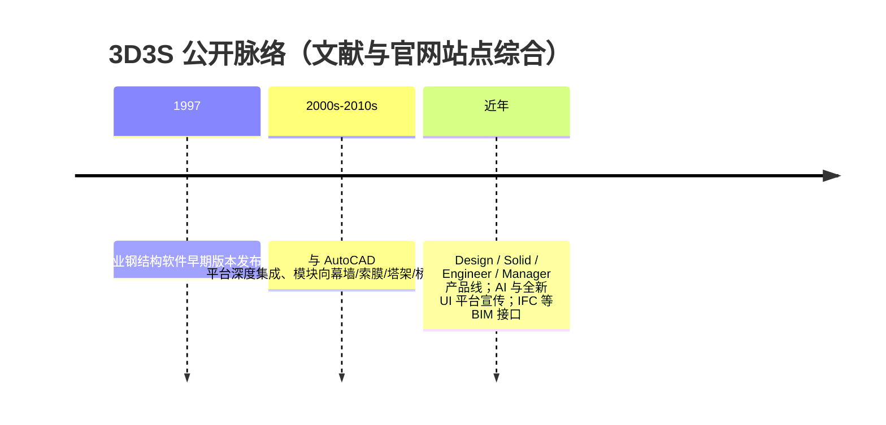
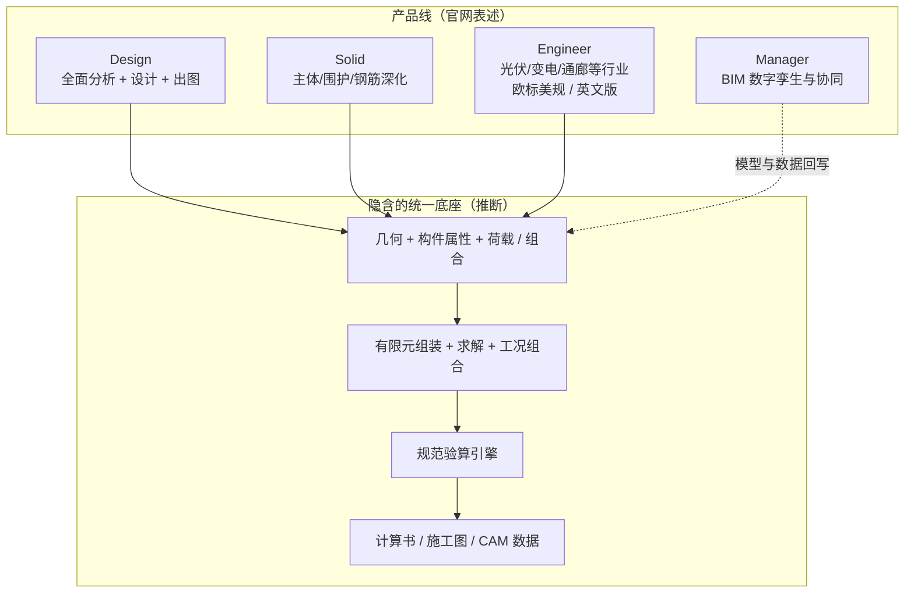

# 3D3S 有限元计算架构深度分析

> 文档日期：2026-05-14  
> 上承：[01-全球三维有限元软件对标调研](../01-全球三维有限元软件对标调研-2026-05-14.md) · [02-有限元通用底座架构-从挡土墙开始](../02-有限元通用底座架构-从挡土墙开始-2026-05-14.md)  
> 文档目的：  
> 1. 在「国产结构软件 / 空间钢结构 / 索膜」语境下，从**架构与设计权衡**角度解构 3D3S 的有限元与计算链路，而非撰写操作手册。  
> 2. 区分**公开资料可证实**与**工程化推断**（厂商未公开内核实现细节处，明确标注为推断）。  
> 3. 对照 hy-cad-tool 的 CAD—几何—分析协同方向，提炼可借鉴与应规避的模式。

---

## 一、为何把 3D3S 当作「架构样本」

3D3S 在全球通用 FEA（ANSYS、ABAQUS 等）语境下市占率不高，但在**中国钢结构、空间网格、索膜、幕墙、塔架、光伏支架**等细分赛道长期存在，且与 **AutoCAD 生态、国标验算、施工图一体化**深度绑定。对自研工具而言，它的价值不在于「求解器是否达到世界最前沿」，而在于：

| 观察点 | 含义 |
|--------|------|
| **产品线切分** | Design（全流程分析与设计）/ Solid（深化）/ Engineer（行业专版 + 欧标美规）/ Manager（BIM 协同）——体现「同一几何内核 + 多业务壳层」的典型商业化拆分 |
| **单元与物理取舍** | 公开资料多次表述为**杆系 + 膜板壳**主导的三维结构分析，而非通用实体连续体 FEA —— 决定了矩阵规模、非线性路径与后处理形态 |
| **「找形 + 施工全过程」** | 索膜与张力结构的**形态确定与施工模拟**与常规建筑 SATWE 类程序关注点不同 —— 是独立的**分析子管线** |
| **多模型并行** | 多高层模块中恒载用用户模型、整体指标用刚性楼板、地震用连梁折减等 —— **同一项目的多抽象模型**叠加，是建筑类软件的通用架构负担 |

下文默认读者已熟悉 01 文档「九维度对标」与 02 文档「分析流水线 / IR 解耦」叙事。

---

## 二、沿革与组织形态（公开信息）

**研发与经营主体**：公开资料普遍表述为**同济大学相关研发团队**与**上海同磊土木工程技术有限公司**（及关联品牌站点）共同推进产品迭代。对架构分析的影响是：学术背景（空间结构、钢结构理论）与工程交付（出图、计算书、行业模块）双轨驱动 —— 功能树深度往往优于「纯通用求解器」在国际规范上的广度，但**内核公开论文 / 开源代码极稀缺**。

---

## 三、产品线与「计算」在商业价值中的位置

**架构结论（产品层）**：

- **Design** 是观察「有限元计算架构」的最佳切口：分析、非线性与多工况、舒适度与时程、性能设计、节点验算均聚集于此。  
- **Solid** 更偏 **Design 模型向下游的深化与钢筋表达**，计算复用多于新造求解器。  
- **Engineer** 将 **地域规范（欧标/美规）** 与 **行业模板** 封装为可售卖单元 —— 对应 02 文档中的 `ICodeCheckerRegistry`、多规范并行策略。  
- **Manager** 说明长期商业路径是 **BIM / 数字孪生剧本**，有限元单次求解在总价值链中只是中间态数据。

---

## 四、有限元内核：单元、自由度与问题类型

### 4.1 单元体系（公开手册类表述）

综合行业转载的使用手册与百科类公开描述，3D3S 的**离散化主路径**可概括为：

| 类别 | 单元形态（公开表述） | 典型工程对象 |
|------|---------------------|--------------|
| 杆系 | 杆、梁/柱单元、**索** | 框架、桁架、网架网壳索杆体系 |
| 面膜壳 | 三角形/四边形**壳**、三角形**膜** | 屋面、幕墙板、膜面 |

**架构含义**：

- 刚度矩阵以**梁杆 + 壳膜**稀疏组装为主；自由度规模通常为 **O(10⁴~10⁶)** 级（单体建筑或中等索膜），与通用实体 FEA 的 **O(10⁷+)** 体网格不在同一赛道。  
- **索与膜**引入**几何非线性、预张力、找形**：这不是「在牛顿迭代里多跑几步」的增量问题，往往需要**单独的形态分析 / 施工阶段分析**编排（见第五节）。

### 4.2 与「多高层建筑」相关的多模型策略（功能描述级）

第三方功能介绍与厂商材料中，多高层模块典型做法是：

- **恒载等工况**：贴近用户真实 **三维用户模型**；  
- **层间位移与整体指标**：可采用 **刚性楼板** 简化；  
- **地震作用**：可采用 **连梁折减** 等符合国标的建模假设；  
- **位移与内力**：可按规范要求在 **不同抽象模型** 间切换或组合。

这在架构上等同于：**同一项目并存多套 Graph / Mesh 视图**，在 **IR 层** 必须记录「本结果是哪套抽象下得到的」，否则合规审计与施工图对不上 —— 与 hy-cad-tool 若做 **DWG/hyob → 分析** 时「**语义标签 + 模型版本**」强相关。

---

## 五、分析子管线：线性、非线性、找形与时程

### 5.1 线性静力与模态（推断为主）

对以梁壳膜为主的规模，行业常规是 **稀疏直接法（如多前端 LDLᵀ）** 或 **Krylov 迭代 + 预处理**；模态用 **子空间迭代 / Lanczos**。  
**除非厂商白皮书给出库名**，本文不指定具体数值库，仅标记为**与 PKPM/YJK 同代的合理工程推断**（参见 01 文档阵营 D 小结）。

### 5.2 非线性：杆系与张力体系

公开资料明确提到 **杆系非线性**、**预张力结构找形**及 **施工过程模拟**。架构上通常拆为：

1. **荷载控制 / 弧长法 / 增量Newton** 等路径（细节不详，属推断）；  
2. **初始形态与索膜预张力** 可能需要 **反演或迭代找形** —— 与 ANSYS/ABAQUS 的通用非线性相比，**业务编排深度绑定**（施工顺序、张拉步）。  
3. **光伏支架**等模块公开表述同时支持 **刚性支架线性分析** 与 **柔性支架非线性初始态 / 荷载态** —— 说明 IR 层存在 **`AnalysisPhase`（初始形态 / 荷载态）** 一类字段。

### 5.3 地震与时程、舒适度

功能层面公开信息：多高层支持 **地震时程**、**风振舒适度**、**楼板舒适度**；另有 **桥梁人致舒适度** 等专项。架构上对应：

- **时间积分**（Newmark 类）+ **阻尼模型** + **波输入**；  
- 与 SAP2000 / MIDAS 类似，**前处理友好性**（导波、组合、云图）是卖点，**积分器本身**未必自研到科研级别。

### 5.4 性能设计（中震/大震弹性或不屈服）

属于 **荷载组合与构件验算规则** 对接 **非线性或等效线性结果** 的一层；计算架构上主要是 **结果后处理管道** 与 **规范状态机**，而非新单元公式。

---

## 六、从建模到施工图：端到端数据流（概念架构）

**与通用 FEA（ABAQUS / ADINA）的对比**：

| 维度 | 通用大型 FEA | 3D3S（推断 + 公开功能描述） |
|------|--------------|---------------------------|
| 几何来源 | 中立 CAD / 自研前处理 | **强依赖 AutoCAD 交互习惯** |
| 物理覆盖 | 实体、接触、多物理 | **杆系 + 膜壳主导** |
| 合规 | 通用材料与边界 | **国标 + 行业规程深度内置** |
| 交付物 | 云图、报告 | **计算书 + 工厂/工地可用的施工图与加工数据** |

对 hy-cad-tool：**若定位为「设计院所交付」而非「科研求解器」**，3D3S 证明 **「求解器中等先进 + 出图与规范极厚」** 仍可占据细分赛道。

---

## 七、与国产 SATWE / 盈建科 / SAP2000 的架构站位

| 对比轴 | PKPM SATWE / YJK | 3D3S | SAP2000 / ETABS |
|--------|------------------|------|-----------------|
| **默认用户** | 混凝土多高层 / 常规民用 | 钢结构、空间结构、索膜、幕墙、塔架、光伏 | 国际通用结构 |
| **单元重心** | 墙元 / 壳 + 杆系（因产品而异） | **杆 + 索 + 膜壳** 特征极强 | 杆壳 + 实体可选 |
| **找形 / 索膜** | 非核心 | **核心卖点之一** | 有通用大位移非线性但工作流不如索膜专用软件顺口 |
| **规范** | GB 绝对主导 | GB + 大量行标；Engineer 扩展欧标美规 | 美标欧标强；国标依赖本地化 |
| **开放 API** | 弱 | 弱（公开信息） | Open API 相对成熟 |

**结论**：3D3S 更接近 **「CSI + 索膜/空间结构专版 + 国产化规」** 的混合体，而不是第二个 SATWE。

---

## 八、BIM、IFC 与「Manager」对计算架构的外溢

公开功能描述中出现 **IFC 导出**、**实体模型碰撞**、**与其它软件数据对接接口**。架构影响：

- 有限元 **理想化线面模型** 与 BIM **实体 / LOD** 之间需要 **映射层**（与 hy-cad-tool 的 `hyob`、增量几何存储议题同构）。  
- Manager 强调 **设计—生产—施工协同**，则 **求解作业** 可能逐步变为 **云端批处理 / 版本化快照**（推断），本地 AutoCAD 更重 **编辑与制图**。

---

## 九、对 hy-cad-tool 的设计启示（对齐 02 文档语言）

1. **IR 必须容纳「多抽象模型」**  
   同一 GUID 构件在 **用户几何 / 刚性楼板 / 折减连梁** 等分析视图下的差异，需要 **显式 provenance**，否则无法复现 3D3S 类软件的合规叙事。

2. **索膜 / 找形是独立 `Stage`，不要塞进单一 `StaticStep`**  
   与通用 `FemProblem` 相比，宜预留 **`FormFindingStep` / `ConstructionStage`** 或等价枚举，驱动不同初始应力与刚度更新策略。

3. **单元插件边界**  
   若自研底座以 **hy-cad-tool** 的钢结构导出为主线，**优先级应是：空间梁杆 + 壳膜 + 索**，而非一上来追实体接触全物理。

4. **交付层与计算层解耦**  
   Word 计算书、DWG 图层、相贯 **CAM** 数据是 **Presentation + Infrastructure**；核心 **Domain** 应只存 **可验证的数值与工况 ID**。

5. **能力边界诚实**  
   3D3S 的成功不在「全面碾压 ABAQUS」，而在 **细分行业工作流 + 国标护城河** —— 自研工具应 **窄域打穿** 再考虑扩张。

---

## 十、已知局限与未公开部分（方法论声明）

以下内容 **在缺少厂商内核白皮书或逆向工程的前提下无法证实**，仅列作后续调研清单：

- 稀疏求解器具体实现（自研 vs Intel MKL / MUMPS 等）；  
- 非线性牛顿迭代的线搜索 / 弧长法细节；  
- 是否大规模使用 MPI / GPU（Manager / 云平台路线若为真，可能存在批处理并行）；  
- 与 **ReCall 类热重载 AutoCAD 插件** 同进程时的内存与句柄策略（与 hy-cad-tool 运行时无关但属集成风险）。

**写作原则**：以上未证实点不臆造具体库名与算法参数；以 **架构块与数据流** 描述为主。

---

## 十一、参考文献与线索（公开 Web）

- 3D3S 官网产品线介绍：`https://www.3d3s.tech/`（Design / Solid / Engineer / Manager）  
- 功能模块第三方汇总（多高层、桁架、塔架、光伏支架等）：行业软件信息站转载（如软服之家等页面，需交叉核对版本时效）  
- 百科类条目「3D3S」：软件定位、1997 年起源、杆系与膜壳单元、找形与非线性等概括性描述  

---

**版本**：1.0 | **归档**：`docs/FiniteElement/43-3D3S有限元计算架构深度分析-2026-05-14.md`
