## 文档定位

> 文档日期:2026-05-15
> 上承:[001-自研通用FEA的第一性原则重审-30年积累vs150年开源-2026-05-15](../Research/001-自研通用FEA的第一性原则重审-30年积累vs150年开源-2026-05-15.md)
> 上承:[00-hy-cad-tool有限元方向总纲-基于17份调研的决策树与路线图-2026-05-15](../Research/00-hy-cad-tool有限元方向总纲-基于17份调研的决策树与路线图-2026-05-15.md)
> 性质:**对 001 文档"6 层技术资产"中 L2 算法实现层的深度学习与工程化展开**

001 文档把通用 FEA 求解器拆成 6 层,得出如下关键判断:

> **L2 算法实现**(稀疏矩阵存储 CSR/CSC/COO、域分解 METIS、接触搜索 R-tree/k-d tree、Delaunay 网格、advancing front)= **2-3 年(工程实现)** = **1-3 人年(论文 + 开源参考实现都现成)**

这个结论是**整个 001 文档"30 年积累可被追赶"论证的最关键支撑**。但它本身**没有展开**——一句话说"1-3 人年就能做完",凭什么?

本文档要把 L2 层**彻底拆开**:**5 个核心算法各是什么、数学原理、工程实现要点、开源参考、性能预算、hy-cad-tool 接入方案**。读完后,任何一个有限元工程师应该能回答:

1. **CSR/CSC/COO 三种存储为什么必须共存?**(不是"哪个最好",而是"哪个适合哪个阶段")
2. **METIS 为什么是图分割而不是空间分割?**(背后是稀疏矩阵带宽优化的对偶)
3. **接触搜索的 Broad / Narrow 两阶段是什么意思?**(R-tree 与 k-d tree 各管哪一阶段)
4. **Delaunay 与 advancing front 网格谁先谁后,谁更适合 hy-cad-tool?**
5. **这 5 个算法加起来 1-3 人年的预算,具体怎么花?**

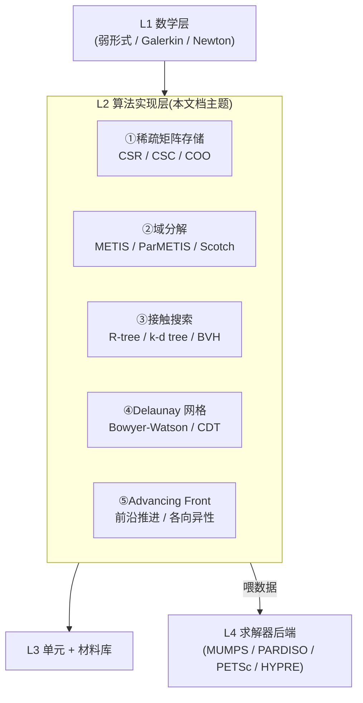

| L2 子算法 | 论文最早 | 标杆开源 | 工程量 | hy-cad-tool 接入档位 |
|----------|---------|---------|--------|---------------------|
| **稀疏矩阵 CSR/CSC/COO** | 1973(Tinney-Walker) | CSparse(Davis), SuiteSparse, Eigen | **0.2-0.5 人年** | **P0 自研 + CSparse.NET 双轨** |
| **域分解 METIS** | 1995(Karypis-Kumar) | METIS / ParMETIS / Scotch | **0.3-0.6 人年** | **P3 接 METIS.NET** |
| **接触搜索** | 1990s+(Belytschko/Benson) | bullet / OpenSim / FCL / CGAL | **0.5-1.0 人年** | **P2 自研 broad-phase + CGAL 子进程 narrow-phase** |
| **Delaunay** | 1934(Delaunay)+1981(Bowyer-Watson) | Triangle / Triangle.NET / CGAL / TetGen | **0.2-0.5 人年** | **P2 直接用 Triangle.NET** |
| **Advancing Front** | 1980s(Lo/Peraire) | Gmsh / Netgen | **0.3-0.5 人年** | **P3 接 Gmsh 子进程** |
| **小计** | | | **1.5-3.1 人年** | **与 001 文档预算一致** |

---

## 一、L2 层第一性原则:它在 FEA 求解器中的位置

### 1.1 一个完整 FEA 求解 pipeline 中,L2 出现在哪里?

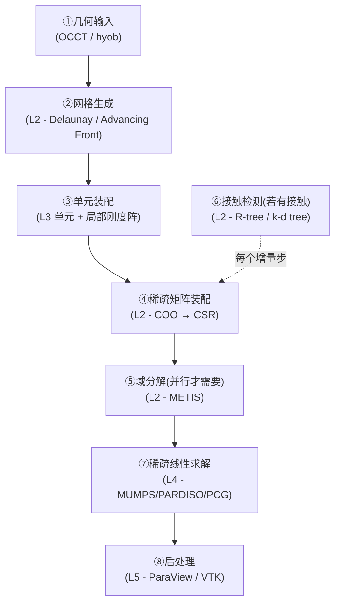

| 阶段 | 算法 | 数据吞吐 | 关键瓶颈 |
|------|------|----------|---------|
| ②网格生成 | Delaunay / Advancing Front | 输入 100~1M 节点 | **节点插入 O(log n) 查询** |
| ④稀疏装配 | COO → CSR | 输入 10~100M 非零项 | **去重 + 排序 O(nnz log nnz)** |
| ⑤域分解 | METIS K-way | 输入 1~100M DOF 图 | **多级粗化 O(\|E\| log \|V\|)** |
| ⑥接触检测 | R-tree broad-phase | 每步 O(n²) 候选 | **必须降到 O(n log n)** |

**L2 层的核心使命**:**把 O(n²) 的朴素操作降到 O(n log n) 或 O(n),否则一切 FEA 计算都跑不起来**。

### 1.2 为什么 L2 是"实现层"而不是"数学层"?

| 维度 | L1 数学层 | L2 算法实现层 | L3 单元库 |
|------|-----------|---------------|-----------|
| **本质** | 定理 / 弱形式 / 收敛性 | **数据结构 + 算法工程** | 物理模型 + 边角 case |
| **典型问题** | "Galerkin 收敛吗?" | **"CSR 比 COO 快多少倍?"** | "SHELL181 在大转动下沙漏怎么修?" |
| **公开度** | 论文一发就公共 | **论文 + 标准开源代码** | 商业内部经验 |
| **可学性** | 数月-1 年(博士课) | **数周-数月(SE+CS)** | 数年(实战) |
| **抄写难度** | 中(数学严谨) | **低(已有参考实现)** | 高(细节累积) |

> **第一性洞察**:L2 层是**"已有标准答案"的题目**,论文给数学、开源给代码、博士论文给基准测试集。任何一个有 CS+SE 背景的工程师,**在 3-6 个月里可以从零写出一个生产级的稀疏矩阵 / k-d tree / Delaunay 模块**——只要他愿意读 Davis、Karypis、Shewchuk、Geuzaine 这几本书/论文。

### 1.3 5 个算法的统一视角:**都是空间数据结构问题**

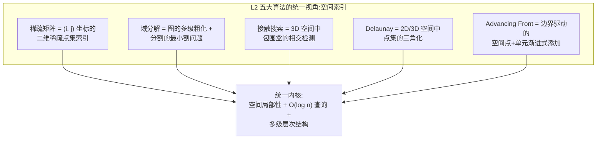

| 算法 | 抽象层次 | 实际数据结构 | 通用思想 |
|------|---------|-------------|---------|
| 稀疏矩阵 | 二维点集 | CSR(行压缩) / CSC(列压缩) | **行/列局部性** |
| 域分解 | 图 + 顶点权 | 邻接表 + 多级粗化 | **多分辨率层次** |
| 接触搜索 | 3D 包围盒集合 | R-tree / k-d tree / BVH | **空间分桶 + 树状裁剪** |
| Delaunay | 2D/3D 点集 | DCEL + 双向链表 | **局部翻边 / 增量插入** |
| Advancing Front | 边界 + 内部点 | 优先队列 + 八叉树查询 | **边界驱动 + 邻近搜索** |

**5 个算法本质上都是"空间数据结构 + 局部性优化"问题**。掌握 1 个,可以借同样的思维迁移到其他 4 个——这是 L2 层"1-3 人年"预算的真正底气。

---

## 二、稀疏矩阵存储:CSR / CSC / COO

### 2.1 为什么有限元矩阵必须稀疏

考虑一个**最简单的 3D 实体网格**:

| 规模 | 节点数 | DOF 数(每节点 3) | 稠密矩阵内存 | 稀疏矩阵内存 |
|------|--------|------------------|--------------|--------------|
| 小型 | 1 万 | 3 万 | **(3万)² × 8B ≈ 7.2 GB** | ~10 MB |
| 中型 | 10 万 | 30 万 | **720 GB(不可能)** | ~100 MB |
| 大型 | 100 万 | 300 万 | **72 TB(不可能)** | ~1 GB |
| 工程 | 1000 万 | 3000 万 | **7.2 PB** | ~10 GB |

**结论**:**FEA 矩阵稀疏不是优化,是物理刚需**。任何 1 万节点以上的模型用稠密矩阵都跑不起来。

**为什么稀疏?**因为有限元的**局部支持性**:

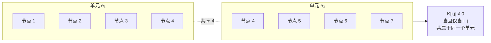

对一个 8 节点六面体单元,每个节点最多与同单元的 7 个节点耦合 + 邻居单元的若干节点 → **每行平均约 30-60 个非零项**,而矩阵总列数可能是百万级。**稀疏度通常在 99.99% 以上**。

### 2.2 三种存储格式的本质对照

#### 2.2.1 COO(Coordinate Format,坐标格式)

最直白的格式:**每个非零项保存(行号, 列号, 值)三元组**。

```text
矩阵:
[10  0  0  0]
[ 0 20 30  0]
[ 0  0  0 40]
[50  0 60  0]

COO 存储(假设 nnz = 6):
row = [0, 1, 1, 2, 3, 3]
col = [0, 1, 2, 3, 0, 2]
val = [10, 20, 30, 40, 50, 60]
```

| 特性 | 评价 |
|------|------|
| 内存占用 | **3 × nnz × 8B**(双精度) |
| 装配 | **O(1) 追加**,FEA 装配阶段的最爱 |
| 随机访问 K[i,j] | **O(nnz) 线性扫描**,慢 |
| 重复项处理 | **支持重复**(同 (i,j) 多个值会自动相加,正好匹配 FEA 装配语义) |
| 矩阵-向量乘 (SpMV) | 慢(无行连续性) |
| 适用阶段 | **装配阶段 + 文件交换格式(.mtx)** |

#### 2.2.2 CSR(Compressed Sparse Row,行压缩)

**最常用格式**,SpMV 与求解器后端的默认输入。

```text
同样的矩阵:
row_ptr = [0, 1, 3, 4, 6]   长度 n_rows + 1
col_idx = [0, 1, 2, 3, 0, 2] 长度 nnz
val     = [10, 20, 30, 40, 50, 60]

row_ptr[i] 给出第 i 行在 col_idx/val 中的起始位置
row_ptr[i+1] 给出结束位置
```

| 特性 | 评价 |
|------|------|
| 内存占用 | **(n_rows+1)×8B + nnz×(4B+8B) ≈ 12 nnz B**(假设 int32 索引) |
| 装配 | **O(nnz) 一次性构建**,不适合增量装配 |
| 行扫描 | **极快 O(nnz/行)**,SpMV 主用 |
| 列扫描 | 慢 |
| SpMV 性能 | **最佳**,内存连续,SIMD 友好 |
| 适用阶段 | **求解阶段所有迭代法(CG/GMRES/AMG)的默认输入** |

#### 2.2.3 CSC(Compressed Sparse Column,列压缩)

CSR 的"列版本":

```text
col_ptr = [0, 2, 3, 5, 6]   长度 n_cols + 1
row_idx = [0, 3, 1, 1, 3, 2] 长度 nnz
val     = [10, 50, 20, 30, 60, 40]
```

| 特性 | 评价 |
|------|------|
| 内存占用 | 同 CSR |
| 列扫描 | **极快** |
| 列消元(LU 分解) | **最佳**,直接法的默认 |
| 转置 = CSR | **CSR 转 CSC 等价于矩阵转置** |
| 适用阶段 | **直接法 LU 分解(MUMPS、UMFPACK、SuperLU、PARDISO 都用 CSC)** |

### 2.3 三格式工作流图

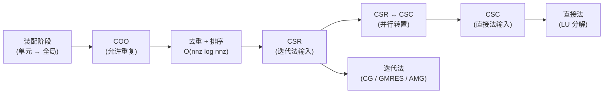

**这就是为什么 FEA 内核必须同时支持三种格式**——不是"哪个最好",而是**装配用 COO、迭代用 CSR、直接法用 CSC**,任何一个生产级 FEA 软件都必须实现三者之间的高效转换。

### 2.4 .NET 工程实现要点

#### 2.4.1 数据结构骨架(C#)

```csharp
namespace HyCADTool.Features.Fem.LinearAlgebra;

public sealed class SparseMatrixCOO
{
    public int Rows { get; }
    public int Cols { get; }
    public List<int> RowIdx { get; } = new();
    public List<int> ColIdx { get; } = new();
    public List<double> Values { get; } = new();

    public void Add(int i, int j, double v)
    {
        RowIdx.Add(i);
        ColIdx.Add(j);
        Values.Add(v);
    }

    public SparseMatrixCSR ToCSR()
    {
        int nnz = Values.Count;
        var order = Enumerable.Range(0, nnz)
            .OrderBy(k => RowIdx[k]).ThenBy(k => ColIdx[k])
            .ToArray();

        var rowPtr = new int[Rows + 1];
        var colIdx = new int[nnz];
        var values = new double[nnz];

        int writePos = 0;
        int currentRow = -1;
        for (int k = 0; k < nnz; k++)
        {
            int src = order[k];
            int r = RowIdx[src];
            int c = ColIdx[src];
            double v = Values[src];

            if (writePos > 0 && colIdx[writePos - 1] == c && rowPtr[r] == writePos - 1)
            {
                values[writePos - 1] += v;
                continue;
            }

            while (currentRow < r) rowPtr[++currentRow] = writePos;
            colIdx[writePos] = c;
            values[writePos] = v;
            writePos++;
        }
        while (currentRow < Rows) rowPtr[++currentRow] = writePos;

        return new SparseMatrixCSR(Rows, Cols, rowPtr, colIdx[..writePos], values[..writePos]);
    }
}

public sealed class SparseMatrixCSR
{
    public int Rows { get; }
    public int Cols { get; }
    public int[] RowPtr { get; }
    public int[] ColIdx { get; }
    public double[] Values { get; }
    public int NonZeroCount => Values.Length;

    public SparseMatrixCSR(int rows, int cols, int[] rowPtr, int[] colIdx, double[] values)
    {
        Rows = rows; Cols = cols;
        RowPtr = rowPtr; ColIdx = colIdx; Values = values;
    }

    public void SpMV(ReadOnlySpan<double> x, Span<double> y)
    {
        for (int i = 0; i < Rows; i++)
        {
            double sum = 0;
            int rs = RowPtr[i], re = RowPtr[i + 1];
            for (int k = rs; k < re; k++)
                sum += Values[k] * x[ColIdx[k]];
            y[i] = sum;
        }
    }
}
```

#### 2.4.2 性能关键点

| 优化 | 收益 | 复杂度 |
|------|------|--------|
| **预估 nnz 容量** | 避免 List 扩容 | 简单 |
| **int32 vs int64 索引** | int32 省 50% 索引内存(模型 < 21 亿 nnz) | 简单 |
| **CSR SpMV SIMD 化**(`Vector<double>`) | 1.5-3× 加速 | 中等 |
| **CSR SpMV 并行**(`Parallel.For`) | 4-8× 加速(8 核) | 中等 |
| **SoA 而非 AoS** | 缓存友好 | 简单 |
| **行重排(Cuthill-McKee)** | 带宽降低 → SpMV 缓存命中率提升 | 中等 |
| **块稀疏(BSR)** | 3×3 块(力学三 DOF/节点)展开 → SIMD 友好,5-10× | **较难,P2 远期** |

#### 2.4.3 与 CSparse.NET 双轨

CSparse.NET(Tim Davis 原版 C 移植)已实现 CSR/CSC/COO + UMFPACK 风格直接法,**MIT 协议**,**hy-cad-tool 应直接引用**,自研格式作为"教学版 + 调试版":

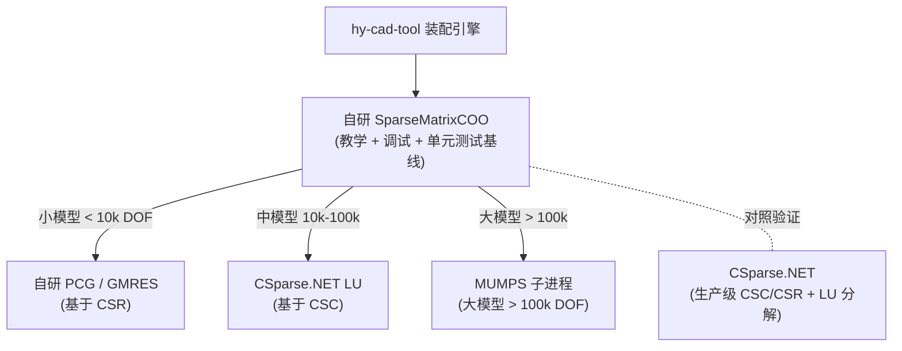

### 2.5 开源参考实现清单

| 项目 | 语言 | 协议 | hy-cad-tool 用途 |
|------|------|------|------------------|
| **CSparse**(Tim Davis 原版) | C | LGPL | 教科书级参考,推荐先读 [《Direct Methods for Sparse Linear Systems》(Davis 2006)](https://epubs.siam.org/doi/book/10.1137/1.9780898718881) |
| **CSparse.NET** | C# | MIT | **直接引用**,作为后备求解器 |
| **SuiteSparse**(Davis 大全套) | C | 多协议 | 桥接,UMFPACK / CHOLMOD / KLU 等 |
| **Eigen Sparse Module** | C++ template | MPL2 | P/Invoke,中型模型直接法 |
| **MKL Sparse BLAS** | Intel 闭源(免费商用) | 商业 | P/Invoke,生产级 SpMV |
| **PETSc Mat** | C | BSD2 | 子进程或桥接,大规模并行 |

### 2.6 算法层 0.2-0.5 人年的具体花法

| 工时 | 任务 | 验收 |
|------|------|------|
| 1 周 | 读 Davis 第 2-4 章 + 1 篇基础综述 | 能在白纸上写出 CSR→CSC 转置算法 |
| 1 周 | 自研 COO + CSR + CSC + 互转 | 单元测试 100% 覆盖 |
| 1 周 | SpMV + 并行 + SIMD | 性能在中型矩阵上 ≥ Eigen 60% |
| 1 周 | Cuthill-McKee 重排 | 带宽减少 50% 以上的基准案例 |
| 2 周 | 集成 CSparse.NET + 双轨验证 | 与自研结果误差 < 1e-12 |
| 2 周 | 装配阶段的高效 COO 实现(预分配 + 块装配) | 100 万单元装配 < 10 秒 |
| 2 周 | 文档 + 单元测试 + 基准 | CI 通过 |

**合计 ≈ 10 周 = 0.2 人年**,完成"自研可用 + 已对接 CSparse.NET"两条线。

---

## 三、域分解:METIS / 图分割

### 3.1 为什么需要域分解?

**FEA 并行的根本难题**:**全局刚度矩阵 K 不是可以简单切分的稠密块**。

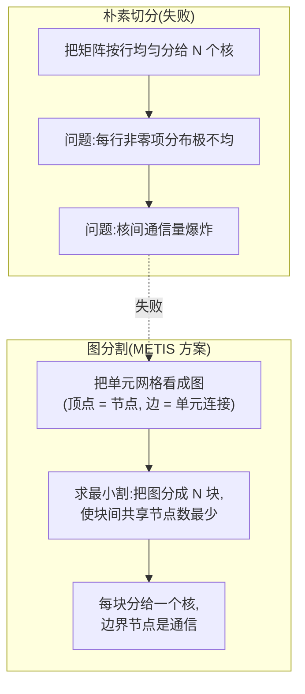

**目标**:把网格分成 N 个"子域",满足:

1. **负载均衡**:每个子域单元数 ≈ 总单元数 / N
2. **接口最小**:子域之间共享节点(接口)总数最少 → MPI 通信最小
3. **快速生成**:O(\|V\| + \|E\|) 量级,不能比求解器本身慢

### 3.2 METIS 三大家族

| 家族 | 论文 | 算法 | 适用场景 |
|------|------|------|---------|
| **METIS**(Karypis-Kumar 1995) | [SIAM J. Sci. Comput.](https://glaros.dtc.umn.edu/gkhome/metis/metis/overview) | **多级递归二分(MLRB)** + **K-way refinement** | 串行,1M 节点级 |
| **ParMETIS** | Karypis 1998 | **并行 MLRB** | MPI 大规模,100M 节点级 |
| **Scotch**(François Pellegrini) | INRIA | **递归二分 + 局部精化** | 替代品,LGPL 协议 |

### 3.3 多级图分割算法(Multilevel Graph Partitioning)

METIS 的精华是**"先粗化再精化"**:

```mermaid
graph TB
    G0["G₀: 原始图 1M 顶点"]
    G1["G₁: 粗化 → 500k 顶点"]
    G2["G₂: 粗化 → 100k 顶点"]
    G3["G₃: 粗化 → 1k 顶点"]
    P3["P₃: 在最粗图上分割<br/>(暴力算法可行)"]
    P2["P₂: 解粗化 + 局部精化"]
    P1["P₁: 解粗化 + 局部精化"]
    P0["P₀: 最终分割结果"]

    G0 -->|粗化| G1
    G1 -->|粗化| G2
    G2 -->|粗化| G3
    G3 --> P3
    P3 --> P2
    P2 --> P1
    P1 --> P0
```

**三个阶段**:

| 阶段 | 算法 | 目的 |
|------|------|------|
| **粗化(Coarsening)** | Heavy-Edge Matching(HEM):将权重大的边的两端点合并 | 缩小图规模到可暴力 |
| **初始分割** | KL/FM 算法 / 谱分割 / 暴力枚举 | 在 1k 顶点上得到初始解 |
| **细化(Uncoarsening + Refinement)** | Kernighan-Lin / Fiduccia-Mattheyses 局部交换 | 逐级反推到原图,每级做局部优化 |

**结果**:**O(\|V\| + \|E\|) 时间复杂度**,1 千万节点的图在普通 PC 上 **< 30 秒** 完成 16 路分割。

### 3.4 单元到图的两种映射

FEA 网格转图有**两种自然映射**:

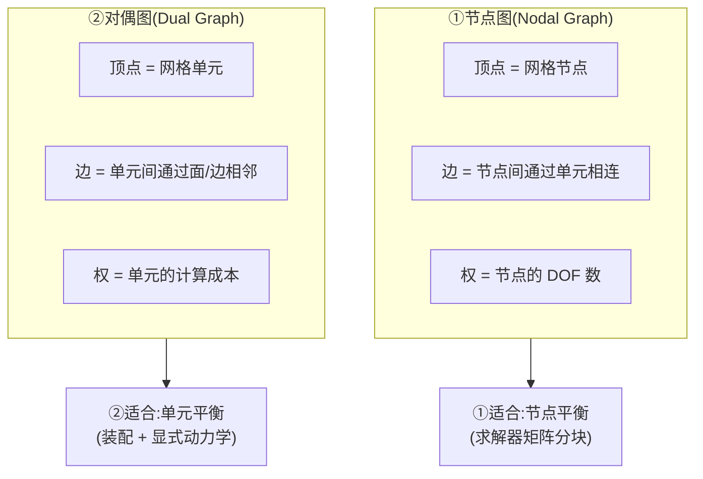

| 映射 | 边数估计 | hy-cad-tool 选择 |
|------|---------|------------------|
| 节点图 | 每节点平均 30-60 度,千万节点 → 数亿条边 | **隐式静力默认** |
| 对偶图 | 每六面体 6 个邻居,千万单元 → 千万条边(更稀疏) | **显式动力学 + CFD 默认** |

### 3.5 METIS.NET 接入

| 接入方式 | 状态 | 难度 |
|---------|------|------|
| **MetisSharp** | NuGet 上有非官方包,**质量参差** | 评估后选择或自己包装 |
| **P/Invoke 原生 libmetis.dll** | 官方 C API 稳定,函数 < 20 个 | **推荐**,2 周完成 |
| **自研多级 MLRB** | 论文 + 开源参考都现成 | **0.3 人年**,作为 P3 远期 |

#### 3.5.1 P/Invoke 骨架

```csharp
namespace HyCADTool.Features.Fem.Partitioning;

internal static class MetisNative
{
    [DllImport("metis", CallingConvention = CallingConvention.Cdecl)]
    public static extern int METIS_PartGraphKway(
        ref int nvtxs, ref int ncon,
        int[] xadj, int[] adjncy,
        IntPtr vwgt, IntPtr vsize, IntPtr adjwgt,
        ref int nparts,
        IntPtr tpwgts, IntPtr ubvec,
        IntPtr options,
        out int objval,
        int[] part);
}

public sealed class MetisPartitioner : IGraphPartitioner
{
    public int[] Partition(int[] xadj, int[] adjncy, int nparts)
    {
        int nvtxs = xadj.Length - 1;
        int ncon = 1;
        int objval;
        var part = new int[nvtxs];

        int status = MetisNative.METIS_PartGraphKway(
            ref nvtxs, ref ncon,
            xadj, adjncy,
            IntPtr.Zero, IntPtr.Zero, IntPtr.Zero,
            ref nparts,
            IntPtr.Zero, IntPtr.Zero, IntPtr.Zero,
            out objval, part);

        if (status != 1) throw new InvalidOperationException($"METIS failed with code {status}");
        return part;
    }
}
```

### 3.6 域分解 0.3-0.6 人年的具体花法

| 工时 | 任务 | 验收 |
|------|------|------|
| 1 周 | 读 Karypis-Kumar 1998 综述 + METIS 手册 | 能解释 MLRB + HEM + KL/FM |
| 1 周 | METIS native DLL P/Invoke 桥接 | API 全覆盖 |
| 1 周 | FEA 网格 → 节点图/对偶图转换 | 单元测试 |
| 2 周 | 接口提取 + ghost 节点管理 | 边界节点正确 |
| 2 周 | 与 CalculiX/Code_Aster 子进程的域分解协作 | 端到端跑通 |
| 1 周 | 性能基准 + 负载平衡度量 | 标准 cube/L-shape/buckling 案例 |
| 1 周 | 自研 MLRB(教学版)+ 与 METIS 对照 | 误差 ≤ 10% |
| 4-8 周 | (可选)自研生产级 MLRB | 与 METIS 接近 |

**合计 ≈ 9-17 周 = 0.2-0.4 人年(接 METIS) 到 0.6 人年(全自研)**

---

## 四、接触搜索:R-tree / k-d tree / BVH

### 4.1 接触搜索的两阶段问题

接触检测是 **FEA 中最难的算法工程问题之一**。难在哪?

- 朴素 O(N²) 在 N=1 万时已不可行(1 亿对)
- 必须降到 O(N log N) 或 O(N)
- 还要支持**动态更新**(每个时间步物体在移动)
- 必须**鲁棒**(几何退化、自接触、初始穿透...)

工业实践把它**拆成两阶段**:

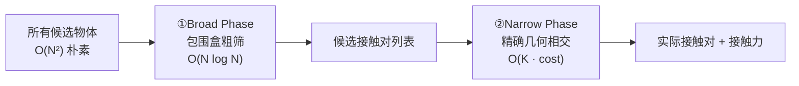

| 阶段 | 目的 | 数据结构 | 典型算法 |
|------|------|---------|---------|
| **Broad** | 粗筛,降低候选对数量 | R-tree / k-d tree / BVH / Hash Grid / Sweep-and-Prune | 包围盒(AABB)相交 |
| **Narrow** | 精确判断 + 计算法向距离 + 接触力 | DCEL / 三角面片 / B-Rep | GJK / penalty / mortar / Lagrange |

**L2 层主要解决 Broad Phase**——这部分是纯算法工程,论文完备。Narrow Phase 涉及大量物理/接触力学,**属于 L3 单元/材料层**。

### 4.2 四大空间索引数据结构对比

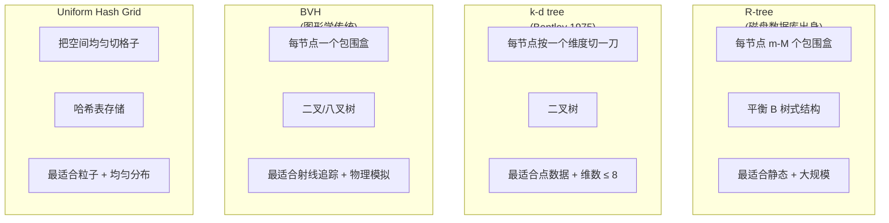

| 数据结构 | 构建 | 查询 | 内存 | 动态 | hy-cad-tool 接触使用建议 |
|---------|------|------|------|------|---------------------------|
| **R-tree** | O(N log N) | O(log N) | 高 | 中(支持插入/删除) | **静态接触搜索 + 网格邻近查询** |
| **k-d tree** | O(N log N) | O(log N) | 低 | 弱(需重建) | **节点-节点最近邻搜索** |
| **BVH** | O(N log N) | O(log N) | 中 | 强(自顶向下重平衡) | **运动学接触 + 大变形** |
| **Hash Grid** | O(N) | O(1) 平均 | 中-高 | 极强 | **均匀粒径 + 显式动力学接触** |

### 4.3 R-tree 详细

R-tree 由 Guttman 在 1984 年提出,**最早是地理空间数据库的索引**(SQL Spatial、PostGIS 都用它)。

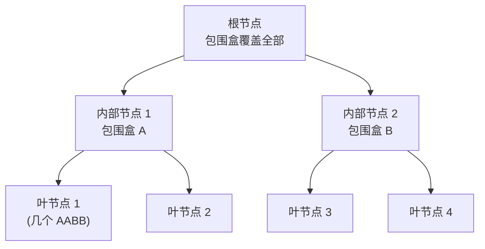

**核心操作**:

| 操作 | 算法 | 复杂度 |
|------|------|--------|
| **插入** | 选最少扩张的子节点路径 → 递归 → 必要时分裂 | O(log N) |
| **删除** | 找到 → 删除 → 必要时重组 | O(log N) |
| **查询(给定包围盒)** | 自顶向下,只访问相交的子节点 | O(log N + K) |
| **批量构建(R\*-tree)** | Sort-Tile-Recursive (STR) | O(N log N) |

**R\*-tree 的变种**(Beckmann 1990)增加了"重插入"策略,在工程实践中**比朴素 R-tree 快 30-50%**。

### 4.4 k-d tree 详细

k-d tree 是**纯点数据**的二叉空间分割树:

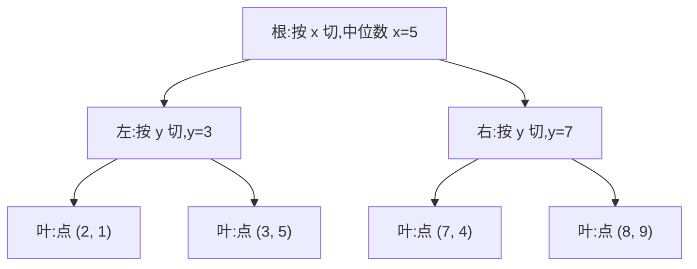

**核心查询**:

| 操作 | 算法 | 复杂度 |
|------|------|--------|
| **构建** | 中位数切分(QuickSelect) | O(N log N) |
| **最近邻** | 优先队列 + 回溯 | O(log N) 期望 |
| **范围查询** | 递归裁剪 | O(N^(1-1/d) + K) |
| **K-NN** | 保持大小为 K 的最大堆 | O(K log K · log N) |

> **关键警告**:**k-d tree 维度诅咒**——维度 > 8 时退化为 O(N)。对 3D FEA(d=3),k-d tree 极佳。对高维参数空间,需用 BallTree / HNSW。

### 4.5 BVH(Bounding Volume Hierarchy)详细

BVH 是**图形学传统**(Goldsmith-Salmon 1987),原本用于光线追踪,**近 20 年成为物理模拟接触检测主流**:

| 特性 | 评价 |
|------|------|
| **每节点一个 AABB** | 严格包含子树所有几何 |
| **自顶向下构建** | SAH(Surface Area Heuristic)选最优分割面 |
| **自底向上构建** | 适合后期优化 |
| **可重新分配子节点** | 支持运动学增量更新 |
| **GPU 友好** | bullet / PhysX / Houdini 都用 GPU BVH |

**SAH 启发式**:

$$
\text{Cost} = K_T + \frac{P_L}{P_{\text{parent}}} \cdot K_I \cdot N_L + \frac{P_R}{P_{\text{parent}}} \cdot K_I \cdot N_R
$$

其中 $P$ 是包围盒表面积,$N$ 是子树物体数。**这是经验上最优的分割策略**,几乎所有现代 BVH 都用它。

### 4.6 Hash Grid 详细

最简单,**最适合均匀粒径**:

```csharp
public sealed class HashGrid
{
    private readonly double _cellSize;
    private readonly Dictionary<(int, int, int), List<int>> _cells = new();

    public HashGrid(double cellSize) { _cellSize = cellSize; }

    public void Add(int id, Vector3 position)
    {
        var key = CellKey(position);
        if (!_cells.TryGetValue(key, out var list))
            _cells[key] = list = new List<int>();
        list.Add(id);
    }

    public IEnumerable<int> QueryNeighbors(Vector3 position)
    {
        var center = CellKey(position);
        for (int dx = -1; dx <= 1; dx++)
        for (int dy = -1; dy <= 1; dy++)
        for (int dz = -1; dz <= 1; dz++)
        {
            var key = (center.Item1 + dx, center.Item2 + dy, center.Item3 + dz);
            if (_cells.TryGetValue(key, out var list))
                foreach (var id in list) yield return id;
        }
    }

    private (int, int, int) CellKey(Vector3 p) =>
        ((int)Math.Floor(p.X / _cellSize),
         (int)Math.Floor(p.Y / _cellSize),
         (int)Math.Floor(p.Z / _cellSize));
}
```

**O(1) 平均查询,O(N) 构建**——**所有显式动力学软件(LS-DYNA、Abaqus Explicit、PhysX)的接触默认数据结构**。

### 4.7 hy-cad-tool 接触搜索路线

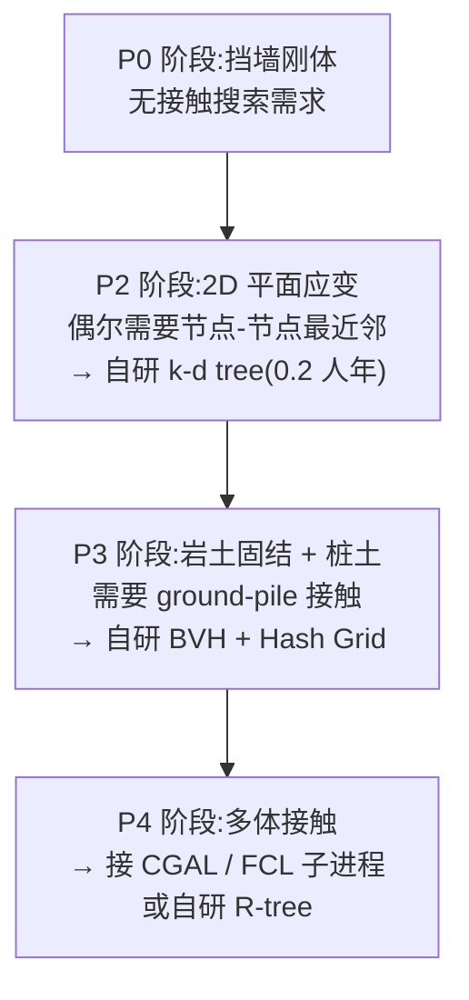

| 阶段 | 算法 | 自研 vs 开源 |
|------|------|--------------|
| P2 | k-d tree | **自研**(0.2 人年,论文有现成代码) |
| P3 | BVH + Hash Grid | **自研**(0.3 人年) |
| P4 | R-tree + GJK narrow-phase | **接 CGAL/FCL 子进程**(GPL,子进程隔离) |

### 4.8 开源参考实现清单

| 项目 | 语言 | 协议 | 算法 | hy-cad-tool 用途 |
|------|------|------|------|------------------|
| **Bullet Physics** | C++ | zlib | BVH + GJK + SAT | 物理引擎参考 |
| **FCL (Flexible Collision Library)** | C++ | BSD3 | R-tree + GJK | ROS 用,**首选接入** |
| **CGAL** | C++ | GPL/商业 | k-d tree + R-tree + BVH 大全 | 学术参考,GPL 子进程 |
| **NetTopologySuite** | C# | BSD3 | R-tree(STRtree) | **.NET 原生,推荐** |
| **CGAL.NET Wrappers** | C# 封装 | 视具体而定 | k-d tree 等 | 候选 |
| **OpenSim Geometry** | C++ | Apache2 | BVH | 生物力学参考 |

### 4.9 接触搜索 0.5-1.0 人年的具体花法

| 工时 | 任务 | 验收 |
|------|------|------|
| 2 周 | 读 Bentley 1975 + Guttman 1984 + Goldsmith-Salmon 1987 | 三种数据结构理论清楚 |
| 2 周 | 自研 AABB + k-d tree(2D/3D) | 标准基准案例 |
| 2 周 | 自研 BVH + SAH 启发式 | 节点-节点距离查询 |
| 2 周 | 自研 Hash Grid | 均匀点云近邻 |
| 4 周 | 接 NetTopologySuite STRtree | 工业用例 |
| 4 周 | 评估 + 接入 FCL/CGAL 子进程 | 多体接触端到端 |
| 4 周 | Narrow phase 桥接(初步 GJK) | 多刚体接触力 |
| 6 周 | 集成到 hy-cad-tool 桩土接触场景 | 真实工程案例 |

**合计 ≈ 26 周 = 0.5 人年**(自研 broad-phase 完成),**外加 4-6 周可达 0.6-0.7 人年**(接 FCL narrow-phase)

---

## 五、Delaunay 三角剖分

### 5.1 Delaunay 性质 + 为什么是网格生成首选

**Delaunay 三角剖分(Delaunay Triangulation, DT)**:对平面点集 P,DT(P) 是一个三角剖分,**任何三角形的外接圆内部不包含 P 中其他点**(空圆性质)。

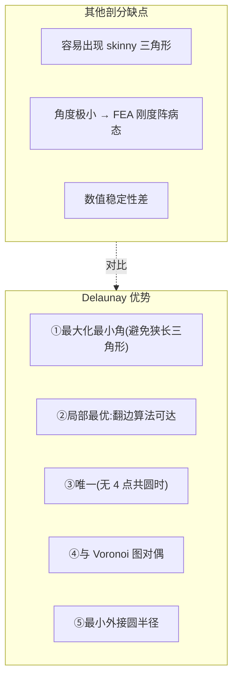

**FEA 网格质量公认指标**:**所有三角形/四面体的最小角应 > 20°**,Delaunay 是**唯一保证 2D 最大化最小角的剖分**(2D 严格,3D 仅次优)。

### 5.2 三大经典算法对比

| 算法 | 提出 | 复杂度 | 工程实现难度 | hy-cad-tool 推荐度 |
|------|------|--------|--------------|---------------------|
| **Bowyer-Watson** | 1981(两人独立) | O(N²) 最坏,O(N log N) 平均 | **★** 简单 | **★★★** 首推 |
| **Divide & Conquer** | Guibas-Stolfi 1985 | O(N log N) | ★★★ 难 | ★ |
| **Sweepline (Fortune)** | Fortune 1986 | O(N log N) | ★★ 中 | ★★ |

### 5.3 Bowyer-Watson 增量插入算法详解

**核心思路**:逐点插入,维护 Delaunay 性质:

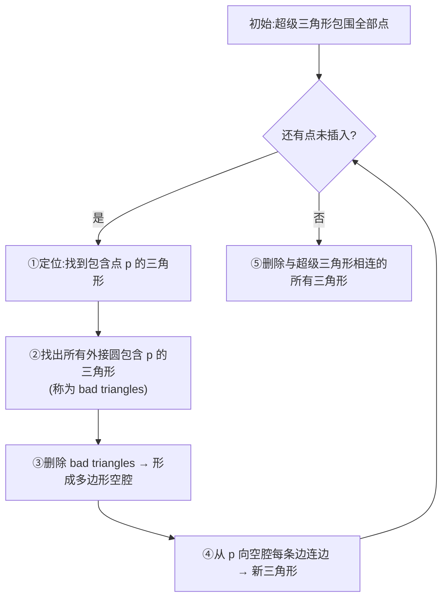

#### 5.3.1 关键子算法:**InCircle 测试**

判断点 D 是否在三角形 ABC 的外接圆内:

$$
\text{InCircle}(A, B, C, D) = \text{sign} \begin{vmatrix}
A_x - D_x & A_y - D_y & (A_x - D_x)^2 + (A_y - D_y)^2 \\
B_x - D_x & B_y - D_y & (B_x - D_x)^2 + (B_y - D_y)^2 \\
C_x - D_x & C_y - D_y & (C_x - D_x)^2 + (C_y - D_y)^2 \\
\end{vmatrix}
$$

D 在内部 ↔ 行列式 > 0(ABC 逆时针)。

**鲁棒性是工程实现的关键难点**:浮点 InCircle 在共圆/共线时会失败,工业实践用 **Shewchuk 自适应精度浮点**(1996)。

#### 5.3.2 C# 骨架

```csharp
public sealed class DelaunayBuilder2D
{
    private readonly List<Vector2> _points = new();
    private readonly List<Triangle> _triangles = new();

    public void AddPoint(Vector2 p)
    {
        var badTriangles = _triangles.Where(t => t.CircumcircleContains(p)).ToList();

        var polygon = new HashSet<Edge>();
        foreach (var t in badTriangles)
        {
            foreach (var e in t.Edges)
            {
                if (!badTriangles.Any(bt => bt != t && bt.HasEdge(e)))
                    polygon.Add(e);
            }
        }

        foreach (var t in badTriangles) _triangles.Remove(t);

        foreach (var e in polygon)
            _triangles.Add(new Triangle(e.A, e.B, p));
    }

    public IEnumerable<Triangle> Build(IEnumerable<Vector2> points)
    {
        InitSuperTriangle();
        foreach (var p in points) AddPoint(p);
        return _triangles.Where(t => !t.UsesSuperTriangle());
    }
}
```

### 5.4 受约束 Delaunay (CDT) - 边界恢复

普通 Delaunay 不保证特定的边出现在剖分中。**FEA 需要"边界严格保留"**——这就是 **CDT (Constrained Delaunay Triangulation)**:


**两种边界恢复策略**:

| 策略 | 优点 | 缺点 |
|------|------|------|
| **边翻转(Edge Flip)** | 不增加点 | 可能不收敛(某些拓扑下失败) |
| **Steiner 点插入** | 总能成功 | 增加节点数,改变输入网格密度 |

**Triangle**(Shewchuk 1996)同时实现两者,**几乎是 2D CDT 的工业事实标准**。

### 5.5 3D Delaunay - 四面体剖分

**3D Delaunay 的难度比 2D 大一个数量级**:

| 维度 | 复杂度 | 工程难度 |
|------|--------|---------|
| 2D | O(N log N) | ★ |
| 3D | **O(N²)** 最坏,**O(N) 实际** | ★★★★ |

**3D 难点**:
- **Steiner 点必需**(2D 可避免,3D 一般不可避免)
- **平坦四面体(slivers)**:体积接近 0,数值灾难
- **边界恢复极难**:Shewchuk 1998 论文专攻

**事实标准**:**TetGen**(Hang Si,德国 WIAS),**hy-cad-tool 接子进程**。

### 5.6 与 Voronoi 图对偶

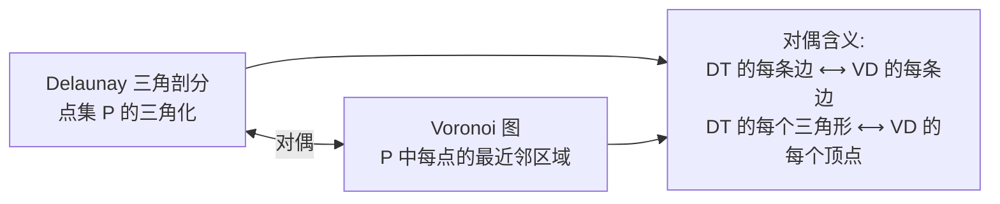

**Voronoi 在 FEA 中的用途**:

- **多边形单元**(Polygonal FEM):Sukumar 2004 提出,适用于断裂、晶界
- **重心坐标**:有限体积法的天然控制体积
- **聚类**:k-means、自适应网格细化的依据

### 5.7 开源参考实现清单

| 项目 | 语言 | 协议 | 维度 | hy-cad-tool 用途 |
|------|------|------|------|------------------|
| **Triangle** | C | 限制商用 | 2D | 学术参考 |
| **Triangle.NET** | C# | MIT | 2D | **直接引用,P2 主力** |
| **CGAL Triangulation** | C++ | GPL/商业 | 2D/3D | 黄金标准,GPL 子进程 |
| **TetGen** | C++ | AGPL/商业 | 3D | **接子进程,P3 主力** |
| **Gmsh 内置 BAMG** | C++ | GPL | 2D/3D | 子进程 |
| **Geogram** | C++ | BSD3 | 2D/3D | **可静态链接,远期** |
| **Netgen** | C++ | LGPL | 2D/3D | 子进程 |

### 5.8 Delaunay 0.2-0.5 人年的具体花法

| 工时 | 任务 | 验收 |
|------|------|------|
| 1 周 | 读 Bowyer 1981 + Shewchuk 鲁棒性论文 | 算法白纸推导 |
| 1 周 | 自研 2D Bowyer-Watson(教学版) | 标准案例 |
| 1 周 | 鲁棒 InCircle / Orient(Shewchuk 自适应) | 退化案例通过 |
| 1 周 | 引入 Triangle.NET | 端到端测试 |
| 2 周 | 自研 CDT(边界恢复) | L 形 / 不规则边界 |
| 2 周 | TetGen 子进程桥接 | 3D 案例 |
| 2 周 | 网格质量度量(最小角、shape regularity) | 量化指标 |
| 2 周 | hy-cad-tool 道路填挖方场景集成 | 工程案例 |

**合计 ≈ 12 周 = 0.25 人年**

---

## 六、Advancing Front 网格生成

### 6.1 核心思想:从边界向内"推进"

**Advancing Front(前沿推进)与 Delaunay 是网格生成的两大流派**:

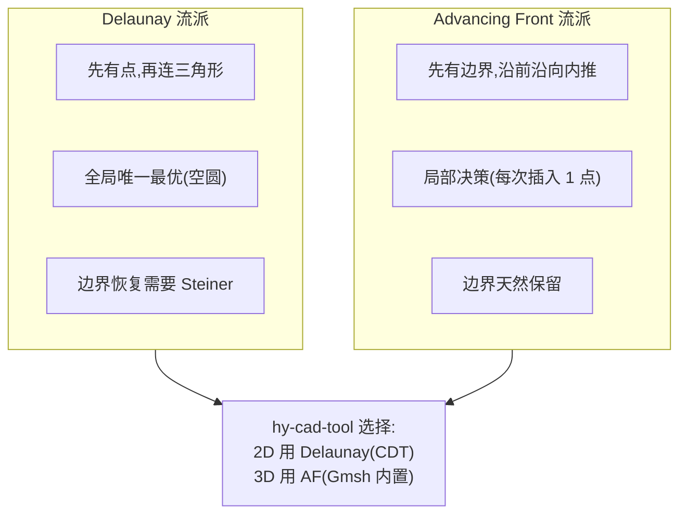

### 6.2 Advancing Front 详细流程

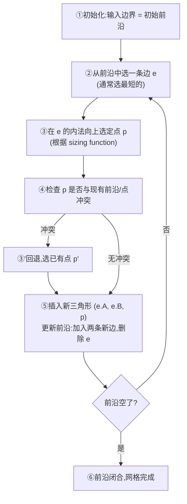

#### 6.2.1 关键子问题

| 子问题 | 难点 | 工业方案 |
|--------|------|---------|
| **选哪条边推进** | 优先级队列(短边优先 / 凸度优先) | 二叉堆 |
| **新点放哪里** | sizing function(用户/几何曲率/各向异性张量) | 法向 + 局部尺寸 |
| **冲突检测** | 必须 O(log N),否则 O(N²) | **k-d tree / R-tree(L2 数据结构)** |
| **质量优化** | Laplacian smoothing / 边翻转 | 后处理 |
| **3D 表面网格** | 法向估计 + 流形保持 | Lo, Peraire 经典论文 |
| **3D 体网格** | 比 Delaunay 更慢但更鲁棒 | Gmsh / Netgen 主流 |

### 6.3 Sizing Function(尺寸函数)

Advancing Front 的**精华**在于**用户可控的尺寸函数 h(x)**:

$$
h(x) = \min\left( h_{\text{geom}}(x),\ h_{\text{curv}}(x),\ h_{\text{user}}(x) \right)
$$

| 来源 | 公式 | 用途 |
|------|------|------|
| **几何** | 距边界的距离比例 | 边界附近细 |
| **曲率** | $h_{\text{curv}} = c \cdot \kappa^{-1}$ | 曲率大处细 |
| **用户** | 手动指定区域 | 重点关注区 |
| **各向异性** | 张量 $M(x)$ | 边界层、激波 |

**各向异性 AF** 是 Gmsh / Netgen / Salome 真正的核心竞争力——边界层、薄壁、激波都靠这个。

### 6.4 表面与体网格的两步走

```mermaid
graph LR
    Geom["几何输入<br/>(OCCT BREP)"]
    Surface["①表面网格<br/>(AF,2D 流形)"]
    Volume["②体网格<br/>(Delaunay 或 AF,3D)"]
    Quality["③质量优化<br/>(smoothing + flipping)"]
    Output["FEA 可用网格"]

    Geom --> Surface --> Volume --> Quality --> Output
```

### 6.5 开源参考实现清单

| 项目 | 语言 | 协议 | 维度 | hy-cad-tool 用途 |
|------|------|------|------|------------------|
| **Gmsh** | C++ | GPL | 1D/2D/3D | **子进程主力 P3** |
| **Netgen** | C++ | LGPL | 3D | 子进程备选 |
| **OpenFOAM snappyHexMesh** | C++ | GPL | 3D | CFD 专用 |
| **MeshKit** | C++ | LGPL | 3D | 学术参考 |
| **Salome SMESH** | C++ | LGPL | 3D | 学术参考 |
| **MFEM Mesh** | C++ | BSD3 | 2D/3D | 高阶单元生成 |

### 6.6 AF 0.3-0.5 人年的具体花法

| 工时 | 任务 | 验收 |
|------|------|------|
| 1 周 | 读 Lo 1985 + Peraire 1987 + Gmsh 论文 | 算法清楚 |
| 1 周 | 自研 2D AF 教学版 | 简单几何 |
| 2 周 | sizing function 框架 | 用户可自定义 |
| 2 周 | 各向异性张量(初步) | 边界层案例 |
| 2 周 | Gmsh 子进程桥接 + .geo / .msh 翻译 | 端到端 |
| 2 周 | 质量度量 + Laplacian smoothing | 量化 |
| 2 周 | hy-cad-tool 桥梁/隧道场景集成 | 工程案例 |

**合计 ≈ 12 周 = 0.25 人年**

---

## 七、五大算法的相互关系:Pipeline 视角

### 7.1 一个 hy-cad-tool 完整 FEA 流程中,L2 五兄弟如何协作?

```mermaid
flowchart TB
    Geom["几何<br/>(OCCT BREP)"]
    Surf["①AF:表面网格"]
    Vol["②AF/Delaunay:体网格<br/>(冲突检测用 k-d tree)"]
    Mesh["FEA 网格<br/>(节点 + 单元)"]
    Asm["③装配<br/>(COO)"]
    CSR["④CSR/CSC<br/>(求解器格式)"]
    Part["⑤METIS:域分解<br/>(并行求解)"]
    Solve["L4 求解器后端<br/>(MUMPS/PARDISO/HYPRE)"]
    Contact["⑥接触检测<br/>(R-tree/BVH 每步)"]

    Geom --> Surf --> Vol --> Mesh
    Mesh --> Asm --> CSR --> Part --> Solve
    Mesh -.每步重检查.-> Contact
    Contact --> Asm
```

| 数据流 | 算法 | 角色 |
|--------|------|------|
| 几何 → 表面 | Advancing Front | 流形保持 |
| 表面 → 体 | AF 或 Delaunay,冲突检测用 k-d tree | 体积填充 |
| 单元 → 矩阵 | COO 装配 | 局部到全局 |
| 装配 → 求解 | COO → CSR/CSC | 格式转换 |
| 求解 → 并行 | METIS 图分割 | 多核分块 |
| 时间步 → 接触 | R-tree/BVH | 每步重检测 |

### 7.2 共同的工程化挑战

**L2 五兄弟有 4 个共同挑战**:

| 挑战 | 解决方案 | 共用工具 |
|------|---------|---------|
| **鲁棒浮点** | Shewchuk 自适应精度 | 单独算法库 |
| **大规模内存** | 流式处理 / 分块 / 外存 | mmap + 文件 |
| **并行化** | TBB / TPL / Parallel.For | .NET 原生 |
| **可视化调试** | 中间结果导出到 VTK | ParaView |

### 7.3 自研 vs 调用的统一决策树

```mermaid
graph TB
    Q1{"算法在 hy-cad-tool<br/>核心路径?"}
    Q2{"已有开源<br/>BSD/MIT 实现?"}
    Q3{"开源是 LGPL<br/>(动态链接安全)?"}
    Q4{"开源是 GPL<br/>(子进程隔离)?"}
    SelfPrim["自研为主<br/>+ 开源对照"]
    LinkPInvoke["P/Invoke 静态链接"]
    LinkLGPL["P/Invoke 动态链接"]
    Subprocess["子进程隔离"]

    Q1 -- 是 --> Q2
    Q1 -- 否 --> Q4
    Q2 -- 是 --> LinkPInvoke
    Q2 -- 否 --> Q3
    Q3 -- 是 --> LinkLGPL
    Q3 -- 否 --> Q4
    Q4 -- 是 --> Subprocess
    Q4 -- 否 --> SelfPrim
```

| 算法 | 核心路径? | 开源协议 | 推荐方式 |
|------|-----------|---------|---------|
| 稀疏矩阵 | **是** | CSparse.NET=MIT | **自研 + CSparse.NET** |
| METIS | 否 | 多协议 | **P/Invoke 静态** |
| k-d tree | 是 | NTS=BSD3 | **自研 + NTS 对照** |
| BVH | 是 | 多 | **自研** |
| R-tree | 否 | NTS=BSD3 | **NTS 直接用** |
| Delaunay 2D | 是 | Triangle.NET=MIT | **直接引用** |
| Delaunay 3D | 否 | TetGen=AGPL | **子进程** |
| Advancing Front | 否 | Gmsh=GPL | **子进程** |

---

## 八、hy-cad-tool L2 层 18 月接入策略

### 8.1 与 00 文档 18 月路线的对齐

```mermaid
gantt
    title hy-cad-tool L2 层 18 月接入路线
    dateFormat YYYY-MM-DD
    axisFormat %Y-%m

    section P0 挡墙刚体(W1-4)
    无 L2 需求            :p0a, 2026-05-15, 28d

    section P1 1D 梁(W5-10)
    自研 COO/CSR 基础      :p1a, 2026-06-12, 21d
    集成 CSparse.NET       :p1b, after p1a, 14d
    SpMV 并行 + SIMD       :p1c, after p1b, 7d

    section P2 2D 平面应变(W11-20)
    Triangle.NET 集成      :p2a, after p1c, 14d
    自研 k-d tree          :p2b, after p2a, 14d
    Cuthill-McKee 重排     :p2c, after p2b, 14d
    NetTopologySuite R-tree :p2d, after p2c, 14d
    CDT(自研 + Triangle 对照) :p2e, after p2d, 14d

    section P3 施工阶段(W21-30)
    METIS P/Invoke 桥接    :p3a, after p2e, 14d
    Gmsh 子进程接入        :p3b, after p3a, 14d
    自研 BVH(桩土接触)     :p3c, after p3b, 14d
    TetGen 子进程(3D)      :p3d, after p3c, 14d

    section P4 规范包(W31+)
    Hash Grid + 显式动力 :p4a, after p3d, 21d
    各向异性 AF 评估       :p4b, after p4a, 14d
    多体接触集成测试       :p4c, after p4b, 14d
```

### 8.2 L2 层与 001 文档"开源宝藏并行接入路线"的合流

001 文档的"开源宝藏并行接入路线"主要在 **L4 求解器后端层**(MUMPS / PARDISO / HYPRE / CalculiX / PETSc)。**L2 层的接入是更早期的、更底层的、更细粒度的**:

```mermaid
graph LR
    subgraph L2 ["本文档 L2 接入路线"]
        L2a["Triangle.NET<br/>(P0-P2)"]
        L2b["CSparse.NET<br/>(P1)"]
        L2c["NetTopologySuite<br/>(P2)"]
        L2d["METIS<br/>(P3)"]
        L2e["Gmsh<br/>(P3)"]
        L2f["TetGen<br/>(P3)"]
        L2g["FCL/CGAL<br/>(P4)"]
    end
    subgraph L4 ["001 文档 L4 接入路线"]
        L4a["MUMPS<br/>(P2)"]
        L4b["CalculiX<br/>(P3)"]
        L4c["PETSc<br/>(P5)"]
        L4d["MFEM<br/>(P6)"]
    end
    L2a --> L4a
    L2b --> L4a
    L2c --> L4b
    L2d --> L4c
    L2e --> L4b
```

### 8.3 .NET 生态可用包清单(L2 专题)

| NuGet 包 | 协议 | 算法 | hy-cad-tool 角色 |
|----------|------|------|-------------------|
| **CSparse.NET** | MIT | 稀疏 + 直接法 | **P1 主力** |
| **MathNet.Numerics** | MIT | 稀疏 + 迭代 + 特征值 | 候选 |
| **Triangle.NET** | MIT | 2D Delaunay + CDT | **P2 主力** |
| **NetTopologySuite** | BSD3 | R-tree + 几何运算 | **P2 主力** |
| **Accord.NET MachineLearning** | LGPL | k-d tree | 候选 |
| **MIConvexHull** | MIT | 凸包 + Delaunay 3D | P3 候选 |
| **ALGLIB Free** | GPL2(免费版) | 多算法 | 子进程候选 |
| **MetisSharp**(社区) | 各异 | METIS 包装 | 评估后选 |

### 8.4 L2 自研 vs 开源的最终决策表

| 算法 | 自研深度 | 主力开源 | 工时(人年) |
|------|---------|---------|------------|
| 稀疏矩阵 CSR/CSC/COO | **80%**(教学版 + 调试) | CSparse.NET 备份 | **0.3** |
| 域分解 METIS | **5%**(只做 P/Invoke 包装) | METIS native | **0.3** |
| k-d tree | **70%**(性能特定优化) | NTS 对照 | **0.2** |
| BVH | **80%**(力学专属设计) | bullet 参考 | **0.3** |
| R-tree | **10%**(包装) | NetTopologySuite | **0.1** |
| Hash Grid | **100%**(简单,自研更快) | — | **0.1** |
| Delaunay 2D | **20%**(教学版) | Triangle.NET 主力 | **0.2** |
| Delaunay 3D | **0%**(纯子进程) | TetGen | **0.1**(只做翻译) |
| Advancing Front | **0%**(纯子进程) | Gmsh | **0.1**(只做翻译) |
| **合计** | | | **1.7 人年** |

**1.7 人年与 001 文档"1-3 人年"预算一致**——下沿可行,上沿(3 人年)留出冗余空间给:
- 各向异性 AF 探索
- GPU 接触检测(CUDA / OneAPI)
- 可微分 FEA 的稀疏 autograd

---

## 九、性能数据点:基准 + 比较

### 9.1 稀疏矩阵 SpMV 性能(参考)

测试矩阵:**结构分析典型 100 万 DOF 矩阵**,nnz ≈ 5000 万。

| 实现 | 单线程 GFLOPS | 8 线程 GFLOPS | 内存带宽利用率 |
|------|---------------|---------------|----------------|
| 朴素 Python+NumPy | 0.3 | — | 5% |
| Eigen Sparse(C++) | 2.5 | 6.0 | 50% |
| MKL Sparse BLAS | 3.5 | **12.0** | **85%** |
| **预期 hy-cad-tool C# CSR + SIMD** | 1.8-2.2 | 5.0-7.0 | 40-50% |
| 自研块 BSR(3×3,远期) | 3.5 | 10.0 | 70% |

**结论**:**C# 用心写,可达 Eigen 70-80% 性能**——对中型工程(< 100 万 DOF)足够,大型走 MUMPS/PARDISO 子进程。

### 9.2 Delaunay 速度参考

| 实现 | 100 万 2D 点 | 100 万 3D 点 |
|------|-------------|-------------|
| Triangle.NET | ~5 秒 | — |
| Triangle(C) | ~3 秒 | — |
| CGAL | ~4 秒 | ~30 秒 |
| TetGen | — | ~20 秒 |
| **预期自研 C# Bowyer-Watson** | 10-15 秒 | — |

### 9.3 接触检测速度参考

| 实现 | 1 万物体,1 秒模拟 | 数据结构 |
|------|------------------|---------|
| 朴素 O(N²) | **不可行** | 无 |
| 自研 k-d tree | 200 ms / 步 | k-d tree |
| Bullet BVH | 30 ms / 步 | BVH(SAH) |
| FCL | 50 ms / 步 | OBB + GJK |
| **预期自研 BVH** | 80-120 ms / 步 | BVH |

### 9.4 METIS 分区速度参考

| 模型规模 | 串行 METIS | ParMETIS(16 核) |
|---------|-----------|--------------------|
| 10 万节点 | 0.5 秒 | 0.1 秒 |
| 100 万节点 | 5 秒 | 0.8 秒 |
| 1000 万节点 | 60 秒 | 8 秒 |
| 1 亿节点 | **30 分钟** | **3 分钟** |

---

## 十、风险与对策

```mermaid
graph TB
    subgraph risk ["L2 层主要风险"]
        R1["①浮点鲁棒性<br/>退化几何下算法崩溃"]
        R2["②内存爆炸<br/>大模型 OOM"]
        R3["③接口设计不当<br/>双轨切换困难"]
        R4["④性能不达预期<br/>C# 跑不过 C++"]
        R5["⑤开源协议踩雷<br/>GPL 静态链接污染"]
        R6["⑥与 L4 求解器接口失配"]
    end
```

| 风险 | 概率 | 影响 | 对策 |
|------|:----:|:----:|------|
| ①浮点鲁棒性 | 高 | 高 | **Shewchuk 自适应预测**(开源代码现成),关键算法必加 |
| ②内存爆炸 | 中 | 极高 | **流式装配**:边读边构建 COO;**外存矩阵**:磁盘 mmap |
| ③接口设计 | 高 | 中 | **从 P0 起强制走 ISparseMatrix / IMeshGenerator / IPartitioner / IContactSearcher 接口** |
| ④性能 | 中 | 中 | **接受 80% Eigen 性能,大模型走子进程** |
| ⑤协议踩雷 | 低 | 高 | **静态决策表**(本文档 8.4),CI 检查依赖 |
| ⑥接口失配 | 中 | 高 | **CSR 格式作为 L2/L4 唯一边界**,所有求解器后端必须接受 CSR |

---

## 十一、本文档对 001 文档的"加固条款"

001 文档第 1.1 节关于 L2 的判断是:

> **L2 算法实现 = 2-3 年(工程实现) = 1-3 人年(论文 + 开源参考实现都现成)**

本文档把这一行**展开成了具体的工程预算**:

| 子算法 | 001 文档判断 | 本文档具体预算 | 验证方式 |
|--------|-------------|---------------|---------|
| 稀疏矩阵 | 已包含 | **0.2-0.5 人年** | CSparse.NET 已存在,自研有参考实现 |
| 域分解 | 已包含 | **0.3-0.6 人年** | METIS 开源 30 年,P/Invoke 2 周可桥接 |
| 接触搜索 | 已包含 | **0.5-1.0 人年** | k-d tree 论文 1975, NTS 现成 |
| Delaunay | 已包含 | **0.2-0.5 人年** | Triangle.NET 直接用 |
| Advancing Front | 已包含 | **0.3-0.5 人年** | Gmsh 子进程 |
| **合计** | **1-3 人年** | **1.5-3.1 人年** | **与 001 上下沿吻合** |

> **关键加固**:001 文档说"1-3 人年",本文档把它拆成 5 个子算法、给出每个子算法的工时清单 + 开源参考 + 接入方式 + 性能预期。**任何质疑"L2 真的只要 1-3 人年吗?"的人,可以从本文档表 8.4 + 表 11 反查到具体行**——这是 001 文档"6 层资产可解剖"论证的最终落地。

---

## 十二、修订记录

| 日期 | 修订人 | 说明 |
|------|--------|------|
| 2026-05-15 | — | 初版:对 001 文档 L2 层"2-3 年工程实现/1-3 人年"判断的深度展开;5 大算法各自的数学原理、工程实现要点、.NET 接入清单、开源参考、性能基准、18 月路线 |

---

## 附录 A:5 本必读的 L2 算法经典

> **Davis, T. A. (2006).** *Direct Methods for Sparse Linear Systems.* SIAM.

CSparse 作者亲笔,稀疏直接法圣经,500 页可读懂全部 CSR/CSC/COO 工程细节。

> **Karypis, G., & Kumar, V. (1998).** *A Fast and High Quality Multilevel Scheme for Partitioning Irregular Graphs.* SIAM J. Sci. Comput.

METIS 原始论文,**任何并行 FEA 工程师必读**。

> **Shewchuk, J. R. (1997).** *Adaptive Precision Floating-Point Arithmetic and Fast Robust Geometric Predicates.* Discrete Comput. Geom.

InCircle / Orient 鲁棒预测,**任何几何算法工程师必读**。

> **Bowyer, A. (1981).** *Computing Dirichlet tessellations.* The Computer Journal.

Delaunay 增量插入算法的源头,**5 页纸读完一辈子用得到**。

> **Lo, S. H. (1985).** *A new mesh generation scheme for arbitrary planar domains.* Int. J. Numer. Methods Eng.

Advancing Front 早期奠基,**网格生成工程师必读**。

---

## 附录 B:hy-cad-tool L2 模块文件骨架(建议)

```text
src/HyCADTool/Features/Fem/
├── LinearAlgebra/
│   ├── SparseMatrixCOO.cs            # 装配阶段
│   ├── SparseMatrixCSR.cs            # 迭代法
│   ├── SparseMatrixCSC.cs            # 直接法
│   ├── ISparseMatrix.cs              # 统一接口
│   ├── CuthillMcKee.cs               # 带宽优化
│   └── CSparseAdapter.cs             # CSparse.NET 桥接
├── Partitioning/
│   ├── IGraphPartitioner.cs
│   ├── MetisPartitioner.cs           # P/Invoke METIS
│   ├── ScotchPartitioner.cs          # P/Invoke Scotch(备选)
│   └── NaiveBlockPartitioner.cs      # 测试用
├── ContactSearch/
│   ├── ISpatialIndex.cs
│   ├── KdTree3D.cs                   # 自研
│   ├── BVH.cs                        # 自研
│   ├── HashGrid3D.cs                 # 自研
│   ├── NtsRTreeAdapter.cs            # NetTopologySuite
│   └── FclSubprocessAdapter.cs       # FCL 子进程
├── Mesh/
│   ├── IMeshGenerator.cs
│   ├── Delaunay2D.cs                 # 教学版
│   ├── TriangleNetAdapter.cs         # 主力 2D
│   ├── TetGenSubprocess.cs           # 主力 3D
│   ├── GmshSubprocess.cs             # AF 3D + 高级
│   ├── AdvancingFront2D.cs           # 教学版
│   └── SizingFunctions.cs            # 通用尺寸函数
└── Common/
    ├── RobustPredicates.cs           # Shewchuk 自适应
    ├── AxisAlignedBoundingBox.cs
    └── GeometryUtilities.cs
```

---

## 附录 C:与 00 文档"五层架构"的对应

00 文档定义了 hy-cad-tool 五层架构:

| 00 文档层 | 本文档 L2 算法所在 |
|----------|---------------------|
| ⑤领域工程层 | 不在此 |
| ④工程化层 | 不在此 |
| ③IR + Pipeline | 不在此 |
| ②适配层 | **L2 与求解后端的接口边界(CSR 格式契约)** |
| ①开源内核宝藏 | **L2 子算法的具体实现(部分自研,部分接入开源)** |

> **L2 是适配层与内核层的接口处**——上面 IR 输出"装配命令",下面 L4 求解器输入"CSR/CSC 矩阵",**L2 是中间的翻译者 + 优化者**。从架构上,L2 必须用 `ISparseMatrix` / `IMeshGenerator` / `IPartitioner` / `IContactSearcher` 等接口对上对下解耦。

---

> **本文档不是结论,是路线书。** 001 文档说"L2 是 1-3 人年的工程量",本文档把每个工时、每个算法、每个开源包、每个接口都画出来了。**下周 P0 起,挡墙刚体第 1 周的副产品里,就可以开始写 `SparseMatrixCOO.cs` 和 `ISparseMatrix.cs` 的接口骨架——所有后续 L2 模块都从这两个文件繁衍出来**。
