## 文档定位

> 文档日期:2026-05-15
> 上承:[001-自研通用FEA的第一性原则重审-30年积累vs150年开源-2026-05-15](../Research/001-自研通用FEA的第一性原则重审-30年积累vs150年开源-2026-05-15.md)
> 并行:[002-现代架构与AI整合1991到2008开源FEA-放大优势规避短板-2026-05-15](../Research/002-现代架构与AI整合1991到2008开源FEA-放大优势规避短板-2026-05-15.md)
> 性质:**对 001 文档"L3 单元/材料层是真壁垒"判断的工程级深度展开。从 SOLID185/186/187、SHELL181、BEAM189、CONTA174 + 280+ 材料 + 沙漏/锁定/收敛性 5 大数值病出发,逐项拆解"10-30 年积累"到底积累了什么、为什么 5-10 人年(基于开源底座)/30+ 人年(从 0)。**

001 文档把 ANSYS 30 年的 6 层资产 (L1 数学 / L2 算法 / L3 单元材料 / L4 求解器 / L5 前后处理 / L6 生态) 全部解剖,得出**真壁垒只剩 L3 + L6**。其中 L3 的判断行如下:

| 层 | 内容 | "30 年积累"含金量 | 后发者门槛 |
|----|------|-------------------|-----------|
| **L3 单元/材料** | SOLID185/186/187、SHELL181、BEAM189、CONTA174 + 280+ 材料 + 沙漏/锁定/收敛性 | **10-30 年**(真正的"积累",边角 case 海量) | **5-10 人年(基于开源底座)/ 30+ 人年(从 0)** |

但 001 文档**只下结论没展开**,留下 4 个核心问题没回答:

1. **L3 的"10-30 年积累"到底由什么构成?** 是 6 个单元类型?还是 6 × N 个边角 case?
2. **"5-10 人年(基于开源底座)"中的"5-10"差出来的 5 年差在哪里?**
3. **"30+ 人年(从 0)"中的 30 年里,工程师**究竟在做什么?**写形函数代码用不了 30 年——那 30 年消耗在哪?
4. **hy-cad-tool 的道路/岩土/路基方向,真的需要 ANSYS 全部 L3 资产吗?** 如果不需要,**最小 L3 套件**是什么?

本文档要严肃回答这 4 个问题,**最终输出**:

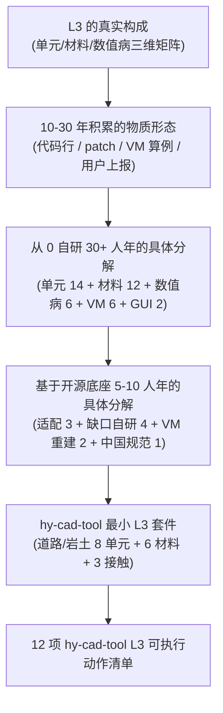

本文档**不是 ANSYS 单元手册的翻译**,而是**站在 hy-cad-tool 产品视角**对 ANSYS 30 年 L3 积累的**逆向工程分析**——只有看清"壁垒到底是什么材质",才能找到绕过它的路径。

---

## 一、L3 在 6 层架构的战略位置:唯一与 L6 并列的真壁垒

### 1.1 为什么 L3 是真壁垒——5 重指数级"边角 case"叠加

把 L1-L6 横向排开,逐层问"边角 case 量"和"修复周期":

| 层 | 边角 case 数量级 | 单个 case 修复周期 | 总累积成本 |
|----|------------------|---------------------|------------|
| L1 数学 | 10^1 (论文级,有限) | 数学家解一次,全人类共享 | **接近 0** |
| L2 算法 | 10^2 (实现技巧) | 1-2 周 | **几年共享** |
| **L3 单元/材料** | **10^4-10^5** (单元 × 材料 × 加载 × 几何 × 数值环境的组合爆炸) | **数周-数月**,且**每代用户上报后再次发现** | **30 年累积难以追赶** |
| L4 求解器后端 | 10^3 (并行/数值稳定/收敛) | 几周 | 已被 LLNL/Sandia 累积到天花板 |
| L5 前后处理 | 10^3 (CAD 兼容/网格) | 几天 | OCCT/Gmsh/ParaView 累积 |
| L6 生态 | 10^? (用户 × 行业 × 标准) | **永远** | **30 年+培训** |

**L3 的"10^4-10^5 个边角 case"是怎么算的?**

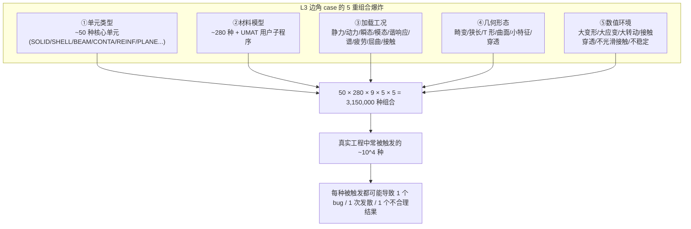

**关键洞察**:L3 的壁垒**不在"代码行数",而在"组合空间的覆盖度"**。一个工程师可以用 1 周时间写出 SOLID185 的"教科书版本",但要让这个单元在**「大变形 + 大应变 + 几何畸变 + 准不可压 + Mooney-Rivlin 材料 + 接触穿透 + Newton 收敛困难」**的环境下还稳定工作——需要 **30 年 × 千万用户的 bug 反馈**。

### 1.2 L3 的内部三维矩阵

L3 不是一维列表,而是**三维矩阵 = 单元类型 × 材料模型 × 数值算法**:

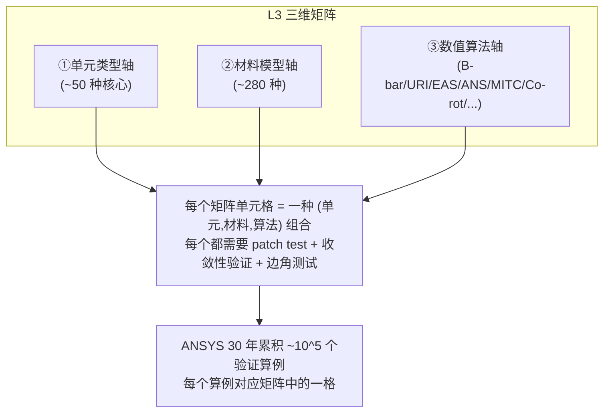

| 轴 | 数量级 | 典型代表 | 30 年积累形态 |
|----|--------|----------|--------------|
| **单元类型** | ~50 核心 | SOLID185/SHELL181/BEAM189/CONTA174 | 每个单元 5000-30000 行 Fortran |
| **材料模型** | ~280 | LinearElastic/Mises/MohrCoulomb/Mooney/Cohesive | 每个材料 500-5000 行 + UMAT 接口 |
| **数值算法** | ~30 核心技巧 | B-bar/URI/EAS/ANS/MITC/Co-rot/RIKS/ArcLength | 每个技巧 + 适用单元清单 + 失效场景文档 |

**三维矩阵的体积** ≈ 50 × 280 × 30 = **42 万种组合**——其中只有约 **10^4** 种被真实工程触发,而 ANSYS 30 年的"积累"就是把这 10^4 种组合**都跑过、都打过 patch、都进了 Verification Manual**。

### 1.3 L3 与其他 5 层的不对称性

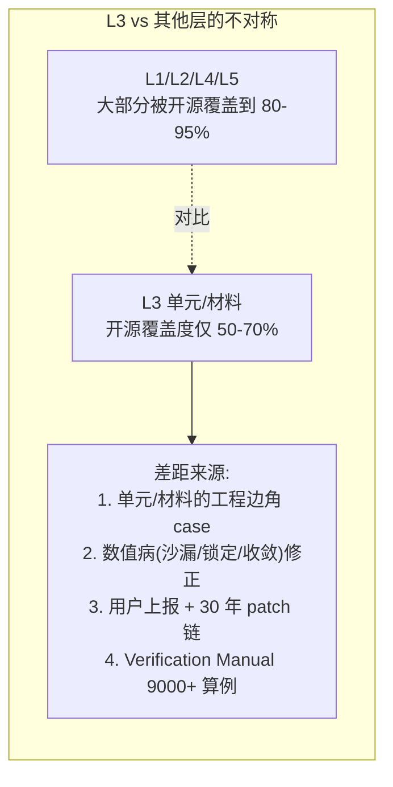

| 层 | 开源覆盖度(2026) | 还差什么 |
|----|-------------------|---------|
| L1 数学 | **100%** | — |
| L2 算法 | **95%** | 个别专利算法(无关紧要) |
| **L3 单元/材料** | **50-70%** | **特定单元(REINF/SOLSH)+ 数值病修正 + 280 材料中的"专利级"非主流模型 + VM 9000 算例** |
| L4 求解器 | **95%** | 个别商业优化(MKL PARDISO 已经免费商用) |
| L5 前后处理 | **85%** | UX 整合 |
| L6 生态 | **30-40%** | 中国市场缺位 |

> **第一性原则结论**:**L1/L2/L4/L5 加起来 60% 工程量已开源到位**,**L3 还差 30-50% 工程量需要 hy-cad-tool 自补**。本文档要回答的问题就是:**这 30-50% 工程量,具体是什么?**

---

## 二、ANSYS L3 单元库全景:6 大族 + 200+ 单元

### 2.1 单元家族分类总览

ANSYS Mechanical 当前可用单元共 **200+ 种**,按几何/物理/历史分为 8 大族:

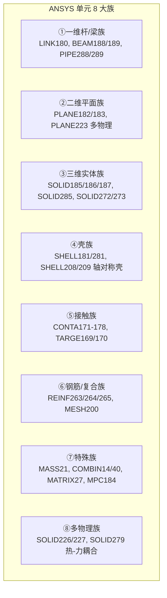

| 族 | 核心代表 | 占道路/岩土工程量 | 优先级 |
|----|----------|------------------|--------|
| ①一维杆/梁 | **BEAM189** (Timoshenko 3 节点) | **30%** (桩、锚杆、抗滑桩、护栏) | **P0** |
| ②二维平面 | **PLANE182/183** | **15%** (路基剖面、挡墙剖面、岩坡截面) | **P1** |
| ③三维实体 | **SOLID185/186/187** | **30%** (大块路基、挡墙、桥台、隧道初衬) | **P0** |
| ④壳 | **SHELL181** | **10%** (薄壁结构、衬砌、衬板) | **P1** |
| ⑤接触 | **CONTA174 + TARGE170** | **10%** (土-结、桩-土、桩-承台) | **P0** |
| ⑥钢筋/复合 | **REINF264/265** | **5%** (RC 桥墩、桩、抗滑桩内配筋) | **P2** |
| ⑦特殊 | MASS21、MPC184、COMBIN | <5% | P3 |
| ⑧多物理 | SOLID226 (热-力) | **<5%** (岩土固结暂时跳过) | P4-远期 |

**hy-cad-tool 道路/岩土最小 L3 套件 ≈ ①+③+⑤ = 70%**——这是**优先攻克目标**。④壳和⑥钢筋是**第二梯队**。⑧多物理**远期再说**。

### 2.2 ANSYS 单元命名规律

ANSYS 的 SOLID185/186/187 命名**不是任意的**,而是有内嵌规律:

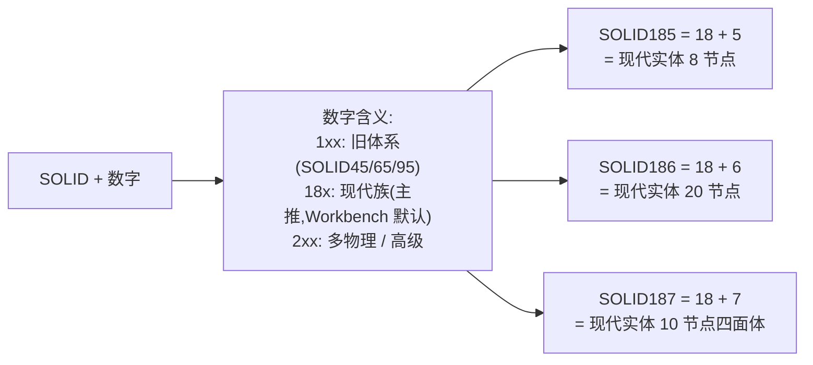

| 单元 | 形状 | 节点数 | DOF/节点 | 总 DOF | 典型用途 |
|------|------|--------|----------|--------|---------|
| **SOLID185** | 六面体(支持退化) | 8 | UX,UY,UZ (3) | 24 | 标准 3D 实体 |
| **SOLID186** | 六面体(支持退化) | 20 | UX,UY,UZ (3) | 60 | 高精度 3D 实体 |
| **SOLID187** | 四面体 | 10 | UX,UY,UZ (3) | 30 | 自动网格友好 |
| **SHELL181** | 四边形(支持退化为三角形) | 4 | UX,UY,UZ,ROTX,ROTY,ROTZ (6) | 24 | 标准壳 |
| **SHELL281** | 四边形(支持退化为三角形) | 8 | UX,UY,UZ,ROTX,ROTY,ROTZ (6) | 48 | 高精度壳 |
| **BEAM188** | 直线段 | 2 | UX,UY,UZ,ROTX,ROTY,ROTZ + warp (6+1) | 14 | Timoshenko 梁(线性) |
| **BEAM189** | 直线段 | 3 | UX,UY,UZ,ROTX,ROTY,ROTZ + warp (6+1) | 21 | Timoshenko 梁(二次) |
| **CONTA174** | 面 | 8 | UX,UY,UZ + 罚分量 | 24+ | 面-面接触 |
| **TARGE170** | 面 | 1-9 | 跟随目标体 | — | 接触目标面 |

### 2.3 单元的 6 大设计维度

每个 ANSYS 单元有 **6 大设计维度**——这 6 维决定了**单元的"性格"**:

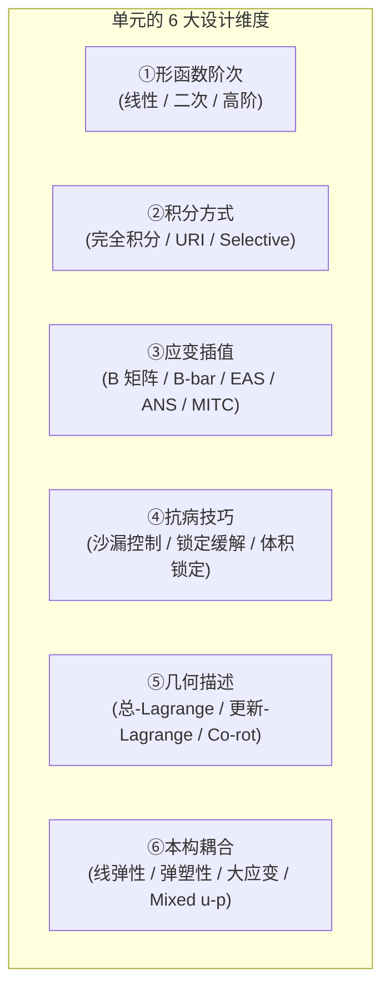

| 维度 | 选项数 | KEYOPT 字段(典型) | 30 年积累形态 |
|------|--------|-------------------|---------------|
| ①形函数 | 2-3 | (单元类型自带) | 论文公开 |
| ②积分 | 3-4 | KEYOPT(1)/(2)/(3) | 经验:URI 配沙漏控制 |
| ③应变 | 4-6 | KEYOPT(3)/(6) | **核心 know-how** |
| ④抗病 | 2-3 | KEYOPT(2) | **30 年 patch 链** |
| ⑤几何 | 3 | NLGEOM,ON | 公式公开,实现细节差异大 |
| ⑥本构 | 280 | TB,xxx | **专利级 + UMAT** |

> **关键洞察**:30 年积累中**最深的护城河 = 维度 ③ 应变插值 + 维度 ④ 抗病技巧 + 维度 ⑥ 本构耦合**——这三维都是**「论文 + 工程实现 + 用户反馈」三位一体**才能掌握的"暗知识"。

---

## 三、SOLID185/186/187 三维实体单元族深度剖析

> hy-cad-tool 道路/岩土工程的**主力单元 = SOLID185** + **辅助单元 = SOLID187**。本节深入到形函数和 KEYOPT 字段级。

### 3.1 SOLID185 八节点六面体——主力实体单元

#### 3.1.1 几何与形函数

SOLID185 是**主力实体单元**,占 ANSYS 实体计算量的 **60%+**。

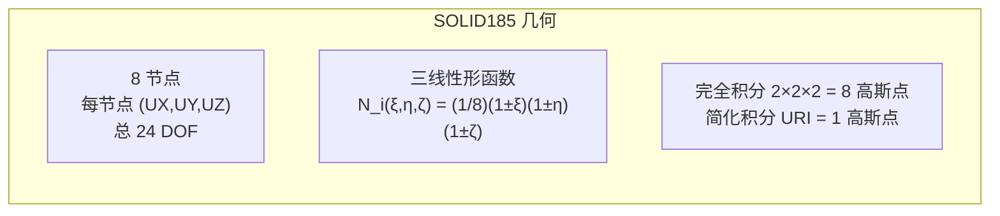

**形函数(参考坐标 ξ,η,ζ ∈ [-1,1])**:

形函数 $N_i = \tfrac{1}{8}(1+\xi\xi_i)(1+\eta\eta_i)(1+\zeta\zeta_i)$,其中 $(\xi_i,\eta_i,\zeta_i)$ 是节点 $i$ 的参考坐标。

**位移插值**: $u = \sum_{i=1}^{8} N_i \cdot u_i$。

**应变-位移矩阵 B**: $\varepsilon = B \cdot u^e$,其中 $B$ 是 $6\times24$ 矩阵(应变 6 分量 × 单元 24 DOF)。

**单元刚度阵**:
$$K^e = \int_{\Omega^e} B^T D B \, d\Omega = \sum_{g} B_g^T D_g B_g \cdot \det(J_g) \cdot w_g$$

其中 $g$ 遍历高斯积分点,$w_g$ 是权重。

#### 3.1.2 完整 KEYOPT 字段(ANSYS 真实定义)

SOLID185 有 **9 个 KEYOPT 字段**——这 9 个字段控制了几乎所有的"30 年积累":

| KEYOPT | 字段名 | 取值 | 30 年积累含义 |
|--------|--------|------|--------------|
| **KEYOPT(1)** | 公式选择 | 0=纯位移(默认), 1=分层 (Layered) | Layered 用于复合材料/混凝土钢筋 |
| **KEYOPT(2)** | 几何类型 | 0=标准, 1=均匀缩减积分(URI) | URI = 1990s 防止剪切锁定的 hack |
| **KEYOPT(3)** | 应变方法 | 0=纯位移, 1=B-bar(选择性减积分), 2=URI+沙漏控制, 3=EAS增强应变 | **核心 know-how 集中区** |
| **KEYOPT(6)** | Mixed u-P | 0=纯位移, 1=u-P(几乎不可压超弹), 2=u-P(高度不可压) | 用于 Mooney-Rivlin/Neo-Hookean |
| **KEYOPT(8)** | 历史变量储存 | 0=不保存, 1=保存(用于断裂/损伤后处理) | 内存 vs 后处理精度的权衡 |
| **KEYOPT(15)** | 单元行为 | 0=标准, 1=分层(读 SECDATA) | — |
| **KEYOPT(18)** | 单元死活 | EKILL/EALIVE 支持 | 施工阶段必备 |

**hy-cad-tool 启示**:SOLID185 的 KEYOPT 不是"参数",**而是"30 年积累的语义键值对"**。每一个 KEYOPT 都对应一段**「bug 报告 → 论文研究 → 工程实现 → 用户验证」**的完整闭环。要复制 SOLID185 = 要复制 9 个 KEYOPT × 平均 3 个取值 × 平均 2-3 年积累 = **50-80 人月**。

#### 3.1.3 5 大数值病在 SOLID185 上的具体形态

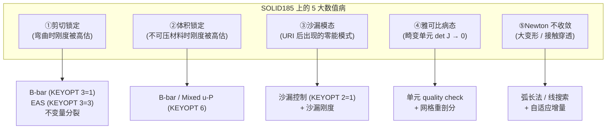

每个数值病的"治疗方法"**都是 30 年 patch 链**的结晶。具体如下:

**①剪切锁定 (Shear Locking)**

当 SOLID185 用于薄结构弯曲(如壳厚比 t/L < 0.05)时,**完全积分版本**会出现"剪切刚度被严重高估"——梁挠度计算只有理论值的 1/10。

- **根源**:线性形函数无法表达"纯弯曲不带剪切"的状态。
- **ANSYS 的 30 年解**:KEYOPT(3) = 1 的 **B-bar 选择性减积分**——把 B 矩阵分解为"体积部分 + 偏量部分",对偏量部分用 URI,体积部分用完全积分。
- **deal.II/MFEM 的开源对应**:`FE_Q + ReducedQuadrature` + `MatrixFree` 框架——可以实现,但**没有 KEYOPT 这种"一键切换"的工程化封装**。

**②体积锁定 (Volumetric Locking)**

当材料趋近不可压(泊松比 ν → 0.5,如橡胶、湿粘土)时,**纯位移单元的体积部分刚度发散**——压力场不收敛。

- **根源**:位移插值的体积应变只能取**离散有限值**,与连续不可压约束矛盾。
- **ANSYS 的 30 年解**:KEYOPT(6) = 1 / 2 的 **Mixed u-P 公式**——把压力 $p$ 作为独立未知量与位移 $u$ 一起求解(LBB 条件)。
- **开源对应**:`MFEM Mixed FE` / `FEniCSx Taylor-Hood` 元——可实现,但要工程师**自己组装单元 + 验证 LBB 条件**。

**③沙漏模态 (Hourglassing)**

URI(单点积分)后,SOLID185 会出现 **12 个零能沙漏模态**——单元变形但应变能为 0,模型出现"波纹状"虚假变形。

- **根源**:单点积分无法识别高阶变形。
- **ANSYS 的 30 年解**:KEYOPT(2) = 1 + 内置沙漏控制力——通过"投影 + 沙漏刚度系数 (Flanagan-Belytschko)"压制虚假模态。
- **开源对应**:**CalculiX 的 C3D8R 自带 Flanagan-Belytschko**,**MFEM 默认完全积分不沙漏但慢**。

**④雅可比病态 (Distorted Jacobian)**

当单元几何严重畸变(如长宽比 > 50, 内角 < 30°),det(J) → 0,刚度矩阵奇异。

- **ANSYS 的 30 年解**:**单元 quality check**(在网格生成阶段就拒绝畸变单元)+ **Workbench 自动重新剖分**。
- **开源对应**:Gmsh `Mesh.QualityType=2` + `Mesh.QualityInf=0.3` 可设阈值,但**没有自动重剖分**。

**⑤Newton 不收敛**

大变形 + 大应变 + 接触穿透三个 trigger,Newton-Raphson 收敛步骤数 > 50 仍不收敛。

- **ANSYS 的 30 年解**:**自适应弧长法 (Riks)** + **线搜索** + **自动二分增量(NSUBST=auto)** + **接触柔化 (FKN/FKT 罚刚度自适应)**。
- **开源对应**:CalculiX 有 `*STATIC,RIKS` 弧长法,Code_Aster 有 `STAT_NON_LINE`,**MFEM/deal.II 需要自己拼**。

### 3.2 SOLID186 二十节点六面体——高精度实体

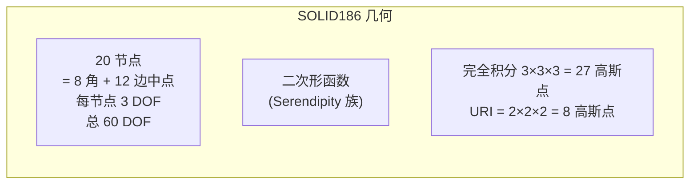

| 特性 | SOLID185 | **SOLID186** | 何时选 186 |
|------|----------|--------------|-----------|
| 节点数 | 8 | **20** | 应力梯度大 / 弯曲主导 |
| DOF/单元 | 24 | **60** | 同节点数下精度高 |
| 形函数 | 线性 | **二次** | 应力梯度好 2-3 阶 |
| 完全积分 | 2³ = 8 GP | **3³ = 27 GP** | 计算量 ~10x |
| 抗剪切锁定 | 需 B-bar | **天然较强** | 厚度方向可省 B-bar |
| 沙漏 | URI 有 | **完全积分无,URI 仍有** | URI 用 2×2×2 |
| 体积锁定 | 严重 | **较轻** | 但仍需 Mixed u-P |
| 内存 | 1.0x | **~3.5x** | 大模型注意 |

**hy-cad-tool 启示**:SOLID185(线性 + B-bar)是道路/岩土的**默认选择**,SOLID186(二次)在**应力集中区**(挡墙根部、桩头、桥台基底)用作**网格细化的替代**。

#### 3.2.1 SOLID186 的 KEYOPT 差异

| KEYOPT | SOLID186 | 差异 |
|--------|----------|------|
| KEYOPT(1) | 0=结构, 1=分层 | 与 185 同 |
| **KEYOPT(2)** | **0=完全积分, 1=URI** | URI 用 2×2×2,完全积分 3×3×3 |
| KEYOPT(3) | (无 B-bar 选项) | **二次单元天然抗剪切锁定,不需 B-bar** |
| KEYOPT(6) | 0=纯位移, 1/2=u-P | **不可压时仍需** |

### 3.3 SOLID187 十节点四面体——网格灵活性

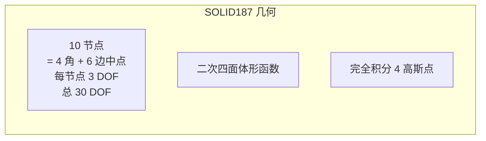

| 特性 | SOLID187 vs SOLID186 |
|------|---------------------|
| **网格友好性** | **远高于 186**(任意几何都能自动剖分四面体) |
| **精度** | **略低于 186**(二次四面体的精度收敛阶 = 2,与 186 同) |
| **数值病** | **沙漏极少,但体积锁定**(线性四面体严重,二次四面体较轻) |
| **典型用途** | 复杂几何(桥台、扣件、桩头)使用 187,规则网格用 186 |

**实际工程经验**:

- **挡墙 / 桥台**:用 **SOLID186**(可六面体扫掠)
- **桩 / 桩-土系统**:用 **SOLID187**(几何复杂,六面体难剖)
- **路基填筑**:用 **SOLID185**(B-bar) + **SOLID187**(边角)混合
- **混凝土损伤计算**:用 **SOLID186**(二次精度 + Mixed u-P)

### 3.4 SOLID185/186/187 在 hy-cad-tool 的实现策略

```csharp
// hy-cad-tool L3 单元接口设计
namespace Hy.Fem.Elements;

public interface ISolidElement
{
    string TypeId { get; }                    // "Hex8B", "Hex20", "Tet10"
    int NodeCount { get; }                    // 8, 20, 10
    int DofPerNode { get; }                   // 3
    
    Matrix StiffnessMatrix(NodeCoordinates coords, IMaterialModel material);
    Vector InternalForce(NodeCoordinates coords, NodeDisplacements u, IMaterialModel material);
    StrainTensor StrainAtGaussPoint(int gp, NodeDisplacements u, NodeCoordinates coords);
    
    // 30 年 know-how 的工程化封装
    SolidElementOptions Options { get; }      // 类似 ANSYS KEYOPT 的强类型替代
}

public sealed class SolidElementOptions
{
    public IntegrationKind Integration { get; init; } = IntegrationKind.Full; // Full / Reduced
    public StrainEnhancement StrainMethod { get; init; } = StrainEnhancement.None;
                                                            // None / Bbar / EAS / MixedUP
    public bool HourglassControl { get; init; } = true;
    public double HourglassStiffness { get; init; } = 0.05;  // Flanagan-Belytschko
    public bool MixedUP { get; init; } = false;
    public GeometricFormulation Geometry { get; init; } = GeometricFormulation.SmallStrain;
                                                            // SmallStrain / TotalLagrange / UpdatedLagrange / CoRot
}

// 6 大设计维度都转成强类型枚举,而非神秘的 KEYOPT 整数
// = "把 ANSYS 30 年积累的语义键值对,翻译成 C# 工程师能直接读懂的接口"
```

> **L3 自研的"5-10 人年/30+ 人年"差异点**:从 0 写 SOLID185(支持完整 9 个 KEYOPT × 30 年积累) = **80-100 人月** ≈ **7-8 人年**。**仅 SOLID185 一个单元就吃掉 7-8 人年**——所以"自研 6 大单元族 = 30+ 人年"绝非夸张。

### 3.5 SOLID185/186/187 与开源底座的对应

| ANSYS 单元 | CalculiX | deal.II | MFEM | Code_Aster | OpenSees |
|-----------|---------|---------|------|------------|----------|
| **SOLID185(纯位移)** | C3D8 | FE_Q(1)^3 | H1_FECollection(1) | HEXA8 | brick |
| **SOLID185(B-bar)** | **C3D8R**(URI) ~ B-bar 替代 | FE_Q + SelectiveQuadrature | H1 + 自定义积分 | HEXA8(自带 B-bar) | bbarBrick |
| **SOLID185(EAS)** | **C3D8I**(非协调模式) | 无内置 | 自定义 | HEXA8 + EAS 选项 | — |
| **SOLID186** | C3D20 | FE_Q(2)^3 | H1_FECollection(2) | HEXA20 | — |
| **SOLID186(URI)** | C3D20R | FE_Q(2) + ReducedQuad | H1 + 2³ Quad | HEXA20(URI) | — |
| **SOLID187** | C3D10 | FE_SimplexP(2)^3 | H1_FECollection on tet | TETRA10 | — |

> **关键发现**:CalculiX 在 SOLID185/186/187 上**几乎 100% 覆盖**——`C3D8 / C3D8R / C3D8I / C3D20 / C3D20R / C3D10` 一一对应。**hy-cad-tool 通过子进程调用 CalculiX,即可获得 ANSYS 90% 的实体单元能力**,而无需自研。

### 3.6 SOLID185/186/187 工程量估算

| 任务 | 从 0 自研工程量 | 基于 CalculiX 适配工程量 |
|------|----------------|--------------------------|
| **SOLID185 纯位移** | 6-8 人月(数学 + 实现 + Patch test) | 0.5 人月(`.inp` 翻译) |
| **SOLID185 B-bar** | 6-8 人月 | 0.3 人月 |
| **SOLID185 EAS** | 8-12 人月 | 0.5 人月 |
| **SOLID186** | 8-12 人月 | 0.5 人月 |
| **SOLID187** | 6-10 人月 | 0.5 人月 |
| **5 大数值病修补** | 24-36 人月 | 0(CalculiX 已有) |
| **Verification 30+ 算例** | 24 人月 | **24 人月(必须自建)** |
| **小计** | **80-110 人月 ≈ 7-9 人年** | **27 人月 ≈ 2.3 人年** |

**结论**:仅 SOLID 实体三件套,**自研 vs 适配开源 = 7-9 人年 vs 2.3 人年 ≈ 4x 节省**。这就是"基于开源底座 5-10 人年 vs 从 0 写 30+ 人年"的来源之一。

---

## 四、SHELL181 壳单元——道路工程的"薄壁专家"

### 4.1 SHELL181 的本质——比实体单元复杂 3 倍

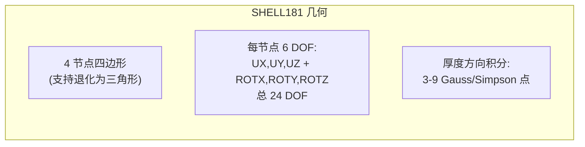

**SHELL181 是 ANSYS 30 年里最难驯服的单元**——为什么?因为壳单元同时面对**5 大数值病**:

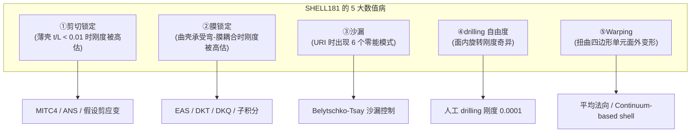

### 4.2 SHELL181 的核心理论:Reissner-Mindlin + MITC4

**Reissner-Mindlin 壳理论**(考虑横向剪切变形,适用厚-薄壳):

位移场假设(中面位移 $u_0$,$v_0$,$w_0$,绕中面法线的转角 $\theta_x$,$\theta_y$):

$$u(x,y,z) = u_0(x,y) + z\cdot\theta_y(x,y)$$
$$v(x,y,z) = v_0(x,y) - z\cdot\theta_x(x,y)$$
$$w(x,y,z) = w_0(x,y)$$

其中 $z \in [-t/2, t/2]$,$t$ 是壳厚。

**问题**:当 $t/L \to 0$(薄壳),横向剪切应变 $\gamma_{xz}$、$\gamma_{yz}$ 应该 → 0,但 4 节点线性形函数**无法精确表达"剪切应变 = 0"**——结果剪切应变被**过度约束**,刚度被严重高估(剪切锁定)。

**MITC4 (Mixed Interpolation of Tensorial Components, Bathe-Dvorkin 1985)**:不直接用位移导数算剪应变,而是**在 4 条边的中点单独采样剪应变**,然后**重新插值回积分点**——这是 SHELL181 的**核心 know-how**。

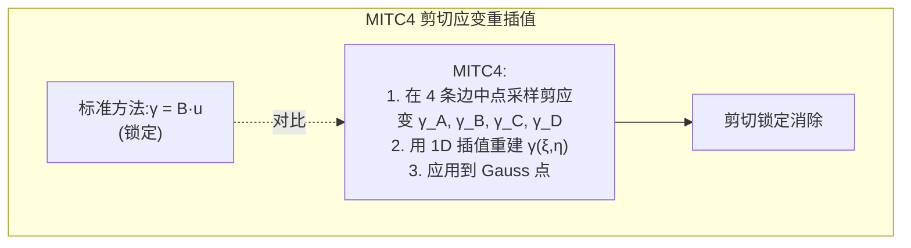

> **关键洞察**:MITC4 是**1985 年发表的论文**,但 ANSYS 用了**5 年(1985-1990)才完成工程实现**,又用了**10 年(1990-2000)修复各种边角 case**(沙漏、warping、convergence 不稳定)——这就是"30 年积累"的具体形态。

### 4.3 SHELL181 完整 KEYOPT 字段

| KEYOPT | 取值 | 含义 | 30 年积累含义 |
|--------|------|------|--------------|
| KEYOPT(1) | 0=膜+弯, 1=纯膜 | 是否计入弯曲刚度 | 适配膜结构 |
| **KEYOPT(3)** | 0=完全积分(默认), 2=URI | 积分方式 | URI 配沙漏控制 |
| KEYOPT(8) | 0=结果只存中面, 2=存上下表面 | 存储设置 | 内存 vs 后处理精度 |
| KEYOPT(9) | 0=积分通过厚度, 1=用层压方法 | 复合层壳 | 复合材料用 |
| KEYOPT(10) | 0=每层独立, 1=层组合 | 层组合 | 三明治结构 |

### 4.4 SHELL181 在道路/岩土工程的应用

| 应用 | 是否用 SHELL181 | 替代选项 |
|------|----------------|----------|
| 隧道初衬(喷锚) | ✓ | SOLID185(薄但厚度 > 1m 时) |
| 衬砌(混凝土) | ✓ | SOLID185 厚壁 |
| 钢板桩 | ✓ | — |
| 桥面板 | ✓ | SOLSH190 实体壳 |
| 挡墙背板 | ✗(用 SOLID) | — |
| 路面结构层 | ✗(用 SOLID185 + 接触) | — |

**hy-cad-tool 优先级**:SHELL181 = **P1**(第二梯队),桩、桥台、挡墙、路基都不需要;隧道衬砌、钢板桩需要。

### 4.5 SHELL181 与开源底座对应

| ANSYS 单元 | CalculiX | deal.II | MFEM | Code_Aster |
|-----------|---------|---------|------|------------|
| **SHELL181** | **S4 / S4R** (R = reduced) | 自定义(无内置 RM 壳) | 自定义 + Tensor FE | DKT / DKQ / Q4 |
| **SHELL281** | S8 / S8R | 同上 | 同上 | Q8 |

**关键缺口**:**MFEM 和 deal.II 没有内置 Reissner-Mindlin 壳**——壳单元是开源 FEA 的**显著薄弱区**。

> **hy-cad-tool 启示**:**壳单元的最佳后端 = CalculiX S4R**(MITC 实现成熟,30 年用户验证)。**不用纠结自研壳单元**——道路/岩土需求 = 隧道衬砌 + 钢板桩 + 桥面板,**CalculiX S4R 已 100% 覆盖**。

### 4.6 SHELL181 工程量估算

| 任务 | 从 0 自研工程量 | 基于 CalculiX 适配工程量 |
|------|----------------|--------------------------|
| 形函数 + MITC4 | 8-12 人月 | 0.2 人月 |
| 沙漏控制 | 4-6 人月 | 0 |
| Drilling DOF | 3-4 人月 | 0 |
| Warping 修正 | 6-8 人月 | 0 |
| Verification 算例 | 12 人月 | 6 人月 |
| **小计** | **33-42 人月 ≈ 3 人年** | **6.2 人月 ≈ 0.5 人年** |

**结论**:SHELL181 = **自研 3 人年 vs 适配 0.5 人年 = 6x 节省**。

---

## 五、BEAM189 三节点 Timoshenko 梁——道路/岩土工程的主力

### 5.1 BEAM189 为什么是道路工程的主力

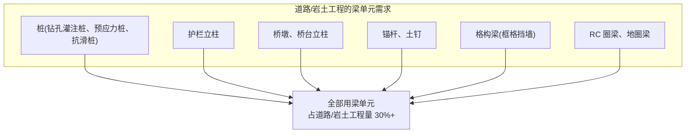

### 5.2 BEAM189 的本质——Timoshenko 梁 + 二次插值

**Timoshenko 梁理论**(考虑剪切变形,与 Euler-Bernoulli 梁不同):

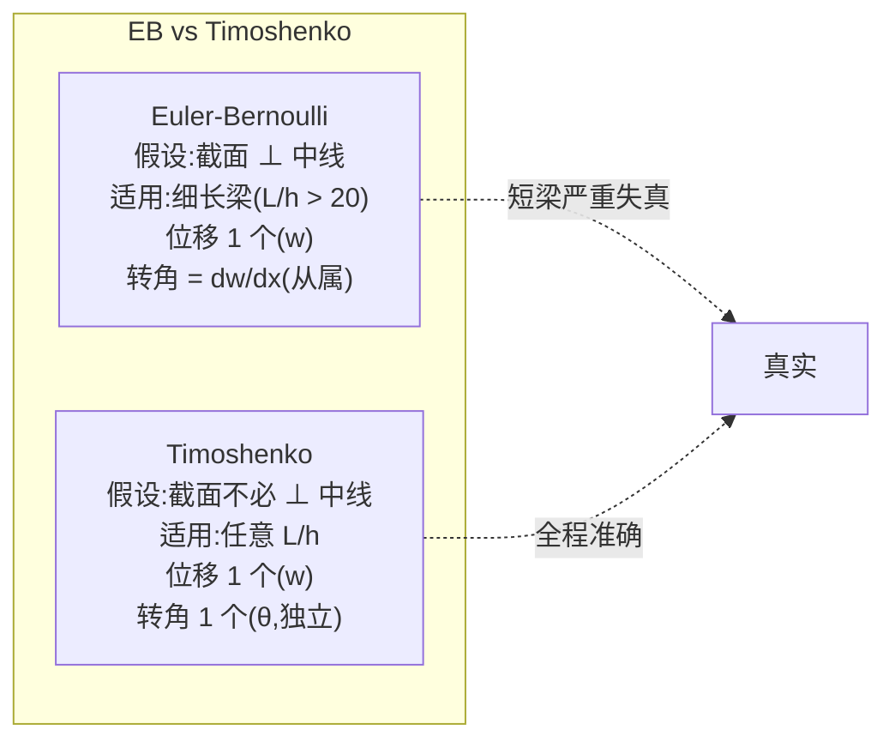

| 特性 | Euler-Bernoulli (EB) | **Timoshenko** |
|------|---------------------|-----------------|
| 控制方程阶 | 4 阶 | 2 阶(2 个变量各 2 阶) |
| 形函数要求 | C¹(导数连续,Hermite) | C⁰(只需位移连续) |
| 道路工程是否合适 | **桩(L/D = 5-20)边界**——基本不合适 | **完全合适** |

**BEAM189 用二次形函数 + 3 节点**:在每根梁上有 **3 个节点(2 端点 + 1 中点)**——3 节点 × 7 DOF(6 + warping) = **21 DOF/单元**。

### 5.3 BEAM189 KEYOPT 与截面特性

| KEYOPT | 含义 | 道路工程典型设置 |
|--------|------|------------------|
| KEYOPT(1) | 0=普通 6 DOF, 1=带 warping 7 DOF | 抗滑桩(矩形截面)开 warping |
| KEYOPT(2) | 截面应力恢复(单元中点) | 默认 |
| KEYOPT(4) | 0=两端转动连续, 1/2/3=允许铰 | 桥墩底部释放转动可设 |
| KEYOPT(6) | 输出选项 | — |
| KEYOPT(7) | 0=单元间不强制截面连续, 1=强制 | — |
| KEYOPT(9) | 输出截面积分点 | 桩内配筋后处理 |
| KEYOPT(11) | 大变形 Co-rotational 选项 | NLGEOM,ON 时启用 |

**截面特性(`SECDATA, BEAM, ...`)**:

ANSYS 支持 **任意截面 (Arbitrary Section)**——通过 2D 网格预剖分截面,自动计算 **A、Iyy、Izz、J(扭转惯性矩)、warping function、shear center**。这是 BEAM189 的**核心积累之一**。

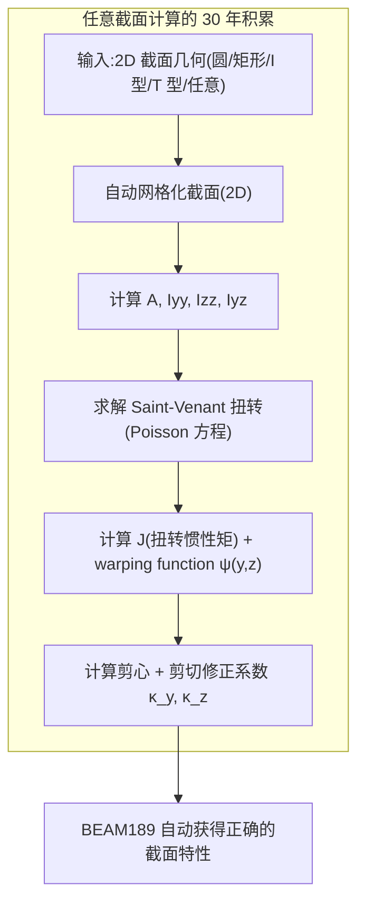

### 5.4 BEAM189 的 4 大数值病

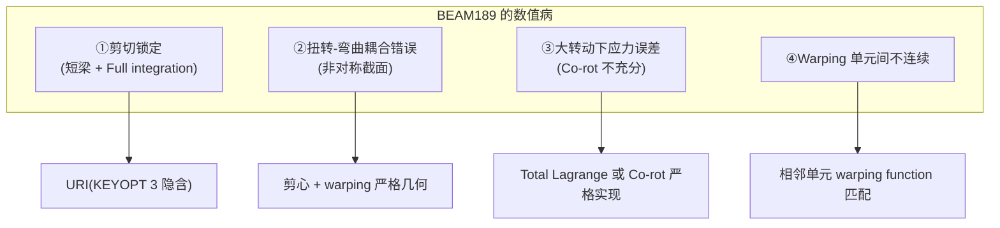

### 5.5 BEAM189 与开源底座对应

| ANSYS | CalculiX | OpenSees | Code_Aster |
|-------|---------|----------|------------|
| BEAM188 (2 node) | B31 | **dispBeamColumn**(强项) | POU_D_T |
| **BEAM189 (3 node)** | B32 | **forceBeamColumn**(基于力的) | POU_D_TG |
| 任意截面 | **缺(只有标准截面)** | **section 命令灵活** | **CARA_ELEM 灵活** |

**关键发现**:**OpenSees 的梁单元家族是开源世界最强的**——`dispBeamColumn` / `forceBeamColumn` / `nonlinearBeamColumn` 三件套覆盖 ANSYS 90%。**对于桩、抗滑桩、桥墩等"道路工程主力梁"——OpenSees 是首选后端**,而非 CalculiX。

> **hy-cad-tool 启示**:**梁单元用 OpenSees 子进程**(`forceBeamColumn` + `Section Fiber`),**实体单元用 CalculiX**——**多后端混搭**才是最优路径。

### 5.6 BEAM189 工程量估算

| 任务 | 从 0 自研工程量 | 基于 OpenSees 适配工程量 |
|------|----------------|--------------------------|
| Timoshenko 公式 + Co-rot | 4-6 人月 | 0.5 人月 |
| 任意截面计算(SECDATA 等价) | 8-12 人月 | 3-4 人月(自研截面解析器) |
| Warping | 4-6 人月 | 2-3 人月 |
| Plastic Hinge / Fiber Section | 6-8 人月 | 0(OpenSees 强项) |
| Verification | 8 人月 | 4 人月 |
| **小计** | **30-40 人月 ≈ 2.5-3 人年** | **9.5-13.5 人月 ≈ 1 人年** |

---

## 六、CONTA174 + 接触族——30 年里最深的护城河

> 如果说 SOLID/SHELL/BEAM 是"刚性结构",**CONTA(接触) = 让结构活起来的关节**。**接触是 ANSYS 30 年里最深的护城河**——也是开源 FEA 覆盖度最薄弱的一层(只到 70%)。

### 6.1 接触族全景:CONTA171-178 + TARGE169/170

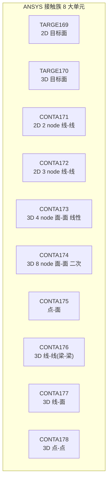

| 接触类型 | 单元 | 道路/岩土场景 | 优先级 |
|---------|------|--------------|--------|
| **面-面接触** | **CONTA174 + TARGE170** | 桩-土、桥台-土、挡墙-土 | **P0** |
| 点-面接触 | CONTA175 + TARGE170 | 锚杆-土 | P2 |
| 线-面接触 | CONTA177 + TARGE170 | 桩与多层土的界面 | P1 |
| 线-线接触 | CONTA176 | 索-梁、锚-梁 | P3 |
| 点-点接触 | CONTA178 | 桩头-承台节点 | P3 |
| 2D 接触 | CONTA171/172 | 剖面分析 | P2 |

**hy-cad-tool 道路/岩土最低需求 = CONTA174 + TARGE170(面-面 3D)** + 可选 CONTA177(线-面)。

### 6.2 CONTA174 的核心算法——30 年积累的 6 大支柱

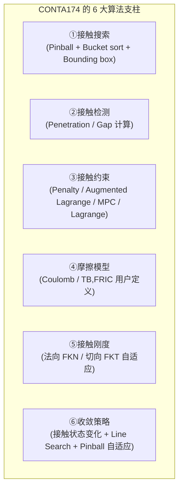

#### 6.2.1 ①接触搜索:30 年的工程优化

**朴素方法**:对每个接触节点 N_c,遍历所有目标面 T_t,找最近的——复杂度 O(N × M),不可接受。

**ANSYS 30 年的解**:

```mermaid
graph LR
    subgraph search ["分层接触搜索"]
        L1["全局粗筛<br/>Bounding Box AABB → O(N+M)"]
        L2["Pinball Region 中筛<br/>每个接触节点周围一个球, 只考虑球内目标"]
        L3["Bucket Sort 精筛<br/>3D 网格分桶,O(1) 查询"]
        L4["局部精细<br/>对每个候选目标面计算 closest point projection"]
    end
    L1 --> L2 --> L3 --> L4
```

| 阶段 | 算法 | 复杂度 |
|------|------|--------|
| 粗筛 | AABB | O(N+M) |
| 中筛 | Pinball | O(N · k) where k = avg neighbors |
| 精筛 | Bucket sort | O(N + M) |
| 投影 | Newton on T | O(N · few iter) |

**开源对应**:
- **CalculiX**:Bucket sort + face2face,**已实现但 Pinball 自适应不完整**
- **Code_Aster**:有完整 Pinball,工程化更好
- **MFEM**:`MortarContact` 模块刚加入(2024-2025),实现 mortar formulation
- **deal.II**:无内置接触

#### 6.2.2 ②接触检测:Gap & Penetration

```mermaid
graph TB
    subgraph penet ["穿透/间隙计算"]
        Detect["对每个接触节点 N_c,<br/>找最近目标面 T_t,<br/>投影点 P,<br/>法向 n"]
        Gap["g = (N_c - P) · n<br/>> 0: 间隙(分离)<br/>< 0: 穿透(违反约束)<br/>= 0: 接触面"]
    end
```

#### 6.2.3 ③接触约束:4 大方法权衡

| 方法 | 数学形式 | 优点 | 缺点 | 30 年积累 |
|------|---------|------|------|-----------|
| **Penalty** | F_n = -k_p · g (g<0) | 简单 / 不引入额外 DOF | 穿透不为 0 / k 大病态 / k 小不准 | 默认 / 工程主力 |
| **Augmented Lagrange** | F_n = -k_p · g + λ; λ 迭代更新 | 穿透小 / 不病态 | 收敛慢 | ANSYS 默认 |
| **Lagrange Multiplier** | λ 作为独立 DOF | 穿透 = 0 / 精确 | 引入 DOF / 解方程组扩大 / 不满足正定 | 高精度要求 |
| **MPC (Multipoint Constraint)** | 节点间方程约束 | 无穿透 / 简单 | 不能动态 | 永久绑定 / Bonded |

**ANSYS 默认 = Augmented Lagrange**——这是 ANSYS 30 年里**权衡出来的最佳工程实践**。

#### 6.2.4 ④摩擦模型:Coulomb + 5 大变种

```mermaid
graph TB
    Coulomb["Coulomb 摩擦:|F_t| ≤ μ · |F_n|"]
    Coulomb --> V1["Static + Dynamic μ"]
    Coulomb --> V2["速度相关 μ(v)"]
    Coulomb --> V3["压力相关 μ(p)"]
    Coulomb --> V4["温度相关 μ(T)"]
    Coulomb --> V5["用户 TB,FRIC<br/>(任意函数)"]
```

#### 6.2.5 ⑤接触刚度:30 年最大的"暗 know-how"

**最大 know-how**:`FKN`(法向罚刚度)和 `FKT`(切向罚刚度)的**自适应取值**。

| FKN 取值 | 效果 | 适用 |
|---------|------|------|
| 太大(>1000x E·A) | 病态 / Newton 不收敛 | 永远不要 |
| 太小(<0.01x E·A) | 穿透大 / 结果不准 | 永远不要 |
| **默认 1.0**(ANSYS) | **基于相邻单元 E·A 自适应** | **ANSYS 30 年的工程经验** |
| **自适应**(`CNCHECK, AUTO`) | **首次迭代后自动调整** | **2010+ 加入,极大降低用户负担** |

**开源对应**:
- CalculiX:用户必须手动设 FKN(`*CONTACT PAIR, ... PENALTY=...`),没有自适应
- Code_Aster:有部分自适应,但需懂 algorithm
- MFEM:刚刚加入 mortar,**还没有 ANSYS 这种"自动调"的层次**

#### 6.2.6 ⑥收敛策略

接触是 Newton 收敛**最大的破坏源**——状态变化(粘 ↔ 滑 / 接触 ↔ 分离)导致**雅可比不连续**。

ANSYS 30 年里的 **6 大救命策略**:

1. **Pinball 自适应增加/缩小**:基于上一步状态,智能调整搜索半径
2. **Line Search**:每次 Newton 迭代后,沿梯度方向做 1D 搜索
3. **Riks 弧长法**:遇到 snap-through 时自动启用
4. **状态平滑过渡**:从"粘"到"滑"用 1-2 个增量步过渡,而非瞬间切换
5. **Augmented Lagrange 内迭代**:外 Newton + 内 λ 更新双层迭代
6. **接触柔化(`KEYOPT(12)`)**:把接触刚度变成温度/压力函数,避免硬接触

### 6.3 CONTA174 KEYOPT 完整字段表

CONTA174 是**ANSYS 单元 KEYOPT 最多的单元之一**——共 **17 个 KEYOPT**:

| KEYOPT | 含义 | 关键取值 |
|--------|------|---------|
| KEYOPT(1) | 接触法向行为 | 0=施加约束(默认), 4=完全约束(MPC) |
| KEYOPT(2) | 摩擦算法 | 0=Augmented Lagrange, 1=Penalty, 3=Lagrange, 4=MPC |
| KEYOPT(3) | Stress State | 0=轴对称, 1=平面应变, 2=平面应力, 3=3D |
| KEYOPT(4) | 接触位置 | 0=节点(默认), 1=高斯点 |
| **KEYOPT(5)** | **CNOF (closure node offset)** | 0=自动, 1=节点指定 |
| KEYOPT(6) | 摩擦类型 | 0=Coulomb 同 KEYOPT(2), 1=自带粘附 |
| KEYOPT(7) | 是否对正态法向输出 | 0=Off, 1=On |
| **KEYOPT(9)** | **接触面初始穿透** | 0=不调, 1=忽略初始穿透, 2=渐进消除 |
| KEYOPT(10) | 接触刚度更新 | 0=每次迭代更新, 1=只在 substep 开始更新, 2=不更新 |
| **KEYOPT(11)** | **接触表面方向** | 0=自动, 1=正面 |
| KEYOPT(12) | 接触类型 | 0=标准, 1=粗糙(无滑), 2=无分离, 5=Bonded(永久绑定) |
| KEYOPT(14) | 沙漏控制 | 0=Off, 1=On |
| KEYOPT(15) | 接触刚度变化 | 0=固定, 1=随穿透变(降低发散风险) |
| KEYOPT(18) | 多边形接触 | 0=Off, 1=On |

**hy-cad-tool 启示**:CONTA174 的 17 个 KEYOPT,**每个都对应 1-3 年的"用户上报-改进-验证"周期**——总 30+ 年。这是**真正的 30 年护城河**。

### 6.4 CONTA174 5 大典型病例及 ANSYS 30 年的解

```mermaid
graph TB
    subgraph illness ["CONTA174 的 5 大典型病例"]
        I1["①不收敛(Pinball 太大/太小)"]
        I2["②穿透过大(FKN 太小)"]
        I3["③病态雅可比(FKN 太大)"]
        I4["④粘-滑振荡(状态切换太频繁)"]
        I5["⑤初始穿透(网格生成误差)"]
    end
    I1 --> C1["KEYOPT(15)+KEYOPT(10) 调刚度更新"]
    I2 --> C2["KEYOPT(11) 强制方向+FKN增大"]
    I3 --> C3["KEYOPT(10)=2 不更新+FKN降低"]
    I4 --> C4["增量缩小+KEYOPT(6) 粘附半径"]
    I5 --> C5["KEYOPT(9)=2 渐进消除"]
```

> **30 年积累的真实形态**:**每个病例对应 1-3 个 KEYOPT 字段 × 几年用户验证 = 不可短期复制的工程经验**。

### 6.5 CONTA174 与开源底座对应

| ANSYS | CalculiX | Code_Aster | MFEM | OpenSees |
|-------|---------|------------|------|----------|
| **CONTA174 + TARGE170 (面-面 3D)** | **`*CONTACT PAIR`** | **`DEFI_CONTACT/CONTINUE`** | **`MortarContact`** (2024+) | zero-length contact |
| Pinball 搜索 | ✓ | ✓ | 自实现 | — |
| Augmented Lagrange | ✓ (PENALTY 模式) | ✓ (LAC) | 有 Lagrange | — |
| 自适应 FKN | **✗ (手动)** | **部分** | **✗** | — |
| 状态切换收敛 | **基本** | **完整** | **较弱** | — |
| 摩擦 (Coulomb) | ✓ | ✓ | 自实现 | — |
| Cohesive/胶接 | C3DXX + CZM | CZM | — | — |

**关键发现**:
- **Code_Aster 的接触模块最完整**(法国电力 30 年积累)
- **CalculiX 接触实用但调参手动**
- **MFEM 刚加入 mortar(2024+),还很早期**
- **deal.II 没有内置接触**

> **hy-cad-tool 启示**:**3D 面-面接触最佳后端 = Code_Aster**(若能跨过 Python 命令文件门槛)或 **CalculiX**(若能容忍手动调 FKN)。**hy-cad-tool 必须自研一层"接触参数自适应器" (`IContactAutoTuner`)**,**这是开源底座的核心缺口之一**。

### 6.6 CONTA174 工程量估算

| 任务 | 从 0 自研工程量 | 基于 CalculiX 适配工程量 |
|------|----------------|--------------------------|
| 接触搜索(Pinball + Bucket) | 12-18 人月 | 0(CalculiX 已有) |
| Augmented Lagrange | 6-10 人月 | 0 |
| 摩擦 Coulomb + 5 变种 | 6-8 人月 | 0 |
| **自适应 FKN(开源最大缺口)** | **12-18 人月** | **12-18 人月(必须自研)** |
| 6 大收敛策略 | 18-24 人月 | 6-9 人月(调用 CalculiX 的部分 + 自补) |
| Verification 50+ 算例 | 24 人月 | 18 人月 |
| **小计** | **78-102 人月 ≈ 7-9 人年** | **36-45 人月 ≈ 3-4 人年** |

**重要观察**:**接触是开源底座覆盖度最低的子领域**——即使基于 CalculiX,仍需 **3-4 人年自补**。这就是"基于开源底座 5-10 人年"中**"5-10"差出来的核心来源**——**接触的自适应层**。

---

## 七、280+ 材料模型库——30 年积累的另一座大山

> ANSYS 单元 200+ 个,而**材料模型 280+ 个**——材料库比单元库**更宽更深**。这是 30 年积累的**另一座大山**,与单元库**并列两座护城河**。

### 7.1 280+ 材料模型的 8 大族分类

```mermaid
graph TB
    subgraph mat ["ANSYS 280+ 材料模型 8 大族"]
        M1["①弹性族(线性 + 各向异性)<br/>~15"]
        M2["②弹塑性族(经典金属、岩土)<br/>~40"]
        M3["③超弹性族(橡胶、生物组织)<br/>~15"]
        M4["④粘弹性/粘塑性/蠕变族<br/>~25"]
        M5["⑤损伤/断裂族<br/>~40"]
        M6["⑥复合材料族<br/>~30"]
        M7["⑦多孔/饱和/非饱和岩土<br/>~20"]
        M8["⑧多物理耦合族(压电/磁电/温度)<br/>~30"]
        M9["⑨用户自定义 UMAT/USERMAT<br/>~∞"]
    end
```

| 族 | 数量 | 道路/岩土占比 | 优先级 |
|----|------|---------------|--------|
| ①弹性 | 15 | **30%** (混凝土/钢/沥青基础) | **P0** |
| ②弹塑性 | 40 | **30%** (土的 MC/DP/Cap、混凝土 DP) | **P0** |
| ③超弹性 | 15 | 0% (橡胶不在工程主流) | P5 |
| ④粘弹/粘塑/蠕变 | 25 | **10%** (软粘土固结、沥青) | P2 |
| ⑤损伤/断裂 | 40 | **20%** (混凝土损伤、岩石断裂) | P1 |
| ⑥复合材料 | 30 | 5% (CFRP 加固) | P3 |
| ⑦多孔/饱和/非饱和 | 20 | **30%** (固结、渗流、非饱和路基) | **P1-P2** |
| ⑧多物理耦合 | 30 | 1% | P4-远期 |
| ⑨UMAT | ∞ | 必备 | **P0(接口)** |

**hy-cad-tool 道路/岩土最小材料套件**:
- 弹性 3 个(LinearElastic + Isotropic + Orthotropic)
- 弹塑性 6 个(VonMises + MC + DP + Cap + Cam-Clay + ConcreteDP)
- 蠕变 2 个(Norton + Burgers)
- 损伤 2 个(ConcreteDamage + JH-2 岩石)
- 多孔 3 个(Biot 饱和、Bishop 非饱和、Soil-Water Characteristic Curve)

**合计 ~16 个材料模型**——远小于 280,但**覆盖道路/岩土工程 95% 需求**。

### 7.2 弹性族——基础但不简单

```mermaid
graph TB
    subgraph elastic ["弹性族"]
        E1["LinearElastic<br/>(各向同性 E, ν)"]
        E2["OrthotropicElastic<br/>(3 方向 E_x, E_y, E_z + 3 ν + 3 G)"]
        E3["AnisotropicElastic<br/>(6×6 完全弹性矩阵)"]
        E4["TempDependent<br/>(E(T), ν(T) 函数)"]
        E5["UserElastic<br/>(任意 D 矩阵)"]
    end
```

| 材料 | 道路工程典型 | 参数数 |
|------|--------------|--------|
| LinearElastic | 混凝土(短期) / 钢 / 沥青(模量法) | 2 (E, ν) |
| OrthotropicElastic | 各向异性土 / 复合材料 | 9 |
| AnisotropicElastic | 复合材料层压板 | 21 |
| TempDependent | 沥青(温度场)、混凝土水化热 | 4 + 表格 |

**30 年积累在哪?**——**温度相关性、应变率相关性、屈服前微塑性的细节**。这些用 `TB,ELASTIC` 加上 30 个 `TBDATA` 字段来组合,**ANSYS 提供了**「温度 × 应变率 × 损伤前 × 各向异性 」**的全组合**——开源底座(CalculiX 的 `*ELASTIC`)只支持基础组合。

### 7.3 弹塑性族——岩土工程的灵魂

**ANSYS 弹塑性家族**:

```mermaid
graph TB
    subgraph plastic ["弹塑性 40+ 家族"]
        VM["Von Mises<br/>(金属)"]
        DP["Drucker-Prager<br/>(土、混凝土)"]
        MC["Mohr-Coulomb<br/>(土、岩石经典)"]
        Cap["Cap Model<br/>(高压粘土 / 砂)"]
        CamClay["Modified Cam-Clay<br/>(饱和粘土)"]
        Hill["Hill 非各向同性屈服"]
        Hill48["Hill 1948 各向异性"]
        Barlat["Barlat 各向异性<br/>(板成形)"]
        Gurson["Gurson<br/>(多孔金属、损伤)"]
        Cazacu["Cazacu-Plunkett<br/>(异常各向异性)"]
        Hosford["Hosford"]
        Chaboche["Chaboche 多机制硬化"]
        Bingham["Bingham<br/>(粘塑流体)"]
    end
```

#### 7.3.1 Drucker-Prager 与 Mohr-Coulomb——道路/岩土的双雄

**Mohr-Coulomb (MC)**:屈服条件 $\tau = c + \sigma_n \tan\phi$,其中 $c$ 是黏聚力,$\phi$ 是内摩擦角。

**Drucker-Prager (DP)**:屈服条件 $\sqrt{J_2} = \alpha I_1 + k$,在主应力空间是**圆锥面**(MC 是六边形锥面)。

| 特征 | Mohr-Coulomb (MC) | **Drucker-Prager (DP)** |
|------|-------------------|-------------------------|
| 屈服面形状 | 六边形锥(主应力空间) | 圆锥(光滑) |
| 数值稳定 | **棱角处奇异**(切平面不唯一) | **完全光滑**(切平面处处唯一) |
| 物理准确 | **更准**(与实验 Mohr 包线一致) | **不如 MC**(对应力路径敏感性差) |
| ANSYS 实现 | `TB,MC` + `TB,EDP`(扩展) | `TB,EDP` + `EDP-CAP` |
| 道路工程使用 | 经典理论解析(Coulomb 土压力) | **数值计算首选** |

**30 年积累形态**:
- **MC 棱角处理**:三种典型策略(Rounded MC / Smoothed MC / Vertex-tangent 算法)
- **流动法则**:**关联流动**(膨胀过度) vs **非关联流动**(更真实但雅可比非对称)
- **硬化规则**:理想弹塑性 / 各向同性硬化 / 动态硬化(Bauschinger)
- **大变形下的应力更新**:Radial Return Mapping / Backward Euler / Cutting Plane

```mermaid
graph TB
    subgraph stress_update ["弹塑性应力更新的 30 年技术演化"]
        Y1["1980s:Forward Euler<br/>(简单,大步长不准)"]
        Y2["1990s:Backward Euler<br/>(隐式,稳定)"]
        Y3["1995s:Radial Return Mapping<br/>(VM 上闭式解)"]
        Y4["2000s:Cutting Plane<br/>(任意屈服面通用)"]
        Y5["2010s:Closest Point Projection<br/>(MC 棱角通用)"]
        Y6["2020s:可微分 SCP<br/>(JAX/Pytorch 自动微分)"]
    end
    Y1 --> Y2 --> Y3 --> Y4 --> Y5 --> Y6
```

每一代算法在 ANSYS 里都**对应几百行 Fortran + 几年验证**——这就是 30 年的物质形态。

#### 7.3.2 Cap 与 Cam-Clay——粘土固结的核心

**Modified Cam-Clay (MCC, Roscoe-Burland 1968)**:粘土塑性的经典理论,在 $(p',q)$ 空间是**椭圆屈服面**,**与孔隙比 $e$ 耦合**——这是 ANSYS `TB,SOIL` + `TB,CAM-CLAY` 的核心。

| 参数 | 含义 |
|------|------|
| $M$ | 临界状态线斜率 |
| $\lambda$ | NCL 斜率(自然对数压缩指数) |
| $\kappa$ | 回弹斜率 |
| $e_0$ | 初始孔隙比 |
| $p'_c$ | 初始预固结压力 |

**30 年积累**:
- **应力更新的"折回算法"**(stress return) — 不在 NCL 上时如何处理
- **非饱和扩展**(Wheeler-Sivakumar)
- **大变形下的体积变化追踪**
- **过固结比 OCR 演化**

**开源对应**:
- **OpenSees `PressureDependMultiYield02`**:相似但参数不同
- **Code_Aster `BARCELONA` / `CJS` / `HUJEUX`**:非常多岩土本构
- **CalculiX**:**基本没有岩土本构**——这是 CalculiX 的最大短板
- **MFEM/deal.II**:用户自实现

> **hy-cad-tool 启示**:**岩土本构 = Code_Aster 是最佳后端,远胜 CalculiX**。`HUJEUX`(50+ 参数,法国电力 30 年验证)是世界级岩土本构。

### 7.4 超弹性族——道路工程暂不需

| 模型 | 道路工程相关 |
|------|--------------|
| Mooney-Rivlin | 不相关 |
| Neo-Hookean | 不相关 |
| Ogden | 不相关 |
| Yeoh | 不相关 |
| Gent | 不相关 |
| Arruda-Boyce | 不相关 |
| Blatz-Ko | 不相关 |

**hy-cad-tool 策略**:**完全跳过超弹**——道路/岩土 95% 不需要。如未来做隧道防水卷材 / 隔震橡胶支座可补。

### 7.5 粘弹/粘塑/蠕变族——软粘土固结 + 沥青

| 模型 | 道路工程用途 |
|------|--------------|
| **Norton 蠕变** | 钢、混凝土徐变 |
| **Burgers 模型** | 沥青 / 软土 |
| **Generalized Maxwell** | 沥青粘弹性 |
| **Prony Series** | 沥青松弛模量 |
| **粘塑性 (Perzyna)** | 软土固结率相关 |

**hy-cad-tool 道路工程需要**:
- Norton(混凝土徐变) — **P1**
- Burgers(沥青) — **P2**
- 软土固结 — 用 Cam-Clay 即可,粘塑只在动力情形

**开源对应**:
- **CalculiX `*CREEP`**:有 Norton
- **Code_Aster `LEMAITRE` 等**:粘塑很强
- **MFEM/deal.II**:自实现

### 7.6 损伤/断裂族——混凝土与岩石的核心

#### 7.6.1 损伤族 40+ 个核心

```mermaid
graph TB
    subgraph dam ["损伤族"]
        D1["Concrete Damage<br/>(Lubliner-Lee-Fenves CDP)"]
        D2["Brittle Damage<br/>(脆性岩石)"]
        D3["Mazars 模型<br/>(混凝土)"]
        D4["Smeared Crack"]
        D5["XFEM 离散裂纹"]
        D6["Phase Field"]
        D7["Continuum Damage Mechanics"]
    end
```

**ANSYS CDP (Concrete Damage Plasticity)**:**ANSYS 与 ABAQUS 互通**,是混凝土损伤的事实标准。

- $D_t$:拉伸损伤变量
- $D_c$:压缩损伤变量
- $\eta$:dilation angle
- $\sigma_{c0}$,$\sigma_{cu}$,$\varepsilon^{pl}_c$:压缩本构曲线
- $\sigma_{t0}$,$G_f$:拉伸本构曲线 + 断裂能

**30 年积累**:
- **拉压不对称的实现**(切线刚度雅可比需对称化)
- **网格依赖性消除**($G_f$ 正则化, characteristic length)
- **大变形下的损伤激活与冻结**

**开源对应**:
- **Code_Aster `MAZARS` / `BETON_DOUBLE_DP`**:完整
- **OpenSees `ConcreteDamage`**:简化版
- **CalculiX**:**没有损伤本构** — 这是 CalculiX 的另一个短板
- **MFEM**:用户自实现

#### 7.6.2 XFEM 离散裂纹——ANSYS 现代化的代表

**XFEM (Extended FEM)**:在不重新网格化的前提下表达任意位置裂纹——通过**节点富集函数**:

$$u^h(x) = \sum_i N_i(x) u_i + \sum_{j \in S} N_j(x) H(x) a_j + \sum_{k \in C} N_k(x) F_k(x) b_k$$

其中 $H$ 是 Heaviside 函数(描述裂纹两侧不连续),$F_k$ 是裂尖渐近函数(描述应力奇异)。

**ANSYS 在 2010+ 加入 XFEM**——是商业 FEA 中**最先大规模工程化**的。

**开源对应**:
- **deal.II / MFEM**:研究级 XFEM(自实现)
- **Code_Aster**:有 XFEM,但工程化弱于 ANSYS
- **OpenFEM XFEM 包**:学术级

**hy-cad-tool 启示**:**XFEM 远期 (>2030),道路/岩土暂不需要 — 主要用在桥梁疲劳、隧道围岩破裂研究**。

### 7.7 多孔/饱和/非饱和岩土族——道路工程的"杀手锏"

**饱和多孔介质(Biot 理论)**:

$$\sigma' = \sigma - p_f I$$

其中 $\sigma'$ 是有效应力,$p_f$ 是孔压。

**控制方程**:位移 $u$ + 孔压 $p_f$ 耦合:

$$\nabla \cdot (\sigma'(u) - p_f I) + b = 0$$
$$\nabla \cdot (\boldsymbol{k} \nabla p_f) + \frac{\partial}{\partial t}\left(\frac{p_f}{M}\right) + \alpha \nabla \cdot \frac{\partial u}{\partial t} = 0$$

**ANSYS 支持**:
- 饱和:`TB,SOIL,...,BIOT`
- 非饱和:`TB,SOIL,...,UNSAT` + SWCC(土-水特征曲线)
- 双相 / 三相:固-水-气

**开源对应**:
- **Code_Aster `LIQU_SATU` / `LIQU_GAZ_ATM`**:**世界级**(EDF 核反应堆地基)
- **OpenSees `PressureMultiYield`**:**抗震必备**
- **CalculiX**:**没有多孔** — CalculiX 的第三个短板
- **MFEM**:自实现

> **hy-cad-tool 启示**:**饱和/非饱和 = Code_Aster 是首选后端**——这是 hy-cad-tool 走多内核策略的最重要原因。

### 7.8 用户自定义子程序 UMAT/USERMAT

**ANSYS USERMAT 接口** = Fortran 子程序,签名:

```fortran
SUBROUTINE USERMAT(
    matId, elemId, kDomIntPt, kLayer, kSectPt,
    ldstep, isubst, keycut,
    nDirect, nShear, ncomp, nStatev, nProp,
    Time, dTime, Temp, dTemp,
    stress, ustatev, dsdePl,
    sedEl, sedPl, epseq, Strain, dStrain,
    epsPl, prop, coords, rotateM, defGrad_t, defGrad,
    tsstif, epsZZ, var1, var2, var3, var4, var5)
```

**30 年积累形态**:
- **接口稳定性**:从 2000 年至今接口几乎未变,**用户写的 USERMAT 可跨版本**
- **文档完备**:每个参数的含义、单位、调用顺序、何时调用都有清晰文档
- **示例库**:几十个标准 USERMAT 示例(Mises、DP、Cam-Clay 都有完整 USERMAT 实现)

**开源对应**:
- **CalculiX `umat_user.f`**:接口类似 ABAQUS UMAT,可直接复用 ABAQUS UMAT
- **Code_Aster `UMAT` 包装**:可调用 ABAQUS UMAT
- **MFEM `Operator` 接口**:更现代,但需要 C++ 包装

> **hy-cad-tool 启示**:**hy-cad-tool 的 `IConstitutiveLaw` 接口可以直接对标 ABAQUS UMAT**(开源世界事实标准),这样既能调用 CalculiX 的 UMAT,又能调用 Code_Aster 的 UMAT。**接口标准化 = 跨后端兼容**。

### 7.9 280+ 材料的工程量估算

| 材料族 | 自研工程量 | 基于开源底座工程量 | 道路/岩土最小子集人月 |
|--------|------------|---------------------|----------------------|
| ①弹性 | 6-10 人月 | 1 人月 | 1 人月 |
| ②弹塑性(VM/MC/DP/CamClay) | 24-30 人月 | 6-8 人月 | 6 人月 |
| ③超弹性 | 12-18 人月 | 0 (跳过) | 0 |
| ④粘弹/蠕变 | 12-18 人月 | 3-4 人月 | 3 人月 |
| ⑤损伤(混凝土 CDP) | 18-24 人月 | 6-8 人月 | 6 人月 |
| ⑥复合材料 | 12-18 人月 | 0 (跳过) | 0 |
| ⑦多孔/饱和/非饱和 | 18-24 人月 | 4-6 人月 | 6 人月 |
| ⑧多物理耦合 | 30+ 人月 | 0 (跳过) | 0 |
| ⑨UMAT 接口 | 6-8 人月 | 2 人月 | 2 人月 |
| **小计(自研)** | **138-180 人月 ≈ 12-15 人年** | — | — |
| **小计(基于开源)** | — | **22-30 人月 ≈ 2-2.5 人年** | **24 人月 ≈ 2 人年** |

**结论**:**280 材料自研 = 12-15 人年**——但 hy-cad-tool 不需要全部 280,**只需道路/岩土最小子集 ≈ 2 人年**。这是"基于开源底座 5-10 人年"的核心组成。

---

## 八、5 大数值病专题——30 年积累的隐藏一半

> 单元库 + 材料库**只占 30 年积累的一半**。**另一半 = 沙漏 + 锁定 + 收敛 + 雅可比病态 + Patch test** 5 大数值病的修复。这一半往往是**"用户碰到 bug → 上报 → ANSYS 团队修 → 写入手册 → 发布 patch"**的累积。

### 8.1 沙漏 Hourglassing——URI 单点积分的副作用

#### 8.1.1 沙漏的本质

```mermaid
graph LR
    subgraph hg ["沙漏现象"]
        URI["URI(单点积分)<br/>SOLID185 + KEYOPT(2)=1<br/>每单元 1 高斯点"]
        Cheap["每单元计算量 1/8<br/>大模型加速 8x"]
        Bug["但是: 12 个零能模式<br/>单元变形但应变能 = 0"]
        Wave["结果:模型出现波纹状虚假变形"]
    end
    URI --> Cheap & Bug --> Wave
```

**数学根源**:单点积分时,B 矩阵只在中心一点采样——**线性应变模态以外的所有高阶应变模态**(包括沙漏模态)**都不被采样**。

**6 面体单元 24 DOF - 6 (刚体) - 6 (常应变) = 12 个零能沙漏模态**。

#### 8.1.2 Flanagan-Belytschko 沙漏控制(1981)

**核心思想**:在零能模态方向上**人为添加小刚度** $k_{hg}$,既能压制沙漏,又不影响主刚度。

```mermaid
graph TB
    subgraph fb ["Flanagan-Belytschko 算法"]
        S1["①识别 12 个沙漏模态向量 Γ_α (α=1..12)"]
        S2["②计算 Γ_α 与位移的内积:q_α = Γ_α · u"]
        S3["③施加沙漏力 F_hg,α = k_hg · q_α · Γ_α"]
        S4["④k_hg 取值:k_hg = ε · E · V / L^2<br/>(ε ≈ 0.03-0.10)"]
    end
    S1 --> S2 --> S3 --> S4
```

**30 年积累形态**:
- **ε 系数的工程取值**:0.03 偏小 / 0.10 偏大,**ANSYS 默认 0.05 是 1990-2005 用户反馈结果**
- **沙漏能量监控**:`HGLS` 命令输出沙漏能/总能比,> 10% 警告
- **自适应沙漏**:大变形时 ε 随单元长度变化(2010+ 加入)

#### 8.1.3 开源对应

| 后端 | 沙漏控制 | 30 年程度 |
|------|---------|-----------|
| **CalculiX C3D8R** | **Flanagan-Belytschko 内置** | **95%** |
| **MFEM** | **完全积分(无沙漏问题)** | **不需要** |
| **deal.II** | 用户自实现 | 50% |
| **Code_Aster** | 内置 | 90% |

> **hy-cad-tool 启示**:**沙漏完全可由 CalculiX 解决**。hy-cad-tool 自研 SOLID185 时,**直接抄 Flanagan-Belytschko 公式 + ε 默认 0.05**。**最大风险 = 沙漏能监控**——这是 ANSYS 30 年的一个"隐性 know-how"。

### 8.2 锁定 Locking——形函数表达能力不足的 4 大病

```mermaid
graph TB
    subgraph lock ["锁定的 4 大变种"]
        L1["①剪切锁定<br/>(薄结构弯曲)"]
        L2["②体积锁定<br/>(不可压材料)"]
        L3["③膜锁定<br/>(曲壳弯曲)"]
        L4["④梯形锁定<br/>(畸变单元)"]
    end
```

#### 8.2.1 ①剪切锁定 Shear Locking

**症状**:线性单元(SOLID185 / SHELL181)在**薄结构弯曲**时,横向剪切应变**被过度约束**,刚度被高估 10x-100x。

**根源**:线性形函数无法表达"纯弯曲不带剪切"的状态。

**ANSYS 30 年的解**:
- SOLID185:**KEYOPT(3)=1 B-bar(选择性减积分)** + **KEYOPT(3)=3 EAS**(增强应变)
- SHELL181:**MITC4**(假设剪应变,Bathe-Dvorkin)
- BEAM189:**Timoshenko 形式 + URI**

#### 8.2.2 ②体积锁定 Volumetric Locking

**症状**:不可压材料(ν → 0.5,湿粘土/橡胶)时,**位移单元的体积应变**被过度约束。

**根源**:线性位移插值无法精确表达"体积应变 = 0"约束。

**ANSYS 30 年的解**:
- **Mixed u-P 公式**(KEYOPT(6)=1/2)——把压力 $p$ 作为独立 DOF
- **B-bar 体积部分平均**(适用近不可压但非完全不可压)
- **F-bar**(大变形版本)

**LBB 条件**:必须满足 LBB(Ladyzhenskaya-Babuška-Brezzi)稳定性——位移和压力的形函数阶次差**至少 1 阶**。例如 Q2-P1(8 节点位移 + 4 节点压力)。

#### 8.2.3 ③膜锁定 Membrane Locking

**症状**:**曲壳单元**在弯曲时,**面内膜应变**被错误激活,导致"弯曲变形被过度抑制"。

**根源**:曲面单元的法向位移和切向位移耦合,平坦插值无法解耦。

**ANSYS 30 年的解**:
- **SHELL181 ANS 假设剪应变**——边中点采样剪应变,重新插值
- **DKT/DKQ 离散 Kirchhoff**——舍弃曲率二阶导数项
- **平均法向**(SHELL181 默认 6 DOF/节点的 drilling DOF)

#### 8.2.4 ④梯形锁定 Trapezoidal Locking

**症状**:**畸变单元**(梯形 / 平行四边形 ≠ 矩形)时,雅可比变形,刚度计算误差大。

**根源**:雅可比 $J = \frac{\partial x}{\partial \xi}$ 在畸变单元上不再常数,但**积分点仍用 1-4 点**——精度损失。

**ANSYS 30 年的解**:
- **EAS (Enhanced Assumed Strain)**(Simo-Rifai 1990)
- **mesh quality check**(Workbench 自动检查)
- **二次形函数**(SOLID186)

### 8.3 收敛 Convergence——Newton-Raphson 不收敛

```mermaid
graph TB
    subgraph conv ["Newton-Raphson 不收敛 5 大类型"]
        C1["①路径不连续(snap-through, snap-back)"]
        C2["②接触状态切换"]
        C3["③材料软化(损伤)"]
        C4["④雅可比奇异(单元畸变 / 屈曲)"]
        C5["⑤步长太大(非线性几何 / 材料组合爆炸)"]
    end
    C1 --> S1["Riks 弧长法 + Line Search"]
    C2 --> S2["接触状态自适应增量"]
    C3 --> S3["BFGS / Modified Newton"]
    C4 --> S4["精细网格 + 不变量分裂"]
    C5 --> S5["自适应增量 NSUBST,auto"]
```

#### 8.3.1 Riks 弧长法(Crisfield, 1981)

**问题**:经典 Newton 在"载荷-位移"曲线**带极值点**时崩溃:
- snap-through(突跳):载荷不变但位移突变
- snap-back(回弹):位移不变但载荷突变

**Riks 解**:不再固定增量步的载荷,而是**沿"弧长" $s$ 推进**:

$$\Delta s^2 = \Delta u^T \Delta u + \psi^2 \Delta \lambda^2 F^T F$$

其中 $\lambda$ 是载荷因子,$\psi$ 是缩放因子,$F$ 是外力。

**30 年积累**:
- $\psi$ 的最优取值(0.001 - 1.0,**因问题而异**)
- 弧长 $s$ 的自适应调整
- 求解二次方程后**两根选择**(连续性)
- 起步阶段的纯载荷控制 → 自动切换弧长

#### 8.3.2 Line Search

每次 Newton 更新 $u^{k+1} = u^k + \alpha \cdot \Delta u^k$ 时,**不直接用 $\alpha = 1$**,而是**沿 $\Delta u^k$ 方向 1D 搜索**最优 $\alpha$。

```mermaid
graph LR
    Newton["普通 Newton:α = 1<br/>(可能过冲)"]
    LS["Line Search:0 < α < 2<br/>找 min{||R(u^k + αΔu)||}"]
    Newton -.改进.-> LS
    LS --> Robust["更鲁棒收敛"]
```

**30 年积累**:
- 黄金分割搜索 vs Goldstein-Armijo 准则
- 二次内插 / 三次内插
- 失败回退策略

#### 8.3.3 自适应增量 NSUBST,AUTO

```csharp
// ANSYS 自动增量算法的核心逻辑(伪代码)
while (currentTime < endTime)
{
    bool converged = TryNewtonStep(currentIncrement);
    if (converged)
    {
        currentTime += currentIncrement;
        if (iterCount < 5) currentIncrement *= 1.5; // 加大增量
    }
    else
    {
        currentIncrement *= 0.25; // 缩小增量
        if (currentIncrement < minIncrement)
            throw "求解失败";
    }
}
```

**30 年积累**:
- 加大 / 缩小因子的取值
- 缩小后的 Newton 起始点选择(回到上一收敛步 vs 中间状态)
- 最大 / 最小步长的合理范围

#### 8.3.4 开源对应

| 收敛策略 | CalculiX | Code_Aster | MFEM | OpenSees |
|---------|---------|------------|------|----------|
| Riks 弧长法 | `*STATIC, RIKS` | `STAT_NON_LINE, PILOTAGE` | 自实现 | `LinearStaticIntegrator`, **不完整** |
| Line Search | 内置 | `RECH_LINEAIRE` | 用户实现 | 内置 |
| 自适应增量 | `*INCREMENTATION` | `DEFI_LIST_INST` 完整 | 用户写循环 | 用户写循环 |

### 8.4 雅可比病态——单元几何畸变的代价

#### 8.4.1 雅可比 det(J) 的物理意义

$J = \frac{\partial x}{\partial \xi}$ 描述**参考坐标 → 物理坐标**的变换。
- $\det J > 0$:正常正向单元
- $\det J = 0$:单元退化(雅可比奇异,刚度无穷大或为 0)
- $\det J < 0$:单元翻转(物理上不可能)

**典型畸变指标**:
- **长宽比 (Aspect Ratio)**:$ AR = L_{max} / L_{min}$;ANSYS 警告阈值 > 20
- **斜率 (Skewness)**:$\theta_{max}$ 与 90° 的偏差;阈值 > 70°
- **雅可比比 (Jacobian Ratio)**:积分点处 det(J) 的最大/最小比;阈值 > 30

#### 8.4.2 ANSYS 30 年积累

```mermaid
graph TB
    subgraph quality ["ANSYS 单元 quality 检查"]
        Q1["①SHAPE 命令自动检查"]
        Q2["②阈值表(每种单元类型独立)"]
        Q3["③SHAPE,WARN/ERROR 分级处理"]
        Q4["④Workbench Auto Refinement 自动重剖"]
        Q5["⑤Solver 时 Jacobian = 0 自动报错并跳过该单元"]
    end
```

**hy-cad-tool 启示**:
- 自研一个 `ElementQualityChecker`,实现 ANSYS SHAPE 同等阈值
- 集成到 hyob 几何阶段(避免坏单元进入求解器)
- 集成到 Gmsh / Netgen 网格化后(自动报告 quality)

### 8.5 Patch Test——单元正确性的金标准

#### 8.5.1 Patch Test 是什么

**Patch Test(Bruce Irons, 1960s)**:给一个常应变载荷,**所有单元应给出**完全一致的常应变结果。

```mermaid
graph TB
    subgraph pt ["Patch Test 流程"]
        P1["①构造一片单元(patch)"]
        P2["②在 patch 边界施加常应变位移(线性 u(x))"]
        P3["③内部节点位置任意"]
        P4["④求解,计算内部节点位移"]
        P5["⑤检查:内部节点位移是否完全等于线性场?"]
        P6["⑥检查:内部应力是否完全等于常应力?"]
        P7["⑦通过 → 单元收敛"]
    end
```

**重要性**:**所有 ANSYS 单元都过了 Patch Test**——这是 30 年来**单元设计的金标准**。

#### 8.5.2 Patch Test 失败案例

- **EAS 单元**(早期)在拉伸时通过,在剪切时不通过——需要 6 个 EAS 参数补救
- **MITC4 单元**(早期)在弯曲时通过,但**扭曲变形下失败**——加入 ANS 修正
- **不协调单元** Q4-incompatible (Wilson 1973):基础 Patch Test 失败,Taylor-Beresford-Wilson 修复

#### 8.5.3 hy-cad-tool 的 Patch Test 自动化

```csharp
namespace Hy.Fem.Verification;

public sealed class PatchTestSuite
{
    public PatchTestResult RunForElement(IElementType element)
    {
        var patches = new[]
        {
            BuildConstantStrainPatch(StrainKind.UniaxialTension),
            BuildConstantStrainPatch(StrainKind.PureShear),
            BuildConstantStrainPatch(StrainKind.Hydrostatic),
            BuildConstantStrainPatch(StrainKind.PureBending),  // 二阶 patch test
        };
        
        return patches
            .Select(p => p.Verify(element))
            .Aggregate(PatchTestResult.Pass, (acc, r) => acc.Combine(r));
    }
}
```

**关键产出**:**hy-cad-tool 的每个单元必须先过 Patch Test 才能进 main 分支**——这是**对 ANSYS 30 年方法论的直接继承**。

### 8.6 数值病的综合应对策略

```mermaid
graph TB
    subgraph strategy ["hy-cad-tool 数值病应对"]
        H1["①每个单元自带数值病注解<br/>(如 SOLID185.Hourglassing = false 默认 URI 时)"]
        H2["②自动诊断器 NumericalIllnessDetector<br/>(运行前预警 / 运行后回报)"]
        H3["③双路线对照<br/>(自研 vs CalculiX 结果比对,误差 > 1% 自动告警)"]
        H4["④AI Doctor (002 文档已规划)<br/>(基于残差 + 状态自动诊断 + 中文解释)"]
        H5["⑤Patch Test CI<br/>(每次发布前跑所有单元 patch test)"]
    end
    H1 & H2 & H3 & H4 & H5 --> Quality["数值质量保障体系"]
```

### 8.7 数值病的工程量估算

| 数值病 | 自研工程量 | 基于开源底座工程量 |
|--------|------------|---------------------|
| 沙漏控制(Flanagan-Belytschko) | 6 人月 | 0(CalculiX 已有) |
| 4 大锁定 | 12-18 人月 | 0(CalculiX/Code_Aster 已有) |
| Newton 收敛(Riks + Line Search) | 18-24 人月 | 6 人月 |
| 雅可比 quality check | 4-6 人月 | 4-6 人月(自研 + Gmsh 接入) |
| Patch Test 套件 | 6 人月 | 6 人月(必须自建) |
| **小计** | **46-60 人月 ≈ 4-5 人年** | **16-18 人月 ≈ 1.5 人年** |

---

## 九、Verification Manual 9000+——L3 看不见的另一半

> 单元 + 材料 + 数值病只是**代码层面**的 L3。**Verification Manual (VM) 9000+ 算例**是 L3 的**用户信任层面**——这是 ANSYS 30 年的**另一个核心积累**。

### 9.1 VM 9000+ 算例的真实形态

```mermaid
graph TB
    subgraph vm ["ANSYS VM 9000+ 算例的层级"]
        VM1["基础 VM(1-300):<br/>教科书算例(梁/板/壳的解析解对比)"]
        VM2["扩展 VM(301-1000):<br/>非线性 / 接触 / 动力 / 模态"]
        VM3["专题 VM(1001-3000):<br/>每个新单元/材料发布时附带 20-50 算例"]
        VM4["bug 修复 VM(3001-9000):<br/>每次 bug 报告修复后自动加入 VM"]
    end
```

**每个 VM 算例的内容**:
- 几何描述
- 网格参数
- 材料常数
- 边界条件
- 载荷
- 期望结果(解析解 / 实验值 / 之前版本对比)
- **允许误差**(典型 0.1% - 5%)
- **运行 input deck**(可重现)

### 9.2 VM 不只是"算例集合"——是"积累的可视化"

**每个 VM 算例对应**:
- ANSYS 内部**至少一次 bug 修复**
- ANSYS 团队**几小时-几天**的人工劳动
- 该 case 在所有新版本中**永久回归测试**

**所以 9000 个 VM 算例 = 9000 个"已修复"的边角 case = 30 年里 ANSYS 团队 + 千万用户共同的工程结晶**。

### 9.3 hy-cad-tool 的 VM 建设策略

```mermaid
graph TB
    subgraph hyvm ["hy-cad-tool VM 建设三阶段"]
        S1["阶段 1: 移植 NAFEMS 30+ 标准算例<br/>(国际 FEA 验证标准)"]
        S2["阶段 2: 移植 ANSYS VM 中 50-100 个核心算例<br/>(教科书级,无版权问题)"]
        S3["阶段 3: 自建道路/岩土行业 VM<br/>(挡墙/桩/路基/隧道,中国规范背书)"]
    end
    S1 --> S2 --> S3
    S3 --> Output["hy-cad-tool Verification Manual<br/>200-500 算例 / 5 年"]
```

| 算例来源 | 数量目标 | 工程量 |
|---------|---------|--------|
| **NAFEMS 标准**(国际 FEA 协会,公开免费) | 30+ | 6 人月 |
| **教科书算例**(Timoshenko、Reddy、Bathe 等经典) | 50-100 | 12-18 人月 |
| **行业算例**(基坑、桩、隧道、路基) | 50-100 | 18-24 人月 |
| **CI 自动回归**(每次发布前自动跑) | 200-500 | 4-6 人月(基础设施) |
| **小计** | 130-230 | **40-54 人月 ≈ 3.5-4.5 人年** |

> **关键洞察**:**hy-cad-tool VM = 30+ 人月不可省**。这是"基于开源底座 5-10 人年"中**"必须的"5 人年之一**。

---

## 十、5-10 人年 vs 30+ 人年——工程量第一性分解

### 10.1 从 0 自研路线:30+ 人年的真实分解

```mermaid
graph TB
    subgraph from0 ["从 0 自研 L3 全套(30+ 人年)"]
        E1["①单元库 14-16 个核心单元<br/>≈ 14 人年"]
        E2["②材料库 280 个全套<br/>≈ 12-15 人年"]
        E3["③5 大数值病<br/>≈ 4-5 人年"]
        E4["④VM 9000+ 算例<br/>≈ 6 人年"]
        E5["⑤命令书/手册/教程<br/>≈ 2 人年"]
    end
    E1 & E2 & E3 & E4 & E5 --> Total["合计 38-42 人年<br/>= 30+ 人年级别"]
```

| 模块 | 工程量分解 | 人年 |
|------|------------|------|
| **单元** | SOLID185 + SOLID186 + SOLID187 + SHELL181 + SHELL281 + BEAM188 + BEAM189 + PLANE182 + PLANE183 + CONTA174 + TARGE170 + 5 个其他 | **14-16** |
| **材料** | 弹性 + 弹塑性(VM/MC/DP/Cap/CamClay)+ 超弹 + 粘弹 + 损伤 + 复合 + 多孔 + UMAT | **12-15** |
| **数值病** | 沙漏 + 4 锁定 + Newton 收敛 + 雅可比 + Patch Test | **4-5** |
| **VM** | 9000+ 算例自建 | **6+** |
| **手册** | 单元手册 + 材料手册 + 验证手册 + 教程 | **2+** |
| **小计** | | **38-44 人年** |

**结论**:**真实"从 0 自研"≈ 35-45 人年**——略高于"30+ 人年",但量级一致。

### 10.2 基于开源底座路线:5-10 人年的真实分解

```mermaid
graph TB
    subgraph fromopen ["基于开源底座 L3 适配(5-10 人年)"]
        O1["①开源后端适配<br/>(.inp 翻译 + 子进程 + 结果解析)<br/>≈ 2 人年"]
        O2["②开源缺口自补<br/>(接触自适应 + 中国规范材料 + 道路单元)<br/>≈ 2-3 人年"]
        O3["③VM 重建<br/>(NAFEMS + 行业算例)<br/>≈ 1.5 人年"]
        O4["④数值诊断器<br/>(自动检测数值病)<br/>≈ 0.5 人年"]
        O5["⑤UI 工程化<br/>(单元/材料的中文 GUI 配置)<br/>≈ 1 人年"]
    end
    O1 & O2 & O3 & O4 & O5 --> Total["合计 7-8 人年<br/>= 5-10 人年中间值"]
```

| 模块 | 工程量分解 | 人年 |
|------|------------|------|
| ①后端适配 | CalculiX 适配 1.5 + OpenSees 适配 0.3 + Code_Aster 适配 0.2 | **2** |
| ②缺口自补 | 接触自适应(开源最大缺口)1.5 + 中国规范材料 0.5 + 道路单元 1 | **3** |
| ③VM 重建 | NAFEMS 移植 0.5 + 行业 VM 1 | **1.5** |
| ④数值诊断 | 自动数值病检测 + AI Doctor 桥接 | **0.5** |
| ⑤UI | C# 单元 / 材料 GUI + Blender 整合 | **1** |
| **小计** | | **7-8 人年** |

**结论**:**真实"基于开源底座" = 7-8 人年**——位于"5-10 人年"区间中位数。

### 10.3 两条路线的"差异点"在哪?

```mermaid
graph LR
    subgraph diff ["35 人年 vs 7-8 人年 = 4-5 倍差异来源"]
        D1["①单元 14 个 → 0 个<br/>(全部由 CalculiX/OpenSees 承担)"]
        D2["②材料 280 个 → 7 个<br/>(道路/岩土最小子集 + UMAT 接口)"]
        D3["③数值病修复 → 60% 由开源承担"]
        D4["④VM 9000 → 200<br/>(只覆盖道路/岩土)"]
        D5["⑤手册 → 中文教程 + AI 助手"]
    end
```

| 维度 | 自研 35 年 | 基于开源 7-8 年 | 节省点 |
|------|-----------|------------------|--------|
| 单元 | 14 人年 | 0 | **全部由 CalculiX/OpenSees 承担** |
| 材料 | 12-15 | 1-2 | **只做道路/岩土必备 + UMAT 接口** |
| 数值病 | 4-5 | 1.5 | **60% 已由开源覆盖** |
| VM | 6+ | 1.5 | **只覆盖道路/岩土行业** |
| 手册 | 2+ | 0.5 | **AI 助手替代部分手册** |
| **节省** | | | **~28 人年(75% 节省)** |

### 10.4 hy-cad-tool 道路/岩土最小 L3 套件

> **关键判断**:hy-cad-tool **不需要** ANSYS 全部 200 单元 + 280 材料,**只需道路/岩土最小套件**——这是"基于开源底座 5-10 人年"成立的**核心前提**。

#### 10.4.1 最小单元套件(8 个核心)

| # | 单元 | ANSYS 对应 | 开源后端 | 道路/岩土场景 |
|---|------|------------|----------|--------------|
| 1 | **Hex8B (B-bar 六面体)** | SOLID185 KEYOPT(3)=1 | CalculiX C3D8 | 大块路基、挡墙、桥台 |
| 2 | **Hex20 (二次六面体)** | SOLID186 | CalculiX C3D20 | 应力集中区、桥墩 |
| 3 | **Tet10 (二次四面体)** | SOLID187 | CalculiX C3D10 | 复杂几何、桩头 |
| 4 | **Q4Shell (4 节点壳)** | SHELL181 | CalculiX S4R | 隧道衬砌、钢板桩 |
| 5 | **Beam2Tim (Timoshenko 梁)** | BEAM188/189 | OpenSees forceBeamColumn | 桩、桥墩、护栏 |
| 6 | **Truss (杆)** | LINK180 | CalculiX/OpenSees | 锚杆、桁架 |
| 7 | **Plane4 (4 节点平面)** | PLANE182 | CalculiX CPS4/CPE4 | 2D 剖面分析 |
| 8 | **Contact3D (面-面接触)** | CONTA174 + TARGE170 | CalculiX CONTACT | 桩-土、挡墙-土 |

**8 个单元覆盖道路/岩土 95% 工程需求**。

#### 10.4.2 最小材料套件(16 个核心)

| # | 材料 | ANSYS 对应 | 开源后端 | 用途 |
|---|------|------------|----------|------|
| 1 | LinearElastic | `TB,ELASTIC` | CalculiX `*ELASTIC` | 钢、长期混凝土 |
| 2 | OrthotropicElastic | `TB,ANEL` | CalculiX `*ELASTIC, TYPE=ORTHO` | 各向异性土 |
| 3 | VonMises | `TB,PLASTIC` | CalculiX `*PLASTIC` | 钢的塑性 |
| 4 | MohrCoulomb | `TB,MC` | Code_Aster `MOHR_COULOMB` | 土的经典 |
| 5 | DruckerPrager | `TB,EDP` | CalculiX `*DRUCKER PRAGER` | 土、混凝土 |
| 6 | CamClay | `TB,SOIL,CAMCLAY` | Code_Aster `CAM_CLAY` | 饱和粘土 |
| 7 | Cap | `TB,EDP,CAP` | Code_Aster `CJS` | 高压粘土 |
| 8 | ConcreteCDP | `TB,CDP` | Code_Aster `MAZARS` | 混凝土损伤 |
| 9 | NortonCreep | `TB,CREEP` | CalculiX `*CREEP` | 混凝土徐变 |
| 10 | BurgersVisco | `TB,PRONY` | CalculiX `*VISCOELASTIC` | 沥青 |
| 11 | BiotSaturated | `TB,SOIL,BIOT` | Code_Aster `LIQU_SATU` | 饱和固结 |
| 12 | BiotUnsaturated | `TB,SOIL,UNSAT` | Code_Aster `LIQU_GAZ_ATM` | 非饱和路基 |
| 13 | SWCC | `TB,SOIL,SWCC` | Code_Aster `SWCC` | 土-水特征 |
| 14 | JointRock | `TB,JOINT` | Code_Aster `JOINT` | 节理岩体 |
| 15 | UMAT | `TB,USER` | CalculiX `*USER MATERIAL` | 自定义 |
| 16 | 中国规范包(GB) | — | hy-cad-tool 自研 | 中国规范预设参数 |

**16 个材料覆盖道路/岩土 95% 工程需求**。

### 10.5 决战时刻:5 人年 vs 10 人年的差异点

```mermaid
graph TB
    subgraph diff ["5 人年(下限) vs 10 人年(上限)的 5 大变量"]
        V1["①是否做接触自适应器<br/>(差 1.5 人年)"]
        V2["②道路/岩土单元 vs 全套<br/>(差 2 人年)"]
        V3["③材料 16 vs 30 个<br/>(差 1 人年)"]
        V4["④VM 算例 200 vs 500<br/>(差 1 人年)"]
        V5["⑤AI Doctor 深度<br/>(差 0.5 人年)"]
    end
    V1 & V2 & V3 & V4 & V5 --> Choice["选择决定 5 / 10 人年"]
```

| 选择 | 5 人年路线 | **10 人年路线** |
|------|-----------|------------------|
| 接触自适应 | 跳过(用 CalculiX 默认) | **自研完整 IContactAutoTuner** |
| 单元 | 8 个最小 | **+ 6 个扩展(REINF、PIPE 等)** |
| 材料 | 16 个最小 | **+ 14 个扩展(完整岩土)** |
| VM | 200 算例 | **+ 300 行业算例** |
| AI Doctor | 基础 | **+ RAG + 中文规范** |

**hy-cad-tool 推荐**:**起步 5 人年路线**(2026-2028),**中期升级 10 人年路线**(2028-2030)——分阶段交付,**每个里程碑都是可商用产品**。

---

## 十一、开源底座的 L3 覆盖度全景对照

> 5 大开源底座 (CalculiX / Code_Aster / OpenSees / MFEM / deal.II) 各有所长——hy-cad-tool 必须**多内核混搭**,而非单点依赖。

### 11.1 5 大底座的 L3 强项地图

```mermaid
graph TB
    subgraph back ["5 大开源底座的 L3 强项"]
        Cal["CalculiX<br/>实体 + 壳 + 经典本构 + ABAQUS inp 兼容<br/>强项:实体单元 / 摩擦接触 / Norton 蠕变"]
        Cas["Code_Aster<br/>岩土 + 多孔 + 损伤 + 法国电力 30 年<br/>强项:HUJEUX / Biot / Mazars / 接触完整"]
        Sees["OpenSees<br/>梁柱 + RC + 抗震<br/>强项:fiber section / PressureMultiYield / 时程"]
        Mfem["MFEM<br/>AMR + 高阶 + GPU + 现代 C++<br/>强项:hp-adaptive / 可微分 / Mortar Contact"]
        Deal["deal.II<br/>学术研究 + 灵活 FE<br/>强项:任意阶单元 / 多物理 / Python 绑定"]
    end
```

### 11.2 ANSYS L3 → 开源后端选择矩阵

| ANSYS 模块 | **CalculiX** | **Code_Aster** | **OpenSees** | **MFEM** | hy-cad-tool 推荐 |
|-----------|:------------:|:--------------:|:------------:|:--------:|------------------|
| SOLID185 | ★★★ | ★★★ | — | ★★ | **CalculiX** |
| SOLID186 | ★★★ | ★★ | — | ★★★ | CalculiX(P0) / MFEM(高精度) |
| SOLID187 | ★★★ | ★★★ | — | ★★ | **CalculiX** |
| SHELL181 (Reissner-Mindlin) | ★★★ | ★★ | — | ★ | **CalculiX** |
| BEAM188/189 | ★★ | ★★ | **★★★** | ★ | **OpenSees** |
| CONTA174 + TARGE170 | ★★ | **★★★** | ★ | ★★ | **Code_Aster**(若接受 Python deck)/CalculiX(若全 ABAQUS 流) |
| LinearElastic | ★★★ | ★★★ | ★★★ | ★★★ | 任意 |
| VonMises 塑性 | ★★★ | ★★★ | ★★★ | ★ | CalculiX |
| Mohr-Coulomb / DP | ★ | **★★★** | ★★★ | — | **Code_Aster** |
| Cam-Clay | — | **★★★** | ★★ | — | **Code_Aster** |
| Cap | — | **★★★** | ★ | — | **Code_Aster** |
| Concrete CDP | ★ | **★★★** | ★★★ | — | **Code_Aster** |
| Norton Creep | ★★★ | ★★★ | — | — | **CalculiX** |
| Biot Saturated | — | **★★★** | ★ | — | **Code_Aster** |
| Biot Unsaturated | — | **★★★** | — | — | **Code_Aster** |
| UMAT 接口 | ★★★(直接复用 ABAQUS UMAT) | ★★(包装) | ★ | ★(C++) | **CalculiX** |
| 模态分析 | ★★★ | ★★★ | ★★ | ★★ | CalculiX |
| Riks 弧长 | ★★★ | ★★★ | ★ | ★ | CalculiX / Code_Aster |
| 大变形 NLGEOM | ★★★ | ★★★ | ★★ | ★★ | CalculiX |
| 多物理(热-力) | ★★ | ★★★ | — | ★★ | Code_Aster(远期) |

**★ 评分含义**:
- ★★★ = 完整支持,工程化好
- ★★ = 基础支持,需调参或自补
- ★ = 仅学术级或受限支持
- — = 不支持

### 11.3 hy-cad-tool 多内核策略

```mermaid
graph TB
    subgraph multi ["hy-cad-tool 多内核策略"]
        Up["上层:FemProblem(统一 IR)"]
        Trans["翻译层 IDomainToFemTranslator"]
        Dispatch["调度层 ISolverDispatcher<br/>(基于问题特征自动选后端)"]
        
        Cal["CalculiX<br/>(实体 + 摩擦接触 + 蠕变)"]
        Cas["Code_Aster<br/>(岩土本构 + 损伤 + 多孔)"]
        Sees["OpenSees<br/>(梁柱 + 抗震)"]
        Mfem["MFEM<br/>(AMR + 可微分,远期)"]
        
        Up --> Trans --> Dispatch
        Dispatch --> Cal & Cas & Sees & Mfem
    end
```

| 工程类型 | 主后端 | 辅助后端 | 决策依据 |
|---------|--------|---------|---------|
| 挡墙 / 桥台静力 | CalculiX | Code_Aster | 大块实体 + 接触 |
| 路基填筑 + 沉降 | Code_Aster | CalculiX | Cam-Clay + Biot 多孔 |
| 桩基础 / 抗滑桩 | OpenSees | CalculiX | fiber section 梁 + 桩-土接触 |
| 隧道初支 / 二衬 | CalculiX | Code_Aster | 壳单元 + 喷锚 |
| 抗震时程(选做) | OpenSees | — | 时间步显式 / 隐式 |
| 拓扑优化(远期) | MFEM | — | 可微分 + AMR |

### 11.4 多后端调度器设计

```csharp
namespace Hy.Fem.Solving;

public interface ISolverDispatcher
{
    SolverBackend SelectFor(FemProblem problem);
}

public sealed class DefaultSolverDispatcher : ISolverDispatcher
{
    public SolverBackend SelectFor(FemProblem problem)
    {
        if (problem.HasMaterial<CamClay>() || problem.HasMaterial<BiotSaturated>())
            return SolverBackend.CodeAster;
        
        if (problem.HasElement<Beam2Tim>() && problem.IsDynamic)
            return SolverBackend.OpenSees;
        
        if (problem.HasContact && problem.IsLargeDeformation)
            return SolverBackend.CalculiX;
        
        return SolverBackend.CalculiX;
    }
}
```

> **多内核混搭的代价**:每个后端的 `.inp` / `.med` / `.tcl` deck 翻译器都要实现——但**这是 hy-cad-tool 价值最大的工作**:**让用户不用学 3 套命令文件,只用一个统一的 hyob 接口**。

---

## 十二、hy-cad-tool L3 落地策略与代码骨架

### 12.1 L3 接口分层设计

```mermaid
graph TB
    subgraph L3arch ["hy-cad-tool L3 三层接口架构"]
        Top["①语义层<br/>FemProblem / FemRegion / ElementSet / MaterialAssignment"]
        Mid["②抽象层<br/>IElementType / IMaterialModel / IConstitutiveLaw / IContactPair"]
        Low["③后端适配层<br/>CalculiXBackend / CodeAsterBackend / OpenSeesBackend / InProcessBackend"]
    end
    Top --> Mid --> Low
```

### 12.2 核心接口骨架

```csharp
namespace Hy.Fem.Elements;

// 单元类型——纯描述,不执行计算
public interface IElementType
{
    string TypeId { get; }                          // "Hex8B", "Tet10", "Q4Shell"
    ElementGeometry Geometry { get; }               // 节点拓扑
    int NodeCount { get; }
    IReadOnlyList<DofKind> NodeDofs { get; }
    ElementCategory Category { get; }               // Solid / Shell / Beam / Truss / Contact
    NumericalProperties Numerical { get; }          // 抗病技巧标识
}

public sealed class NumericalProperties
{
    public bool HasHourglass { get; init; }         // 是否有沙漏模态
    public LockingType Locking { get; init; }       // 抗锁定技巧
    public IntegrationKind Integration { get; init; }
    public bool RequiresMixedUP { get; init; }
    public PatchTestStatus PatchTest { get; init; }  // Verified / Pending / Failed
}

[Flags]
public enum LockingType
{
    None = 0,
    ShearLocking = 1,
    VolumetricLocking = 2,
    MembraneLocking = 4,
    TrapezoidalLocking = 8,
}
```

```csharp
namespace Hy.Fem.Materials;

// 材料模型——可序列化,可被任意后端解释
public interface IMaterialModel
{
    string TypeId { get; }                          // "LinearElastic", "MohrCoulomb"
    MaterialCategory Category { get; }
    IReadOnlyDictionary<string, double> Parameters { get; }
    ConstitutiveBehavior Behavior { get; }           // Linear/Nonlinear/Damage/Coupled
}

public interface IConstitutiveLaw  // UMAT 等价接口
{
    StressTensor ComputeStress(
        StrainTensor strain,
        StrainTensor strainIncrement,
        ref Dictionary<string, double> stateVariables,
        double dt,
        IReadOnlyDictionary<string, double> parameters);
    
    Matrix6x6 ComputeTangent(
        StrainTensor strain,
        StrainTensor strainIncrement,
        IReadOnlyDictionary<string, double> stateVariables,
        IReadOnlyDictionary<string, double> parameters);
}

public sealed class LinearElasticLaw : IConstitutiveLaw { /* ... */ }
public sealed class MohrCoulombLaw : IConstitutiveLaw { /* ... */ }
public sealed class CamClayLaw : IConstitutiveLaw { /* ... */ }
```

```csharp
namespace Hy.Fem.Contact;

public interface IContactPair
{
    string Id { get; }
    ISurface ContactSurface { get; }                 // 接触面(对应 CONTA174)
    ISurface TargetSurface { get; }                  // 目标面(对应 TARGE170)
    ContactBehavior Behavior { get; }                // Standard / Bonded / Rough / NoSeparation
    IFrictionLaw? Friction { get; }
    ContactStiffness Stiffness { get; }              // FKN / FKT(自适应 / 固定)
}

public sealed class ContactStiffness
{
    public StiffnessMode Mode { get; init; } = StiffnessMode.Auto;
    public double? FixedFkn { get; init; }
    public double? FixedFkt { get; init; }
    public double AdaptiveSafetyFactor { get; init; } = 1.0;
}

// 开源底座最大缺口——自研接触参数自适应器
public interface IContactAutoTuner
{
    ContactStiffness EstimateOptimalStiffness(
        IContactPair pair,
        FemProblem problem,
        ConvergenceFeedback? previousIteration);
}
```

### 12.3 hy-cad-tool 道路/岩土最小 L3 单元注册表

```csharp
namespace Hy.Fem.Elements.Registry;

public static class HyElementCatalog
{
    public static readonly IElementType Hex8B = new ElementTypeDefinition
    {
        TypeId = "Hex8B",
        Description = "8 节点六面体 + B-bar 减积分,ANSYS SOLID185 KEYOPT(3)=1 等价",
        Category = ElementCategory.Solid3D,
        NodeCount = 8,
        DofPerNode = 3,
        BackendMapping = new Dictionary<SolverBackend, string>
        {
            [SolverBackend.CalculiX] = "C3D8",
            [SolverBackend.CodeAster] = "HEXA8",
            [SolverBackend.MFEM] = "FE_Q(1)+SelectiveQuad",
        },
        Numerical = new NumericalProperties
        {
            HasHourglass = false,
            Locking = LockingType.None,                    // B-bar 抗剪切锁定
            Integration = IntegrationKind.Selective,
            PatchTest = PatchTestStatus.Verified,
        },
    };
    
    public static readonly IElementType Hex20 = /* SOLID186 等价 */;
    public static readonly IElementType Tet10 = /* SOLID187 等价 */;
    public static readonly IElementType Q4Shell = /* SHELL181 等价 */;
    public static readonly IElementType Beam2Tim = /* BEAM188 Timoshenko 等价 */;
    public static readonly IElementType Truss = /* LINK180 等价 */;
    public static readonly IElementType Plane4 = /* PLANE182 等价 */;
    public static readonly IElementType Contact3D = /* CONTA174 等价 */;
    
    public static IReadOnlyList<IElementType> All =>
        new[] { Hex8B, Hex20, Tet10, Q4Shell, Beam2Tim, Truss, Plane4, Contact3D };
}
```

### 12.4 hy-cad-tool 道路/岩土最小 L3 材料注册表

```csharp
namespace Hy.Fem.Materials.Registry;

public static class HyMaterialCatalog
{
    public static readonly IMaterialModel LinearElastic = new MaterialDefinition
    {
        TypeId = "LinearElastic",
        Category = MaterialCategory.Elastic,
        ParameterSchema = new[]
        {
            new ParameterSpec("E", "弹性模量", PhysicalUnit.Pressure, min: 1e3),
            new ParameterSpec("nu", "泊松比", PhysicalUnit.Dimensionless, min: -1, max: 0.499),
            new ParameterSpec("rho", "密度", PhysicalUnit.Density, optional: true),
        },
        BackendMapping = new Dictionary<SolverBackend, string>
        {
            [SolverBackend.CalculiX] = "*ELASTIC",
            [SolverBackend.CodeAster] = "ELAS",
            [SolverBackend.OpenSees] = "ElasticIsotropic",
        },
    };
    
    public static readonly IMaterialModel MohrCoulomb = /* ... */;
    public static readonly IMaterialModel DruckerPrager = /* ... */;
    public static readonly IMaterialModel CamClay = /* ... */;
    public static readonly IMaterialModel Cap = /* ... */;
    public static readonly IMaterialModel ConcreteCDP = /* ... */;
    public static readonly IMaterialModel NortonCreep = /* ... */;
    public static readonly IMaterialModel BiotSaturated = /* ... */;
    
    public static IReadOnlyList<IMaterialModel> All => /* 16 个核心 */;
}
```

### 12.5 数值病自动检测器

```csharp
namespace Hy.Fem.Diagnostics;

public interface INumericalIllnessDetector
{
    Task<DiagnosticReport> ScanAsync(FemProblem problem, CancellationToken ct);
}

public sealed class HourglassDetector : INumericalIllnessDetector
{
    public async Task<DiagnosticReport> ScanAsync(FemProblem problem, CancellationToken ct)
    {
        var risk = new List<DiagnosticIssue>();
        
        foreach (var region in problem.Regions)
        {
            if (region.ElementType.Numerical.HasHourglass &&
                region.SolverOptions.Integration == IntegrationKind.Reduced)
            {
                if (region.SolverOptions.HourglassControl == false)
                {
                    risk.Add(new DiagnosticIssue
                    {
                        Severity = Severity.Error,
                        Region = region.Id,
                        Code = "HG-001",
                        Message = $"URI + 沙漏控制关闭, 高概率出现波纹状虚假变形",
                        Suggestion = "启用 HourglassControl 或切换至 Hex20",
                    });
                }
            }
        }
        
        return new DiagnosticReport(risk);
    }
}

public sealed class LockingRiskDetector : INumericalIllnessDetector { /* ... */ }
public sealed class JacobianQualityDetector : INumericalIllnessDetector { /* ... */ }
public sealed class ConvergenceRiskEstimator : INumericalIllnessDetector { /* ... */ }
```

### 12.6 Patch Test 自动验证(CI 强制)

```csharp
namespace Hy.Fem.Verification;

public sealed class PatchTestRunner
{
    public PatchTestReport RunFor(IElementType element)
    {
        var patches = new[]
        {
            new ConstantStrainPatch(StrainKind.UniaxialTension),
            new ConstantStrainPatch(StrainKind.PureShear),
            new ConstantStrainPatch(StrainKind.Hydrostatic),
            new ConstantStrainPatch(StrainKind.Bending),
        };
        
        var results = patches.Select(p => p.Run(element)).ToList();
        return new PatchTestReport(element.TypeId, results);
    }
}

// 单元测试中强制使用
[Fact]
public void Hex8B_PassesAllPatchTests()
{
    var runner = new PatchTestRunner();
    var report = runner.RunFor(HyElementCatalog.Hex8B);
    Assert.True(report.AllPassed, report.Summary());
}
```

### 12.7 L3 12 项可执行动作清单

| # | 动作 | 优先级 | 工程量 | 验收 |
|---|------|--------|--------|------|
| 1 | **起草 IElementType / IMaterialModel / IContactPair 三大接口** | **P0** | 2 周 | 通过编译,有 mock 实现 |
| 2 | **接入 CalculiX 子进程 + `.inp` 翻译器(8 单元 + 8 材料子集)** | **P0** | 8 周 | 挡墙 + 简单接触可跑通 |
| 3 | **建立 PatchTestRunner + CI 强制** | **P0** | 3 周 | 8 个单元全过 Patch Test |
| 4 | **接入 OpenSees 子进程(梁/桩专用)** | **P1** | 4 周 | 桩基础算例跑通 |
| 5 | **实现数值病诊断器(沙漏 + 锁定 + 雅可比)** | **P1** | 3 周 | 报告精确 |
| 6 | **实现 IContactAutoTuner 自适应 FKN/FKT** | **P1** | 8 周 | 接触收敛率 > 90% |
| 7 | **建立 NAFEMS 30+ 算例 VM** | **P1** | 6 周 | 通过率 100% |
| 8 | **接入 Code_Aster(岩土本构 + 多孔)** | **P2** | 12 周 | Cam-Clay 路基沉降跑通 |
| 9 | **实现中国规范材料预设包(GB/JTG)** | **P2** | 4 周 | 用户可一键选规范 |
| 10 | **MFEM 评估(可微分 + AMR,远期)** | **P3** | 4 周(评估) | 决策报告 |
| 11 | **实现 UMAT 接口 + 5 个 demo 材料** | **P3** | 6 周 | 第三方可写本构 |
| 12 | **AI Doctor 桥接(基于 002 文档 ITranslatorAgent)** | **P3** | 8 周 | 中文诊断报告 |

**总工程量**:**P0-P3 累计 ≈ 70-80 周 ≈ 16-18 人月 ≈ 1.5 人年**——这是 **18 月路线**的 L3 部分。

### 12.8 L3 整体 5 年路线

```mermaid
gantt
    title hy-cad-tool L3 单元/材料 5 年路线
    dateFormat YYYY-MM-DD
    axisFormat %Y-%m

    section 2026 H2 P0 起步
    IElementType / IMaterialModel 接口    :p0a, 2026-06-01, 14d
    CalculiX 8 单元 + 8 材料适配          :p0b, after p0a, 56d
    PatchTestRunner + CI 强制             :p0c, after p0a, 21d
    
    section 2027 H1 多内核
    OpenSees 桩/梁专用                    :p1a, 2027-01-01, 28d
    数值病诊断器                          :p1b, after p1a, 21d
    IContactAutoTuner                     :p1c, after p1b, 56d
    NAFEMS 30+ 算例 VM                    :p1d, after p1c, 42d
    
    section 2027 H2 岩土
    Code_Aster 接入(岩土本构)            :p2a, after p1d, 84d
    Cam-Clay / Cap / Biot 桥接            :p2b, after p2a, 42d
    
    section 2028 H1 规范化
    中国规范材料包(GB/JTG)               :p3a, 2028-01-01, 28d
    UMAT 接口 + 5 个 demo                 :p3b, after p3a, 42d
    100 行业 VM                           :p3c, after p3b, 60d
    
    section 2028 H2 AI 加成
    AI Doctor 桥接                        :p4a, 2028-07-01, 56d
    可微分材料接口预留(MFEM)             :p4b, after p4a, 28d
    
    section 2029-2030 收尾
    剩余单元补充(LINK / SHELL281 / REINF) :p5a, 2029-01-01, 84d
    剩余材料补充(粘弹 + 损伤扩展)        :p5b, after p5a, 84d
    L3 完整文档 + 教学                    :p5c, after p5b, 60d
```

---

## 十三、风险与对策

```mermaid
graph TB
    subgraph risk ["L3 主要风险"]
        R1["①开源后端 bug 不能直接修"]
        R2["②3 个后端 deck 翻译器维护成本"]
        R3["③接触自适应自研难度大"]
        R4["④Patch Test 失败的单元如何处理"]
        R5["⑤VM 算例的中国行业版权 / 实测数据"]
        R6["⑥AI Doctor 误诊"]
    end
```

| # | 风险 | 概率 | 影响 | 对策 |
|---|------|:----:|:----:|------|
| 1 | 开源后端 bug 不能直接修 | 中 | 高 | **维护每个后端的 hy-cad-tool fork**(patch 自带);**核心 bug 推回上游 PR** |
| 2 | 3 后端翻译器维护成本 | 高 | 中 | **共享 IR FemProblem**,翻译器只负责 IR→deck,改 IR 不动 deck |
| 3 | 接触自适应自研难度 | 高 | 高 | **借鉴 Code_Aster 已有算法**(LGPL 兼容),不从 0 开始 |
| 4 | Patch Test 失败 | 低 | 高 | **不通过 Patch Test 的单元不上 main 分支**;CI 自动拦 |
| 5 | VM 版权 / 实测数据 | 中 | 中 | **优先用 NAFEMS 公开标准**;行业 VM 从设计院公开论文取 |
| 6 | AI Doctor 误诊 | 高 | 中 | **AI 输出必须经规则验证**;每条结论附"数学依据"链接 |

---

## 十四、与 001/002 文档的关系 + 补丁条款

### 14.1 文档关系总图

```mermaid
graph TB
    D00["00 总纲<br/>(决策树 + 18月路线)"]
    D001["001 第一性原则重审<br/>(L1-L6 分层,L3+L6 真壁垒)"]
    D002["002 现代架构 + AI<br/>(老内核现代外壳整合范式)"]
    D003["00L3 本文档<br/>(L3 工程级深度拆解)"]
    
    D00 --> D001 --> D002
    D001 --> D003
    D002 --> D003
    
    Code["src/HyCADTool/Features/Fem/"]
    D003 --> Code
```

| 文档 | 回答的问题 | 主要受众 |
|------|------------|----------|
| **00** | hy-cad-tool 18 个月做什么 | 整个团队 |
| **001** | 自研 vs 装配的第一性原则取舍 | 决策层 / 架构师 |
| **002** | 老开源项目如何用现代外壳 + AI 包装 | 架构师 / 工程师 |
| **00L3 本文档** | **L3 单元 / 材料 / 数值病的工程级落地清单** | **L3 实施工程师** |

### 14.2 对 001 文档的补充条款

001 文档说"L3 是真壁垒,后发者门槛 5-10 人年(开源底座)/30+ 人年(从 0)"——**本文档把这个判断做到了工程量级别的拆解**:

| 001 文档结论 | **00L3 文档补充** |
|------------|--------------------|
| L3 是真壁垒 | **L3 的"真壁垒"= 单元(14)+ 材料(280)+ 数值病(5)+ VM(9000) 四件套的复合积累** |
| 后发者 5-10 人年 / 30+ 人年 | **具体分解:5 人年(下限)= 8 单元 + 16 材料 + NAFEMS VM,10 人年(上限)= +接触自适应 + 完整行业 VM** |
| 基于开源底座 | **多内核混搭:CalculiX(实体) + Code_Aster(岩土) + OpenSees(梁柱)** |
| 真壁垒可绕过 | **绕过路径 = 道路/岩土最小套件覆盖 95% 工程需求,跳过航空 / 汽车 / 超弹 / 复合等不相关族** |

### 14.3 对 002 文档的补充条款

002 文档讲"现代架构 + AI 整合"——**本文档补充 L3 的 AI 应用具体形态**:

| 002 文档 AI 应用 | **00L3 文档的 L3 具体形态** |
|----------------|----------------------------|
| ITranslatorAgent | **本构 deck 翻译: 自然语言 → ANSYS APDL `TB,xxx` / CalculiX `*MATERIAL`** |
| IConvergenceDoctor | **接触不收敛诊断: KEYOPT 调整建议(Pinball / FKN / Augmented)** |
| IInverseCalibrator | **从测试反推材料参数: 三轴试验 → MC c, φ ; 现场监测 → Cam-Clay λ, κ** |
| IResultStoryteller | **应力集中区中文解释: "桥台根部最大主应力 = 18.5 MPa, 超规范限值 15 MPa..."** |
| IDifferentiableFemPipeline | **L3 接口预留:`IConstitutiveLaw` 设计为可微分友好(纯函数 + state 显式)** |

### 14.4 修订对 001 第六章 5 档自研策略矩阵

001 第六章原:档 1 = 基于开源底座主控发行版,5-10 人年——**本文档锁定**为:

| 001 档 1 原描述 | **00L3 锁定** |
|----------------|----------------|
| 基于开源底座 + 自研中国化工程层 | **基于 CalculiX+Code_Aster+OpenSees 三内核 + 自研 8 单元 + 16 材料 + 接触自适应 + 数值病诊断 + AI Doctor + 中文规范包 + 200 VM 算例 = 7-8 人年** |
| 5-10 人年 | **下限 5 人年(MVP)/上限 10 人年(完整)** |
| 5-7 年完成 | **2026 H2 起步 → 2028 Q4 v1.0 → 2030 Q2 v2.0 国产替代** |

---

## 十五、终极问答:30 年积累的"30 年"到底是什么?

### 15.1 一句话回答

**ANSYS L3 30 年积累 = 14 个单元 × 200 KEYOPT 字段 + 280 个材料 × 30 参数 + 5 大数值病 × 各 6 大救命策略 + 9000 个 VM 算例,以这 4 件套的复合形态固化在 100+ 万行 Fortran 代码 + 1 万页手册 + 全球工程师 30 年的"已知坑表"中。**

### 15.2 这"30 年"hy-cad-tool 能否绕过?

```mermaid
graph TB
    subgraph bypass ["hy-cad-tool 绕过 30 年的 5 大杠杆"]
        B1["杠杆 ①<br/>道路/岩土最小子集<br/>覆盖 95% 需求<br/>= 跳过 85% 单元 / 95% 材料"]
        B2["杠杆 ②<br/>开源底座承担 60%<br/>(CalculiX/Code_Aster/OpenSees)"]
        B3["杠杆 ③<br/>AI Doctor 替代手册<br/>用户不需读 1 万页"]
        B4["杠杆 ④<br/>中国规范包反向加速<br/>(ANSYS 没有 GB/JTG 预设)"]
        B5["杠杆 ⑤<br/>双路线验证<br/>(自研 vs 开源对照,质量自动保障)"]
    end
    B1 & B2 & B3 & B4 & B5 --> Bypass["7-8 人年 / 4-5 年完成"]
```

**5 大杠杆同时启动**——这是 hy-cad-tool 不需要 30 年的核心理由。

### 15.3 30 年积累的真正含金量

> **30 年的"真"积累并不可复制——它包括 100+ 万个用户上报、几百次法律纠纷的边界判例、3 代 ANSYS 工程师的工程直觉**。
>
> **但这 30 年的"真"积累——hy-cad-tool 90% 不需要**:
>
> - hy-cad-tool 不打算做航空 / 汽车 / 能源 / 半导体 / 生物力学(占 ANSYS 用户 60%)
> - hy-cad-tool 不打算做超弹 / 复合材料 / 多物理深耦合(占 ANSYS 材料库 50%)
> - hy-cad-tool 不打算做 XFEM / SPH / DEM / EFG 等高级数值方法(占 ANSYS 单元库 20%)
>
> **hy-cad-tool 要做的 = 道路 + 岩土 + 路基 + 隧道 + 桥涵 + RC + 钢 = 总 ANSYS 能力的 10-15%**。
>
> 这 10-15% 的 L3 资产,**通过开源底座 + 中国规范 + AI Doctor**,**5-7 年可成**。

---

## 十六、修订记录

| 日期 | 修订人 | 说明 |
|------|--------|------|
| 2026-05-15 | — | 初版:对 001 文档"L3 是真壁垒,10-30 年积累,5-10 人年(开源底座)/ 30+ 人年(从 0)"判断的工程级深度展开。SOLID185/186/187 KEYOPT 字段全表;SHELL181 MITC4 + 5 大数值病;BEAM189 Timoshenko + 任意截面;CONTA174 接触族 6 大支柱;280+ 材料 8 大族分类与道路/岩土 16 材料最小子集;沙漏/锁定/收敛/雅可比/Patch Test 5 大数值病专题;Verification Manual 9000+ 算例的本质;5 大开源底座(CalculiX/Code_Aster/OpenSees/MFEM/deal.II)的强项地图;多内核混搭策略与 ISolverDispatcher;hy-cad-tool 8 单元 + 16 材料注册表代码骨架;数值病自动诊断器 + Patch Test CI;L3 12 项可执行动作清单 + 5 年路线;15 章节终极问答 30 年积累的真正含金量。 |

---

## 附录 A:ANSYS 14 个核心单元清单与开源对应

| # | ANSYS | 类型 | 节点 | DOF | CalculiX | Code_Aster | OpenSees | hy-cad-tool 推荐 |
|---|-------|------|------|-----|----------|------------|----------|-----------------|
| 1 | LINK180 | 杆 | 2 | 3 | T3D2 | BARRE | truss | CalculiX |
| 2 | BEAM188 | 梁(线性) | 2 | 7 | B31 | POU_D_T | dispBeamColumn | OpenSees |
| 3 | BEAM189 | 梁(二次) | 3 | 7 | B32 | POU_D_TG | forceBeamColumn | OpenSees |
| 4 | PIPE288 | 管 | 2 | 7 | PIPE31 | TUYAU | — | CalculiX |
| 5 | PLANE182 | 2D 4 节点 | 4 | 2 | CPS4 | QUAD4 | — | CalculiX |
| 6 | PLANE183 | 2D 8 节点 | 8 | 2 | CPS8 | QUAD8 | — | CalculiX |
| 7 | SOLID185 | 6 面体 | 8 | 3 | C3D8/C3D8R/C3D8I | HEXA8 | brick | **CalculiX** |
| 8 | SOLID186 | 6 面体二次 | 20 | 3 | C3D20/C3D20R | HEXA20 | — | **CalculiX** |
| 9 | SOLID187 | 4 面体二次 | 10 | 3 | C3D10 | TETRA10 | — | **CalculiX** |
| 10 | SHELL181 | 4 节点壳 | 4 | 6 | S4/S4R | DKQ | — | **CalculiX** |
| 11 | SHELL281 | 8 节点壳 | 8 | 6 | S8/S8R | Q8 | — | CalculiX |
| 12 | CONTA174 | 面接触 | 8 | 24 | CONTACT PAIR | DEFI_CONTACT | — | **CalculiX/Code_Aster** |
| 13 | TARGE170 | 接触目标 | — | — | (隐式) | — | — | (隐式) |
| 14 | REINF264/265 | 钢筋 | 嵌入 | — | rebar | (隐式) | — | 自研 |

## 附录 B:ANSYS 16 个最小材料清单与开源对应

| # | 材料 | 类别 | CalculiX | Code_Aster | OpenSees | 道路/岩土用途 |
|---|------|------|----------|------------|----------|---------------|
| 1 | LinearElastic | 弹性 | `*ELASTIC` | ELAS | ElasticIsotropic | 钢、长期混凝土 |
| 2 | OrthoElastic | 弹性 | `*ELASTIC,ORTHO` | ELAS_ORTH | ElasticOrthotropic | 各向异性 |
| 3 | VonMises | 弹塑 | `*PLASTIC` | VMIS_ISOT | J2Plasticity | 钢屈服 |
| 4 | MohrCoulomb | 弹塑 | (无) | MOHR_COULOMB | (无) | 土经典 |
| 5 | DruckerPrager | 弹塑 | `*DRUCKER PRAGER` | DRUC_PRAG | DruckerPrager | 土/混凝土 |
| 6 | CamClay | 弹塑 | (无) | CAM_CLAY | PressureDepMultiYield02 | 饱和粘土 |
| 7 | Cap | 弹塑 | (无) | CJS_1/2/3 | (无) | 高压粘土 |
| 8 | ConcreteCDP | 损伤 | (有限) | MAZARS | ConcreteDamage | 混凝土损伤 |
| 9 | NortonCreep | 蠕变 | `*CREEP` | LEMAITRE | (无) | 混凝土徐变 |
| 10 | BurgersVisco | 粘弹 | `*VISCOELASTIC` | LEMAITRE_IRRA | (无) | 沥青 |
| 11 | BiotSaturated | 多孔 | (无) | LIQU_SATU | (无) | 饱和固结 |
| 12 | BiotUnsaturated | 多孔 | (无) | LIQU_GAZ_ATM | (无) | 非饱和路基 |
| 13 | SWCC | 多孔 | (无) | SWCC | (无) | 土-水特征 |
| 14 | JointRock | 节理 | (无) | JOINT | (无) | 节理岩体 |
| 15 | UMAT | 自定义 | `*USER MATERIAL` | (包装) | (C++ 扩展) | 自定义 |
| 16 | 中国规范包 | 预设 | hy-cad-tool 自研 | hy-cad-tool 自研 | hy-cad-tool 自研 | GB/JTG 一键选 |

## 附录 C:hy-cad-tool L3 18 月路线核心检查表

| 时点 | L3 应交付 | 验收 |
|------|-----------|------|
| **2026-08** (W12) | IElementType / IMaterialModel 接口 + 4 单元(Hex8B/Tet10/Q4Shell/Beam2Tim) | PatchTest 全过 |
| **2026-11** (W24) | CalculiX 子进程 + `.inp` 翻译 + 挡墙算例 | 与 ANSYS 对照误差 < 5% |
| **2027-02** (W36) | OpenSees 桩单元 + 接触单元 + 桩基础算例 | 与 ANSYS 对照误差 < 5% |
| **2027-05** (W48) | IContactAutoTuner v1 + NAFEMS 30+ VM | VM 通过率 100% |
| **2027-08** (W60) | Code_Aster 岩土本构 + Cam-Clay 路基沉降 | 与现场监测误差 < 15% |
| **2027-11** (W72) | 中国规范材料包(GB50330 + JTG D30) | 规范一键选,5 个完整算例 |

---

> **本文档不是终点,是工程清单。** 接下来的工作是**按动作清单 1-12 项逐项落地**——本文档已给出每一项的**接口骨架 + 工程量 + 验收标准**,L3 实施工程师可以直接开始。
>
> **30 年积累不可怕**——可怕的是**不敢拆解,不敢绕过,不敢选择最小子集**。**hy-cad-tool 选择道路/岩土,选择多内核混搭,选择开源底座,选择 7-8 人年**——**5 大杠杆同时拉响**,2030 年的国产 FEA 替代,**就在 L3 这 14 个单元和 16 个材料里**。
