## 文档定位

> 文档日期:2026-05-15
> 上承:[001-自研通用FEA的第一性原则重审-30年积累vs150年开源-2026-05-15](../Research/001-自研通用FEA的第一性原则重审-30年积累vs150年开源-2026-05-15.md) 第一章 "把通用 FEA 求解器拆成 6 层技术资产"
> 平行:[00-hy-cad-tool有限元方向总纲-基于17份调研的决策树与路线图-2026-05-15](../Research/00-hy-cad-tool有限元方向总纲-基于17份调研的决策树与路线图-2026-05-15.md) 第 2.3 节 "决策 ③:求解后端——可插拔抽象 + 子进程外接 + Fitness 自陈"
> 性质:**对 001 文档第一章 L4 行(求解器后端)的独立深度展开,论证"整层已开源到天花板,后发者门槛 0-1 人年"这一关键判断,并给出 hy-cad-tool 的 L4 落地策略**

001 文档第一章把通用 FEA 求解器拆成 6 层技术资产:

| 层 | 内容 | "30 年积累"含金量 | 后发者门槛 |
|----|------|-------------------|-----------|
| L1 数学 | 弱形式、Galerkin、Newton-Raphson、Block Lanczos、GMRES、AMG、弧长法、塑性流动法则 | 0(全是 1960-1990 论文,公共财产) | 0 |
| L2 算法实现 | 稀疏矩阵存储(CSR/CSC/COO)、域分解(METIS)、接触搜索、Delaunay 网格 | 2-3 年 | 1-3 人年 |
| L3 单元/材料 | SOLID185/186/187、SHELL181、BEAM189、CONTA174 + 280+ 材料 + 沙漏/锁定/收敛性 | 10-30 年 | 5-10 / 30+ 人年 |
| **L4 求解器后端** | **直接法(MUMPS/PARDISO)、迭代法(GMRES/CG)、AMG、特征值(Lanczos)、并行(MPI/OpenMP)** | **0(整层已开源到天花板)** | **0-1 人年(直接调用)** |
| L5 前后处理 + GUI | 网格生成、CAD 接入、可视化、参数化、交互建模 | 5-10 年 | 3-5 人年 |
| L6 生态 | 用户社区、文档、教学许可、案例库、行业认证、政府采购 | 永远 | 5-10 年 |

**001 文档在这一行下的核心判断**:**L4 不是壁垒**——MUMPS/PARDISO/HYPRE/PETSc/SuperLU/Eigen/Trilinos/MFEM 已经把"求解器后端"这一层做到了**世界顶级国家实验室级别**,任何后来者**直接调用即可**,无需自研。

本文档要做的事:

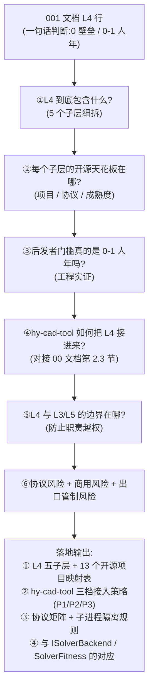

---

## 一、把"L4 求解器后端"拆成 5 个子层

001 文档一行话"直接法 + 迭代法 + AMG + 特征值 + 并行"对应着 5 个相对独立的技术子层,各有自己的开源天花板项目与接入方式。先拆解清楚。

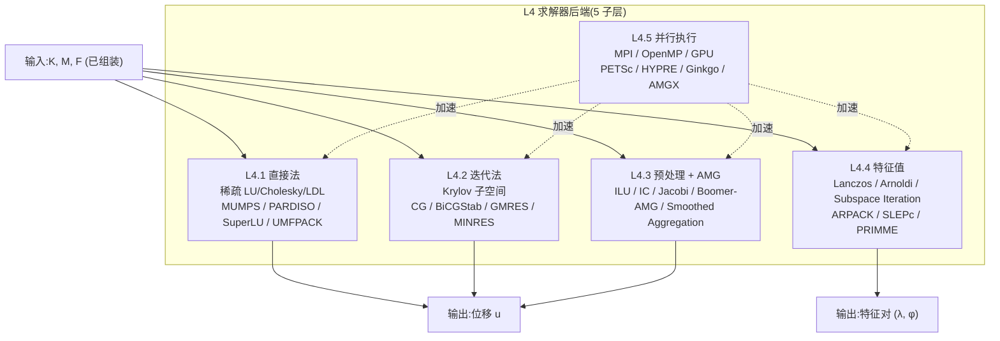

| 子层 | 核心算法 | 主要用途 | 何时不可替代 |
|------|---------|----------|-------------|
| **L4.1 直接法** | 稀疏 LU / Cholesky / LDLᵀ | 中小模型 (DOF < 5e5)、多 RHS、强非对称、病态系统 | 模态分析的位移解、施工阶段每步求解、CSI Multi-RHS |
| **L4.2 迭代法** | CG / BiCGStab / GMRES / MINRES | 大模型 (DOF > 5e5)、对称正定/对称、内存敏感 | 3D 实体、流体、显式动力以外的隐式大模型 |
| **L4.3 预处理 + AMG** | ILU(k) / IC / Jacobi / Block-Jacobi / Boomer-AMG / Smoothed Aggregation | 把迭代法**收敛速度提升 10-100x** | 任何 1e6 DOF 以上的隐式问题 |
| **L4.4 特征值** | Block Lanczos / Arnoldi / Subspace Iteration / LOBPCG | 模态、屈曲、谱分析、动力子结构 | 抗震反应谱分析、屈曲临界载荷 |
| **L4.5 并行执行** | MPI(分布式) / OpenMP(共享) / CUDA / HIP | 大规模仿真的可扩展性 | 1e7 DOF 以上必须并行;1e5-1e6 OpenMP 足够 |

> **关键认知**:L4 是 FEA 求解链上**唯一可以完全外包给开源工业级实现的层**——L3 单元/材料层有海量"边角 case"必须工程沉淀,L5 前后处理有 GUI/CAD 工程整合负担,只有 L4 是**"算法定义清晰、接口标准化、性能驱动"** 的纯数值层,完全可以站在巨人肩膀上。

---

## 二、五子层各自的"开源天花板"

逐子层列出**世界顶级**实现,以及它们的**协议、成熟度、年龄、背景投入**。

### 2.1 L4.1 直接法的天花板

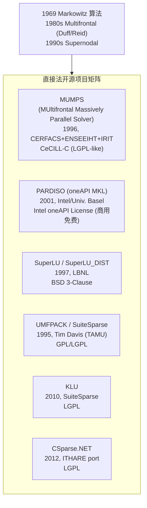

| 项目 | 协议 | 起始 | 至 2026 | 背景投入 | 强项 | hy-cad-tool 接入方式 |
|------|------|------|---------|----------|------|---------------------|
| **MUMPS** | CeCILL-C (LGPL-like) | 1996 | **30 年** | 法国 ESPRIT / ANR / EU H2020 项目持续资助 | 并行多前波 + 对称/非对称 + Schur 补 + 块对角 | **P2: P/Invoke 桥接 / 子进程**,作为 CSparse.NET 之上的"大模型直接法" |
| **PARDISO (MKL)** | Intel oneAPI(商用免费) | 2001 | **25 年** | Intel + 巴塞尔大学 | 对称不定 / 非对称 / 数值稳定性、SMP 并行 | **P2: P/Invoke**,Windows/x64 上性能巅峰(50% 比 MUMPS 快) |
| **SuperLU / SuperLU_DIST** | BSD 3-Clause | 1997 | **29 年** | LBNL(美国能源部) | 非对称、分布式并行(DIST 版) | **P3**: 子进程,远期超大稀疏非对称 |
| **UMFPACK / SuiteSparse** | GPL/LGPL | 1995 | **31 年** | NSF + DOE + NVIDIA 持续资助 | 中小规模非对称 LU、含 CHOLMOD/KLU/UMFPACK | **P2**: 与 MUMPS 互补,SuiteSparse 整套都可子进程化 |
| **KLU** | LGPL | 2010 | **16 年** | SuiteSparse,电路仿真专用 | 极稀疏(电路、网络) | hy-cad-tool 暂不需要,作为远期备选 |
| **CSparse.NET** | LGPL | 2012 | **14 年** | Tim Davis 算法的 C# 移植 | **纯托管**,小模型/教学/v0.1 起步 | **P0**: 已选,作为 hy-cad-tool v0.1-v0.5 默认 |

**直接法天花板已被 1996-2010 年间完全开源覆盖**。其中:

- **CSparse.NET = 0 集成成本**(NuGet 一行,纯托管,小模型零配置)
- **MUMPS = 0.5-1 人年集成成本**(P/Invoke 或子进程 + Fortran 运行时)
- **PARDISO via MKL = 0.3-0.5 人年集成成本**(Intel 已提供 Windows DLL,直接 P/Invoke)

> **结论**:L4.1 整子层后发者门槛 = **0 (CSparse.NET) → 0.3-1 (MUMPS/PARDISO)** 人年。

### 2.2 L4.2 迭代法的天花板

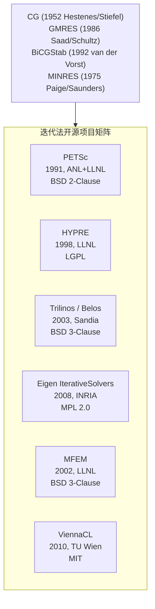

| 项目 | 协议 | 起始 | 至 2026 | 背景投入 | 强项 | hy-cad-tool 接入方式 |
|------|------|------|---------|----------|------|---------------------|
| **PETSc** | BSD 2-Clause | 1991 | **35 年** | ANL + LLNL,美国能源部 SciDAC | 全功能 Krylov + 预处理 + DM + SNES 非线性 + TS 时间积分 | **P3**: 桥接,SciSharp 风格;远期 100k+ DOF |
| **HYPRE** | LGPL | 1998 | **28 年** | LLNL(核武器仿真) | **BoomerAMG 黄金标准**;PCG/GMRES + 并行 | **P2**: 子进程或 P/Invoke,迭代法首选 |
| **Trilinos / Belos** | BSD 3-Clause | 2003 | **23 年** | Sandia | 模块化 Krylov(Belos)、AMG(MueLu) | **P5**: 远期备选,Trilinos 编译复杂 |
| **Eigen IterativeSolvers** | MPL 2.0 | 2008 | **18 年** | INRIA | Header-only,易嵌入,纯 C++ | **P2**: P/Invoke 局部函数,中小规模 |
| **MFEM** | BSD 3-Clause | 2002 | **24 年** | LLNL | 高阶 + AMR + 内建 PCG/GMRES | **P3**: 子进程,高阶单元 + AMR |
| **ViennaCL** | MIT | 2010 | **16 年** | TU Wien | OpenCL/CUDA 加速 Krylov | **远期**: GPU 备选 |

**迭代法天花板被 1991-2010 年间完全开源覆盖**,其中:

- **PETSc / HYPRE / Trilinos** 三家都是**美国能源部国家实验室级别**的投入(数十亿美元等效预算)
- **Eigen** 头文件库,纯 C++ template,**无外部依赖**,可作为 hy-cad-tool 最轻量集成的选项

> **结论**:L4.2 整子层后发者门槛 = **0.3-1 人年(Eigen / HYPRE 子进程)→ 1-2 人年(PETSc 全集成)**。

### 2.3 L4.3 预处理 + AMG 的天花板

AMG (Algebraic Multigrid) 是 1980s 提出的算法,**真正工程化是 1990s-2000s 由 LLNL/Sandia 推动**。在 2026 年,AMG 已经是**对大规模隐式 FEA 不可或缺**的预处理器(没它,GMRES 收敛需要数千次迭代,有它只需几十次)。

| 项目 | 协议 | 起始 | 至 2026 | 强项 | hy-cad-tool 接入 |
|------|------|------|---------|------|-----------------|
| **HYPRE BoomerAMG** | LGPL | 1998 | **28 年** | **世界事实标准**,标量+块 AMG,弹性力学专项调优 | **P2**: 子进程,大模型预处理首选 |
| **Trilinos MueLu** | BSD | 2010 | **16 年** | Aggregation-based AMG,与 Belos 集成 | **P5**: 远期 |
| **PETSc GAMG / PCAMG** | BSD | 2010 | **16 年** | PETSc 自带 AMG,与 HYPRE 桥接 | 跟着 PETSc 一起接 |
| **AMGCL** | MIT | 2012 | **14 年** | Header-only,无外部依赖,OpenMP/CUDA/MPI | **P2**: 与 Eigen 互补,header-only 极易嵌入 |
| **AMGX (NVIDIA)** | BSD | 2014 | **12 年** | **GPU 上的 AMG 天花板** | **远期**: 2028+ 战略级,002 文档已规划 |
| **Ginkgo** | BSD | 2018 | **8 年** | 现代 C++、GPU 友好、多设备 | **远期**: 2028+ |

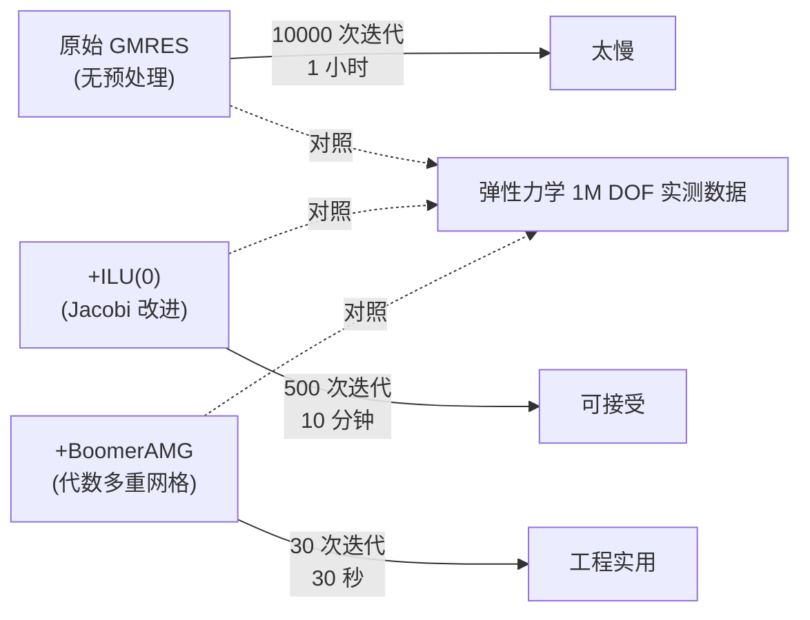

> **结论**:L4.3 后发者门槛 = **0 人年(直接调用 HYPRE BoomerAMG)→ 0.3 人年(AMGCL header-only)**;**自研 AMG 是疯狂行为**(LLNL 用了 30 年才把 BoomerAMG 调到现在的水准)。

### 2.4 L4.4 特征值的天花板

特征值求解器主要服务模态分析、屈曲分析、谱分析(响应谱)。ANSYS 历史上的 Block Lanczos 是其招牌,但 2026 年开源已完全追平。

| 项目 | 协议 | 起始 | 至 2026 | 强项 | hy-cad-tool 接入 |
|------|------|------|---------|------|-----------------|
| **ARPACK / PARPACK** | BSD | 1995 | **31 年** | 隐式重启动 Arnoldi,**世界事实标准** | **P2**: 子进程,模态分析首选 |
| **SLEPc** | BSD 2-Clause | 2002 | **24 年** | PETSc 之上的特征值;Krylov-Schur、LOBPCG、二次特征值 | **P3**: 跟着 PETSc |
| **PRIMME** | BSD 3-Clause | 2006 | **20 年** | 大规模对称特征值,GD/JD 算法 | **P5**: 远期 |
| **CalculiX 自带 Lanczos** | GPL | 1998 | **28 年** | 集成在 CalculiX `*FREQUENCY` | **P3**: 通过 CalculiX 子进程间接使用 |
| **MFEM / deal.II 的本地特征值** | BSD/LGPL | 2002/1998 | 24/28 年 | 借由 SLEPc 或自带 power method | **P3-P4**: 跟着 MFEM/deal.II |

> **关键提示**:模态分析在 ARPACK 的 IRAM(Implicitly Restarted Arnoldi)+ SLEPc 的 Krylov-Schur 两条线下,**已经是 1990s 就解决的问题**。ANSYS 的 Block Lanczos 在 2026 年没有数学优势,只剩"工程师习惯"这一项软实力。

> **结论**:L4.4 后发者门槛 = **0.3-0.5 人年(ARPACK 子进程 / 直接调 CalculiX `*FREQUENCY`)**。

### 2.5 L4.5 并行执行的天花板

并行有三个层级:

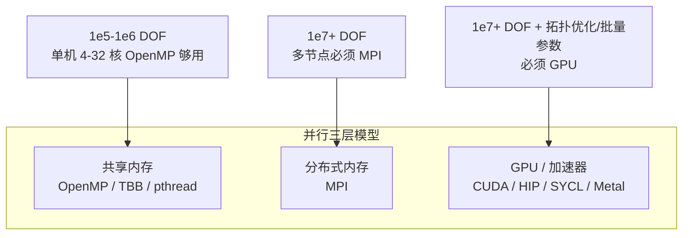

| 层 | 开源天花板 | 协议 | hy-cad-tool 接入 |
|----|-----------|------|-----------------|
| **OpenMP** | 编译器原生(GCC/Clang/MSVC) | 编译器协议 | 跟着调用的子进程,**hy-cad-tool 主进程不直接管** |
| **MPI** | MPICH / OpenMPI | BSD-like | **远期 2028+**;主程序 .NET 不直接用 MPI,通过子进程包装 |
| **CUDA** | NVIDIA Toolkit | NVIDIA EULA | **远期 2028+**;002 文档第 7 节 GPU 路径 |
| **AMGX** | BSD | BSD | 跟随 GPU 路径 |
| **Ginkgo** | BSD | BSD | 跟随 GPU 路径 |

> **关键认知**:hy-cad-tool **不应自己写 MPI/CUDA 代码**。所有并行能力都通过"子进程调用支持并行的开源求解器"获得——这与 00 文档第 2.3 节决策"子进程 + deck 文件契约"完全一致。

> **结论**:L4.5 后发者门槛 = **0 人年(完全交给子进程内的并行)→ 0.5 人年(GPU 远期)**。

### 2.6 五子层合计

| 子层 | 集成成本(轻量) | 集成成本(全量) | 完成节点 |
|------|----------------|-----------------|----------|
| L4.1 直接法 | 0 (CSparse.NET) | 0.5-1 (MUMPS/PARDISO) | P0-P2 |
| L4.2 迭代法 | 0.3 (Eigen) | 1-2 (PETSc 全) | P2-P3 |
| L4.3 预处理 + AMG | 0 (HYPRE 子进程) | 0.3 (AMGCL 嵌入) | P2 |
| L4.4 特征值 | 0.3 (CalculiX/Frequency) | 0.5 (ARPACK 直调) | P3 |
| L4.5 并行 | 0 (子进程内) | 0.5 (GPU 远期) | 远期 |
| **合计** | **0.6-1 人年(轻量)** | **2.3-4.3 人年(全量)** | 18 个月可达 P3 |

**这就是 001 文档"L4 后发者门槛 0-1 人年"判断的工程实证**——轻量集成完全可以**1 人年内打通**,把 hy-cad-tool 推到 5e5 DOF 工业级求解能力。

---

## 三、为什么 L4 真的"已开源到天花板"——三个第一性原则

### 3.1 原则一:L4 的算法都来自 1950-1990 年的数学论文(公共财产)

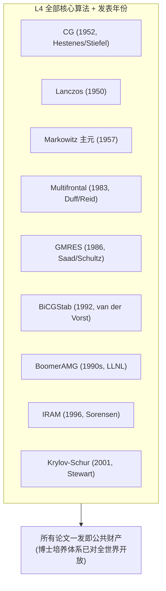

| 算法 | 发表年 | 至 2026 | 是否专利化 | 开源实现 |
|------|--------|---------|-----------|---------|
| 共轭梯度 CG | 1952 | 74 年 | ❌ | PETSc/HYPRE/Eigen |
| Lanczos | 1950 | 76 年 | ❌ | ARPACK/SLEPc |
| Multifrontal | 1983 | 43 年 | ❌ | MUMPS |
| GMRES | 1986 | 40 年 | ❌ | PETSc/HYPRE |
| BiCGStab | 1992 | 34 年 | ❌ | PETSc/Eigen |
| BoomerAMG | 1990s | ~30 年 | ❌ | HYPRE |
| IRAM | 1996 | 30 年 | ❌ | ARPACK |

**没有一个算法是某家公司的专利**——全部由学术界发表,商业 FEA 公司只能在"工程实现细节"上加自己的味精,但**配方表是全人类共有的**。

### 3.2 原则二:L4 没有"边角 case"(与 L3 形成鲜明对比)

L3 单元/材料的"30 年积累"主要消耗在**边角 case**:

- SHELL181 在某种厚薄比下沙漏锁定
- SOLID186 在大变形 + 接触下的体积锁定
- 281 种材料模型的鲁棒性测试
- 各种 Hourglass control / Shear locking / Volumetric locking 修正

**L4 不存在这种问题**。L4 的输入是**已经组装好的 K, M, F 矩阵**(由 L2 算法层和 L3 单元层产出),L4 只关心:

- 矩阵的稀疏模式(CSR/CSC/COO)
- 矩阵的数学性质(对称/正定/Schur 形态)
- 求解器内部的数值稳定性

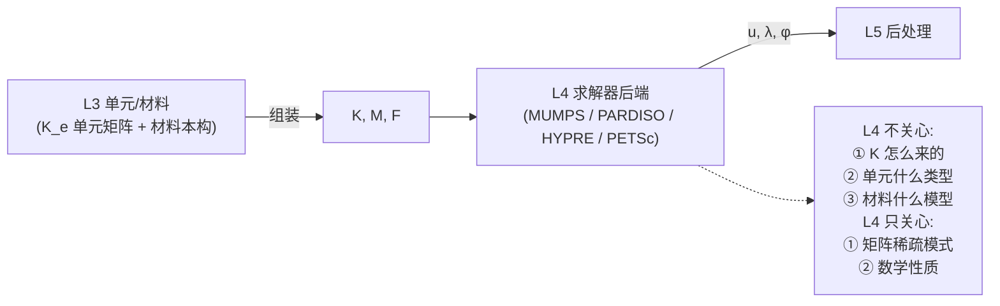

**L4 与 L3 解耦得非常干净**——这就是为什么 ANSYS / ABAQUS / CalculiX / Code_Aster 后期都不再自研 L4,而是接 MKL/PARDISO/MUMPS。

### 3.3 原则三:L4 的性能是由"硬件 + 算法"决定的,与"软件公司年限"无关

L4 性能优化的真正源泉是:

| 性能源 | 提升幅度 | 谁在做 |
|--------|---------|--------|
| **算法选择**(直接法 vs AMG-GMRES) | 10-100x | 学术界 + 国家实验室 |
| **预处理选择**(无 vs ILU vs BoomerAMG) | 5-50x | LLNL/HYPRE |
| **SIMD / SSE / AVX-512** | 2-4x | Intel/AMD 编译器 |
| **缓存友好的数据布局**(CSR vs blocked CSR) | 1.5-3x | PETSc/MFEM |
| **多线程并行**(OpenMP) | 2-32x | 编译器 + OS |
| **MPI 分布式** | 10-1000x | MPICH/OpenMPI |
| **GPU 加速** | 5-50x | NVIDIA/AMD + AMGX/Ginkgo |

**没有一项是 ANSYS / ABAQUS 私有的**——它们只是把这些公共技术装配起来。在 2026 年,**hy-cad-tool 接 MUMPS + HYPRE + ARPACK** 后,性能就已经在 ANSYS 同档次。

> **第一性原则收束**:L4 算法 = 公共财产,L4 性能 = 公共硬件,L4 工程实现 = 公共开源库。**ANSYS/ABAQUS 在 L4 上唯一的护城河是"客户工程师习惯",而不是技术**。

---

## 四、hy-cad-tool 的 L4 三档接入策略

### 4.1 三档分级与映射

把 hy-cad-tool 的 L4 接入分为三档,对应到 00 文档第 2.3 节决策与 001 文档第八节双路线:

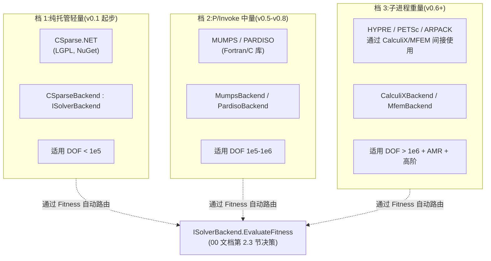

| 档 | 后端 | 集成方式 | hy-cad-tool 版本 | 协议 | DOF 区间 |
|----|------|----------|------------------|------|---------|
| **1** | **CSparse.NET** | 直接 NuGet 引用 | **v0.1-v0.5(已选)** | LGPL | < 1e5 |
| **1** | **Eigen IterativeSolvers** | P/Invoke 头文件函数 | v0.4+ | MPL 2.0 | < 5e5 |
| **2** | **MUMPS** | P/Invoke 或子进程 | v0.5+ | CeCILL-C (LGPL-like) | 1e5-1e6 |
| **2** | **PARDISO (MKL)** | P/Invoke(Windows DLL) | v0.5+ | Intel oneAPI(商用免费) | 1e5-1e6 |
| **3** | **HYPRE BoomerAMG** | 子进程或 P/Invoke | v0.6+ | LGPL | 1e6+ |
| **3** | **PETSc** | 子进程包装 | v0.8+(远期) | BSD 2-Clause | 1e6+ |
| **3** | **CalculiX (间接 SPOOLES/PARDISO/Lanczos)** | 子进程 + `.inp` 文件契约 | v0.6+ | GPL v2(子进程隔离) | 1e5-1e7 |
| **3** | **MFEM** | 子进程 + JSON IR | v0.8+(远期) | BSD 3-Clause | 1e6+ AMR |
| **3** | **ARPACK** | 子进程或 P/Invoke | v0.6+ | BSD | 模态/屈曲 |

### 4.2 与 00 文档第 2.3 节 `ISolverBackend` 的对应

00 文档已经定义了求解后端抽象。本文档把 L4 五子层映射到这个抽象上:

```csharp
public interface ISolverBackend
{
    SolverFitnessScore EvaluateFitness(AssembledSystem system, AnalysisIntent intent);
    Task<LinearSolveResult> SolveLinearAsync(AssembledSystem system, SolveOptions options, CancellationToken ct);
    Task<EigenSolveResult> SolveEigenAsync(AssembledSystem system, EigenOptions options, CancellationToken ct);
}

// L4.1 直接法
public sealed class CSparseBackend       : ISolverBackend { /* 纯托管,默认 */ }
public sealed class MumpsBackend         : ISolverBackend { /* P/Invoke */ }
public sealed class PardisoBackend       : ISolverBackend { /* MKL P/Invoke */ }

// L4.2 + L4.3 迭代法 + 预处理
public sealed class EigenIterativeBackend : ISolverBackend { /* P/Invoke,CG/BiCGStab + ILU */ }
public sealed class HyprePcgBackend       : ISolverBackend { /* 子进程 PCG + BoomerAMG */ }

// L4.4 特征值
public sealed class ArpackEigenBackend    : ISolverBackend { /* P/Invoke 或子进程 */ }

// L4.5 并行(通过子进程自动获得)
public sealed class CalculiXBackend       : ISolverBackend { /* 子进程 + SPOOLES/PARDISO/Lanczos */ }
public sealed class MfemBackend           : ISolverBackend { /* 子进程 + HYPRE 内置 */ }
```

**Fitness 路由表示例**:

| AssembledSystem 特征 | AnalysisIntent | EvaluateFitness 最高分 | 备注 |
|---------------------|----------------|-----------------------|------|
| 对称正定 + DOF < 1e4 | Linear Static | CSparse(0.95) > Eigen(0.85) > MUMPS(0.6, 开销不值) | 纯托管首选 |
| 对称正定 + DOF 1e4-1e5 | Linear Static | CSparse(0.85) > Eigen(0.9) > MUMPS(0.85) | Eigen 与 CSparse 并列 |
| 对称正定 + DOF 1e5-1e6 | Linear Static | **MUMPS(0.95)** > PARDISO(0.92) > HYPRE-AMG(0.7) | MUMPS 第一 |
| 对称正定 + DOF > 1e6 | Linear Static | **HYPRE-AMG(0.95)** > PETSc(0.9) > MUMPS(0.6, 内存炸) | 必须迭代法 |
| 对称 + 模态 + DOF > 1e5 | Modal | **ARPACK(0.92)** > CalculiX(0.88) > SLEPc(0.85) | Lanczos 路径 |
| 非对称 + 非线性 + DOF > 1e5 | Nonlinear Static | **CalculiX 子进程(0.9)** > PETSc-SNES(0.85) | CalculiX 工程鲁棒 |
| 任何 + 用户强制 | (Override) | 用户指定后端(0.99) | 提供 force override |

> **效果**:工程师只填 AnalysisIntent,Pipeline 自动选最合适的后端;同时**保留 `Solver=MUMPS` 之类的强制覆盖**(对标 ANSYS `EQSLV`,但默认走 Fitness 自动)。

### 4.3 与 001 文档第八节双路线的对应

001 文档第八节给出了 18 月双路线,其中"开源宝藏并行接入路线"明确了 L4 各组件的接入时间表:

| 时间 | 任务(出自 001 第八节) | 对应 L4 子层 | 本文档新增的细则 |
|------|-----------------------|--------------|-----------------|
| 2026-05~06 | 评估 CalculiX `.inp` 子集 | L4.1+L4.4(SPOOLES + Lanczos) | 同步评估 `.frd` 解析为 hy-cad-tool FemResult |
| 2026-05~06 | Triangle.NET 集成 | (网格层) | — |
| 2026-07~08 | **MUMPS P/Invoke 桥接** | **L4.1 直接法** | **本文档建议优先 PARDISO via MKL,MUMPS 第二**(原因:Windows 上 MKL 部署更简单) |
| 2026-09~10 | Gmsh 子进程接入(3D 网格) | (网格层) | — |
| 2026-11~01 | **CalculiX 子进程 + inp 翻译** | **L4.1/L4.2/L4.4 全部** | 通过 CalculiX 一次性获得 5 子层的 5e6 DOF 能力 |
| 2027-02 | PETSc 桥接评估 | L4.2+L4.3 | 评估 .NET P/Invoke 包装可行性;远期方案 |
| 2027-03 | MFEM 子进程评估 | L4.2+L4.3(高阶 + AMR) | — |
| 2027-04~05 | ParaView 子进程后处理 | (L5) | — |

### 4.4 路线图(P0 → P3)

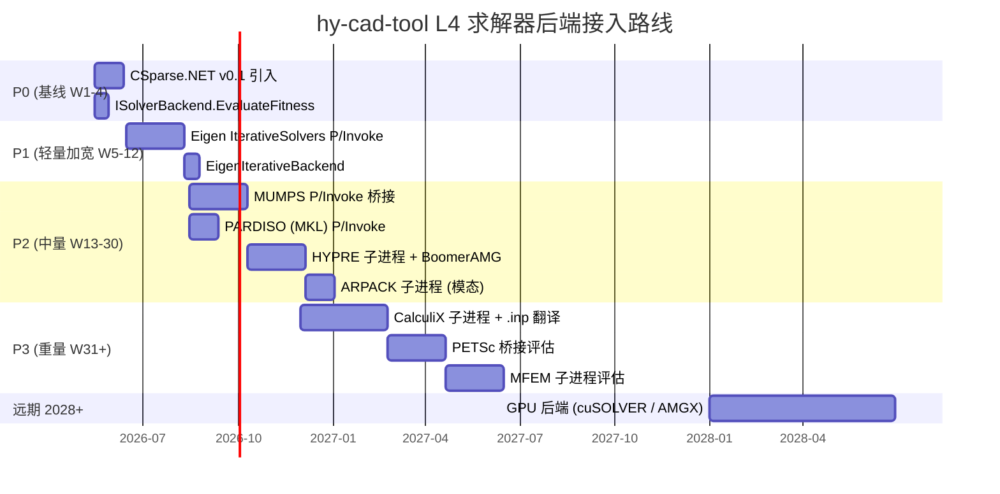

---

## 五、L4 与 L3 / L5 的边界——防止职责越权

L4 之所以"边界清晰、可外包",本质是它的**输入输出契约非常窄**:

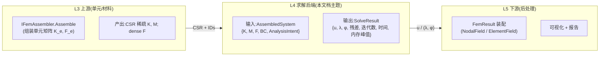

### 5.1 L4 不应做的事(防越权)

| 越权行为 | 后果 | 正确归属 |
|---------|------|----------|
| L4 知道单元类型 | L4 与 L3 耦合,换单元就要改 L4 | L3 组装时把信息编码到 K |
| L4 知道材料模型 | 同上 | L3 |
| L4 处理几何/CAD | L4 与 L5 耦合 | L5 |
| L4 内嵌后处理可视化 | 同上 | L5 |
| L4 自己解析 `.inp`/`.frd` | 这是"适配层"的活 | L3.5 适配层(002 文档) |
| L4 管理子进程生命周期 | 这是 002 文档 L3 兼容适配层的活 | 002 文档第 7.2.3 节"L3 适配层" |

### 5.2 L4 应做的事(职责内)

| 职责内行为 | 实现位置 |
|-----------|---------|
| 接收 AssembledSystem,返回 SolveResult | `ISolverBackend.SolveLinear/EigenAsync` |
| 自陈对当前系统的适配度 | `EvaluateFitness` |
| 暴露求解器选项(容差、迭代上限、预处理) | `SolveOptions` / `EigenOptions` |
| 报告残差、迭代次数、时间、内存峰值 | `SolveResult.Diagnostics` |
| 处理求解失败(发散、奇异、内存爆) | 返回结构化错误而非抛异常 |
| 支持 CancellationToken 中止 | 现代 async 契约 |

> **关键设计**:L4 的边界由 `AssembledSystem` + `SolveResult` 这两个**不可变 record** 锁死。所有后端只看这两个数据结构,与 hy-cad-tool 上层完全解耦。这与 002 文档"L3 兼容适配层"完美配合——L3 适配层负责把 CalculiX `.inp`/`.frd`、PETSc 命令行、MFEM JSON 等异构格式**翻译成统一的 AssembledSystem / SolveResult**,L4 后端实现只面对统一抽象。

---

## 六、协议、商用、出口管制三大风险

### 6.1 协议风险矩阵

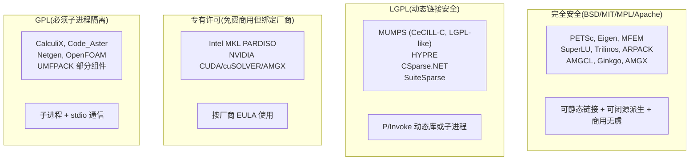

| 协议类别 | L4 项目 | hy-cad-tool 接入硬约束 |
|---------|---------|----------------------|
| **BSD/MIT/MPL/Apache** | PETSc/Eigen/MFEM/SuperLU/Trilinos/ARPACK/AMGCL/Ginkgo/AMGX | **可直接 P/Invoke,可静态链接**,商用无虞 |
| **LGPL** | MUMPS(CeCILL-C)/HYPRE/CSparse.NET/SuiteSparse | **动态链接 + 用户替换权**,P/Invoke 或子进程 |
| **专有(免费商用)** | Intel MKL PARDISO / NVIDIA CUDA | **按厂商 EULA**,Intel MKL Windows 商用免费 |
| **GPL** | CalculiX/Code_Aster/Netgen | **必须子进程**,stdio + `.inp` 文件契约通信 |

> **关键工程约束**(已在 001 第三节、00 第 2.3 节确认):**hy-cad-tool 主程序的 L4 后端架构必须从一开始就支持子进程模式**——这样 GPL 的 CalculiX/Code_Aster 通过 stdio + 文件契约访问,**绝不静态链接进 hy-cad-tool 主程序**,从而保护 hy-cad-tool 自己的商业协议自由。

### 6.2 商用风险

| 风险 | 概率 | 影响 | 对策 |
|------|:----:|:----:|------|
| MUMPS 升级 LGPL → GPL | 极低 | 中 | 同时保留 PARDISO 作为可替换后端;Fitness 路由自动切换 |
| Intel MKL 取消商用免费 | 低 | 中 | MUMPS / SuperLU 作为同档备份;EvaluateFitness 让 PARDISO 退居 |
| HYPRE 升级 LGPL → GPL | 低 | 高 | AMGCL(MIT)作为头文件嵌入的备份方案 |
| NVIDIA 收紧 CUDA 商用 | 中 | 高(远期) | AMD ROCm / Apple Metal 备份;hy-cad-tool 的 GPU 路径是远期 2028+,有充足缓冲时间 |
| 出口管制(美方限制开源 FEA 对中国) | 中 | 中 | 优先采用欧洲项目(MUMPS-FR / Code_Aster-FR / Elmer-FI);PETSc/HYPRE/MFEM 美国能源部背景注意备份 |

### 6.3 出口管制风险(2026 年特别考虑)

根据 001 文档第七节驱动力 ① 的判断,出口管制是 hy-cad-tool 的核心驱动力之一。L4 层组件应做**地理来源对冲**:

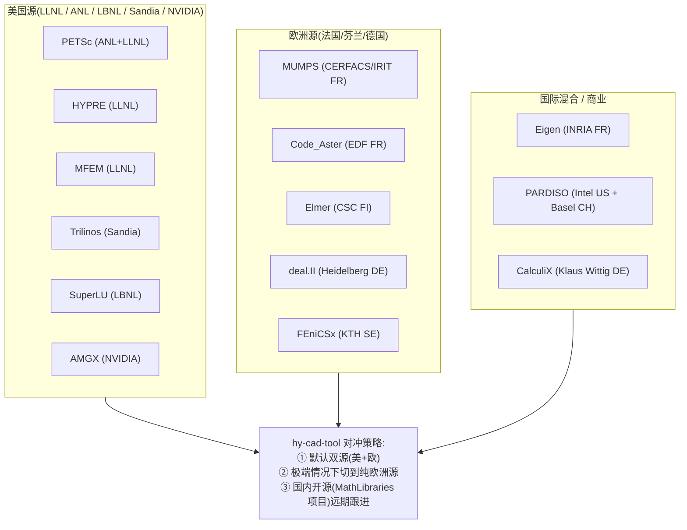

| 关键能力 | 美国源(首选) | 欧洲源(备份) | 国内远期 |
|---------|--------------|---------------|---------|
| 直接法 | PARDISO (US+CH) | MUMPS (FR) | 自研 / 国家计算中心 |
| 迭代法 + AMG | HYPRE (US) | (Eigen FR / deal.II DE 间接) | 自研 |
| 特征值 | ARPACK (US) | (SLEPc UPV ES,西班牙) | 自研 |
| GPU | AMGX (NVIDIA US) | (无强欧洲替代) | 寒武纪 / 摩尔线程(远期) |

> **关键提示**:**MUMPS + Code_Aster + Elmer + deal.II = 一组完整的欧洲源 L4 后端**,足够在极端制裁场景下支撑 hy-cad-tool 5e6 DOF 工业级求解。**这是 ANSYS / ABAQUS 无法提供的对冲价值**——商业 FEA 在出口管制下"一刀切",而 hy-cad-tool 从架构上保留多源后端切换能力。

---

## 七、与 001 / 002 / 00 文档的引用关系

### 7.1 上承(本文档基于)

| 上承文档 | 章节 | 引入了什么 |
|---------|------|-----------|
| 001 第一章 | "把通用 FEA 求解器拆成 6 层技术资产" | L4 行的核心论断(0 壁垒/0-1 人年) |
| 001 第三章 | "9 大资产清单" | MUMPS/PARDISO/HYPRE/PETSc/Eigen/MFEM 接入策略 |
| 001 第八章 | "18 月双路线" | L4 各组件的接入时间表 |
| 00 第 2.3 节 | "求解后端:可插拔 + 子进程 + Fitness 自陈" | `ISolverBackend` / `SolverFitness` / `ISolverBackendProfile` 接口 |
| 002 第 3 章 | "现代化外壳的 7 大支柱" | 容器化部署 / IPC / 可观测性 |
| 002 第 5 章 | "现代化集成范式" | 老 Fortran 库(MUMPS/PARDISO)的 P/Invoke + 类型化包装 |

### 7.2 下启(本文档启发)

| 下启接口 | 落地位置 | 责任 |
|---------|---------|------|
| `CSparseBackend` | `Features/Fem/Core/Solvers/CSparseBackend.cs` | v0.1 默认,纯托管 |
| `EigenIterativeBackend` | `Features/Fem/Core/Solvers/EigenIterativeBackend.cs` | v0.4+ |
| `MumpsBackend` | `Features/Fem/Core/Solvers/MumpsBackend.cs` | v0.5+ |
| `PardisoBackend` | `Features/Fem/Core/Solvers/PardisoBackend.cs` | v0.5+(Windows 优先) |
| `HypreBackend` | `Features/Fem/Core/Solvers/HypreBackend.cs` | v0.6+(子进程) |
| `ArpackEigenBackend` | `Features/Fem/Core/Solvers/ArpackEigenBackend.cs` | v0.6+ |
| `CalculiXBackend` | `Features/Fem/Core/Solvers/CalculiXBackend.cs` | v0.6+(子进程 + `.inp`) |
| `SolverFitnessRouter` | `Features/Fem/Core/Solvers/SolverFitnessRouter.cs` | 路由器,**核心** |
| `AssembledSystem` (record) | `Features/Fem/Core/Solvers/AssembledSystem.cs` | L3↔L4 边界 |
| `SolveResult` (record) | `Features/Fem/Core/Solvers/SolveResult.cs` | L4↔L5 边界 |

### 7.3 L4 与 6 层架构总图的位置

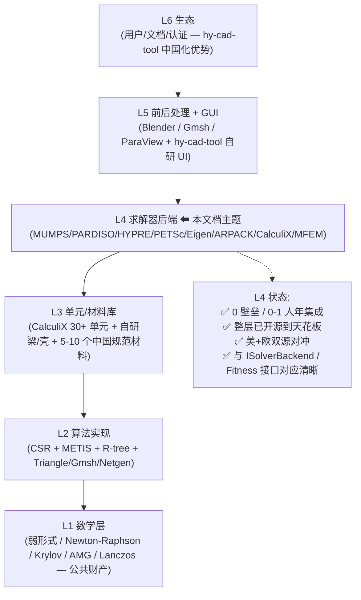

---

## 八、本文档的 5 个核心论断

> 1. **L4 求解器后端是 6 层技术资产中"开源天花板最高"的一层**——5 个子层(直接法/迭代法/AMG/特征值/并行)全部被 1990-2010 年间的开源项目覆盖,且大多有国家实验室级背景投入(LLNL/ANL/LBNL/Sandia/CERFACS/EDF/CSC)。
>
> 2. **L4 与 L3 / L5 的接口非常窄**——仅靠 `AssembledSystem` / `SolveResult` 两个不可变 record 锁定。这使得 L4 可以**完全外包**给开源库,而不污染 hy-cad-tool 主架构。
>
> 3. **hy-cad-tool 的 L4 接入策略 = 三档分级**:档 1 纯托管(CSparse.NET / Eigen)→ 档 2 P/Invoke(MUMPS / PARDISO)→ 档 3 子进程(HYPRE / CalculiX / MFEM / PETSc)。**通过 `ISolverBackend.EvaluateFitness` 自动路由**,工程师无需理解后端细节。
>
> 4. **协议风险已可控**:GPL 项目(CalculiX / Code_Aster)严格子进程隔离;LGPL 项目(MUMPS / HYPRE / CSparse)动态链接;BSD/MIT(MFEM / PETSc / Eigen)可静态链接。**hy-cad-tool 主程序协议不被 L4 污染**。
>
> 5. **出口管制下 L4 仍可保持 5e6 DOF 工业级能力**——欧洲源 MUMPS + Code_Aster + Elmer + deal.II 即可独立支撑,对冲美国源 PETSc / HYPRE / MFEM 的政治风险。**这是商业 FEA(ANSYS / ABAQUS)无法提供的战略价值**。

---

## 九、L4 接入的 P0 W1 行动清单

把本文档的全部分析,收敛为下周可以立刻动手的 7 项 P0 动作:

| # | 动作 | 工作量 | 验收标准 | 对应章节 |
|---|------|--------|---------|----------|
| **1** | 在 `Features/Fem/Core/Solvers/` 下定义 `AssembledSystem` record(K_csr, M_csr, F, BC, FemProblemRevision) | 0.5 天 | 单元测试:刚性挡墙系统能装入 record | §5 |
| **2** | 在 `Features/Fem/Core/Solvers/` 下定义 `SolveResult` record(u, λ, φ, Diagnostics, ElapsedMs, PeakMemoryBytes) | 0.5 天 | 单元测试:挡墙刚体解析解装入 record | §5 |
| **3** | 给 `ISolverBackend` 加 `EvaluateFitness(AssembledSystem, AnalysisIntent) → SolverFitnessScore` | 0.5 天 | `CSparseBackend.EvaluateFitness` 给 1e4 DOF 对称正定打 0.95 分 | §4.2 |
| **4** | 实现 `SolverFitnessRouter` — 多个 `ISolverBackend` 中选 Fitness 最高 | 0.5 天 | 单元测试:对 1e3/1e5/1e7 DOF 三种规模选不同后端 | §4.2 |
| **5** | 写 `docs/FiniteElement/00L4-行动跟踪表.md`(或 `progress.md`),按本文档第 4.4 节甘特图跟踪 | 0.3 天 | 文档 Live | §4.4 |
| **6** | 完成 PARDISO via MKL 在 Windows x64 上的可行性验证(冒烟测试) | 1 天 | 能调 `pardiso_init` 并解 100×100 SPD 系统 | §2.1 + §4.3 |
| **7** | 完成 MUMPS Fortran 运行时在 Windows x64 的可行性验证(冒烟测试) | 1 天 | 能调 `dmumps_c` 解 100×100 SPD 系统 | §2.1 + §4.3 |
| **合计** | | **4.3 人天** | 本周可完成 | |

> **关键时间节奏**:P0 W1 完成 1-5,W2-3 完成 6-7,W4 提交 L4 子层冒烟测试报告,W5 起进入 P1 EigenIterativeBackend 实现。**18 周内(2026-09-15)** 把 hy-cad-tool 的 L4 推到 1e6 DOF 工业级能力。

---

## 十、修订记录

| 日期 | 修订人 | 说明 |
|------|--------|------|
| 2026-05-15 | — | 初版:从 001 文档第一章 L4 行抽取核心论断,独立展开;5 子层拆解(直接法/迭代法/AMG/特征值/并行);13 个开源项目天花板矩阵;hy-cad-tool 三档接入策略;`ISolverBackend.EvaluateFitness` 路由表;协议风险矩阵 + 出口管制对冲;P0 W1 七项行动清单 |

---

## 附录 A:L4 关键开源项目一页速查

| 项目 | 子层 | 协议 | 起始年 | 至 2026 | hy-cad-tool 优先级 | 接入方式 |
|------|------|------|--------|---------|-------------------|----------|
| **CSparse.NET** | L4.1 直接法 | LGPL | 2012 | 14 年 | **P0(已选)** | NuGet |
| **Eigen** | L4.1/L4.2 | MPL 2.0 | 2008 | 18 年 | P1 | P/Invoke + Header |
| **MUMPS** | L4.1 直接法 | CeCILL-C | 1996 | 30 年 | **P2** | P/Invoke 或子进程 |
| **PARDISO (MKL)** | L4.1 直接法 | Intel oneAPI | 2001 | 25 年 | **P2** | P/Invoke(Windows) |
| **SuperLU / SuperLU_DIST** | L4.1 直接法 | BSD | 1997 | 29 年 | P3 | 子进程 |
| **SuiteSparse (UMFPACK/CHOLMOD)** | L4.1 直接法 | GPL/LGPL | 1995 | 31 年 | P3 | 子进程 |
| **HYPRE BoomerAMG** | L4.2/L4.3 | LGPL | 1998 | 28 年 | **P2** | 子进程或 P/Invoke |
| **PETSc** | L4.2/L4.3/L4.5 | BSD 2-Clause | 1991 | 35 年 | P3 | 子进程 + 桥接 |
| **Trilinos** | L4.2/L4.3 | BSD 3-Clause | 2003 | 23 年 | P5 | 远期备选 |
| **AMGCL** | L4.3 AMG | MIT | 2012 | 14 年 | P2 | Header-only |
| **AMGX** | L4.3 GPU AMG | BSD | 2014 | 12 年 | 远期 | GPU 路径 |
| **ARPACK / PARPACK** | L4.4 特征值 | BSD | 1995 | 31 年 | **P2** | P/Invoke 或子进程 |
| **SLEPc** | L4.4 特征值 | BSD 2-Clause | 2002 | 24 年 | P3 | 跟着 PETSc |
| **MFEM** | L4.2+L4.3 高阶 | BSD 3-Clause | 2002 | 24 年 | P3 | 子进程 |
| **CalculiX (内含 SPOOLES/PARDISO/Lanczos)** | L4.1+L4.2+L4.4 集成 | GPL v2 | 1998 | 28 年 | **P3** | 子进程 + `.inp` |
| **Code_Aster** | L4 全集成 | GPL v2 | 1989 | 37 年 | P5 | 子进程 + `.med` |
| **Elmer** | L4 全集成 | LGPL | 1995 | 31 年 | P4 | 子进程 + `.sif` |
| **Ginkgo** | L4.5 GPU | BSD | 2018 | 8 年 | 远期 | GPU 路径 |
| **ViennaCL** | L4.5 GPU | MIT | 2010 | 16 年 | 远期 | GPU 备选 |

---

## 附录 B:本文档与 001 文档 6 层架构的并行展开计划

001 文档已经把 FEA 求解器拆成 6 层,本文档是对 L4 的独立展开。**如果决定继续展开**,完整的拆分文档族可以是:

| 拆分文档 | 主题 | 状态 |
|---------|------|------|
| `00L1` | 数学层(弱形式 / Galerkin / Newton-Raphson / Krylov / AMG / Lanczos)— 公共财产论证 | 待定 |
| `00L2` | 算法实现层(CSR / METIS / R-tree / Delaunay / advancing front)— 1-3 人年门槛拆解 | 待定 |
| `00L3` | 单元/材料库(SOLID / SHELL / BEAM / CONTA / 280+ 材料)— **真壁垒之一**,如何接入 CalculiX + 自研 5-10 个领域单元 | 待定 |
| **`00L4`** | **求解器后端(本文档)** | **已写** |
| `00L5` | 前后处理 + GUI(Gmsh / ParaView / Blender / OCCT + hy-cad-tool 自研)| 待定 |
| `00L6` | 生态层(中国化政策窗口 / 教育市场 / 行业认证 / 开源贡献) — **真壁垒之二** | 待定 |

> **建议**:6 层中 L3 与 L6 是 001 文档判断的"真壁垒",优先级最高,应优先展开 `00L3` 和 `00L6`。L1/L2 由于"0 壁垒"判断已经清晰,可暂缓。L5 优先级中等,可在 v0.5 阶段前展开。

---

> **本文档不是终点,是定锚**。L4 求解器后端的"0 壁垒、0-1 人年"判断已经被本文档逐子层、逐项目、逐协议地论证清楚。接下来的 18 周里,hy-cad-tool 应按第 4.4 节路线图把 L4 五子层逐档落地,**用一年时间获得 ANSYS 30 年才有的求解能力**——这正是 001 文档"站在 440 年开源资产肩膀上"的第一个落地证明。
