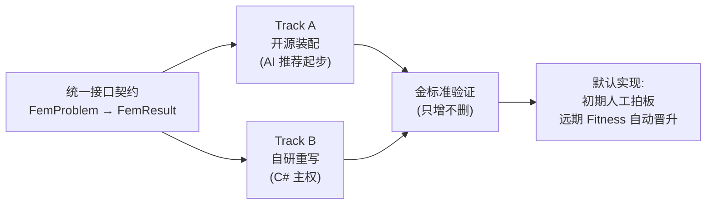

# HYFEA 总体计划 — 高度抽象框架与多年路线

> 文档日期:2026-05-17  
> 性质:HYFEA 项目多年发展的**最高层级锚定文档**,只给框架不给细节  
> 上承:001 / 002 / 003 / 004 / 005 / [Plan/01 算法模块划分调研](./01-算法模块划分调研-HYFEA内核与适配集成边界-2026-05-17-152100.md)(本文档不重复其展开)

---

## 0. 一句话定位

> **HYFEA 是 hy-cad-tool 的有限元计算内核;长期遵循"算法与外壳分离 + 算法模块化 + 双轨可替换"三大原则;短期目标是"挡墙单位宽度梁元 MVP + 金标准证明正确"。**

---

## 一、三个不可变原则

> 整个项目无论多少年、多少模块、多少贡献者,以下三条永不动摇。任何技术选择、目录调整、机制升级都必须以这三条为前提。

### ①算法与外壳分离

HYFEA.Core 是纯算法内核,不依赖任何宿主。AutoCAD 适配、WPF 面板、报告生成、ReCall 热重载都属于"外壳层",必须在 HyCADTool 侧实现。

> 工程约束:`HYFEA.Core` **永不可引用** `Autodesk.AutoCAD.*` / `System.Windows.*` / `HyCADTool.*` / `ReCall`。  
> **允许**:引用同仓库 **平台无关** 共用算法库(当前 **`HyCAD.Geometry`**,netstandard2.0),与宿主、面板、命令无关。

### ②算法模块化

把 FEM 流程切成可独立替换的模块(模型 / 网格 / 单元 / 材料 / 装配 / 求解 / 分析 / 结果 / 验证)。每个模块的输入输出有明确类型,可被任何符合契约的实现替换。

> 具体模块边界与划分**在后续调研后确定**(参考 004 §3 的 13 模块清单作为长期蓝本,但当前阶段不必全建)。

### ③双轨可替换

每个模块同时支持两个轨道,共享同一份接口契约,可互相对比、互相校验、互相切换:

- **Track A:开源装配** — 用 AI 帮助挑选合适的现成开源项目接入(初期主推,快速形成可信参考)
- **Track B:平行自研** — 用 C# 重写,获得工程主权 + 长寿设计 + 协议自由度

---

## 二、目录结构(顶层框架)

只列长期稳定的顶层结构。具体子目录与模块名允许随阶段演化。

```text
hy-cad-tool/
├── src/HyCAD.Geometry/                 # 共用平面几何(netstandard2.0;已与内核、插件对接)
├── src/HYFEA/                          # 有限元内核(平台无关)
│   ├── HYFEA.Core/                     # 算法主体(已存在)
│   ├── HYFEA.Tests/                    # 单元与金标准测试(已存在)
│   ├── HYFEA.Examples/                 # 可执行示例(已存在)
│   ├── HYFEA.Adapters.*/               # 预留:外部内核适配(子进程 / FFI)
│   └── HYFEA.Benchmarks/               # 预留:性能基准
└── src/HyCADTool/
    └── Features/Fem/                   # 预留:外壳层
        ├── Integration/                #   AutoCAD ↔ HYFEA 桥接
        ├── Commands/                   #   CAD 命令入口
        └── Views/                      #   面板与对话
```

### 依赖方向(永不可反转)

```text
HyCADTool.Features.Fem  →  HYFEA.Adapters.*  →  HYFEA.Core
HYFEA.Core              →  HyCAD.Geometry     ✓ 共用几何(平台无关)
HyCADTool               →  HyCAD.Geometry     ✓
HYFEA.Core              ✗  任何宿主 / UI / HyCADTool.* / ReCall
```

---

## 三、双轨可替换框架(精简版)



| 阶段 | Track A | Track B | 默认选择 |
|------|---------|---------|---------|
| **P0**(当前) | 暂不接入 | Spring1D / Truss2D(v0.1) + 共用 `HyCAD.Geometry` | 唯一实现即默认 |
| **P1** | AI 推荐并接入 1 个候选 | 扩 EulerBeam2D | 人工拍板 + 5 维手工评分 |
| **P2** | 1-2 个候选并存 | Quad4 / PlaneStrain | 金标准对比 |
| **P3+** | 多候选自动评估 | 全模块覆盖 | Fitness 自动晋升(004 完整机制) |

> 关键:**接口契约从第一行代码起就要稳定**,后期不允许为新候选改老接口(对应 004 §11 反过期设计)。

---

## 四、MVP 定义

> 第一个能让 HyCADTool 用户感知到的 HYFEA 产物(对应你提的第 4 条原始需求)。

| 项 | 定义 |
|----|------|
| 单元类型 | 1D 梁元(`EulerBeam2D`) |
| 几何来源 | 在 AutoCAD 中选取**直线**或**Polyline**,作为**单位宽度(1 m)墙体**的几何 |
| 荷载 | 简单**均布荷载**(线荷载 q,作用方向可选) |
| 边界 | 在端点指定约束(固接 / 铰接 / 自由) |
| 输出 | 节点位移、支座反力、单元内力(轴力 / 剪力 / 弯矩) |
| 验证 | 与悬臂梁 / 简支梁 / 两端固接梁的**解析解**对比 |

## 五、正确性验证方法

> 对应你提的第 5 条原始需求"找到正确对比方法"。本节给方法,不给具体案例清单(那是子文档的事)。

### 三层金标准(对应 004 §7.7 Tier 1-3,P0 阶段聚焦解析解层)

| 层 | 来源 | 适用 |
|----|------|------|
| 解析解层 | 公式可手算(悬臂梁 δ=PL³/(3EI) 等) | P0 / P1 强制 |
| 教材例题层 | 结构力学 / 弹性力学经典例题 | P1 / P2 |
| 可信软件对比层 | 与 ANSYS / SAP2000 / CalculiX 同算例对比 | P2+ 引入 |

### 三条验证铁律(永久生效)

1. **金标准只增不删** — 任何新案例只允许追加,不允许为掩盖回归而删除
2. **容差严格** — P0 小模型相对误差 < 1e-8;大模型可放宽到 1e-3
3. **回归立即回滚** — 任何关键案例回退,无论新版本其他指标多好,立刻回滚

---

## 六、后期合作模式(预留,不细化)

> 对应你提的第 6 条原始需求"后期再去完善对比,及考虑合作模式,只需预留"。

当前阶段只有本人 + AI 协作。以下机制只**预留位置**,接口与目录已为其腾出空间,但不在 P0 / P1 实现。

| 机制 | 启用时机 | 当前替代 |
|------|---------|---------|
| 多标准评估(11 维 Fitness) | P3+ | 5 维手工评分 |
| 自动晋升 PR | P4+ | 人工拍板 |
| 贡献者三角色 | P3+ | 个人独立 |
| Leaderboard | P4+ | 评估记录文件 |
| 设计理念回吸(LearningLoop) | P4+ | AI 协助手工提炼 |

> 详细机制见 [004 双轨可替换模块机制设计](../004-双轨可替换模块机制设计-MVP装配+平行自研+多标准评估自动晋升-2026-05-17.md)。**当人手与候选数到达临界规模时再启用,不提前压重**。

---

## 七、实施步骤(分阶段,可逐步完成)

> 每个阶段都是可独立交付的最小闭环。每完成一阶段,可单独发起细化讨论再启动下一阶段。**本文档不展开任一阶段的技术细节**。


| 阶段 | 核心交付 | 关键依赖 |
|------|---------|---------|
| **阶段 0** | 骨架 + Spring1D + Truss2D + G01-G04 + **`HyCAD.Geometry`**([01 §十二](./01-算法模块划分调研-HYFEA内核与适配集成边界-2026-05-17-152100.md)) | — |
| **阶段 1** | [`EulerBeam2D` + AutoCAD 选线 + 均布荷载 + 悬臂 / 简支验证](./02-阶段1MVP-EulerBeam2D-AutoCAD选线-均布荷载-解析解-2026-05-17-165000.md)（细则见 **02 MVP**） | 阶段 0 |
| **阶段 2** | AI 推荐 + 接入 1 个开源候选(子进程或 FFI) | 阶段 1 |
| **阶段 3** | `Quad4 / PlaneStrain` + 桩 / 边坡简单案例 | 阶段 2 |
| **阶段 4** | 金标准案例库扩到 20+(覆盖梁 / 板 / 桁架 / 平面问题) | 持续(从阶段 1 起) |
| **阶段 5** | 同一个 `FemProblem` 跑双轨,记录差异,启动 Fitness 评估 | 阶段 2 + 阶段 3 |
| **阶段 6** | `CONTRIBUTING.md` + Issue/PR 模板 + 公开 Leaderboard | 后期(取决于用户基数) |

> **每个阶段开始前再做细化讨论**,你可以针对任一阶段单独发起独立设计文档。

---

## 八、未来演化预期(高度抽象)

| 时间 | 形态 |
|------|------|
| 1 年内 | 多个工程算例(挡墙 / 桩 / 水池)可在 HyCADTool 中跑通 |
| 3 年内 | 双轨稳定运行,模块化清晰,核心 5-8 个模块可替换 |
| 5 年内 | 可微分接口、GPU 支持、教学版 WASM 实验启动 |
| 10 年内 | 算法层有机会独立为社区项目(对标 003 §3 HyAlgo Commons) |

> 远期愿景与论证见 001 § 11 / 003 § 14。**本文档不重复展开**。

---

## 九、与上承文档的关系

| 上承文档 | 本文档对应 |
|---------|-----------|
| 00 总纲 | 本文档 = 00 在 HYFEA 内核侧的高度抽象映射 |
| 001 第一性原则 | "双轨"即 001 § 6 档 1 的工程化身 |
| 002 现代化外壳 | "算法与外壳分离"是其落地约束 |
| 003 算法与外壳解耦 | 目录顶层即体现其"算法独立"精神 |
| 004 双轨可替换机制 | 完整机制按阶段启用,P0 / P1 降级使用 |
| 005 HYFEA 第一步 | 005 是本文档"阶段 0 / 1"的详细技术落地 |
| [01 算法模块划分调研](./01-算法模块划分调研-HYFEA内核与适配集成边界-2026-05-17-152100.md) | 模块边界;**Geometry 方案 A** 已落地(§二 仅记顶层) |

## 十、本文档的使用约定

| 规则 | 说明 |
|------|------|
| **只写框架** | 任何具体接口、代码、案例都不进入本文档 |
| **可被修订** | 三大原则永远不变;其余表格 / 阶段顺序允许修订并更新本表 |
| **下沉细节** | 每个阶段开始时新建独立的 `Plan/0X-阶段X-XXX-日期.md` 文档展开 |
| **保持简短** | 力争主体 ≤220 行;超额须在修订记录说明 |

## 十一、修订记录

| 日期 | 版本 | 内容 |
|------|------|------|
| 2026-05-17 | v1.0 | 首版:三大不可变原则、顶层目录框架、双轨极简版、MVP 定义(梁元 + AutoCAD 选线 + 均布荷载)、三层金标准 + 三条铁律、合作机制预留表、7 阶段实施步骤、10 年抽象愿景 |
| 2026-05-17 | v1.1 | **阶段 0 对齐事实**:`HyCAD.Geometry` 顶层目录与依赖;原则①允许平台无关共用库;P0 双轨表 / 阶段图写入共用几何;§九 映射 [01 调研];§十 行数阈放宽至 ~220 |
| 2026-05-17 | v1.2 | **§七 阶段 1**指向 [02 MVP](./02-阶段1MVP-EulerBeam2D-AutoCAD选线-均布荷载-解析解-2026-05-17-165000.md);§文末「下一步」改为已定稿链接 |

> **下一步**:**阶段 1 MVP** 单列设计已定稿:[02-EulerBeam2D + CAD + q + 解析解](./02-阶段1MVP-EulerBeam2D-AutoCAD选线-均布荷载-解析解-2026-05-17-165000.md)（端到端：`FemProblem`、`UnitSystem`、G05-G09、`HYFEABEAM`）。
