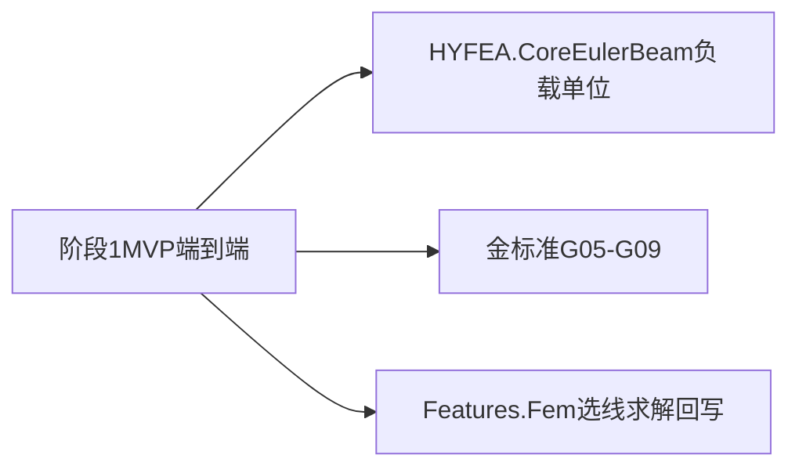

# HYFEA 阶段 1 MVP — EulerBeam2D + AutoCAD 选线 + 均布荷载 + 解析解

> **文档性质**: Phase 1 **设计文档**（接口契约 / 表格 / 伪代码；**不附带可编译源码**）。  
> **文档日期**: 2026-05-17  
> **上承文档**:
> - [00-HYFEA总体计划-高度抽象框架与多年路线-2026-05-17-150400.md](./00-HYFEA总体计划-高度抽象框架与多年路线-2026-05-17-150400.md) — §七 阶段 1、§四 MVP  
> - [01-算法模块划分调研-HYFEA内核与适配集成边界-2026-05-17-152100.md](./01-算法模块划分调研-HYFEA内核与适配集成边界-2026-05-17-152100.md) — §六 C01-C13 / I01-I05、§九 Q5  
> - [005-HYFEA第一步-内核独立与HyCADTool适配-目录结构模块清单与个人评估流程-2026-05-17-105500.md](../Research/005-HYFEA第一步-内核独立与HyCADTool适配-目录结构模块清单与个人评估流程-2026-05-17-105500.md) — M20/M21、`FemProblem→FemResult`  
> **当前代码事实快照**:`src/HYFEA/` P0.v0.1（Spring1D / Truss2D + G01-G04）；`HyCAD.Geometry` 已对齐内核与宿主。

---

## §0 一句话定位与承接

**阶段 1 MVP**：在 HYFEA.Core 引入 **欧拉梁 2D**（轴向 + 平面弯曲，`UX/UY/RZ`）、**均布荷载**（两种工程方向预设）、**`UnitSystem` 显式枚举**（SI / MmN / Custom），并用 **解析解黄金算例 G05-G09** 证明内核正确；同时在 **HyCADTool** 新建 **`Features/Fem`**，实现 **`hyFeaBeam` 命令** + **WPF 面板** + **CAD 几何 → `FemProblem`** + **位移/内力/反力回写**。  

本设计将 [00 §四 MVP](./00-HYFEA总体计划-高度抽象框架与多年路线-2026-05-17-150400.md) 的条文落实为：**可端到端演示**的工程蓝本。



---

## §1 不变量与边界（阶段 1 落地版）

### §1.1 原则固化

| # | 原则 | 阶段 1 落地 |
|---|------|---------------|
| ① | **算法与外壳分离** | `HYFEA.Core`**永不**引用 `Autodesk.*` / `System.Windows.*` / `HyCADTool.*` / `ReCall`；宿主逻辑全部在 [`src/HyCADTool/`](../../src/HyCADTool/) 下新建的 `Features/Fem/` |
| ② | **算法模块化** | 本轮主要触及：C03 Dofs / C05 Sections / C06 Elements / C07 Loads / C09 Assembly / C01 Model（IR）/ C12 Analysis / X01 Validation；宿主侧新增 I01-I04（Reports 占位 I05） |
| ③ | **双轨可替换（理念）** | P1 **仍单一自研 Track**；但通过 **`IElementContribution`** 将单元装配收口，便于 P1+ 引入 CSparse/MFEM 等候选 |

### §1.2 本轮 **不做**（显式延后）

| 项 | 延后至 | 简要理由 |
|----|--------|----------|
| 稀疏矩阵 / CSR / CSparse.NET | P1+ | MVP 仍以 Dense 求解器打通正确性链路 |
| 任意倾角全局均布荷载 | P2 | 先覆盖挡墙最常用的「局部垂直 + 全局 -Y」 |
| M/V 云图填充、Ribbon 常驻按钮 | P2 | 先做 polyline + 文字 + 命令行闭环 |
| 独立 `Mesh` 模块（C00） | P1+ Triangle | [01 §九 Q1](./01-算法模块划分调研-HYFEA内核与适配集成边界-2026-05-17-152100.md) |
| Quad4 / 平面应力 | P2 | 与阶段 3 路线图一致 |

---

## §2 改动总览（Core / Integration / 公共几何）

下列路径相对仓库根；**「动作」**：新增 ║ 扩展 ║ 不变。

### §2.1 HYFEA.Core — 内核

| 模块 | 编码 | 动作 | 路径 / 工件 |
|------|------|------|--------------|
| C01 Model | IR | **扩展** | [`src/HYFEA/HYFEA.Core/Model/FemProblem.cs`](../../src/HYFEA/HYFEA.Core/Model/FemProblem.cs)：增加 `Units`(`UnitSystem` / `UnitDescriptor`) |
| C01 Builder | Builder | **扩展** | [`src/HYFEA/HYFEA.Core/Model/FemProblemBuilder.cs`](../../src/HYFEA/HYFEA.Core/Model/FemProblemBuilder.cs)：`WithUnits(...)`、`AddEulerBeam2D`、`Add*` 荷载 |
| C03 Dofs | 布局 | **扩展** | [`src/HYFEA/HYFEA.Core/Dofs/DofLayout.cs`](../../src/HYFEA/HYFEA.Core/Dofs/DofLayout.cs)：`EulerBeam2DElementDef` 注入 `UX,UY,RZ` |
| C05 Sections | 截面 | **新增** | `HYFEA.Core/Sections/BeamSection`（示意命名）：`(Id, Area, MomentOfInertiaZ)`，`Z` = 平面外法线与梁轴定义的弯曲惯性主轴 |
| C06 Elements | 单元 IR | **新增** | [`src/HYFEA/HYFEA.Core/Model/FemElementDefinition.cs`](../../src/HYFEA/HYFEA.Core/Model/FemElementDefinition.cs)：追加 `EulerBeam2DElementDef` record |
| C06 Elements | 刚度与恢复 | **新增** | `Elements/EulerBeam2DContribution`：局部 6×6、坐标变换、`K_e → K_global`，内力恢复接口 |
| C06 Elements | 抽象契约 | **新增** | `IElementContribution` + `ElementContributionRegistry`（或由 Assembler 内向表驱动） |
| C07 Loads | 荷载抽象 | **新增** | `IElementLoad` + `UniformBeamLoad`（两模式：`q_local_perp`、`q_global_y`） |
| C07 LoadCase | **扩展** | [`src/HYFEA/HYFEA.Core/Loads/NodalLoad.cs`](../../src/HYFEA/HYFEA.Core/Loads/NodalLoad.cs)：`LoadCase` 并入 `ElementLoads` 列表 |
| C09 Assembly | **扩展** | [`src/HYFEA/HYFEA.Core/Assembly/Assembler.cs`](../../src/HYFEA/HYFEA.Core/Assembly/Assembler.cs)：单元 K；将 element-load → 节点等效力叠加到全局 `F` |
| C12 Analysis | **扩展** | [`src/HYFEA/HYFEA.Core/Analysis/LinearStaticAnalysis.cs`](../../src/HYFEA/HYFEA.Core/Analysis/LinearStaticAnalysis.cs)：除轴力映射外增加 **梁单元端部 N,V,M** |
| X01 Validation | **扩展** | [`src/HYFEA/HYFEA.Core/Validation/GoldenCase.cs`](../../src/HYFEA/HYFEA.Core/Validation/GoldenCase.cs)：`Tolerance`/`ExpectedResults` 增加内力项；追加 G05-G09 |

### §2.2 HyCADTool — Integration / UI

| 模块 | 编码 | 动作 | 路径（新建） |
|------|------|------|----------------|
| I01 Integration | 桥接 | **新增** | `src/HyCADTool/Features/Fem/Integration/HyfeaGeometryMapper.cs`、`HyfeaBeamProblemBuilder.cs` |
| I02 Commands | 命令入口 | **新增** | `src/HyCADTool/Features/Fem/Commands/HyFeaBeamMvpCommand.cs`（或等价命名）；**禁止** `[CommandMethod]` |
| I03 Views | 面板 | **新增** | `src/HyCADTool/Features/Fem/Views/BeamMvpPanel.xaml` + `BeamMvpPanelViewModel.cs` |
| I04 Renderer | 回写 | **新增** | `src/HyCADTool/Features/Fem/Renderer/BeamResultRenderer.cs` |

### §2.3 公共几何 `HyCAD.Geometry`

| 项 | 动作 | 说明 |
|----|------|------|
| 节点坐标 / 矢量 | **沿用** | `Point2D` / `Vector2D`：`VectorTo`、`Normalize`、`DistanceTo` |
| FEM 专属局部坐标 | **本轮仍不放** | 如需 `BeamLocalAxes`，待 P2+ 独立 [`HYFEA.Core/Geometry/`](./01-算法模块划分调研-HYFEA内核与适配集成边界-2026-05-17-152100.md) §十二 |

---

## §3 EulerBeam2D 单元详设（Core）

### §3.1 节点自由度与自由度顺序

每个节点：**`UX, UY, RZ`**（RZ = 截面绕全局 Z 的转角，弧度；与矩阵平面(x-y)弯曲一致）。

单元局部自由度向量（长度为 6）约定顺序：

`(u_xA , u_yA , θ_zA , u_xB , u_yB , θ_zB)`

其中 **局部 x 轴** 沿单元从 **A→B**；**局部 y 轴** 为逆时针旋转 90°（与全局右手系一致）。

### §3.2 局部刚度矩阵（6×6）构成

**(1) 轴向（与 Truss2D 同物理）**：在局部 `x` 上，自由度项为 **`u_xA`、`u_xB`** 的 2×2 块：

`k_axial = (E·A/L) × [[1,-1],[-1,1]]`

嵌回 6×6 的正确位置索引。

**(2) 弯曲（Hermite 欧拉梁，绕 z）**：作用于 **`u_yA, θ_zA, u_yB, θ_zB`** 的 4×4：

乘子：`EI / L³`

矩阵（行/列顺序与 §3.1 局部 y-θ 子向量一致）：

```
[  12    6L   -12    6L ]
[  6L   4L²   -6L   2L² ]
[ -12   -6L    12   -6L ]
[  6L   2L²   -6L   4L² ]
```

`E` 取自 `LinearElasticMaterial.YoungsModulus`；`I` 取自 `BeamSection.MomentOfInertiaZ`；`A` 取自 `BeamSection.Area`。

### §3.3 坐标变换 T（6×6）

设由 A→B 单位切向 `(c, s)`（`c=cosα`, `s=sinα`），与现有 [`Truss2DContribution`](../../src/HYFEA/HYFEA.Core/Elements/Truss2DContribution.cs) 一致求取。

对平面内每个节点的 `(u_x, u_y)` 使用同一 2×2 旋转；**RZ 为转角标量**：在右手系平面问题中，`θ_z` **不参与**方向的 cos/sin 变换（标量自由度对整体坐标一致）。装配时：**仅将平动块 4×4 做 RᵀKR，RZ 自由度按索引直接拼装**。（实现侧注意 Global 自由度排列与块对齐。）

### §3.4 内力恢复（端部 N, V, M）

给定全局解矢量 `u_full` 与子结构布局 `DofLayout`：

1. 取出单元六根全局位移 → 乘以 `T`（或等价逆变换）→ 得局部位移 **`u_loc`**。
2. **轴向力**（常量，拉力为正）：  
   `N = (E·A/L) × ( u_xB - u_xA )` （小位移线弹性）。
3. **弯曲**：由 `u_yA, θ_zA, u_yB, θ_zB` 用标准梁公式得到端部：
   - 端 A：`V_A`, `M_A`
   - 端 B：`V_B`, `M_B`

**符号约定（必须在代码注释与宿主 UI 保持一致）**:

| 量 | 约定 |
|----|------|
| `M` | 使梁 **下侧纤维受拉** 为正 **或** 按节点弯矩矢量与截面法向的经典结构力学约定——**任选其一写死**，Golden 期望值与之对齐 |
| `V` | 与 `M` 的微分关系 `dM/dx = V` 一致 |
| `N` | 拉力为正（与 Truss2D `AxialForce` 一脉相承） |

实现验收：对每个 golden case **手算一端**核验符号一致性。

---

## §4 均布荷载与 `LoadCase` 扩展（Core）

### §4.1 荷载模式（本轮仅两种）

| 模式 | 物理含义 | 典型用途 |
|------|-----------|----------|
| **A：`q_local_perp`** | 沿单元长度常值，方向 **垂直于单元轴线**（土压力近似） | 挡墙条带 |
| **B：`q_global_y`** | 沿单元长度常值，方向 **全局 -Y**（重力分量或约定竖向） | 自重近似 |

荷载强度 **标量**：在选定 `UnitSystem` 下为 **「力 / 长度」**（MmN：**N/mm**；SI：**N/m**）。见 §6。

### §4.2 等效节点力（局部）

设 **换算到局部坐标**后，等价于横向分布荷载 **`q`** 作用在与局部 `y` 轴一致的正向。

经典一致荷载向量作用于弯曲自由度 **`( u_yA, θ_zA, u_yB, θ_zB )`**：

`f_loc,bend = [ qL/2 , qL²/12 , qL/2 , -qL²/12 ]ᵀ`

**模式 A**：先将 `q_local_perp` 分解到局部 `(x,y)`，取垂直于轴向的分量代入上式。  
**模式 B**：先将全局 `(0,-q_global_y)` 投影到单元局部横向，得到一个标量 **`q_eff`**（沿梁长常值时再代入同上向量）。

轴向分布荷载分量（若有）延后；**P1 不写**。

### §4.3 装配流程（伪代码）

```
K := 零矩阵；Fnodal := LoadCase.NodalLoads 装配；
foreach element in FemProblem.Elements:
    Contribute_Stiffness(element, ...);  # 内含坐标变换后的 K_e 叠加

Fel := 零向量；
foreach eload in LoadCase.ElementLoads:
    fe := EquivalentNodalForces(eload);  # 由对应单元 Contribution 产出 6×1 全局向量
    Assemble_Vector(Fel, fe);

F_total := Fnodal + Fel;
Reduce(K, F_total, constraints); Solve; Expand displacements。
```

### §4.4 陷阱：**内力恢复须区分「荷载工况」分量**

仅用 `K_ele * u_ele` 恢复的端部内力 **不等于**教科书静力内力，若 **`F`** 中包含 **已从分布荷载凝结的节点等效力**——经典做法：

- **路径 1**：在单元层维护「仅由形函数导出的内力」：`f_int = k_loc * u_loc - f_equiv_local`；
- **路径 2**：后处理时用 **Bernoulli 解析**：由 `u_y, θ_z` 插值与 **实际 q(x)**（常值）联合积分；

**路径 2 更简单于 P1 常值 q**：内力按 **梁理论闭式叠加**校验 Golden。

**明确要求**：Golden G06/G08/G09 的 **`M`、`V`、`R`** 必须按统一约定与解析解对上；实现前在附录写清选用路径 1 或 2。

---

## §5 `IElementContribution` 契约与注册（Core）

对齐 [01 §九 Q5](./01-算法模块划分调研-HYFEA内核与适配集成边界-2026-05-17-152100.md)：接口形状应在 P1 **落地**，以利于后续插件化单元。

### §5.1 建议接口（伪签名，不含可编译源码）

```
interface IElementContribution:
    Type ElementDefinitionType       // typeof(EulerBeam2DElementDef) 等
    void ApplyStiffness(FemProblem, ElementDef, DofLayout, DenseMatrix K)
    void ApplyEquivalentLoads(ElementDef, IReadOnlyList<IElementLoad> loadsSubset, DofLayout, DenseVector F_global)
    ElementInternalRecover Recover(ElementDef, DofLayout, DenseVector u_full)
```

`loadsSubset` 仅含 **目标单元 Id** 与 **本单元识别的荷载类型**。

### §5.2 注册策略（过渡兼容）

**P1 验收策略**： Assembler 可先 **并行保留** `switch (el)` **与** 「查表 `IElementContribution`」；

| 里程碑 | Assembler | 备注 |
|--------|-----------|------|
| **P1.v0.1** | `switch + 手写 EulerBeam`，接口文件已引入 | 快 |
| **P1.v0.1b**（可选同日） | Truss/Spring/EulerBeam 均实现接口，Assembler 单次循环 dispatch | §11 Q1 |

### §5.3 `DofLayout` 自动生成 DOF 集合

替换当前仅 `Spring1D / Truss2D` 的 `switch`，改为：

```
required := 空哈希表；

foreach ElementDef el in FemProblem.Elements:
    contrib := Registry.Resolve(el);
    foreach NodeId n in el.Nodes:
        foreach DofType d in contrib.ActiveDofsForNode(el, n):
            required[node].Add(d);

// supports / nodal loads 仍强制引入对应自由度（与现 `DofLayout.Build` 中 supports、loads 段一致）

globalIndexDict := StablePack(required);
constraint pairs := Supports;
compute free/reduced mappings;
```

Spring1D 仍仅用 `UX`；Truss 用 `UX,UY`；EulerBeam 用 `UX,UY,RZ`。

---

## §6 `UnitSystem` 枚举与单位约定（Core）

用户已拍板：**在 `FemProblem` 上挂载显式单位制**，避免宿主与内核「默默约定」。数值仍由各字段以 **SI 相容量纲**写入（见下表缩放），**不改变**求解器是纯浮点算术的事实。

### §6.1 枚举与描述子

```
enum UnitSystem { SI, MmN, Custom }

record UnitDescriptor(
    LengthLabel, ForceLabel, StressLabel, MomentLabel,   // 人读字符串 / JSON tag
    double LengthToMeter,                               // multiply length quantity → meter
    double ForceToNewton                                // multiply force quantity → Newton
):
    // Derived: StressToPascal := ForceToNewton / LengthToMeter²
```

### §6.2 两套预设（P1 必实现）

| 预设 | `LengthToMeter` | `ForceToNewton` | 典型 Stress | CAD 默认值 |
|------|-----------------|-----------------|-------------|-----------|
| **SI** | 1（米） | 1（牛） | Pa | CAD 若在米制图则无需换算 |
| **MmN** | 1e-3（毫米→米）— *仅当内核统一用米时为需*；推荐 **MmN 下内核直接使用 mm 作为几何长度**，则 `LengthToMeter=1` **且** Stress 用 MPa | 1（牛不变） | MPa=N/mm² | **AutoCAD mm 绘图** |

**推荐一致性（本轮蓝本采用）**:

- **`MmN` 模式**：**几何坐标、截面 A/I、荷载 q 全部用 mm/N/MPa 体系**；
- **`SI` 模式**：坐标 m、荷载 N/m、应力 Pa。

在 `MmN`：**`YoungsModulus` 单位为 MPa**；`MomentOfInertia` 单位为 **mm⁴**；`q` 为 **N/mm**；弯矩结果为 **N·mm**。  
校验：`δ ~ qL⁴/(EI)` 量纲自检。

### §6.3 `FemProblem.Units`

`FemProblem` 增加：`UnitSystem Units` **与**可选 `UnitDescriptor? Custom`。  
Builder：`builder.WithUnits(UnitSystem.MmN)`。

宿主 **HyfeaGeometryMapper** 在 **`SI`** 时对 CAD mm 顶点乘 `1e-3`，**或对材料表再换算**——二选一写入实现指南，禁止混用静默规则。

### §6.4 `Diagnostics` 合理性检查建议

| # | 检查 | 阈值提示（非报错） |
|---|------|---------------------|
| 1 | **E** | 钢材 ~2e5 MPa；混凝土量级 3e4~4e5 MPa（看你材料库定义） |
| 2 | **I/A**/L | `sqrt(I/A)` vs L 比值极端时提示剪切/梁理论的适用边界 |
| 3 | **`q·L⁴/(E·I)`** | ≫1 表示离散太粗或刚度太小；可按经验 `>10⁻²` yellow flag |
| 4 | **`UnitSystem` 与用户输入控件标签**不一致时 | **`FemProblem` build 前置校验失败** |

### §6.5 与 Golden 容差（见 §11 Q4）

**所有 Golden 期望值使用无量纲相对比较**（如对 `δ`、`θ`：`|num-theo| / |theo|`），避免 SI/MmN 复制两套绝对阈值。

---

## §7 金标准 G05-G09（解析解层）

本节仅列 **核心校验量**；每例在测试中另附：**几何 L、离散段数、`E`、`I`、`A`、`P/q`、节点 Id 映射表**。

**统一小数位**：测试中采用双精度常量；表中公式为记号。

### §7.1 容差（建议默认值）

| 类型 | `Tolerance.*` |
|------|---------------|
| 位移 / 转角 | `DisplacementRelative = 1e-9`（或转角单独 `RotationRelative`，若分拆） |
| 反力 | `ReactionAbsolute` 或与 `‖F‖·1e-8` **相对**取其大 |
| 轴力 **N** | `AxialRelative = 1e-8`（梁轴力若非主验量可降低） |
| **弯矩 M / 剪力 V** | 新增：`MomentRelative = 1e-8`，`ShearRelative = 1e-8` |

### §7.2 实例表（主验证量）

| ID | 场景 | 主要解析公式 | FEM 取样点验证 |
|----|------|---------------|----------------|
| **G05** | 悬臂，端 **`P`**（`-Y`） | `δ = PL³/(3EI)`，`θ = PL²/(2EI)`；`M_固 = PL`，`V = P` | 固端：`R_y`、`M`、`V`；自由端：`u_y`、`RZ` |
| **G06** | 悬臂，**均布 q** | `δ = qL⁴/(8EI)`，`θ = qL³/(6EI)`；`M_max = qL²/2` | 同上 |
| **G07** | **简支**，**中点 P** | `δ_mid = PL³/(48EI)`，`M_mid = PL/4` | 支座 `R`；跨中：`u_y`、`M` |
| **G08** | **简支**，**均布 q** | `δ_mid = 5qL⁴/(384EI)`，`M_mid = qL²/8` | 同上 |
| **G09** | **两端固接**，均布 q | `δ_mid = qL⁴/(384EI)`；`M_端 = -qL²/12`，`M_跨中 = qL²/24` | 支座反力、`M_端`、`M_跨中` |

### §7.3 离散化指引

| 约束类型 | **最少**欧拉梁单元数（建议 Golden 用较大值兜底） |
|----------|--------------------------------------------------|
| 固接弯矩峰值 | ≥ 8 单元（Golden 可取 16 **或**已知解析可对单单元 Hermite **闭式等价**特例） |

**澄清**：Hermite Euler 单元在 **单跨度 + 适配边界**时可高达机器精度收敛；Golden 可选用 **分段**以考察装配或 **仅用 1 单元**极简例。

### §7.4 `ExpectedResults` 扩展

[`GoldenCase.cs`](../../src/HYFEA/HYFEA.Core/Validation/GoldenCase.cs) 增补：

```
ExpectedInternals: list of ( ElementId?, NodeId?, "M"|"V"|"N", expected )
```

或由 `ElementEnds`：`((e,A,"M"), value)`。**实现与测试可读性选一**。

---

## §8 `hyFeaBeam` 命令与用户流（HyCADTool）

### §8.1 命令与国际清单

命令建议名：**`HYFEABEAM`**（对用户）= 字符串 `HYFEABEAM` / 文档占位 `hyFeaBeam`。  
宿主注册：**无 `CommandMethod`**；走 ReCall facade + `.cursor/rules/06-新命令注册流程.mdc`。  

### §8.2 命令对话流（文本脚手架）

```
命令: HYFEABEAM
→ 请选择代表梁轴线的直线/LWPolyline:<选择集>
→ 输入选项 [面板(P)/默认(Q)/取消(C)] <P>:
   P → 调出模式化 / 非阻塞 WPF BeamMvpPanel（PaletteSet **或** 独立 Window；选一种写进宿主规范）
   Q → 使用上次会话参数或配置文件默认
→ 「求解」点击后：后台装配 `FemProblem` → `LinearStaticAnalysis.Run` → `BeamResultRenderer`
→ 绘图完成：`CommandEnded` **或** Prompt 简短报告（最大位移、最大|M|）
```

### §8.3 `BeamMvpPanel` 字段（最小集）

| 分组 | 字段 |
|------|------|
| 单位制 | Radio：`SI` / `MmN` / `Custom(高级)` |
| 材料 | `E` |
| 截面 | `A`, `Iz` *(UI 文案与 `MmN`/`SI`联动)* |
| 荷载 | `q` magnitude；下拉：`垂直梁轴(土压)` vs `全局-Y` |
| 边界（端 A / 端 B） | Dropdown：`Free`/`Pin(Ux+Uy)`/`Fixed(Ux+Uy+Rz)`（名称与内核 `FixedSupport` 条目数一致生成） |
| 离散 | `SegmentCount`，默认 **4**，范围 1–200 |
| 显示 | DeflectionScale；勾选：Draw M/V/Reactions/Text |

约束 UI：若一端 `Pin` 导致机构（未约束刚体位移），**solve 前置诊断**报错（见 §11）。

---

## §9 CAD 几何 → `FemProblem` 契约（I01）

### §9.1 `HyfeaGeometryMapper.MapBeam`

输入：

- **`Curve`**：`Line`、`Polyline`(LWPOLYLINE，`Polyline` 多段)。
- **`subdivisionPerSegment:int`**。
- **`UnitSystem`**（决定坐标缩放与材料控件一致）。

算法要点：

| 几何 | 节点生成 |
|------|----------|
| `Line` | A、B **+** 内部 `subdivision`-1 **等分割点** → 离散为 `subdivision` 欧拉梁单元 |
| `Polyline` | 各顶点必选；每一段再 **均分 subdivision** |

**结点合并**：使用 `Tolerance`（来自 `HyCAD.Geometry`）；若首尾闭合且用户指定「环形梁」则延后；**P1 默认为开梁**。

### §9.2 单元批量创建

对每个相邻节点对 `(Ni,Ni+1)`：`EulerBeam2DElementDef(Id_i, Ni, Nj, MaterialId,SectId)`。  
共用同一 `LinearElasticMaterial` + `BeamSection`。  

### §9.3 支座映射

宿主将 UI 枚举翻译为：`List<FixedSupport>`：  
示例：`Pin@A → Fix(A,UX)+Fix(A,UY)`；`Fixed → +Fix(A,RZ)`。

### §9.4 荷载映射

宿主把 `UniformBeamLoad` **复制到每个梁单元**，或建模为 **单荷载作用于「逻辑梁」**：**P1 采用每物理段一条 `UniformBeamLoad(ElementId=q所在单元)`**。  

### §9.5 结果回写 Renderer

| 输出 | CAD 实体建议 |
|------|--------------|
| 变形几何 | **Polyline**（节点原始 + 位移×scale）；颜色灰/蓝 |
| M 曲线 | Polyline **沿轴线法向偏移**，标注 `±` |
| V 曲线 | 另偏移层 |
| 反力箭头 | **`Vector`** 或由 `Solid` 简化 |
| Text | MTEXT：**关键数值** |

**图层常量**：`**HYFEA-Result`**；若存在「图层常量 ↔ `PluginInitializer`**」双清单，宿主实现须 **同步两处**（见 `.cursor/skills/hycad-project-pitfalls` HyRoadLayers 教训类比）。

---

## §10 子阶段验收与里程碑

| 代号 | 内容 | Done 判据 |
|------|------|-----------|
| **P1.v0.1** | Core：**EulerBeam2D** + **`UniformBeamLoad`** + **`UnitSystem` 字段（至少 MmN/SI enum）** + **G05-G09** `dotnet test` | 全绿；解析解比对通过 |
| **P1.v0.2** | **Integration**：`HYFEABEAM` + 面板 + **Renderer** MVP | CAD 任选线 → **可见**变形与 M/V（折线即可） |
| **P1.v0.3** | **MmN ↔ SI**：同一手写 `FemProblem`（无 CAD），仅换 `Units`/几何缩放，`u`,`M` 相对误差 `<1e-9` **经换算一致** | 新增 `UnitSystemConsistencyTests` |

评估记录占位：`docs/FiniteElement/Evaluations/E002-...md`。

---

## §11 风险与开放问题

| # | 问题 | **暂答复** | 复核时机 |
|---|------|------------|-----------|
| Q1 | 接口多态一步到位？ | Assembler **双栈**：switch + Registry；先求绿 | **P2** |
| Q2 | 任意倾角 `q_world` | **不做**（仅 §4.1 两模式） | **P2** |
| Q3 | Renderer 填充 | **只做折线 + 标注** | **P2** |
| Q4 | `UnitSystem` vs 容差 | Golden **一律相对小数**检验 | **即时** |
| Q5 | Ribbon | P1 **仅命令入口** | **P2** |
| Q6 | 图层常量双清单风险 | **`HYFEA-Result`** 注册单点收口 | **宿主 PR 自检** |

**机构 / 奇异检测**：刚度矩阵求解失败时应返回结构化 `FemError`（沿袭现有 [`FemResult`](../../src/HYFEA/HYFEA.Core/Results/FemResult.cs) 语义），不得在宿主抛裸异常。

---

## §12 上承映射表（快速回溯）

| 来源 | § |
|------|---|
| 00 §四 MVP（梁单元 + CAD + q + BC + 输出 + 解析） | §3–§9 |
| 00 §五 三层金标准（本条 = Tier1 解析） | §7 |
| 01 §六 C03/C06/C07 | §5、§7 |
| 01 §六 I01-I04 | §8、§9 |
| 01 §十三 L3 Facade | 可选延后 `FemFacadeSolveBeam(...)` wrapper |
| 005 M20/M21 Integration / UI | §8–§9 |
| E001 下一步 EulerBeam | §7 |

---

## §13 修订记录

| 日期 | 版本 | 内容 |
|------|------|------|
| 2026-05-17 | v1.0 | 首版：§0-§13 全章；端到端 MVP；`UnitSystem`；`IElementContribution`；G05-G09；`HYFEABEAM`+I01/renderer；陷阱 §4.4 |

---

## 附录 A（非正式）内力恢复路径建议选择

推荐 **路径 2（后处理闭合）**：

1. **先**由 `u_loc` Hermite 形函数求得 **位移场**；
2. 对均匀 `q`，用梁平衡方程 **代数组合**求得端 `M`、`V`。

优点：Golden 推导与教科书逐字一致。

---

## 附录 B CAD 宿主工程纪律（必读）

**AdWindows Badge / Pack URI** 等与 FEM 无关，但一旦新增 WPF：**遵守** [.cursor/rules/05-AdWindows-WPF-PaletteSet宿主.mdc](../../.cursor/rules/05-AdWindows-WPF-PaletteSet宿主.mdc) 与 [.cursor/skills/hycad-project-pitfalls](../../.cursor/skills/hycad-project-pitfalls/SKILL.md) **`B10/B11`**。

---

### 附录 C `FemResult` 与内力容器扩展（示意）

为满足梁单元 **多端部** 内力输出，不改变「`FemResult` → 宿主可读」的总体形状，建议在 **不改变成功/失败判别语义**前提下扩展可选字段：

| 字段族 | 建议形态 | 消费方 |
|--------|----------|--------|
| 单元轴力映射 | **沿用** [`ElementAxialForceMap`](../../src/HYFEA/HYFEA.Core/Results/FemResult.cs) | Spring / Truss / Beam 轴向 |
| 单元端内力 | **`ElementBeamEndForces`**：`ElementId` → `{ EndA:{N,V,M}, EndB:{N,V,M} }` | Golden / Renderer / 报告 |

若希望 **桁架阶段零破坏**：可令 Euler 梁同步写入轴向映射（冗余）或在 `Recover` 中 **仅从 BeamEndForces 回填 N**。**二选一须在实现注释写死**。  

宿主 `BeamResultRenderer` **只依赖**：`Displacements` + **`ElementBeamEndForces`**（或等价）+ `Reactions` + `Layout`。避免直接读 `DenseVector`。

### 附录 D 黄金算例 G05–G09 分项说明（供测试编排）

下列每例：**几何轴向先与全局 X 对齐**（便于手写 Builder）；宿主倾斜梁另开 **Smoke** 不测解析值。

**(D.1) G05 — 悬臂 + 端部集中力 P**

目的：校验 **RZ 自由度**接通后欧拉梁 **挠度 `δ = PL³/(3EI)`**、**端转角 `θ = PL²/(2EI)`** 与支座反力。  

建议参数：`L=10`（MmN：**mm**，SI：**m**，与 §6 一致）、`EI` 取值使 **`PL³/(EI)`** 量级 `O(1)`；`**P`** 取 `1e3` N（方向 `-Y`，与现有 Truss/NodalLoad 正负习惯一致时需统一）。  

支座：`Fixed@A(Ux,Uy,Rz)`；荷载：**`NodalLoad@自由端`** `Uy=-P`。  

取样：`u_y(B)`、`θ_z(B)`、`R_y(A)`、端 **`M`、`V`**（按 §3.4 写死符号）。  

**(D.2) G06 — 悬臂 + 均布垂直 q**

荷载：`**UniformBeamLoad**` **模式 B**「全局 −Y」，作用 **整条梁上全部单元**。  

校验：`δ_tip = qL⁴/(8EI)`，`θ_tip = qL³/(6EI)`，固端 **`M=qL²/2`**，**`V_A = qL`**。内力恢复必须用 §附录 A **路径 2** 或对 **`f_equiv`** **扣减**。  

**(D.3) G07 — 简支 + 跨中集中力**

边界：**两侧 Pin（Ux+Uy）**消除刚体漂移；离散 **取奇数个单元**以确保 **几何中点在节点**。  

取样：`δ_mid`、`M_mid`、两支座 **`R_y`**。  

**(D.4) G08 — 简支 + 均布 q**

同 G07 离散策略；`**δ_mid = 5qL⁴/(384EI)**`，`**M_mid = qL²/8**`，`**R=qL/2**`。  

**(D.5) G09 — 两端固接 + 均布 q**

边界：两端 **`Ux+Uy+Rz`**。校验：**端弯矩** `−qL²/12`，**跨中弯矩** `qL²/24`，**中点挠度** `δ_mid = qL⁴/(384EI)`。  

可先 **细化网格收敛**采样值；Golden **期望值可取 16 段网格数值基线**，并在注释注明「Hermite + 多块」与手写闭式的一致性。

### 附录 E CAD 宿主：选集与事务

**选集**：P1 **仅处理首实体**，类型 `Line` / `LwPolyline`；多选报错或提示。**闭合 Polyline**：默认 **断开最后一段**视作开梁——若首尾距离 `< tol`，需用户确认 **环梁**。  

**宿主事务**：求解成功 → `BeamResultRenderer` 在 **`Transaction`** 内创建实体 → `Commit`；任一异常 `Abort`。  

**会话 Model**：`**FemProblem`** 与 **`FemResult`** 存 ViewModel；参数变更 → **`Build`** 全新 record（immutable）。  

### 附录 F PaletteSet vs 独立 Window

| 形态 | + | − |
|------|---|---|
| PaletteSet | 与 Blender 宿主一致 | 遵循 [05](../../.cursor/rules/05-AdWindows-WPF-PaletteSet宿主.mdc)、[wpf-paletteset-resource-pitfalls](../../.cursor/skills/wpf-paletteset-resource-pitfalls/SKILL.md) |
| 非模式 Window | 不抢命令行焦点 | 易与多文档脱节 — **不推荐做唯一入口** |

**禁止**：`Warmup Badge`、`Application.Current.Resources` 全局 merge 主题。**Badge**/PanelListView 报错 → **先看 ReCall 黑名单**。  

### 附录 G ReCall / TestCommand（占位符不写死序号）

1. **命令注册**：走 [`.cursor/skills/hycad-new-command-registration/SKILL.md`](../../.cursor/skills/hycad-new-command-registration/SKILL.md)：在 **`commands.json`** **下一个空闲 N★**映射 `HyFeaBeamMvpCommand`。**★ 以仓库当时占用为准**。  
2. **C2→C1**：[`src/HyCADTool/App/Test/TestCommand.cs`](../../src/HyCADTool/App/Test/TestCommand.cs) 单行改为 FEM 演示（仅开发环）。

### 附录 H 支座术语与机构排查

| UI 枚举 | FixedSupport 展开 |
|---------|-------------------|
| Free | （无） |
| Pin(Ux+Uy) | 两条 FixedSupport |
| Fixed(Ux+Uy+Rz) | 三条 FixedSupport |

**机构 sniff**：自由度计数 − 约束秩；简支梁 **无端 Rz**。**奇异矩阵**→ 返回结构化 `FemError`，禁止裸 `throw` 给用户。滚筒 / 滑动支座 → **P2 MPC**。  

---

**文末**：下一阶段 **Coding** PR 从 **P1.v0.1** 起手；宿主 **可待 Core G05 绿后接 I01**（心智与 [005](../Research/005-HYFEA第一步-内核独立与HyCADTool适配-目录结构模块清单与个人评估流程-2026-05-17-105500.md) 一致）。