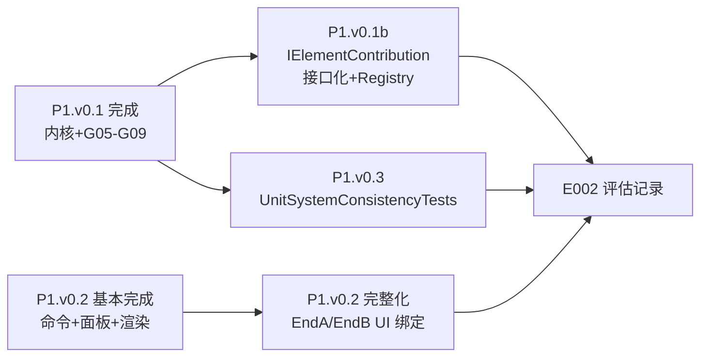
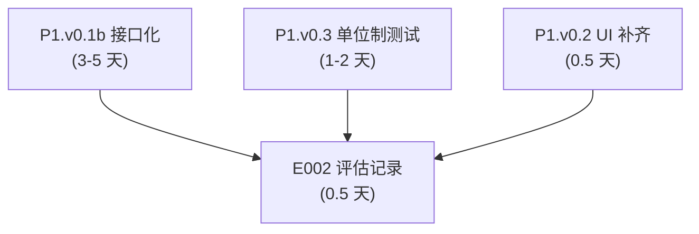

# 阶段 1 收尾与接口化 — P1.v0.1b ~ P1.v0.3

> **文档性质**: Phase 1 **收尾设计文档**（已完成代码的质量补齐与抽象升级）。  
> **文档日期**: 2026-07-10  
> **上承文档**:
> - [00-HYFEA总体计划-高度抽象框架与多年路线-2026-05-17-150400.md](./00-HYFEA总体计划-高度抽象框架与多年路线-2026-05-17-150400.md) — §七 阶段 1  
> - [02-阶段1MVP-EulerBeam2D-AutoCAD选线-均布荷载-解析解-2026-05-17-165000.md](./02-阶段1MVP-EulerBeam2D-AutoCAD选线-均布荷载-解析解-2026-05-17-165000.md) — 完整 MVP 蓝本  
> **当前代码事实快照**:
> - **P1.v0.1 完成**:`EulerBeam2DContribution`、`UniformBeamLoad`、`UnitSystem`/`UnitDescriptor` 全部实现,G05-G09 全绿(13/13 测试通过)
> - **P1.v0.2 基本完成**:`HyFeaBeamMvpCommand`(N7) + `BeamMvpPanel` + 面板→求解→回写闭环齐全;**缺口**:XAML 无 EndA/EndB 边界条件选择控件
> - **P1.v0.3 未开始**:无 `UnitSystemConsistencyTests`
> - **P1.v0.1b 未开始**:`IElementContribution` 为空占位,Assembler/DofLayout 仍用 switch

---

## §0 一句话定位与目标

**本计划收尾阶段 1 的三项遗留**:接口化(P1.v0.1b)、单位制一致性测试(P1.v0.3)、UI 边界条件补齐(P1.v0.2 完整化)。完成后输出 **E002 评估记录**,并为阶段 2(开源候选接入)奠定接口契约基础。



---

## §1 代码现状盘点(2026-07-10)

### §1.1 P1.v0.1 — 内核梁元与测试:✅ 已完成

| 模块 | 状态 | 关键文件 |
|------|------|---------|
| EulerBeam2DContribution | ✅ 完整实现(刚度/变换/等效荷载/内力恢复 N/V/M) | `Elements/EulerBeam2DContribution.cs` L16-321 |
| UniformBeamLoad | ✅ 两种模式(`LocalPerpendicular`/`GlobalNegY`) | `Loads/UniformBeamLoad.cs` L12-19 |
| UnitSystem/Descriptor | ✅ 枚举(SI/MmN/Custom) + FemProblem.Units 字段 | `Model/UnitSystem.cs`、`FemProblem.cs` L15-16 |
| FemResult.BeamEndForces | ✅ `BeamEndValues(N,VA,MA,VB,MB)` 容器 | `Results/FemResult.cs` L33-56 |
| DofLayout RZ 支持 | ✅ EulerBeam2D 注册 UX/UY/RZ | `Dofs/DofLayout.cs` L60-67 |
| G05-G09 梁黄金算例 | ✅ 5 例,MmN 单位,解析解比对 | `Tests/GoldenCases/G05_G09_BeamTests.cs` |
| 测试通过率 | ✅ **13/13 全绿**(dotnet test) | Spring(2) + Truss(2) + Beam(5) + Unit(4) |

**判定**:P1.v0.1 ✅ **完成**。符合 [02 §10](./02-阶段1MVP-EulerBeam2D-AutoCAD选线-均布荷载-解析解-2026-05-17-165000.md) L444 定义。

### §1.2 P1.v0.2 — 宿主集成与 UI:⚠️ 基本完成(有 1 处缺口)

| 模块 | 状态 | 关键文件 |
|------|------|---------|
| HyFeaBeamMvpCommand | ✅ 选线入口(N7 注册) | `Features/Fem/Commands/HyFeaBeamMvpCommand.cs` |
| BeamMvpPanel/ViewModel | ⚠️ 字段齐全,**但 EndA/EndB 无 XAML 绑定** | `Views/BeamMvpPanel.xaml` L25-71(无 Support 控件) |
| HyfeaGeometryMapper | ✅ Line/Polyline 映射,单位制缩放 | `Integration/HyfeaGeometryMapper.cs` L14-38 |
| HyfeaBeamProblemBuilder | ✅ 轴线→FemProblem,含边界枚举映射 | `Integration/HyfeaBeamProblemBuilder.cs` L23-80 |
| BeamResultRenderer | ✅ 变形折线/M折线/V折线/反力文字 | `Renderer/BeamResultRenderer.cs` L63-184 |
| 求解→回写闭环 | ✅ ExecuteSolve 完整管线 | `Views/BeamMvpPanelViewModel.cs` L83-179 |

**判定**:P1.v0.2 ⚠️ **基本完成**,但边界条件 UI 缺失导致面板恒为悬臂(EndA=Fixed,EndB=Free),用户无法演示简支/两端固接等其他算例。

### §1.3 P1.v0.3 — 单位制一致性测试:❌ 未开始

**事实**:无 `UnitSystemConsistencyTests` 文件;内核 `Units` 字段仅为元数据,不驱动缩放;一致性验证缺位。

### §1.4 P1.v0.1b — 接口化与 Registry 分派:❌ 未开始

**事实**:`IElementContribution` 为空占位(L7-9 注释说明 P1.v0.1b 延后);`Assembler.cs` L23-39、`DofLayout.cs` L48-71 均用 switch。

---

## §2 里程碑补齐计划

### §2.1 P1.v0.1b — IElementContribution 接口化 + Registry

**目标**:落实 [02 §5](./02-阶段1MVP-EulerBeam2D-AutoCAD选线-均布荷载-解析解-2026-05-17-165000.md) L209-256 接口契约,为阶段 2 Track A 开源候选接入奠定多态基础。

#### §2.1.1 接口定义(伪签名,参考 02 §5.1)

```csharp
public interface IElementContribution
{
    /// <summary>本 Contribution 适用的单元定义类型(如 typeof(EulerBeam2DElementDef))。</summary>
    Type ElementDefinitionType { get; }
    
    /// <summary>返回该单元类型每个节点需要的自由度集合(用于 DofLayout 自动注册)。</summary>
    IReadOnlyList<DofType> ActiveDofsForNode(FemElementDefinition element, NodeId node);
    
    /// <summary>将单元局部刚度矩阵叠加到全局 K。</summary>
    void ApplyStiffness(FemProblem problem, FemElementDefinition element, DofLayout layout, DenseMatrix K);
    
    /// <summary>将单元荷载(如均布荷载)转化为等效节点力并叠加到全局 F。</summary>
    void ApplyEquivalentLoads(
        FemProblem problem,
        FemElementDefinition element,
        IReadOnlyList<IElementLoad> elementLoads,
        DofLayout layout,
        DenseVector F);
    
    /// <summary>从全局位移恢复单元内力(轴力/端部 N/V/M 等),返回强类型结果。</summary>
    object Recover(FemProblem problem, FemElementDefinition element, DofLayout layout, DenseVector uFull);
}
```

**注**:`Recover` 返回 `object` 是过渡设计(Spring1D→double,EulerBeam2D→BeamEndValues);P2+ 可引入 `IElementInternalForces` 基接口或泛型 `IElementContribution<TElement, TForces>`。

#### §2.1.2 现有三个 Contribution 类改造

| Contribution | 当前 | 改为 |
|-------------|------|------|
| Spring1DContribution | `internal static` | `internal sealed` 实现 `IElementContribution` |
| Truss2DContribution | `internal static` | `internal sealed` 实现 `IElementContribution` |
| EulerBeam2DContribution | `internal static` | `internal sealed` 实现 `IElementContribution` |

**改造要点**:
- 将 `static void Contribute(...)` 改为 `public void ApplyStiffness(...)`(实例方法,签名对齐接口)
- `ActiveDofsForNode`:Spring1D 返回 `[UX]`,Truss2D 返回 `[UX,UY]`,EulerBeam2D 返回 `[UX,UY,RZ]`
- `ApplyEquivalentLoads`:Spring1D/Truss2D 返回空(无元素荷载);EulerBeam2D 处理 `UniformBeamLoad`
- `Recover`:Spring1D 返回 `double`,Truss2D 返回 `double`,EulerBeam2D 返回 `BeamEndValues`

#### §2.1.3 Registry 与分派

新增 `Elements/ElementContributionRegistry.cs`:

```csharp
public sealed class ElementContributionRegistry
{
    private readonly Dictionary<Type, IElementContribution> _map = new();
    
    public ElementContributionRegistry()
    {
        Register(new Spring1DContribution());
        Register(new Truss2DContribution());
        Register(new EulerBeam2DContribution());
    }
    
    public void Register(IElementContribution contrib)
    {
        _map[contrib.ElementDefinitionType] = contrib;
    }
    
    public IElementContribution Resolve(FemElementDefinition element)
    {
        var t = element.GetType();
        if (!_map.TryGetValue(t, out var c))
            throw new NotSupportedException($"No contribution for {t.Name}");
        return c;
    }
}
```

**Assembler.cs 改造**:将 L23-39 switch 改为:

```csharp
var registry = new ElementContributionRegistry();
foreach (var el in problem.Elements)
{
    var contrib = registry.Resolve(el);
    contrib.ApplyStiffness(problem, el, layout, K);
}

foreach (var el in problem.Elements)
{
    var contrib = registry.Resolve(el);
    var loads = problem.LoadCase.ElementLoads.Where(ld => ld.TargetElement == el.Id).ToList();
    contrib.ApplyEquivalentLoads(problem, el, loads, layout, F);
}
```

**DofLayout.cs 改造**:L46-71 switch 改为:

```csharp
var registry = new ElementContributionRegistry();
foreach (var el in problem.Elements)
{
    var contrib = registry.Resolve(el);
    foreach (var n in GetElementNodes(el)) // Spring1D/Truss/Beam 均为 (NodeA, NodeB)
    {
        foreach (var dof in contrib.ActiveDofsForNode(el, n))
            AddDof(required, n, dof);
    }
}
```

**LinearStaticAnalysis.cs 改造**:L124-143 `ComputeAxialForces`/`ComputeBeamEndForces` 可保留 switch(内力恢复非装配关键路径,接口化优先级低;若改,需统一 Recover 返回类型)。

#### §2.1.4 验收标准

- [ ] `IElementContribution` 定义完整(4 个方法签名)
- [ ] Spring1D/Truss2D/EulerBeam2D 三个 Contribution 类全部实现接口
- [ ] `ElementContributionRegistry` 注册与分派
- [ ] `Assembler.cs` 刚度与荷载装配改为单循环 registry dispatch
- [ ] `DofLayout.Build` 自由度收集改为 registry dispatch
- [ ] `dotnet test` **13/13 全绿**(接口重构不改变计算结果)
- [ ] 代码注释标注"P1.v0.1b 接口化完成,为 P2 Track A 预留插件位"

---

### §2.2 P1.v0.3 — UnitSystemConsistencyTests

**目标**:新增测试类,验证同一 `FemProblem` 在 SI/MmN 两种单位制下,经几何/材料缩放后,位移、弯矩等物理量换算一致。

#### §2.2.1 测试设计

新建 `Tests/Unit/UnitSystemConsistencyTests.cs`:

```csharp
/// <summary>验证 SI ↔ MmN 单位制一致性(02 §6、§10 P1.v0.3)。</summary>
public sealed class UnitSystemConsistencyTests
{
    [Fact]
    public void Cantilever_uniform_load_SI_MmN_match_after_unit_conversion()
    {
        // 悬臂梁 L=10m / 10000mm,均布 q=10 N/m / 0.01 N/mm
        // E=206 GPa / 206000 MPa,A=0.008 m² / 8e4 mm²,Iz=8.889e-4 m⁴ / 8.889e8 mm⁴
        
        var mmBuilder = new FemProblemBuilder()
            .WithUnits(UnitSystem.MmN)
            .AddMaterial(new LinearElasticMaterial(Mid, 2.06e5, 0.3))
            .AddSection(new BeamSection(Sid, 8e4, 8.889e8));
        // 坐标 mm:(0,0) - (10000,0)
        // q=0.01 N/mm
        
        var siBuilder = new FemProblemBuilder()
            .WithUnits(UnitSystem.SI)
            .AddMaterial(new LinearElasticMaterial(Mid, 2.06e11, 0.3)) // Pa
            .AddSection(new BeamSection(Sid, 0.008, 8.889e-4));        // m², m⁴
        // 坐标 m:(0,0) - (10,0)
        // q=10 N/m
        
        // ... 构建两个等价 FemProblem,求解,换算比对 u_y、M
        
        double uy_mm = solMm.Displacements.Get(n1, DofType.UY);
        double uy_si_mm = solSi.Displacements.Get(n1, DofType.UY) * 1000; // m→mm
        Math.Abs(uy_mm - uy_si_mm).Should().BeLessThan(Math.Abs(uy_mm) * 1e-9);
        
        double m_mm = solMm.BeamEndForces.Get(e1).MA;      // N·mm
        double m_si_mm = solSi.BeamEndForces.Get(e1).MA * 1000; // N·m→N·mm
        Math.Abs(m_mm - m_si_mm).Should().BeLessThan(Math.Abs(m_mm) * 1e-9);
    }
}
```

**要点**:
- 两个 builder 构造几何、材料、截面、荷载完全一致(物理意义),仅单位制标记不同
- 坐标/E/A/I/q 按单位制缩放(mm 系 vs m 系)
- 求解后位移/弯矩换算到同一单位比对,相对误差 `<1e-9`

#### §2.2.2 验收标准

- [ ] `Tests/Unit/UnitSystemConsistencyTests.cs` 至少 1 个 `[Fact]`(悬臂梁 SI↔MmN)
- [ ] `dotnet test` 新增测试通过
- [ ] 若发现内核未按 `Units` 做缩放(当前事实),需在测试注释说明"当前 Units 为元数据,一致性由调用方保证几何/材料换算;本测试验证外层换算正确性"

---

### §2.3 P1.v0.2 完整化 — EndA/EndB 边界条件 UI 绑定

**目标**:补齐 `BeamMvpPanel.xaml` 中 EndA/EndB 的下拉选择控件,使用户可演示悬臂/简支/两端固接三种边界。

#### §2.3.1 XAML 改动(在"轴线分段数"块之后插入)

```xaml
<TextBlock Margin="0 8 0 2" Text="端 A 约束" />
<ComboBox ItemsSource="{Binding SupportOptions}"
          SelectedItem="{Binding EndA}"
          Style="{StaticResource BlenderComboBox}" />

<TextBlock Margin="0 8 0 2" Text="端 B 约束" />
<ComboBox ItemsSource="{Binding SupportOptions}"
          SelectedItem="{Binding EndB}"
          Style="{StaticResource BlenderComboBox}" />
```

#### §2.3.2 ViewModel 改动

在 `BeamMvpPanelViewModel` 构造函数或属性初始化中添加:

```csharp
public IReadOnlyList<BeamSupportUi> SupportOptions { get; } = new[]
{
    BeamSupportUi.Free,
    BeamSupportUi.Pin,
    BeamSupportUi.Fixed,
};
```

**已有字段**:`EndA`/`EndB` 已声明(L75-77),仅需绑定到 ComboBox。

#### §2.3.3 验收标准

- [ ] `BeamMvpPanel.xaml` 增加 EndA/EndB ComboBox 控件
- [ ] ViewModel 暴露 `SupportOptions` 枚举列表
- [ ] 面板可选 Free/Pin/Fixed,改变后点击"求解并回写"生效
- [ ] 验证简支(Pin-Pin)、两端固接(Fixed-Fixed)与 G07/G08/G09 解析解一致

---

## §3 实施顺序与依赖



**推荐顺序**:
1. **先做 P1.v0.1b 接口化**(最重要,为 P2 Track A 预留插槽;改动范围大,需充分测试)
2. **再做 P1.v0.3 单位制测试**(独立,可并行;补齐质量盲区)
3. **最后做 P1.v0.2 UI 补齐**(最快,增强演示能力)
4. **三项完成后统一编写 E002 评估记录**

---

## §4 评估记录 E002 大纲(占位)

完成上述三项后,在 `docs/FiniteElement/Evaluations/` 创建 `E002-HYFEA-P1收尾-接口化与单位制一致性-2026-07-XX.md`,包含:

### §4.1 评估维度(沿用 E001 的 10 维框架,重点关注)

| 维度 | P1.v0.1b 后得分预期 | 说明 |
|------|-------------------|------|
| 1. 正确性(Golden) | 10/10 | 13/13 全绿保持,接口化不改变计算 |
| 2. 单位制一致性 | 9/10 → 10/10 | 新增 UnitSystemConsistencyTests |
| 3. 接口抽象度 | 6/10 → 9/10 | IElementContribution 完成,Registry 分派 |
| 4. 模块化(依赖) | 9/10 | 保持(内核无宿主依赖) |
| 5. 可扩展性 | 7/10 → 9/10 | P2 Track A 可直接注册新 Contribution |
| 6. 文档完整度 | 8/10 → 9/10 | 本计划 + E002 补齐 |
| 7. 用户体验(UI) | 6/10 → 8/10 | EndA/EndB 可选,演示能力增强 |
| 其余维度 | 保持 E001 水平 | 性能/诊断/测试覆盖/工程纪律 |

**加权总分预期**:8.4/10(E001)→ **9.0/10**(E002)。

### §4.2 E002 核心结论

- ✅ **阶段 1 MVP 完整交付**:P1.v0.1/v0.2/v0.3/v0.1b 四个里程碑全部达标
- ✅ **接口契约落地**:为阶段 2 Track A 开源候选(CSparse.NET / MFEM / deal.II 等)预留明确插槽
- ✅ **质量盲区补齐**:单位制一致性、边界条件 UI、接口抽象三项提升
- 🔵 **下一步**:阶段 2 — AI 推荐并接入第一个 Track A 开源候选

---

## §5 风险与注意事项

| # | 风险 | 缓解 |
|---|------|------|
| R1 | 接口化改动大,破坏现有测试 | 分步改造:先接口定义+一个类实现,验证绿后再改其余 |
| R2 | `ActiveDofsForNode` 需遍历 element.Nodes,但 FemElementDefinition 无统一 Nodes 属性 | 接口方法传 `NodeId node`,由 Contribution 判断 node 是否属于 element |
| R3 | UnitSystemConsistencyTests 构造两套参数繁琐 | 提取 helper `BuildEquivalentProblem(UnitSystem, scaleParams)` |
| R4 | EndA/EndB ComboBox 可能触发 WPF/PaletteSet Badge 问题 | 参考现有 CheckBox 绑定模式,遵循 `.cursor/rules/05-AdWindows-WPF` |

---

## §6 修订记录

| 日期 | 版本 | 内容 |
|------|------|------|
| 2026-07-10 | v1.0 | 首版:盘点 P1.v0.1/v0.2 完成度,规划 P1.v0.1b(接口化) / P1.v0.3(单位制测试) / P1.v0.2 完整化(UI),E002 评估大纲 |

---

**文末**:本计划完成后,阶段 1 彻底收尾;下一阶段([阶段 2] AI 推荐 Track A 开源候选接入)将基于本计划落地的 `IElementContribution` 接口契约展开。
