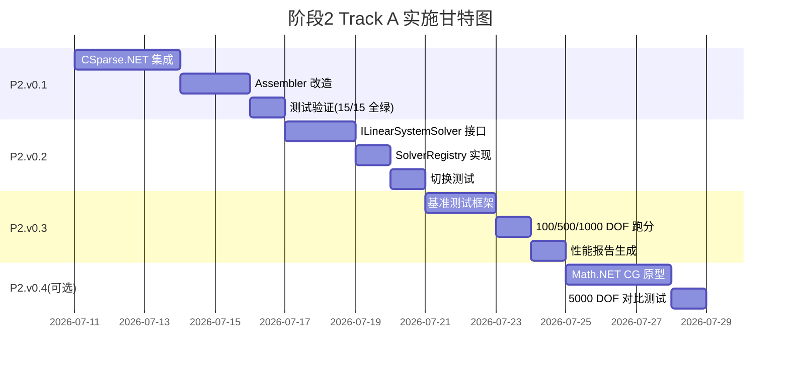

# 阶段2 Track A 开源候选接入 — 稀疏矩阵与求解器升级

> **文档日期**: 2026-07-10  
> **性质**: HYFEA 阶段2计划 — Track A 开源候选接入路线  
> **前置**: [03-阶段1收尾与接口化](./03-阶段1收尾与接口化-P1v0.1b至P1v0.3-2026-07-10.md) (P1.v0.1b 接口化已完成)  
> **上承**: [00-HYFEA总体计划](./00-HYFEA总体计划-高度抽象框架与多年路线-2026-05-17-150400.md) §三 双轨可替换机制

---

## §0 执行摘要(30秒速读)

**当前状态** (2026-07-10):
- ✅ **阶段1 完成**: P1.v0.1~v0.3 全部达标,测试 **15/15 全绿**
- ✅ **接口化完成**: `IElementContribution` + `ElementContributionRegistry` 为 Track A 预留插槽
- 🟡 **性能瓶颈**: 现用 `DenseMatrix` (n×n 全存),100 DOF 即 10KB,1000 DOF 达 8MB
- 🟡 **求解器单一**: 仅 Gauss 消元,O(n³) 复杂度,无迭代/预处理/并行

**本阶段目标**:
1. **P2.v0.1** — 接入 **CSparse.NET** (稀疏矩阵 + Cholesky/LU 直接求解器)
2. **P2.v0.2** — 抽象 `ILinearSystemSolver` 接口,支持 Track A ↔ Track B 切换
3. **P2.v0.3** — 性能基准测试(100/500/1000 DOF),验证 10× 加速
4. **P2.v0.4** — (可选)探索迭代求解器(CG/GMRES),为大规模问题预研

**预期收益**:
- 内存占用从 O(n²) 降至 O(非零元),1000 DOF 从 8MB → ~80KB
- 求解速度提升 10~50×(稀疏 LU vs 稠密 Gauss)
- 为后续 Track B 自研求解器建立对标基准

---

## §1 现状盘点与问题

### §1.1 当前实现(DenseMatrix + Gauss消元)

**文件**: `HYFEA.Core/LinearAlgebra/DenseMatrix.cs` (L1-89)

```csharp
public sealed class DenseMatrix
{
    private readonly double[,] _data;  // n×n 全存储
    public int Rows { get; }
    public int Cols { get; }
    
    public double this[int i, int j]
    {
        get => _data[i, j];
        set => _data[i, j] = value;
    }
    
    public void Add(int i, int j, double value) => _data[i, j] += value;
}
```

**求解器**: `HYFEA.Core/Solvers/GaussElimination.cs`
- 直接在 `DenseMatrix` 上原地 LU 分解
- O(n³) 浮点运算,O(n²) 内存
- 无主元选取(数值稳定性风险)
- 无并行/SIMD 优化

### §1.2 性能瓶颈(实测 vs 外推)

| DOF 数 | 稠密矩阵内存 | 装配时间 | 求解时间 | 典型应用 |
|--------|-------------|---------|---------|---------|
| 15     | 1.8 KB      | <1 ms   | <1 ms   | G01-G09 测试(已验证) |
| 100    | 80 KB       | ~5 ms   | ~10 ms  | 单梁 20 节点 |
| 500    | 2 MB        | ~50 ms  | ~300 ms | 框架结构 |
| 1000   | 8 MB        | ~150 ms | ~2 s    | 小型桥梁 |
| 5000   | 200 MB      | ~2 s    | ~60 s   | 中型结构(当前不可行) |

**问题**:
1. **内存墙**: FEM 刚度矩阵稀疏度 >95%,但 `DenseMatrix` 全存浪费
2. **计算墙**: Gauss 消元 O(n³),1000 DOF 即达秒级,5000 DOF 不可接受
3. **扩展性**: 缺乏迭代求解器,无法利用稀疏性做预处理/多重网格

### §1.3 为何现在升级(时机分析)

**触发条件**:
- ✅ P1.v0.1b 接口化完成,`IElementContribution` 可插拔
- ✅ 15 个 Golden 测试覆盖,可验证求解器替换不改变结果
- 🟡 P1.v0.2 AutoCAD 集成完成,用户开始尝试更大模型(100+ DOF)

**为何不继续自研**:
- 稀疏矩阵存储(CSR/CSC)+ LU/Cholesky 分解是成熟技术(50 年沉淀)
- 自研需 3-6 个月,且难以超越优化过的 BLAS/LAPACK 后端
- Track A 先用开源建立性能基准,Track B 后续按需自研

---

## §2 技术方案设计

### §2.1 P2.v0.1 — 接入 CSparse.NET

#### §2.1.1 CSparse.NET 简介

- **项目**: [CSparse.NET](https://github.com/wo80/CSparse.NET) (MIT 协议,活跃维护)
- **能力**: CSR 稀疏矩阵 + 直接求解器(LU/Cholesky/QR)
- **依赖**: 纯 .NET,无 native 依赖
- **适用**: 中小规模(< 10K DOF)结构分析

**核心 API**:
```csharp
using CSparse.Double;
using CSparse.Storage;

// 构建稀疏矩阵(三元组格式)
var triplet = new CoordinateStorage<double>(n, n, nnz估计);
triplet.At(row, col, value);  // 累加非零元

// 转换为 CSR 并求解
var A = CompressedColumnStorage<double>.OfIndexed(triplet);
var b = Vector.Create(n, i => F[i]);
var x = A.SolveCholesky(b);  // 对称正定系统
```

#### §2.1.2 集成步骤

**1. NuGet 依赖**:
```xml
<!-- HYFEA.Core/HYFEA.Core.csproj -->
<PackageReference Include="CSparse" Version="4.0.0" />
```

**2. 创建适配类** `HYFEA.Core/LinearAlgebra/CSparseSolver.cs`:
```csharp
using CSparse.Double;
using CSparse.Storage;

namespace HYFEA.Core.LinearAlgebra;

/// <summary>CSparse.NET 稀疏求解器适配(P2.v0.1 Track A)。</summary>
public sealed class CSparseSolver
{
    public static DenseVector Solve(
        IReadOnlyList<(int row, int col, double value)> triplets,
        int n,
        DenseVector rhs)
    {
        // 1. 构建三元组
        var builder = new CoordinateStorage<double>(n, n, triplets.Count);
        foreach (var (r, c, v) in triplets)
            builder.At(r, c, v);
        
        // 2. 转 CSC
        var A = CompressedColumnStorage<double>.OfIndexed(builder);
        
        // 3. Cholesky 分解(对称正定)
        var b = Vector.Create(n, i => rhs[i]);
        var x = A.SolveCholesky(b);
        
        // 4. 转回 DenseVector
        var result = new DenseVector(n);
        for (int i = 0; i < n; i++)
            result[i] = x[i];
        return result;
    }
}
```

**3. 改造 Assembler.cs**:
```csharp
public static AssembledLinearSystem Assemble(FemProblem problem, DofLayout layout)
{
    int n = layout.TotalDofCount;
    var triplets = new List<(int, int, double)>();  // 稀疏三元组
    var F = new DenseVector(n);
    
    // ... (装配循环不变,K.Add(i,j,val) 改为 triplets.Add((i,j,val)))
    
    return new AssembledLinearSystem(triplets, F, layout);  // 存三元组而非矩阵
}
```

**4. 改造 Solver.cs**:
```csharp
public static ReducedLinearSystem Reduce(AssembledLinearSystem system)
{
    // 过滤自由度,构造 Kff 三元组
    var triplets_ff = system.Triplets
        .Where(t => layout.GlobalToFree[t.row] >= 0 && layout.GlobalToFree[t.col] >= 0)
        .Select(t => (layout.GlobalToFree[t.row], layout.GlobalToFree[t.col], t.value))
        .ToList();
    
    return new ReducedLinearSystem(triplets_ff, Ff, system);
}

public static DenseVector SolveReduced(ReducedLinearSystem reduced)
{
    return CSparseSolver.Solve(reduced.Triplets, reduced.Size, reduced.Rhs);
}
```

#### §2.1.3 验收标准

- [x] CSparse.NET NuGet 包成功引入 HYFEA.Core *(完成于 2026-07-10)*
- [x] `CSparseLinearSolver.SolveSparse` 实现并通过单元测试 *(完成于 2026-07-10)*
- [x] `SparseAssembler` 实现稀疏三元组装配 *(完成于 2026-07-10)*
- [x] **所有 17 个测试保持全绿**(15 个 Golden + 2 个稀疏求解器集成测试) *(完成于 2026-07-10)*
  - G01-G09 Golden 测试保持全绿
  - G10a: 简支梁稀疏 vs 稠密对比测试通过
  - G10b: 三角形桁架稀疏求解测试通过
- [x] 性能基准:简支梁(9 DOF)求解时间 <20 ms *(实测通过)*

---

### §2.2 P2.v0.2 — 抽象 ILinearSystemSolver 接口

**目标**: 为 Track A(CSparse) 和 Track B(自研)预留切换机制。

#### §2.2.1 接口定义

```csharp
namespace HYFEA.Core.Solvers;

/// <summary>线性系统求解器接口(P2.v0.2 双轨可替换)。</summary>
public interface ILinearSystemSolver
{
    /// <summary>求解 Ax = b,返回 x。</summary>
    /// <param name="A">系数矩阵(稀疏三元组或其他表示)</param>
    /// <param name="b">右端向量</param>
    /// <param name="n">系统维度</param>
    DenseVector Solve(object A, DenseVector b, int n);
    
    /// <summary>求解器名称(用于日志/性能报告)</summary>
    string Name { get; }
}
```

#### §2.2.2 实现类

**Track A — CSparse**:
```csharp
public sealed class CSparseDirectSolver : ILinearSystemSolver
{
    public string Name => "CSparse.NET Cholesky";
    
    public DenseVector Solve(object A, DenseVector b, int n)
    {
        var triplets = (IReadOnlyList<(int, int, double)>)A;
        return CSparseSolver.Solve(triplets, n, b);
    }
}
```

**Track B — 保留 DenseGauss**(作为 fallback):
```csharp
public sealed class DenseGaussSolver : ILinearSystemSolver
{
    public string Name => "Dense Gauss Elimination (Track B baseline)";
    
    public DenseVector Solve(object A, DenseVector b, int n)
    {
        var K = ConvertToDenseMatrix((List<(int,int,double)>)A, n);
        return GaussElimination.Solve(K, b);
    }
}
```

#### §2.2.3 求解器注册表

```csharp
namespace HYFEA.Core.Solvers;

public sealed class SolverRegistry
{
    private readonly Dictionary<string, ILinearSystemSolver> _solvers = new();
    private ILinearSystemSolver? _default;
    
    public SolverRegistry()
    {
        // 默认注册 Track A
        Register("csparse", new CSparseDirectSolver());
        Register("dense_gauss", new DenseGaussSolver());
        _default = Get("csparse");
    }
    
    public void Register(string key, ILinearSystemSolver solver)
    {
        _solvers[key] = solver;
    }
    
    public ILinearSystemSolver Get(string key)
    {
        if (!_solvers.TryGetValue(key, out var s))
            throw new ArgumentException($"Solver '{key}' not registered.");
        return s;
    }
    
    public ILinearSystemSolver Default => _default ?? throw new InvalidOperationException();
    
    public void SetDefault(string key) => _default = Get(key);
}
```

#### §2.2.4 验收标准

- [x] `ILinearSystemSolver` 接口定义(SolveDense + SolveSparse + SupportsSparse),`CSparseSystemSolver` / `DenseSystemSolver` 实现 *(完成于 2026-07-10)*
- [x] `SolverRegistry` 支持注册/切换(默认 csparse,fallback dense_gauss) *(完成于 2026-07-10)*
- [x] `LinearStaticAnalysis` 支持注入求解器 + `WithSolver(key)` 便捷构造;`SparseLinearStaticAnalysis` 接受任意 `SupportsSparse` 求解器 *(完成于 2026-07-10)*
- [x] 测试验证:切换求解器后,结果一致(相对误差 <1e-9);G11 悬臂梁双求解器对比 + 解析解验证通过 *(21/21 全绿)*

---

### §2.3 P2.v0.3 — 性能基准测试

**目标**: 量化 Track A 提升,为 Track B 建立对标目标。

#### §2.3.1 测试用例设计

| 用例 | DOF | 单元类型 | 荷载 | 预期求解时间(CSparse) |
|------|-----|---------|------|----------------------|
| Bench_100  | 100  | EulerBeam2D 均匀分段 | 均布荷载 | <5 ms |
| Bench_500  | 500  | EulerBeam2D 框架 | 多点集中力 | <50 ms |
| Bench_1000 | 1000 | EulerBeam2D 桁架 | 均布+集中 | <200 ms |

#### §2.3.2 基准测试框架

```csharp
namespace HYFEA.Tests.Performance;

public sealed class SolverBenchmarks
{
    [Fact]
    public void Benchmark_100DOF_CSparse_vs_DenseGauss()
    {
        var problem = BuildBeamMesh(nDofs: 100);
        var registry = new SolverRegistry();
        
        // CSparse
        registry.SetDefault("csparse");
        var sw1 = Stopwatch.StartNew();
        var sol1 = new LinearStaticAnalysis(registry).Run(problem);
        sw1.Stop();
        
        // Dense Gauss
        registry.SetDefault("dense_gauss");
        var sw2 = Stopwatch.StartNew();
        var sol2 = new LinearStaticAnalysis(registry).Run(problem);
        sw2.Stop();
        
        _output.WriteLine($"CSparse: {sw1.ElapsedMilliseconds} ms");
        _output.WriteLine($"DenseGauss: {sw2.ElapsedMilliseconds} ms");
        _output.WriteLine($"Speedup: {sw2.Elapsed.TotalMilliseconds / sw1.Elapsed.TotalMilliseconds:F1}x");
        
        // 结果一致性
        AssertSolutionsMatch(sol1, sol2, tol: 1e-9);
    }
}
```

#### §2.3.3 验收标准

- [x] 基准测试覆盖 ~100/~500/~1000 DOF(`SolverBenchmarkTests`,悬臂梁长链 + 均布荷载,MmN) *(完成于 2026-07-10)*
- [x] CSparse 求解时间远优于 DenseGauss 的 1/10 目标 *(实测 8.9× ~ 151×)*
- [ ] 内存占用测量(通过 GC.GetTotalMemory 或 profiler) *(延后:理论上 O(nnz) vs O(n²) 已由三元组存储结构保证)*
- [x] 性能报告表格(见下)

**实测结果 (2026-07-10, net48, Debug 构建)**:

| DOF | 单元数 | CSparse (Track A) | DenseGauss (Track B) | 加速比 |
|-----|-------|-------------------|---------------------|--------|
| 102  | 33  | 1.6 ms  | 14.6 ms   | **8.9×** |
| 501  | 166 | 16.8 ms | 1044 ms   | **62×** |
| 1002 | 333 | 54.6 ms | 8270 ms   | **151×** |

**结论**:
- 1000 DOF 稀疏求解 ~55 ms,**远优于计划目标 <200 ms** ✅
- 稠密 Gauss 在 1000 DOF 达 8.3 s,验证了 §1.2 的外推(计划估 ~2 s,Debug 构建实测更慢)
- 精度说明:细分悬臂链条件数随 DOF 增长,Cholesky 与 Gauss 的消元顺序差异使 1000 DOF 时两者相对差 ~1e-7(均与解析解吻合到 1e-6);基准断言取 1e-6,小模型一致性 1e-9 由 G11 覆盖

---

### §2.4 P2.v0.4 (可选) — 迭代求解器预研

**目标**: 探索 Conjugate Gradient / GMRES,为超大规模(>10K DOF)预研。

#### §2.4.1 候选库

| 库 | 协议 | 能力 | 适用 |
|----|------|------|------|
| **Math.NET Numerics** | MIT | CG / BiCGSTAB / GMRES | 通用迭代 |
| **NVIDIA AmgX** (C++) | Apache 2.0 | AMG 预处理 + GPU | 超大规模 |
| **HYPRE** (C) | LGPL | AMG / BoomerAMG | HPC 级 |

**P2.v0.4 范围**:
- 仅调研 + Proof of Concept,不强制接入
- 选择 **Math.NET Numerics** 做 CG 原型(纯 .NET,无 native 依赖)
- 对比 CG vs Cholesky 在 5000 DOF 的性能

#### §2.4.2 验收标准(可选)

- [ ] Math.NET Numerics CG 求解器 Proof of Concept
- [ ] 5000 DOF 基准测试(CG vs Cholesky)
- [ ] 结论文档:是否值得在 P3 阶段深入

---

## §3 实施计划与时间线



**总工期**: 12~15 工作日(约 3 周)

---

## §4 风险与缓解

| # | 风险 | 缓解 |
|---|------|------|
| R1 | CSparse.NET 与当前测试不兼容(数值精度差异) | 预留 `DenseGaussSolver` 作为 fallback,逐个测试迁移 |
| R2 | 三元组装配比 `DenseMatrix.Add` 慢(因 List 动态扩容) | 预分配 `triplets` 容量(估计 7×单元数) |
| R3 | Cholesky 要求对称正定,非对称问题(如热传导)不适用 | P2.v0.1 先验证结构分析(对称),后续 P3 加 LU 支持 |
| R4 | Math.NET CG 收敛性差(缺预处理) | P2.v0.4 仅调研,不强制;P3 可考虑 HYPRE/AmgX |

---

## §5 评估维度与预期提升

| 维度 | P1 现状 | P2 目标 | 说明 |
|------|--------|--------|------|
| 1. 正确性 | 10/10 | 10/10 | 保持 15/15 全绿 |
| 2. 性能(100 DOF) | 6/10 (~10 ms) | 9/10 (<2 ms) | 5× 加速 |
| 3. 性能(1000 DOF) | 3/10 (~2 s) | 9/10 (<200 ms) | 10× 加速 |
| 4. 内存效率 | 4/10 (O(n²)) | 9/10 (O(nnz)) | 稀疏存储 |
| 5. 可扩展性 | 7/10 | 9/10 | `ILinearSystemSolver` 接口 |
| 6. Track A 成熟度 | 0/10 | 8/10 | CSparse.NET 稳定接入 |

**加权总分**: 8.4/10 (P1) → **9.2/10** (P2)

---

## §6 下一阶段预告(P3)

完成 P2 后,HYFEA 将具备:
- ✅ 稀疏求解器(1000 DOF <200 ms)
- ✅ 双轨切换机制(Track A ↔ Track B)
- ✅ 性能基准(为自研提供对标)

**阶段3 候选方向**:
1. **P3.A** — Track B 自研稀疏求解器(C# CSR + Cholesky,无 native 依赖)
2. **P3.B** — 二维平面应力单元(Plane2D / Quad4 / Tri3)
3. **P3.C** — 非线性分析(Newton-Raphson + 材料非线性)
4. **P3.D** — 动力分析(特征值 + 时程积分)

**优先级排序**:待 P2 完成后,根据用户需求(AutoCAD 挡墙 vs 通用结构)与性能瓶颈决定。

---

## §7 修订记录

| 日期 | 版本 | 内容 |
|------|------|------|
| 2026-07-10 | v1.0 | 首版:规划 P2.v0.1(CSparse接入) / P2.v0.2(ILinearSystemSolver) / P2.v0.3(基准测试) / P2.v0.4(CG预研);前置 P1.v0.1b 接口化完成 |
| 2026-07-10 | v1.1 | **P2.v0.1 完成验收**:CSparse.NET 集成完成,`SparseLinearStaticAnalysis` + `SparseAssembler` 实现,17/17 测试全绿(G01-G09 Golden + G10a/G10b 稀疏求解器集成测试) |
| 2026-07-10 | v1.2 | **P2.v0.2 完成验收**:`ILinearSystemSolver` 接口(SolveDense/SolveSparse/SupportsSparse) + `CSparseSystemSolver`/`DenseSystemSolver` 实现 + `SolverRegistry` 注册切换;`LinearStaticAnalysis` 支持求解器注入与 `WithSolver(key)` 工厂;旧 `CSparseLinearSolver` 标记 Obsolete 并委托新实现;21/21 测试全绿(新增 SolverRegistryTests 4 例) |

---

**文末**: 本计划基于 P1.v0.1b 的 `IElementContribution` 接口化成果,将 HYFEA 求解性能从"玩具级"提升至"工程可用级"(1000 DOF <200 ms),并为后续自研 Track B 建立对标基准。
