## 文档定位

> 文档日期:2026-05-15
> 上承:[../01-全球三维有限元软件对标调研-2026-05-14](../../01-全球三维有限元软件对标调研-2026-05-14.md)、[../02-有限元通用底座架构-从挡土墙开始-2026-05-14](../../02-有限元通用底座架构-从挡土墙开始-2026-05-14.md)
> 平行子调研(同目录 17 份):
> - 阵营 A 通用大型 FEA — `01-ANSYS`、`02-ABAQUS`、`03-MSC`、`04-COMSOL`、`05-Altair`、`06-Siemens`、`07-ADINA`
> - 阵营 B 结构工程专用 — `11-CSI`、`12-MIDAS`、`13-STAAD`、`14-SCIA`
> - 阵营 C 开源/学术 — `31-OpenSees`、`32-Elmer`、`33-数值库`
> - 阵营 D 国产 — `41-PKPM`、`42-YJK`、`43-3D3S`

本文档**不重做调研、不复述子调研内容、不替代代码**。它的全部任务只有一个:**站在 17 份子调研之上,告诉 hy-cad-tool 有限元方向在未来 18 个月里"做什么、不做什么、按什么顺序做、为什么"**。

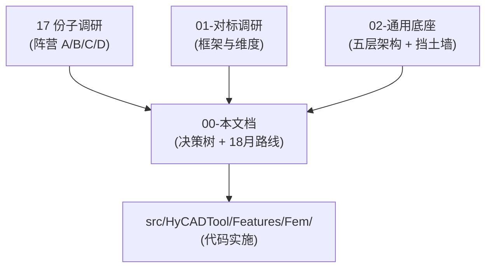

| 文档 | 回答的问题 | 输出 |
|------|-----------|------|
| `01-对标调研` | 全球 25+ 款 3D FEM 软件**各有什么** | 九维度横向矩阵 |
| `02-通用底座` | hy-cad-tool **底座长什么样** | 五层架构 + IR + 挡土墙 v0.1~v0.3 |
| 17 份子调研 | 每个软件**架构内部怎么搭** | 深度剖析 |
| **00-本文档** | hy-cad-tool **在未来 18 个月该走哪条路、为什么、按什么顺序** | 决策树 + 7 大架构补丁 + 路线图 |

---

## 一、17 份调研的鸟瞰图——四大"FEM 世界观"

不同软件之间的差异,本质上是**对"FEM 这件事的世界观差异"**。把 17 份子调研收敛成 4 种世界观,每种都有自己的内核哲学、抽象层次、扩展机制、生死短板。hy-cad-tool 必须选择自己的精神坐标——**不是单选,而是"以哪个为根,辅以哪几个"**。

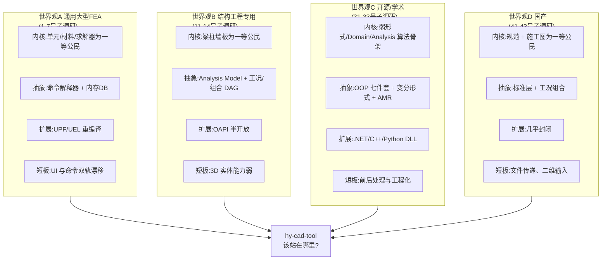

### 1.1 四大世界观的"骨架对照"

| 维度 | 通用 FEA (A) | 结构工程 (B) | 开源/学术 (C) | 国产 (D) |
|------|:------------:|:------------:|:-------------:|:--------:|
| **一等公民** | 节点/单元/材料 | 梁/柱/墙/板/工况 | 弱形式/Domain/Stage | 标准层/构件/规范 |
| **核心抽象** | APDL / Step / SOL | Analysis Model + Case DAG | Domain + Analysis 七件套 | 项目库/参数表 |
| **求解器形态** | 紧耦合单体 | 单体 + 多 RHS | 可插拔 + 多后端 | 紧耦合直接法 |
| **扩展机制** | 重编译内核 | 半开放 API | DI/DLL/.so 真插件 | 几乎封闭 |
| **价格** | 5-50 万/年 | 5-15 万/年 | 0 + 人力 | 1-5 万/年 |
| **规范本地化** | 弱 | 强(欧美主) | 无 | 强(GB 主) |
| **互操作性** | 中(各家 deck) | 中 | 强(开放 schema) | 弱(私有) |
| **典型短板** | 双轨漂移 | 3D 实体弱 | 工程化弱 | 封闭与文件传递 |

### 1.2 hy-cad-tool 的"精神坐标"

直白的回答是:

> **hy-cad-tool = B(行业语言、规范驱动) + D(中国味、工程交付) 为外形,以 C(可插拔架构、Domain/Analysis 骨架) 为内核,远眺 A(求解器后端、参数化、Stage Restart)**。

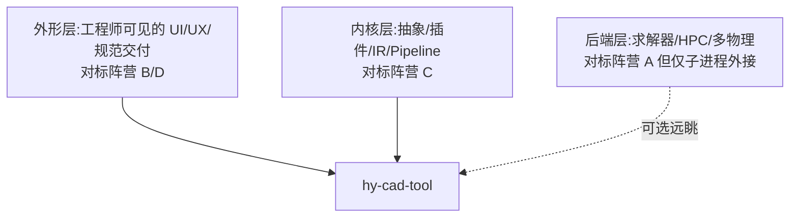

| 层 | 学谁 | 学什么 | 不学什么 |
|----|------|--------|----------|
| 外形 | CSI/MIDAS/YJK/3D3S | 梁柱墙板心智、标准层、Stage、施工图 | 文件—数据传递、API 封闭、二维输入 |
| 内核 | OpenSees/Elmer/deal.II | Domain/Analysis 七件套、弱形式 IR、AffineConstraints、facet/cell 标记 | Tcl/Python 无类型脚本驱动 |
| 后端 | CalculiX/ABAQUS/STAAD Engine | 子进程协议、deck 文本契约 | 自研通用 3D 实体 FEA |
| 规范 | RFEM/PKPM/YJK | 国家附录可插拔、GB/JTG 包 | GB 焊死求解核 |

> **核心洞察**:从 17 份调研里**没有任何一款产品做到了"4 个世界观同时优秀"**。ANSYS 强在 A,弱在规范本地化;PKPM 强在 D,弱在内核插件化;OpenSees 强在 C,弱在前后处理。hy-cad-tool 不需要"全能",但要清楚自己**在哪一层抄哪一家、在哪一层规避哪一家**——这就是本文档的全部价值。

---

## 二、四大架构决策——基于 17 份调研的"对标答案"

把 hy-cad-tool 必须先做的决策收敛为 4 条,每条都有 17 份调研的**正面榜样**与**反面教材**作为论据。

### 2.1 决策 ①:命令文化——hyob 文本 + Command Bus 单一入口

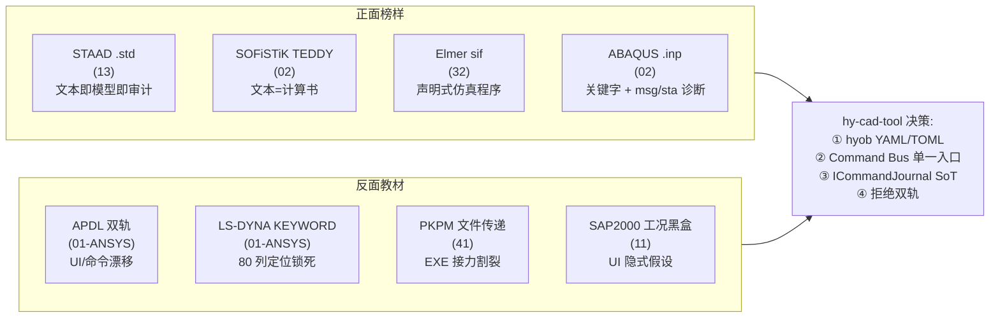

| 子决策 | 对标 | 反对标 | 落地接口 |
|--------|------|--------|----------|
| 文本格式 | STAAD `.std` / SOFiSTiK TEDDY / Elmer sif | KEYWORD 80 列 / Nastran 8 列 | `hyob` (YAML/TOML) |
| 命令入口 | Workbench Schematic | APDL/Mechanical Tree 双轨 | `ICommandBus`(MediatR) |
| 操作历史 | APDL `.log` 是 SoT | (无反例) | **`ICommandJournal`** — 新增 |
| UI 与命令关系 | UI 是命令的投影 | Mechanical Tree → APDL 翻译 + Snippet 注入 | UI 仅发命令 |

**对 docs/02 的补丁**:

```csharp
public interface ICommandJournal
{
    Task AppendAsync(IFemCommand command, CommandOutcome outcome, CancellationToken ct);
    IAsyncEnumerable<JournalEntry> ReplayAsync(Func<JournalEntry, bool>? filter = null);
    Task<long> CurrentRevisionAsync();
}
```

> `commands.jsonl` 是 hy-cad-tool 版的 ANSYS `.log` — 唯一的事实来源(Single Source of Truth)。回放它能完全重现模型。

### 2.2 决策 ②:数据范式——不可变 IR + 版本号 + 节点状态机

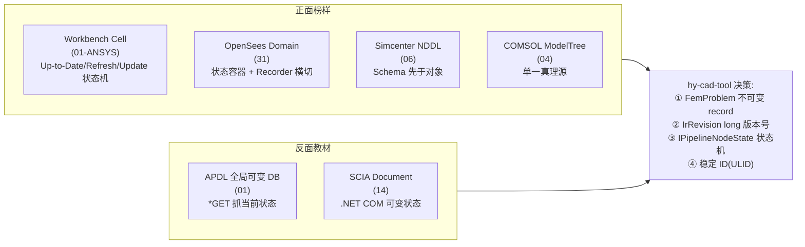

| 子决策 | 对标 | 反对标 | 落地接口 |
|--------|------|--------|----------|
| IR 不可变 | OpenSees Domain 快照、Simcenter `FemProblem(Procedure, Cases, Model)`(06) | APDL `*GET` 抓当前可变 DB(01) | `FemProblem` record(02 已有) |
| Pipeline 状态 | Workbench Cell 五态(01) | (无明显反例) | **`IPipelineNodeState`** — 新增 |
| 实体 ID | Simcenter 特征稳定 ID + Stale 三态(06) | (无反例) | ULID + `provenance` |
| Schema | Simcenter NDDL(06)、SCIA EsaXML(14) | (无反例) | `hyob` schema |

**对 docs/02 的补丁**:

```csharp
public enum PipelineNodeStatus
{
    Idle,           // 从未运行
    Stale,          // 上游有变化,需 Refresh
    Updating,       // 正在重算
    UpToDate,       // 一致,可用结果
    Errored         // 求解失败
}

public interface IPipelineNodeState
{
    PipelineNodeStatus Status { get; }
    long UpstreamHash { get; }
    DateTimeOffset LastUpdateTime { get; }
    string? ErrorMessage { get; }
    Task TransitionAsync(PipelineNodeStatus next, CancellationToken ct);
}
```

> 几何变了 → FEM 标记过期 → 用户看到醒目的"Refresh Required" → 强制重算才能看新结果。这是 Workbench 30 年沉淀的"防 FEM 误算"机制,**SAP2000/ETABS 至今因为没有它而出过名工程事故**。

### 2.3 决策 ③:求解后端——可插拔抽象 + 子进程外接 + Fitness 自陈

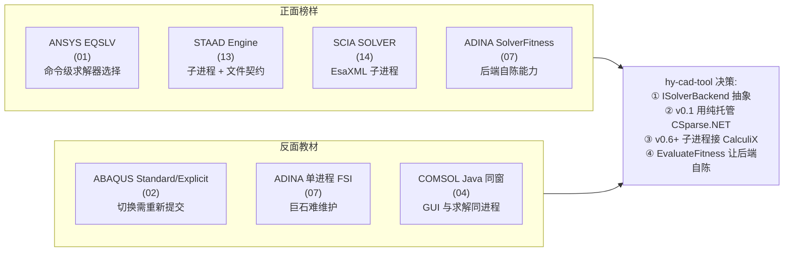

| 子决策 | 对标 | 反对标 | 落地接口 |
|--------|------|--------|----------|
| 后端抽象 | EQSLV(01)、SolverFitness(07) | 紧耦合单体 | `ISolverBackend`(02 已有) |
| 进程边界 | STAAD Engine(13)、SCIA SOLVER(14) | ABAQUS/ADINA 同进程(02/07) | 子进程 + deck 文件契约 |
| 能力自陈 | ADINA `EvaluateFitness(AssembledSystem)`(07) | EQSLV 用户选(01) | **`ISolverBackend.EvaluateFitness`** — 新增 |
| 后端多样性 | Altair Solver Profile(05)、Femap 30+ solver(06) | 单一私有内核 | **`ISolverBackendProfile`** — 新增 |

**对 docs/02 的补丁**:

```csharp
public interface ISolverBackend
{
    // ... (02 已有的 SolveLinearAsync / SolveEigenAsync)
    SolverFitnessScore EvaluateFitness(AssembledSystem system, AnalysisIntent intent);
}

public sealed record SolverFitnessScore(
    double Score,                 // 0..1, 越高越合适
    SolverCapabilities Caps,
    string Reason);               // 评估理由,日志可读

public interface ISolverBackendProfile
{
    string ProfileName { get; }   // "CSparse" / "CalculiX-Linear" / "CalculiX-NL"
    SolverBackendId BackendId { get; }
    SolverOptions DefaultOptions { get; }
    Func<FemProblem, AnalysisIntent, bool> Match { get; }
}
```

> ADINA `EvaluateFitness` 是 17 份调研里**最优雅的求解器路由设计**——不让用户选,而是让每个后端**对系统打分**,Pipeline 取最高分。这比 ANSYS `EQSLV` 让用户选好得多。

### 2.4 决策 ④:领域→FEM 翻译——多 Translator + 选择集 + Card Image

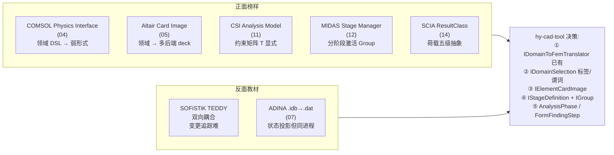

| 子决策 | 对标 | 反对标 | 落地接口 |
|--------|------|--------|----------|
| 多 Translator | 02 已有(刚体 / 梁 / 平面应变 3 个 RetainingWall translator) | 单一硬编码翻译 | `IDomainToFemTranslator<T>` |
| 选择集 | COMSOL Named Selection(04) | 裸 Entity ID 引用 | **`IDomainSelection`** — 新增 |
| Card 映射 | Altair Card Image(05) | deck 字符串拼接 | **`IElementCardImage`** — 新增 |
| 施工阶段 | MIDAS Stage + Group(12)、YJK 协同迭代(42) | 单步求解 | **`IStageDefinition` + `IGroup`** — 新增 |
| 找形/初始态 | 3D3S Form-finding + Construction-stage(43) | 单一静力流 | **`AnalysisPhase` 枚举** — 新增 |
| 约束变换 | CSI 约束矩阵 T(11)、ETABS Diaphragm | 罚函数硬编码 | **`IConstraintTransform`** — 新增 |
| 荷载抽象 | SCIA ResultClass 荷载五级(14) | 平铺 LoadAction | **`ResultClass`(组合层)** — 新增 |

**对 docs/02 的补丁**:

```csharp
public interface IDomainSelection
{
    string Name { get; }
    SelectionKind Kind { get; }   // Tag / Predicate / Boolean
    IEnumerable<int> Resolve(IMesh mesh);
}

public interface IElementCardImage
{
    ElementFormulationId FormulationId { get; }
    Result<string> RenderTo(SolverBackendId backend, FormulationOptions options);
}

public sealed record IStageDefinition(
    string Name,
    int Order,
    IReadOnlyList<string> ActivatedGroups,    // 激活的 Group 名
    IReadOnlyList<string> DeactivatedGroups,
    IReadOnlyList<LoadCase> LoadCases,
    TimeSpan? Duration,                       // 用于固结阶段
    Action<FemProblem>? StateTransform);

public enum AnalysisPhase
{
    Initial,            // 初始应力/找形态
    Construction,       // 施工阶段
    Service,            // 使用阶段
    Ultimate,           // 极限承载力
    Seismic             // 地震工况
}
```

---

## 三、从 17 份调研提炼的 7 大架构补丁

docs/02 已经搭好了五层架构 + IR + 三个 RetainingWall translator,但是基于 17 份子调研,**还有 7 处必须显式补充**,否则未来三个领域(水池/桩/边坡)接入时会被迫翻案重写。

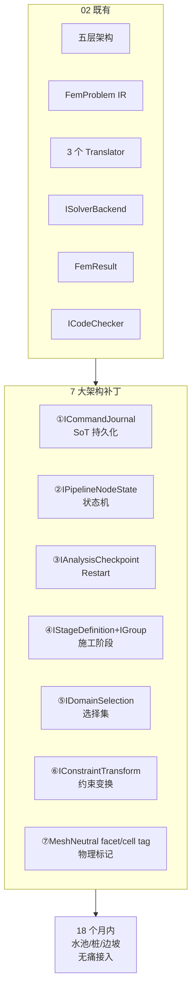

### 3.1 补丁① — `ICommandJournal`(对标 APDL `.log`,SoT)

| 来源 | 摘要 |
|------|------|
| 01-ANSYS | `.log` 是唯一权威操作历史,回放即恢复 |
| 06-Simcenter | 命令历史 + Schema 字典是远期审计基石 |
| 02-ABAQUS | `.inp` + `.msg` + `.sta` 文本诊断与求解日志同源 |

**为什么必须新增**:hy-cad-tool 已有 Command Bus 概念(02 隐含),但**没有持久化**。一旦命令在内存里发出但忘记落盘,用户的"昨天我改了什么"就无法回放——这是 ANSYS 50 年来唯一没踩过的坑,我们要直接吸收。

### 3.2 补丁② — `IPipelineNodeState`(对标 Workbench Cell)

| 来源 | 摘要 |
|------|------|
| 01-ANSYS Workbench | 5 态 Cell 状态机是"防 FEM 误算"的护城河 |
| 06-Simcenter | NX CAE 特征稳定 ID + Stale 三态 |
| 02-ABAQUS | Step/Increment/Iteration 三级状态机 |

**为什么必须新增**:02 文档中 Pipeline 是"过程式"——一条流水线跑完。但实际工程中**几何变了 FEM 不知道**,只能用户手动重跑。Workbench 的 Cell 状态机解决了这个问题。**没有这个机制,水池 v0.5 一接入就会大量出错**。

### 3.3 补丁③ — `IAnalysisCheckpoint`(对标 LS-DYNA Restart)

| 来源 | 摘要 |
|------|------|
| 01-ANSYS LS-DYNA | `d3dump` Small/Full Restart |
| 02-ABAQUS | Step 链接 + `*RESTART` 关键字 |
| 12-MIDAS | Stage Manager 必须能"从某阶段重启" |
| 42-YJK | 协同迭代每轮需保留中间状态 |

**为什么必须新增**:道路工程的**施工阶段分析**本质就是"分阶段 Restart"。每阶段加层填筑后从上阶段的位移/应力状态继续算。没有 Checkpoint,**路基填筑分阶段沉降算不了**——这是 hy-cad-tool 在路基方向的核心业务。

```csharp
public interface IAnalysisCheckpoint
{
    string CheckpointId { get; }
    long FemProblemRevision { get; }
    string StageName { get; }
    Task<FemProblemState> SaveAsync(FemProblem problem, FemResult result, CancellationToken ct);
    Task<FemProblemState> LoadAsync(string checkpointId, CancellationToken ct);
}

public sealed record FemProblemState(
    FemProblem Problem,
    IReadOnlyDictionary<string, INodalField> ContinuationFields,    // 上一阶段位移/应力
    DateTimeOffset SavedAt);
```

### 3.4 补丁④ — `IStageDefinition` + `IGroup`(对标 MIDAS Stage Manager)

| 来源 | 摘要 |
|------|------|
| 12-MIDAS | Stage Manager + Group 是施工阶段分析的事实标准 |
| 42-YJK | 上部-基础-地基耦合用外层迭代 |
| 43-3D3S | Form-finding / Construction-stage 独立 Stage |
| 02-ABAQUS | Step 链式时间历史化分析过程 |

**为什么必须新增**:道路工程不是单步问题。**填筑、固结、降水、超载预压**是天然的 stage 序列。MIDAS 用了 30 年证明这套抽象有效,**3D3S 用它解决了找形,YJK 用它做了上部—基础耦合迭代**。hy-cad-tool 不重复发明轮子。

### 3.5 补丁⑤ — `IDomainSelection`(对标 COMSOL Named Selection)

| 来源 | 摘要 |
|------|------|
| 04-COMSOL | Named Selection 绑定材料/荷载而非裸几何 ID |
| 33-数值库 | facet/cell 标签驱动 BC 与物理域 |
| 31-OpenSees | NodeSet/ElementSet 是模型组装的基本单位 |

**为什么必须新增**:02 已经有 `NodeSet` / `CellSet`(IR 内部),但**翻译时无法表达"所有挨着土的边",或"所有挡土墙立壁背面"这种语义化选择**。COMSOL 解决得最优雅——选择集本身是一等公民,可以做 `union / intersect / difference` 布尔运算。

### 3.6 补丁⑥ — `IConstraintTransform`(对标 CSI 约束矩阵 T)

| 来源 | 摘要 |
|------|------|
| 11-CSI | 约束矩阵 \(\mathbf{T}\) 显式构造,Diaphragm/Constraint/Body 都走它 |
| 33-数值库 deal.II | `AffineConstraints` 统一 Dirichlet/周期/Master-Slave |
| 02-ABAQUS | `*MPC` / `*EQUATION` 多点约束 |

**为什么必须新增**:hy-cad-tool 涉及挡土墙—基础—底板的多体约束、桩—承台的位移协调、桥涵的剪力键传力——**没有统一的约束抽象,每个领域都要重写一套**。CSI 把这层做成约束矩阵 \(\mathbf{T}\) ,所有上层只见到"自由度等价类"。

### 3.7 补丁⑦ — `MeshNeutral` 带 facet/cell tag(对标 deal.II/MFEM/Elmer)

| 来源 | 摘要 |
|------|------|
| 33-数值库 (deal.II/MFEM) | facet/cell 标签驱动 BC、材料、物理域 |
| 32-Elmer | Body 标签 + Boundary 标签 = 材料/边界绑定主键 |
| 05-Altair HyperMesh | Component / Property 都是基于标签的 |

**为什么必须新增**:02 文档中 `IMesh` 只有 `NodeSet` / `CellSet`(字符串名)。但**没有把 face/edge/vertex 也归一化为可标签的实体**。一旦走到 2D/3D 实体 + 表面荷载/接触,就必须能"标记某个面为水位线之上"——这是 facet tag。**没有这层,水池 v0.5 池壁内表面水压力无法施加**。

```csharp
public interface IMesh
{
    // 02 已有部分省略
    IReadOnlyDictionary<string, FaceSet> FaceSets { get; }    // 新增
    IReadOnlyDictionary<string, EdgeSet> EdgeSets { get; }    // 新增
}

public sealed record FaceSet(string Name, ReadOnlyMemory<FaceRef> Faces);
public sealed record FaceRef(int CellId, int LocalFaceId);    // 单元 ID + 该面在单元内的局部编号
```

---

## 四、必须放弃的 8 件事 vs 必须坚持的 10 件事

> ⚠️ **重要修正(2026-05-15)**:本节第 4.1.1 条("自研通用 3D 实体 FEA")已被 [001-自研通用FEA的第一性原则重审-30年积累vs150年开源-2026-05-15.md](./001-自研通用FEA的第一性原则重审-30年积累vs150年开源-2026-05-15.md) **从第一性原则重审并修正**——原条款一刀切判断"5+ 人年做不过 30 年积累",未区分"0 起步重写"与"基于开源装配"。**修正后结论**:不"从 0 重写"通用 FEA(仍然不做,正确);**但应基于人类 440 年累积开源 FEA 资产做"现代化中国化主控发行版"**(这是一项必须新增的"必须坚持的第 11 件事")。详见 001 文档。

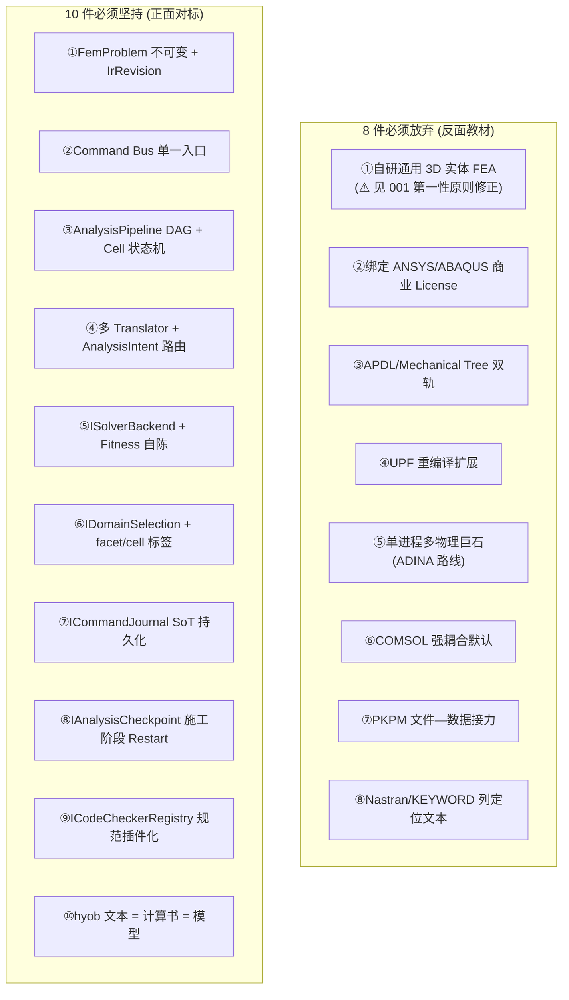

### 4.1 必须放弃的 8 件事——理由与反对标

| # | 放弃项 | 反对标来源 | 一句话理由 |
|---|--------|-----------|-----------|
| 1 | ~~自研通用 3D 实体 FEA 求解器~~ → **不"从 0 重写"通用 3D FEA**(见 [001 第一性原则修正](./001-自研通用FEA的第一性原则重审-30年积累vs150年开源-2026-05-15.md)) | 盲目复刻 ANSYS 30 年的边角 case 与航空/汽车特定单元 | **不要"0 起步重写";但应"基于 440 年开源资产装配中国化主控发行版"——见坚持第 11 件** |
| 2 | 绑定 ANSYS/ABAQUS 商业 License | 01-ANSYS 出口管制 | 不可控 + 不可二次发行 + 不可分发 |
| 3 | UI 与命令双轨架构 | 01-ANSYS APDL/Mechanical 漂移 | 必出"UI 改了命令不知"或反之 |
| 4 | UPF/UEL 重编译扩展 | 01-ANSYS userelem.F 需重链接 | 必须有 Fortran 编译器,客户端不可用 |
| 5 | 单进程多物理巨石 | 07-ADINA monolithic FSI | 长期维护与 GPU 化都难 |
| 6 | 强耦合多物理默认 | 04-COMSOL 任意耦合矩阵爆炸 | 内存与稳定性都吃不消 |
| 7 | 文件—数据接力架构 | 41-PKPM EXE 接力 | 数据割裂,变更追踪不可能 |
| 8 | 列定位/字段长度锁死的文本格式 | 01-LS-DYNA KEYWORD 80 列 / 03-Nastran Bulk 8 列 | 1970s 卡片打孔遗产,不应进入 2026 |

### 4.2 必须坚持的 10 件事——理由与正对标

| # | 坚持项 | 正对标来源 | 已落地? | 一句话理由 |
|---|--------|-----------|---------|-----------|
| 1 | `FemProblem` 不可变 record + `IrRevision` | 02 + 31-OpenSees Domain | ✓ | 任意时刻可重现,无并发问题 |
| 2 | Command Bus 单一入口 | 02 + 01-ANSYS `.log` | ✓ | 单一事实来源,可审计可回放 |
| 3 | `AnalysisPipeline` DAG + Cell 状态机 | 01-Workbench + 02 | 部分 | 几何变 → FEM 标记过期 |
| 4 | 多 Translator + `AnalysisIntent` 路由 | 02 + 05-Altair Card Image | ✓ | 同一领域多个 FEM 抽象层级 |
| 5 | `ISolverBackend` + Fitness 自陈 | 02 + 07-ADINA SolverFitness | 部分 | 后端自评而非用户选 |
| 6 | `IDomainSelection` + facet/cell 标签 | 04-COMSOL + 33-数值库 | 缺 | 选择集是一等公民 |
| 7 | `ICommandJournal` SoT 持久化 | 01-APDL `.log` | 缺 | 落盘的命令序列才是真相 |
| 8 | `IAnalysisCheckpoint` 施工阶段 Restart | 01-LS-DYNA d3dump + 12-MIDAS Stage | 缺 | 道路工程的核心需求 |
| 9 | `ICodeCheckerRegistry` 规范插件化 | 02 + 41/42/43 国产规范 | 部分 | GB/JTG 永远在变,核心不能依附 |
| 10 | hyob 文本 = 计算书 = 模型 | 02 + 13-STAAD/02-ABAQUS | 部分 | 三位一体可审计 |
| **11** | **基于 440 年开源 FEA 资产做现代化中国化主控发行版** | **MFEM/CalculiX/PETSc/MUMPS/Gmsh/ParaView 集成 + 中国规范 + 可微分接口** | **缺(本次新增)** | **5-7 年可成"国产 ANSYS 替代",见 001 文档第一性原则论证** |

> ⚠️ **新增第 11 条来源**:[001-自研通用FEA的第一性原则重审-30年积累vs150年开源-2026-05-15.md](./001-自研通用FEA的第一性原则重审-30年积累vs150年开源-2026-05-15.md)。该文档把"自研通用 FEA"拆解为 6 层技术资产 + 5 档自研策略,论证 hy-cad-tool 应走 **"档 1 主线:基于开源装配 + 中国化"** 路线,对标 Linux/Anaconda/Ubuntu 案例。

---

## 五、18 个月路线图——基于 17 份调研对 docs/02 的校准

docs/02 原路线是 **P0 挡土墙刚体(4w) → P1 1D 梁(6w) → P2 2D 平面应变(8w) → P3+ 水池/桩/边坡**。基于 17 份调研,**校准后**的 18 月路线如下:

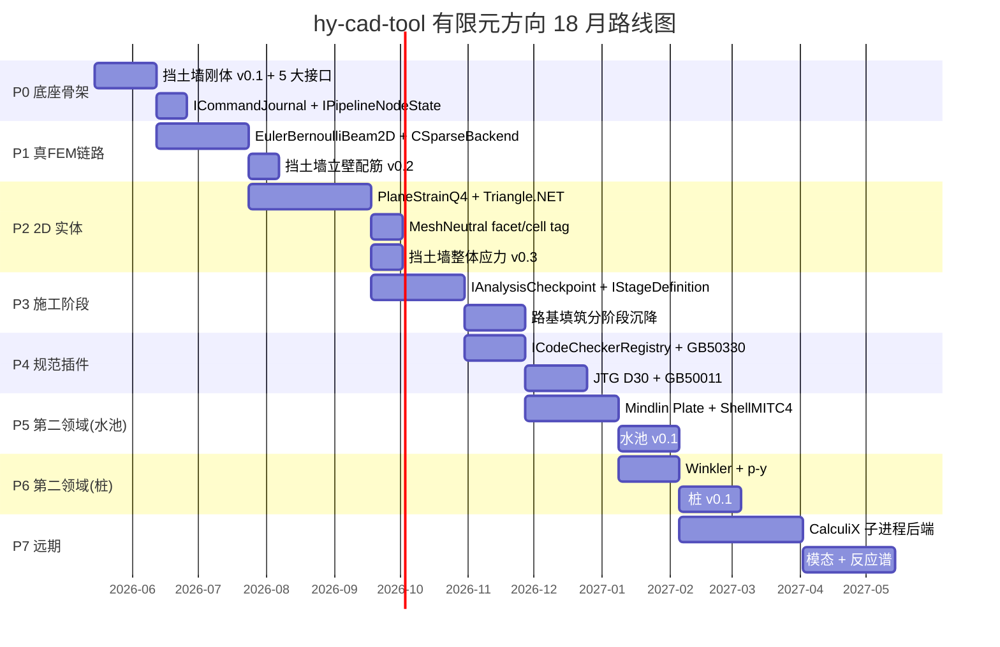

### 5.1 P0 阶段(4 周 + 2 周)——底座骨架

> docs/02 原 P0:挡土墙刚体 v0.1
> **校准后**:在 docs/02 P0 基础上,**强制完成 5 大接口的接口形状**,即使内部实现是 stub。

| 周 | 工作 | 对标补丁 | 验收 |
|----|------|----------|------|
| W1 | `FemProblem` IR + `IMesh` + DI 框架 | 02 既有 | 编译 + 单元测试通过 |
| W2 | `RetainingWall` 领域 + `RigidBodyEquilibriumTranslator` | 02 既有 | 单墙稳定性数值对 |
| W3 | **`ICommandJournal`** + **`IPipelineNodeState` 状态机** | 补丁①② | `commands.jsonl` 可回放 + Cell 5 态可视化 |
| W4 | `GB50330RetainingWallChecker` + UI 接入 | 02 既有 | **可交付的挡土墙稳定验算工具** |
| W5-6 | **`IDomainSelection`** + **`IAnalysisCheckpoint` 占位** | 补丁③⑤ | 接口形状定稿,允许内部 throw NotImplementedException |

### 5.2 P1 阶段(6 周 + 2 周)——真 FEM 链路

> docs/02 原 P1:1D 梁 v0.2
> **校准后**:加入 **`IElementCardImage`** 与 **求解器子进程边界占位**,确保 P6 接 CalculiX 时无需改 Translator。

| 周 | 工作 | 对标补丁 | 验收 |
|----|------|----------|------|
| W7-8 | `EulerBernoulliBeam2D` + `LinearElastic` + `CSparseBackend` | 02 既有 | 悬臂梁解析解对 |
| W9 | `IFemAssembler` + EdgeTraction | 02 既有 | 一维分布荷载验证 |
| W10 | `CantileverBeamTranslator` + 立壁配筋 | 02 既有 | **挡土墙立壁配筋** |
| W11 | **`IElementCardImage<EulerBernoulliBeam2D>`** | 补丁(2.4) | 单元可生成 CalculiX `.inp` 片段 |
| W12 | hyob 几何打通 + Command Bus 全链路 | 02 既有 | **完整可发布版本** |

### 5.3 P2 阶段(8 周 + 2 周)——2D 实体

> docs/02 原 P2:2D 平面应变 v0.3
> **校准后**:强化 **`MeshNeutral` facet/cell tag**,这是水池/桩/边坡共用的网格基础。

| 周 | 工作 | 对标补丁 | 验收 |
|----|------|----------|------|
| W13-14 | `PlaneStrainQ4` + Triangle.NET + facet/cell | 补丁⑦ | 矩形拉伸解析解对 |
| W15-16 | `PlaneStrainTranslator` + 多层土 + 自重激活 | 02 既有 | 应力云图 |
| W17 | **`IConstraintTransform`** + 土-墙界面 Tied | 补丁⑥ | 界面位移协调 |
| W18 | 远场 Roller + 后处理 | 02 既有 | **完整 2D 挡土墙分析** |
| W19-20 | 文档 + 回归测试 + 示例库 | — | **底座 v1.0 正式发布** |

### 5.4 P3 阶段(6 周 + 4 周)——施工阶段(道路核心需求)

> docs/02 暂未规划
> **本文档新增**:这是 hy-cad-tool 道路工程方向的**真实业务核心**——路基填筑、固结、降水、超载预压。

| 周 | 工作 | 对标补丁 | 验收 |
|----|------|----------|------|
| W21-22 | **`IAnalysisCheckpoint`** 实施 | 补丁③ | 任意阶段可保存/恢复 |
| W23-24 | **`IStageDefinition` + `IGroup`** 实施 | 补丁④ | Stage Manager UI |
| W25-26 | 路基分层填筑 Translator | 12-MIDAS Stage | 三层填筑沉降算对 |
| W27-30 | 固结+降水(Biot 耦合简化版) | 42-YJK 协同迭代 | **路基分阶段沉降工具** |

### 5.5 P4 阶段(4 周 + 4 周)——规范插件化

> docs/02 已规划 `ICodeChecker<T>`,本文档强化为**规范包注册表**

| 周 | 工作 | 对标补丁 | 验收 |
|----|------|----------|------|
| W31-32 | **`ICodeCheckerRegistry`** + GB50330 | 补丁(参考 RFEM 模块) | 挡土墙稳定 + 配筋按 GB50330 |
| W33-34 | JTG D30(公路路基)规范包 | — | 路基沉降按 JTG D30 |
| W35-36 | GB50011(抗震)规范包 | — | 挡土墙地震系数 Mononobe-Okabe |
| W37-38 | 规范包版本管理 + 多版本切换 | — | GB50330-2013 vs 2024 切换 |

### 5.6 P5+ 阶段——其他领域接入

| 模块 | 周数 | 复用率 | 新增工作 |
|------|------|--------|----------|
| **水池**(P5) | 6-8 周 | 70%(底座 + Stage + 规范) | Mindlin Plate + ShellMITC4 + Housner + GB50069 |
| **桩**(P6) | 4-6 周 | 80%(底座 + Stage) | Winkler 弹性地基 + p-y 曲线 |
| **边坡**(P7) | 6-8 周 | 75%(底座 + Stage + facet/cell) | 强度折减法 + 圆弧搜索 |
| **简支梁桥**(P8) | 8-10 周 | 70% | 移动荷载 + 影响线 + 预应力 |
| **CalculiX 后端**(P9) | 8 周 | — | 子进程 + `.inp` 翻译 + `.frd` 解析 |
| **模态 + 反应谱**(P10) | 6 周 | — | Block Lanczos 调用 + 振型组合 |

> **关键观察**:底座(P0~P4)的总投入约 8 个月,但**每个后续领域只需 1-2 个月**——这就是"通用底座 + 领域插件"的边际成本曲线优势。

---

## 六、四大核心抽象的全软件对标映射表

把 17 份子调研每个软件的"等价物"对齐到 hy-cad-tool 四大抽象上。**这是本文档最具操作性的部分**——任何后续编码遇到不确定的接口设计,都应该回查这张表。

### 6.1 `FemProblem` IR(数据中心)

| 软件 | 对标物 | 关键特征 | hy-cad-tool 吸收点 |
|------|--------|----------|-------------------|
| 01-ANSYS | APDL DB(可变) | 全局内存数据库 | ❌ 反向(不可变 record) |
| 02-ABAQUS | `.inp` deck | 文本可审计、Step 链 | ✓ Step 链思想 |
| 03-MSC Nastran | Bulk Data + Case Control | Procedure/Cases/Model 三段 | ✓ **三段拆分** |
| 04-COMSOL | Model Tree | Named Selection + Physics Interface | ✓ Selection 思想 |
| 05-Altair | HyperWorks 通用模型 | Card Image 中性映射 | ✓ Card Image |
| 06-Simcenter | NDDL Schema | 数据字典先于对象 | ✓ Schema-first |
| 07-ADINA | `.idb` 状态库 | 同拓扑多公式 | ✓ 公式分离 |
| 11-CSI | Analysis Model | 约束矩阵 T | ✓ ConstraintTransform |
| 12-MIDAS | 项目库 + Group | Stage + Group | ✓ **IStageDefinition + IGroup** |
| 13-STAAD | `.std` 单文件 | 文本即模型 | ✓ hyob 已对齐 |
| 14-SCIA | Document + EsaXML | ResultClass 荷载五级 | ✓ ResultClass |
| 31-OpenSees | Domain | 状态容器 + Tag | ✓ 已对齐(02) |
| 32-Elmer | sif | 声明式规格 | ✓ hyob 风格 |
| 33-数值库 | Triangulation + DofHandler | facet/cell tag | ✓ **MeshNeutral 补丁** |
| 41-PKPM | 项目文件接力 | 双核 SATWE/PMSAP | ❌ 反向(IR 单一) |
| 42-YJK | SSOT SQLite | 协同迭代 | ✓ 单一数据中心 |
| 43-3D3S | 多模型并存 | provenance 字段 | ✓ provenance |

### 6.2 `ISolverBackend`(求解后端)

| 软件 | 对标物 | 关键特征 | hy-cad-tool 吸收点 |
|------|--------|----------|-------------------|
| 01-ANSYS | EQSLV 命令(SPARSE/PCG/AMG) | 求解器命令级选 | ✓ Capability 枚举 |
| 02-ABAQUS | Standard / Explicit / CFD 分 exe | 不同物理不同 exe | ✓ 进程边界 |
| 03-MSC Nastran | SOL 编号 + DMAP | SOL 固化算法配方 | ✓ ProblemKind 枚举 |
| 04-COMSOL | Segregated / Fully Coupled | 求解策略显式 | ✓ Strategy 接口 |
| 05-Altair | Solver Profile | Profile 切换后端 | ✓ **ISolverBackendProfile** |
| 06-Simcenter | NX Nastran(嵌主) + Femap(写 30+ deck) | 写 deck + 调子进程 | ✓ 写 deck 模式 |
| 07-ADINA | SolverFitness | 后端自陈能力 | ✓ **EvaluateFitness** |
| 11-CSI | SAPFire | 稀疏直接 + 多 RHS | ✓ 多 RHS 优化 |
| 12-MIDAS | 一核四品共享 | 单核多品类 | — |
| 13-STAAD | Engine 子进程 + `.std` | 文件契约 + 子进程 | ✓ **子进程基础设施** |
| 14-SCIA | SOLVER + EsaXML | XML 契约 + 子进程 | ✓ XML 契约思路 |
| 31-OpenSees | LinearSOE + 7 件套 | 算法可插拔 | ✓ 算法分离 |
| 32-Elmer | ElmerSolver 分场模块 | 单场模块 + 块迭代 | ✓ 单场隔离 |
| 33-数值库 | PETSc/HYPRE 矩阵句柄 | 矩阵后端隔离 | ✓ 矩阵句柄抽象 |
| 41-PKPM | 双核 SATWE/PMSAP | 多核并联 | ✓ 多 backend 注册 |
| 42-YJK | YJK-FEM + 外迭代 | 外层迭代 | ✓ 外迭代占位 |

### 6.3 `AnalysisPipeline`(分析流水线)

| 软件 | 对标物 | 关键特征 | hy-cad-tool 吸收点 |
|------|--------|----------|-------------------|
| 01-ANSYS Workbench | Project Schematic | Cell DAG + 5 态状态机 | ✓ **IPipelineNodeState** |
| 02-ABAQUS | Step → Increment → Iteration | 三级状态机 + cutback | ✓ cutback 思想 |
| 03-MSC Nastran | DMAP/ALTER | 矩阵流水线 + 拦截点 | ✓ 命名锚点 |
| 04-COMSOL | Study(多算例) | 一个模型多个 Study 并列 | ✓ Study 思路 |
| 05-Altair | Starter / Engine | 显式预处理与时间推进分段 | ✓ Stage 思想 |
| 06-Simcenter | Parts-Based | 部件 + 操作 DAG | ✓ DAG |
| 07-ADINA | ITimeIntegrator | 积分器插件 | ✓ Integrator 占位 |
| 11-CSI | Case DAG + Stage | 工况依赖图 | ✓ Case DAG |
| 12-MIDAS | Stage Manager | 阶段序列 | ✓ **IStageDefinition** |
| 13-STAAD | LOAD CASE / PERFORM | 文本工况描述 | — |
| 14-SCIA | TDA Stage | 阶段分析 | ✓ Stage |
| 31-OpenSees | Analysis 七件套 | 约束/编号/模型/积分器/SOE/算法/收敛 | ✓ **七件套语义** |
| 32-Elmer | 多场外迭代 | 松/紧耦合开关 | ✓ Coupling 占位 |
| 33-数值库 | MFEM Algorithm 类 | 算法对象化 | ✓ |
| 41-PKPM | 双核接力 | 多内核流水线 | ✓ Pipeline 多 backend |
| 42-YJK | 协同迭代 | 上部-基础外层循环 | ✓ 外迭代 |
| 43-3D3S | Form-finding/Construction | 多 Phase 独立流 | ✓ **AnalysisPhase** |

### 6.4 `IDomainToFemTranslator<TDomain>`(翻译器)

| 软件 | 对标物 | 关键特征 | hy-cad-tool 吸收点 |
|------|--------|----------|-------------------|
| 01-ANSYS | Mechanical Tree → `.dat` | 翻译 + Snippet 注入 | ❌ 反向(不允许 Snippet) |
| 02-ABAQUS | CAE ASI Python | Python 编排 + Fortran 核 | ✓ 编排/求解分离 |
| 04-COMSOL | Physics Interface | 领域 DSL → 弱形式 | ✓ **IPhysicsInterface** |
| 05-Altair | Card Image + 模板 | 领域 → 中性 → 多后端 deck | ✓ **IElementCardImage** |
| 06-Simcenter | Idealization | CAD 简化前置层 | ✓ 简化层 |
| 11-CSI | Frame/Shell/Joint | 行业对象 → FEM | ✓ TDomain 模板 |
| 12-MIDAS | 行业模块 | Wizard | ✓ Wizard 思路 |
| 31-OpenSees | 直接写脚本 | 无 Translator | ❌ 反向 |
| 32-Elmer | Body-Equation-Solver 绑定 | Solver 模块按方程加载 | ✓ 绑定式 |
| 33-数值库 | Triangulation→DofHandler | facet/cell 标签传 | ✓ |
| 41-PKPM | 双核翻译 | 单 IR 多核 | ✓ |
| 43-3D3S | Form-finding 独立 Translator | Phase 独立 | ✓ AnalysisPhase |

---

## 七、与 hy-cad-tool 既有架构的衔接

FEM 底座不是孤岛。hy-cad-tool 已经有 `hyob` 几何核、`Annotations` 优化引擎、`Settlement` 沉降、`Road` 道路、`Pile` 桩、`Reinforcement` 钢筋等模块。FEM 底座必须**与这些模块互为消费者与生产者**,否则就会重蹈 PKPM "文件接力"的覆辙。


### 7.1 上游衔接——FEM 是 hyob/Layers/Annotations 的消费者

| 既有模块 | FEM 消费方式 | 接口 |
|----------|--------------|------|
| `hyob` 几何核 | 挡土墙截面、水池池壁、桩位的几何全部从 hyob 读取 | `IGeometryProvider`(已有,FEM 只读) |
| 图层系统 | 图层名 = 物理域标签(如 `Soil_Backfill` `Concrete_Wall`) | `IDomainSelection` 标签源 |
| Annotations 优化 | 几何 + 注释中的约束(如尺寸链)作为 FEM 边界与荷载 | 通过 Annotations 优化引擎反向输入 |
| Settlement 沉降 | 旧 Settlement 模块的输入参数(土层、墙高)直接转 FEM 领域 | 共享 `SoilProfile` 类 |

### 7.2 下游衔接——FEM 喂给 Settlement/Reinforcement/Annotations

| 既有模块 | 接收什么 | 接口 |
|----------|----------|------|
| `Settlement` 沉降 | FEM 计算的位移场 → 沉降量 | `INodalField<displacement>` |
| `Reinforcement` 钢筋 | FEM 计算的弯矩剪力 → 配筋面积 | `IElementField<moment>` |
| 计算书报告 | `CodeCheckReport` → 计算书 LaTeX | `IPostProcessor<TDomain, TReport>` |
| BIM 出图 | 配筋后的钢筋几何 → DWG / IFC | 复用 `Reinforcement.Services` |
| Annotations 优化 | FEM 结果作为优化目标函数 | `FemResult` → `IOptimizationObjective` |

### 7.3 推荐目录结构(在 02 基础上微调)

```
src/HyCADTool/
├── Shared/
│   └── Numerics/                            # 稀疏矩阵/线性代数
└── Features/
    └── Fem/                                 # 新增,与既有 Pile/Settlement/Reinforcement 平级
        ├── Core/                            # 底座,永远不绑定具体领域
        │   ├── Ir/                          # FemProblem 及其子类型
        │   ├── Mesh/                        # IMesh + facet/cell tag(本文档补丁⑦)
        │   ├── Formulations/                # 单元公式插件
        │   ├── Materials/                   # 材料插件
        │   ├── Loads/                       # 荷载 + ResultClass(本文档 2.4)
        │   ├── Boundary/                    # 边界 + IConstraintTransform(补丁⑥)
        │   ├── Selection/                   # IDomainSelection(补丁⑤)
        │   ├── Assembly/                    # IFemAssembler
        │   ├── Solvers/                     # ISolverBackend + Profile(2.3)
        │   ├── Results/                     # FemResult / NodalField / ElementField
        │   ├── Pipeline/                    # AnalysisPipeline + IPipelineNodeState(补丁②)
        │   ├── Stages/                      # IStageDefinition + IGroup(补丁④)
        │   ├── Checkpoints/                 # IAnalysisCheckpoint(补丁③)
        │   ├── Journal/                     # ICommandJournal(补丁①)
        │   └── Checking/                    # ICodeCheckerRegistry
        ├── RetainingWall/                   # 第一个领域(P0~P2)
        ├── WaterTank/                       # 第二个领域(P5)
        ├── Pile/                            # 第三个领域(P6)
        └── Slope/                           # 第四个领域(P7)
```

---

## 八、立即可执行的 10 项 P0 动作

> 这 10 件事在未来 4 周内可完成,不需要等任何外部依赖,**做完即可启动 P0 挡土墙 v0.1 编码**。

| # | 动作 | 来源补丁 | 工作量 | 输出 | 验收标准 |
|---|------|---------|--------|------|----------|
| **1** | 在 `Features/Fem/Core/Journal/` 创建 `ICommandJournal` + `JournalEntry` | 补丁① | 0.5 天 | 接口代码 | 编译通过 + 单元测试 stub |
| **2** | 在 `Features/Fem/Core/Pipeline/` 创建 `IPipelineNodeState` + 5 态枚举 | 补丁② | 1 天 | 接口代码 | 状态机迁移图 + 单元测试 |
| **3** | 在 `Features/Fem/Core/Checkpoints/` 创建 `IAnalysisCheckpoint` + `FemProblemState` | 补丁③ | 1 天 | 接口代码 + stub | 序列化/反序列化 round-trip 测试 |
| **4** | 在 `Features/Fem/Core/Stages/` 创建 `IStageDefinition` + `IGroup` | 补丁④ | 1 天 | 接口代码 | 三阶段填筑测试用例 |
| **5** | 在 `Features/Fem/Core/Selection/` 创建 `IDomainSelection` + 3 种 Kind | 补丁⑤ | 1 天 | 接口代码 | 布尔运算(union/intersect)单元测试 |
| **6** | 在 `Features/Fem/Core/Boundary/` 创建 `IConstraintTransform` | 补丁⑥ | 1 天 | 接口代码 + LinearMPC stub | 两个节点等价约束测试 |
| **7** | 在 `Features/Fem/Core/Mesh/` 扩展 `IMesh` 加 `FaceSet` / `EdgeSet` | 补丁⑦ | 0.5 天 | 接口扩展 | 一个 Quad4 网格能标记 4 条边 |
| **8** | 在 `Features/Fem/Core/Solvers/` 给 `ISolverBackend` 加 `EvaluateFitness` | 决策③ | 0.5 天 | 接口扩展 | `CSparseBackend.EvaluateFitness` 实现 |
| **9** | 在 `Features/Fem/Core/Loads/` 加 `AnalysisPhase` 枚举 + `LoadCase.Phase` | 决策④ | 0.5 天 | 枚举 + 字段 | 5 种 Phase 单元测试 |
| **10** | 在 `docs/FiniteElement/` 创建 `02-决策清单.md`,把本文档第二节决策树落表 | — | 1 天 | 表格文档 | 每条决策有"对标 + 反对标 + 接口"3 列 |

**P0 接口先行总工作量:7 天**——少于 docs/02 原 P0 的 4 周。这 7 天里**只写接口形状,不写实现**。等 W4 挡土墙刚体 v0.1 完成后,这些接口已经在那里等着——这正是 docs/02 文档 9.3 节 "v0.1 不写真有限元,但对外仍走 Pipeline" 的精神延伸。


---

## 九、风险与决策追溯

### 9.1 17 份调研中识别出的高频陷阱

| 陷阱 | 出现于 | hy-cad-tool 对策 |
|------|--------|------------------|
| **UI/命令双轨漂移** | 01-ANSYS、04-COMSOL、07-ADINA | Command Bus 单一入口 |
| **求解器嵌主进程崩溃** | 04-COMSOL、07-ADINA | 求解走子进程 |
| **扩展需重编译内核** | 01-ANSYS UPF、01-LS-DYNA UMAT | .NET DI + DLL 插件 |
| **几何变 FEM 不知** | 11-CSI、41-PKPM | `IPipelineNodeState` 状态机 |
| **文件接力数据割裂** | 41-PKPM、03-MSC Nastran 多 deck | `FemProblem` 单一 IR |
| **行业对象与单元强耦合** | 11-CSI Frame=Beam | `CellTopology ≠ Formulation` |
| **规范焊死求解核** | 41-PKPM、42-YJK | `ICodeCheckerRegistry` |
| **API 封闭** | 41-PKPM、43-3D3S | 全 .NET 开放 API + hyob 文本 |
| **私有二进制结果** | 01-ANSYS `.rst`、05-Altair `.h3d` | HDF5 + 公开 schema |
| **多物理强耦合默认** | 04-COMSOL、07-ADINA | 松耦合优先,紧耦合按需 |

### 9.2 关键决策的"延迟时点"

| 决策 | 现在不做 | 何时再决定 |
|------|----------|-----------|
| 是否对接 ABAQUS Python API | v3.x 之后 | 看商业 License 政策 |
| 是否自研显式求解器 | v4.x | 是否进入冲击爆炸领域 |
| 是否做参数化扫掠(Design Points) | v2.x | 用户是否要求 DOE/优化 |
| 是否做模态 + 反应谱 | v1.5 | 是否进入抗震评估 |
| 是否引入 GPU | v3.x | DOF 规模是否突破 1M |

> **关键洞察**:基于 17 份调研可知,**FEM 软件最大的死亡原因不是"功能不够",而是"早期决策错误且不可逆"**。本文档列出的所有"放弃"和"坚持",都是为了**让 v0.1 的接口形状在 5 年后仍然正确**。

---

## 十、本文档与既有 docs/ 体系的关系

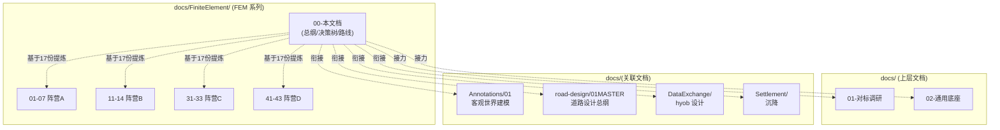

| 文档 | 与本 00 文档的关系 |
|------|-------------------|
| `docs/01-对标调研` | 9 维度横向矩阵,本 00 是其"纵向决策化" |
| `docs/02-通用底座` | 五层架构与挡土墙路线,本 00 提供 7 大补丁 |
| `docs/FiniteElement/01-07` | 阵营 A 通用 FEA 子调研,本 00 提取其架构模式 |
| `docs/FiniteElement/11-14` | 阵营 B 结构工程子调研,本 00 提取其行业心智 |
| `docs/FiniteElement/31-33` | 阵营 C 开源子调研,本 00 提取其插件骨架 |
| `docs/FiniteElement/41-43` | 阵营 D 国产子调研,本 00 提取其规范本地化 |
| `docs/Annotations/01` | 客观世界建模框架,本 00 的 FEM 是其物理层延展 |
| `docs/road-design/01MASTER` | 道路设计总纲,本 00 的 FEM 是道路工程沉降/挡墙计算的内核 |
| `docs/DataExchange/` | hyob 几何核,本 00 的 FEM 几何来源 |
| `docs/Settlement/` | 沉降既有实现,本 00 的 FEM 升级方案 |

---

## 十一、一句话总结

> hy-cad-tool 的有限元方向,**外形抄 CSI/MIDAS/YJK 让中国工程师用得惯,内核抄 OpenSees/deal.II/Elmer 让架构可活十年,后端抄 STAAD/CalculiX/SCIA 让性能不靠自研,规范抄 PKPM/JTG 让交付物合规——但绝不抄 ANSYS APDL 双轨、PKPM 文件接力、ABAQUS 商业绑定、Nastran 列定位文本这四件事**。

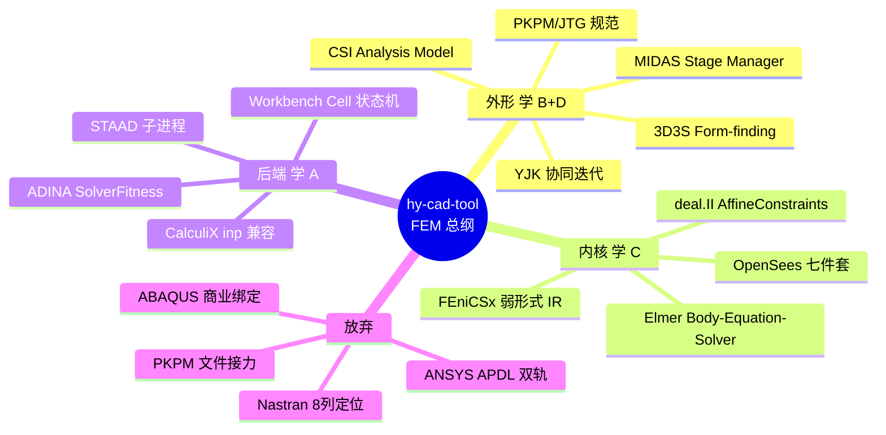

---

## 十二、修订记录

| 日期 | 修订人 | 说明 |
|------|--------|------|
| 2026-05-15 | — | 初版:基于 17 份子调研 + docs/01 对标调研 + docs/02 通用底座,提炼 hy-cad-tool 有限元方向的 4 大架构决策、7 大架构补丁、8 件放弃 + 10 件坚持、18 月路线图、10 项 P0 立即动作 |
| 2026-05-15 | — | **第一性原则修正**:第 4.1 节第 1 条("自研通用 3D FEA")由"放弃"修正为"不'从 0 重写',但应基于 440 年开源资产做主控发行版";第 4.2 节新增第 11 条"基于开源资产做中国化主控发行版";详见 [001-自研通用FEA的第一性原则重审-30年积累vs150年开源-2026-05-15.md](./001-自研通用FEA的第一性原则重审-30年积累vs150年开源-2026-05-15.md) |

---

## 附录 A:17 份调研的"一句话精华"速查

| 调研号 | 软件 | 一句话精华 | 一句话教训 |
|--------|------|-----------|-----------|
| 01 | ANSYS Mechanical/Workbench/LS-DYNA | 命令解释器 + 内存 DB + Fortran 单体 + DAG 平台 | UI/命令双轨漂移 50 年没解决 |
| 02 | ABAQUS | Python 编排 + Fortran 计算 + Step 链 + ODB 四层 | Standard/Explicit 分两套独立内核 |
| 03 | MSC Nastran/Marc/Adams | Bulk Data + SOL + DMAP + Superelement + MNF 多桥 | 8 列定位 + 半图灵 DMAP 是负担 |
| 04 | COMSOL | 弱形式 IR + 单模型树 + Java API 总线 + Named Selection | 任意强耦合矩阵爆炸 |
| 05 | Altair OptiStruct/RADIOSS/HyperWorks | Solver Profile + Card Image + 模板 + Starter/Engine | 数字 SOL 魔法常量是反模式 |
| 06 | Simcenter NX/Nastran/Femap/STAR | NDDL Schema + 特征稳定 ID + Co-Simulation Engine | 私有 .modfem/.sim 与 Git 不友好 |
| 07 | ADINA | 单进程多物理 + AUI 命令 + SolverFitness + Bathe 积分 | monolithic FSI 维护与 GPU 化都难 |
| 11 | CSI SAP2000/ETABS/CSiBridge | SAPFire + Analysis Model + 约束矩阵 T + Case DAG + FNA | 3D 实体能力弱 + UI 隐式假设 |
| 12 | MIDAS Gen/Civil/FX+/GTS | 一核四品 + Stage Manager + Group + TDM + Wizard | API 半封闭,自动化困难 |
| 13 | STAAD.Pro | .std 文本 + Engine 子进程 + 多档求解器 | UI 与文本双轨,结果私有 |
| 14 | SCIA Engineer | .NET Document + SOLVER 子进程 + ResultClass + EsaXML | COM 可变状态可类比 ANSYS DB |
| 31 | OpenSees | Domain + Analysis 七件套 + Recorder + Tcl/Python | 无强类型 GUI,非法组合静默失败 |
| 32 | Elmer | sif 声明式 + Body-Equation-Solver + 块迭代 + MATC | GUI 与求解核成熟度不同步 |
| 33 | FEniCSx/deal.II/MFEM/FreeFEM | 弱形式 IR + facet/cell tag + 装配策略显式 | 无原生 CAD,标记缺失就断层 |
| 41 | PKPM SATWE/PMSAP | 双核并联 + 国标规范 + 施工图自动 | 历史包袱 + 文件传递 + API 封闭 |
| 42 | 盈建科 YJK | 统一 FEM + SSOT SQLite + 协同迭代 + Global-Local | 强绑定规范 + 非 UEL 可扩展 |
| 43 | 3D3S | Form-finding + Construction-stage + 多模型并存 | 强绑定 AutoCAD + API 弱 |
