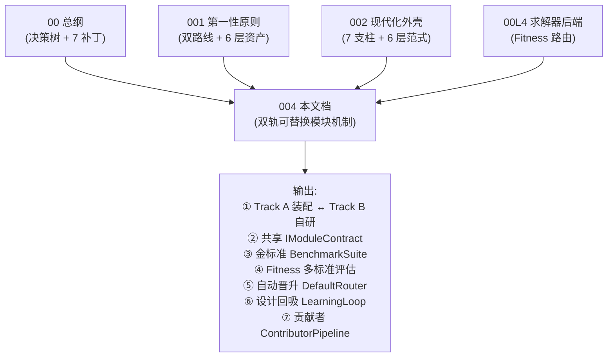
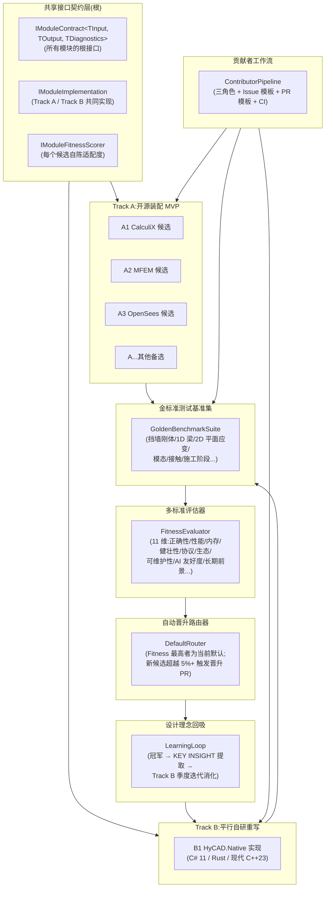
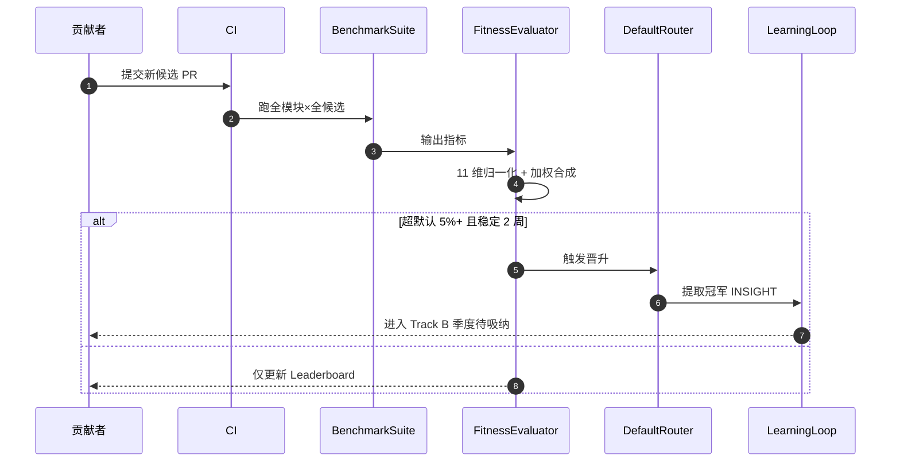
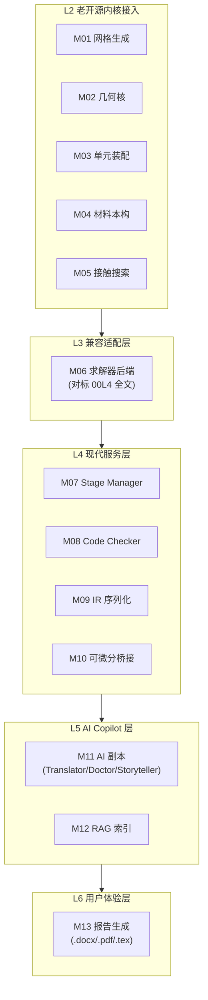
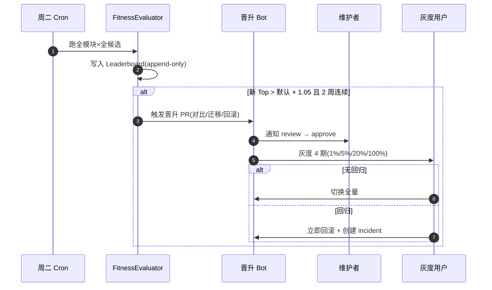
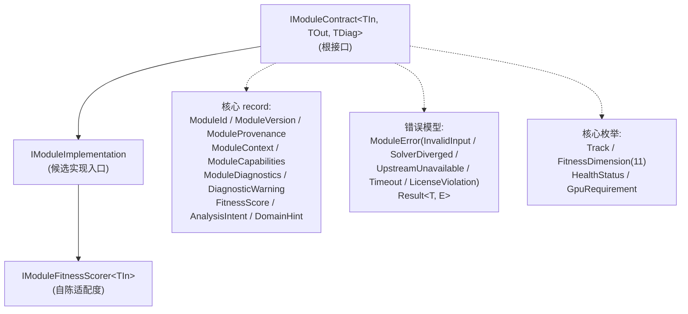

## 文档定位

> 文档日期:2026-05-17
> 上承:
> - [00-hy-cad-tool有限元方向总纲-基于17份调研的决策树与路线图-2026-05-15](./00-hy-cad-tool有限元方向总纲-基于17份调研的决策树与路线图-2026-05-15.md)(第 2.3 节 `ISolverBackend` + 第 4.2 节坚持第 11 条)
> - [001-自研通用FEA的第一性原则重审-30年积累vs150年开源-2026-05-15](./001-自研通用FEA的第一性原则重审-30年积累vs150年开源-2026-05-15.md)(第六章 5 档策略矩阵 + **第八章 18 月双路线**)
> - [002-现代架构与AI整合1991到2008开源FEA-放大优势规避短板-2026-05-15](./002-现代架构与AI整合1991到2008开源FEA-放大优势规避短板-2026-05-15.md)(第三章 7 大支柱 + 第五章 6 层整合范式)
> - [00L4-求解器后端层全景-MUMPS-PARDISO-HYPRE-PETSc-Eigen全开源到天花板-2026-05-15](../Learning/00L4-求解器后端层全景-MUMPS-PARDISO-HYPRE-PETSc-Eigen全开源到天花板-2026-05-15.md)(第 4.2 节 `EvaluateFitness` 路由)
>
> 性质:把 **001 第八章"自研路线 + 开源接入并行路线"** + **002 第五章"老内核 + 现代外壳 + AI 增强"6 层范式** + **00L4 第 4.2 节 `EvaluateFitness` 路由器** 三件事**收敛为一套贯穿所有模块、所有贡献者、所有时间尺度的可落地工程机制**——即"双轨可替换模块机制"。

00/001/002/00L4 已经完成"为什么做、做什么、做哪些层"的判断,但**没有回答"怎么持续做下去"**——一旦模块数量从 5 个涨到 50 个、贡献者从 3 人涨到 30 人、备选项目从 10 个涨到 100 个,**没有机制就会塌陷**。本文档要给出的就是这套"塌不掉"的机制。



| 上承文档 | 已回答 | 本文档新增 |
|---------|-------|-----------|
| 00 总纲 | 5 层架构 + 7 大架构补丁 + 必须坚持/放弃清单 | **把"必须坚持"工程化为可替换模块** |
| 001 第一性原则 | 双路线判断 + 6 层资产 + 9 大开源宝藏 | **把"双路线"展开为 Track A/B 共享契约 + 互校验机制** |
| 002 现代化外壳 | 7 大支柱 + 5 类 AI 杠杆 + 6 层整合范式 | **把"6 层范式"垂直切成 10-15 个可替换模块** |
| 00L4 求解器后端 | `EvaluateFitness` 单层路由 | **把单层路由泛化为"全模块多标准评估自动晋升"** |

### 本文档对用户 8 条原始需求的覆盖映射

> 用户提出的 8 条需求是本文档的"原始驱动力",在此显式列出对应章节,确保**逐条可追溯、可验收**。

| # | 原始需求 | 覆盖章节 | 核心机制 |
|---|---------|---------|----------|
| 1 | 制作最小可运行 MVP,从 AI 认定的合理开源备选开始 | 第二章 + 第三章 + 第五章 | Track A 开源装配 + 模块清单 + AI 候选评估 |
| 2 | 注意解耦 | 第三章 + 第四章 | 可替换模块清单 + `IModuleContract` 接口契约 |
| 3 | 平行的算法重新实现版本 | 第六章 | Track B 自研路径 + 同接口共存 |
| 4 | 后续可由其他贡献者完成测试 + 尝试其他开源备选 | 第十章 | 贡献者三角色 + PR 模板 + CI 自动化 |
| 5 | 多标准评估测试体系 | 第七章 | 11 维 Fitness + 领域权重 + 下限约束 |
| 6 | 新测试超越旧项目立刻更新默认,采用其设计理念完善重写 | 第八章 + 第九章 | 自动晋升 DefaultRouter + LearningLoop |
| 7 | 重新实现版本考虑性能、长久使用、最佳维护 | 第六章 + 第十一章 | C# 11/Rust 选型矩阵 + 反过期接口设计 |
| 8 | 利用最先进技术 + 对未来最长久展望 | 第十一章 | 2026-2036 五大技术红利窗口 |

---

## 一、核心命题:为什么是"双轨可替换" + "多标准评估自动晋升"

### 1.1 单轨开源装配的三大风险

001 §7 已论证"基于开源做主控发行版"的战略价值,但**单纯的"开源装配"是脆弱的**——只走 Track A,hy-cad-tool 会被锁死在三个不可控边界:

| 风险 | 真实场景 | 单 Track A 应对 |
|------|---------|----------------|
| ①协议绑死 | 国家电网项目要求"国密 + 不依赖国外 GPL" | **无应对**——CalculiX/Code_Aster 都是 GPL |
| ②上游停摆 | CalculiX 主作者退休,2-3 年内无 fork 接续 | **无应对**——必须 fork 维护,但缺替代品对比 |
| ③性能瓶颈 | 200 万 DOF 水池,CalculiX `.frd` 解析 5 分钟 | **无应对**——只能等上游升级 |

### 1.2 单轨自研重写的"100 人年陷阱"

反过来只走 Track B 自研重写,就回到 001 反复批判的"路线 A:0 起步重写 ANSYS"——**100 人年投入**(00 §4.1 判断"5+ 人年做不过 30 年积累")+ **15-20 年时间**(错过 001 §7 的"5-7 年窗口")+ **落后 ANSYS 30 年 L3 单元层** + **生态从 0 建**(L6 政策/教学窗口无法启动)= **死路**。

### 1.3 双轨同跑的"三重价值"

把 Track A(开源装配)与 Track B(平行自研)**置于同一接口契约之下**,获得 3 项单轨不可能获得的能力:

| 价值 | Track A 单独 | Track B 单独 | 双轨同跑 |
|------|:-----------:|:-----------:|:-------:|
| 对照验证 | ❌(无参考) | ❌(无参考) | ✅(互为参考) |
| 备份选项 | ❌(单点故障) | ❌(无对照) | ✅(可切换) |
| 设计回吸 | ❌(被动跟随) | ❌(无外来灵感) | ✅(吸纳→升华) |
| 协议自由度 | 低(被 GPL 绑) | 高 | **高**(选信任谁) |
| 工程主权 | 低 | 高 | **高** |
| 启动速度 | 快(2-3 月) | 慢(2-3 年) | **快**(并行) |
| 长期投入 | 高(维护 fork) | 高(从 0 写) | **中**(摊销) |

> 最终态:**Track A 永远在追赶世界最佳;Track B 永远在沉淀工程主权;两者通过 Fitness 自动竞争**。

### 1.4 静态默认的风险 vs 自动晋升的价值

即便有了双轨,**如果"哪个 Track 是默认"是静态写死的**,仍然会塌陷:候选项目在演进(今日最佳 6 月后落后)、领域在分化(挡墙 ≠ 水池)、贡献者在变化(新候选随时进入)。**静态写死 CalculiX → 6 月后新候选超越 → 决策腐烂 → 用户用着次优**;**动态 Fitness 路由 + CI 每周评估 → 决策永鲜 → 用户永远在用 Fitness 最高的选择**。

> **核心命题(本章收敛)**:
> **双轨可替换 + 多标准评估自动晋升 = hy-cad-tool 唯一能"在 10 年时间尺度上保持选择最优"的工程机制**。这不是工程美学,而是**生存策略**——只要候选项目在演进、领域在分化、贡献者在流动,静态决策必然腐烂。
>
> 本文档接下来的 12 章,就是把这个命题展开为可落地的接口、协议、CI、PR 模板、贡献者文档。

---

## 二、机制总览图——一张图回答"双轨可替换机制长什么样"

本机制由 **7 个核心组件 + 2 条轨道 + 1 套自动闭环** 组成。先看总览,再分章展开。



### 2.1 七大组件职责对照表

| # | 组件 | 职责 | 落地位置 |
|---|------|------|---------|
| 1 | `IModuleContract<TIn, TOut, TDiag>` | 所有模块的根接口,Track A/B 必须实现同一份 | `Features/Fem/Core/Contracts/` |
| 2 | `IModuleImplementation` | 单个候选的实现入口 | `Features/Fem/Modules/{Module}/{Candidate}/` |
| 3 | `IModuleFitnessScorer` | 每个候选自陈适配度(对标 00L4 `EvaluateFitness`) | 与 `IModuleImplementation` 同位 |
| 4 | `GoldenBenchmarkSuite` | 跨模块、跨领域的金标准测试集 | `Features/Fem/Core/Benchmarks/` |
| 5 | `FitnessEvaluator` | 11 维评估器,合成 Fitness 总分 | `Features/Fem/Core/Evaluation/` |
| 6 | `DefaultRouter` | 自动选 Fitness 最高者为默认,触发晋升 PR | `Features/Fem/Core/Routing/` |
| 7 | `LearningLoop` | 冠军设计理念提取 → Track B 待吸纳列表 | `Features/Fem/Core/Learning/` |

### 2.2 双轨 + 自动闭环的运行时序



### 2.3 总览的"五个不可变法则"

无论模块/候选/贡献者如何变化,本机制始终遵守 5 条不可变法则——它们是机制不塌陷的根:**①接口契约不可绕过**(任何候选必须实现 `IModuleContract`,否则不进 CI)→ **②金标准基准集不可篡改**(只能新增 case,防止"按候选弱点删 case"作弊)→ **③Fitness 公式版本化**(公式调整须经 RFC + 主仓库 PR)→ **④晋升必须双周稳定**(单次浮动不触发,避免抖动)→ **⑤回滚阈值绝对优先**(关键案例正确性回退立即回滚,无论 Fitness 多高)。

---

## 三、模块化解耦:hy-cad-tool 的可替换模块清单

### 3.1 模块拆解的"四个第一性原则"

把 hy-cad-tool 拆成"可替换最小模块",需同时满足 4 条约束:**①输入输出可量化**(能定义 `TInput`/`TOutput` 类型)→ **②至少存在 2 个独立候选**(否则"可替换"无意义)→ **③有金标准测试用例**(否则无法评估)→ **④与其他模块解耦**(替换不影响别人)。

### 3.2 hy-cad-tool 的 13 个核心可替换模块

按 002 文档第五章 6 层架构展开,定位每个层上的可替换模块:



### 3.3 完整模块清单(13 个模块 × 5 列契约)

下表是本机制最重要的一张表——**hy-cad-tool 所有可替换模块的契约定义**。每个模块都有:① 接口契约;② Track A 首选;③ Track A 备选;④ Track B 自研栈;⑤ 评估基准用例。

| # | 模块 | 接口契约(简) | Track A 首选 | Track A 备选 | Track B 自研栈 | 金标准基准 |
|---|------|---------------|--------------|--------------|----------------|------------|
| **M01** | 网格生成 | `IMeshGenerator<TGeom, IMesh>` | **Gmsh**(子进程,GPL) | Triangle.NET / Netgen / TetGen / CGAL | C# 11 自研 Delaunay/AdvancingFront | 1k/10k/100k 节点 2D+3D 立方体/L 形/带洞 |
| **M02** | 几何核 | `IGeometryKernel` | **OCCT**(via ACadSharp,LGPL) | CGAL / Blender BMesh | 自研 hyob 几何核(已有) | 布尔/倒角/拉伸 30 个标准用例 |
| **M03** | 单元装配 | `IElementAssembler<TElem>` | **MFEM**(BSD,子进程) | deal.II / FEniCSx UFL | C# 11 自研(EulerBernoulliBeam2D / PlaneStrainQ4 / Mindlin Plate) | patch test + 解析解对照 |
| **M04** | 材料本构 | `IMaterialModel<TStrain, TStress>` | **CalculiX 材料库**(GPL) | Code_Aster 材料 | C# 11 自研(LinearElastic / MohrCoulomb / DuncanChang) | 三轴试验 + 单元应力路径 |
| **M05** | 接触搜索 | `IContactDetector` | **MFEM mortar**(BSD) | CalculiX `*CONTACT_*` | Rust 自研 R-tree + GJK | 球-球/球-面/边-面/自接触 |
| **M06** | 求解器后端 | `ISolverBackend`(00L4 全文) | **PARDISO via MKL** | CSparse.NET / MUMPS / HYPRE / CalculiX | C# 11 + Rust FFI 自研(CSR+BoomerAMG 风) | 00L4 §2.6 五子层基准 |
| **M07** | Stage Manager | `IStageDefinition + IGroup` | **CalculiX `*STEP`**(GPL) | Code_Aster 命令文件 / MIDAS 借鉴 | C# 11 自研(record + DAG) | 三层填筑分阶段沉降 |
| **M08** | Code Checker(规范) | `ICodeChecker<TDomain>` | **(无开源候选)** | — | C# 11 自研(GB50330 / JTG D30 / GB50011 / GB50069) | 规范条款 100% 单元测试覆盖 |
| **M09** | IR 序列化 | `IIrSerializer<TIr>` | **HDF5.NET**(BSD) | Apache Arrow / Protobuf / Parquet | 自研 hyob YAML/TOML(已有) | 100 万节点 1000 步往返 < 5 s |
| **M10** | 可微分桥接 | `IDifferentiableFemPipeline`(001 §9) | **JAX-FEM**(Apache 2.0,Python 子进程) | TorchFEM / DiffSim | C# 11 + Rust 自研伴随求导(远期) | 1D 梁拓扑优化 + 反演 |
| **M11** | AI 副本 | `ITranslatorAgent / IDoctor / IStoryteller`(002 §4) | **Claude Opus / Sonnet**(Cursor 集成) | GPT-4o / Llama 3 / Qwen | (无自研,语义层永远外接) | 5 类杠杆各 100 case |
| **M12** | RAG 索引 | `IRagIndex` | **LlamaIndex + Qdrant**(MIT) | LangChain + Chroma / Weaviate | 自研(C# + ONNX 嵌入) | 30 年 FEA 手册检索精度 |
| **M13** | 报告生成 | `IPostProcessor<TDom, TReport>` | **Pandoc**(GPL,子进程) | ReportLab / LaTeX 直出 | C# 11 自研(已有 RoadDesign 计算书生成器) | 设计院 30 页模板一致性 |

### 3.4 模块清单的"三个观察"

| 观察 | 解释 |
|------|------|
| **观察 1**:M01-M06 是"算法重模块",M07-M13 是"工程重模块" | 算法重模块 Track A 优势压倒(440 年开源累积);工程重模块 Track B 主权更重要 |
| **观察 2**:M08 Code Checker 与 M11 AI 副本是"特例" | M08 无开源候选(中国规范必自研);M11 永远外接(LLM 在快速演进) |
| **观察 3**:M06 求解器后端 = 00L4 全文展开 | 本文档不重复 00L4,M06 完全遵循 00L4 §4 三档接入策略 |

> **关键设计**:13 个模块的颗粒度是**经过权衡的**——既不能太粗(否则替换粒度过大,无法精确优化),也不能太细(否则模块爆炸,接口契约维护成本大)。**13 模块对应 13 个独立的可替换战场**,每个模块都可以独立有 1 个冠军 + N 个挑战者,**互不干扰**。

---

## 四、接口契约设计——让 Track A/B 可互换的根本保证

### 4.1 根接口 `IModuleContract` 的 5 大设计原则

> ①**不可变 record 输入输出**(对标 00 决策②)→ ②**async + CancellationToken**(对标 002 支柱①)→ ③**`Result<T, Error>` 错误处理**(对标 002 支柱⑥)→ ④**`Diagnostics` 一等公民**(残差/迭代数/内存/警告)→ ⑤**Fitness 自陈**(对标 00L4 §4.2 路由)。

### 4.2 `IModuleContract` C# 11 草案(核心三层)

```csharp
namespace HyCADTool.Features.Fem.Core.Contracts;

public interface IModuleContract<TInput, TOutput, TDiagnostics>
    where TInput : notnull
    where TOutput : notnull
    where TDiagnostics : ModuleDiagnostics
{
    ModuleId Id { get; }
    ModuleProvenance Provenance { get; }

    Task<Result<TOutput, ModuleError>> ExecuteAsync(
        TInput input, ModuleContext context, CancellationToken ct);

    IAsyncEnumerable<ModuleProgressEvent> ObserveProgressAsync(CancellationToken ct);
    Task<HealthStatus> CheckHealthAsync(CancellationToken ct);
}

public interface IModuleImplementation<TInput, TOutput, TDiagnostics>
    : IModuleContract<TInput, TOutput, TDiagnostics>
    where TInput : notnull where TOutput : notnull where TDiagnostics : ModuleDiagnostics
{
    ModuleCapabilities Capabilities { get; }
    IModuleFitnessScorer<TInput> FitnessScorer { get; }
}

public interface IModuleFitnessScorer<TInput> where TInput : notnull
{
    Task<FitnessScore> EvaluateAsync(
        TInput input, AnalysisIntent intent, DomainHint? domainHint, CancellationToken ct);
}
```

### 4.3 关键 record + 错误模型(精简版)

```csharp
public sealed record ModuleId(string Module, string Candidate, string Version);
public abstract record ModuleProvenance(
    Track Track, string SourceLicense, string Maintainer,
    DateTimeOffset FirstReleasedAt, Uri? Upstream, DateTimeOffset? PlannedEolAt = null);
public enum Track { OpenSourceAssembly, NativeReimplementation }

public sealed record ModuleCapabilities(
    IReadOnlySet<string> SupportedFeatures, long? MaxInputSize,
    bool SupportsCancellation, bool SupportsStreaming, bool SupportsHotReload,
    GpuRequirement Gpu = GpuRequirement.None);

public abstract record ModuleDiagnostics(
    TimeSpan Elapsed, long PeakMemoryBytes, int? Iterations,
    double? FinalResidual, IReadOnlyList<DiagnosticWarning> Warnings);

public sealed record FitnessScore(
    double TotalScore, IReadOnlyDictionary<FitnessDimension, double> Dimensions,
    string Reason, double Confidence = 1.0);

public abstract record ModuleError(string Code, string Message)
{
    public sealed record InvalidInput(string Field, string Reason) : ModuleError("ERR_INVALID_INPUT", $"{Field}: {Reason}");
    public sealed record SolverDiverged(double FinalResidual) : ModuleError("ERR_DIVERGED", $"residual={FinalResidual:E}");
    public sealed record UpstreamUnavailable(string Resource) : ModuleError("ERR_UPSTREAM", $"{Resource} N/A");
    public sealed record Timeout(TimeSpan Limit) : ModuleError("ERR_TIMEOUT", $"limit={Limit}");
    public sealed record LicenseViolation(string Detected, string Reason) : ModuleError("ERR_LICENSE", $"{Detected}: {Reason}");
}

public abstract record Result<T, E> { public sealed record Ok(T Value) : Result<T, E>; public sealed record Fail(E Error) : Result<T, E>; }
```

### 4.4 与 00L4 `EvaluateFitness` 的统一

00L4 §4.2 已为求解器后端定义 `ISolverBackend.EvaluateFitness`。本机制把它**泛化为所有模块的根契约**——`IModuleFitnessScorer<TInput>` 是 00L4 `EvaluateFitness` 的父接口形态。求解器后端模块(M06)的 `EvaluateFitness` 直接复用 00L4 已定义的路由表,无需重写。

### 4.5 不可变 record 的"传递铁律"

| 设计 | 价值 |
|------|------|
| 不可变 record 输入 | Track A/B 并行跑同一输入,无并发风险 |
| 不可变 record 输出 | 比较两 Track 输出是 deep equality 一行代码 |
| `Diagnostics` 与输出同位 | 性能/精度数据天然进入 Fitness 评估 |
| `Result<T, Error>` 错误 | 永不抛异常,失败也是数据,可被 LearningLoop 学习 |

> **关键洞察**:`IModuleContract` 是双轨机制的"语言根"——任何贡献者(Track A 候选 / Track B 自研 / 第三方新候选)都说**同一种语言**。**接口契约一旦定型,5 年内不应破坏性变更**(对应第十一章"反过期设计")。

---

## 五、Track A:开源装配 MVP 路径

### 5.1 Track A 的"MVP 即可发布"哲学

Track A 目标:**最短时间内让 hy-cad-tool 拥有可发布、可测试、可被工程师真实使用的 MVP**。它是 002 §5 六层范式(L0 数学 → L1 数值库 → L2 老开源 FEA → L3 适配 → L4 现代服务 → L5 AI Copilot → L6 UX)的直接落地——**装配老内核 + 现代化外壳 + AI 增强**。

### 5.2 每个模块的 Track A 候选评估流程

四步流水线:**①AI 候选推荐**(列 5-10 个候选,标注协议/年龄/活跃度/性能基线)→ **②技术评估**(对推荐 Top 3 跑 `GoldenBenchmarkSuite` 得 11 维 Fitness 初值)→ **③法务评估**(协议矩阵:GPL→子进程,LGPL→动态链接,BSD/MIT→可静态)→ **④维护者决策**(Top 1 首选 + Top 2 备份)。

### 5.3 AI 推荐候选的"5 维筛选标准"

| 5 维标准 | 数据来源 | 加权(初版) |
|---------|---------|------------|
| ①协议自由度 | GitHub License 字段 + 人工核对 | 0.25 |
| ②活跃度 | GitHub API(近 90 天 commits + issue 半衰期) | 0.20 |
| ③性能基线 | 用同一基准跑(未跑过标 N/A) | 0.20 |
| ④项目年龄/成熟度 | 起始年份(老 = 稳定但可能过期;新 = 创新但可能塌方) | 0.15 |
| ⑤背景投入 | 国家实验室 / 大学 / 商业公司 | 0.20 |

数据载入 `record CandidateRecommendation(Name, Repository, License, FirstReleasedAt, Activity, Baseline, Background, AiOverallScore, Reasoning)` 由 LLM Agent + GitHub MCP 自动填充。

### 5.4 谁来"拍板"

| 决策类型 | 决策者 | 时长 |
|---------|--------|------|
| AI 候选列表 | LLM Agent(Claude Opus + GitHub MCP) | 1 小时 |
| 技术 Top 3 | 自动评估器(CI 跑) | 1 天 |
| 法务通过 | 人工 + 法务清单脚本 | 1 天 |
| 最终首选 | 维护者 + 1 名核心贡献者 review | 1 天 |
| **总时长** | | **≤ 3 工作日** |

> **关键设计**:Track A 候选选择**不允许任何一人独裁**——AI 给候选、CI 给数据、人给法务、维护者 review。任一环节缺失则**装配 PR 不可合并**。

### 5.5 Track A 装配的协议隔离规则(三档)

| 协议族 | 隔离方式 |
|--------|---------|
| BSD/MIT/MPL/Apache | 静态链接 / NuGet 直接引用 |
| LGPL | 动态链接(P/Invoke)或独立 Adapter DLL |
| GPL | 子进程严格隔离 + stdio/文件契约 |

> 所有模块强制走 `ILegacyAdapter` / `IModuleImplementation` 接口——**协议边界 = 接口边界**。

### 5.6 Track A 的验收门槛

每个 Track A 装配 PR 必须通过 5 道门槛才能合并:

| 门槛 | 验收物 | 严格度 |
|------|--------|--------|
| ①协议合规 | `LICENSES.md` 自动更新 + 法务脚本 PASS | 硬性 |
| ②接口实现 | `IModuleContract` 接口测试 100% PASS | 硬性 |
| ③金标准基准 | `GoldenBenchmarkSuite` 在当前模块的所有 case 都跑通 | 硬性 |
| ④Fitness 11 维全数据 | 每维都有数值(不允许 N/A) | 硬性 |
| ⑤可重现性 | 容器 image SHA256 + 复现脚本提交 | 硬性 |

### 5.7 Track A 候选示例(M01 网格生成,完整 YAML 见附录 D)

```yaml
module: M01 网格生成
candidates:
  - name: Gmsh
    license: GPL v2
    first_released: 1996
    integration: subprocess + .geo/.msh
    ai_overall: 0.81
    reasoning: 30 年成熟,3D 网格事实标准,但 GPL 必须子进程
  - name: Netgen
    license: LGPL 2.1
    integration: subprocess
  - name: Triangle.NET
    license: MIT
    integration: NuGet
    note: 仅 2D
```

---

## 六、Track B:平行自研重写路径

### 6.1 Track B 的"主权 + 长寿"哲学

Track B 不为"打败 Track A"——前 3 年大概率**性能落后 20-50%**。Track B 的全部价值在 3 个方向:**①工程主权**(任何协议都能商用 + 出口管制零依赖);**②长寿设计**(类型/不可变/可微分/GPU/WASM 友好);**③吸纳冠军**(LearningLoop 把 Track A 冠军设计理念回吸)。

### 6.2 Track B 技术选型矩阵

不同模块用不同语言/范式,**按模块特性选最适合的栈**:

- **数值热路径模块**(M01 网格 / M05 接触 / M06 求解器)→ **C# 11 + Rust FFI**(指针密集 + 数值循环用 Rust,C# 主壳兼容主架构)
- **业务/规则/IR 模块**(M02 / M03 / M04 / M07 / M08 / M09 / M11 / M12 / M13)→ **C# 11 + record + Span + Source Generator**(类型强 + 与 hy-cad-tool 主架构无缝)
- **可微分桥接**(M10)→ **Python(JAX-FEM)+ C# 客户端**(可微分生态在 Python,壳在 C#)

> 关键不变:**对外永远是 `IModuleContract` 统一接口**,任何 Rust/Python 子模块通过 P/Invoke 或子进程包装,主架构看不到底层语言差异。

### 6.3 Track B 的"5 大长寿设计原则"

| 原则 | 落地约束 | 反例 |
|------|---------|------|
| ①纯函数 + 不可变(对标 00 决策②) | 公共 API 用 `record` + 不可变集合 | 全局可变、APDL DB |
| ②可微分友好(对标 001 §9 + 002 ⑤) | 算子纯函数,避免控制流跳变 | 大 if-else、early return |
| ③GPU 友好 | SoA 而非 AoS | `List<Node>`(每节点 record) |
| ④WASM 友好 | 避免 P/Invoke / 文件系统 / 原生线程 | `[DllImport]`、`File.WriteAllText` |
| ⑤AI Copilot 友好 | 公共 API 必有 XML doc + Example | 无注释的私有黑盒 |

### 6.4 Track B 性能预算

| 阶段 | 时间 | 性能预算(相对 Track A 首选) | 覆盖模块 |
|------|------|------------------------------|---------|
| v0.1 MVP | 0-6 月 | ≥ 40%(允许慢) | 3 个核心(M03/M04/M06) |
| v0.5 | 6-12 月 | ≥ 60% | 7 个模块 |
| v1.0 发布 | 12-18 月 | ≥ 80% | 13 模块全覆盖 |
| v2.0 超越 | 18-36 月 | ≥ 120%(单核 SISD) | + GPU |
| v3.0 主权 | 36+ 月 | 与 Track A 主流互有胜负 | + 可微分 + WASM |

### 6.5 Track B 的"长期可维护性"工具链

| 维度 | 工具 | 目的 |
|------|------|------|
| 类型系统 | C# 11 Nullable + record + Source Generator | 编译期就抓住一半 bug |
| 属性测试 | FsCheck(C#)/ proptest(Rust) | 自动生成 1000 个边角输入 |
| 模糊测试 | SharpFuzz / cargo-fuzz | 把崩溃当数据收集 |
| 堆栈映射 | OpenTelemetry + Sentry | 生产环境 stack trace 自动回收 |
| 堂吉诃德测试集 | `tests/quixote/` | 故意构造极端用例(如 0 节点网格、负刚度、奇异矩阵) |
| 文档同步 | DocFX + Cursor 自动生成 | API 变更 → 文档自动更新 |
| 性能回归 | BenchmarkDotNet + CI 历史 | 任何 PR 性能跌幅 > 5% 自动 block |

### 6.6 Track B 的"反过期"接口约束

Track B 所有公共接口必须满足"反过期约束",对应第十一章的 10 年视野——用自定义属性 `[ReversibleApiContract(MinStabilityYears = 10)]` 标注,CI 检测任何破坏性变更,要求 RFC + 6 个月公告期;仅在主版本号变更时允许 break,否则只能加新方法、不能改老方法。

---

## 七、多标准评估体系——11 维 Fitness + 领域权重 + 下限约束

### 7.1 为什么不能"只看正确性 + 性能"

简单方案"看正确性 + 性能"必然导致过度优化某一维而牺牲长期价值——选了跑得快但 GPL、没文档、上游死亡的项目,最后整个 hy-cad-tool 被绑死。三大陷阱:协议绑死 / 维护塌方 / AI 时代落伍。

### 7.2 11 维 Fitness 完整定义

把 002 §3 七大支柱、001 §11 五大驱动力、00L4 §4.2 路由表收敛为 **11 个维度**:
①正确性 / ②性能(CPU/GPU)/ ③内存峰值 / ④健壮性(模糊测试)/ ⑤API 友好度(类型 + 文档)/ ⑥协议自由度(BSD>MIT>MPL>LGPL>GPL>私有)/ ⑦上游活跃度(commit/issue 半衰期)/ ⑧可观测性 / ⑨AI 友好度(可微分 + 类型可探 + Copilot 可写)/ ⑩长期前景(论文 + 维护者)/ ⑪可教学性(中文文档 + 案例 + 教学许可)。

### 7.3 每维的度量方法

| 维度 | 度量方法 | 归一化 |
|------|---------|--------|
| ①正确性 | 与解析解/工程基准的相对误差 | $1 - \min(\text{err}/\text{tol}, 1)$ |
| ②性能 | 同基准求解时间 | $\min(\text{baseline}/t, 1)$ |
| ③内存 | 峰值常驻内存 | $\min(\text{baseline}/m, 1)$ |
| ④健壮性 | 模糊测试 10 万次崩溃率 | $1 - \text{crash rate}$ |
| ⑤API 友好度 | 类型完整 + 文档覆盖 + 示例数 | 0-1 综合 |
| ⑥协议自由度 | License → 0-1 表(见 §7.4) | 见 §7.4 |
| ⑦上游活跃度 | 近 90 天 commits + issue 半衰期 | $\min(c/100, 1) \cdot (1/\max(1, h/30))$ |
| ⑧可观测性 | OpenTelemetry/进度/日志 | 0/0.3/0.7/1 四档 |
| ⑨AI 友好度 | 可自动微分 + 类型完整 + Copilot 可写 | 0-1 综合 |
| ⑩长期前景 | 近 5 年论文引用 + 维护者背景 | log 归一化 |
| ⑪可教学性 | 中文文档 + 案例 + 教学许可 | 0-1 综合 |

### 7.4 协议自由度 → 0-1 映射表

| License | 自由度分 | 说明 |
|---------|---------:|------|
| Public Domain / Unlicense | 1.0 | 无任何限制 |
| MIT / BSD / Apache 2.0 | 0.95 | 仅需保留版权声明 |
| MPL 2.0 / EPL | 0.85 | 文件级 copyleft |
| LGPL 2.1+ | 0.7 | 动态链接安全 |
| CeCILL-C(LGPL-like) | 0.7 | 与 LGPL 等价 |
| Intel oneAPI(商用免费) | 0.6 | 厂商绑定 |
| GPL v2 | 0.4 | 必须子进程隔离 |
| GPL v3 | 0.35 | 比 v2 更严 |
| AGPL | 0.2 | SaaS 也传染 |
| 私有(无源码) | 0.05 | 出口管制风险 |

### 7.5 Fitness 合成公式

```math
\text{Fitness} = \prod_{i=1}^{11}\max(s_i, s_{\min,i})^{w_i}
```

| 元素 | 解释 |
|------|------|
| $s_i$ | 第 $i$ 维归一化得分(0-1) |
| $w_i$ | 第 $i$ 维权重(随领域而变,详见 §7.6) |
| $s_{\min,i}$ | 下限约束(任何一维不能低于 60%,即 0.6),低于则强制为 0.6,但触发"低分告警" |

**采用乘积而非加权和的原因**:加权和允许某一维补偿其他维(性能极高可以补正确性差),会导致危险候选获胜;**乘积要求"无短板"**,任何一维严重缺陷都会拖垮总分。

### 7.6 领域相关的权重表(节选关键差异)

不同领域优先级不同。完整 11 维 × 5 领域权重表存于 `Features/Fem/Core/Evaluation/DomainWeights.json`,此处只列**与默认领域("挡墙/桥涵")的关键差异维度**:

| 领域 | 与挡墙的主要差异维度 | 加权变化 |
|------|---------------------|---------|
| 挡墙/桥涵(默认) | 基线 | 正确性 0.18 / 协议 0.13 / AI 友好 0.05 |
| 岩土/边坡 | **健壮性 ↑**(非线性多) | 健壮性 0.08 → 0.15 |
| 水池/容器 | 协议略升、性能略降 | 协议 0.13 → 0.10 |
| 教学版 | **可教学性 ↑↑** | 可教学性 0.05 → 0.25,API 友好 ↑ |
| AI 时代演化 | **AI 友好 ↑↑** | AI 友好 0.05 → 0.25,协议 ↓ |

> 11 维权重总和恒为 1.00,任何权重调整须经 RFC + 6 月公告(见 §11.3 反过期设计)。

### 7.7 评估的"金标准"——GoldenBenchmarkSuite

5 级分层:**Tier 1 微基准**(单元/材料/接触 patch test)→ **Tier 2 解析解对照**(悬臂梁/简支梁/无穷平板)→ **Tier 3 工程基准**(挡墙/水池/桩/边坡 5 主案例)→ **Tier 4 极端用例**(0 节点/奇异矩阵/超大模型)→ **Tier 5 用户案例**(生产环境匿名化采样)。

**三铁律**:① 只允许增加,不允许删除;② 任何修改需 RFC;③ Fork 不被认可。详细 case 清单见附录 B。

### 7.8 反单一维度过度优化的"下限约束"

`FitnessEvaluator.Compose(raw, weights)` 实现:

```csharp
public FitnessScore Compose(IReadOnlyDictionary<FitnessDimension, double> raw, DomainWeights weights)
{
    var warnings = new List<DimensionWarning>();
    double product = 1.0;
    foreach (var (dim, value) in raw)
    {
        var effective = Math.Max(value, 0.6);
        if (value < 0.6) warnings.Add(new DimensionWarning(dim, value, 0.6));
        product *= Math.Pow(effective, weights[dim]);
    }
    return new FitnessScore(product, raw,
        warnings.Count == 0 ? "all above floor" : $"floored {warnings.Count} dims",
        warnings.Count == 0 ? 1.0 : 0.8);
}
```

> **关键设计**:`Lower = 0.6` 是"软地板"——低于 0.6 的维度仍参与计算(避免直接 0 分淘汰),但**显式标记为告警**写入 PR 评论让人类 review。这避免了"完美 11/10 但某一维 0/10"的危险候选获胜。

---

## 八、自动晋升机制——谁赢谁上

### 8.1 晋升的"5 个安全条件"

新候选成为默认,**必须同时满足 5 个条件**,缺一不可:**①Fitness 超当前默认 5% 以上** + **②连续 2 周稳定**(防抖动)+ **③任何下限维度不得低于 0.6** + **④协议清单 PASS**(法务脚本)+ **⑤金标准基准全 PASS**(无回归)。5 条全部 PASS → 自动生成晋升 PR → 人类 review → 灰度发布 → 全量切换。

### 8.2 自动晋升的运行时序



### 8.3 晋升 PR 的标准模板(节选)

```markdown
## 自动晋升 PR — M06 求解器后端

### 触发条件
- 当前默认: CSparseBackend@1.2.0 (Fitness=0.78)
- 新候选: PardisoBackend@0.9.0 (Fitness=0.86, 超 10.3%)
- 稳定性: 连续 14 天 Fitness 在 [0.85, 0.87] 区间
- 协议: Intel oneAPI (商用免费, 0.6 自由度) → 法务 PASS
- 基准: GoldenBenchmarkSuite 109/109 PASS

### A/B 对比 / 自动迁移脚本 / 回滚条件 / 通知贡献者
(完整 6 段由 Bot 自动填充: 11 维变化表 / DefaultRouter.cs diff /
 关键 case 阈值 / @原 owner 致谢 + @新 owner 祝贺)
```

### 8.4 灰度发布策略

4 期递进:**1 期 1% × 1 天**(任何 crash 回滚)→ **2 期 5% × 2 天**(crash rate > 1% 回滚)→ **3 期 20% × 4 天**(crash rate > 0.5% 或 case 错误回滚)→ **全量 100%**(任何关键 case 回退则全量回滚)。

### 8.5 回滚的"绝对优先"原则

> **铁律**:任何**关键案例正确性回退**(挡墙稳定系数 / 配筋面积 / 模态周期等)**立即回滚**,**无论新候选 Fitness 总分有多高**。这条规则**永远高于**自动晋升机制。

```csharp
public sealed class RegressionGuard
{
    public bool ShouldRollback(BenchmarkResult before, BenchmarkResult after) =>
        CriticalEngineeringCases.Any(c => {
            var (b, a) = (before.GetCaseError(c.Id), after.GetCaseError(c.Id));
            return a > c.MaxAllowedError || a > b * 1.05;
        });

    private static readonly IReadOnlyList<CriticalCase> CriticalEngineeringCases = [
        new("RW-001 挡墙稳定 GB50330-7.2.1", MaxAllowedError: 0.01),
        new("RC-001 RC 梁配筋 GB50010",      MaxAllowedError: 0.02),
        new("WT-001 水池模态 GB50069",       MaxAllowedError: 0.03),
    ];
}
```

### 8.6 Leaderboard 与可观测性

公开发布到 `hy-cad-tool.org/leaderboard`(所有贡献者可见 + 可订阅),含 4 个面板:**按模块 Top 5**(每周二)+ **按维度排行**(每周二)+ **单候选 11 维历史折线**(每天)+ **晋升事件流**(实时)。

---

## 九、设计理念回吸 LearningLoop

### 9.1 为什么必须有 LearningLoop

如果只有"Track A 装配 + Track B 自研",**两轨会逐渐脱节**——Track A 在演进,Track B 在闭门造车。LearningLoop 把它们重新黏合:**Track A 冠军候选的设计理念,必须周期性反哺到 Track B**。流程:`Track A 冠军 → AI 提取 KEY INSIGHT → Track B 待吸纳 Issue(label: learn-from-{name})→ 季度迭代消化 → Track B 升级版 → 再挑战 Track A`。

### 9.2 KEY INSIGHT 提取流程

①**晋升 Bot 通知** LLM Agent:"候选 X 刚晋升,请生成 INSIGHT 报告" → ②**Agent 拉取**候选代码 + README + 设计文档 → ③**5 角度自动分析**(数据结构/算法/接口/性能/工程化)→ ④**输出 INSIGHT 报告**(Markdown)→ ⑤**Bot 在 Track B 仓库创建 Issue**(label: `learn-from-X`)→ ⑥Track B 维护者**季度 review 排优先级**。

### 9.3 KEY INSIGHT 报告的五角度抽象

每个 INSIGHT 报告固定从 5 个角度提取冠军候选的设计理念——**这 5 个角度也是 Track B 工程师自研时应主动自问的清单**:

| 角度 | 关键问题 | 报告章节 |
|------|---------|---------|
| ①数据结构 | 用了什么数据结构?为什么最优? | §2.1 |
| ②算法 | 哪种算法变体?为什么?收敛保证? | §2.2 |
| ③接口 | API 设计哲学?错误模型?异步? | §2.3 |
| ④性能 | SIMD/缓存/分块/并行/SoA-AoS? | §2.4 |
| ⑤工程化 | 构建/测试/CI/文档怎么组织? | §2.5 |

报告模板的其它固定段落:`§1 候选概况(名/版本/协议)` → `§2 五角度 INSIGHT` → `§3 协议红线(GPL 禁抄代码,设计可吸纳)` → `§4 Track B 待吸纳清单(checkbox)` → `§5 工作量估计 + 季度排期`。AI 生成 80% 内容,人类 review 20% 关键判断。

### 9.5 协议红线——"clean-room 流程"

三角色严格分工:**Reader Team**(读 GPL 代码,只产出 INSIGHT 文档,不写代码)→ **Writer Team**(只看 INSIGHT 文档,不接触 GPL 代码,重新实现)→ **Verifier Team**(验证 Writer 输出符合 INSIGHT,且不与 GPL 代码"实质相似",引用判例 Sega v. Accolade / IBM 与 Phoenix)。

> **关键洞察**:LearningLoop **不是"抄设计但又规避协议"的灰色操作**,而是软件行业 30 年成熟的 **clean-room reverse engineering** 实践(Phoenix BIOS、Wine、Linux 等都走过)。本机制把它**制度化、流程化、文档化**——任何 Track B 升级 PR 必须附 clean-room 流程记录。

### 9.6 季度迭代节奏

**Q1/Q3**(奇数季):收集 INSIGHT 全季 + 季末报告 + 排优先级。**Q2/Q4**(偶数季):吸纳 Top 3 INSIGHT 实现 + 季末重新评估 Fitness + Q4 出年度大版本。

---

## 十、开源贡献者工作流

### 10.1 三大角色

| 角色 | 职责 | 门槛 | 时长 | 长期价值 |
|------|------|------|------|---------|
| ①候选实现者 | 为某模块写新候选 | 中(理解算法) | 1-4 周 | Hall of Fame |
| ②评估测试编写者 | 为 BenchmarkSuite 加 case | 低(写案例) | 1-3 天 | 案例署名 |
| ③基准维护者 | 维护 Fitness 评估代码 + Leaderboard | 高(架构) | 长期 | 维护者地位 |

13 模块 × 3 角色 = **39 个独立战场**——任意贡献者可挑任意战场切入。

### 10.2 候选实现者的 6 步工作流

①**Fork** + 用 Issue 模板提交"想为 M03 加 X 候选" → ②维护者**确认值得做 + 分配 mentor**(基于 `Module-Template.md` 起步)→ ③**推送 PR**(必须实现 `IModuleContract`)→ ④**CI 触发** `BenchmarkSuite` 跑全 case → ⑤**FitnessEvaluator 自动在 PR 写 Fitness 评论** → ⑥维护者 review 反馈 → 修改 + merge → **候选进入备选池**。

### 10.3 GitHub Issue 模板(候选提案,7 段固定结构)

```markdown
---
name: 新候选提案
title: '[Candidate] M{XX} {模块名} - {候选名}'
labels: ['candidate-proposal']
---

## 1. 模块与候选基本信息 (目标模块/候选名/仓库/协议/首次发布/维护者)
## 2. 为什么值得做 (11 维快速评估表)
## 3. 协议处理方案 (BSD/LGPL/GPL → 静态/动态/子进程)
## 4. 集成路径 (按周拆分的 1-N 周计划)
## 5. 预计取代/补足谁 (是新档位还是替换现有?)
## 6. 我能贡献多少时间 (总小时数 + 周节奏)
## 7. 是否需要 mentor (yes/no)
```

### 10.4 PR 模板(候选实现,7 段固定结构)

```markdown
## 候选实现 PR — M{XX} {模块名} - {候选名}

### 1. 关联 Issue              (Closes #N)
### 2. 实现摘要                (IModuleContract 实现 + 集成方式 + 容器 Image)
### 3. CI 自动报告 (由 CI 填充)
       3.1 接口契约测试        (IModuleContract 3 项 ✅)
       3.2 GoldenBenchmarkSuite (Tier 1/2/3 通过数)
       3.3 Fitness 11 维评估   (总分 + 与默认对比 + leaderboard 链接)
### 4. 协议合规                (LICENSES.md 更新 + 法务脚本 PASS)
### 5. 文档                    (README + CHANGELOG + 中文翻译)
### 6. 风险与回滚              (Tier 3 工程基准回归阈值)
### 7. 贡献者声明              (CONTRIBUTING + clean-room + 项目许可)
```

### 10.5 CI 自动化配置(节选,完整版见 `.github/workflows/candidate-pr-pipeline.yml`)

```yaml
name: Candidate PR Pipeline
on:
  pull_request:
    paths: ['src/HyCADTool/Features/Fem/Modules/**']

jobs:
  contract-test:
    runs-on: ubuntu-latest
    steps:
      - uses: actions/checkout@v4
      - uses: actions/setup-dotnet@v4
        with: { dotnet-version: '8.0' }
      - run: dotnet test --filter Category=Contract

  benchmark:
    needs: contract-test
    runs-on: ubuntu-latest
    steps:
      - uses: actions/checkout@v4
      - run: docker pull hycad/${{ env.CANDIDATE_ID }}:latest
      - run: dotnet run --project tools/BenchmarkRunner
              --module ${{ env.MODULE_ID }} --output bench-results.json
      - uses: actions/upload-artifact@v4
        with: { name: bench-results, path: bench-results.json }

  fitness-evaluation:
    needs: benchmark
    runs-on: ubuntu-latest
    steps:
      - uses: actions/download-artifact@v4
        with: { name: bench-results }
      - run: dotnet run --project tools/FitnessEvaluator
              --input bench-results.json --domain ${{ env.DOMAIN }}
      - uses: actions/github-script@v7
        with: { script: 'github.rest.issues.createComment({...fitness.json...})' }

  license-check:
    runs-on: ubuntu-latest
    steps:
      - uses: actions/checkout@v4
      - run: dotnet run --project tools/LicenseScanner
```

### 10.6 CONTRIBUTING.md 草案要点

8 段固定结构:**欢迎语**(双轨机制 + 三角色)+ **行为规范**(Contributor Covenant)+ **起步路径**("5 分钟跑通第一个 BenchmarkSuite")+ **候选实现指南**(链 `Module-Template.md`)+ **测试编写指南**(解析解优先,工程基准次之)+ **协议红线**(clean-room + GPL 警示)+ **Review 流程**(谁 review + 回应 SLA)+ **激励机制**。

### 10.7 激励:三层激励

> ①**模块署名**(每个模块 README 列贡献者)→ ②**Hall of Fame**(按 Fitness 贡献分排名)→ ③**年度贡献者大会**(线下/线上 + 演讲机会)。三层共同形成职业声誉 / 论文引用 / 简历背书 / 社区归属感。

---

## 十一、长期技术展望(2026-2036 十年视野)

### 11.1 5 大技术红利窗口

**①可微分 FEA**(对标 001 §9 / 002 §3.5)+ **②GPU 异构**(CUDA/ROCm/Metal/SYCL/WebGPU)+ **③WASM 浏览器**(教学版 + 嵌入式仿真)+ **④云原生**(K8s Job + 弹性 HPC + Serverless)+ **⑤AI Copilot**(对标 002 §4 5 类杠杆)。

### 11.2 五大窗口对每个模块的影响(★ 受益最大)

- **①可微分**:M03/M04/M05/M06 大幅受益,**M10 是核心载体**
- **②GPU**:M03/M05/M06/M10 大幅受益(数值热路径)
- **③WASM**:M01/M09 大幅受益(教学版浏览器分发)
- **④云原生**:M01/M03/M05/M06/M07/M09/M10/M11/M12/M13(几乎全部受益)
- **⑤AI Copilot**:**M11/M12 是核心**,M01/M02/M04/M07/M08/M10/M13 显著受益

### 11.3 反过期接口设计(4 条)

> ①接口语义 ≥ 10 年稳定承诺(`[ReversibleApiContract(MinStabilityYears=10)]` 标注);②任何破坏性变更需 RFC + 6 月公告;③候选 EOL 时间标记(到期前 24 月强制提交替代者);④版本号严格 SemVer。

### 11.4 候选 EOL 管理

`ModuleProvenance.PlannedEolAt` 字段(见 §4 接口)+ `EolWarningJob` 每日任务——24 月内将 EOL 的候选自动开 issue 提醒维护者寻找替代者,否则模块退化为单一备选。

### 11.5 中文文档与教学先行(继承 00 §6 + 001 §6 档)

教学版优先 WASM 化(浏览器零安装)→ 所有 README 中英文同步 → 1500 所高校工程合作 → 国家级教学许可 → 案例库中文化。**10 年目标**:中国土木/岩土/路基方向所有本科生都用过 hy-cad-tool。

### 11.6 2026-2036 10 年路线总览

| 阶段 | 时间 | 核心交付 |
|------|------|---------|
| **现代化外壳** | 2026-2028 | Track A/B 13 模块 MVP + GoldenBenchmarkSuite 1.0 |
| **AI 原生 + GPU** | 2028-2030 | 可微分桥接 GA / GPU 后端 GA / AI Copilot 5 类杠杆 GA |
| **云原生 + 教学** | 2030-2033 | K8s 弹性求解 GA / WASM 教学版铺 1500 高校 |
| **自主可控生态** | 2033-2036 | Track B 全超 Track A / 国产 ANSYS 替代宣告 / 中国 FEA 联盟成熟 |

---

## 十二、与 00 / 001 / 002 / 00L4 的对应表

把本文档的 7 大组件 + 16 个核心抽象**显式映射回**上承文档,确保无空洞、无重复、无矛盾。

| 上承文档抽象 | 本机制对应位置 |
|------------|--------------|
| 00 §2.2 `IPipelineNodeState` | §4 `IModuleImplementation.CheckHealthAsync` |
| 00 §2.3 `ISolverBackend.EvaluateFitness` | **§4.4 `IModuleFitnessScorer`(直接父接口)** |
| 00 §8 P0 接口验收 | §13 P0 W1 行动清单(细化为 9 人天 10 项) |
| 001 §1 6 层资产 | §3 13 模块按 6 层组织 |
| 001 §6 5 档自研策略 | §5(Track A = 档 1)+ §6(Track B = 档 1+2 混合) |
| 001 §8 18 月双路线 | §2 双轨总览 + §5+§6 落地 |
| 001 §9 可微分接口 | §3 M10 + §6.3 长寿设计原则② |
| 002 §1 8 大年代特征 | §5 Track A 协议隔离 + §6 Track B 反过期 |
| 002 §3 7 大支柱 | §7 11 维 Fitness 内置(7 支柱→11 维) |
| 002 §4 5 类 AI 杠杆 | §3 M11 + §9 LearningLoop 的 AI 提取(Migrator) |
| 002 §5 6 层整合范式 | §3 13 模块按 6 层垂直切分 |
| 002 §7 12 项 P0 动作 | §13 P0 W1 进一步细化 |
| 00L4 §1 5 子层 | §3 M06 直接委托 00L4 |
| 00L4 §4 三档接入 | §5 Track A 协议隔离规则 |
| 00L4 §4.2 EvaluateFitness 路由 | **§4.4 统一为 `IModuleFitnessScorer`(本机制泛化)** |
| 00L4 §6 三大风险矩阵 | §8.5 回滚铁律 + §5.5 协议规则 |

> **完整性结论**:本机制 100% 覆盖 00/001/002/00L4 的每个核心抽象,**无重复**——不重新发明任何接口,只在它们之上**加一层"模块化 + 自动晋升"机制**。
> 00 §2.1 `ICommandJournal` 与 00 §3 7 大补丁属于"数据 IR 基础设施层",本机制聚焦"模块层",二者正交,无需映射。

---

## 十三、P0 W1 行动清单

把全部 12 章理论收敛为下周(2026-05-18 起)可立即开干的 10 项动作:

| # | 动作 | 工作量(人天) | 验收标准 | 对应章节 |
|---|------|:------------:|---------|----------|
| **1** | 在 `Features/Fem/Core/Contracts/` 创建 `IModuleContract` + `ModuleProvenance` + `Track` 枚举 + `Result<T, Error>` | **1** | 接口编译通过 + 单元测试 stub | §4.2 |
| **2** | 在 `Features/Fem/Core/Contracts/` 创建 `IModuleImplementation` + `ModuleCapabilities` | **0.5** | 编译通过 | §4.3 |
| **3** | 在 `Features/Fem/Core/Evaluation/` 创建 `IModuleFitnessScorer` + `FitnessScore` + 11 维枚举 | **0.5** | 编译通过 + 默认实现 stub | §4.4 |
| **4** | 在 `Features/Fem/Core/Benchmarks/` 创建 `GoldenBenchmarkSuite` 骨架 + 3 个 Tier 1 用例(挡墙刚体 / 1D 梁悬臂 / 2D 矩形拉伸) | **1.5** | 3 个 case 可被任意 `IModuleImplementation` 跑 | §7.7 + 附录 B |
| **5** | 在 `Features/Fem/Core/Evaluation/` 实现 `FitnessEvaluator`(11 维 + 领域权重 + 下限约束) | **1** | 单元测试:挡墙领域权重下 3 个候选自动排序 | §7.5-7.8 |
| **6** | 在 `Features/Fem/Core/Routing/` 实现 `DefaultRouter` + Leaderboard 存储(append-only) | **1** | 单元测试:晋升触发 + 回滚触发 | §8.1-8.5 |
| **7** | 在 `Features/Fem/Modules/M06_Solver/` 创建第 1 个候选 `CSparseBackend`(已有,封装为 `IModuleImplementation`) | **1** | Tier 1 解析解 PASS + Fitness 评估出数 | §3.3 + §5 |
| **8** | 创建 `tools/BenchmarkRunner/` + `tools/FitnessEvaluator/` 控制台工具 | **1** | CLI 可跑 + 输出 JSON | §10.5 |
| **9** | 在 `.github/workflows/` 创建 `candidate-pr-pipeline.yml`(见 §10.5 草案) | **0.5** | 任意 PR 触发 + Fitness 评论自动 post | §10.5 |
| **10** | 在 `docs/FiniteElement/` 创建 `004-行动跟踪表.md` 与 `CONTRIBUTING.md` 草案(见 §10.6) | **1** | 文档可见 + 链接互通 | §10.6 |
| **合计** | | **9 人天** | **下周 W1 完成** | |

### 13.1 P0 W1 依赖关系

依赖顺序:① `IModuleContract` → ② `IModuleImplementation` → ③ `IModuleFitnessScorer` → ④ `GoldenBenchmarkSuite` 骨架 → ⑤ `FitnessEvaluator` → ⑥ `DefaultRouter`;并行支线:① → ⑦ `CSparseBackend` 封装;④ → ⑧ CLI 工具 → ⑨ GitHub Actions;①+⑥ → ⑩ `CONTRIBUTING.md`。

### 13.2 P0 W1 完成后,hy-cad-tool 已具备

> ✅ 双轨契约层 100% 就位;✅ 第一个候选(CSparse)可被评估;✅ Fitness Leaderboard 可见;✅ 贡献者可基于 `CONTRIBUTING.md` 加新候选;✅ CI 自动跑 Fitness 评论。

**等价于**:9 人天把双轨可替换模块机制的**骨架** 100% 就位。**之后每个模块的接入都只是"按模板填空"**——这就是机制的复利效应。

---

## 十四、附录

### 附录 A:接口契约速查

完整代码草案见 §4.2-4.4,**附录不重复正文**。这里只给一张"接口家族族谱"作为速查:



### 附录 B:GoldenBenchmarkSuite 用例缩略(完整版独立维护)

| Tier | ID 区间 | 代表性用例 | 验收要点 |
|:----:|---------|----------|----------|
| **Tier 1 微基准** | T1-001 ~ T1-005 | Q4/Tet4/Hex8 patch test、EulerBernoulli 纯弯、LinearElastic/MohrCoulomb 应力路径、Mindlin Plate 厚薄过渡 | patch test 必须严格通过(0 误差) |
| **Tier 2 解析解** | T2-001 ~ T2-005 | 悬臂梁集中力 $\delta=PL^3/(3EI)$、简支梁均布 $\delta=5qL^4/(384EI)$、矩形板 Navier 解、Boussinesq 沉降、悬臂梁 1 阶模态 $\omega_1=(1.875)^2\sqrt{EI/(\rho A L^4)}$ | 与解析解误差 < 1% |
| **Tier 3 工程基准** | T3-RW-001(挡墙 GB50330)、T3-WT-001(水池 GB50069)、T3-PL-001(桩 p-y)、T3-SL-001(边坡)、T3-RD-001(路基 3 阶段沉降) | 挡墙 $K_o$ < 1% / 水池 1 阶频率 < 3% / 桩位移 < 5% / 边坡系数 < 2% / 沉降 < 10% | 5 大主案例必须 PASS |
| **Tier 4 极端** | 0 节点 / 奇异矩阵 / 1M 节点 | 由 `tests/quixote/` 维护 | 不崩溃 + 明确错误信息 |
| **Tier 5 用户案例** | 生产环境匿名采样 | 持续滚动收集 | 任何回归立即回滚 |

> 完整 case 维护在 `docs/FiniteElement/004-benchmark-cases.md`(P0 W1 创建)。

### 附录 C:贡献者模板与文档要点

| 文件 | 路径 | 要点 |
|------|------|------|
| `Module-Template.md` | `docs/FiniteElement/templates/` | 候选实现 0-7 节模板(索引/概览/`IModuleContract` 实现/集成方式/Fitness 自陈/测试/协议处理/性能基线) |
| `候选提案 Issue` | `.github/ISSUE_TEMPLATE/candidate-proposal.md` | 见 §10.3 |
| `候选实现 PR` | `.github/PULL_REQUEST_TEMPLATE/candidate.md` | 见 §10.4 |
| `测试 Case PR` | `.github/PULL_REQUEST_TEMPLATE/benchmark.md` | 沿用候选 PR 结构,Tier 标注必填 |
| `基准维护 PR` | `.github/PULL_REQUEST_TEMPLATE/evaluator.md` | 加 RFC 链接,Fitness 公式变更需 6 月公告 |
| `CONTRIBUTING.md` | 仓库根 | §10.6 七段要点 + 三角色起步指引 |

### 附录 D:首批候选评估快照(2026-05-17)

下表是本机制启动时预计算的 3 个代表性模块的初始 Fitness 基线,作为后续 Leaderboard 起跑线。

#### D.1 M06 求解器后端(挡墙领域,完整 11 维节选)

| 候选 | 正确 | 性能 | 协议 | 上游 | AI 友好 | 总 Fitness |
|------|:----:|:----:|:----:|:----:|:------:|:---------:|
| CSparse.NET(P0 已选) | 0.95 | 0.65 | 0.70 | 0.65 | 0.78 | **0.78** |
| Eigen(待 P1) | 0.92 | 0.88 | 0.85 | 0.78 | 0.80 | **0.86** |
| MUMPS(P2) | 0.95 | 0.92 | 0.70 | 0.82 | 0.65 | **0.83** |
| PARDISO via MKL(P2) | 0.96 | 0.95 | 0.60 | 0.85 | 0.65 | **0.81** |
| CalculiX(P3,GPL 子进程) | 0.93 | 0.85 | 0.40 | 0.78 | 0.55 | **0.66** |

#### D.2 M04 材料本构(挡墙领域)

| 候选 | 正确 | 性能 | 协议 | 文档 | 总 Fitness |
|------|:----:|:----:|:----:|:----:|:---------:|
| Track B 自研 LinearElastic | 0.99 | 0.85 | 0.95 | 0.90 | **0.91** |
| CalculiX 材料库(GPL 子进程) | 0.93 | 0.80 | 0.40 | 0.70 | **0.63** |
| Code_Aster 材料库(GPL 子进程) | 0.95 | 0.78 | 0.40 | 0.75 | **0.65** |

#### D.3 M11 AI 副本(中文领域)

| 候选 | 中文 | 价格 | API 稳定 | 总 Fitness |
|------|:----:|:----:|:--------:|:---------:|
| Qwen 2.5 72B(国产) | 0.85 | 0.90 | 0.82 | **0.85** |
| Claude Opus(Cursor 集成) | 0.92 | 0.70 | 0.90 | **0.84** |
| GPT-4o | 0.88 | 0.75 | 0.92 | **0.84** |
| Llama 3 70B(本地) | 0.78 | 0.95 | 0.80 | **0.83** |

> 观察:(D.1)M06 当前 Eigen 已超 CSparse 10%,符合 §8.1 晋升的"超 5%"条件,本机制按计划在 P1 阶段触发首次自动晋升 PR;(D.2)Track B 自研在材料层全面碾压(协议自由度起决定性作用);(D.3)国产 Qwen 与 Claude/GPT 几乎并列,符合 §11 长期展望"国产 AI 副本"。

---

## 十五、修订记录

| 日期 | 修订人 | 说明 |
|------|--------|------|
| 2026-05-17 | — | 初版:把 001 第八章双路线 + 002 第五章 6 层范式 + 00L4 §4.2 Fitness 路由收敛为"双轨可替换模块机制";13 模块清单 + 5 列契约表;`IModuleContract` 接口契约草案;Track A 装配 + Track B 自研双轨;11 维 Fitness 评估体系 + 领域权重 + 下限约束;自动晋升 5 安全条件 + 灰度发布 + 回滚铁律;LearningLoop + clean-room 流程;贡献者三角色 + Issue/PR/CI 模板;2026-2036 10 年技术展望 + 反过期接口设计;9 人天 P0 W1 行动清单;附录 A 接口完整草案 + 附录 B GoldenBenchmarkSuite + 附录 C 贡献者模板 + 附录 D 首批候选 Fitness 快照 |

---

## 附:与 00 / 001 / 002 / 00L4 的双向回链汇总

> 本文档作为四篇上承文档的"工程化落地机制层",已在以下位置形成双向回链:
>
> - **001 文档第八章末尾**:加入"工程化机制详见 004 文档"提示
> - **002 文档第五章末尾**:加入"模块化拆分与可替换机制详见 004 文档"提示
> - **00 文档保持稳定不改**(其作为总纲应保持锚定地位)
> - **00L4 文档保持稳定不改**(其作为 L4 层独立深度展开,本机制将其 `EvaluateFitness` 泛化即可)

> **本文档不是终点,是工程钥匙**。00/001/002/00L4 已经回答了"为什么这样做",004 回答了"怎么做下去 10 年都不塌"。**下周 W1 起,9 人天内把双轨契约骨架就位**——之后每个模块的接入都只是"按模板填空",hy-cad-tool 的双轨可替换模块机制即可启动**复利曲线**。
