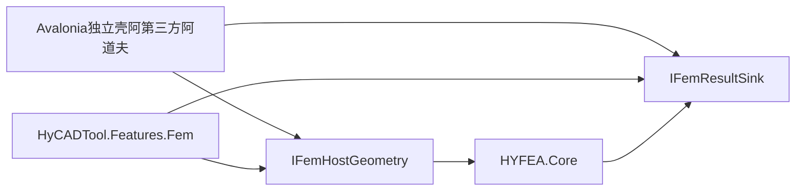

# HYFEA 独立现代 UI 外壳选型 — 替换 WPF 与预留 AutoCAD 桥接

> 调研日期：2026-07-11\
> 目标形态：独立桌面宿主（交互测试壳）+ 远期 AutoCAD 适配\
> 一句话目标：为个人开发者快速验证 HYFEA 交互，选一个可替换当前 WPF 面板体验的现代 UI 框架，同时不破坏「算法与外壳分离」及生产侧 AutoCAD 主用途。\
> 方法：对齐 `.cursor/skills/software-product-discovery` 模式 A；落盘于主题级 `Research/`（非 `docs/product-discovery/`）。

***

## 0. 目标与约束

### 目标陈述

为【个人 / 小团队工程开发者】提供【脱离 AutoCAD PaletteSet 的现代交互测试壳】，解决【WPF+PaletteSet 陷阱多、热启慢、难做 Blender/VS Code 级现代密度】的问题；区别于【把 Blender 当主宿主或整仓替换 HyCADTool WPF】，差异化在于【同栈直连 `HYFEA.Core` + 概念层预留 CAD 桥接，测试与生产外壳可并行】。

### 已锁定决定

| 项    | 决定                                                  |
| :--- | :-------------------------------------------------- |
| 范围   | **仅 HYFEA 交互测试外壳**；HyCADTool 其它 WPF 面板不动            |
| 主战场  | **独立桌面宿主**（不嵌 PaletteSet）                           |
| 远期   | 预留 **AutoCAD 适配接口**；生产主用途仍在 AutoCAD                 |
| 本期交付 | **只写本调研**；不建工程、不改 `BeamMvpPanel.xaml`               |
| 风格参考 | Blend er 信息密度 / VS Code 工作区感（**非**以 Blender 本体作主宿主） |

### 平台与关键约束

| 项     | 内容                                                                 |
| ----- | ------------------------------------------------------------------ |
| 核心功能  | 参数面板 → 调用 `HYFEA.Core` → 结果列表 / 简易 2D 视图；几何可先用假数据                  |
| 目标用户  | 本人（开发者）；后期工程师经 AutoCAD 使用同一内核                                      |
| 平台形态  | Windows 桌面优先；跨平台为加分项                                               |
| 技术栈偏好 | 与 `HYFEA.Core`（C# / netstandard2.0）同仓协同；遵守「内核永不可引用 UI/AutoCAD」     |
| 成功标准  | （1）1 天内可跑通「改参数→求解→看结果」；（2）UI 迭代不碰 AutoCAD；（3）桥接接口清晰，CAD 侧可后接       |
| 对齐架构  | [01-项目架构](../01-项目架构.md) 原则①算法与外壳分离；现有外壳在 `HyCADTool.Features.Fem` |

### 五维权重

| 维度                     | 权重       | 理由                             |
| ---------------------- | -------- | ------------------------------ |
| 易用（测交互效率 + 上手）         | **30%**  | 本期核心是「方便测交互」                   |
| 差异化（现代感 + 与 CAD 主路径解耦） | **25%**  | Blender/VS Code 感 + 可替换 WPF 体验 |
| 功能                     | **20%**  | 面板/绑定/2D 画布/与 Core 互操作         |
| 稳定                     | **15%**  | 长期可维护、崩溃少                      |
| 可靠与安全                  | **10%**  | 许可清晰、更新可控（非金融场景）               |
| **合计**                 | **100%** | <br />                         |

***

## 1. 竞品清单

> 事实来源为 2026-07-11 联网检索；存疑处标「待核实」。

### 1.1 直接竞品（可作为 HYFEA 独立测试壳）

| 名称                 | 形态                       | 平台                         | 商业模式·价格                            | 开源?                    | 活跃度                                    | 链接                                                                                 | 一句话定位                              |
| ------------------ | ------------------------ | -------------------------- | ---------------------------------- | ---------------------- | -------------------------------------- | ---------------------------------------------------------------------------------- | ---------------------------------- |
| **Avalonia**       | 桌面 UI 框架（C#/XAML/Skia）   | Win/macOS/Linux（另有移动/WASM） | 框架 MIT 免费；Accelerate 工具可选商业        | 是（MIT）                 | v12.0.4（2026-05-28）；GitHub \~31k★，持续推送 | [GitHub](https://github.com/avaloniaui/Avalonia) · [官网](https://avaloniaui.net/)   | WPF 技能可迁移的现代跨平台 .NET UI            |
| **Electron**       | Chromium + Node 桌面壳      | Win/macOS/Linux            | MIT 免费                             | 是（MIT）                 | 稳定线 v43.1.0；约 8 周一大版本                  | [GitHub](https://github.com/electron/electron) · [官网](https://www.electronjs.org/) | VS Code 同源技术栈，Web 做桌面 UI           |
| **Tauri 2**        | 系统 WebView + Rust 壳      | Win/macOS/Linux（+移动）       | Apache-2.0 OR MIT                  | 是                      | tauri-v2.11.5（2026-07-01）；\~109k★      | [GitHub](https://github.com/tauri-apps/tauri) · [官网](https://tauri.app/)           | 轻量「VS Code 感」Web UI，包体远小于 Electron |
| **WPF + WebView2** | 独立 WPF 窗 + Edge WebView2 | Windows                    | WPF 随 .NET；WebView2 Runtime 专有免费条款 | 控件/SDK 可用；Runtime 微软许可 | WebView2 NuGet 2026-06 仍高频发版           | [Learn](https://learn.microsoft.com/en-us/microsoft-edge/webview2/get-started/wpf) | 仓内已有混合经验；外壳仍含 WPF                  |

### 1.2 间接替代

| 名称                                        | 形态           | 平台                | 商业模式·价格                    | 开源? | 活跃度                             | 链接                                                                                                                                                                                                        | 一句话定位                       |
| ----------------------------------------- | ------------ | ----------------- | -------------------------- | --- | ------------------------------- | --------------------------------------------------------------------------------------------------------------------------------------------------------------------------------------------------------- | --------------------------- |
| **Blender 作宿主**（bpy / 可选 Avalonia Bridge） | DCC 宿主 + 插件  | Win/macOS/Linux   | Blender GPL；Bridge MPL-2.0 | 是   | Bridge：2026-04 起，\~14★、单贡献者（年轻） | [BlenderAvaloniaBridge](https://github.com/atticus-lv/BlenderAvaloniaBridge) · [论坛帖](https://blenderartists.org/t/free-and-open-source-an-addon-that-bring-the-powerful-avalonia-ui-into-blender/1637788) | 视口强，但偏离 AutoCAD 主用途         |
| **继续 PaletteSet WPF**（现状）                 | AutoCAD 内嵌面板 | Windows + AutoCAD | 随插件                        | 自研  | 已跑通 N7 / BeamMvpPanel           | `Features/Fem/Views/`                                                                                                                                                                                     | 生产路径保留；**不适合**作为「现代交互快测」主战场 |

### 1.3 邻域参考

| 名称               | 形态               | 平台                                 | 商业模式·价格                  | 开源?          | 活跃度                       | 链接                                                                                                 | 一句话定位                 |
| ---------------- | ---------------- | ---------------------------------- | ------------------------ | ------------ | ------------------------- | -------------------------------------------------------------------------------------------------- | --------------------- |
| **Uno Platform** | C#/WinUI XAML 跨端 | Win/macOS/Linux/WASM/移动            | Apache-2.0；Studio 工具可选付费 | 是            | 活跃；桌面+WASM 矩阵宽            | [官网](https://platform.uno/) · [License](https://github.com/unoplatform/uno/blob/master/License.md) | 跨端广，方言偏 WinUI 而非 WPF  |
| **.NET MAUI**    | 移动优先跨端           | Win/macOS/iOS/Android（**无 Linux**） | MIT                      | 是            | 10.0.80（2026-06）；Issues 多 | [GitHub](https://github.com/dotnet/maui)                                                           | 官方跨端，桌面自定义密度非强项       |
| **Qt / PySide6** | 工业级桌面 GUI        | 全桌面                                | LGPLv3 社区版或商业授权          | 是（LGPL/商业双轨） | PySide6 6.11.1（2026-05）   | [Qt Licensing](https://doc.qt.io/qt-6/licensing.html) · [PyPI](https://pypi.org/project/PySide6/)  | CAD/科学软件常见；与 C# 内核双语言 |

***

## 2. 五维度优缺点分析

评分：1–5；加权总分 = Σ(分 × 权重)。

### Avalonia（直接）

* **优点**：与 `HYFEA.Core` 同为 C#，零 FFI；XAML/MVVM 与现有 WPF 面板概念接近；Skia 自绘便于 Blender 风格高密度主题；MIT；桌面优先成熟度在 2026 对比中常被评为优于 MAUI。

* **缺点**：控件生态不如 WPF 二十年；VS 新工具走 Accelerate 许可（**框架本身仍 MIT**，可用 Rider/旧扩展）；「开箱即 VS Code」不如 Electron。

* **评分**：功能 4 · 易用 5 · 可靠安全 4 · 稳定 4 · 差异化 4

* **加权**：4×0.20 + 5×0.30 + 4×0.10 + 4×0.15 + 4×0.25 = **4.30**

### Electron（直接）

* **优点**：最接近「VS Code 类似」；前端热更新测交互极快；生态与组件库极丰富。

* **缺点**：须经进程/FFI/本地服务调 `HYFEA.Core`（双栈）；内存与包体大；安全面随 Chromium。

* **评分**：功能 4 · 易用 4 · 可靠安全 3 · 稳定 4 · 差异化 5

* **加权**：**4.15**

### Tauri 2（直接）

* **优点**：Web UI 可做出 VS Code 感；包体/内存优于 Electron；许可宽松；更新活跃。

* **缺点**：Rust + Web + C# 三栈；调 `HYFEA.Core` 需 sidecar/IPC，个人项目认知负担高。

* **评分**：功能 4 · 易用 3 · 可靠安全 5 · 稳定 4 · 差异化 4

* **加权**：**3.80**

### WPF + WebView2 独立窗（直接）

* **优点**：仓内已有 WebView2 经验（MarkdownEditor / HYmd）；可复用部分前端；Windows 上稳定。

* **缺点**：**未真正「替换 WPF」**（壳仍是 WPF）；PaletteSet 陷阱与独立窗无关，但主题资产仍分裂；跨平台弱。

* **评分**：功能 4 · 易用 4 · 可靠安全 4 · 稳定 4 · 差异化 3

* **加权**：**3.75**

### Blender 作宿主（间接）

* **优点**：视口/建模交互一流；风格即 Blender；00L5 已讨论 L5 借力路径。

* **缺点**：安装与版本重；主用途在 AutoCAD，测完还要迁交互；Bridge 项目年轻（星少、单维护者）；GPL/MPL 合规需小心。

* **评分**：功能 3 · 易用 2 · 可靠安全 3 · 稳定 2 · 差异化 4

* **加权**：**2.80**

### Uno Platform（邻域）

* **优点**：Apache-2.0；平台矩阵宽（含 WASM）；C# 同栈。

* **缺点**：WinUI 方言迁移成本高于 Avalonia；对「单人 FEA 测交互」过重。

* **评分**：功能 4 · 易用 3 · 可靠安全 4 · 稳定 3 · 差异化 3

* **加权**：**3.30**

### .NET MAUI（邻域）

* **优点**：微软一线；MIT；C#。

* **缺点**：移动优先；无 Linux；自定义高密度工程 UI 弱于 Avalonia；Issue 面大。

* **评分**：功能 3 · 易用 3 · 可靠安全 4 · 稳定 3 · 差异化 2

* **加权**：**2.85**

### Qt / PySide6（邻域）

* **优点**：工业 GUI 天花板；稳定；科学可视化生态强。

* **缺点**：Python UI ↔ C# 内核双语言；LGPL 动态链接义务或商业授权；偏离现有 .NET 仓。

* **评分**：功能 5 · 易用 2 · 可靠安全 4 · 稳定 5 · 差异化 3

* **加权**：**3.50**

### 汇总对比

| 竞品           | 功能 | 易用 | 可靠安全 | 稳定 | 差异化 | 加权总分     | 一句话总评                  |
| ------------ | -- | -- | ---- | -- | --- | -------- | ---------------------- |
| **Avalonia** | 4  | 5  | 4    | 4  | 4   | **4.30** | **推荐默认**：同栈、现代、测交互成本最低 |
| Electron     | 4  | 4  | 3    | 4  | 5   | **4.15** | **备选**：要极致 VS Code 感时选 |
| Tauri 2      | 4  | 3  | 5    | 4  | 4   | 3.80     | Web 感轻量，但三栈过重          |
| WPF+WebView2 | 4  | 4  | 4    | 4  | 3   | 3.75     | 过渡方案，非「替换 WPF」         |
| Qt/PySide6   | 5  | 2  | 4    | 5  | 3   | 3.50     | 工业强，语言栈不匹配             |
| Uno          | 4  | 3  | 4    | 3  | 3   | 3.30     | 跨端过宽，本期过重              |
| MAUI         | 3  | 3  | 4    | 3  | 2   | 2.85     | 非桌面 FEA 测交互最优          |
| Blender 宿主   | 3  | 2  | 3    | 2  | 4   | 2.80     | 风格对、主路径错               |

### 行业现状小结

* **普遍做得好**：2026 桌面壳两极——**.NET 自绘（Avalonia）** 与 **Web 壳（Electron/Tauri）**；两者都能做出现代高密度 UI。

* **普遍短板**：Web 壳与现有 C# FEM 内核之间总有 IPC/序列化税；WPF 在 AutoCAD PaletteSet 内仍是「能用但坑多」；把 DCC（Blender）当主壳会偏离 CAD 生产路径。

* **对本项目**：最优切口是 **同栈独立壳测交互**，CAD 外壳后接，而不是一次换掉整个 HyCADTool UI。

***

## 3. 我应当做的产品

### 机会矩阵（痛点 × 满足度）

| 痛点               | 现状 WPF/PaletteSet | Electron | Avalonia 独立壳  |
| ---------------- | ----------------- | -------- | ------------- |
| 快速改面板测交互         | 低（要 C2/CAD）       | 高        | **高**         |
| 现代密度 / Blender 感 | 中（BlenderUI 主题）   | 高（CSS）   | **高（样式系统）**   |
| 直连 HYFEA.Core    | 高                 | 低        | **高**         |
| 远期接 AutoCAD      | 已接                | 需再桥      | **需概念接口（可控）** |
| 整仓换掉所有面板         | 无                 | 过大       | **Won't（本期）** |

切入空白：**「独立现代壳 × 同栈内核 × 预留 CAD 桥」**——竞品要么同栈但老壳（WPF），要么现代但异栈（Electron），要么视口强但宿主错（Blender）。

### 一句话定位

为【HYFEA 开发者】提供【Avalonia 独立交互测试壳】，区别于【PaletteSet WPF / Blender 宿主】在于【同栈快测 + 接口面向未来 AutoCAD】。

### 目标用户画像

* **主**：本人 — 改单元/荷载/边界后立刻看交互与结果，不想开 AutoCAD。

* **次（远期）**：工程师 — 仍在 AutoCAD 选线求解；共用内核与（未来）同一宿主抽象。

### MVP 功能集（MoSCoW）

| 优先级            | 含义       | 功能                                                                            |
| -------------- | -------- | ----------------------------------------------------------------------------- |
| **Must**       | 没有则壳不成立  | 参数面板（E/A/Iz、q、Segments、EndA/EndB）；一键求解；调用 `HYFEA.Core`；位移/内力结果表；进程内假几何或文件几何输入 |
| **Should**     | MVP 后很快补 | 简易 2D 变形/弯矩示意；暗色高密度主题（Blender 感）；热重载改 UI                                      |
| **Could**      | 锦上添花     | 多算例切换；与金标准 G05–G09 一键对比                                                       |
| **Won't(now)** | 明确不做     | 完整网格/3D CAD；替换 HyCADTool 全仓 WPF；以 Blender 为唯一宿主；PaletteSet 内消灭 WPF            |

### 非功能目标（可量化）

| 目标    | 指标                                     |
| ----- | -------------------------------------- |
| 启动    | 冷启独立壳 < 3 s（开发机，待 PoC 实测）              |
| 交互环   | 改参数 → 求解 → 刷新结果 ≤ 2 步点击                |
| 与内核耦合 | UI 工程引用 `HYFEA.Core`；**禁止** Core 反引 UI |
| 桥接预留  | 几何输入 / 结果回写经抽象接口，CAD 与独立壳各一实现          |

### 差异化锚点

1. **同栈零税**：C# UI ↔ C# FEM，无序列化往返（相对 Electron/Tauri）。
2. **双外壳并行**：测试壳现代迭代；生产壳仍 AutoCAD，共享契约。
3. **风格可塑**：Avalonia 自绘可追 Blender 密度，而不绑架 Blender 发行版。

### 不做清单

* 不以 Blender 本体作为 HYFEA **主**测试壳。

* 不以「PaletteSet 内彻底消灭 WPF」为本期目标。

* 不整仓迁移 HyCAD.BlenderUI / 道路/钢筋等面板。

* 不在本 Research 阶段写实现代码或定稿接口签名。

***

## 4. 最优实现路径

### ① 构建方式

| 方式                           | 适用              | 结论                  |
| ---------------------------- | --------------- | ------------------- |
| 套用 UI 框架做壳 + 引用 `HYFEA.Core` | 差异化在交互与主题，内核已有  | **推荐**              |
| Fork 开源 IDE/壳                | VS Code fork 过重 | 否                   |
| 从零自研 UI 引擎                   | 无必要             | 否                   |
| Blender 二次开发当主壳              | 偏离 AutoCAD 主用途  | **否（主路径）**；可视口实验时再议 |

* **推荐**：Avalonia 独立桌面应用（如未来目录 `src/HYFEA/HYFEA.Shell/` 或 `HYFEA.App/`，名称 PoC 时再定）。

* **备选**：若 PoC 中强烈需要「纯 Web 组件 + VS Code 布局」，改用 **Electron**（或次选 Tauri），经本地 JSON-RPC 调 Core；接受双栈成本。

### ② 技术选型

| 层       | 默认                              | 备选                                                      | 许可核对                 |
| ------- | ------------------------------- | ------------------------------------------------------- | -------------------- |
| 语言/运行时  | C# / .NET（与测试工程对齐，具体 TFM PoC 定） | —                                                       | —                    |
| UI      | **Avalonia**（MIT）               | Electron（MIT） / Tauri（Apache-2.0 OR MIT）                | Accelerate 工具可选，框架免费 |
| 内核      | 项目引用 `HYFEA.Core`               | —                                                       | 自研                   |
| 几何/结果抽象 | 概念接口见下                          | —                                                       | —                    |
| 主题      | Avalonia 自研暗色密度主题               | 借鉴 HyCAD.BlenderUI 配色（**不可**直接搬 WPF ResourceDictionary） | —                    |

### ③ 架构概要（概念）



| 概念接口               | 职责          | 独立壳实现               | AutoCAD 实现（远期）                 |
| ------------------ | ----------- | ------------------- | ------------------------------ |
| `IFemHostGeometry` | 提供梁轴线/节点等输入 | 内存线段 / 简易拾取 / 读文件   | 现有 `HyfeaGeometryMapper`（选线）   |
| `IFemResultSink`   | 消费位移/内力     | DataGrid + 可选 2D 画布 | 现有 `BeamResultRenderer` 回写 CAD |

> 上表仅为调研级命名；PoC 时可改名或合并，**不得**让 `HYFEA.Core` 依赖任一宿主。

**数据流**：宿主经 `IFemHostGeometry` 组装 `FemProblem` → Core 分析 → `FemResult` → `IFemResultSink`。

**风险点**：双壳维护（面板字段漂移）；主题与 BlenderUI 资产不可直接复用；若误选 Electron 则引入 Node/Chromium 运维面。

### ④ 路线图

| 阶段            | 交付物                                          | 验收点                   |
| ------------- | -------------------------------------------- | --------------------- |
| **本期（已完成边界）** | 本 Research 006                               | 选型结论写入 04/02/README   |
| **下一阶段 PoC**  | Avalonia 空壳 + 调通 G05 级求解 + 结果表               | 不开 AutoCAD 可演示        |
| **并行**        | 保留 N7 WPF 面板                                 | CAD 生产路径不回归           |
| **桥接**        | CAD 实现 `IFemHostGeometry` / `IFemResultSink` | 同一问题在壳与 CAD 结果一致（容差内） |
| **V1**        | Should：2D 示意 + 暗色主题                          | 目视接近「现代工程工具」          |

### ⑤ 风险与对策

| 风险                | 类型    | 影响 | 对策                         |
| ----------------- | ----- | -- | -------------------------- |
| 双外壳字段不一致          | 技术    | 中  | 共享 ViewModel/DTO 或契约测试     |
| Avalonia 控件缺口     | 技术    | 低  | 自绘 / 社区控件；复杂编辑再评估 Electron |
| Accelerate 工具许可误解 | 许可    | 低  | 只用 MIT 框架 + Rider/OSS 扩展   |
| 过早绑死 Blender      | 依赖    | 高  | 主路径禁止；视口仅实验                |
| 忽视 AutoCAD 主用途    | 市场/产品 | 高  | 接口预留 + PoC 后优先接 CAD 适配     |

### ⑥ 假设验证（最危险假设优先）

| 假设                       | 验证手段                                        |
| ------------------------ | ------------------------------------------- |
| Avalonia 做高密度面板足够快       | PoC：复刻 BeamMvpPanel 字段，计时改 UI→见结果           |
| 概念桥接足够接 CAD              | 纸面序列图 + 用现有 Mapper/Renderer 写适配草图（仍可不改生产代码） |
| Electron 的 VS Code 感值得双栈 | 仅当 Avalonia PoC 主题/布局明显不达标时开分支对比 3 天        |

```
阿斯5. 结
```

**默认选型：Avalonia 独立桌面壳**（加权 4.30）。理由：与 `HYFEA.Core` 同栈、WPF 概念可迁移、能做出 Blender 级密度主题，并最贴合「方便测交互」权重。

**备选：Electron**（4.15）——仅当必须「开箱 VS Code 工作区」且接受 IPC 调 C# 内核时启用。

**明确不选为主路径**：Blender 宿主、MAUI、整仓 WPF 消灭、PaletteSet 内换壳。

**第一步（调研之后）**：新建 Avalonia PoC，直连 Core，跑通梁元参数→求解→结果表；同步草拟 `IFemHostGeometry` / `IFemResultSink`，为 AutoCAD 适配留位。本期**不写代码**。

***

## 附录：与既有文档关系

| 文档                                                                                                | 关系                                                      |
| ------------------------------------------------------------------------------------------------- | ------------------------------------------------------- |
| [01-项目架构](../01-项目架构.md)                                                                          | 遵守算法/外壳分离；技术栈表待 PoC 后再改                                 |
| [Learning/00L5](../Learning/00L5-前后处理与GUI层深析-网格CAD可视化参数化交互建模-Blender-Gmsh-ParaView-2026-05-15.md) | L5 长期借力 Blender/Gmsh/ParaView；本文把「测交互壳」从「Blender 宿主」中拆出 |
| [04-下一步计划](../04-下一步计划.md)                                                                        | 插入本调研结论与 PoC 待办                                         |

***

**版本**：v1.0 | **更新**：2026-07-11

```sheet
rows: 7
cols: 2
snapshot: ./006-HYFEA独立现代UI外壳选型-替换WPF与预留AutoCAD桥接-2026-07-11.assets/sheet-mrggsxww.univer.json
```

