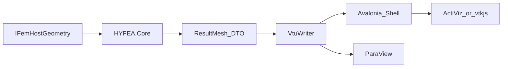

# HYFEA 通用前后处理与 3D 云图交互选型

> 调研日期：2026-07-11  
> 目标形态：独立桌面前后处理工作站（扩展 Avalonia Shell）+ 远期 AutoCAD 几何桥  
> 一句话目标：为 HYFEA 选一条可支撑「通用有限元」的 **3D 网格 / 标量云图 / 探针交互** 路径，摆脱当前「仅参数表+结果表」的粗糙壳，同时不破坏算法与外壳分离。  
> 方法：对齐 `software-product-discovery` 模式 A；落盘主题级 `Research/`。  
> 上承：[006](006-HYFEA独立现代UI外壳选型-替换WPF与预留AutoCAD桥接-2026-07-11.md)、[00L5](../Learning/00L5-前后处理与GUI层深析-网格CAD可视化参数化交互建模-Blender-Gmsh-ParaView-2026-05-15.md)、[01-项目架构](../01-项目架构.md)

---

## 0. 目标与约束

### 痛点陈述

[`HYFEA.Shell`](../../src/HYFEA/HYFEA.Shell/) PoC 已能「参数→求解→表」；但对工程师而言 **缺少**：

- 3D/网格显示与轨道相机  
- 位移/应力等标量 **云图** 与色标  
- 点选探针、切片、变形动画等后处理交互  
- 可扩展到四面体/壳元的「通用 FEA 支撑」而不仅是梁元表格  

006 解决了 **壳框架（Avalonia）**；00L5 指出 L5 可视化应借力 **VTK/ParaView**。本文回答：**在 Avalonia 壳上，通用前后处理 + 3D 云图的最优产品定义与实现路径是什么。**

### 已锁定决定（含假设）

| 项 | 决定 |
|---|---|
| 产品形态 | **独立桌面前后处理工作站**（升级 Shell；**不**在 AutoCAD PaletteSet 内做重 3D） |
| 内核 | 直连 / 契约调用 `HYFEA.Core`；Core 永不引 UI |
| CAD | 几何主来源远期仍 AutoCAD（006 不变） |
| 本期交付 | **仅本文档**；不改 Shell 代码、不引 NuGet |
| 成功标准 | 路线可分期：先网格+云图+探针可读；终态接近「轻量 PrePoMax 级后处理」，而非完整 ANSYS |

### 五维权重

| 维度 | 权重 | 理由 |
|---|---|---|
| 功能（云图/网格/交互深度） | **30%** | 本期核心缺口 |
| 易用 | **25%** | 壳粗糙 → 工作流要顺 |
| 差异化（CAD+HYFEA 集成、现代感） | **20%** | 与纯外挂工具区分 |
| 稳定 | **15%** | 大数据网格、长期维护 |
| 可靠安全·许可成本 | **10%** | 个人/商业可承受 |
| **合计** | **100%** | |

---

## 1. 竞品与方案清单

> 事实来源：2026-07-11 联网检索；存疑标「待核实」。

### 1.1 产品级对标（做成什么样）

| 名称 | 形态 | 平台 | 商业模式·许可 | 开源? | 活跃度 | 链接 | 一句话定位 |
|---|---|---|---|---|---|---|---|
| **ParaView** | 科学后处理应用（VTK） | Win/macOS/Linux | BSD-3-Clause，免费 | 是 | v6.0.0（2026）；Kitware 持续维护 | [官网](https://www.paraview.org/) · [许可](https://www.paraview.org/license/) · [GitHub](https://github.com/Kitware/ParaView) | 开源后处理天花板：云图/切片/动画/大规模数据 |
| **PrePoMax** | CalculiX 前后处理一体 GUI | Windows 为主 | **GPL-3.0-or-later** | 是 | v2.4–2.5（2025–2026）；GitLab 活跃 | [官网](https://prepomax.fs.um.si/) · [GitLab](https://gitlab.com/MatejB/PrePoMax) | 通用结构 FEA 工作流完整（几何-网格-求解-云图） |
| **ANSYS Mechanical** | 商业前后处理 | Windows | 商业授权 | 否 | 持续 | 见 [Research/01](01-ANSYS架构深度分析-Mechanical-Workbench-LSDYNA-2026-05-14.md) | UX/结果树对标；不做功能对等自研 |
| **Salome / Salome-Meca** | 通用前后处理平台 + Code_Aster | Linux/Win | Salome **LGPL**；Aster **GPL** | 是 | 工业/能源界常用 | [平台](https://www.salome-platform.org) · [FAQ](https://simvia.tech/resources/guides/faq-understanding-salome-salome-meca-code-aster-and-code-saturne) | 模块化前后处理；学习曲线陡 |
| **FreeCAD FEM** | CAD 内 FEA 工作台 | 跨平台 | LGPL（FreeCAD） | 是 | 1.1 强化 pipeline/过滤器/VTK 导出 | [Wiki](https://wiki.freecad.org/FEM_Workbench) · [新闻](https://blog.freecad.org/2025/09/09/what-is-new-in-fem-for-freecad-1-1/) | 内嵌后处理 + 可导出 ParaView |

### 1.2 技术栈候选（怎么嵌进 HYFEA）

| 名称 | 形态 | 与 Avalonia | 许可要点 | 活跃度 |
|:--|---|---|---|---|
| **VTU/VTK 导出 → ParaView** | 文件/子进程流水线 | Shell 写文件；可选 `Process.Start` | VTK/ParaView BSD-3 | 格式与工具均成熟 |
| **ActiViz（VTK.NET）** | VTK C# 包装 + GUI 控件 | 官方支持 Avalonia（`Kitware.AvaloniaControls`）；9.6 强化 picking | **新版多为 Supported/商业**；OSS 停在约 **5.8** | 9.5/9.6（2025–2026） |
| **vtk.js**（± Avalonia WebView） | 浏览器科学渲染 | WebView2/内嵌页 | VTK.js **BSD-3** | 活跃 |
| **trame** | Python Web 可视化框架（VTK/PV） | 外挂服务；非 C# 同栈 | Apache-2.0（框架） | 活跃 |

---

## 2. 五维度优缺点分析

评分 1–5；加权 = Σ(分 × 权重)。

### 2.1 产品对标

#### ParaView（直接 — 后处理产品）

- **优点**：云图/切片/glyph/动画/大规模数据成熟；BSD 可商用；VTU 生态标准。  
- **缺点**：外挂时与 HYFEA 参数壳分裂；学习曲线；非「求解器一体」产品。  
- **评分**：功能 5 · 易用 3 · 差异化 2 · 稳定 5 · 许可 5 → **加权 3.90**

#### PrePoMax（直接 — 一体工作站）

- **优点**：几何→网格→求解→3D 云图闭环；.NET/Windows 体验接近目标产品；CalculiX 结构问题覆盖广。  
- **缺点**：GPL-3 传染风险大，不宜当 HYFEA 商业壳底座；绑 CalculiX 非 HYFEA.Core；Fork 成本高。  
- **评分**：功能 4 · 易用 4 · 差异化 3 · 稳定 4 · 许可 2 → **加权 3.60**

#### ANSYS Mechanical（间接 — UX 对标）

- **优点**：结果树、云图、探针、报告工业标准。  
- **缺点**：不可复用；对等自研不可行。  
- **评分**：功能 5 · 易用 4 · 差异化 1 · 稳定 5 · 许可 1 → **加权 3.50**（仅对标）

#### Salome-Meca（邻域）

- **优点**：前后处理模块全；LGPL 平台层。  
- **缺点**：与 C#/Avalonia/AutoCAD 主路径脱节；Aster GPL；上手难。  
- **评分**：功能 4 · 易用 2 · 差异化 2 · 稳定 4 · 许可 3 → **加权 2.95**

#### FreeCAD FEM（邻域）

- **优点**：内嵌 pipeline/过滤器；可 VTK 导出；开源。  
- **缺点**：宿主是 FreeCAD 非 HYFEA；不能当生产壳。  
- **评分**：功能 3 · 易用 3 · 差异化 2 · 稳定 3 · 许可 4 → **加权 2.90**

### 2.2 技术栈（实现路径）

#### A. VTU 导出 + ParaView（外挂/并列）

- **优点**：零许可摩擦；立刻得到专业云图；强制理清「结果网格 DTO」；与 Track A 开源求解器也通用。  
- **缺点**：双应用切换；探针/参数不在同一窗。  
- **评分**：功能 5 · 易用 3 · 差异化 4 · 稳定 5 · 许可 5 → **加权 4.30**

#### B. ActiViz 嵌入 Avalonia

- **优点**：同进程 VTK；官方 Avalonia 控件；硬件 picking（9.6）；云图能力完整。  
- **缺点**：现代版商业 Supported；OSS 5.8 过旧；费用待核实（需 Kitware 报价）。  
- **评分**：功能 5 · 易用 4 · 差异化 5 · 稳定 4 · 许可 2 → **加权 4.30**

#### C. vtk.js + WebView（嵌入备选）

- **优点**：BSD；可嵌 Shell；无 ActiViz 年费。  
- **缺点**：双语言（C#↔JS）；FEA 过滤器少于 C++ VTK；WebView 生命周期坑（仓内已有经验可迁移）。  
- **评分**：功能 4 · 易用 4 · 差异化 4 · 稳定 3 · 许可 5 → **加权 3.95**

#### D. HelixToolkit Avalonia

- **优点**：MIT；纯 C#；快速出「能转的网格」。  
- **缺点**：无现成非结构网格标量场管线；应力云图需自研着色与插值，易做成玩具。  
- **评分**：功能 2 · 易用 4 · 差异化 3 · 稳定 4 · 许可 5 → **加权 3.30**

#### E. trame（Python）

- **优点**：VTK/ParaView Web 能力强；Apache。  
- **缺点**：Python 服务 + C# 内核双运行时；偏离 006 同栈决策。  
- **评分**：功能 5 · 易用 2 · 差异化 2 · 稳定 4 · 许可 5 → **加权 3.50**

#### F. 自研 Skia 2D（Won't 主路径）

- **优点**：轻。  
- **缺点**：无法支撑通用 3D FEA。  
- **评分**：功能 1 · 易用 3 · 差异化 1 · 稳定 4 · 许可 5 → **加权 2.20**

### 汇总对比（技术栈优先）

| 方案 | 功能 | 易用 | 差异化 | 稳定 | 许可 | 加权 | 总评 |
|---|---|---|---|---|---|---|---|
| **VTU→ParaView** | 5 | 3 | 4 | 5 | 5 | **4.30** | **阶段 1 默认**：验证数据与专业云图 |
| **ActiViz 嵌入** | 5 | 4 | 5 | 4 | 2 | **4.30** | **阶段 2 优选**：一体壳（许可可接受时） |
| vtk.js WebView | 4 | 4 | 4 | 3 | 5 | **3.95** | ActiViz 不可行时的嵌入备选 |
| trame | 5 | 2 | 2 | 4 | 5 | 3.50 | 双栈过重 |
| HelixToolkit | 2 | 4 | 3 | 4 | 5 | 3.30 | 仅过渡 3D 预览 |
| Skia 2D | 1 | 3 | 1 | 4 | 5 | 2.20 | Won't 作通用主路径 |

### 行业现状小结

- **普遍做得好**：后处理几乎都站在 **VTK 数据模型（VTU/XML）** 上；ParaView / PrePoMax / FreeCAD 均殊途同归。  
- **普遍短板**：要么 **一体 GUI 绑死特定求解器**（PrePoMax↔CalculiX），要么 **壳与后处理分裂**（自研求解器 + 外挂 ParaView）。  
- **HYFEA 机会**：用 **开放结果网格契约（VTU）** 解耦内核与视口；壳用 Avalonia；视口从外挂 ParaView 渐进到嵌入 VTK（ActiViz 或 vtk.js），避免 GPL 一体产品与 Helix「假云图」。

---

## 3. 我应当做的产品

### 机会矩阵

| 痛点 | 现状 Shell | 外挂 ParaView | 嵌入 VTK | PrePoMax Fork |
|---|---|---|---|---|
| 专业云图 | 无 | 高 | 高 | 高 |
| 与 HYFEA.Core 同栈 | 高 | 中（文件） | 高 | 低（GPL/CCX） |
| 与 AutoCAD 桥 | 预留 | 弱 | 可保留 | 无 |
| 许可安全 | 高 | 高 | 中（ActiViz） | 低 |

切入点：**「Avalonia 工作站壳 + VTU 结果契约 + 可替换视口（ParaView → 嵌入 VTK）」**。

### 一句话定位

为【结构/岩土工程师与开发者】提供【HYFEA 通用前后处理工作站】，区别于【粗糙结果表 / 纯 ParaView / PrePoMax】在于【自有内核 + 开放 VTU + Avalonia 壳 + 可选 CAD 几何】。

### 目标用户

- **主**：本人 — 验证单元/材料/求解时看云图与探针。  
- **次**：工程师 — 经 CAD 取几何，在独立壳看结果（远期）。

### MVP 功能集（MoSCoW）

| 优先级 | 功能 |
|---|---|
| **Must** | 结果网格 DTO；写出 **VTU/VTK**；Shell 内打开/刷新；ParaView 可读（位移等标量场）；色标；轨道旋转；点选读节点值（可先在 ParaView，后迁入壳） |
| **Should** | Shell 内嵌 3D 视口（ActiViz 或 vtk.js）；变形动画；切片；模型树（部件/场切换）；梁元挤出显示 |
| **Could** | Glyph 矢量；多帧；报告截图；与金标准场对比着色 |
| **Won't(now)** | 完整 CAD 建模；替代 AutoCAD；Fork PrePoMax；Helix 自研应力插值当终局；PaletteSet 内 VTK |

### 非功能目标

|            |                                                         |
|---|---|
| 目标 | 指标 |
| 管道 | 求解后 ≤1 次点击导出/刷新 VTU |
| 规模（近） | ≥1e4 单元云图可交互（ParaView 路径） |
| 架构 | Core 无 VTK 依赖；Writer 在 `HYFEA.Viz` 或 Hosting 扩展 |
| 许可 | 默认路径零强制商业组件；ActiViz 为可选付费加速项 |

### 差异化锚点

1. **VTU 为唯一结果交换面**（对内壳、对外 ParaView、对 Track A 求解器）。  
2. **壳与视口可替换**（先外挂后嵌入）。  
3. **CAD 几何 + 自研内核** 双轨宿主，不被 GPL GUI 绑架。

### 不做清单

- 不以 Helix 着色冒充通用 FEA 云图终局。  
- 不以 Fork PrePoMax/Salome 作为主产品。  
- 不在本期实现任何 3D 代码。

---

## 4. 最优实现路径

### ① 构建方式

| 方式 | 结论 |
|---|---|
| 套用 VTK 生态（写 VTU + 视口） | **推荐** |
| Fork PrePoMax | 否（GPL + 求解器绑定） |
| 从零自研渲染引擎 | 否 |
| 仅美化 Avalonia 表格 | 否（不解决云图） |

### ② 技术选型（默认 + 备选）

| 层 | 默认 | 备选 | 许可 |
|---|---|---|---|
| 壳 UI | 继续 **Avalonia**（006） | — | MIT |
| 结果契约 | **VTU/XML** Writer（自研薄层） | meshio 子进程（Python，非首选） | 自研 BSD/自有 |
| 阶段 1 视口 | **ParaView** 打开导出文件（可一键拉起） | — | BSD-3 |
| 阶段 2 视口 | **ActiViz → Avalonia**（报价可接受） | **vtk.js + WebView2** | 商业 / BSD-3 |
| 过渡 3D | Helix **仅**线框/实体预览（可选） | — | MIT |
| 明确不用 | trame 作主路径；Skia 作通用 3D | — | — |

### ③ 架构概要

| 模块 | 职责 |
|---|---|
| `FemResult` → `ResultMesh` | 节点坐标、单元连接、点/元标量场（Ux/Uy/Mises…） |
| `VtuWriter` | 写出标准 VTU，ParaView/VTK 可直接读 |
| Shell | 参数、求解、触发写出、状态栏、远期嵌入视口 |
| Viewer | 阶段 1：ParaView；阶段 2：ActiViz 或 vtk.js |

**风险点**：梁元 MVP 结果场不足（需扩展应力/截面力到场）；ActiViz 报价；WebView 双栈调试。

### ④ 路线图

| 阶段 | 交付物 | 验收 |
|---|---|---|
| **本期** | Research/007 | 选型与 MoSCoW 落盘 |
| **V0 管道** | `ResultMesh` + VTU Writer + Shell「导出/打开」 | ParaView 显示悬臂位移云图 |
| **V1 嵌入** | Avalonia 内 3D 视口 + 色标 + 探针 | 不开外挂也能看云图 |
| **V2** | 切片/变形动画/模型树 | 接近轻量通用后处理 |
| **桥接** | CAD 几何 → 同 VTU 管道 | 与 N7 结果一致（容差内） |

### ⑤ 风险与对策

| 风险 | 类型 | 影响 | 对策 |
|---|---|---|---|
| ActiViz 费用过高 | 许可 | 中 | 阶段 1 不依赖；阶段 2 改 vtk.js |
| 双应用 UX | 体验 | 中 | 一键 `Process.Start(paraview, vtu)`；尽快嵌入 |
| 结果场模型不足 | 技术 | 高 | 先扩展 `FemResult`/后处理算子再写 VTU |
| Helix 路径沉没成本 | 技术 | 低 | 严格限制为线框预览 |
| GPL 诱惑（PrePoMax） | 许可 | 高 | 只 UX 对标，不拷代码 |

### ⑥ 最危险假设验证

| 假设 | 验证 |
|---|---|
| VTU 足以表达 HYFEA 梁/壳/体结果 | V0：G06 悬臂位移场在 ParaView 着色正确 |
| 嵌入 VTK 对个人可负担 | 申请 ActiViz trial；并行做 vtk.js 尖刺 3 天 |
| 工程师接受「壳+视口」而非单一 PrePoMax | 目视原型后自评 |

---

## 5. 结论

**产品**：在 006 Avalonia 独立壳之上，建设 **通用 FEA 前后处理工作站**，核心缺口是 **3D 网格 + 标量云图 + 探针**，不是继续美化 DataGrid。

**实现最优解（分阶段写死）**：

1. **立刻（下一实施包）**：`ResultMesh` + **VTU Writer** + Shell 导出/拉起 **ParaView**（加权 4.30，零许可风险）。  
2. **中期**：壳内嵌 **ActiViz（Avalonia）**（同权 4.30，一体体验）；若许可不可接受 → **vtk.js WebView**（3.95）。  
3. **Helix**：最多过渡线框；**PrePoMax/Salome**：只对标，不 Fork。  

**与 00L5 对齐**：可视化子层借力 VTK 族；与 006 对齐：壳仍 Avalonia，CAD 桥不变。

**第一步（调研之后）**：实现 VTU 管道 PoC，用 G06 级结果在 ParaView 出位移云图——**本期不写代码**。

---

## 附录：关键来源

| 主题 | 链接 |
|---|---|
| ParaView 许可 | https://www.paraview.org/license/ |
| ParaView 6.0 | https://www.paraview.org/ |
| ActiViz 产品 / Avalonia | https://www.kitware.eu/activiz/ |
| ActiViz 9.6 | https://www.kitware.com/activiz-9-6-release/ |
| ActiViz 9.5 用户指南（许可说明） | https://www.kitware.eu/wp-content/uploads/2025/10/ActiViz.NET_9.5_Users_Guide.pdf |
| PrePoMax | https://prepomax.fs.um.si/ · https://gitlab.com/MatejB/PrePoMax |
| HelixToolkit | https://github.com/helix-toolkit/helix-toolkit |
| vtk.js | https://github.com/Kitware/vtk-js |
| trame | https://kitware.github.io/trame/ |
| FreeCAD FEM 1.1 | https://blog.freecad.org/2025/09/09/what-is-new-in-fem-for-freecad-1-1/ |

---

**版本**：v1.0 | **更新**：2026-07-11
