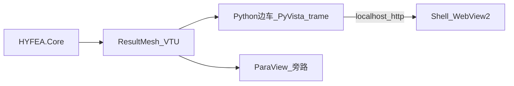

# 开源后处理整包复用与许可安全选型（008）

> 调研日期：2026-07-11\
> 触发：Shell 内嵌 vtk.js PoC（Plan/07）只证明「管道通」，缺精确 3D 显示、网格划分显示、变形前后对比等工程师级后处理；用户要求 **不重复造轮子、不被开源协议束缚、功能优秀**。\
> 方法：`software-product-discovery` 模式 A（聚焦「复用整包」专项）。\
> 上承：[007](007-HYFEA通用前后处理与3D云图交互选型-2026-07-11.md)、[001 §开源协议分层](001-自研通用FEA的第一性原则重审-30年积累vs150年开源-2026-05-15.md)、[Plan/07](../Plan/07-vtkjs内嵌视口PoC-2026-07-11.md)

***

## 0. 先回答核心疑问：是不是只能独立做轮子？

**不是。**「不被协议束缚」排除的只是 **GPL 一体 GUI**（PrePoMax、Code\_Aster GUI 等）。VTK 生态整层都是 **宽松许可**，可闭源商用、可 Fork、可嵌入：

| 资产                    | 许可         | 可闭源商用? | 可 Fork?                 |
| --------------------- | ---------- | ------ | ----------------------- |
| VTK（C++ 内核）           | BSD-3      | 是      | 是                       |
| **ParaView 本体**       | BSD-3      | 是      | **是 — 与 PrePoMax 完全不同** |
| vtk.js / Glance       | BSD-3      | 是      | 是                       |
| PyVista               | MIT        | 是      | 是                       |
| trame（Kitware Web 框架） | Apache-2.0 | 是      | 是                       |
| trame-pyvista         | MIT        | 是      | 是                       |

007 说「不 Fork PrePoMax」是因为它 **GPL-3 + 绑 CalculiX**；**ParaView 是 BSD**，Fork/定制/闭源集成都合法。所以「功能天花板级复用」与「许可自由」并不冲突——**答案在 VTK 宽松阵营，不在自研**。

### 本专项五维权重（区别于 007）

| 维度                    | 权重  | 理由                   |
| --------------------- | --- | -------------------- |
| 功能（变形对比/网格/探针/动画）     | 30% | 本期核心缺口               |
| 复用度（不造轮子）             | 25% | 用户显式要求               |
| 许可自由（闭源商用无传染）         | 20% | 用户显式要求               |
| 集成成本（与 Avalonia/C# 壳） | 15% | 已有 WebView2 + VTU 管道 |
| 稳定/维护活跃               | 10% | 长期演进                 |

***

## 1. 候选清单（2026-07-11 联网核实）

| # | 方案                     | 形态                                 | 许可                          | 关键事实                                                                      |
| - | ---------------------- | ---------------------------------- | --------------------------- | ------------------------------------------------------------------------- |
| A | **PyVista + trame 边车** | Python 子进程 + 本地 HTTP → 现有 WebView2 | MIT + Apache-2.0 + BSD（VTK） | trame 官网明示「可开源或商业应用，无许可顾虑」；PyVista `warp_by_vector`、`show_edges`、探针、动画全现成 |
| B | **Glance 定制**          | vtk.js 现成查看器（Kitware）              | BSD-3                       | 自带文件加载/色表/表示切换 UI；VTU 支持非官方列表但实测可读（issue #440）；定制需 Vue.js                 |
| C | **ParaView 定制应用**      | 基于 ParaView（C++/Qt）做品牌化工作站         | BSD-3                       | 后处理天花板（切片/流线/动画/大数据）；Kitware 官方支持定制应用路线；投入为 C++/Qt 人月                     |
| D | **ActiViz 嵌入**         | VTK .NET 官方包装（Avalonia 控件）         | 商业（新版）；OSS 停在 5.8           | 同栈同进程最顺；花钱不花代码；见 007 §2.2B                                                |
| E | **继续 vtk.js 自研堆功能**    | 现状 Plan/07 延伸                      | BSD-3                       | 每个滤镜（warp/探针/切片）都要手写 JS —— 正是「造轮子」                                        |
| F | PrePoMax Fork          | GPL 一体 GUI                         | GPL-3                       | **按约束直接出局**（传染 + 绑 CalculiX）                                              |

> 旁路参考：F3D（BSD-3 轻量查看器）、veux / sdypy-view（MIT，Python FEA 可视化）——可借鉴不作主路径。

***

## 2. 五维评分

| 方案                     | 功能 | 复用 | 许可 | 集成 | 稳定 | **加权**   | 总评        |
| ---------------------- | -- | -- | -- | -- | -- | -------- | --------- |
| **A PyVista+trame 边车** | 5  | 5  | 5  | 4  | 4  | **4.75** | **推荐主路径** |
| C ParaView 定制应用        | 5  | 4  | 5  | 2  | 5  | 4.30     | 远期终态候选    |
| B Glance 定制            | 3  | 4  | 5  | 4  | 4  | 3.90     | 查看器够、后处理浅 |
| D ActiViz 商业           | 5  | 4  | 2  | 4  | 4  | 3.90     | 预算方案，非必需  |
| E vtk.js 自研堆功能         | 3  | 2  | 5  | 5  | 3  | 3.45     | 违背「不造轮子」  |
| F PrePoMax Fork        | 4  | 5  | 1  | 2  | 4  | 3.35     | 许可红线出局    |

### 逐条要点

* **A（推荐）**：变形前后对比 = `mesh.warp_by_vector()` + 原网格半透明线框叠加，**一行滤镜**；网格边、色标、探针（`enable_point_picking`）、动画全是 PyVista 现成 API。trame 把 VTK 渲染窗口直接送进浏览器/WebView，`PyVistaRemoteView` 服务端渲染大网格也稳。**约 200 行 Python 换来 007 V2 的大部分功能**，全链宽松许可。成本项：需随发行包携带嵌入式 Python 运行时（约 100–200 MB，可用 python-embed 或 PyInstaller 打包）。

* **C**：BSD 允许把 ParaView 改成自有品牌工作站（法律上「能 Fork 的 PrePoMax 替代」），功能最强；但是 C++/Qt 大工程，与 C# 主栈割裂——**作为终态选项挂起**，现阶段 ParaView 保持外挂旁路。

* **B**：Glance 是「看数据」不是「FEA 后处理」——无变形叠加 UI，定制要写 Vue。不如 A 划算。

* **D**：与 007 结论一致：报价可接受时是最顺的同栈方案；在「零强制商业组件」目标下降级为可选加速项。

* **E**：现有 Plan/07 视口**保留为兜底/轻量层**，不再往上堆功能。

***

## 3. 网格划分（前处理）单列

显示网格是后处理；**生成**网格是前处理，许可版图不同：

| 工具       | 许可       | 接法                                   |
| -------- | -------- | ------------------------------------ |
| **Gmsh** | GPL-2    | **子进程 + 文件契约**（与 001 既定策略一致；绝不链接进程内） |
| Netgen   | LGPL     | 动态链接或子进程均可                           |
| Triangle | 非商业许可需注意 | 仅实验                                  |

结论：网格生成走 **Gmsh 子进程**（输入 `.geo`/step，输出 `.msh`→`ResultMesh`），GPL 通过进程边界隔离，与求解后端策略同构；不因 GUI 层选型而改变。

***

## 4. 最优实现路径（写死）

| 阶段            | 交付                                         | 说明                                                                       |
| ------------- | ------------------------------------------ | ------------------------------------------------------------------------ |
| **V2（下一实施包）** | trame 边车：云图 + **变形前后叠加** + 网格边 + 探针 + 变形动画 | Shell 启动/托管 Python 子进程，WebView2 指向 `http://127.0.0.1:<port>`；VTU 为唯一数据契约 |
| V2.5          | Gmsh 子进程网格管道                               | 前处理起步；`.msh` → FemProblem/ResultMesh                                     |
| 终态（择机）        | ParaView 定制应用 或 ActiViz                    | 仅当边车形态遇到天花板再启动                                                           |

**风险与对策**

| 风险             | 对策                                         |
| -------------- | ------------------------------------------ |
| Python 运行时分发体积 | python-embeddable + 精简依赖；或 PyInstaller 单文件 |
| 边车进程生命周期       | Shell 负责启动/心跳/退出清理；端口冲突随机化                 |
| 双栈调试           | 数据契约固定为 VTU 文件，两侧可独立复现                     |

***

## 5. 结论

1. **不必造轮子**：VTK 宽松阵营（BSD/MIT/Apache）整包覆盖「精确 3D + 网格 + 变形对比 + 动画 + 探针」，且**无任何传染条款**。
2. **主路径**：**PyVista + trame Python 边车**（加权 4.75）——复用度最高、许可完全自由、集成只需现有 WebView2 指向本地端口。
3. **PrePoMax 仍只对标不 Fork**（GPL）；**ParaView 想 Fork 是合法的**（BSD），但作为 C++ 大工程挂起为终态选项。
4. 网格生成用 **Gmsh 子进程**（GPL 进程隔离），与 001 求解后端策略一致。
5. 现有 vtk.js 视口保留为零依赖兜底，不再扩展。

***

## 附录：关键来源

| 主题                      | 链接                                                                      |
| ----------------------- | ----------------------------------------------------------------------- |
| trame（Apache-2.0，明示可商用） | <https://github.com/Kitware/trame> · <https://kitware.github.io/trame/> |
| trame-pyvista（MIT）      | <https://pypi.org/project/trame-pyvista/>                               |
| PyVista（MIT）            | <https://github.com/pyvista/pyvista>                                    |
| Glance（BSD-3）           | <https://github.com/Kitware/glance>                                     |
| ParaView 许可（BSD-3）      | <https://www.paraview.org/license/>                                     |
| PrePoMax（GPL-3，对照组）     | <https://prepomax.fs.um.si/>                                            |
| Gmsh（GPL-2，子进程）         | <https://gmsh.info/>                                                    |

***

**版本**：v1.0 | **更新**：2026-07-11
