# COMSOL Multiphysics 有限元计算架构深度分析

> 文档日期：2026-05-14
> 上承：[01-全球三维有限元软件对标调研](../../01-全球三维有限元软件对标调研-2026-05-14.md)
> 系列定位：FiniteElement 系列第 04 篇——对调研报告中**阵营 A 通用大型 FEA**的代表产品 **COMSOL Multiphysics** 做架构纵深剖析。
> 文档目标：
> 1. 揭开 COMSOL "多物理场最直观"这一标签背后的**真实架构权衡**——为什么它能任意组合物理场，又为什么它在大模型上会"内存爆炸"。
> 2. 提炼可被 **hy-cad-tool** 借鉴的设计模式：**方程驱动建模**、**Model Tree 单一真理源**、**Application Builder 二次开发栈**、**Physics Interface 插件契约**。
> 3. 标注"不应模仿"的陷阱——Java GUI 重量级、默认直接法、弱形式输入对工程师不友好等。

---

## 一、为什么单独写一篇 COMSOL？

调研报告（01）把 COMSOL 归入阵营 A，给出的一行评价是：

> "多物理场耦合最直观的产品，方程层级可编辑（弱形式、PDE）。"

这条评价正确，但**严重低估**了 COMSOL 在架构上的特殊性。在所有商业 FEA 软件里，**只有 COMSOL 把"PDE 本身"暴露给用户作为一等公民**——其余产品都把求解器封装在物理模块之下，用户看到的是"接触""塑性""模态"，而非 `∇·(c∇u) + au = f`。

这种设计选择带来三个连锁后果，都是 hy-cad-tool 必须看懂的：

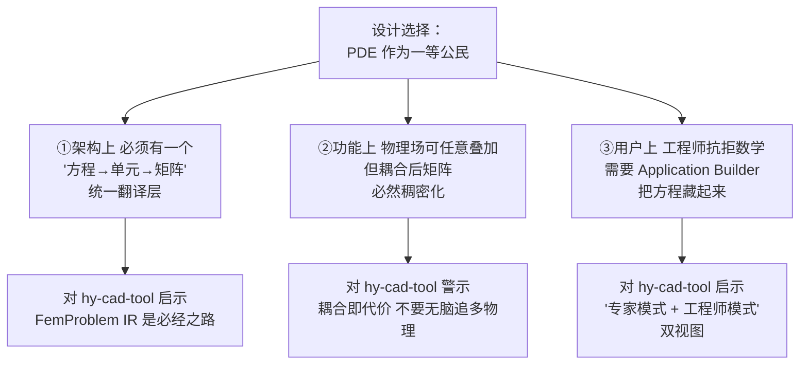

接下来九个章节会展开这张图的每一个分支。

---

## 二、COMSOL 的历史与定位坐标

理解一个软件的架构，必须先理解它的**出生环境**——COMSOL 不是为工业生产线设计的，它是为**研究者把数学公式直接搬上电脑**而设计的。

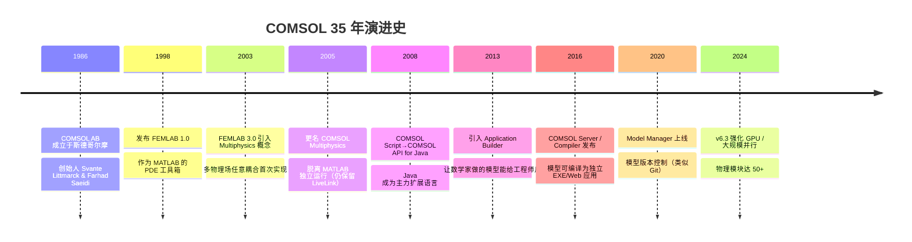

### 2.1 三个定位坐标

| 坐标轴 | COMSOL 的位置 | 对比参考 |
|--------|---------------|----------|
| **科研 ↔ 工程** | 强烈偏科研一侧 | ANSYS 居中、ETABS 偏工程 |
| **单物理 ↔ 多物理** | 极端多物理（电热力流声化）| ABAQUS 偏结构、Fluent 偏流体 |
| **黑箱求解 ↔ 白箱方程** | 几乎白箱（弱形式可编辑） | ABAQUS 黑箱、OpenSees 半白 |

> **一句话定位**：COMSOL = 一个"把 PDE 求解器、几何核、网格器、可视化"打包给科研工作者的瑞士军刀。它的所有架构决策都来自这个定位。

### 2.2 商业模型与许可

| 项 | 说明 |
|----|------|
| **基础包** | COMSOL Multiphysics 内核（必买）：约 ¥40,000 ~ ¥80,000/license/年 |
| **模块** | 50+ 物理模块单独购买：每个 ¥30,000 ~ ¥100,000/年 |
| **LiveLink** | 与 MATLAB/SolidWorks/Excel 等的桥接：每个 ¥20,000+/年 |
| **CFD/RF/Plasma** | 高端模块单价更高 |
| **典型企业组合** | 凑齐 5~8 个模块，年费可达 ¥200,000 ~ ¥500,000 |

> **对 hy-cad-tool 的启示**：COMSOL 的**模块化经济**值得借鉴——核心引擎+垂直行业模块分开售卖，比 ANSYS "买大包"更灵活；但也要警惕"模块越拆越碎、用户凑不齐"的反向陷阱（Dlubal RFEM 中后期也踩过）。

---

## 三、整体架构总览：七层 + 一总线

COMSOL 的官方文档从未公开过完整架构图，但从其 API、文件格式、扩展点反推，可以画出如下**七层 + 一总线**的架构：

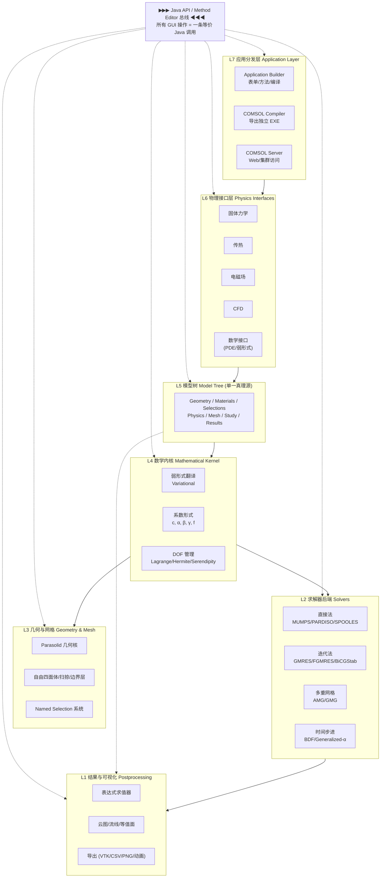

### 3.1 各层职责一句话

| 层 | 职责 | 等价于 hy-cad-tool 哪一层 |
|----|------|---------------------------|
| **L7 应用分发** | 把模型包装成 EXE/Web app 给非专家用 | 暂无对应（未来 `IAppExport`） |
| **L6 物理接口** | 把"传热""结构"等领域语言映射为方程 | `IElementFormulationPlugin` + `IDomainToFemTranslator` |
| **L5 模型树** | 单一真理源；所有数据挂在树上 | `FemProblem` + `SceneGraph` |
| **L4 数学内核** | PDE → 弱形式 → 离散方程组 | `IFemAssembler` |
| **L3 几何与网格** | Parasolid + 自动网格 | `hyob` 几何 + 网格生成 |
| **L2 求解器** | LAPACK/MUMPS/迭代法/时间步 | `ISolverBackend` |
| **L1 结果** | 可视化与表达式后处理 | `IResultRecorder` + Blender 可视化 |
| **总线 Java API** | 任何 GUI 操作都有等价代码 | `CommandBus` + Roslyn 脚本 |

### 3.2 为什么是"模型树"而不是"项目流水线"

ANSYS Workbench 用的是 **DAG（Project Schematic）**，COMSOL 用的是**单一根模型树**。两种范式各有优劣：

| 范式 | 代表 | 优势 | 劣势 |
|------|------|------|------|
| **DAG 流水线** | ANSYS Workbench | 多算例并行清晰 | 跨算例共享数据麻烦 |
| **单一模型树** | COMSOL | 共享 Selections/Materials 简单 | 多算例需在 Study 子树并列 |

> **对 hy-cad-tool 的启示**：道路工程项目天然是**"一个工程多个分析阶段"**（线弹性沉降 → 固结分析 → 稳定验算 → 抗震评估），更适合**单一模型树 + 多 Study 子树**范式，而非 Workbench 式的项目分图。这是 hy-cad-tool `FemProblem` 设计的关键参考。

---

## 四、数学内核：PDE 一等公民的代价与红利

这是 COMSOL 架构里**最与众不同**也**最值得深挖**的部分。

### 4.1 弱形式（Weak Form）作为底层 IR

所有 COMSOL 物理接口最终都翻译为**统一的弱形式**：

\[
\int_\Omega \left[ -c\,\nabla u \cdot \nabla v - a\,u\,v + f\,v \right] d\Omega + \int_{\partial\Omega} g\,v\,dS = 0
\]

或在 COMSOL 内部更通用的形式（**系数形式 PDE，Coefficient Form**）：

\[
e_a \frac{\partial^2 u}{\partial t^2} + d_a \frac{\partial u}{\partial t} + \nabla \cdot (-c\,\nabla u - \alpha u + \gamma) + \beta \cdot \nabla u + a u = f
\]

GUI 上称作 **"Coefficient Form PDE"** 物理接口，用户可以直接输入 \( e_a, d_a, c, \alpha, \beta, \gamma, a, f \) 八个系数（可以是张量、依赖变量、依赖空间坐标）。

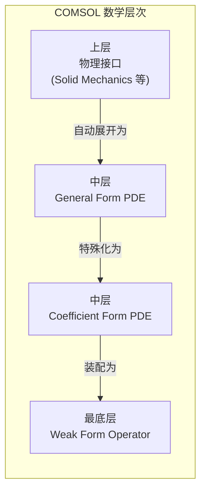

| 层 | 谁用 | 自由度 | 投入产出比 |
|----|------|--------|-----------|
| **Weak Form** | 数学家/PDE 研究者 | 100% | 极高门槛 |
| **General Form** | 应用数学/科研工程师 | 90% | 中门槛 |
| **Coefficient Form** | 偏物理的工程师 | 70% | 较低门槛 |
| **Physics Interface** | 行业工程师 | 30%（受模块设计约束）| 低门槛 |

### 4.2 这种"多层数学暴露"的红利

| 红利 | 说明 | 其他 FEA 软件做不到的事 |
|------|------|--------------------------|
| **任意新物理** | 写一组 PDE 立刻能算 | ABAQUS 需写 UEL/UMAT C++ |
| **教学神器** | 学生看到的就是公式而非黑箱 | OpenSees 也开源但抽象重 |
| **耦合自由** | 任意 PDE 间共享变量 | Nastran 各 SOL 间需文件传递 |
| **学术发表友好** | 文章里的公式 = 软件里的公式 | 几乎独有 |

### 4.3 这种设计的代价

| 代价 | 说明 | 后果 |
|------|------|------|
| **耦合矩阵稠密化** | 任意场都共享 DOF 时 sparse 模式急剧恶化 | 大模型直接内存爆 |
| **工程师抗拒** | 输 PDE 系数比输 E、ν 难十倍 | 必须有 Physics Interface 包装 |
| **求解器调优难** | 用户不懂矩阵性质，无法选合适解法 | 默认 MUMPS → 内存炸 |
| **网格离散化复杂** | 不同物理场对单元阶次需求不同 | 引入 Physics-controlled mesh |

### 4.4 对 hy-cad-tool 的启示

**应学习**：

- ✅ 在 `FemProblem` 内部定义一个**统一弱形式表达**（即使初期只支持线弹性），把"装配"和"物理含义"解耦——这是底座可演进的关键。
- ✅ 提供"**专家模式**" Roslyn 脚本入口，让高级用户直接输入弱形式，类似 `Coefficient Form PDE`。

**不应模仿**：

- ❌ **不要把弱形式作为默认 UI**——COMSOL 自己也用 Application Builder 把它藏起来。hy-cad-tool 应直接走"工程语言为先"的路（挡土墙、桩、路基），弱形式作为隐藏的"管理员入口"。
- ❌ **不要承诺通用多物理**——道路工程 90% 是单物理（结构）+ 准静态固结（弱耦合），无需引入 COMSOL 那种"任意 PDE 任意耦合"的复杂性。

---

## 五、几何与网格系统

COMSOL 的几何引擎是它"高端"的一个标志，也是它"重"的一个原因。

### 5.1 双几何核策略

```mermaid
graph TB
    subgraph default ["默认几何核"]
        CD["COMSOL Native Kernel<br/>自研、轻量、跨平台"]
    end
    subgraph cad ["CAD 模块（可选购）"]
        PARA["Parasolid 内核<br/>Siemens 授权"]
    end
    User["用户工程"]
    User -->|"简单几何"| CD
    User -->|"导入 STEP/IGES/SAT/CATIA"| PARA
    CD --> Mesh
    PARA --> Mesh
    Mesh["网格层"]
```

| 几何核 | 何时启用 | 优势 | 劣势 |
|--------|----------|------|------|
| **COMSOL Native** | 默认 | 跨平台、轻量 | 复杂 NURBS 处理弱 |
| **Parasolid** | 买 CAD Import Module | 工业级、与 NX/SolidWorks 一致 | 增加 license 费 |

> **对 hy-cad-tool 的启示**：hy-cad-tool 用 **OCC（Open Cascade）** 是正确选择——OCC 是 Parasolid 的开源平替，授权友好；不需要学 COMSOL 自维护两套几何核。

### 5.2 Selections 系统：被低估的核心抽象

COMSOL 最被严重低估的一个设计是 **Named Selections（具名选择集）**。

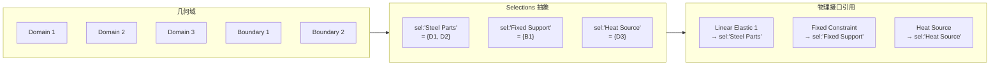

**为什么是核心抽象**：

- 几何修改后，**Selection 自动更新**（基于规则而非 ID）；
- 物理/材料/荷载/边界条件**全部通过 Selection 引用**，几何与物理实现真正解耦；
- **跨 Study 共享**（一个 Selection 可被多个分析使用）；
- 支持**布尔代数**（A ∪ B、A ∩ B、A \ B）和**几何谓词**（按坐标/法向/标记）。

**对 hy-cad-tool 的启示**：

```csharp
public interface IDomainSelection
{
    string Name { get; }
    SelectionKind Kind { get; }  // Volume / Surface / Edge / Vertex
    IReadOnlyList<EntityId> Resolve(IGeometryView geom);
}

public sealed class TaggedSelection : IDomainSelection { /* 按 Tag 解析 */ }
public sealed class PredicateSelection : IDomainSelection { /* 按谓词解析 */ }
public sealed class BooleanSelection : IDomainSelection { /* A ∪ B 等 */ }
```

> 这个抽象在 hy-cad-tool 里**至少和 `FemProblem` 同等重要**——它是"几何改了 FEM 还能跑"的关键。直接对标 COMSOL Selections + Workbench Named Selection 双重血统。

### 5.3 网格器架构

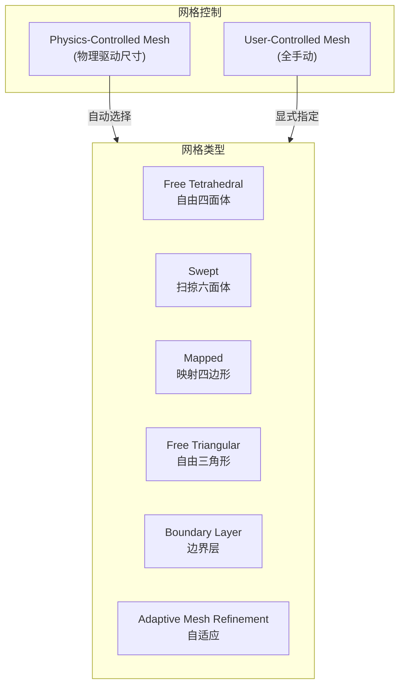

| 关键设计 | 说明 | hy-cad-tool 借鉴 |
|----------|------|------------------|
| **Physics-Controlled Mesh** | 物理接口"告诉"网格器它需要的精度 | `IElementFormulationPlugin` 可声明 `MinDofOrder`、`PreferredSize` |
| **Sweep 扫掠** | 一个面网格沿路径生成体网格 | 路基/桩等规则几何首选 |
| **Boundary Layer** | 边界处加密 | 接触面、岩土滑移面需要 |
| **AMR 自适应** | 基于误差估计自动加密 | hy-cad-tool 可作为 P2 阶段引入 |

> **对比 hy-cad-tool 现状**：hy-cad-tool 走 OCC + Netgen/Gmsh 路线，能力上 90% 对齐 COMSOL Free Tet，但 **Physics-Controlled Mesh** 的"物理向网格器表达需求"机制是国内自研工具普遍缺失的，值得**优先抄写**。

---

## 六、物理接口层（Physics Interfaces）

这是 COMSOL 把"数学复杂性藏起来给工程师用"的关键层。

### 6.1 物理接口的本质：一个 GUI + 一组方程模板

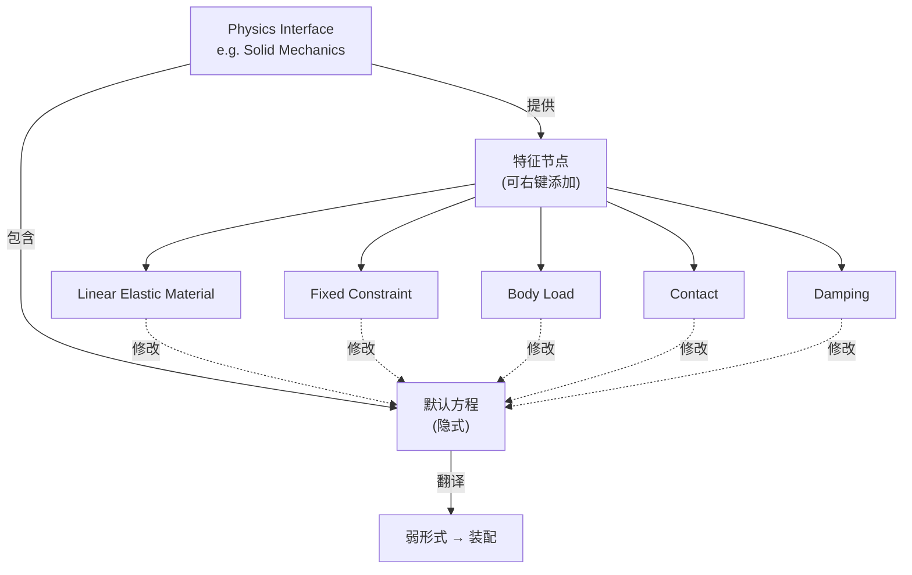

**核心机制**：

- 每个 Physics Interface = 一个"领域 DSL"（如 Solid Mechanics 用应力、应变、E、ν 而非 c、α、β）；
- 用户**右键添加 Features**（边界条件、荷载、阻尼等），每个 Feature 修改默认方程的某些项；
- 内部翻译为统一的 Weak Form 后送入求解器；
- **多个 Physics Interface 可在同一几何上并存**，自动产生耦合变量。

### 6.2 COMSOL 已有的 50+ 物理模块

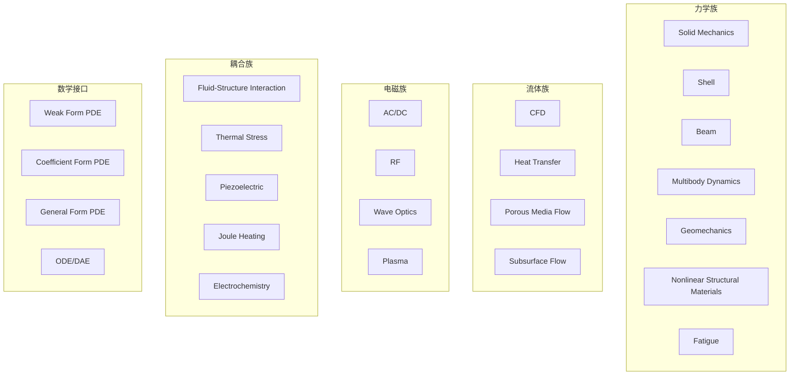

### 6.3 物理接口的契约抽象（反推）

从 COMSOL Java API 反推，每个 Physics Interface 实现以下契约：

```java
// 伪代码 - 反推
public interface PhysicsInterface {
    String getTag();                              // "solid"
    DomainKind getApplicableTo();                 // Volume/Surface/Edge
    List<DofVariable> getDofs();                  // {u, v, w}
    List<Feature> getDefaultFeatures();           // 默认本构 + 默认 BC
    WeakFormContribution toWeakForm(Selection s); // 翻译为弱形式
    MeshRequirement getMeshRequirement();         // Physics-Controlled Mesh 钩子
    List<CouplingVariable> getExposedCouplings(); // 用于多物理
}
```

**对 hy-cad-tool 的启示——重要接口设计参考**：

```csharp
public interface IPhysicsInterface
{
    string Tag { get; }
    DomainKind ApplicableTo { get; }
    IReadOnlyList<DofVariable> Dofs { get; }
    IReadOnlyList<IPhysicsFeature> DefaultFeatures { get; }

    // 核心方法：把"领域语言"翻译为 IR
    WeakFormContribution Contribute(
        FemProblem problem,
        IDomainSelection selection,
        IPhysicsContext ctx);

    MeshRequirement GetMeshRequirement(IDomainSelection selection);

    // 多物理耦合的"暴露变量"
    IReadOnlyList<CouplingVariable> ExposedCouplings { get; }
}
```

> 这个接口设计如果在 hy-cad-tool 早期就锁定，未来 5 年新增物理场都不需要改核心。**这是 COMSOL 35 年仍能扩展的最大秘密——契约稳定**。

### 6.4 警示：物理接口的"过度承诺"陷阱

COMSOL 由于物理接口数量过多，出现了几个隐患：

| 隐患 | 表现 | 教训 |
|------|------|------|
| **接口语义漂移** | 同一参数（如阻尼比）在不同模块定义不一致 | 必须有**跨模块术语表**约束 |
| **耦合矩阵爆炸** | 用户随手叠加 5 个物理 → 内存炸 | 必须有**耦合预算告警** |
| **新手难选** | 50+ 模块，用户不知该用哪个 | 必须有**Wizard / 推荐器** |

> **对 hy-cad-tool 的启示**：道路工程涉及的物理种类有限（结构 + 渗流 + 热 + 抗震），可控制在 **5~8 个 Physics Interface 内**；不要追 COMSOL 的"全物理覆盖"。

---

## 七、求解器架构：直接法的甜蜜与毒药

COMSOL 的求解器层是它**最被诟病**也**最值得学习**的部分。

### 7.1 求解器总览

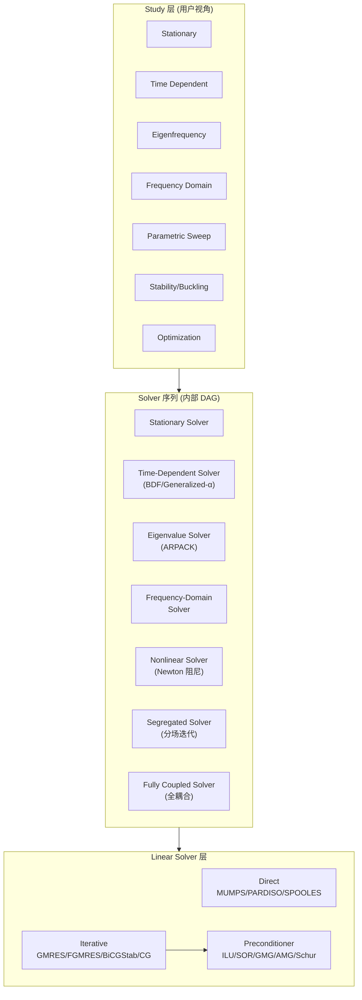

### 7.2 几个关键设计决策

#### ① 分场求解 vs 全耦合求解

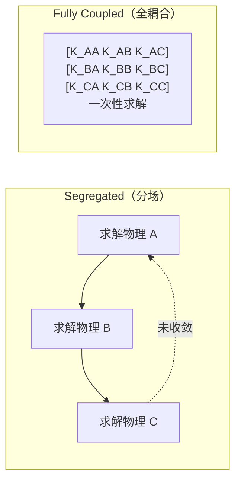

| 方式 | 适用 | 内存 | 收敛 |
|------|------|------|------|
| **Segregated** | 弱耦合（如热-力） | 低 | 慢但稳 |
| **Fully Coupled** | 强耦合（如压电） | 高（接近 N²）| 快但易发散 |

COMSOL 默认会**根据物理组合自动选**——这是其"多物理直观"的底层支撑。

#### ② 默认 MUMPS：高斯白噪音问题

COMSOL 默认使用 **MUMPS 多前缘直接法**。这对**中小模型**（< 50 万 DOF）非常友好，鲁棒、不需调参；但对**大模型**（> 200 万 DOF）会**内存爆炸**——这是用户社区抱怨最多的痛点。

> **对 hy-cad-tool 的启示**：
> - ✅ **默认直接法**这条很好——工程师不需要懂迭代法；
> - ⚠️ 但必须有**规模告警**——当 DOF > 阈值（如 30 万）时自动建议切换到迭代法；
> - ✅ 提供 `ISolverBackend` 多实现（直接 / 迭代 / GPU / 外部 CalculiX）让用户/系统按规模切换。

#### ③ 牛顿阻尼器：非线性收敛的细节

COMSOL 的牛顿求解器内置：

- **自动阻尼系数**（damping factor，0~1）；
- **回溯线搜索**；
- **加载步细化**（auxiliary continuation）；
- **重启策略**。

这套机制使得它在**强非线性问题**上比 OpenSees 默认配置更鲁棒，但比 ABAQUS 仍差一档。

### 7.3 时间步进：BDF 与 Generalized-α

| 时间求解器 | 适用 | 阶次 | 稳定性 |
|------------|------|------|--------|
| **BDF** | 一阶/二阶 ODE/DAE | 1~5 | A-稳定 |
| **Generalized-α** | 结构动力学 | 2 | 数值阻尼可控 |
| **Runge-Kutta** | 显式问题 | 2~5 | 条件稳定 |

> **对 hy-cad-tool 的启示**：道路沉降的**固结问题**（Biot 方程）天然是 DAE 形式，BDF 是首选——但 hy-cad-tool 短期可以**外接 PETSc/Sundials**而非自研。

---

## 八、Application Builder + Method Editor

这是 COMSOL 在 2013 年引入的、被严重低估的**架构革新**，也是 hy-cad-tool 必须深入研究的部分。

### 8.1 它解决了什么问题

**问题陈述**：物理学家做出来的 COMSOL 模型，工程师不会用——参数太多、几何概念太抽象、菜单太深。

**COMSOL 的解决方案**：

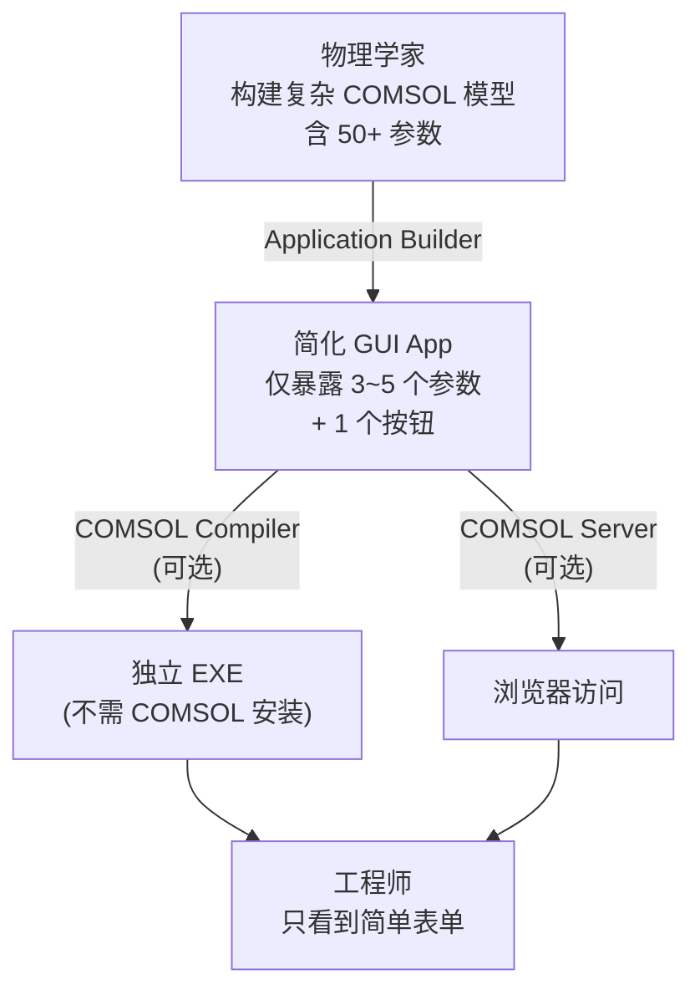

### 8.2 Application Builder 三件套

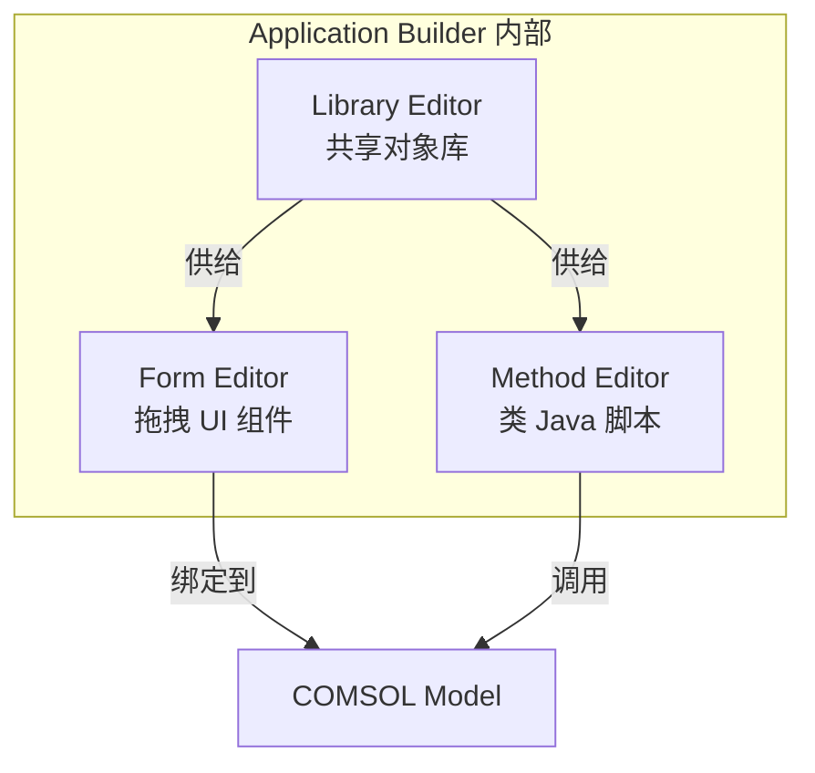

| 组件 | 作用 | 等价物 |
|------|------|--------|
| **Form Editor** | 设计简化 UI（输入框、按钮、图表）| Visual Studio Forms Designer |
| **Method Editor** | 写自动化逻辑（参数化、循环、生成报告）| Excel VBA + LiveLink |
| **Library Editor** | 复用资源（材料库、几何库） | NuGet/Asset |

### 8.3 Method Editor 的本质：Java API 暴露

Method Editor 写的是**简化版 Java**（叫 "COMSOL Method Language"），直接调用 COMSOL Java API。例如：

```java
// COMSOL Method 示例（伪 Java）
public void runStudy() {
    model.param().set("L", "0.5[m]");
    model.geom("geom1").run();
    model.mesh("mesh1").run();
    model.study("std1").run();
    double max_stress = model.result().numerical("max1").getReal()[0][0];
    if (max_stress > 250e6) {
        alert("Stress exceeded 250 MPa: " + max_stress / 1e6 + " MPa");
    }
}
```

**关键洞察**：**GUI 的每一次点击都有等价的 Java 调用**——这就是上一节"七层 + 一总线"中那条"总线"的本质。

### 8.4 对 hy-cad-tool 的启示——重大架构方向

这一节的启示**比 COMSOL 任何其他部分都重要**：

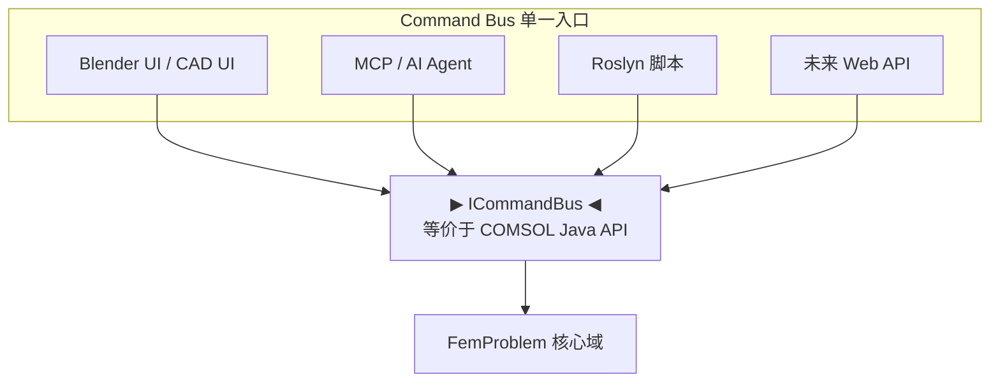

**应做**：

1. ✅ 把 `ICommandBus` 当作 hy-cad-tool 的"COMSOL Java API"——**所有 UI 操作 = 一条命令**；
2. ✅ 设计 **`IApplicationTemplate`**（对标 Application Builder）：让专家配置好"挡土墙稳定性验算 Wizard"后，工程师只看到 3 个输入框；
3. ✅ Roslyn 脚本入口对标 Method Editor——工程师可以写小自动化（"循环 5 种回填材料跑稳定性"）；
4. ✅ **GUI 操作录制为命令脚本**（类似 ANSYS 的 logfile），是"等价 Java"的实现细节。

**不应做**：

- ❌ 不要自做编译器（COMSOL Compiler 把模型编译为 EXE 是商业策略，hy-cad-tool 完全用不上）；
- ❌ 不要做完整 Form Designer——Blender UI 已经够好，**仅需 `IApplicationTemplate` 把工程师该看到的字段声明出来**。

---

## 九、MPH 文件格式与持久化

### 9.1 .mph 是什么

COMSOL 的 `.mph` 文件是一个 **ZIP 容器**，包含：

```
model.mph (ZIP)
├── model.xml              ← 模型树结构（核心）
├── geometry/              ← 几何（Parasolid x_t 或 native）
├── mesh/                  ← 网格（二进制）
├── solution/              ← 解（位移、应力等，二进制）
├── results/               ← 后处理（图表配置）
├── images/                ← 缩略图
└── manifest.xml           ← 元数据与版本
```

**关键设计**：

| 决策 | 后果 |
|------|------|
| **单文件容器** | 拷贝/邮件/版本管理友好 |
| **包含 solution** | 文件可大到 GB 级 |
| **XML 结构** | 可 diff 但解析慢 |
| **Java 序列化遗留** | 跨版本兼容性偶有问题 |

### 9.2 与 hyob 的对比

| 维度 | COMSOL .mph | hy-cad-tool `hyob` |
|------|-------------|---------------------|
| **格式** | ZIP + XML + 二进制 | 文本（YAML/TOML，倾向） |
| **包含解** | 默认包含 | **不应包含** |
| **可 diff** | XML 部分可，二进制不可 | 全文本，完全可 diff |
| **结果分离** | 否（一切在 mph） | 是（`*.hyob` 仅模型，`*.result.parquet` 单独）|

> **对 hy-cad-tool 的启示**：**模型与解必须分离**——这是 COMSOL 用户最痛的一点（一个文件 5GB 没法发邮件）。`hyob` 做到这点就胜出。

### 9.3 Model Manager：COMSOL 的版本控制

2020 年 COMSOL 引入 **Model Manager**，本质是给 .mph 文件套了一个**类 Git 的版本控制**——但因为 mph 是二进制，diff 体验极差。

> **对 hy-cad-tool 的启示**：**直接基于 Git** 是正确选择——只要 `hyob` 是文本，Git 是天然版本控制器；不需要自做 Model Manager。

---

## 十、LiveLink 互操作

COMSOL 通过 **LiveLink** 系列模块与外部世界连接：

| LiveLink | 方向 | 用途 |
|----------|------|------|
| **MATLAB** | 双向 | 矩阵级别数据互操作 |
| **Excel** | 双向 | 参数化 + 报表 |
| **SolidWorks/Inventor/Creo/AutoCAD/Revit** | 几何同步 | CAD 改 → COMSOL 几何跟随 |
| **Simulink** | 实时仿真 | 控制系统耦合 |

### 10.1 LiveLink for CAD 的"关联式建模"

这是 COMSOL 与上游 CAD（SolidWorks 等）保持**几何关联**的关键能力：

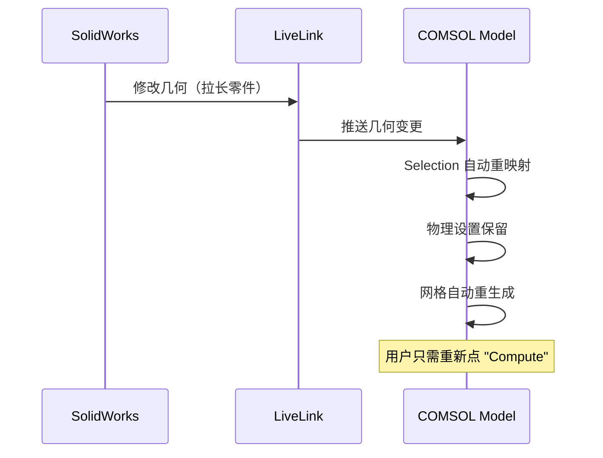

**关键能力**：

- 几何修改后，**Named Selections 通过启发式（位置/标记）自动重绑定**；
- 失败的绑定会**显式标红**让用户介入。

> **对 hy-cad-tool 的启示**：这正是 hy-cad-tool 的核心场景之一——**CAD 改了 FEM 还能跑**。Selection 系统 + StaleTracker 是关键，COMSOL 的"标红待绑定"是优秀的 UX 范式。

---

## 十一、性能与扩展

### 11.1 并行模型

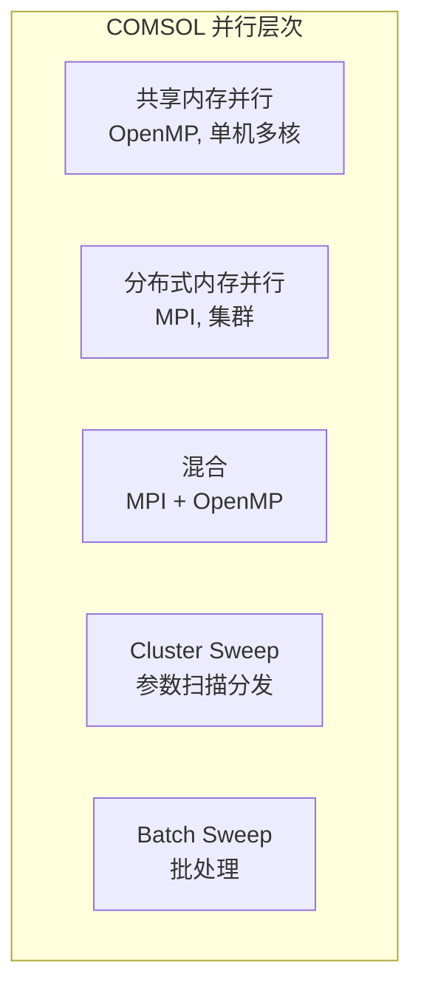

| 并行 | 适用 | 扩展性 |
|------|------|--------|
| **SMP** | 中小模型 | 4~16 核线性 |
| **DMP/MPI** | 大模型 | 32~256 核可用，需 HPC pack 许可 |
| **Cluster Sweep** | 参数扫描 | 接近线性扩展 |

### 11.2 GPU 支持

COMSOL 在 v6.0+ 引入有限的 GPU 支持，目前主要用于：

- 部分迭代求解器（GMRES 的 SpMV）；
- 后处理可视化（OpenGL）。

**仍未达到 LS-DYNA / ABAQUS Explicit 的 GPU 实力**。

### 11.3 内存模型

COMSOL 的"内存爆炸"主要来自：

1. **默认 MUMPS** 直接法的填充因子（fill-in）；
2. **全耦合求解器**导致的稠密化；
3. **Java GUI 自身**的额外开销（典型 1~2 GB）。

> **对 hy-cad-tool 的启示**：**不要把 GUI 进程与求解进程合一**——COMSOL 的痛点之一就是 Java GUI 占去内存。hy-cad-tool 的 **Blender/CAD 前端 + 独立 Solver 子进程**是更好的隔离。

---

## 十二、优劣权衡表（对 hy-cad-tool 视角）

| 维度 | COMSOL 做法 | 评级 | hy-cad-tool 借鉴策略 |
|------|-------------|:----:|----------------------|
| **PDE 一等公民** | Coefficient/General/Weak Form | 高 | 内部 IR 借鉴，UI 不暴露 |
| **Physics Interface 契约** | Java 接口 + Feature 树 | 极高 | `IPhysicsInterface` 直接对标 |
| **Named Selections** | 几何引用解耦 | 极高 | **必须实现** |
| **Physics-Controlled Mesh** | 物理向网格表达需求 | 高 | 优先实现 |
| **Model Tree 单一真理源** | 所有数据挂在树上 | 高 | `FemProblem` 对标 |
| **GUI = Java API 等价** | 命令总线雏形 | 极高 | `ICommandBus` 对标 |
| **Application Builder** | 专家配置 + 工程师用 | 极高 | `IApplicationTemplate` 对标 |
| **Method Editor** | 类 Java 脚本 | 高 | Roslyn 脚本对标 |
| **Compiler / Server** | 模型编译为 EXE/Web | 低 | 不需要 |
| **默认 MUMPS** | 直接法 + 内存爆 | 中 | 借策略不借默认参数 |
| **Fully Coupled Solver** | 任意物理强耦合 | 中 | 暂不需要 |
| **MPH 单文件容器** | 含解的 ZIP | 低 | **反向设计：模型/解分离** |
| **Model Manager** | 自做版本控制 | 低 | **用 Git 代替** |
| **LiveLink CAD** | 几何关联式建模 | 极高 | **核心场景，必须实现** |
| **50+ 物理模块** | 全物理场覆盖 | 低 | **不要追，5~8 个够** |
| **Java GUI 重量级** | 启动慢、内存高 | 负 | **避免：进程隔离** |
| **弱形式默认 UI** | 数学语言为先 | 负 | **避免：工程语言为先** |

> 评级解读：**极高/高 → 直接对标**；**中 → 部分借鉴**；**低/负 → 不学或反向设计**。

---

## 十三、深度提炼：COMSOL 给 hy-cad-tool 的 7 条架构 DNA

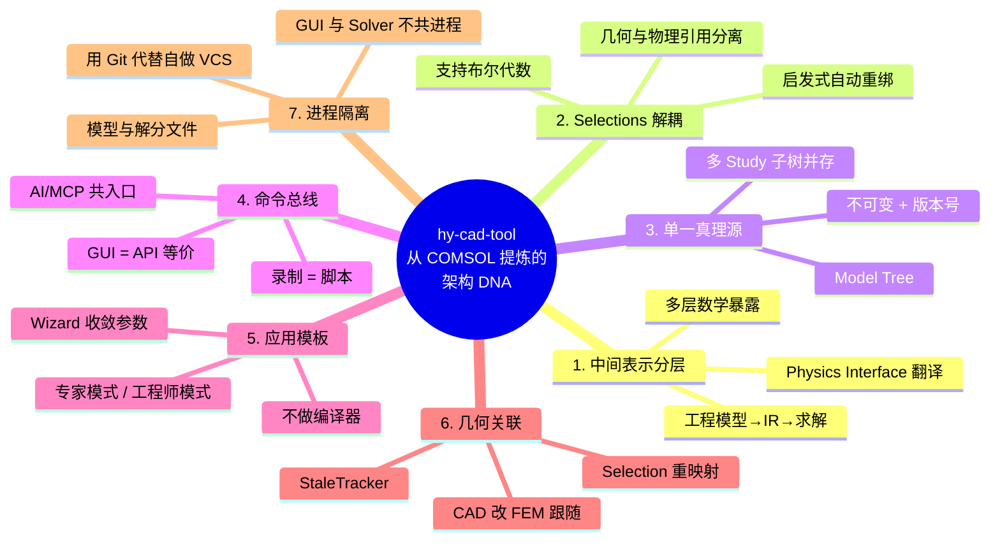

### 13.1 七条 DNA 详细注解

| # | DNA | 一句话 | 落地动作 |
|---|-----|--------|----------|
| 1 | **中间表示分层** | 工程 ≠ 数学 ≠ 矩阵 | `FemProblem` IR 必须有 |
| 2 | **Selections 解耦** | 几何与物理通过命名集引用 | `IDomainSelection` 三态（Tagged/Predicate/Boolean）|
| 3 | **单一真理源** | 所有状态挂在一棵树 | `FemProblem` 不可变 + 版本号 |
| 4 | **命令总线** | UI 操作等价 API 调用 | `ICommandBus` 单入口 |
| 5 | **应用模板** | 专家配 Wizard，工程师填表 | `IApplicationTemplate` + Roslyn |
| 6 | **几何关联** | CAD 改了 FEM 跟得上 | `StaleTracker` + Selection 重映射 |
| 7 | **进程隔离** | GUI 不背求解器的内存 | Solver 子进程 + 模型/解分文件 |

---

## 十四、对 hy-cad-tool 立即可执行的对标动作

| 优先级 | 动作 | 对标 COMSOL 部位 | 工作量 |
|--------|------|------------------|--------|
| **P0** | 起草 `IDomainSelection` 三态接口 + 几何变更重绑试验 | Named Selections | 1 周 |
| **P0** | 起草 `IPhysicsInterface` 契约（5 个方法）| Physics Interface 反推契约 | 1 周 |
| **P0** | 验证 `ICommandBus` 能完整记录 + 回放一次"挡土墙稳定分析" | GUI = Java API | 3 天 |
| **P1** | 起草 `IApplicationTemplate` + 一个挡土墙 Wizard 原型 | Application Builder Form Editor | 2 周 |
| **P1** | `FemProblem` 加版本号 + immutable record；`StaleTracker` 雏形 | Model Tree + Refresh Required | 1 周 |
| **P1** | 设计 `hyob` 文本格式时**确认模型与解分离** | 反向避坑 .mph | 0.5 天 |
| **P2** | `Physics-Controlled Mesh` 钩子（`IPhysicsInterface` 暴露 MeshRequirement）| Physics-Controlled Mesh | 1 周 |
| **P2** | Roslyn 脚本入口 + 录制 GUI 操作为脚本 | Method Editor | 2 周 |
| **P3** | 评估 OCC + Parasolid 互导（如未来要接 SolidWorks） | LiveLink for CAD | 1 周 |

---

## 十五、反陷阱清单（hy-cad-tool 必须避免的 COMSOL 走过的坑）

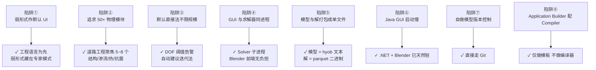

---

## 十六、与系列其他文档的关系

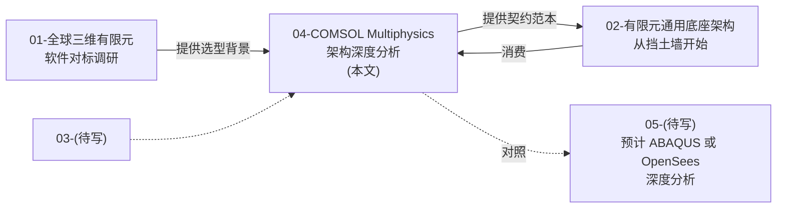

| 文档 | 角色 | 与本文关系 |
|------|------|-----------|
| **01 对标调研** | 鸟瞰 25 款产品 | 本文是 01 中 COMSOL 一行评价的纵深展开 |
| **02 通用底座** | 给出 hy-cad-tool 的 5 层架构 | 本文是 02 中 `IPhysicsInterface`、`IDomainSelection` 的来源依据 |
| **05 ABAQUS（预计）** | 非线性标杆深度分析 | 与本文形成"多物理 vs 强非线性"双标杆 |

---

## 十七、参考资料

### 17.1 官方文档与白皮书

- **COMSOL Multiphysics Reference Manual** — 求解器、单元、PDE 形式权威文档
- **COMSOL Application Builder User's Guide** — Form Editor 与 Method Editor 详解
- **COMSOL Multiphysics Programming Reference Manual** — Java API 完整接口
- **COMSOL Server Manual** — 集群部署与 Web 访问
- **LiveLink™ for SolidWorks/Inventor/AutoCAD User's Guide** — 几何关联式建模实现
- **Introduction to COMSOL Multiphysics**（每年随新版本更新的白皮书）

### 17.2 数学基础

- Zienkiewicz, Taylor & Zhu — *The Finite Element Method*（弱形式/系数形式 PDE 数学源头）
- Hughes — *The Finite Element Method: Linear Static and Dynamic Finite Element Analysis*
- Bathe — *Finite Element Procedures*（COMSOL 求解器选型理论参考之一）

### 17.3 求解器原生文档

- **MUMPS** Users' Guide — 多前缘直接法
- **PARDISO** Reference Manual — Intel 多线程直接法
- **PETSc / Hypre** — 迭代法与 AMG 预条件子参考
- **ARPACK** — 大规模特征值算法

### 17.4 系列对照阅读

- 本仓库 [`01-全球三维有限元软件对标调研-2026-05-14.md`](../../01-全球三维有限元软件对标调研-2026-05-14.md) — 调研背景
- 本仓库 [`02-有限元通用底座架构-从挡土墙开始-2026-05-14.md`](../../02-有限元通用底座架构-从挡土墙开始-2026-05-14.md) — hy-cad-tool 底座设计
- 参考方法论：`E:\HyTool\Doc\` 下的 "软件—借鉴与超越" 系列分析框架

---

## 修订记录

| 日期 | 修订人 | 说明 |
|------|--------|------|
| 2026-05-14 | — | 初版：COMSOL Multiphysics 七层+一总线架构剖析、7 条架构 DNA 提炼、9 条立即对标动作、8 条反陷阱清单 |
