# Siemens Simcenter 有限元计算架构深度分析（NX Nastran + Femap + STAR-CCM+）

> 文档日期：2026-05-14
> 上承：
> - [01-全球三维有限元软件对标调研-2026-05-14](../../01-全球三维有限元软件对标调研-2026-05-14.md)
> - [02-有限元通用底座架构-从挡土墙开始-2026-05-14](../../02-有限元通用底座架构-从挡土墙开始-2026-05-14.md)
>
> 调研对象：Siemens Digital Industries Software 的 **Simcenter 仿真组合**，重点剖析以下三块的内部架构、数据通路与协作模型：
> 1. **NX Nastran** —— 结构求解器内核（继承自 MSC Nastran 1971 年代码）
> 2. **Femap** —— CAD 中立的前后处理器
> 3. **STAR-CCM+** —— 多物理 CFD/CAE 平台（CD-adapco 2016 年并入 Siemens）
>
> 写作目的：
> - 不是介绍"Simcenter 能做什么"，而是逆向其**软件架构、数据契约、扩展机制、协作总线**；
> - 提炼对 hy-cad-tool（C# + Blender + DWG 三轨）的可借鉴模式与必须规避的陷阱；
> - 给出 hy-cad-tool **L0~L5 五层底座**与 Simcenter 各组件的精确对标映射。

---

## 一、Simcenter 全家桶的版图与"FEM 三件套"的定位

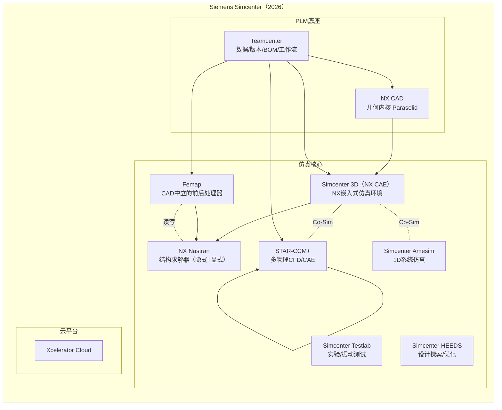

| 组件 | 定位 | 历史血缘 | 内核语言 | 在 Simcenter 体系内的角色 |
|------|------|----------|----------|---------------------------|
| **NX Nastran** | 结构求解器 | MSC Nastran NASA 血脉 → 2003 UGS 买断永久授权 | Fortran 77/90 + C | "心脏"——一切结构计算的最终落点 |
| **Femap** | 前后处理器 | Enterprise Software Products (ESP, 1985) → 1999 SDRC → 2007 Siemens | Delphi/Pascal + COM + C++ | "中立大脑"——故意不依赖任何 CAD |
| **Simcenter 3D / NX CAE** | NX 内嵌仿真 | UG 时代 Scenario for Structures | C++ + KF (Knowledge Fusion) | "亲儿子"——与 NX CAD 关联建模 |
| **STAR-CCM+** | CFD/多物理平台 | CD adapco (1980) → 2016 Siemens 并入 | C++ + Java(脚本) | "并行宇宙"——架构与上述三者完全异源 |
| **Teamcenter** | PLM | 多次并购重组 | Java + Oracle/SQL Server | "命名空间"——所有 simulation artifact 的版本管理 |

**关键事实**：Simcenter 是 **2016 年从市场营销层面统合**的品牌，**底层架构从未真正融合**。NX Nastran、Femap、STAR-CCM+ 三者：
- 互相**通过文件 + 中立 API** 通信，**没有共享内存或共享对象图**；
- 各自保留独立的脚本环境（DMAP / API / Java macro）；
- 各自有独立的 license server 与版本节奏。

这是分析其架构的**第一性原理**——必须把"Simcenter"看成三个独立产品 + 一层 Teamcenter 命名空间，**而不是一个一体化系统**。

---

## 二、NX Nastran 内部架构：1971 年的代码如何活到 2026

### 2.1 Executive / Case Control / Bulk Data 三段式输入

NX Nastran 继承了 MSC Nastran 的输入文件结构（`.bdf` / `.dat`），是**整个工程仿真界最具历史厚度的文本契约**。

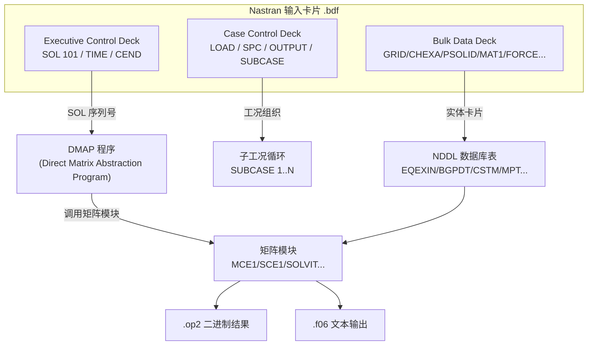

| 区段 | 内容 | 设计哲学 |
|------|------|----------|
| **Executive Control** | 求解序列（`SOL 101` 线性静力、`SOL 103` 模态、`SOL 400` 非线性、`SOL 700` 显式）、`DMAP ALTER` | 告诉求解器"做什么"——一个 SOL 号就是一段 DMAP 程序 |
| **Case Control** | 工况、输出请求、子工况嵌套 | 告诉求解器"算什么、输出什么"——与"做什么"正交 |
| **Bulk Data** | 节点、单元、属性、材料、荷载、约束 | 告诉求解器"是什么模型"——纯数据，无逻辑 |

**架构启示**：这三段式 = **行为 / 工况 / 数据**正交分离。**hy-cad-tool 的 `FemProblem` IR 应当照搬此结构**：

```csharp
public sealed record FemProblem(
    SolutionSequence Procedure,   // 对应 Executive ——做什么
    IReadOnlyList<LoadCase> Cases,// 对应 Case Control ——算什么
    FemModel Model                // 对应 Bulk Data ——是什么
);
```

### 2.2 DMAP：一种被忽视的"求解器编排 DSL"

DMAP（Direct Matrix Abstraction Program）是 Nastran **最被低估但最先进的设计**——求解流程不是硬编码在 Fortran 里，而是用一种**矩阵层级的领域专用语言**描述。

```dmap
$ 经典 SOL 101 简化版（节选）
GP1     GEOM1,GEOM2,/GPL,EQEXIN,GPDT,CSTM,BGPDT,SIL/S,N,LUSET/NOGPDT $
GP2     GEOM2,EQEXIN/ECT $
PARAML  PCDB//'PRESENCE'////S,N,NOPCDB $
GP3     GEOM3,EQEXIN,GEOM2/SLT,GPTT/S,N,NOGRAV $
TA1     ECT,EPT,BGPDT,SIL,GPTT,CSTM/EST,GEI,GPECT,ECPT,ICT/LUSET ... $
EMG     EST,CSTM,MPT,DIT,GEOM2,/KELM,KDICT,MELM,MDICT,BELM,BDICT/S,N,NOKGG ... $
EMA     GPECT,KDICT,KELM/KGG,KGGNL/S,N,NOKGGX/S,N,NOMGG $
SCE1    USET,KGG,MGG,BGG,K4GG/KNN,MNN,BNN,K4NN/V,N,NOSET $
SOLVIT  KLL,PL,LLL,ULL,/UL,/...$
SDR1    USET,PG,UL,UO,...,/UGV,PGG,QG/'STATICS'/SUBCOM ... $
SDR2    CASECC,CSTM,MPT,DIT,EQEXIN,SIL,...,UGV,...,/OPG1,OQG1,OUGV1,OES1,OEF1,PUGV1/'STATICS'/$
```

**DMAP 关键洞察**：
1. **矩阵是一等公民**：`KGG`（全局刚度矩阵）、`MGG`（质量）、`PL`（力）等表名是稳定 API；
2. **模块 = 算子**：`SCE1`（消除单点约束）、`SOLVIT`（迭代求解）、`SDR1`（位移恢复）每个都是独立 Fortran 子程序；
3. **`DMAP ALTER` = 用户级求解流程注入**：用户可以在 SOL 101 任意位置插入自定义矩阵运算，**这是 1971 年版的"插件式求解器"**。

### 2.3 NDDL：Nastran 数据库

Nastran 内部有一个 **NDDL（Nastran Data Definition Language）** 描述的**关系型数据字典**，所有矩阵和表都注册在内。

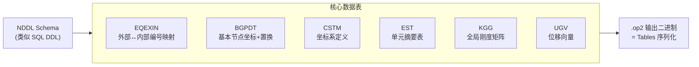

**`.op2` 文件 = NDDL 表的二进制 dump**——这就是为什么 OP2 解析器（如 PyNastran、Femap、HyperView）能稳定工作 40 年：**数据契约是显式声明的**。

> **hy-cad-tool 启示**：
> - `hyob` 应该有一份类似 NDDL 的 **Schema 声明**（YAML/JSON Schema），所有领域对象在此注册；
> - "数据字典优先于代码"是 Nastran 长寿的根本原因——hy-cad-tool 应警惕"对象图先行、Schema 事后补"的反模式。

### 2.4 SOL 序列体系：FEM 计算的"配方书"

| SOL 号 | 名称 | 物理 | 数学 | 典型应用 |
|--------|------|------|------|----------|
| **101** | 线性静力 | $Ku=F$ | 直接法/稀疏 LU | 标准强度校核 |
| **103** | 模态分析 | $(K-\lambda M)\phi=0$ | Lanczos | 频率/振型 |
| **105** | 屈曲 | $(K+\lambda K_\sigma)\phi=0$ | 子空间迭代 | 稳定性 |
| **108** | 直接频响 | $(K+i\omega C-\omega^2 M)u=F$ | 复数直接法 | NVH |
| **111** | 模态频响 | 投影到模态空间 | 模态叠加 | 大模型频响 |
| **129** | 直接瞬态 | Newmark/HHT 隐式 | 时步迭代 | 非线性瞬态 |
| **200** | 设计优化 | SQP/MMA | 灵敏度分析 | 结构优化 |
| **400** | 通用非线性 | 接触/材料/几何 | 弧长 + Newton | 多步骤非线性 |
| **600** | 通用非线性（Marc 集成） | 大变形/接触 | 与 Marc 共享内核 | 高度非线性 |
| **700** | 显式 (LS-DYNA 风格) | 中心差分 | 显式时间积分 | 碰撞/冲击 |

**架构洞察**：`SOL 400` 和 `SOL 600` 反映了 Nastran 的**渐进式扩展史**——遇到搞不定的非线性，就**外挂一个新内核**（Marc），但**保留同一套输入卡片语法**。

> **hy-cad-tool 启示**：当求解能力遇到瓶颈时，**对外保持 `IAnalysisProcedure` 接口稳定，对内允许多个 backend 共存**，正是 SOL 400/600 的教训。

### 2.5 NX Nastran 的并行模型

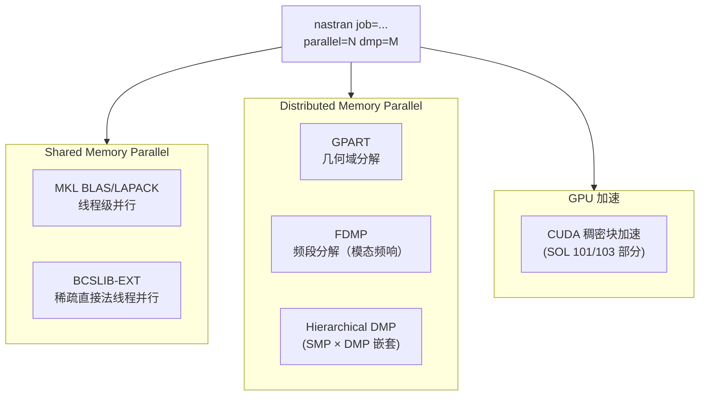

- **SMP**：单机多核，主要靠 Intel MKL 与稀疏求解器线程；
- **DMP**：MPI 集群，**域分解**（GPART）或**频域分解**（FDMP，模态频响特有）；
- **GPU**：仅对稠密块（如 Lanczos 中间步）加速，**不是端到端 GPU 求解**。

> **hy-cad-tool 启示**：道路工程模型量级（<1M 自由度）单机 SMP 已足够；不要在初期搞 DMP，**ROI 极低**。

---

## 三、Femap 内部架构：CAD 中立的"瑞士军刀"

### 3.1 三层架构与"模型对象树"

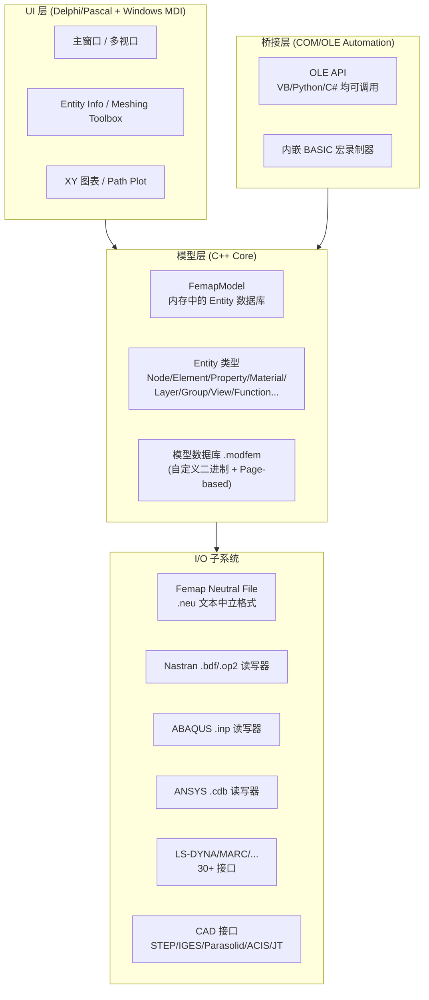

**Femap 的设计核心是"中立"**：
- **CAD 中立**：通过 Parasolid（同 NX 内核）+ ACIS + STEP/IGES/JT 容纳几乎所有 CAD；
- **求解器中立**：内置 30+ 个 solver 的 deck reader/writer——Femap 不仅是 NX Nastran 的前处理器，**还能写 ABAQUS/ANSYS/LS-DYNA/Marc/Permas/SINDA 等 30+ 求解器输入文件**；
- **平台中立**：Windows 单平台（这是其历史包袱），但通过 COM 自动化暴露给任何 Windows 语言。

### 3.2 Femap API：COM/OLE 自动化的活化石

```python
# 经典 Femap Python (pywin32) 操作
import win32com.client
app = win32com.client.Dispatch("femap.model")  # 启动或挂接 Femap 实例

# 创建材料
mat = app.feMaterial               # 获取 Material 对象代理
mat.ID = 1
mat.title = "Steel"
mat.type = 0                       # 0 = ISOTROPIC
mat.Mmod(0, 2.1e11)                # E
mat.Mmod(1, 0.3)                   # nu
mat.Mmod(6, 7850)                  # density
mat.Put(mat.ID)

# 创建属性
prop = app.feProp
prop.ID = 1
prop.title = "Shell-10mm"
prop.matlID = 1
prop.type = 17                     # 17 = PLATE
prop.pval[0] = 0.010               # 厚度
prop.Put(prop.ID)

# 触发自动网格
app.feMeshSurfaceSize2(...)
app.feMeshSurface3(...)
```

**架构特征**：
- **对象代理模式**：`feMaterial` / `feProp` / `feNode` / `feElem` 是"单例代理"，通过 `Put(ID)` 提交、`Get(ID)` 读取——**这是 1990 年代典型的"COM 状态机 API"**；
- **类型枚举集中表**：每种实体的 type 字段是整数 + 一张静态映射表（17 = PLATE 等），这是 Fortran/C 时代留下的痕迹；
- **同步阻塞**：所有调用都是同步的，没有事务/批处理概念。

> **hy-cad-tool 启示**：
> - **不要照搬"单例代理 + Put/Get"模式**——这是 COM 时代的妥协；现代应当用**不可变 record + Command Bus** 模式（参考底座 02 文档原则 ④）；
> - 但 Femap **以单一 API 控制 30+ 个求解器输出**的策略值得借鉴——`hy-cad-tool` 的 `IFemDeckWriter` 应当能写 CalculiX/Code_Aster/OpenSees 多种 deck。

### 3.3 Femap Neutral File (`.neu`)：被低估的工程互操作格式

`.neu` 文件是 Femap 的中立交换格式：**纯文本、版本化、自描述、向前向后兼容**。

```text
$ Femap Neutral File - Version 12.0
$ Block 100: Header
   -1
  100
   12.0
   ...
   -1
$ Block 403: Nodes
   -1
  403
       1       0       0       0       0       0
   0.000000000000  0.000000000000  0.000000000000
   ...
   -1
$ Block 404: Elements
   -1
  404
       1       0       0       0       0       0       0       0
       1       1       1       1       0       0       0       0
       1       2       3       4       0       0       0       0
       ...
   -1
```

**关键设计**：
- **Block ID** = 数据契约版本号；新版 Femap 可以引入新 Block 而不破坏老版读取器（**Skip Unknown Block** 策略）；
- **`-1` 作为 Block 分隔符**，简单但鲁棒；
- **二维网格表组合**：第 403 块定义节点，第 404 块定义单元，**ID 而非指针**作为关系键。

> **hy-cad-tool 启示**：
> - `hyob` 的人类可读形态应当效仿 `.neu` 的 **Block + 版本号**模式，而不是单一大对象树；
> - 这样**老解析器面对新数据格式时能优雅降级**，符合"前向兼容"工程哲学；
> - 推荐：采用 NDJSON / TOML 多文档形式，每段带 `$schema` 字段。

---

## 四、NX Nastran ↔ Femap ↔ NX CAE 的协作架构

### 4.1 三种协作模式

```mermaid
graph TB
    subgraph M1 ["模式①：经典文件协作（最普遍）"]
        F1["Femap GUI"] -->|"写 .bdf"| File1[".bdf 文本"]
        File1 -->|"nastran job="| N1["NX Nastran"]
        N1 -->|"输出 .op2"| File2[".op2 二进制"]
        File2 -->|"读 .op2"| F1
    end

    subgraph M2 ["模式②：NX CAE 关联建模（昂贵但强大）"]
        CAD["NX CAD<br/>Parasolid 几何"] -.几何关联.-> FEM2["Sim/Fem 文件<br/>(part/feature 引用)"]
        FEM2 -->|"在 NX 内启动"| N2["NX Nastran<br/>(同进程或子进程)"]
        N2 -->|"结果加载"| Post2["NX Post"]
        CAD -.几何变更触发.- StaleFlag["Stale Flag<br/>'Update Required'"]
        StaleFlag --> FEM2
    end

    subgraph M3 ["模式③：Femap + Teamcenter 受管协作"]
        TC["Teamcenter Item<br/>+ Revision"] --> F3["Femap"]
        F3 -->|"check-in 模型"| TC
        F3 -->|"提交求解任务"| Queue["DRMAA/HPC Queue"]
        Queue --> N3["NX Nastran"]
        N3 -->|"结果产物"| TC
    end
```

| 模式 | 优势 | 代价 | 占有率 |
|------|------|------|--------|
| ①文件协作 | 简单、可审计、跨厂商 | 几何变更不追踪 | 50%+ |
| ②NX 关联 | 几何变 → 网格自动更新 | NX/Sim 强耦合，价格高 | 30% |
| ③受管协作 | 版本/工作流/出口管制 | 实施 6+ 个月 | 20% |

### 4.2 NX CAE 的关联建模架构（金标准）

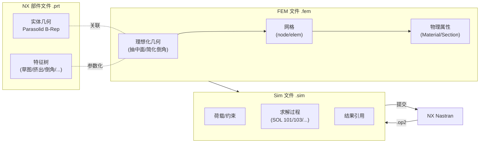

**关联建模的三个关键技术**：

1. **几何指针稳定**：网格节点引用的不是几何坐标，而是**几何特征的稳定 ID**（如 "Face 7 of Solid 3"），几何变形后节点自动跟随；
2. **理想化（Idealization）层**：在原始 CAD 与网格之间插入**只读副本**，避免污染原始几何；这是 NX 的发明，对应 hy-cad-tool 可设计 `IDomainGeometryView`；
3. **Update 状态机**：每个 sim 文件维护"Up-to-date / Out-of-Date / Update Required"三态，几何变更后**懒求值**而非立即重网格。

> **hy-cad-tool 启示**：
> - 设计 `IFeatureIdProvider`：给 `hyob` 的每个几何特征分配**跨版本稳定 ID**，让 FEM 模型引用 ID 而非坐标；
> - 实现 `StaleTracker`（02 文档已列）：参考 NX 的三态状态机；
> - 引入"理想化"概念：道路工程中边坡可以简化为 2D 剖面 + 长度，**模型简化是一等公民**而非临时操作。

### 4.3 数据流总图

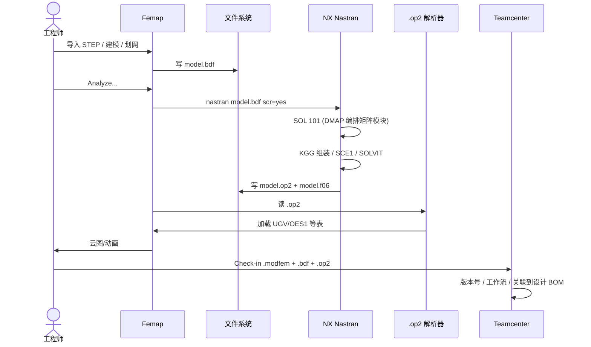

---

## 五、STAR-CCM+ 内部架构：异源的"Parts-Based"哲学

STAR-CCM+ 不是 NX 血脉，**架构哲学与 Nastran/Femap 完全相反**。理解这种"异源"是关键。

### 5.1 单一可执行 + Java 脚本

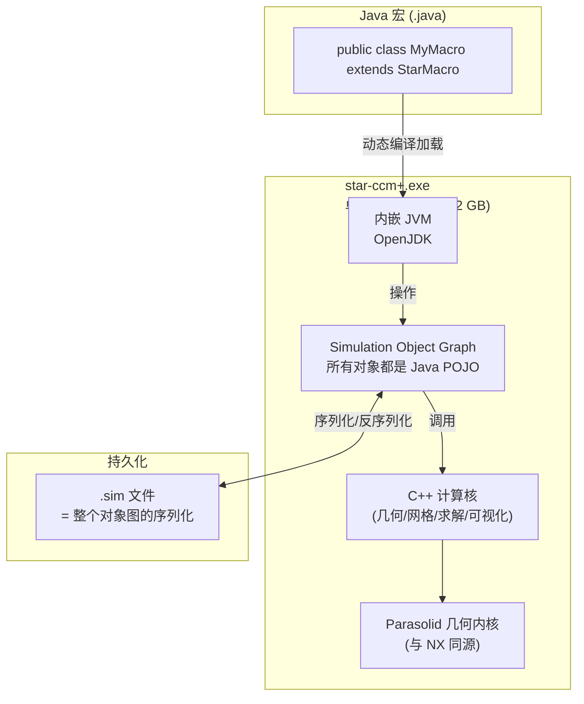

**关键架构差异**：
- **一切皆 Java 对象**：从几何、网格、物理模型到求解控制，**整个仿真是一个对象图**；
- **`.sim` 文件 = 对象图序列化**：相当于把整个 IDE 的工程文件 dump 下来，**可以包含网格 + 结果 + 历史**；
- **宏即代码**：用户写 Java 类继承 `StarMacro`，运行时被编译加载——**这是真正的 IDE 式仿真**；
- **Parasolid 内核共享**：与 NX 同 Parasolid，所以几何质量很高。

### 5.2 Parts-Based 工作流

STAR-CCM+ 在 2010 年前后引入的 **Parts-Based Meshing & Simulation** 是 CFD 界的范式革命：

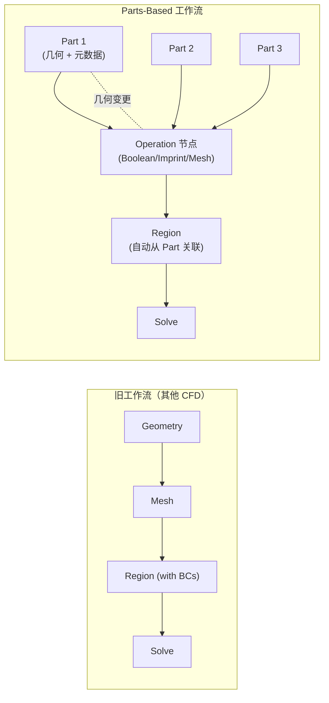

**Parts-Based 的三大特征**：

1. **几何变更 → 自动重网格**：Part 改了，Operation 节点自动失效，Region 自动重建——**这是对 NX CAE 关联建模在 CFD 域的对标**；
2. **可重放的 Operation DAG**：网格生成不是一次性动作，而是**可编辑可重放的有向无环图**；
3. **多 Part 装配自动布尔**：装配体导入后自动 imprint，**装配关系直接成为流体域边界**。

### 5.3 STAR-CCM+ 与结构 FEM 的耦合

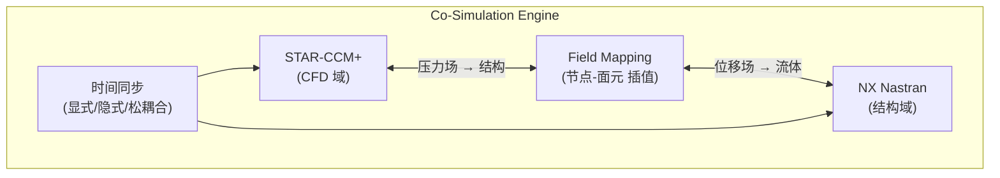

**耦合通过 Co-Simulation Engine（CSE）实现**：
- **基于 TCP/IP 套接字**，不是共享内存——两个求解器作为**独立进程**通过 IPC 通信；
- **Field Mapping** 解决非匹配网格的插值问题；
- **支持松耦合（每个时间步交换一次）和紧耦合（每个非线性迭代交换）**。

> **hy-cad-tool 启示**：
> - 多物理耦合**不必硬集成**，**进程级 IPC + 场映射**就足够；
> - hy-cad-tool 若未来涉路面水流冲刷、土水耦合，应设计 `ICoSimulationAdapter`，把 OpenFOAM/Code_Aster 等作为独立进程接入；
> - **不要试图把所有物理塞进同一个对象图**——这是 STAR-CCM+ 用 Java 反思出的教训（早期 STAR-CD 是单体 Fortran，扩展极痛苦）。

---

## 六、Simcenter 多组件协作的 4 种实际场景

### 6.1 场景对照表

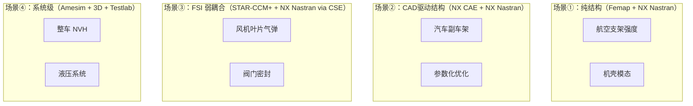

| 场景 | 主导组件 | 协作方式 | 典型规模 |
|------|----------|----------|----------|
| ①纯结构 | Femap | 文件交换 | 1k~10M DOF |
| ②CAD 驱动 | NX CAE | 关联建模 + 同进程 | 100k~50M DOF |
| ③FSI | STAR-CCM+ | CSE + Field Mapping | 多物理域 |
| ④系统级 | Amesim/HEEDS | DOE 编排多个仿真 | N 次完整仿真 |

### 6.2 协作总线：Teamcenter 的角色

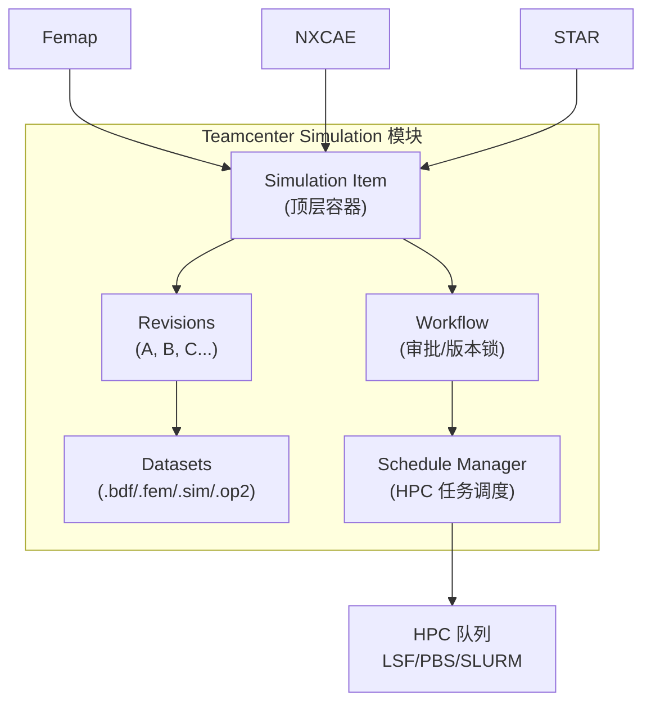

**Teamcenter 的本质 = 给 simulation artifact 一个企业级命名空间**：
- 解决"同一个文件在 5 个工程师电脑上有 7 个版本"问题；
- 把"求解任务"作为受管对象，可审计、可重算、可回滚；
- 与设计 BOM 关联，**每个零件能追溯到所有相关仿真**。

> **hy-cad-tool 启示**：
> - 即使不做完整 PLM，也应当从一开始就引入**项目（Project）→ 修订（Revision）→ 工件（Artifact）** 三级模型；
> - 求解任务必须是**一等公民对象**而非临时操作——参考底座 02 文档的 `AnalysisRun` 概念；
> - 不要等到客户提出"我要回到上周三的版本" 才补救。

---

## 七、Simcenter 架构的 8 条核心洞察

| # | 洞察 | 反映在哪个组件 | 对 hy-cad-tool 的应用 |
|---|------|----------------|----------------------|
| 1 | **数据契约先于代码** | NDDL、Femap Neutral、Nastran Bulk Data | `hyob` 必须有显式 Schema |
| 2 | **三段式输入：行为 / 工况 / 数据** | Executive / Case / Bulk | `FemProblem(Procedure, Cases, Model)` |
| 3 | **求解流程是 DSL 不是硬编码** | DMAP | `IAnalysisPipeline` 应可注入 |
| 4 | **多 backend 共存而非替换** | SOL 600 集成 Marc | 同一接口下 CalculiX/OpenSees/自研并存 |
| 5 | **几何关联依赖稳定特征 ID** | NX CAE Idealization | `IFeatureIdProvider` |
| 6 | **几何变更 → 网格懒失效** | NX CAE Stale state machine | `StaleTracker` 三态 |
| 7 | **多物理耦合走 IPC 不共享内存** | STAR-CCM+ Co-Simulation Engine | `ICoSimulationAdapter` |
| 8 | **求解任务是受管对象** | Teamcenter Simulation | `AnalysisRun` 一等公民 |

### 7.1 Simcenter 暴露的设计缺陷（hy-cad-tool 应规避）

| 缺陷 | 表现 | hy-cad-tool 规避策略 |
|------|------|----------------------|
| **Windows 单平台锁定**（Femap） | 没有 Linux/macOS 版 | C# .NET 8 + AvaloniaUI 跨平台 |
| **三套异源技术栈**（Fortran/Pascal/C++/Java） | 维护成本高，新人难上手 | 单一 C# 技术栈，Solver Backend 子进程化 |
| **COM/OLE 自动化老化** | Femap API 风格停留在 1990s | Command Bus + Record 现代化 |
| **License 复杂度** | 模块化售卖，组合爆炸 | 开源核心 + 可选商业插件 |
| **`.modfem` 不开放** | 私有二进制，外部读不了 | `hyob` 全文本，向 git 友好 |
| **DMAP 学习曲线陡** | 全球能写 DMAP 的不超过 1000 人 | DSL 用 C# Fluent API，不发明新语法 |

---

## 八、hy-cad-tool ↔ Simcenter 精确对标映射

### 8.1 组件级映射

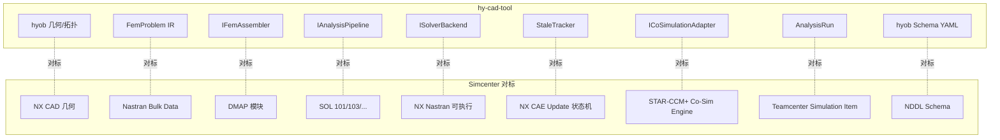

### 8.2 设计决策清单

| 决策项 | Simcenter 经验 | hy-cad-tool 决策 |
|--------|----------------|------------------|
| 输入格式 | 三段式纯文本 (`.bdf`) | `hyob` 多文档 YAML，Procedure/Cases/Model 分文件 |
| 数据契约 | NDDL（私有 DSL） | JSON Schema（业界标准） |
| 求解流程 | DMAP（私有 DSL） | C# Fluent API + 配置 YAML |
| 网格关联 | Parasolid 特征 ID | `hyob` 实体 ULID（稳定不可变） |
| 网格失效 | 三态机（Up-to-date / Out-of-date / Update Required） | 同上，加 `versionedKey` 时间戳 |
| 求解器 | NX Nastran 单一内核 | CalculiX 默认 + OpenSees/自研可选 |
| 多物理 | TCP/IP Co-Simulation | gRPC 或 stdin/stdout JSON-RPC |
| 任务管理 | Teamcenter Schedule Manager | 项目内 `runs/{id}/` 目录 + SQLite 索引 |
| 跨平台 | Windows-only (Femap) | .NET 8 跨平台 |
| 二次开发 | COM/OLE / DMAP / Java macro | C# 插件 + MCP（AI 接入） |
| 商业模式 | 模块化高价 license | 核心 MIT 开源 + 行业规范包商业化 |

### 8.3 立即可执行的对标动作（增量到 01 文档清单）

| 优先级 | 动作 | 对标 Simcenter 组件 | 工作量 |
|--------|------|---------------------|--------|
| P0 | 把 `FemProblem` IR 设计成 Procedure/Cases/Model 三段式 | Nastran Executive/Case/Bulk | 3 天 |
| P0 | 给 `hyob` 每个实体加入 ULID 作为稳定 ID | NX CAE Feature ID | 1 周 |
| P1 | 起草 `hyob` JSON Schema（YAML 形式） | Femap NDDL | 1 周 |
| P1 | 起草 `IAnalysisPipeline` Fluent API（替代 DMAP） | NX Nastran DMAP | 1 周 |
| P2 | 实现 `StaleTracker` 三态机 | NX CAE Update 状态 | 1 周 |
| P2 | 把 `AnalysisRun` 落到 `runs/{id}/` + SQLite | Teamcenter Sim Item | 1 周 |
| P3 | 实现 `ICoSimulationAdapter` Demo（gRPC 桩） | STAR-CCM+ CSE | 2 周 |
| P3 | `hyob` ↔ Nastran Bulk Data 双向转换 | Nastran `.bdf` | 2 周 |
| P3 | `hyob` ↔ Femap Neutral File 单向导出 | Femap `.neu` | 1 周 |

---

## 九、Simcenter 架构演进的"未走之路"——给 hy-cad-tool 的窗口

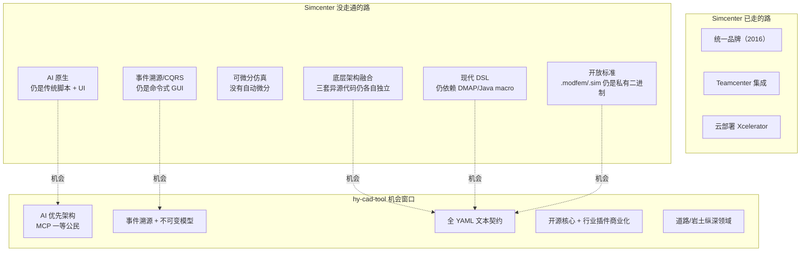

**Simcenter 没走通的路 = hy-cad-tool 的机会**：

1. **AI 原生**：Simcenter 的 AI 是事后贴的（NX X AI Copilot），架构上仍是 1990 年代命令式 GUI；hy-cad-tool 从一开始 MCP/Agent 即一等公民；
2. **事件溯源**：Simcenter 的"撤销 / 重做"仍是命令栈，没有 Event Log；hy-cad-tool 可走 CQRS + Event Sourcing，**真正可审计的工程文化**；
3. **文本契约**：`.sim`/`.modfem` 都是私有二进制，git 不友好；`hyob` 全 YAML/JSON，**云原生 + AI 友好**；
4. **领域纵深**：Simcenter 是通用平台，**道路/岩土领域逻辑**不是它的强项；hy-cad-tool 把 JTG/GB 规范、路基沉降、桩基计算做成一等公民，**纵深胜过广度**。

---

## 十、总结：一张表读懂 Simcenter FEM 架构

| 维度 | NX Nastran | Femap | STAR-CCM+ | NX CAE |
|------|------------|-------|-----------|--------|
| **诞生** | 1971 (NASA) | 1985 (ESP) | 1980 (CD adapco) | 2000s (UGS) |
| **语言** | Fortran 77/90 + C | Delphi/C++ | C++ + Java | C++ |
| **数据契约** | Bulk Data `.bdf` + NDDL `.op2` | Neutral `.neu` + `.modfem` | Java 对象图 `.sim` | NX `.fem/.sim` |
| **脚本** | DMAP | OLE/COM (VB/Py/C#) | Java macro | NX Open (C++/C#/Java/Py) |
| **求解能力** | 隐式 + 显式 + 非线性 + 优化 | — (前后处理) | 多物理 CFD/CAE | 与 Nastran 同 |
| **几何关联** | 无 | 弱 | Parts-based DAG | 强 (Parasolid Feature) |
| **多物理** | SOL 700 (显式)、Marc 集成 | — | Co-Simulation Engine | 调用 Nastran/STAR |
| **并行** | SMP + DMP + GPU 块加速 | — | MPI 大规模 | 继承 Nastran |
| **跨平台** | Linux + Windows + HPC | Windows only | Linux + Windows | Linux + Windows |
| **可微分** | ❌ | ❌ | ❌ | ❌ |
| **AI 接口** | ❌ | ❌ | 部分 | Copilot 贴皮 |
| **开放性** | 输入文本开放 | 30+ solver IO | Java 宏开放 | NX Open 全开放 |
| **hy-cad-tool 借鉴度** | ★★★★★ | ★★★★ | ★★★ | ★★★★ |

**最值得借鉴的两个设计**：

1. **NX Nastran 的三段式输入 + DMAP** —— 输入与求解流程都是 DSL，可审计、可演进、可注入；
2. **NX CAE 的关联建模 + Stale 状态机** —— 几何变更 → 仿真懒失效，是现代 CAE 的范式。

**最值得规避的两个陷阱**：

1. **Femap 的 COM/OLE 单例代理 API** —— 1990 年代妥协，现代不可学；
2. **三个组件异源技术栈** —— Simcenter 直到 2026 也没融合，反衬"统一技术栈"的价值。

---

## 修订记录

| 日期 | 修订人 | 说明 |
|------|--------|------|
| 2026-05-14 | — | 初版：Simcenter FEM 三件套架构深度分析，含组件解剖、协作模型、对 hy-cad-tool 的精确对标映射 |

---

## 附录 A：术语表

| 术语 | 全称 | 说明 |
|------|------|------|
| **DMAP** | Direct Matrix Abstraction Program | Nastran 的矩阵层级求解流程 DSL |
| **NDDL** | Nastran Data Definition Language | Nastran 的数据字典 |
| **SOL** | Solution Sequence | Nastran 的预定义求解流程编号 |
| **OP2** | OUTPUT2 (FORTRAN unit) | Nastran 的二进制结果文件 |
| **CSE** | Co-Simulation Engine | STAR-CCM+ 与外部求解器耦合的桥接 |
| **Parts-Based** | — | STAR-CCM+ 的"几何为先 + 操作 DAG"工作流 |
| **Idealization** | — | NX CAE 中"几何简化副本"层 |
| **Sim/Fem 文件** | — | NX CAE 中"仿真控制 / FEM 模型"分离的文件对 |
| **Teamcenter** | — | Siemens PLM 命名空间与工作流 |

## 附录 B：与 01/02 文档的差异定位

- **文档 01** 是横向 25+ 款 FEM 软件的**广度**对标；
- **文档 02** 是 hy-cad-tool 五层底座的**纵向**架构设计；
- **本文档 06** 是单一厂商（Simcenter）的**深度**逆向分析；
- 后续可生成 `07`（ANSYS Workbench 深度）、`08`（ABAQUS/SIMULIA 深度）、`09`（OpenSees 深度）等并列文档。
