# ADINA 有限元计算架构深度分析

> 文档日期：2026-05-14
> 上承：[01-全球三维有限元软件对标调研](../../01-全球三维有限元软件对标调研-2026-05-14.md) · [02-有限元通用底座架构-从挡土墙开始](../../02-有限元通用底座架构-从挡土墙开始-2026-05-14.md)
> 文档目的：
> 1. 抛开"ADINA 是 FSI 老牌"这一标签，从**架构与设计哲学层面**深入剖析它为什么能在非线性 FEM 与流固耦合上长期保持理论高地。
> 2. 提炼 ADINA **可被借鉴**与**应当规避**的设计选择，对照 hy-cad-tool 的 `FemProblem` IR 与五层架构（详见 02）给出明确启示。
> 3. 作为 hy-cad-tool 在**非线性求解、时间积分、多物理耦合、单元公式**方向的设计参考底稿。

---

## 一、为什么单独深入 ADINA

调研报告（01）已指出 ADINA 在全球 25+ 款 3D FEM 软件中的定位较"小众"：用户群远小于 ANSYS/ABAQUS，商业推广薄弱。但它在**架构与理论严谨性**上具有少数几个公司无法取代的特质，对自研工具（hy-cad-tool）特别有借鉴价值：

| 维度 | ADINA 的独特性 | 对 hy-cad-tool 的意义 |
|------|---------------|----------------------|
| **学术血统** | MIT Klaus-Jürgen Bathe 教授学派，是经典教材 *Finite Element Procedures* 的"参考实现" | 自研工具最该学的就是"教科书级别的接口形状"，不是商业产品的妥协 |
| **MITC 壳/板单元** | Bathe 提出的 MITC4/MITC9 系列，是壳单元闭锁问题的标杆解法 | 单元公式 ≠ 单元拓扑，IR 设计的核心智慧 |
| **真·共求解 FSI** | 唯一以 monolithic（一体化）方程组方式直接求解流固耦合的商用产品 | 多物理耦合的极端范式，定义了"耦合度"的天花板 |
| **Bathe 时间积分法** | 隐式复合两子步格式，比 Newmark/HHT 在大变形/接触下更稳定 | 时间积分器抽象为"插件"的范本 |
| **AUI 命令文件** | 模型 = 命令文件 = 计算书，所有操作落到可审计的 text | 与 STAAD `.std` / SOFiSTiK TEDDY 同源，是 `hyob` 的目标形态 |
| **2022 被 Bentley 收购** | 工程化生命周期的转折点，从"科研产品"走向"BIM/iTwin 生态零件" | 提醒自研工具：学术血统 ≠ 工程可持续性 |

> 这份文档不是 ADINA 的"使用指南"，而是**架构层面的解构**——把它的内部结构拆给设计 hy-cad-tool 底座的人看。

---

## 二、历史脉络与学术血统

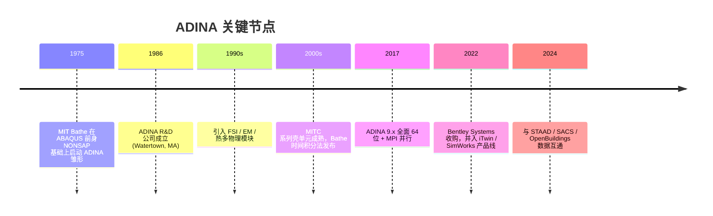

### 2.1 学术派 vs 商业派 FEM 软件的"血统差异"

| 项 | 学术派（ADINA / Code_Aster / OpenSees） | 商业派（ANSYS / ABAQUS） |
|----|----|----|
| **驱动力** | 论文 + 教科书可复现性 | 用户需求 + 市场份额 |
| **接口形状** | 数学严谨，记号贴近 *FE Procedures* | 工程导向，记号贴近设计师习惯 |
| **新特性来源** | 教授/博士论文 | 客户行业 |
| **代码风格** | Fortran/C++，函数式 | Fortran/C++，过程式 + 大量历史包袱 |
| **测试驱动** | 解析解 + benchmark | 真实工程对比 |
| **演进节奏** | 慢但严格 | 快但杂 |

> 这是 02 文档"四条不可妥协原则"中**第 ①"输入与计算解耦"**的另一个表述：**架构血统决定了它的接口形状是否值得长期复用**。ADINA 的接口形状（IR / 时间积分 / 单元公式）几乎可以直接抄进任何自研 FEM 内核。

### 2.2 Bentley 收购的影响

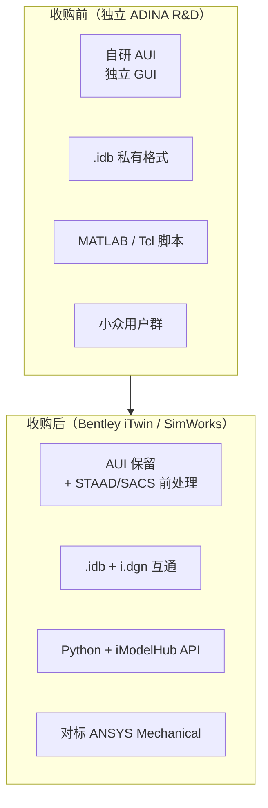

**对 hy-cad-tool 的启示**：自研工具若想长期存活，**单点突破（如 FSI）不足以保命**，必须有承接生态的入口（API / 文件互通 / BIM 接入）——这正是 02 文档中 `IBimInteropPort` 防腐层的存在理由。

---

## 三、总体架构：六大模块 + 统一内核

ADINA 是一个"**多前端 + 统一求解内核 + 多后端**"的典型架构。从外向内可分四层。

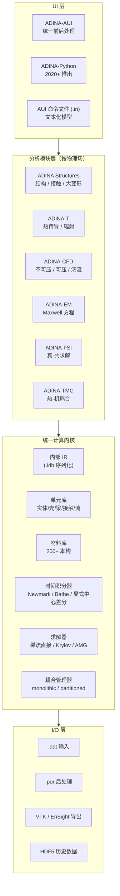

### 3.1 与 ANSYS / ABAQUS 的架构对照

| 维度 | **ADINA** | ABAQUS | ANSYS Mechanical |
|------|-----------|--------|------------------|
| 前处理 | AUI（单一应用） | CAE（多 module） | Workbench Mechanical |
| 模型数据库 | `.idb` 二进制 | `.cae` Python pickle | `.mechdat` / `.db` |
| 输入文件 | `.in`（AUI 命令文件） | `.inp`（关键字驱动） | `.dat` / APDL |
| 求解器 | ADINA-Struct / -CFD / -FSI **同进程内** | Standard / Explicit / CFD **不同 exe** | Mechanical APDL / LS-DYNA / Fluent **不同 exe** |
| FSI 实现 | **monolithic（一体方程）** | partitioned（Co-Sim）+ CEL | partitioned（System Coupling） |
| 后处理 | AUI 自带 | CAE Viewer / Tecplot | CFD-Post / Mechanical |

> **关键观察**：ADINA 把"多物理"做在**同一内核同一进程**里；ABAQUS/ANSYS 是**多产品 + 耦合器**。这两种范式的差异，是 02 文档中 `FemAnalysisPipeline<TDomain>` 单流水线 vs. ANSYS Workbench DAG 的核心张力。

### 3.2 单进程多物理：好处与代价

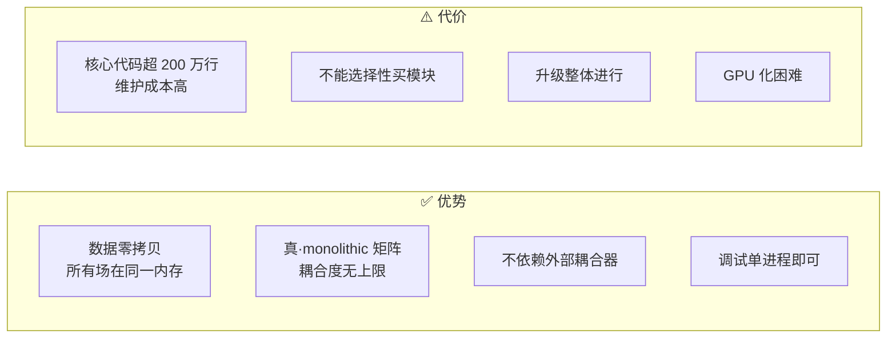

**对 hy-cad-tool 的启示**：单进程模型适合**底座阶段**（数据零拷贝 + 单一 IR），但**多模块的演进必须留好"分进程逃生口"**——这正是 02 文档 `ISolverBackend` 接口中保留 "subprocess backend" 抽象的理由。

---

## 四、AUI：命令文件与 GUI 同构

AUI 是 ADINA 最有"学术派洁癖"的部分。它的核心设计原则只有一句话：

> **任何 GUI 操作都对应唯一一行命令文件，反之亦然。**

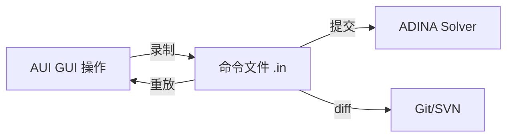

### 4.1 命令文件示例（节选）

```text
*--- Geometry: 简支梁 ---
COORDINATES POINT SYSTEM=0
1     0.0   0.0   0.0
2    10.0   0.0   0.0

LINE STRAIGHT NAME=1 P1=1 P2=2

*--- Material ---
MATERIAL ELASTIC NAME=1
  E=2.1E11  NU=0.3  DENSITY=7850

*--- Element ---
EGROUP HERMITIAN NAME=1 SUBTYPE=BEAM
  MATERIAL=1  RINIT=1

GLINE NODES=10 AUXPOINT=0 EL=1 NCOINCID=ENDS

*--- Boundary ---
FIXBOUNDARY POINT NAME=1
1  'XYZ-ROTATIONS'
2  'YZ-ROTATIONS'

*--- Load ---
LOAD FORCE NAME=1 MAGNITUDE=10000 DIRECTION='-Z'
APPLY-LOAD BODY=1
1  'FORCE'  1  'POINT'  2  0  0  'NO'  0  0  -1.0  0

*--- Solve ---
SOLUTION-STATICS

*--- Save & exit ---
SAVE='beam.idb'
ADINA
```

### 4.2 与 STAAD / SOFiSTiK / OpenSees 命令文件的对比

| 软件 | 命令文件 | 风格 | 可 diff | 注释友好 |
|------|----------|------|---------|----------|
| **ADINA AUI** | `.in` | **关键字 + 行末参数**，与 GUI 1:1 | ✅ | ○ |
| **STAAD.Pro** | `.std` | **领域 DSL（人话）**，"MEMBER 1 TO 5"风格 | ✅ | ✅ |
| **SOFiSTiK TEDDY** | `.dat` | **过程式脚本（含变量/循环）** | ✅ | ✅ |
| **OpenSees Tcl** | `.tcl` | **通用脚本**（Tcl/Python） | ✅ | ✅ |
| **ABAQUS** | `.inp` | **关键字 + 数据块** | ✅ | ○ |
| **ANSYS APDL** | `.mac` | **命令 + 宏 + 数学** | ✅ | △ |

**对 hy-cad-tool 的启示**：

`hyob` 文本层（详见 `docs/DataExchange/`）天然倾向"领域 DSL（STAAD 风格）"，但应当借鉴 **ADINA AUI 的 GUI ↔ 命令双向映射**——即每个 UI 操作都能 round-trip 成可读文本，且文本可重放出完全一致的状态。这就是 02 文档"Command Bus 单入口 + 数据不可变"原则的具体形态：

```csharp
// 02 文档已有 Command Bus，此处补充"可序列化为 hyob 行"
public interface ICommand
{
    Result<HyobLine> Serialize();
    // ↑ 每个 Command 必须可输出为一行可审计文本
    static abstract Result<ICommand> Deserialize(HyobLine line);
    // ↑ 也必须可从文本反序列化（实现 AUI 同构）
}
```

---

## 五、数据流：`.idb / .dat / .por` 三文件世界

ADINA 的内部数据流呈"**三文件锁链**"结构，每个文件承担明确职责。


### 5.1 三种文件的设计权衡

| 文件 | 格式 | 责任 | 可审计 | 跨版本 |
|------|------|------|--------|--------|
| `.idb` | 二进制 | **完整模型 + UI 状态**（视图/选择/历史） | ❌（必须 AUI 打开） | ⚠️ 跨大版本可能失败 |
| `.dat` | ASCII | **纯求解输入**（不含 UI 状态） | ✅ | ✅ 老版本可读新版 |
| `.por` | 二进制 | **结果时序数据**（高效随机访问） | ❌ | ⚠️ 仅同主版本可读 |

> **关键设计**：`.idb` 与 `.dat` **不是同一份数据的两种存储**，而是**模型完整状态 vs 求解所需子集**的分离。`.dat` 是 `.idb` 的"投影"，**只保留求解器需要的字段**。

### 5.2 对照 hy-cad-tool 的双轨设计

| ADINA | hy-cad-tool 对照 |
|-------|-----------------|
| `.idb`（完整模型 + UI 状态） | DWG / `.hycad`（含图层、视图、用户选择） |
| `.dat`（求解输入投影） | `hyob` 文本层（详见 `docs/DataExchange/03-hyob与DWG相互转换-...`） |
| `.por`（结果时序） | `FemResult` 序列化（参考 02 文档 Layer 1） |

**核心启示**：02 文档中的 `FemProblem` IR 应当**主动避免**承载"UI 状态"，让 IR 永远是"求解输入投影"。UI 状态保留在 hyob/DWG 中。这与 ADINA 的 `.idb`/`.dat` 切分一致：**UI 状态 ⊥ 求解输入**。

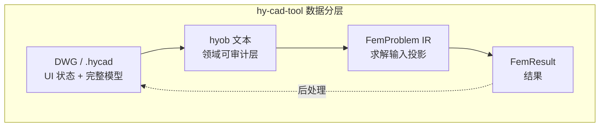

---

## 六、单元体系：Bathe 学派的 MITC 智慧

ADINA 单元库的设计选择，背后几乎都来自 Bathe 教授的论文。理解它，对 02 文档"单元拓扑 ≠ 单元公式"原则的具体落地极有价值。

### 6.1 单元库结构

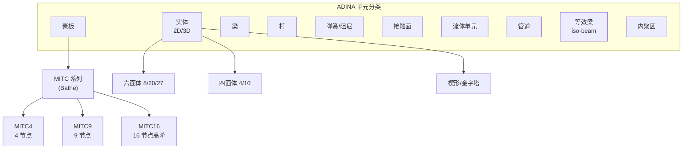

### 6.2 MITC 壳：为什么它是教科书答案

**问题背景**：经典 Q4 壳单元在**薄壳极限**下会出现"剪切闭锁（shear locking）"，导致刚度过高、位移偏小。

**Bathe 的 MITC（Mixed Interpolation of Tensorial Components）方案**：
- 位移场用普通插值
- 剪切应变场用**独立离散**（在"打孔点"采样后插值回去）
- 厚壳/薄壳/曲壳通用，无锁、无沙漏

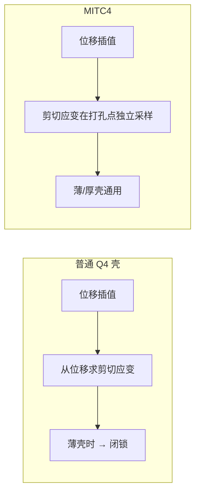

### 6.3 对 02 文档"单元公式 ≠ 单元拓扑"的具体落地

02 文档已明确：

> 单元拓扑 ≠ 单元公式——`Quad4` 既可以当壳单元也可以当平面应力实体。

ADINA 的实现完美印证这一点：**同一个 Q4 拓扑**在 ADINA 中至少对应 6 种单元公式：

| 拓扑 | 公式 ID | 用途 | DOF/节点 |
|------|---------|------|----------|
| Quad4 | `Q4_PlaneStress` | 板内受拉 | 2（ux, uy） |
| Quad4 | `Q4_PlaneStrain` | 平面应变 | 2 |
| Quad4 | `Q4_Axisymmetric` | 轴对称 | 2 |
| Quad4 | `MITC4_Shell5dof` | 壳 5DOF | 5 |
| Quad4 | `MITC4_Shell6dof` | 壳 6DOF（带钻自由度） | 6 |
| Quad4 | `Q4_Fluid` | 不可压 CFD | 3（ux, uy, p） |

**对 hy-cad-tool 的启示**：02 文档已规划的 `IElementFormulation` 接口可直接借鉴此结构：

```csharp
// 来自 02 文档，补充注释
public interface IElementFormulation
{
    ElementFormulationId Id { get; }
    CellTopology[] SupportedTopologies { get; }   // ← 一个公式可支持多个拓扑
    int[] FieldArities { get; }                   // ← MITC4 = [5] 或 [6]
    LocalStiffness Build(...);
}

// hy-cad-tool 第二批要做的（参考 02 文档 v0.5+）
public sealed class MITC4Shell : IElementFormulation
{
    public CellTopology[] SupportedTopologies => [CellTopology.Quad4];
    public int[] FieldArities => [5];                  // ux, uy, uz, θx, θy
    // 内部采用 Bathe 论文 1984/1986 的 MITC4 打孔点积分
}
```

> **关键事实**：MITC 系列单元在学界已公开发表，理论与实现**完全可自研**。这是 02 文档 v0.5+ 阶段 "ShellMITC4" 路线图的现实依据。

---

## 七、材料库：层级化本构架构

### 7.1 ADINA 材料的"四级注册"

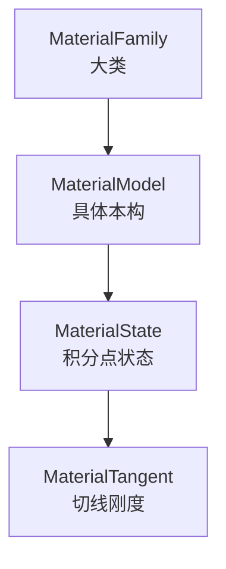

| 级别 | 数据 | 责任 |
|------|------|------|
| **Family** | Elastic / Hyper / Plastic / Geo / Damage | 求解器据此选择算法（隐式/显式/弧长） |
| **Model** | LinearElastic / MooneyRivlin / DruckerPrager / ConcreteDP | 具体函数 + 参数定义 |
| **State** | 历史变量（塑性应变、损伤变量、孔压等） | 每个积分点独立 |
| **Tangent** | 一致切线刚度（consistent tangent） | Newton 迭代专用 |

### 7.2 hy-cad-tool 的对应抽象

02 文档已给出 `IMaterialModel`，此处补充更细的子接口（受 ADINA 启发）：

```csharp
public interface IMaterialModel
{
    MaterialModelId Id { get; }
    MaterialFamily Family { get; }              // 决定求解器选择
    int StateVariableCount { get; }              // 历史变量数

    Result<MaterialEvaluation> Evaluate(MaterialState state);
    // 返回应力 + 一致切线刚度 + 更新后的状态
}

public sealed record MaterialState(
    ReadOnlyMemory<double> Strain,
    ReadOnlyMemory<double> HistoryVariables,
    double Temperature,
    double PorePressure);

public sealed record MaterialEvaluation(
    ReadOnlyMemory<double> Stress,
    double[,] ConsistentTangent,                 // ← 一致切线，Newton 迭代必需
    ReadOnlyMemory<double> UpdatedHistoryVars);

public enum MaterialFamily
{
    LinearElastic, NonlinearElastic, Hyperelastic,
    Plastic, ViscoPlastic, Geomechanics,
    Damage, Fracture, Concrete, UserDefined
}
```

> **关键设计**：返回**一致切线刚度**（而非纯解析切线）是 ADINA 非线性求解器二次收敛的关键。hy-cad-tool 即使 v0.2 只做线性弹性，也应在接口形状里**预留"一致切线"位**。

---

## 八、求解器架构：直接 / 迭代 / 显式三轨

### 8.1 ADINA 求解器全景

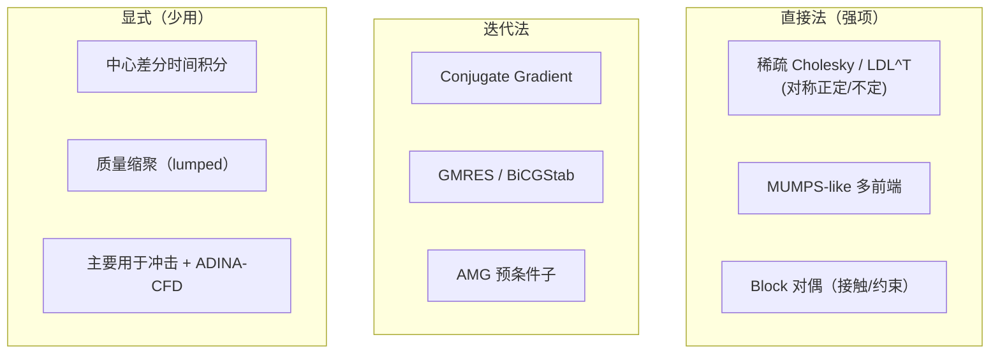

### 8.2 求解器选择决策树

ADINA 的求解器选择**不是黑盒**，AUI 中能明确切换：

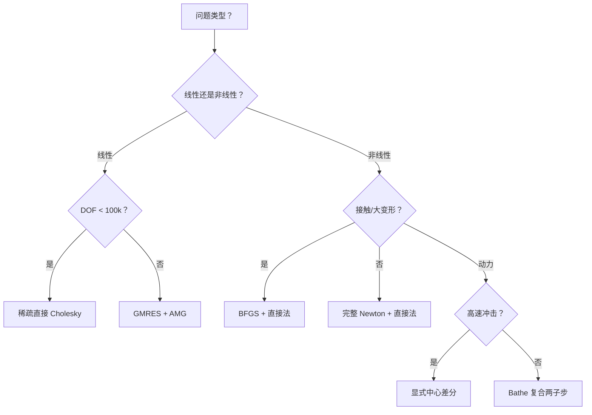

### 8.3 对 02 文档 `ISolverBackend` 的精修建议

02 文档已抽象出 `ISolverBackend`。对照 ADINA，可在接口中补充**能力声明**与**求解策略提示**：

```csharp
public interface ISolverBackend
{
    SolverBackendId Id { get; }
    SolverCapabilities Capabilities { get; }

    // 新增：解器路由提示（让 Pipeline 自动选 backend）
    SolverFitness EvaluateFitness(AssembledSystem system);

    Task<Result<RawSolution>> SolveLinearAsync(
        AssembledSystem system, SolverOptions options, CancellationToken ct);

    Task<Result<EigenSolution>> SolveEigenAsync(...);
}

public sealed record SolverFitness(
    double Score,                                // 0..1
    string Rationale);                           // "对称正定 + 50k DOF，CSparse 最快"
```

这样底座可以**自动选择**最合适的 backend，而不是硬绑定：

```csharp
var backend = _solverRegistry
    .GetAll()
    .OrderByDescending(b => b.EvaluateFitness(assembled).Score)
    .First();
```

---

## 九、非线性求解与时间积分：Bathe 的标志

### 9.1 非线性算法栈

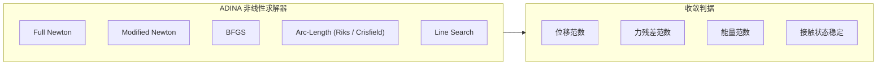

### 9.2 Bathe 复合两子步时间积分法

**问题背景**：经典 Newmark 隐式法在**接触 + 大变形 + 长时长**问题下，会因数值阻尼不足导致能量漂移。Bathe 在 2005~2007 年提出**复合两子步格式**（Bathe Method），现在是 ADINA 默认时间积分器。

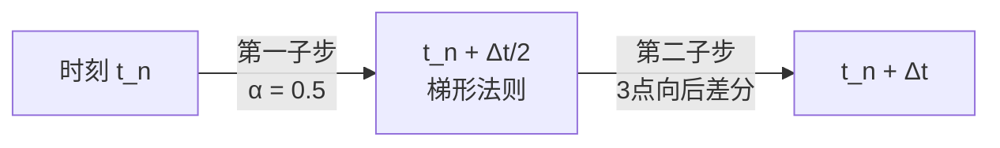

| 时间积分器 | 优势 | 劣势 | 默认场景 |
|------------|------|------|----------|
| **Newmark β=0.25** | 无条件稳定，无数值阻尼 | 长时长能量漂移 | 低频问题 |
| **HHT-α** | 可控数值阻尼 | 参数敏感 | 通用结构动力 |
| **Bathe Method** | 接触/大变形稳定 | 计算量 ≈ 2× Newmark | **ADINA 默认** |
| **中心差分（显式）** | 接触/冲击稳定 | Δt 受单元最小限制 | 冲击碰撞 |

### 9.3 对 hy-cad-tool 的启示：时间积分器即插件

02 文档已有 `AnalysisProcedure` + `AnalysisStep` 抽象。基于 ADINA 经验，建议把**时间积分器**也提到插件级别：

```csharp
public interface ITimeIntegrator
{
    TimeIntegratorId Id { get; }
    TimeIntegratorKind Kind { get; }              // Implicit / Explicit / Mixed

    Result<TimeStepUpdate> Step(
        TimeIntegrationState state,
        AssembledSystem system,
        TimeStepOptions options);
}

// 第一批实现（按演进顺序）
public sealed class NewmarkBetaIntegrator : ITimeIntegrator { ... }   // v1.0
public sealed class HHTAlphaIntegrator : ITimeIntegrator { ... }      // v1.5
public sealed class BatheCompositeIntegrator : ITimeIntegrator { ... } // v2.0
public sealed class CentralDifferenceIntegrator : ITimeIntegrator { ... } // v2.5（显式）
```

> **设计要点**：把时间积分器从"求解过程的硬编码部分"解放成"可注册插件"，既能保持 v0.x 阶段的简洁（只有 Linear Static），也为未来动力学留下口子。这是 ADINA 实证过的架构。

---

## 十、流固耦合 FSI：ADINA 的"皇冠明珠"

ADINA-FSI 是它**最不可替代**的能力。理解它的实现思路，对 hy-cad-tool 未来若涉及"风荷载 / 水流冲刷 / 桥梁颤振 / 储液晃动"等耦合问题极有参考价值。

### 10.1 两种 FSI 范式

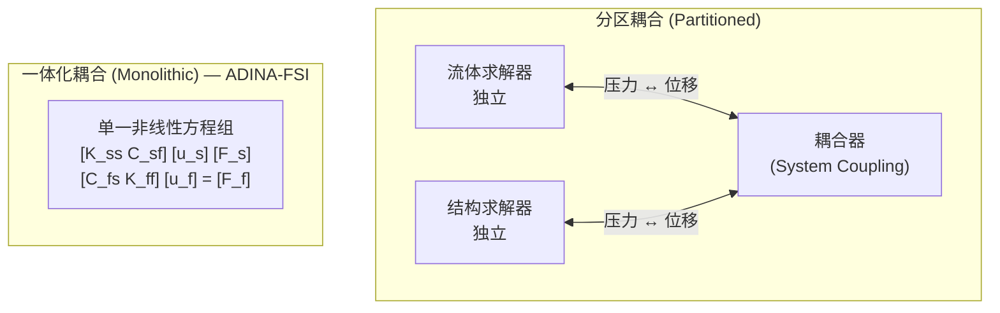

| 范式 | 代表 | 优势 | 劣势 |
|------|------|------|------|
| **Partitioned** | ANSYS System Coupling, ABAQUS Co-Sim | 各求解器独立优化，可复用现有内核 | 弱耦合时不稳，强耦合时需 sub-iterate |
| **Monolithic** | **ADINA-FSI** | 真共求解，理论无耦合上限 | 求解器必须从底层为耦合设计 |

### 10.2 ADINA-FSI 的内部组织

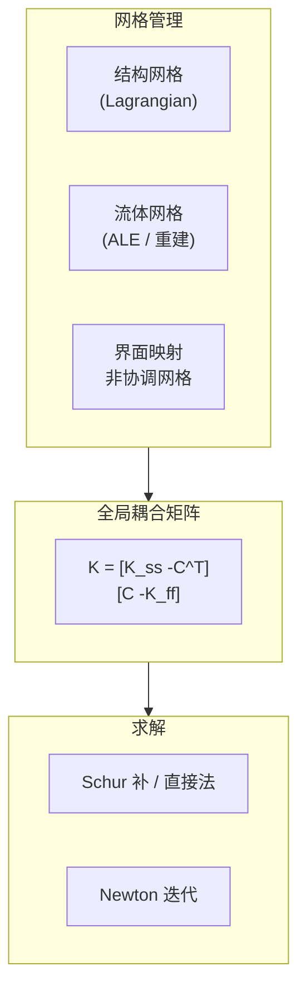

**关键技术点**：
1. **界面映射**：流固界面允许网格非协调，通过 Mortar 法在数学上严格传递力与位移
2. **ALE（Arbitrary Lagrangian-Eulerian）**：流体网格跟随结构变形，避免畸变
3. **单一时间步**：流体与结构共享时间积分器（通常用 Bathe Method）
4. **稳定化**：SUPG / GLS 用于流体对流项

### 10.3 对 hy-cad-tool 的启示：是否做 FSI？

**短期（P0~P5）**：不应自研 FSI。02 文档已将 FSI 排除在路线图外，这是正确的。

**长期（P6+）**：若 hy-cad-tool 涉及桥梁/水池晃动/边坡冲刷等问题，**推荐 partitioned 路线**——把 OpenFOAM 作为流体后端，通过 `ISolverBackend`/`IExternalAnalysisPort` 防腐层挂入：

```csharp
public interface IFsiCouplingPort
{
    // 接收来自流体的压力场
    Task<Result> ReceivePressureField(FluidPressureSnapshot pressure);
    // 推送结构位移场给流体
    Task<Result<StructureMotionSnapshot>> ProvideMotion();
    // 协商时间步
    Task<Result<TimeStep>> NegotiateTimeStep(TimeStep flowSuggested);
}
```

> **关键观点**：ADINA-FSI 的 monolithic 路线**需要 30 年理论积累 + 50 万行代码**——hy-cad-tool 不可能自做。但其**界面映射**与**ALE 网格管理**的抽象，可以作为未来 partitioned 实现的设计参考。

---

## 十一、多物理耦合范式族

ADINA 支持的耦合不只是 FSI。完整耦合矩阵：

| 耦合 | 模块 | 实现 | 工程典型应用 |
|------|------|------|--------------|
| 流-固 (F-S) | ADINA-FSI | **monolithic** | 储液晃动、风振、心血管 |
| 热-机 (T-S) | ADINA-TMC | monolithic | 焊接残余应力、热膨胀 |
| 热-流 (T-F) | ADINA-CFD | monolithic | 自然对流、热斑 |
| 电磁-热 (EM-T) | ADINA-EM | partitioned | 感应加热 |
| 电磁-机 (EM-S) | ADINA-EM | partitioned | 电机振动 |
| 多孔介质（土+水） | ADINA Structures | monolithic | 固结沉降、降水 |
| 接触-热 (TC) | ADINA Structures | monolithic | 摩擦生热 |

### 11.1 与 hy-cad-tool 路线图的关联

| ADINA 耦合 | hy-cad-tool 对应模块 | 紧迫度 |
|------------|---------------------|--------|
| 多孔介质（土-水） | **挡土墙降水沉降 / 路基固结**（P3+ 优先） | ★★★★★ |
| 热-机 (T-S) | 桥梁温度作用、混凝土水化热（P5+） | ★★★ |
| 流-固 (FSI) | 储液池晃动、桥梁颤振（P7+） | ★★ |
| 电磁 | 不相关 | — |

**关键启示**：02 文档 v0.4 阶段的"边坡"应**预先**考虑"土-水耦合"的接口形状，避免 P3 时推倒重写。具体而言，`FemProblem` 的 `Fields` 应能容纳多个并行场（`displacement` + `pore_pressure`），这正是 02 文档已设计好的部分——印证了底座架构的前瞻性。

---

## 十二、并行与性能架构

### 12.1 ADINA 的并行模型

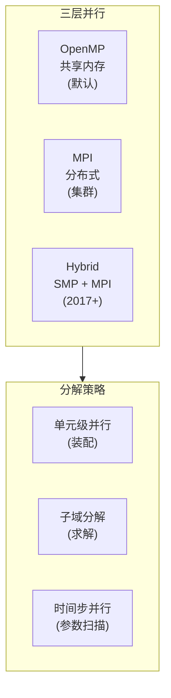

| 并行级别 | 加速比典型值 | 适用规模 |
|---------|-------------|----------|
| 单元装配（OpenMP） | 4~8× | 全部 |
| 直接法因式分解（MPI） | 16~64× | ≥ 500k DOF |
| 子域分解（DD） | 100×+ | ≥ 5M DOF |

### 12.2 GPU？ADINA 至今未原生支持

> **2024 年现状**：ADINA 9.x 仍以 CPU 为主，仅在 CFD 模块有部分 CUDA 卸载。这是它相对 ANSYS（CUDA 全栈）/ABAQUS（OpenACC）的一个明显短板。

**对 hy-cad-tool 的启示**：
- **不要为 GPU 化预先设计架构**——ADINA 30 年没必要做，hy-cad-tool 至少 5 年内不需要
- 但 `ISolverBackend` 接口**应当允许未来挂入 GPU backend**（保留 async / 大批量数据传递的形状）
- 02 文档现有接口已满足此要求

---

## 十三、与 ANSYS / ABAQUS 的本质差异

收束前面所有维度，把三者放在同一张表里看清楚。

| 维度 | **ADINA** | ABAQUS | ANSYS Mechanical |
|------|-----------|--------|------------------|
| **历史定位** | 学术派理论标杆 | 工业非线性标杆 | 通用工程标杆 |
| **架构** | 单进程多物理 | 多 exe + Co-Sim | 多 exe + Workbench DAG |
| **前处理** | AUI 单一 | CAE + HyperMesh | Workbench Meshing |
| **命令文件** | `.in` + GUI 同构 | `.inp` 关键字 | APDL 命令 + GUI 双轨 |
| **核心强项** | FSI / MITC 壳 / Bathe 积分 | 非线性接触 / UMAT 生态 | 多物理生态 / Workbench |
| **薄弱** | 用户群小、GUI 老旧、GPU 缺位 | 价格高、前处理依赖 HyperMesh | 双轨漂移、APDL 历史包袱 |
| **可二次开发** | UEL/UMAT + Python（弱） | UEL/UMAT/UMESHMOTION + Python（强） | APDL + ACT + Python（强） |
| **理论严谨** | ★★★★★ | ★★★★ | ★★★ |
| **生态广度** | ★★ | ★★★★★ | ★★★★★ |
| **入门门槛** | 高 | 高 | 中 |
| **国产替代难度** | 中（小众） | 高 | 极高 |

### 13.1 ADINA 在 hy-cad-tool 视角下的"可借鉴半径"

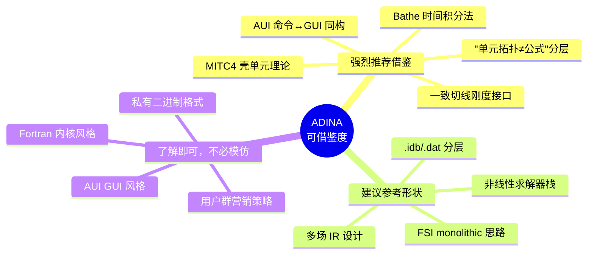

---

## 十四、对 hy-cad-tool 的六条具体启示

将上述分析收敛到对**hy-cad-tool 底座（02 文档）的具体增量建议**。

### 启示 1：单元公式抽象保留"多 DOF 模式"

02 文档已有 `IElementFormulation.FieldArities`，建议**显式扩展为多模式**：

```csharp
public interface IElementFormulation
{
    // ... 已有内容 ...
    IReadOnlyList<FormulationVariant> Variants { get; }
    // ↑ 一个公式可有多个"变体"（5DOF / 6DOF 壳，平面应力/平面应变）
}

public sealed record FormulationVariant(
    string Name,                                  // "MITC4_5DOF"
    int[] FieldArities,
    FormulationOptions DefaultOptions);
```

### 启示 2：时间积分器提升到一等公民

参考 ADINA 把 Newmark/Bathe 同级管理的经验，在 02 文档的 `Procedure` 旁补充：

```csharp
public sealed record DynamicStep(
    string Name,
    ITimeIntegrator Integrator,                   // ← 显式依赖
    double StartTime,
    double EndTime,
    double InitialTimeStep) : AnalysisStep(Name, AnalysisStepKind.Dynamic);
```

### 启示 3：材料返回"一致切线"而非"切线"

参考 ADINA Newton 二次收敛的关键，把 `IMaterialModel.Evaluate` 的返回值显式标注：

```csharp
public sealed record MaterialEvaluation(
    ReadOnlyMemory<double> Stress,
    double[,] ConsistentTangent,                  // ← 显式命名
    ReadOnlyMemory<double> UpdatedHistoryVars);
```

### 启示 4：求解器路由用 `Fitness` 机制

参考 ADINA 的求解器决策树，让 `ISolverBackend` 自我评分：

```csharp
public interface ISolverBackend
{
    SolverFitness EvaluateFitness(AssembledSystem system);
    // CSparse: "对称正定 + DOF < 100k → score 0.95"
    // Eigen:   "非对称 + DOF > 100k     → score 0.85"
}
```

### 启示 5：`FemProblem` 显式保持"求解输入投影"洁癖

参考 ADINA `.idb` / `.dat` 切分，**写一条不变式**进 02 文档：

> `FemProblem` 不得包含 UI 状态（视图、选择、用户标注）。UI 状态保留在 hyob/DWG 层。

这条不变式可在 02 文档"四条不可妥协原则"中作为**第①条的细化**。

### 启示 6：耦合接口预留，但实现延后

参考 ADINA-FSI 的复杂性，hy-cad-tool **不应自研 FSI 但应预留 `IFsiCouplingPort`**：

```csharp
public interface IPhysicsCouplingPort
{
    PhysicsCouplingKind Kind { get; }             // FSI / TSI / TFI / PoroElastic
    Result<CouplingHandshake> Connect(IExternalSolver other);
    Task<Result> Step(double dt, CancellationToken ct);
}
```

> 唯一一个"真要做"的耦合是**多孔介质（土-水）**，因 hy-cad-tool 的路基沉降场景**强需求**——这与 02 文档 v0.4 边坡阶段衔接。

---

## 十五、风险与陷阱：学术派软件的工程化教训

ADINA 的"小众化"不是偶然。从中提炼的工程化教训：

| 教训 | ADINA 表现 | hy-cad-tool 警惕 |
|------|-----------|------------------|
| **理论严谨 ≠ 用户友好** | AUI 至今学习曲线陡 | UI 不能"教科书式" |
| **单进程 ≠ 易演进** | 200 万行单核心难重构 | 模块独立目录 + DI 注册 |
| **私有格式 ≠ 长寿** | `.idb` 跨版本痛点 | 文本格式（hyob）+ 版本号 |
| **GPU 缺位 ≠ 可补救** | 30 年欠债 | 接口预留 async / batch |
| **学术血统 ≠ 商业成功** | 必须 2022 Bentley 收编 | 自研必须想清楚生态对接 |
| **多物理 ≠ 多面手** | FSI 强但日常结构不如 ABAQUS | 不贪多，聚焦"道路工程 + 沉降" |

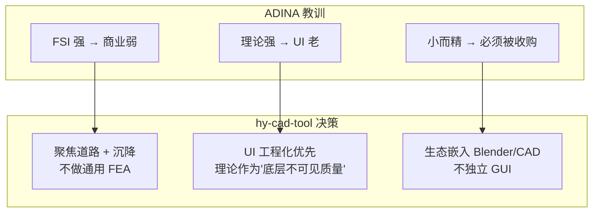

---

## 十六、ADINA 架构关键数字一览

| 项目 | 数字 | 来源 |
|------|------|------|
| 内核代码量（推算） | ~200 万行 Fortran/C++ | 2022 收购公告 |
| 单元类型数 | ~50 公式 | 用户手册 |
| 材料模型数 | ~200+ | 用户手册 |
| 默认时间积分器 | Bathe 复合两子步 | v9.x 默认 |
| 直接求解器扩展性 | 1k ~ 5M DOF | 性能白皮书 |
| FSI 同步精度 | machine-zero | Bathe 论文 |
| 商业 license（推算） | 单座 30~80 万 RMB/年 | 代理商报价 |
| 2022 收购金额 | 未公开（估计 1~3 亿美元） | Bentley 公告 |

---

## 十七、参考与延伸阅读

### 学术文献（按 hy-cad-tool 实现优先级）

1. **Bathe, K.J.** *Finite Element Procedures* (2nd ed., 2014) — **必读**，hy-cad-tool 求解器抽象的圣经
2. **Bathe, K.J. & Dvorkin, E.N.** "A four-node plate bending element based on Mindlin/Reissner plate theory and a mixed interpolation" (IJNME, 1985) — MITC4 原始论文
3. **Bathe, K.J. & Baig, M.M.I.** "On a composite implicit time integration procedure for nonlinear dynamics" (CMAME, 2005) — Bathe 时间积分法
4. **Bathe, K.J.** "The inf-sup condition and its evaluation for mixed finite element methods" (Computers & Structures, 2001) — 数值稳定性

### ADINA 官方文档

- *ADINA Theory and Modeling Guide* — 求解器与算法权威
- *ADINA-AUI Primer* — 命令文件语法
- *ADINA-FSI User's Guide* — 流固耦合
- Bentley iTwin 集成白皮书（2023+）

### 项目内关联文档

- 总体调研：[01-全球三维有限元软件对标调研](../../01-全球三维有限元软件对标调研-2026-05-14.md)
- 底座架构：[02-有限元通用底座架构-从挡土墙开始](../../02-有限元通用底座架构-从挡土墙开始-2026-05-14.md)
- 文本层：`docs/DataExchange/04-hyob实施总计划-*.md`、`docs/DataExchange/06-hyob详细工作总结-*.md`
- 优化引擎：`docs/Annotations/05-优化范式的统一-*.md`

### 对照软件文档（建议下一步深入）

- *Bathe FE Procedures* 同源理论可看 **OpenSees** 实现（Tcl/Python 开源版）
- 多物理耦合范式可对比 **Code_Aster + Salome-Meca**（开源 FSI）
- 商业对照 **ABAQUS Theory Manual**（同级深度，但范式偏 partitioned）

---

## 十八、本文档对 hy-cad-tool 路线图的具体修订建议

基于本次分析，建议对 02 文档"路线图与里程碑"做如下**补丁**（非重写）：

| 阶段 | 02 原计划 | 本次建议补丁 |
|------|----------|--------------|
| **P0** | 底座 + 挡土墙 v0.1 | 维持不变 |
| **P1** | 底座 v1.0 + 挡土墙 v0.2 | 在 `IMaterialModel` 返回值中**显式命名"一致切线"** |
| **P2** | 2D + 挡土墙 v0.3 | `IElementFormulation` 增加 `Variants` 列表 |
| **P3** | 水池模块 | 引入 `ITimeIntegrator` 接口（Newmark + Bathe 占位） |
| **P4** | 桩模块 | `FemProblem.Fields` 支持 `pore_pressure` 场 |
| **P5** | 边坡 / 强度折减 | 引入 `IPhysicsCouplingPort`（只接口、不实现） |
| **P6** | 对接 CalculiX | 增加 `SolverBackend.EvaluateFitness` 路由 |
| **P7** | 模态 + 反应谱 | `BatheCompositeIntegrator` 落地 |

> 这些都是**接口层面的小修改**，工作量合计 < 1 周。但能让底座**形状**与世界一流 FEM 软件（ADINA / ABAQUS）对齐，为后期演进省下 10× 重构成本。

---

## 修订记录

| 日期 | 修订人 | 说明 |
|------|--------|------|
| 2026-05-14 | — | 初版：ADINA 架构七维度深解（历史/AUI/数据流/单元/材料/求解/时间积分/FSI/多物理/并行）+ 与 ABAQUS/ANSYS 对照 + 对 02 文档路线图的六条具体修订建议 |
