# STAAD.Pro（Bentley）有限元计算架构深度解析

> 文档日期：2026-05-14
> 上承：[01-全球三维有限元软件对标调研-2026-05-14](../../01-全球三维有限元软件对标调研-2026-05-14.md) · [02-有限元通用底座架构-从挡土墙开始-2026-05-14](../../02-有限元通用底座架构-从挡土墙开始-2026-05-14.md)
> 文档目的：
> 1. 把 STAAD.Pro 从"另一个结构 FEM 软件"还原为**一个可以被拆解、可以被对标、可以被超越**的系统。
> 2. 不停留在功能介绍——而是直击其**架构选择背后的权衡**：为什么是命令流、为什么是 Fortran 核、为什么 OpenSTAAD 是 COM、为什么 3D 实体能力弱。
> 3. 给出对 `hy-cad-tool` 的**九条具体启示**，明确"该学什么、该绕开什么"。

---

## 一、定位与历史脉络

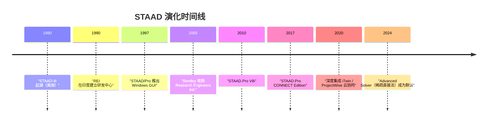

| 属性 | 说明 |
|------|------|
| **厂商** | Bentley Systems（美国 Exton），通过 2005 年收购 Research Engineers International (REI) 进入结构 FEA |
| **诞生** | 美国发起，但**研发主力一直在印度浦那**——这是它命令流文化、价格相对友好、规范覆盖广（含印度 IS、英标 BS、欧标 EC、美标 AISC/ACI、中标 GB/JGJ）的根本原因 |
| **核心定位** | **杆系（梁/桁架）+ 板壳**为主、辅以少量实体的**结构工程专用 FEA**，覆盖建筑、工业厂房、塔架、储罐基础、桥梁简支体系 |
| **不擅长** | 3D 实体大模型、强非线性、接触、复杂多物理场 |
| **市场地位** | 在**印度/中东/东南亚/拉美**占有率第一；在**欧美**与 SAP2000/ETABS 共享；在**中国**远弱于 PKPM/YJK，但常见于外资项目 |

> **关键判断**：STAAD.Pro 本质是一个"**文本输入文件的可视化前端 + 编译型 Fortran 求解器 + 规范设计后处理器**"三件套。理解它的最佳钥匙不是 UI，而是 `.std` 文件。

---

## 二、产品矩阵：STAAD 不只是一个 .exe

很多人把 STAAD.Pro 当成单一软件——这是误解。它是一组**围绕 .std 文件共同协作的 Bentley 产品**。

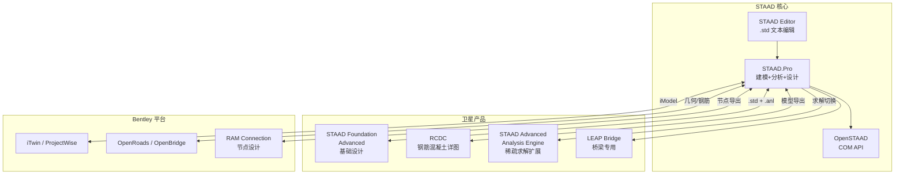

| 产品 | 关系 | 文件交换 |
|------|------|----------|
| **STAAD.Pro** | 主应用，包含 GUI + 编辑器 + Analysis Engine | `.std` 输入 / `.anl` 输出 |
| **STAAD Foundation Advanced (SFA)** | 独立产品，但读 STAAD.Pro 的柱底反力做基础设计 | `.std` + 自有 `.spf` |
| **RCDC** (Reinforced Concrete Designer & Calculator) | 钢筋混凝土详图（IS/BS） | 读 STAAD.Pro 模型 |
| **STAAD Advanced Analysis Engine** | 同一 `.std`，换更强的**稀疏直接法/迭代法**求解 | 求解器替换，输入不变 |
| **OpenSTAAD** | COM 自动化层，可被 Excel/VBA/.NET/Python 调用 | 内存对象 + `.std` 读写 |
| **iTwin / ProjectWise** | 云端版本控制、协同、数字孪生 | `.dgn` / iModel |

> **对 hy-cad-tool 的第一启示**：**产品族要围绕一种"中心文本格式"协同**——STAAD 用 `.std` 把 5 个产品串起来。`hyob` 应当扮演 hy-cad-tool 产品矩阵的同等角色。

---

## 三、`.std` 文件：架构的"基因"

`.std` 是 STAAD 一切设计选择的根。看懂 `.std`，就看懂了 STAAD。

### 3.1 一个最小完整 .std 示例

```text
STAAD SPACE EXAMPLE FRAME

START JOB INFORMATION
ENGINEER DATE 14-May-2026
END JOB INFORMATION

INPUT WIDTH 79
UNIT METER KN

JOINT COORDINATES
1 0 0 0;  2 6 0 0;  3 0 4 0;  4 6 4 0

MEMBER INCIDENCES
1 1 3;  2 2 4;  3 3 4

DEFINE MATERIAL START
ISOTROPIC CONCRETE
E 2.17185e+07
POISSON 0.17
DENSITY 23.5616
ALPHA 1e-05
END DEFINE MATERIAL

MEMBER PROPERTY AMERICAN
1 2 PRIS YD 0.5 ZD 0.3
3 PRIS YD 0.6 ZD 0.3

CONSTANTS
MATERIAL CONCRETE ALL

SUPPORTS
1 2 FIXED

LOAD 1 DEAD LOAD
SELFWEIGHT Y -1
LOAD 2 LIVE LOAD
MEMBER LOAD
3 UNI GY -20

LOAD COMB 101 ULS
1 1.35 2 1.5

PERFORM ANALYSIS PRINT STATICS CHECK

PRINT MEMBER FORCES LIST 1 TO 3

PARAMETER 1
CODE IS456
FYMAIN 415 ALL
DESIGN BEAM 3

FINISH
```

### 3.2 .std 的语法分层

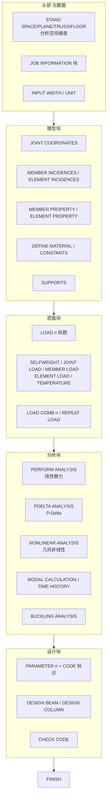

| 块 | 语义 | 与 hy-cad-tool 的对照 |
|----|------|----------------------|
| 头部 | 声明分析维度（SPACE=3D、PLANE=平面、TRUSS=桁架、FLOOR=楼板） | 类似 `FemProblem.SpatialDimension` |
| JOINT/MEMBER/ELEMENT | 节点与单元几何拓扑 | `FemProblem.Mesh.Nodes/Elements` |
| MATERIAL/CONSTANTS | 材料与本构常数 | `FemProblem.Materials` |
| SUPPORTS | 边界条件 | `FemProblem.BoundaryConditions` |
| LOAD | 荷载与组合 | `FemProblem.Loads` |
| PERFORM ANALYSIS | 求解器调用指令 | `FemProblem.Procedure` |
| PARAMETER + DESIGN | 规范检算（IS/AISC/EC/GB） | `ICodeChecker` 调用 |
| FINISH | 结束标志 | — |

### 3.3 `.std` 的设计哲学：六条隐式契约

1. **顺序敏感**：JOINT 必须先于 MEMBER；MATERIAL 必须先于 CONSTANTS——这是 1970s 卡片输入的遗产，也是其"易解析"的代价。
2. **行内分隔符 `;` 与续行 `-`**：保留了 Fortran 固定列输入的灵魂。
3. **重复定义 = 覆盖**：后写覆盖前写——既是便利也是隐患。
4. **隐式分组**：`MEMBER LOAD\n 3 UNI GY -20`——荷载块自动归到上一个 `LOAD n`。
5. **块之间共享坐标系**：所有 LOAD 共享一份 JOINT，全局唯一。
6. **PERFORM 是动词**：`.std` 不是数据文件，是**带副作用的脚本**——`PERFORM ANALYSIS` 真的会触发求解，`PRINT` 真的会写到 `.anl`。

> **对 hy-cad-tool 的第二启示**：`.std` 是**"数据 + 命令"同文件**的典范——既存在物（JOINT/MEMBER），也存在动作（PERFORM/PRINT）。`hyob` 必须做出选择：是纯数据（推荐），还是数据 + 命令（须有"命令仅声明、不执行"的强契约）。

---

## 四、整体架构：三层 + Engine 子进程

STAAD.Pro 在 V8i 之后形成了下面这个**经典三层结构**。它和阵营 A（ANSYS/ABAQUS）的本质区别是——**Pre 与 Engine 之间靠文本文件解耦**，而非内存共享。

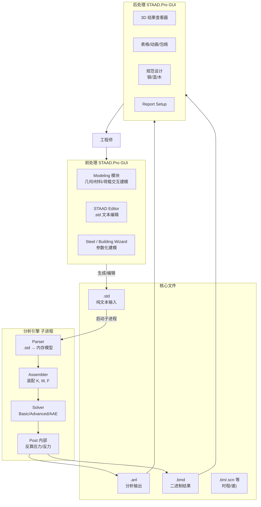

### 4.1 三层之间的"边界协议"

| 边界 | 协议 | 评价 |
|------|------|------|
| **GUI ↔ .std** | 双向：GUI 修改 → 重写 `.std`；`.std` 修改 → GUI 重新加载 | 两边可能不同步，是 STAAD 用户体验的一大痛点 |
| **.std ↔ Engine** | 单向：`.std` 是 Engine 唯一输入 | 干净，可服务器端跑、可批处理 |
| **Engine ↔ .anl/.bmd** | Engine 写、GUI 读 | 二进制 `.bmd` 是性能关键 |
| **GUI ↔ Engine** | 通过 `STAAD.exe -p <file.std>` 子进程调用 | 简洁但缺乏进度回调 |

### 4.2 子进程模型的代价与红利

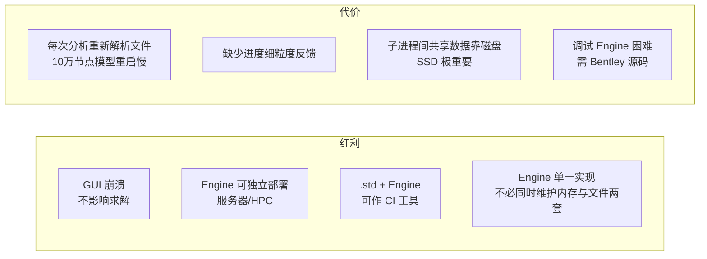

> **对 hy-cad-tool 的第三启示**：**Engine 子进程化是优于 in-process DLL 的架构**——它让 Engine 可被服务器/CI 独立调用，让 GUI 崩溃不杀求解，也让 Engine 可以用与宿主不同的技术栈（如 hy-cad-tool 主体 C#、Engine 可以是 Fortran/Rust）。

---

## 五、求解内核：从 Fortran 谱系到现代稀疏直接法

STAAD 的求解器演化暗合整个 FEA 界的"性能升级史"。

### 5.1 求解器的三代谱系

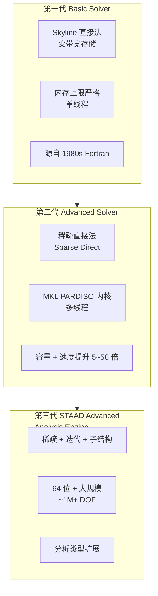

| 代别 | 节点上限（典型） | 适用 | 备注 |
|------|------------------|------|------|
| Basic | < 5 万节点 | 中小项目 | 默认，免费随主程序 |
| Advanced | 10~30 万 | 大型钢结构、塔架 | 需独立 License |
| AAE | 100 万+ | 大跨度桥梁、大型工业 | 高端 License + HPC |

### 5.2 装配阶段的关键数据结构

STAAD 的 Engine 内核（推测自 Fortran 习惯与公开手册）采用经典三段式：


| 阶段 | 数据结构 | 关键算法 |
|------|----------|----------|
| EquationNumbering | `INT(NDOF)` 数组，DOF→方程号映射 | RCM 重排序（减带宽） |
| Local Stiffness | 每单元 6×6 / 12×12 / 24×24 块 | Gauss 积分 + B-matrix |
| Global Assembly | 稀疏 CSR/CSC | 直接组装到全局矩阵 |
| BC Application | 罚因子或行列消去 | 通常罚因子（保对称） |
| Solve | LDLᵀ 或 LU | PARDISO / 自研 skyline |
| Stress Recovery | 单元局部坐标系应力/内力 | 单元节点位移逆向 |

### 5.3 STAAD 单元库

| 单元 | 命令 | 节点 | DOF/节点 | 用途 |
|------|------|------|----------|------|
| **梁单元** | MEMBER | 2 | 6（3T+3R） | 钢/混梁柱、桁架杆 |
| **桁架单元** | MEMBER TRUSS / TENSION | 2 | 3（仅平动） | 桁架、拉杆 |
| **三角形板** | ELEMENT (3) | 3 | 6 | 楼板、墙 |
| **四边形板** | ELEMENT (4) | 4 | 6 | 楼板、墙、壳 |
| **实体单元** | SOLID (4/6/8) | 4–8 | 3 | 大体积砼、坝、基础 |
| **表面单元** | SURFACE INCIDENCE | n | 6 | 剪力墙宏单元 |
| **弹簧/Released** | MEMBER RELEASE | — | — | 释放局部端约束 |

> **3D 实体能力弱的根本原因**：STAAD 的 SOLID 仅支持线性低阶（无二阶 10 节点四面体、无完整六面体二阶族），且不支持接触、内嵌钢筋、塑性等真正 3D 实体所需特性。**它是杆系软件，实体是补丁**。

### 5.4 分析类型矩阵

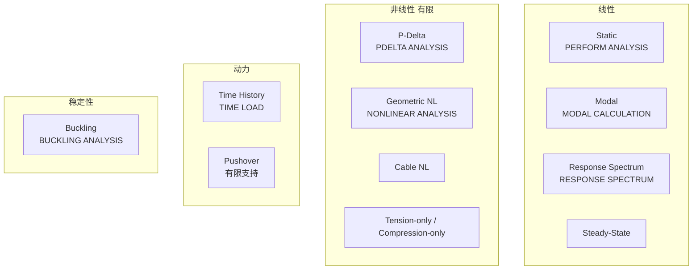

| 类型 | STAAD 支持度 | 工业级强度 |
|------|--------------|------------|
| 线性静力 | ◎ | 行业标杆 |
| P-Delta（二阶效应） | ◎ | 行业标杆 |
| 模态/反应谱 | ◎ | 强 |
| 时程 | ○ | 中（不如 OpenSees/SAP2000） |
| 屈曲 | ○ | 中 |
| 几何非线性 | △ | 弱 |
| 材料非线性 | × | 几乎没有 |
| 接触 | × | 无 |

---

## 六、规范设计模块：STAAD 真正的护城河

> **没有规范模块，STAAD 就是一个壳子。**

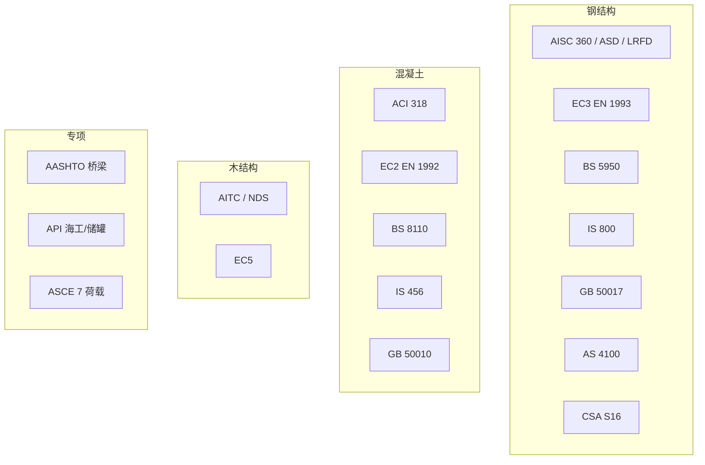

### 6.1 设计模块的调用契约

每个设计模块都是一个**独立的 Fortran/C 子程序集合**，通过 `.std` 中的 `PARAMETER + CODE` 块激活：

```text
PARAMETER 1
CODE IS456
FYMAIN 415 ALL
FC 25 ALL
MINMAIN 12 ALL
TRACK 2 ALL
DESIGN BEAM 1 TO 10
```

| 元素 | 角色 | 对应 hy-cad-tool |
|------|------|------------------|
| `PARAMETER n` | 设计参数组 ID | `ICodeCheckerContext` |
| `CODE IS456` | 规范选择器 | `ICodeCheckerRegistry.Resolve("IS456")` |
| `FYMAIN / FC / ...` | 规范专用参数 | `Parameters` dict |
| `DESIGN BEAM / COLUMN / FOOTING` | 检算动作 | `ICodeChecker.Check()` |

> **对 hy-cad-tool 的第四启示**：**"设计参数 → 规范选择器 → 检算动作"是结构 FEM 的通用三段式**。`ICodeCheckerRegistry` 应当原生支持这种"参数组 + 规范 + 检算动作"的三段语法，而不是把参数硬编码进求解器。

---

## 七、OpenSTAAD：COM API 的二次开发架构

OpenSTAAD 是 STAAD.Pro 的脚本/集成入口，**反映了 Bentley 对"可编程性"的真实态度**。

### 7.1 OpenSTAAD 的对象模型

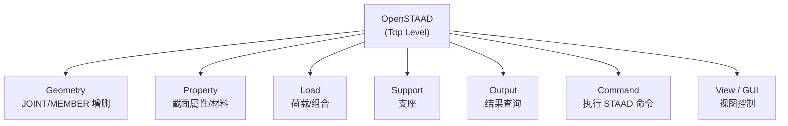

### 7.2 一个典型脚本（VBA / Python via pywin32）

```python
import win32com.client
os = win32com.client.Dispatch("OpenSTAAD.Application")
os.NewProj(1, "demo.std")
geom = os.Geometry
geom.AddNode(1, 0, 0, 0)
geom.AddNode(2, 6, 0, 0)
geom.AddBeam(1, 1, 2)
prop = os.Property
prop.CreateBeamPropertyFromTable(1, "W14X22", "AISC")
prop.AssignBeamProperty(1, 1)
os.Analyze()
out = os.Output
fx = out.GetMemberEndForces(1, 0, 1)
```

### 7.3 OpenSTAAD 架构的优劣判定

| 优势 | 劣势 |
|------|------|
| **COM 跨语言**：VBA/Excel/.NET/Python 通用 | **COM 已老**：跨平台困难（仅 Windows） |
| **同步可见性**：脚本改动 GUI 立即刷新 | **API 边界混乱**：GUI 命令、引擎命令、对象方法混在一起 |
| **进入门槛低**：会 VBA 就能用 | **大规模性能差**：万级单元逐 Add 极慢 |
| **可与 Excel 互通**：荷载表来自 Excel | **缺乏异步/事件流**：长任务无进度 |
| **可调用 STAAD 命令字符串**（`os.SendCommand` 类似机制） | **离线脚本能力受限**：必须启动 STAAD.exe |

> **对 hy-cad-tool 的第五启示**：API 必须**异步、跨进程、可组合**——COM 是 1990s 的产物，hy-cad-tool 应当采用 **gRPC / Named Pipe / MCP** 作为外部脚本入口，并提供**批量操作 API**避免 OpenSTAAD 的逐项添加性能陷阱。

---

## 八、与 Bentley 生态的耦合：从孤岛到 iTwin

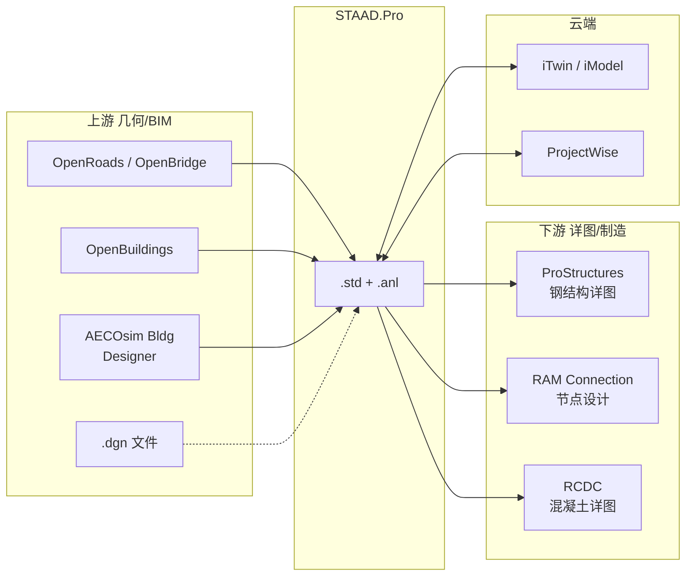

| 链接 | 协议 | 评价 |
|------|------|------|
| OpenBuildings → STAAD | ISM (Integrated Structural Modeling) | Bentley 的"IFC 替代品"，**只在 Bentley 圈生效** |
| STAAD ↔ RAM Connection | 文件交换 + COM | 节点反力到节点设计 |
| STAAD → ProStructures | 几何 + 截面 | 钢结构详图 |
| STAAD ↔ Revit | IFC / ISM Revit Plugin | 双向但有损 |
| STAAD ↔ iTwin | iModel | 较新，仍在演化 |

> **对 hy-cad-tool 的第六启示**：Bentley 用 **ISM** 试图建立私有 BIM 中间表示——失败了（IFC 仍是工业标准）。教训：**不要重造 BIM 中间表示**，应当**做开放标准的优等生**（IFC 4.x、glTF、IFC-XML）。

---

## 九、文件 I/O 详解

| 文件 | 角色 | 格式 | 是否可手编 |
|------|------|------|------------|
| `.std` | 主输入 | 纯文本 | ◎ 推荐 |
| `.anl` | 分析回显 + 文本输出 | 纯文本 | △ 只读 |
| `.bmd` | 二进制结果（位移/内力） | 二进制 | × |
| `.scn` | 反应谱 | 文本 | ○ |
| `.tim` | 时程曲线 | 文本 | ○ |
| `.tns` | 时程结果 | 二进制 | × |
| `.dsp` | 位移摘要 | 文本 | △ |
| `.l*` | 各 LOAD 结果 | 二进制 | × |
| `.ifc` | IFC 导出 | XML/STEP-IFC | ○ |
| `.dgn` | Bentley 几何 | 二进制 | × |

> **关键观察**：STAAD 把**输入文本化**做到极致，但**输出文本化只做了一半**——`.bmd` 二进制仍是结果存储主体。这是 1990s 内存/磁盘性能权衡的产物，今天看应当**统一为 HDF5 / Parquet**。

---

## 十、优劣总判：STAAD 的"能力位面"

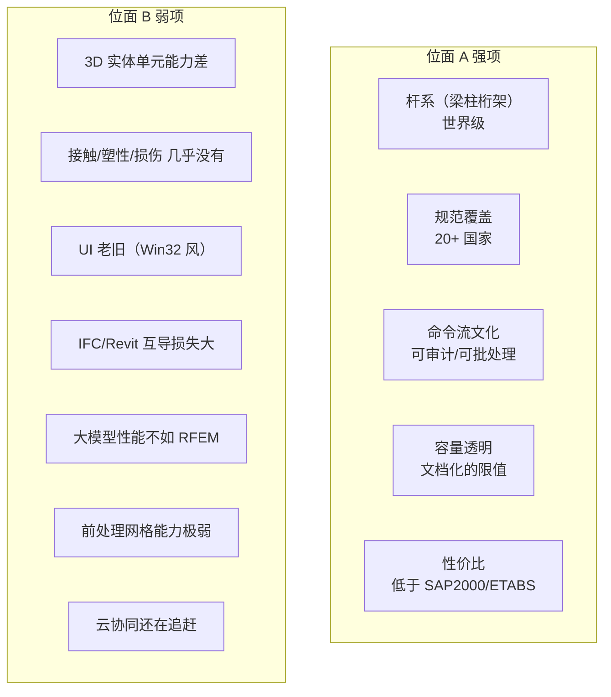

### 10.1 横向定位（与阵营 B 同类对比）

| 维度 | STAAD.Pro | SAP2000 | ETABS | MIDAS Gen | RFEM | SCIA |
|------|:---------:|:-------:|:-----:|:---------:|:----:|:----:|
| 杆系 + 壳 | ◎ | ◎ | ◎ | ◎ | ◎ | ◎ |
| 3D 实体 | △ | △ | △ | ○ | ○ | ○ |
| 施工阶段 | △ | △ | △ | ◎ | ○ | ○ |
| 规范广度 | ◎ | ○ | ○ | ◎ | ◎ | ◎ |
| 命令流可审计 | ◎ | ○ | △ | △ | ○ | ○ |
| API 现代化 | △（COM） | ◎（OAPI） | ◎ | △ | ◎ | ◎（.NET） |
| BIM 互导 | ○ | ○ | ○ | ○ | ◎ | ◎ |
| 价格 | ○（中等） | △（贵） | △（贵） | ○ | ○ | ○ |

---

## 十一、对 hy-cad-tool 的九条具体启示

> 这一节是本文的"落地句"——把上面的全部分析收敛为可执行的设计决策。

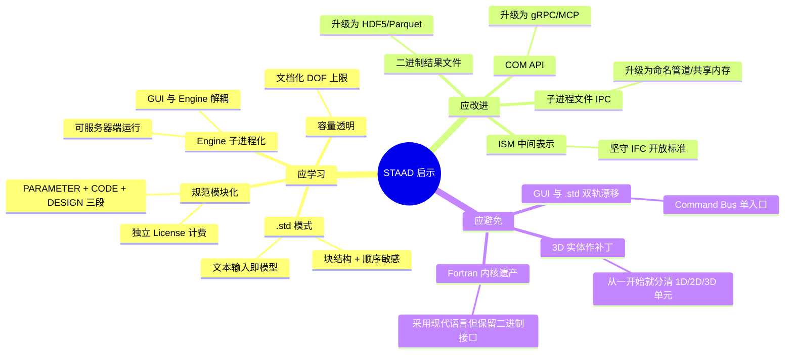

### 启示卡片

| # | 启示 | hy-cad-tool 行动项 | 优先级 |
|---|------|---------------------|--------|
| 1 | **中心文本格式串联产品族** | 让 `hyob` 扮演 `.std` 的角色，统一前处理、求解、报告、外接工具 | P0 |
| 2 | **数据 + 命令同文件需明确契约** | `hyob` 默认为纯数据；任何"命令"必须显式标记 `kind: command` 并禁止隐式副作用 | P0 |
| 3 | **Engine 子进程化** | `IFemSolverBackend` 默认走子进程模式，传入 `hyob`，写回 `result.h5` | P0 |
| 4 | **设计参数三段式** | `ICodeCheckerRegistry` 内建 `{Parameters, CodeId, TargetSelector}` 三段语法 | P1 |
| 5 | **现代 API 替代 COM** | OpenSTAAD 的功能用 **MCP + gRPC** 重写；批量 API 必须存在 | P1 |
| 6 | **拒绝私有 BIM 中间表示** | 互操作只走 IFC 4.x / glTF / DWG；不造 ISM 类轮子 | P0 |
| 7 | **结果文件用 HDF5/Parquet** | 替代 STAAD `.bmd` 这类不可审计的私有二进制 | P1 |
| 8 | **容量约束透明文档化** | `ModelCapacityPolicy` 写在 docs，对外承诺、强制校验 | P2 |
| 9 | **从一开始区分 1D/2D/3D 单元谱系** | 不要走 STAAD"杆系为本、实体为补"的老路；底座设计就要支持 3D 实体一等公民（即使 v0.1 只实现 1D） | P0 |

### 与 02 文档的具体对接

回看 [02 通用底座](../../02-有限元通用底座架构-从挡土墙开始-2026-05-14.md) 的五层结构：

| 02 文档的层 | 从 STAAD 学到什么 |
|--------------|--------------------|
| **L5 工程领域** | 学 STAAD 的 `JOB INFORMATION` 元数据 + `PERFORM ANALYSIS` 动词 |
| **L4 IR (`FemProblem`)** | 学 `.std` 的"块结构 + 顺序敏感"分层，但用现代 YAML/TOML 替代列定位 |
| **L3 装配** | 学 STAAD 的 EquationNumbering + RCM 重排序 |
| **L2 求解后端** | 学 Basic → Advanced → AAE 的**求解器分级**，不要"一份代码包打天下" |
| **L1 结果** | 学 `.bmd` 的逐 LOAD/COMB 分文件设计，但用 HDF5 替代私有二进制 |
| **L0 工程报告** | 学 `PARAMETER + CODE + DESIGN` 三段式注入设计规范 |

---

## 十二、风险与陷阱：如果照抄 STAAD 会发生什么

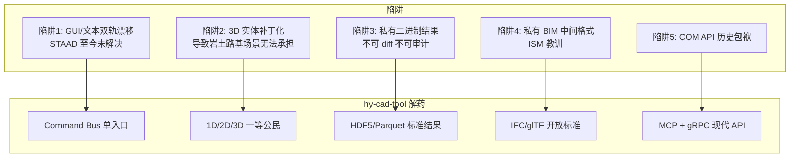

| 风险 | hy-cad-tool 防线 |
|------|------------------|
| 双轨漂移 | 单一 `Command Bus` + `hyob` 作为唯一持久态 |
| 3D 实体瘸腿 | 底座（02 文档 L3 装配）支持**单元公式插件**——梁/壳/实体都是平等插件 |
| 私有二进制 | `FemResult` 落盘强制 HDF5 + JSON 索引 |
| BIM 私有中间表示 | `IBimInteropPort` 只允许 IFC 4.x / glTF |
| 老旧 API | `IMcpServerPort` + `IGrpcSolverPort` |

---

## 十三、附录：STAAD `.std` 备查命令清单

> 仅列与底座对照相关的关键命令，完整列表见 Bentley *STAAD.Pro Technical Reference*。

### 13.1 模型类

```text
STAAD SPACE | PLANE | TRUSS | FLOOR
UNIT METER KN | FEET KIP | ...
JOINT COORDINATES
MEMBER INCIDENCES
ELEMENT INCIDENCES SHELL | SOLID
DEFINE MATERIAL START ... END DEFINE MATERIAL
CONSTANTS
SUPPORTS  (FIXED | PINNED | ENFORCED | FIXED BUT n m k)
MEMBER PROPERTY AMERICAN | EUROPEAN | INDIAN | CHINESE | ...
MEMBER OFFSETS
MEMBER RELEASE
MEMBER TRUSS | TENSION | COMPRESSION
```

### 13.2 荷载类

```text
LOAD n [LOADTYPE DEAD | LIVE | SEISMIC | ...]
SELFWEIGHT [X | Y | Z] factor
JOINT LOAD
MEMBER LOAD  (UNI | CON | TRAP | LIN | UMOM | CMOM)
ELEMENT LOAD
TEMPERATURE LOAD
LOAD COMB n  [SRSS | ABS]
REPEAT LOAD
```

### 13.3 分析类

```text
PERFORM ANALYSIS [PRINT STATICS CHECK | LOAD DATA | ...]
PDELTA n ANALYSIS
NONLINEAR n ANALYSIS
MODAL CALCULATION REQUESTED
RESPONSE SPECTRUM ... DAMP ... ZIP/CQC/SRSS
TIME HISTORY ...
BUCKLING ANALYSIS
```

### 13.4 设计类

```text
PARAMETER n
CODE  IS456 | ACI318 | AISC360 | EC2 | EC3 | BS5950 | GB50017 | ...
<参数键值> ALL | LIST ...
DESIGN BEAM | COLUMN | FOOTING | SLAB
CHECK CODE
```

### 13.5 输出与结束

```text
PRINT MEMBER FORCES | JOINT DISPLACEMENT | SUPPORT REACTION | ANALYSIS RESULTS
SECTION FORCES
FINISH
```

---

## 十四、参考资料

- Bentley Systems, *STAAD.Pro CONNECT Edition Technical Reference Manual*
- Bentley Systems, *STAAD.Pro CONNECT Edition Verification Manual*
- Bentley Systems, *OpenSTAAD Function Reference*
- Bentley Systems, *STAAD Advanced Analysis Engine Theory Manual*
- Intel, *MKL PARDISO User's Guide*（STAAD Advanced Solver 底层）
- 上承文档：
  - [01-全球三维有限元软件对标调研](../../01-全球三维有限元软件对标调研-2026-05-14.md)
  - [02-有限元通用底座架构](../../02-有限元通用底座架构-从挡土墙开始-2026-05-14.md)

---

## 修订记录

| 日期 | 修订人 | 说明 |
|------|--------|------|
| 2026-05-14 | — | 初版：STAAD.Pro 架构十二章深度解析 + 九条 hy-cad-tool 启示 |
