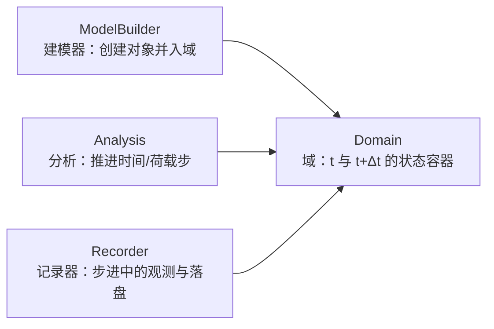
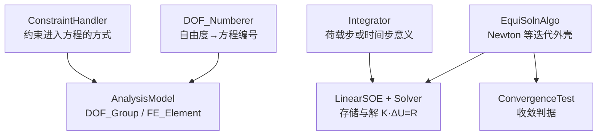

# OpenSees 有限元计算架构深度解析（UC Berkeley / PEER）

> 文档日期：2026-05-14  
> 上承：[../01-全球三维有限元软件对标调研-2026-05-14](../../01-全球三维有限元软件对标调研-2026-05-14.md)  
> 并行：[../02-有限元通用底座架构-从挡土墙开始-2026-05-14](../../02-有限元通用底座架构-从挡土墙开始-2026-05-14.md)  
> 文档目的：  
> 1. 从**软件架构**而非功能清单角度，解析 **OpenSees**（Open System for Earthquake Engineering Simulation）的对象模型、分析流水线、并行范式与脚本接口。  
> 2. 明确其与 **ANSYS / ABAQUS** 等单体「产品 + GUI + 求解核」模式的本质差异：**面向地震工程与非线性仿真的 C++ 组件框架 + 可替换解释器**。  
> 3. 抽取对自研底座（如 `Domain` / `AnalysisPipeline` / `ISolverBackend`）可借鉴的**正反面模式**。

---

## 一、总览与定位

### 1.1 OpenSees 不是「一款有限元软件」，而是 Berkeley 引领的框架

OpenSees 由加州大学伯克利分校主导、通过 **太平洋地震工程研究中心（PEER, Pacific Earthquake Engineering Research Center）** 等学术网络长期演化，是典型的 **面向对象有限元框架（object-oriented FEM framework）**：以 C++ 抽象类定义接口，大量具体单元、材料、算法以子类形式挂载；用户侧多通过 **脚本驱动的解释器**（历史上以 Tcl 为主，当前 Python/OpenSeesPy 极为流行）把「模型 + 分析 + 输出」组织为**程序**而非静态输入卡。官方 Wiki 强调其性质是 **simulation framework**，并非法规意义上的「设计规范软件」；可执行文件 `OpenSees.exe` 只是该框架的一种打包形态。（参见 [Introduction to OpenSees — OpenSeesWiki](https://opensees.berkeley.edu/wiki/index.php/Introduction_to_OpenSees)）

与本文集中剖析的商业通用 FEA 相比：

| 维度 | 典型商业 FEA（如 MAPDL、Abaqus Solver） | OpenSees |
|------|------------------------------------------|----------|
| 产品形态 | 单体求解核 + 深前后处理 + 许可销售 | 开源框架 + 社区扩展 + 多解释器 |
| 用户心智 | 「打开 GUI / 递交 inp / 等 .odb」 | 「写 Tcl/Python，装配 Analysis 组件」 |
| 强项侧重 | 广谱多物理、制造与认证链条 | 非线性结构、地震与韧性（PBSE）、研究可复制性 |
| 扩展方式 | UPF/子程序 + 厂商发协议 | **新增 C++ 子类** + 注册到命令层 |

### 1.2 四大顶层抽象（ Wiki 级心智模型）

官方把框架主干归纳为四类协作对象（同一来源 Wiki）：

- **ModelBuilder**：负责从脚本命令实例化 `Node`、`Element`、`Material` 等，并注册进 `Domain`。历史上 `TclModelBuilder` 是核心入口之一；现今解释器层已演进为更统一的命令分发（如 `OpenSeesCommands` 注册表思路，源码树可见 `SRC/interpreter/`）。  
- **Domain**：**中心组件**，持有几何离散、本构、边界、荷载图案等，并在分析过程中维护物理量状态。  
- **Analysis**：把「域状态」从 \(t\) 推进到 \(t+\Delta t\)（静力为荷载子步意义下的推进）。  
- **Recorder**：与求解过程正交交叉的「观测面」，将指定节点/单元的响应写入文件或后端可视化格式。

---

## 二、解释器层：Tcl、Python（OpenSeesPy）与「命令即 API」

### 2.1 历史主线：Tcl 扩展解释器

OpenSees 早期将 **Tcl** 作为首要用户界面：解释器在标准 Tcl 之上增加建模、分析、输出命令；用户提交的 `.tcl` 在语义上是**可执行的程序**（变量、过程、控制流、文件 I/O），而不是被动解析的固定格式输入文件。Wiki 列出的可执行形态包括顺序版 **OpenSees.exe** 以及并行变体 **OpenSeesSP.exe / OpenSeesMP.exe**（命名在不同资料中偶见笔误，以官方并行页为准）。（[Introduction to OpenSees](https://opensees.berkeley.edu/wiki/index.php/Introduction_to_OpenSees)）

### 2.2 现实主线：OpenSeesPy 作为 Python 3 前端

**OpenSeesPy** 将同一套内核以 `import openseespy.opensees as ops` 的方式暴露给 Python 3，命令风格与 Tcl 高度同构（如 `ops.model('basic', ...)`、`ops.analyze(...)`），便于与 **NumPy / SciPy / 机器学习 / 工作流编排** 共处同一运行时。官方文档声明其为「Python 3 interpreter of OpenSees」，并说明许可与商用再分发边界（研究、教育、内部使用与商用云服务的区别）。（[OpenSeesPy 文档](https://openseespydoc.readthedocs.io/en/latest/)）

### 2.3 架构启示（对 hy-cad-tool 一类宿主）

- **命令注册表 + 解释器** 是与 **Domain/Analysis** 解耦的边界：新增单元/材料时，既改 C++ 内核，也要在解释器层暴露一致命令，避免「 GUI 一种语义、脚本另一种语义」。  
- **双解释器（Tcl/Python）** 说明：**领域模型应稳定**，语法层可迭代；这与自研中「几何/网格 → 中性域模型 → 多后端」的分层思路一致。

---

## 三、Tagged（标号）体系与对象身份

OpenSees 中绝大多数模型对象以 **整数 tag** 作为主键引用（如 `node 1 ...`、`element truss 1 ...`）。在 C++ 内核中，**`TaggedObject`** 传统（配合整数 **`classTag`**，集中定义于 `SRC/classTags.h`）用于：

- 在容器（`Domain`、工厂、分析组件注册）内唯一标识对象类别；  
- 支持并行与分布式场景下的 **序列化 / 反序列化** 与 **对象经纪人（ObjectBroker）** 重建（`SRC/actor/objectBroker/` 路径体现该设计）。

对架构阅读者而言：这不是数据库主键那么简单，而是 **「类型 ID + 实例 tag + 经纪人协议」三位一体的插件契约**，使远程进程能按类表恢复对象网络。

---

## 四、Domain：节点、单元、荷载、约束与载况

### 4.1 最小拓扑：Node / Element

- **Node**：存储坐标、自由度集合（由 `model -ndm -ndf` 定义空间维数与节点自由度数）、质量等。  
- **Element**：连接节点拓扑，在分析时向 `AnalysisModel` 侧贡献刚度、质量、阻尼与内力。  
- **几何变换（Geometric Transformation）**：对梁、柱一类单元，将**总体坐标**下的力变形关系映射到单元局部「基本体系」，与非线性梁柱公式的书写密切相关。

### 4.2 材料层次：Uniaxial / nD / Section

Wiki 与命令手册沿工程习惯把材料分为：

- **`uniaxialMaterial`**：一维应力–应变（或杆系意义上的力–变形）定律，适合杆系、纤维截面中的单纤维本构。  
- **`nDMaterial`**：多维本构，用于平面应力/应变、实体等连续体单元。  
- **`section`**：截面级对象（弹性截面、聚合截面、**纤维截面 Fiber section** 等），把若干单轴本构与几何分区组合，再与 **`beamIntegration`** 等一块儿交给 **非线性梁柱单元**。

这一条链对 **钢筋混凝土与型钢组合截面** 至关重要：OpenSees 的「梁柱非线性」往往不是在单元形函数里硬编码本构，而是 **Section → Fiber → Uniaxial** 的组合。

### 4.3 荷载域：TimeSeries / Pattern / Load

- **TimeSeries**：时间函数 \(f(t)\)。  
- **pattern**（如 `Plain`、`MultipleSupport` 等）：把节点荷载、单元荷载、支座运动等绑定到时间轴与荷载因子。  
- **SP / MP 约束**：单点约束与多点约束进入 `Domain`，后续由 **ConstraintHandler** 决定如何进入方程组（罚函数、Lagrange、变换约束等）。

---

## 五、Recorder：求解过程的横切关注点

**Recorder** 在步进循环中被回调，按用户指定的粒度抓取位移、反力、单元变形、截面曲率等，并可输出到文本、数据库类后端，或 **VTK / PVD / Gmsh** 等可视化载体（源码树 `SRC/recorder/` 中可见多类实现）。  

架构角色上，Recorder 类似商业求解器中的 **history / monitor / results bridge**，但更接近「观察者模式」：**不修改平衡方程**，只读 Domain 状态；与 **Analysis** 生命周期绑定但可独立增删。

---

## 六、分析子系统：从组件装配到时间推进

OpenSees 的静力 / 动力非线性分析采用典型的 **七件套组件流水线**（社区源码导读与官方 Wiki「analysis 定义顺序」一致；亦见对 `OpenSeesCommands` 注册职责的第三方归档说明）：

### 6.1 推荐配置顺序（脚本层）

Wiki 建议按 **`constraints` → `numberer` → `system` → `test` → `algorithm` → `integrator` → `analysis`** 构造组件，最后 `analyze` 执行增量步。每种 **`analysis` 类型**（如 `Static`、`Transient`、`VariableTransient`）会把上述零件组装为具体 **Analysis 子类**。（[Introduction to OpenSees — Analysis definition](https://opensees.berkeley.edu/wiki/index.php/Introduction_to_OpenSees)）

### 6.2 关键类的架构职责（精要）

| 组件 | 职责摘要 | 典型实现举例 |
|------|-----------|----------------|
| ConstraintHandler | 处理 `SP_Constraint` / `MP_Constraint` | Plain, Penalty, Lagrange, Transformation |
| DOF_Numberer | 优化方程排序（带宽/稀疏性） | 与 RCM、AMD 等排序算法结合 |
| AnalysisModel | **分析侧**对 Node/Element 的再包装（`DOF_Group`、`FE_Element`） | 唯一实现，桥接 Domain 与代数系统 |
| EquiSolnAlgo | 迭代求解外壳 | Newton, ModifiedNewton, KrylovNewton, BFGS… |
| Integrator | 形成切线/残差，定义步进规则 | LoadControl, DisplacementControl, Newmark, HHT, CentralDifference… |
| ConvergenceTest | 结束迭代的判据 | 能量范数、位移增量范数、不平衡力范数… |
| LinearSOE | 代数系统存储与求解接口 | 剖分矩阵、稀疏列存、**Umfpack**、**MUMPS** 等 |

**EigenSOE** 支路（`ArpackSOE` 等）用于模态与动力特性分析，与静力/瞬态主路径并列。

### 6.3 与「算法可插拔」相关的设计决策

OpenSees 把 **步进（Integrator）** 与 **迭代外壳（Algorithm）** 分离：**同一非线性体系可在不同时间积分与不同 Newton 变体间重组**。这带来极大自由度，也带来使用者门槛——商业软件往往在 GUI 里藏起非法组合，而 OpenSees 把责任交给分析师脚本。

---

## 七、并行与 MPI：OpenSeesSP / OpenSeesMP 及域分割

官方并行页面指出：为利用集群与多核，OpenSees 提供两种基于 **MPI** 的解释器扩展（与顺序版同属「扩展解释器」家族）：（[OpenSees Parallel](https://opensees.berkeley.edu/OpenSees/parallel/parallel.php)）

| 变体 | 设计意图 | 典型用法心智 |
|------|-----------|----------------|
| **OpenSeesSP** | **极大模型**的单次分析 | 侧重**自动域分解**；通常单进程读入脚本、建域后分区，大规模并行求解器配合（文档亦提及 **MUMPS** 等系统矩阵对象） |
| **OpenSeesMP** | **参数研究**或需 **用户自定义分区** 的大模型 | 多进程执行同一脚本，通过 `getPID` / `getNP` 等并行命令显式分配对象到子域；灵活高、脚本负担重 |

**现状与建议（实践语境）**：HPC 场所（如历史上 **XSEDE**、现今 **DesignSafe/NHERI**）长期提供预编译或容器化并行可执行文件；用户需在本地安装 **MPICH2 / OpenMPI** 等 MPI 运行库并以 `mpiexec -np ...` 启动。官方页面亦提示早期并行发行版曾标为「新」并不断依赖社区报障迭代——因此在工程生产中，应 **固定内核与 MPI 组合**、以回归脚本锁定行为，而不是默认「最新即最稳」。

**概念要点**：并行不仅关于「更大刚度阵」，更关于 **ObjectBroker + PartitionedDomain** 一系的**分布式对象图**：网络拓扑、ghost 自由度、子域界面约束与求解器预处理强耦合——这解释了为何 SP/MP 分裂为「自动 vs 手工」两极。

---

## 八、建模语言、前置与后置生态

### 8.1 「语言」实质：命令 = 构造器调用链

OpenSees 没有统一二进制项目文件：**模型真相 lives in 脚本**（`.tcl` / `.py`）。这带来：

- ✓ 可追溯、可版本管理、适合论文复现；  
- ✗ 缺少单一「标准前处理」意味着几何—网格—分析—后处理链条长期碎片化。

### 8.2 前置：学术工具链拼接

常见路径包括：CAD/别的网格器导出中性网格 → Python 读入生成 OpenSees 单元；或使用 **OpenSeesPy 自带预处理方法**（官方文档列有 *Preprocessing Commands* 章节入口）。（[OpenSeesPy 文档目录](https://openseespydoc.readthedocs.io/en/latest/)）

### 8.3 后置：Recorder 驱动 + 外部可视化

除文本与自研绘图外，**VTK/PVD** 等 Recorder 可把时间序列导入 ParaView；亦存在云服务形态（文档提及 **OpenSees Cloud**、AWS AMI 等运营级封装）以解决「安装 + 算力 + 浏览器看图」的一体化——本质仍是 **OpenSees 核心 + IT 封装**。

---

## 九、与商业通用 FEA 的对标要点

| 主题 | 商业软件（ANSYS/ABAQUS 等） | OpenSees |
|------|-----------------------------|----------|
| **一致性边界** | GUI、求解输入卡、材料库、许可节点强绑定 | 脚本即真相；版本差异由用户自负 |
| **非线性范式** | 广谱、面向工业认证与大量内置诊断 | **地震工程与非线性结构**深度优化；梁柱纤维体系极丰富 |
| **并行体验** | 厂商求解器 + 作业调度 + 自动预处理 | SP/MP 双路线；与 MPI、分区策略强相关 |
| **扩展方式** | Datalayer / UPF / 插件合同 | **C++ 继承 + classTag + 命令注册**；社区 PR 驱动 |
| **可信与规范** | 多国规范、认证与供应链叙事 | 「可复现研究」优先；规范校核多在用户侧后处理 |

**对自研底座的借鉴**：OpenSees 证明「**稳定 Domain + 可替换 Analysis 组件注册**」比「把所有分析类型写死在单体内核」更利于学术与专业分支并行演进；但其代价是**缺少强类型 GUI 约束**，需要自研工具在架构上补偿（非法组合的早期诊断、可视化拓扑、作业模板）。

---

## 十、可参考的扩展路径（研究者 / 产品化团队）

1. **新单元 / 新材料**：按 `Element` / `Material` 抽象实现子类 → 更新 `classTags` / ObjectBroker → 暴露 Tcl 与 Python 命令（避免仅 Fork 脚本层）。  
2. **新求解策略**：实现自定义 `Integrator` 或 `EquiSolnAlgo`，通过 `LinearSOE`/`LinearSolver` 与外部库（稀疏直接法、代数多重网格）对接。  
3. **域级新物理**：在 `Domain` 侧引入新 `LoadPattern` 或场量，保持 Analysis 组件接口稳定。  
4. **并行**：从 OpenSeesSP 的自动分解入手验证可扩展性，再在 OpenSeesMP 做算法研究需要的分区与负载试验。  
5. **与 CAD/BIM 衔接**：在 neutral mesh → OpenSees 命令生成之间插入 **强类型中间模型**（类似 hy-cad-tool 中几何—FEM 翻译器的思路），避免把几何细节泄漏进每条 `element` 命令。

---

## 十一、关键结论（摘要）

- OpenSees 是 **UC Berkeley / PEER 生态**下的 **面向对象地震工程仿真框架**，不是一个与 Workbench/CAE 对标的单体商业产品；其第一用户接口是 **可编程解释器**（Tcl 与 Python）。  
- **`Domain`—`Analysis`—`Recorder`三分法** 加上 **Analysis 七件套组件装配**，构成其可扩展非线性求解架构的核心。  
- **`Section / Fiber / Uniaxial` 链条**承载了大量结构非线性的「物理真实感」，是它与通用实体单元栈错位竞争的关键。  
- **OpenSeesSP / OpenSeesMP** 体现 **自动域分解 vs 手工并行** 的工程权衡，底层依赖 **MPI 与分布式对象图**；在 HPC 与云端以预置环境运行为主。  
- 对商业 FEA：**在学理深度与开放在前**，在 **一站式 UX、规范封装、企业级技术支持** 上不占同一条赛道，二者应 **对位借鉴而非对位替代**。

---

## 十二、参考与延伸阅读（作者已核对的公开入口）

1. OpenSees Wiki：《Introduction to OpenSees》— 框架定义、四大抽象、命令顺序与示例。  
   <https://opensees.berkeley.edu/wiki/index.php/Introduction_to_OpenSees>  
2. OpenSees 官方并行页：OpenSeesSP / OpenSeesMP 定位、MPI 启动方式与设计文档链接。  
   <https://opensees.berkeley.edu/OpenSees/parallel/parallel.php>  
3. OpenSeesPy 官方文档：Python 绑定、命令章节、许可说明与安装。  
   <https://openseespydoc.readthedocs.io/en/latest/>  
4. OpenSees 源码仓库（分析/解释器/记录器等目录索引）：  
   <https://github.com/OpenSees/OpenSees>  
5. （教学与历史语境）OpenSees 命令语言手册 PDF（2006）仍有助于理解 Tcl 时代概念沿革：  
   <https://opensees.berkeley.edu/OpenSees/manuals/usermanual/OpenSeesCommandLanguageManualJune2006.pdf>

> **说明**：本文对「`OpenSeesCommands` 组件注册」「`AnalysisModel` / `FE_Element` 桥」等实现级关系的表述，与 Berkeley Wiki 的**概念顺序**及 GitHub 源码树公开结构一致；若需审计到具体函数级调用链，应以你本地检出的 `OpenSees` 提交为准。
