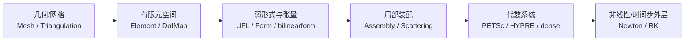
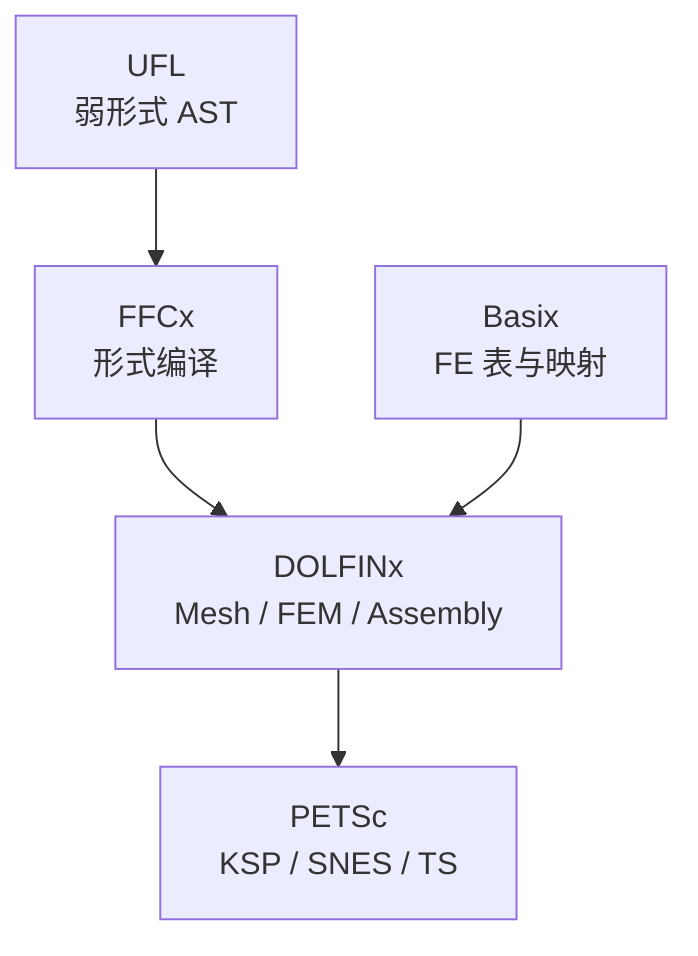
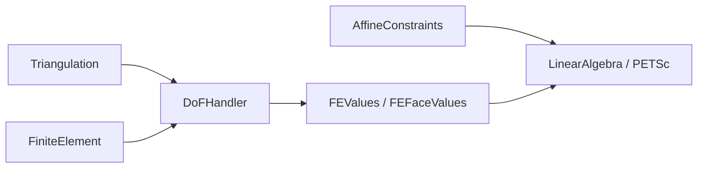
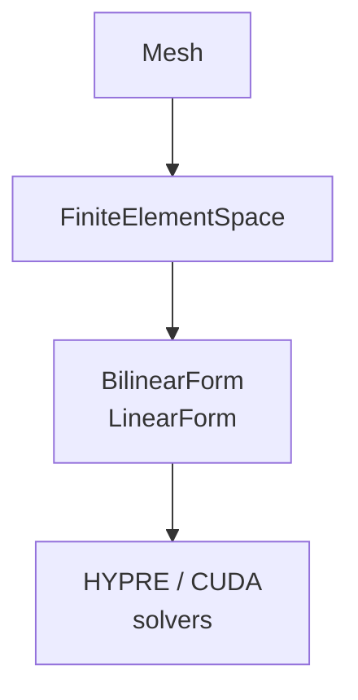

# 开源有限元数值库层架构深度分析：FEniCSx / deal.II / MFEM / FreeFEM

> 文档日期：2026-05-14  
> 上承：[../01-全球三维有限元软件对标调研-2026-05-14](../../01-全球三维有限元软件对标调研-2026-05-14.md)  
> 并行：[../02-有限元通用底座架构-从挡土墙开始-2026-05-14](../../02-有限元通用底座架构-从挡土墙开始-2026-05-14.md)  
> 文档目的：  
> 1. 将 **FEniCSx、deal.II、MFEM、FreeFEM** 视为「**数值库 + 弱形式流水线**」而非完整 CAE 产品，拆解其**网格—空间—形式—装配—求解—后处理**各层的职责边界。  
> 2. 对比四者在 **语言表达（UFL/C++ API/脚本 DSL）**、**单元与自由度模型（Basix / FEValues / H(div)/H(curl)）**、**并行与代数后端（PETSc / HYPRE / 自带）** 上的架构取舍。  
> 3. 为 hy-cad-tool 侧 **`MeshNeutral` → `VariationalForm` → `ISolverBackend`** 一类底座命名与分层提供可验证的业界参照。

---

## 一、定位总览：四者同属「库」，但「中心抽象」不同

| 项目 | 中心抽象 | 典型用户语言 | 与完整 CAE 的关系 |
|------|-----------|--------------|-------------------|
| **FEniCSx** | **符号弱形式（UFL）→ 代码生成 → 装配** | Python 为主（C++ 可嵌入） | 自管网格 I/O 与可视化需外接（Gmsh、ParaView 等） |
| **deal.II** | **C++ 对象网格 + `FEValues` 数值积分门面** | C++（python 绑定存在但生态次要） | 库即内核；前后处理多靠外接或自写 |
| **MFEM** | **高阶空间 + `BilinearForm` / 算子组装** | C++；Python 包装有限 | 与 HYPRE、GPU、断裂 / AMR 等 HPC 场景联系紧 |
| **FreeFEM** | **脚本级 `varf` 变分块 + 内置网格语言** | FreeFEM++ DSL | 「一门语言包打天下」：网格—求解—后处理更单体 |

四者的共同**计算学架构**可压成一张图（与具体类名无关的「库层 FEM 流水线」）：

差异在于：**谁承担「形式到内核」的翻译**（编译期代码生成 vs 运行时 C++ 虚函数 vs 解释型 DSL），以及 **自由度与网格数据结构的紧耦合程度**。

---

## 二、分层模型：便于与自研底座逐项映射

从**库实现者**视角，现代开源 FEM 库普遍可拆为六层（本节是后文四库对照的「坐标系」）。

| 层 | 职责 | hy-cad-tool 侧可映射概念 |
|----|------|---------------------------|
| **L0 数据结构** | 顶点、胞元、邻接、分布式分区 | `MeshTopology` / 图结构与 `GhostCell` |
| **L1 几何与映射** | 参考单元 \(\hat K\) → 物理单元 \(K\) 的 \(F_K\)、Jacobian | `IsoParametricMap` / 数值积分点缓存 |
| **L2 有限元空间** | 单元形函数表、自由度拓扑、`H^1` / `H(curl)` / `H(div)` | `FiniteElementDescriptor` + `DofAllocator` |
| **L3 弱形式与符号** | 试探/检验函数、系数、面积分/边界项、约束 | `IWeakFormBuilder` / UFL 等价物 |
| **L4 装配与矩阵结构** | Sparsity pattern、并行矩阵填充、约束消除 | `IAssembler` → `SparseMatrixHandle` |
| **L5 求解与耦合外层** | 线性求解器选择、块系统、非线性与时间推进 | `ISolverBackend` / `TimeIntegrator` |

下文各库按 **L0–L5** 对照，避免只罗列功能名。

---

## 三、FEniCSx：UFL 中心 + 分拆式组件（DOLFINx / Basix / FFCx）

### 3.1 组件版图（数值库视角）

FEniCS「21 世纪二代」栈 **FEniCSx** 将单体拆为多仓库组件，核心是**把「数学形式」与「执行后端」解耦**：

- **UFL（Unified Form Language）**：纯 Python（及被 ffcx 消费的 AST）表达变分形式；不负责计算，只负责**语义与张量结构**。  
- **Basix**：有限元**插值空间与形函数**的参考单元侧实现（Lagrange、Nédélec、RT、S 型谱元等），向 DOLFINx 提供 tabla 与 push-forward 所需数据。  
- **FFCx（旧 FFC 的继承者）**：把 UFL 形式**编译**为用于装配的 C/内核代码（或生成可被 DOLFINx 调用的 kernel）；是「符号 → 数值」的关键桥梁。  
- **DOLFINx**：网格、分布式 `mesh`、**`fem.FunctionSpace` / `fem.form`**、装配与 PETSc 矩阵的自然对接层；Python 与 C++ 双前端。

### 3.2 架构特征（优缺点即设计权衡）

| 维度 | 说明 |
|------|------|
| **强符号弱形式** | 用户写的是数学，而不是手写双循环；**换单元阶数/混合元**时常只需改 UFL 与 `element` 描述。 |
| **编译链路成本** | 首套形式或调网格拓扑时，存在 **JIT/代码生成** 与缓存管理；对「极大数量极短形式」的交互式场景需意识）。 |
| **并行模型** | DOLFINx 的 mesh 分区与 PETSc **分布式矩阵**对齐；用户多在 Python 层选 `petsc4py` 求解器前缀与预条件。 |
| **与 CAD 的距离** | 库不管 STEP/BREP；**Gmsh / OCCT** 等生成网格后接入是常态——几何—网格边界与 **tags（facet tags）** 是 FEniCSx 世界的「工程接口」。 |

### 3.3 L0–L5 映射摘要

- **L0–L1**：DOLFINx `mesh` + 坐标几何；facet/cell 标记驱动边界条件。  
- **L2**：`fem.FunctionSpace(mesh, element)`，`element` 由 Basix 族谱构造。  
- **L3**：`ufl` 中 `TrialFunction`、`TestFunction`、`inner(grad(u), grad(v))*dx`。  
- **L4**：`fem.form` → `assemble_matrix` / `assemble_vector`；自动 sparsity。  
- **L5**：PETSc `KSP`/`SNES`；时间依赖走 `TS` 或自写时间步循环。

**对 hy-cad-tool 的启示**：若希望「**CAD/中间格式 → 一套与求解器无关的变分 IR**」，FEniCSx 证明 **IR（UFL）与执行（DOLFINx）分离** 可扩展；代价是要么接受 **编译/缓存管线**，要么自研更轻量的运行时解释器。

---

## 四、deal.II：C++ 网格—`FEValues`—系统矩阵的教科书式分层

### 4.1 中心对象与数据流

deal.II 是**面向对象 C++** 有限元库的代表：**不强依赖单一符号语言**，而把弱形式实现为「在每个单元上调用 `FEValues` 取得形函数值与梯度，向局部矩阵累加」的 C++ 代码（辅以 `MeshWorker`、预合成接口减轻样板）。

典型骨架：

- **`Triangulation`**：单纯网格拓扑 + 几何顶点；支持 adaptive refinement、hanging nodes。  
- **`DoFHandler`**：把「自由度编号」叠加在网格上；与 `FiniteElement` 一道决定全局 **DoF 分布**。  
- **`FiniteElement`**：单元上局部自由度布局与形函数（多项式族谱丰富，含矢量化形函数）。  
- **`Mapping`** / **`MappingQ`**：高阶几何映射；与 `FEValues`、`FEFaceValues` 协作完成积分。  
- **`AffineConstraints`**：Dirichlet、周期性、h-p 非协调约束的统一处理（比手写「划行划列」更工程化）。  
- **代数后端**：`PETScWrappers`、`TrilinosWrappers`、自带稀疏直接法等；**块系统与 Schur 补**在多年文档中均为一级概念。

### 4.2 架构特征

| 维度 | 说明 |
|------|------|
| **显式控制流** | 无隐式代码生成；**性能与调试轨迹清晰**，适合把新单元/新本构「写进双循环」。 |
| **hp 与自适应** | hanging node、`DoFHandler` 层次化管理是**库DNA**；适合做 **目标定制网格策略** 的研究型软件底座。 |
| **学习曲线** | C++ 模板与维数无关编程（`dim` 模板参数）提高复用，也提高入门成本。 |
| **脚本化弱** | 不以 Python 为第一公民；快速试错不如 FEniCSx。 |

### 4.3 L0–L5 映射摘要

- **L0–L1**：`Triangulation` + `Mapping`。  
- **L2**：`FiniteElement` + `DoFHandler`。  
- **L3**：用户 C++ 写出 `assemble_system`；亦可用预置模块（如 `step-*` 教程体例）。  
- **L4**：`DynamicSparsityPattern` → **约束凝聚** → 矩阵/向量。  
- **L5**：`SolverGMRES` + `PreconditionSSOR` 或 PETSc 包装；非线性有自己的步进范例。

**对 hy-cad-tool 的启示**：若团队以 **C# / C++ 托管** 为主、重视 **CAD 变更下的增量网格与约束**，deal.II 的 **`AffineConstraints` + `DoFHandler` 解耦拓扑与代数** 是值得抄作业的边界。

---

## 五、MFEM：高阶、算子视角与 HPC 后端（HYPRE / GPU）

### 5.1 中心对象

MFEM（LLNL）强调 **高阶连续 / 间断 Galerkin**、**并行可扩展**与 **多物理块系统**，API 形态偏向：

- **`Mesh`**：曲线网格、可选 AMR；与可视化与并行分区工具链配合。  
- **`FiniteElementSpace` / `FiniteElementCollection`**：插值阶数与类族选择；DG 是一等公民。  
- **`BilinearForm`、`MixedBilinearForm`、`LinearForm`**：变分算子组装入口；可配 **partial assembly/pa**、**元素矩阵积分器** 以面向 GPU / 张量核优化路径。  
- **求解器**：与 **HYPRE**（BoomerAMG 等）深度集成；亦提供 CUDA 后端与示例。

### 5.2 架构特征

| 维度 | 说明 |
|------|------|
| **HPC 取向** | 面向 DOE 类应用：大规模 PDE、隐式时间、多物理；**预条件与并行数据布局**是显性话题。 |
| **算子装配选项** | full assembly vs partial assembly：**在库层暴露性能策略**，而不是全能交给编译器。 |
| **生态位置** | 更少「教学弱形式」，更多「可扩展求解范例」；与 FEniCSx 的 Python 符号流形成对比。 |

### 5.3 L0–L5 映射摘要

- **L0–L1**：`Mesh` + 几何节点；并行 `ParMesh`。  
- **L2**：`FiniteElementSpace`。  
- **L3**：`BilinearForm` 的 integrator 组合（扩散、对流、质量、DG flux）。  
- **L4**：`FormSystemMatrix` / `Mult` operator 形式；块与 Schur 结构常见。  
- **L5**：HYPRE BoomerAMG、CG/GMRES 外层；Transient 由范例与 `ODE` 求解器组合。

**对 hy-cad-tool 的启示**：若未来涉及 **岩土 / 扩散主导 / 大型迭代线性子问题**，MFEM 证明：**显式暴露 assembly 模式（full vs partial）与算子预条件** 比「一味符号自动生成」更贴近超算维护。

---

## 六、FreeFEM：一门 DSL 把「网格 + 变分 + 求解」绑在一起

### 6.1 架构心智

**FreeFEM** 更接近「**带有限元语义的解释型语言**」：**弱形式块 `varf`、边界标签、求解 `solve`、后处理 `plot`** 在同一代码宇宙内完成；底层可接 **MUMPS、PETSc、UMFPACK** 等，但用户心智仍是 **脚本文件即求解器**。

### 6.2 特征对照

| 维度 | 说明 |
|------|------|
| **上手速度** | 快速验证 PDE 与反问题；**工程 CAD 链路弱**。 |
| **模块化边界** | 不如 FEniCSx / deal.II 那样把 mesh / fe / algebra 分成可替换包；**单体性强**。 |
| **扩展点** | C++ 插件与外部求解器接口存在，但社区主叙事仍是 DSL。 |

### 6.3 L0–L5 映射摘要

- **L0–L2**：`mesh` 关键字构建或读入；`fespace` 绑定网格与单元类型（P1/P2 等）。  
- **L3**：`varf` 描述双线性项与右端。  
- **L4–L5**：`matrix A`、`Vh u,v; solve(u, w, solver=…)` 一体完成或分步。

**对 hy-cad-tool 的启示**：FreeFEM 适合作为 **「研究人员一周出论文原型」** 的参照，而非 **CAD–FEM 产品底座**；其经验是：**DSL 降低门槛，但会增加与外部几何数据长期对齐的成本**。

---

## 七、横向对照：四库在关键架构问题上的站位

### 7.1 「弱形式怎么表达」

| 库 | 表达方式 | 翻译机制 |
|----|----------|----------|
| FEniCSx | UFL（Python 符号） | FFCx 代码生成 + Basix FE |
| deal.II | C++ + `FEValues` | 手写或局部宏/模板辅助 |
| MFEM | C++ `Integrator` | 运行时装配 |
| FreeFEM | `varf` DSL | 解释器 + 外部代数 |

### 7.2 「单元与 Sobolev 空间」

| 库 | H^1 以外 | 备注 |
|----|----------|------|
| FEniCSx | Nédélec、Raviart–Thomas、S 元等（Basix） | 与矢量 PDE、混合元一体 |
| deal.II | 系统 `FiniteElement` 体系 | hp、非协调、DG 支持久经检验 |
| MFEM | H(curl)/H(div)、DG 强 | 高阶 + DG 在范例与文档中突出 |
| FreeFEM | 依 `fespace` 宏 | 够用但抽象层次不一 |

### 7.3 「并行与代数」

| 库 | 主后端 | 非线性/时间 |
|----|--------|-------------|
| FEniCSx | PETSc 首选 | SNES、TS |
| deal.II | PETSc / Trilinos / 自带 | Tutorial + Deal.II 步进类 |
| MFEM | HYPRE、GPU | 范例齐全 |
| FreeFEM | MUMPS/PETSc 等可选 | `solve` 参数驱动 |

### 7.4 「与几何/CAD 的距离」

四者**均非原生 CAD 内核**；工程实践一律是 **外部网格器（Gmsh、Netgen 等）或自写 I/O**，通过 **facet/cell 标记** 传达物理区域与边界。区别在：**谁把标记与弱形式绑定得最省力**（FEniCSx UFL `ds(标签)`、FreeFEM 边界 `on`、deal.II `boundary_id`、MFEM `bdr_attributes`）。

---

## 八、对 hy-cad-tool 的三条合成结论

1. **若目标是「CAD/中间格式驱动的可复现分析」**：优先对齐 **FEniCSx / deal.II 式分层**——**MeshTopology + 标记 + DofHandler 思想 + 与 PETSc 类后端松耦合**；避免过早做成 FreeFEM 式单体 DSL。  
2. **若 IR（中间表示）要独立存在**：UFL 证明 **弱形式 AST 与执行后端分离** 能撑住多年演进；FFCx 证明 **编译/代码生成** 是性能与通用性的杠杆，但要为 **缓存与调试** 预留工具链。  
3. **若未来必须上规模并行**：参考 **MFEM** 把 **assembly 策略（full / partial）与预条件** 纳为显式架构概念，而不是隐藏在唯一「assemble」入口之后。

---

## 九、延伸阅读与官方入口（便于核对版本差异）

| 项目 | 建议入口 |
|------|-----------|
| FEniCSx | `https://fenicsproject.org` 与 DOLFINx 文档 |
| deal.II | `https://www.dealii.org` 官方教程与 Code Gallery |
| MFEM | `https://mfem.org` 与示例目录 |
| FreeFEM | `https://freefem.org` 语言与手册 |

> 注：具体类名与 API 随版本迭代；落地实现以各项目当前 **LTS / 主线 release** 为准。本文侧重**架构分层与因果链**，可作为选型讨论与内部基座对齐的「地图」而非替换官方 API 手册。
