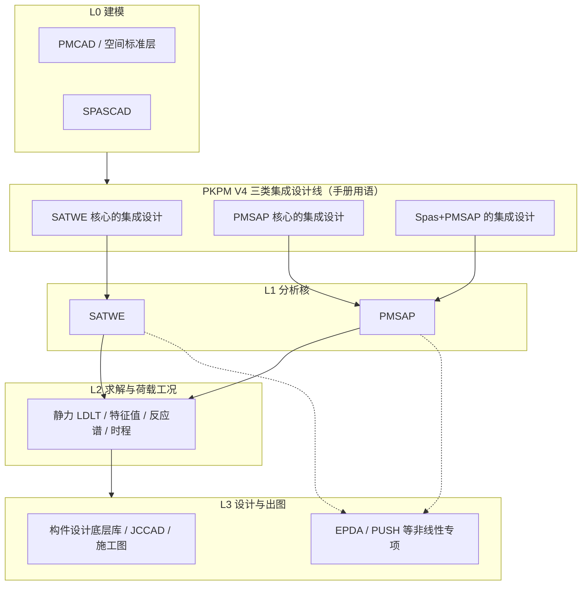

# PKPM 有限元计算架构深度分析（SATWE / PMSAP / 集成设计线）

> 文档日期：2026-05-14  
> 上承：  
> - [01-全球三维有限元软件对标调研-2026-05-14](../../01-全球三维有限元软件对标调研-2026-05-14.md)  
> - [02-有限元通用底座架构-从挡土墙开始-2026-05-14](../../02-有限元通用底座架构-从挡土墙开始-2026-05-14.md)  
>
> 文档目的：  
> 1. 将 **PKPM** 在国内建筑结构领域的有限元体系拆开为可对照的**架构层次**——不是罗列菜单功能，而是回答「数据从哪来、哪两个分析核、单元与求解如何组织、与规范设计如何衔接」。  
> 2. 为 hy-cad-tool 在 **CAD 几何—结构模型—求解—规范检算** 链路上的自研/集成决策，提供与「阵营 D 国产专用」最贴近的**公开资料级**对标。  
>
> 信息来源：**PKPM 官方在线用户手册（V4 PMSAP 等）**、中国建筑科学研究院公开技术介绍、行业文献与工程实践共识。未引述任何未公开的逆向工程或内部源码结论；文中「架构推断」均标注为基于手册目录与用户可见行为逻辑的**合理归纳**。

---

## 一、总览：不是「一个求解器」，而是「建模底座 + 双分析核 + 规范设计层」

PKPM 在多高层建筑领域的产品形态，与欧美「通用 FEA 三巨头」差异极大：其**第一资产是与中国规范强绑定的设计流水线**，有限元内核（尤其剪力墙）是服务于 **GB 体系施工图与专项审查** 的基础设施，而不是追求任意物理场、任意本构的科研平台。

从架构视角，可将其抽象为四条 persistent 主线：

| 层次 | 名称（概念层） | 典型承载 | 架构角色 |
|------|----------------|----------|----------|
| **L0** | 建筑结构建模底座 | **PMCAD**（平面/标准层）、**STS-1**（钢结构建模子集）、**SPASCAD**（复杂空间） | 生成「工程语义模型」：轴线、构件、荷载面、偏心、多塔错层等 |
| **L1a** | 主流多高层分析核 | **SATWE**（*Space Analysis of Tall-buildings with Wall-Element*） | 国内覆盖最广的 **墙元 + 空间杆系 + 楼板假定** 一体化分析 |
| **L1b** | 复杂/通用化分析核 | **PMSAP**（*Plane Multi-story SAP* 系命名习惯，手册全称见 PKPM 文档） | **独立开发**的第二套分析程序，强调任意形式、细分网格与「通用程序技术」 |
| **L2** | 线弹性有限元装配与求解 | 壳/墙/板/杆/罚单元等 + 静力/特征值/反应谱/时程流程 | 对手册可见：**LDLT**、**Guyan**、**多重 RITZ 向量法**、**振型叠加**、**CQC** 等算法模块 |
| **L3** | 构件设计与施工图 | 与 **TAT / SATWE 共用截面设计底层库**（PMSAP 手册明确）、**JCCAD**、各类施工图模块 | **规范驱动**的强度、构造、出图，与 L2 的「分析模型」不完全同维 |

**关键结论（对标 01 文档「阵营 D」）**：PKPM 的「有限元架构」必须把 **SATWE 与 PMSAP 当作两个并列的 L1**，二者与 PMCAD/SPASCAD 的**接力关系、荷载读取方式、偏心处理**均**不完全相同**——这在官方手册中有明确对比（见下文 §四），也是双核并存的架构证据。

---

## 二、SATWE：空间协同工作体系与墙元在生态中的位置

### 2.1 公开定义与力学梗概

- **名称**：SATWE 即 *Space Analysis of Tall-buildings with Wall-Element*，面向多高层建筑 **三维组合结构** 的有限元分析模块。  
- **杆件**：多采用空间杆单元模拟梁、柱、支撑等。  
- **剪力墙**：采用基于 **壳元理论** 凝聚得到的 **墙元**，以反映面内与面外刚度；大块墙或开洞墙通过程序 **自动细分 + 静力凝聚** 消去内部自由度，在工程自由度规模可控的前提下提高精度（中国建筑科学研究院公开技术介绍与行业资料中常见表述）。  
- **楼板**：提供多种刚性/弹性楼板假定（整体刚性、分块刚性、弹性板带等），使「高层建筑实用建模习惯」与「楼板参与整体刚度」在一条流水线上可调。

### 2.2 在 PKPM 叙事中的历史角色

官方 PMSAP 手册前言指出：国内早期大量程序对剪力墙采用 **薄壁柱模型** 且难以合理考虑弹性楼板；对复杂剪力墙体系，薄壁柱 **不符合结构实际**。在这一背景下，**SATWE** 被描述为在一段时期内 **处理复杂剪力墙、开洞、转换** 等问题的标杆性专用程序之一，而 **PMSAP** 则是在此之后、以 **通用程序结构** 独立发展的另一条多高层分析线。

> **架构含义**：SATWE 的成功不仅是「算法」，更是 **与国家高层规程、审图习惯、施工图库共生** 的完整链路——这与 ANSYS 等「内核—前后处理—脚本」三元结构不同，PKPM 的「第四元」是 **强制性规范与本土化出图**。

---

## 三、PMSAP：第二分析核、通用化单元库与「二次位移假定」

### 3.1 与 SATWE 的关系（独立双核）

手册明确：**PMSAP 独立于 SATWE 开发**，程序总体结构采用 **通用有限元程序** 的组织方式，因而在 **任意结构形式** 上更具通用性；同时针对多高层钢筋混凝土、钢结构的设计输出做深。

### 3.2 力学定位

- 从力学上看，PMSAP 是 **线弹性组合结构** 有限元程序，适用于较大跨度与相当规模。  
- 功能覆盖：静力、**固有振动**、**时程响应**、**反应谱**；并依据规范完成混凝土/钢构件配筋或验算。  
- 特色课题：**剪力墙**、**楼板**、**厚板转换层** 等基于 **壳元子结构** 的高精度路线；**施工模拟**、温度、预应力、活荷载不利布置等工程模块。

### 3.3 单元与子结构技术（手册可见归纳）

PMSAP 单元库从一维到三维 **十余类、二十余种** 模型，遵循「少而精」。与 hy-cad-tool 可能的 **IR/插件式单元注册** 对标时，可关注以下**官网上位概念**：

| 类型 | 手册中可见的典型元素 | 说明 |
|------|----------------------|------|
| 壳元 | 空间四边形 24 自由度壳元、三角形 18 自由度壳元 | 墙/板面内面外刚度组合的基础 |
| 墙元 | **简化模型**（矩形竖直墙，三类壳模型简化墙元：四节点、八节点、开洞墙元等）与 **细分模型** | 细分路线配合 **广义协调** 与 **子结构**，实现任意开洞、局部网格与相邻墙 **不必节点对齐** |
| 楼板 | **多边形壳元**（子结构模式） | 楼板可 **整体参与** 分析并输出板应力与配筋 |
| 连接与约束 | **罚单元**（一般、梁式、三角壳式等）、**节点集中刚度** | 用于强制连续性或模拟支座等 |
| 杆系 | 梁、柱、支撑等一维单元（含细分与梁柱墙协调） | 与墙板细分后仍保持 **合法 FEM 模型** |

**广义协调 + 子结构**（手册描述要点）：  
- 剪力墙与楼板细分后，面内/面外分别由 **膜 + 板弯** 模拟；  
- 细分墙元边界节点 **可与相邻墙不对齐**，网格可局部控制，利于 **良态网格** 与刚度精度；  
- 梁、柱、墙细分在程序中 **自动协调**，避免非法单元连接。

### 3.4 「二次位移假定」

这是 PMSAP 相对 **一般通用程序** 与 **传统专用程序** 的显著特征：  
1）对问题 **合理降阶**；  
2）处理 **不同性质区域交界** 处的变形协调。  

用户可选择 **不用**：若不采用，则对结构进行 **完整三维线弹性有限元**；若局部采用，则未假定区域仍为 **天然线弹性细分模型**。

> **对自研工具的启示**：这是典型的 **精度—速度—工程可解释性** 三角权衡，对应通用底座中的 `ModelReductionPolicy` / 分区建模策略，而非单一「细化网格」路径。

---

## 四、三条「集成设计」线与建模接力差异（官方架构分叉）

PKPM V4 主界面将集成路线显式分为（手册原文归纳）：

1. **SATWE 核心的集成设计** —— 面向 **一般多高层**；  
2. **PMSAP 核心的集成设计** —— 面向 **主体规则、局部复杂**（如屋顶造型、空间钢屋盖、连廊等）；  
3. **Spas+PMSAP 的集成设计** —— **空间结构** 或 **斜墙** 等，用 Spas 建模 + PMSAP 核。

**PMSAP 从 PMCAD 接力的已知差异（架构敏感点）**：

| 项目 | PMSAP | SATWE |
|------|-------|--------|
| 面荷载 | 读取 PMCAD **用户定义恒活面荷载** | 读取 **导荷后的荷载** |
| 偏心 | 读取 **原始偏心信息** | 按偏心 **调整节点坐标** |

V3.1 之后，PMSAP 与 SATWE 在 **前处理模块、几何处理、特殊构件定义与设计参数** 上刻意 **对齐**，便于 **对比计算** ——这说明 PKPM 内部将 **「模型语义一致」** 视为双核并行场景的 **一等公民**，与单纯「换求解器 DLL」不同。

---

## 五、求解与动力学：从手册目录反推的「算法栈」

以下均来自 **PMSAP 用户手册理论篇目录与前言** 的公开信息，对应 **L2 实现分层** 的合理刻画。

### 5.1 静力求解

- **LDLT 分解**（手册 §7.3）：大规模 **线弹性平衡方程** 的典型稀疏直接法路径之一，与行业内「超算_license + 迭代 AMG」的通用 FEA 叙述不同，PKPM 更强调 **工程规模内稳定、可预期的直接法 + 优化**。

### 5.2 固有振动与特征值

- **Guyan 法**（缩减自由度）与 **多重 RITZ 向量法**：前言称在 RITZ 向量法基础上提出 **多重 RITZ 向量法**，适用于 **任意复杂结构**，稳定性与常用 **子空间迭代** 相当，**效率提高数倍**；并强调对 **侧刚模型与总刚模型** 的 **快速广义特征值** 算法。  
- **偏心系统动力特性**：手册分列 **准确方法** 与 **近似方法**（§7.14），反映国内规范下 **刚度中心、偶然偏心** 等工程需求在求解链中的显式分支。

### 5.3 动力响应与地震

- **振型迭加法**（§7.5）、**反应谱理论与 CQC 组合**（§7.6）。  
- **惯性力荷载**（平动/转动）（§7.7）、**P-Δ**（§7.12）、**施工模拟**（§7.8）等，体现 **规范荷载工况** 与 **几何非线性简化** 在 **线弹性核之上** 的分层叠加。

### 5.4 性态检查与特殊课题

- **平衡方程组性态检查**（§7.10）、**活荷载不利布置**（§7.11）、**温度应力**（§7.13）等模块说明：PKPM 不仅是「解 $Ku=f$」，而是把 **病态模型预警** 与 **设计习惯（如不利布置）** 嵌在同一产品哲学里。

---

## 六、前处理、后处理与设计层的衔接

### 6.1 后处理 3DP

**三维结构分析后处理程序 3DP**：三维显示为主，以楼层平面显示为特例；融合 **国外通用软件三维云图** 与 **SATWE/TAT 式工程习惯图形**。

### 6.2 设计底层库共用

手册写明：在构件截面设计与验算上，**PMSAP 与 TAT、SATWE 共用同一底层库**，以保证可靠性并降低用户心智成本。

### 6.3 专项非线性模块

计算完成后可接力 **EPDA&PUSH** 等（弹塑性时程、静力推覆）、基础 **JCCAD**、**STS** 等——体现 **线弹性多高层核（L1/L2）与专项非线性（附加模块）** 的 **管道式嫁接**，而非单内核全非线性一体化（与 ABAQUS 阵营对比鲜明）。

---

## 七、SATWE 与 PMSAP 的功能边界（同一生态内的「差分矩阵」）

下表归纳 **用户可见的功能差分**（来自手册中大量「仅 SATWE / 仅 PMSAP」的说明），用于理解 **为何需要双核**：

| 能力维度 | SATWE 线 | PMSAP / Spas 线 |
|----------|----------|-----------------|
| 分析模型 vs 设计模型内力 | 偏 **设计模型** 为主 | 提供 **分析模型内力** 与 **云图** |
| 偏心振型、屈曲、剪力墙面外设计、支座反力细分菜单等 | 部分 **不提供** 或由其他菜单替代 | **提供更全** 的通用有限元检视项 |
| 组合类别 | 手册描述中 **基本组合** 为主 | **基本/标准/准永久/频遇** 等更全（以当前版本手册为准） |

**架构结论**：SATWE 线优先保证 **国内常规高层设计的「标准工作包」**；PMSAP 线承担 **复杂体型与更细力学检视**，二者不是简单新旧替代关系。

---

## 八、与通用三维 FEA / 盈建科 YJK 的对比触点（承接 01 文档）

| 维度 | PKPM（SATWE/PMSAP） | 备注 |
|------|----------------------|------|
| **规范与施工图** | 国标体系与审图生态 **深度融合** | 护城河主要在 L3，不在「比谁单元多」 |
| **3D 实体单元** | 传统上以 **杆系+壳/墙元+楼板假定** 为主；另有 **SATWE-FEM** 等扩展（能力仍受产品定位约束） | 与 ANSYS 固体单元全覆盖不同 |
| **API 与互操作** | **封闭**，二次开发与 AI 编排成本高 | 01 文档「阵营 D」共性 |
| **数据组织** | 长期以 **工程文件接力** 为主（历史包袱），新版逐步统一前处理 | hy-cad-tool 应避免「文件—数据」分裂 |
| **与 YJK** | YJK 强调 **算法重写、标准层组织、交互现代** | 有限元「内核叙事」更像 **新一代竞品对标 SATWE+PMSAP 组合** |

---

## 九、对 hy-cad-tool 通用底座（02 文档方向）的启示

1. **双核或多核分析引擎是产品线常态**：SATWE / PMSAP 并存说明，「单求解 DLL 走天下」在 **建筑结构** 领域不成立；更可行的是 **统一建模 IR（构件语义、荷载、边界）+ 可切换 AnalysisKernel**，并在产品上暴露 **清晰差异说明**（类似 PKPM 的「三条集成线」）。  
2. **单元层与「工程二次位移/降阶」**：PMSAP 的二次位移假定、细分墙元与多边形楼板是 **面向高层规程的域知识**，应在 L4/L5 以 **策略** 形式存在，而不是写死在壳单元代码里。  
3. **设计校验与 FEA 解耦**：共用 **截面设计底层库** 的思路，对应 `ICodeCheckerRegistry` + **分析结果归一化到构件语义**，避免每换一个求解器就重做规范层。  
4. **避免重蹈文件接力陷阱**：01 文档已点出 PKPM **历史包袱**；hy-cad-tool 用 **Command Bus + 统一持久化模型** 更符合长期演进。  
5. **侧刚/总刚、CQC、多重 RITZ**：这些不是「冷门选项」，而是 **国内抗震设计流水线** 的 **一等接口**；若未来对接国产审查习惯，需在 **工况与组合层** 显式建模，而非仅对接位移向量。

---

## 十、信息来源与局限

- **主要依据**：《PKPM V4 用户手册——复杂多高层建筑结构分析与设计软件 PMSAP》公开在线版（章节如第 7 章理论基础、集成设计线说明、前言与功能概况等）。  
- **SATWE 技术梗概**：中国建筑科学研究院公开介绍、PKPM SATWE 在线说明书索引及行业共识性描述。  
- **本文未覆盖**：各版本二进制接口、具体稀疏矩阵格式、并行策略、授权与云计算拆分等 **未公开细节**。版本迭代可能导致菜单名称与选项差异，工程应用 **以当前安装版手册为准**。

---

## 参考文献与扩展阅读（公开）

1. PKPM 官方帮助：PMSAP、SATWE 用户手册（`help.pkpm.cn`）。  
2. 中国建筑科学研究院：高层建筑结构空间有限元分析相关技术介绍（官网技术栏目）。  
3. 项目内总览：[01-全球三维有限元软件对标调研-2026-05-14.md](../../01-全球三维有限元软件对标调研-2026-05-14.md) §六阵营 D。  
4. 架构参照写作范式：同目录 `12-MIDAS系列有限元计算架构深度解析-2026-05-14.md`（**产品族 + 四层视图** 对标结构）。
