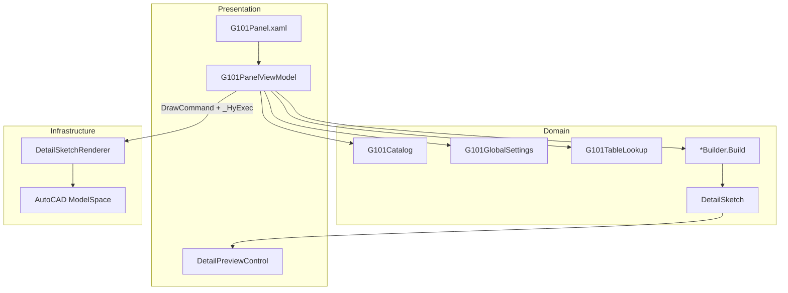

# 000 — 22G101 参数化构造大样（G101 / 结构构件）

> 版本：**v1.0**  
> 日期：2026-06-21  
> 源码：`src/HyCADTool/Features/G101/`  
> 面板入口：统一 Blender 面板 → 命令编辑器 → **结构构件** Tab

---

## 1. 功能定位

G101 模块实现 **22G101 图集参数化构造大样** 的交互式出图能力，设计原则：

| 原则 | 说明 |
|------|------|
| 严格图集依据 | 每个构件绑定 `AtlasRef`（图集号 + 页码）；面板顶部显示 `lab / laE / 保护层` 等查表摘要 |
| 无依据不绘制 | 目录中未实现项标记「（规划中）」；`DrawCommand` 仅在 `IsImplemented=true` 且 `Build` 非空时可用 |
| 平台无关几何 | Domain 层输出 `DetailSketch`（纯 2D 图元集合），Infrastructure 层 `DetailSketchRenderer` 写入 AutoCAD |
| 按文档隔离状态 | `G101PanelViewModel.Current` 按活动 DWG 文件名缓存，多文档互不干扰 |

---

## 2. 用户操作路径

```
AutoCAD 命令行
  → C2（热重载，开发模式）/ 正常加载插件
  → 打开 HyBlender 统一面板（ShowHyBlenderPanel / 面板按钮）
  → 左侧 Tab 栏选择「结构构件」
  → 面板标题显示「命令 · 结构构件」
```

### 2.1 面板分区

| 分区 | 绑定 | 作用 |
|------|------|------|
| 全局设定 | `G101GlobalSettings` | 砼强度、钢筋牌号、抗震等级、环境类别、主筋直径 d；驱动查表 |
| 构件目录（22G101） | `CatalogTree` | 三图集树形目录；选中叶子节点加载参数 |
| 构件参数 | `Parameters` | 由 `ParamDescriptor` 动态生成 TextBox / CheckBox |
| 示意预览 | `PreviewSketch` | WPF Canvas 缩略预览（非 1:1 出图） |
| 操作按钮 | `RefreshPreviewCommand` / `DrawCommand` | 刷新预览 / 落图到模型空间 |

### 2.2 绘制流程

```
用户点击「绘制大样」
  → G101PanelViewModel.DrawToCad()
  → SettingsPanelViewModel.PendingCommand = ExecuteDrawInCommandContext
  → doc.SendStringToExecute("_HyExec\n")
  → AutoCAD 命令线程：拾取插入点
  → item.Build(Global, params) → DetailSketch
  → DetailSketchRenderer.Render(sketch, insertPoint, scale=1.0)
  → 模型空间写入 Polyline / Arc / DBText / AlignedDimension
```

**为何必须走 `_HyExec`：** modeless 面板线程直接写库会触发 `eLockViolation` / `eKeyNotFound`；与桩基面板、设置面板共用 `PendingCommand` 机制（见 `SettingsPanelViewModel.PendingCommand`）。

---

## 3. 架构与数据流



### 3.1 分层文件清单

| 层 | 路径 | 职责 |
|----|------|------|
| **Views** | `Views/G101Panel.xaml(.cs)` | Blender 深色面板 UI、TreeView 目录、参数表单 |
| | `Views/DetailPreviewControl.xaml(.cs)` | 预览 Canvas 渲染 |
| **ViewModels** | `ViewModels/G101PanelViewModel.cs` | 目录树、参数 VM、预览/落图命令、按文档单例 |
| **Domain / Catalog** | `Domain/Catalog/G101Catalog.cs` | 22G101 三图集目录 + 参数描述 + Build 委托注册 |
| **Domain / Tables** | `Domain/Tables/G101Enums.cs` | 砼强度、钢筋牌号、抗震/环境枚举 |
| | `Domain/Tables/G101GlobalSettings.cs` | 全局设定 INotifyPropertyChanged |
| | `Domain/Tables/G101TableLookup.cs` | P2-1~P2-7 查表（lab、laE、保护层、弯钩等） |
| | `Domain/Tables/AtlasRef.cs` | 图集页码引用值对象 |
| **Domain / Geometry** | `Domain/Geometry/DetailSketch.cs` | 平台无关 2D 大样中间表示 |
| **Domain / Components** | `Domain/Components/Foundation/*.cs` | 基础类构件 Builder |
| | `Domain/Components/Stair/*.cs` | 楼梯类构件 Builder |
| **Services** | `Services/DetailSketchRenderer.cs` | DetailSketch → AutoCAD 实体 |
| **Shell 集成** | `Shell/BlenderPanel/HyBlenderPanel.xaml` | 嵌入 `G101Panel`，Tab Key = `__g101__` |
| | `Shell/BlenderPanel/HyBlenderPanelViewModel.cs` | `IsG101Mode` / `G101Vm` 路由 |

---

## 4. 构件目录与实现状态

目录由 `G101Catalog.Build()` 静态构建，顺序：**22G101-3 → 22G101-2 → 22G101-1**。

### 4.1 已实现（可预览 + 可落图）

| ID | 名称 | 图集依据 | Builder |
|----|------|----------|---------|
| `dj-foundation` | 独立基础 DJj/DJz 底板配筋 | 22G101-3 P2-11 | `DjFoundationBuilder` |
| `col-dowel` | 柱纵向钢筋在基础中构造 | 22G101-3 P2-10 | `ColumnDowelBuilder` |
| `tjb` | 条形基础底板 TJBj/TJBp 配筋 | 22G101-3 P2-20 | `TjbFoundationBuilder` |
| `dj-double` | 双柱普通独立基础配筋 | 22G101-3 P2-12 | `DoubleColumnDjBuilder` |
| `stair-at` | AT 型楼梯板配筋 | 22G101-2 P2-10 | `AtStairBuilder` |
| `stair-bt` | BT 型楼梯板配筋 | 22G101-2 P2-10 | `BtStairBuilder` |

### 4.2 规划中（目录占位，`IsImplemented=false`）

- **22G101-3**：基础梁 JL、筏形基础 LPB/BPB 等  
- **22G101-2**：CT 型楼梯、ATa 滑动支座、梯柱 TZ / 梯梁 TL  
- **22G101-1**：框架柱 KZ、剪力墙、梁 KL/WKL/XL、板端/开洞/后浇带等  

未实现项在树节点名称后附加 **「（规划中）」**，不响应绘制命令。

---

## 5. 全局查表（G101TableLookup）

数值来源标注于类注释，对应 22G101-1 构造页：

| API | 图集页 | 用途 |
|-----|--------|------|
| `GetCoverThickness(env, memberCol)` | P2-1 | 保护层（板/墙/基础列 0/1/2，默认基础=2） |
| `GetLab` / `GetLabE` | P2-2 | 基本锚固长度（×d） |
| `GetLa` / `GetLaE` | P2-3 | 锚固长度（四级抗震 laE=la） |
| `GetLl` / `GetLlE` | P2-5 / P2-6 | 搭接长度（默认 50% 接头） |
| `GetBendDiameter` | P2-2 | 弯弧内直径 D |
| `GetStirrupHookLength` | P2-7 | 135° 箍筋弯钩平直段 |

面板 `LookupSummary` 示例：

```
lab = 560mm（d=16，22G101-1 P2-2）  |  laE = 640mm（…）  |  保护层=25mm（22G101-1 P2-1）
```

全局设定变更时自动刷新摘要与预览。

---

## 6. DetailSketch 中间表示

Builder 不直接调用 AutoCAD API，只填充 `DetailSketch`：

| 类型 | 说明 |
|------|------|
| `SketchPolyline` | 混凝土轮廓、钢筋线、标注引线；`SketchLayerKind` + `SketchLineKind` |
| `SketchArc` | 钢筋弯弧等 |
| `SketchText` | 说明文字、图名 |
| `SketchDimension` | 对齐标注（P1/P2/DimLinePoint + 可选 OverrideText） |

辅助方法：`AddRect`、`AddLine`、`AddText`、`AddHorizontalDim`、`AddVerticalDim`。

**坐标约定：** 几何单位为 **实际 mm（1:1）**；`DetailSketchRenderer.Render` 以用户拾取点为插入点，`sketch.Origin` 偏移，`scale` 参数默认 1.0。

---

## 7. AutoCAD 落图（DetailSketchRenderer）

### 7.1 图层

| 图层名 | 内容 |
|--------|------|
| `G101-混凝土` | 混凝土轮廓（ACI 7） |
| `G101-钢筋` | 钢筋线/弧（ACI 1，Polyline ConstantWidth） |
| `G101-标注` | AlignedDimension（ACI 4） |
| `G101-文字` | DBText 说明与标题 |

图层在渲染事务内按需创建（`EnsureLayers`），调用方须已持有 `doc.LockDocument()`。

### 7.2 实体映射

- `SketchPolyline` → `Polyline`（闭合/线宽按 LineKind）
- `SketchArc` → `Arc`
- `SketchText` / `sketch.Title` → `DBText`
- `SketchDimension` → `AlignedDimension`（当前文档 Dimstyle）

---

## 8. UI 与主题

面板遵循 PaletteSet 宿主规范：

- 资源仅在 `UserControl.Resources` 局部 merge：`BlenderDark.xaml` + `Shell/Resources/BlenderTheme.xaml`
- 外层 `ScrollViewer` → `BlenderScrollViewer`（深色细滚动条）
- 构件目录 `TreeView` → `BlenderOutliner`（蓝色选中高亮 + 左侧竖条；失焦仍可读）
- Outliner 内置 ScrollViewer 已套用 `BlenderScrollViewer`（`HyCAD.BlenderUI/Themes/Controls/Outliner.xaml`）
- 目录项 TextBlock **不**硬编码 `Foreground`，由 `BlenderOutlinerItem` 驱动选中/悬停字色

**禁止：** 将主题挂到 `Application.Current.Resources`；不使用隐式原生控件 Style。

---

## 9. 新增构件开发指南

### 9.1 最小步骤

1. **新建 Builder**  
   `Domain/Components/<分类>/<Name>Builder.cs`  
   签名：`public static DetailSketch Build(G101GlobalSettings global, Dictionary<string, object> p)`

2. **注册目录项**  
   在 `G101Catalog.cs` 对应图集/分组中：  
   - 设置 `Id`、`Name`、`AtlasRef`、`IsImplemented = true`  
   - `Build = XxxBuilder.Build`  
   - `Parameters.Add(new ParamDescriptor { ... })`

3. **查表**  
   锚固/保护层/弯钩等统一调用 `G101TableLookup`，勿硬编码规范数值。

4. **预览**  
   Builder 纯函数返回 `DetailSketch` 即自动驱动预览；参数变更触发 `RefreshPreview()`。

5. **编译 + 联调**  
   `dotnet build src\HyCADTool\HyCADTool.csproj -c Debug` → AutoCAD `C2` → 结构构件 Tab → 选中项 → 预览 → 绘制大样。

### 9.2 ParamDescriptor 字段

| 字段 | 说明 |
|------|------|
| `Key` | 参数字典键，Builder 用 `GetInt`/`GetBool` 读取 |
| `Label` / `Unit` | 面板显示；Unit 非空时自动追加 `(mm)` 等 |
| `Kind` | `Number` / `Integer` / `Boolean` / `Choice` / `ReadOnly` |
| `DefaultNumber` / `DefaultInt` / `DefaultBool` | 初始值 |

### 9.3 Builder 参数读取惯例

参考 `TjbFoundationBuilder`：

```csharp
int widthB = GetInt(p, "widthB", 2000);
bool isSlope = GetBool(p, "isSlope", true);
int cover = G101TableLookup.GetCoverThickness(global.EnvironmentClass, 2);
```

---

## 10. Shell 集成要点

| 项 | 值 / 位置 |
|----|-----------|
| Tab Key | `HyBlenderPanelViewModel.G101TabKey = "__g101__"` |
| Tab 名称 | 「结构构件」（位于「钢筋」之后） |
| 可见性 | `IsG101Mode` → `G101Panel` Visibility |
| ViewModel | `G101PanelViewModel.Current`（按 `doc.Name` 缓存） |
| DataContext | `HyBlenderPanel` 绑定 `G101Vm` |

G101 **无独立 AutoCAD 命令**（非 commands.json 注册项），完全通过统一面板 Tab 访问。

---

## 11. 已知约束与陷阱

| 问题 | 原因 | 规避 |
|------|------|------|
| 面板点绘制无反应 / 锁库异常 | modeless 线程写库 | 必须 `_HyExec` + `PendingCommand` |
| 预览有图、落图失败 | 插入点取消 / 事务异常 | 看 `StatusMessage` 与命令行 `[G101]` 输出 |
| 选中目录项白底白字 | 默认 TreeViewItem 失焦高亮 | 已修复：使用 `BlenderOutliner` |
| 目录内系统滚动条 | Outliner 内置 ScrollViewer 未主题化 | 已修复：`BlenderScrollViewer` |
| 多文档参数串档 | VM 单例未分文档 | 使用 `Current` 而非 `new G101PanelViewModel()` |

---

## 12. 测试建议

1. **开发循环**：改代码 → `dotnet build` → AutoCAD `C2` → 打开面板 → 结构构件 Tab  
2. **查表**：切换砼强度/抗震等级，确认 `LookupSummary` 数值变化  
3. **目录**：选中各已实现项，参数区与 `AtlasRefText` 正确  
4. **预览**：改参数后预览实时更新（或点「刷新预览」）  
5. **落图**：绘制大样 → 拾点 → 检查 `G101-*` 图层实体  
6. **失焦可读性**：选中目录项后点击参数输入框，选中行仍为蓝底白字  
7. **滚动条**：目录内容超出 `MaxHeight=200` 时，滚动条为 Blender 深色细条  

可选：在 `App/Test/TestCommand.cs` 中调用 `ShowPanelCommand.ShowHyBlenderPanel()` 后手动切 Tab（C1 联调不自动切到 G101）。

---

## 13. 相关文档与代码索引

| 资源 | 路径 |
|------|------|
| **图集官方地址与页码→代码转换对照** | [`001-22G101图集地址与文档转换对照`](001-22G101图集地址与文档转换对照-2026-06-21-134647.md) |
| 本模块源码 | `src/HyCADTool/Features/G101/` |
| Blender Outliner 样式 | `src/HyCAD.BlenderUI/Themes/Controls/Outliner.xaml` |
| Blender 滚动条 | `src/HyCAD.BlenderUI/Themes/Controls/ScrollBar.xaml` |
| 统一面板 | `src/HyCADTool/Shell/BlenderPanel/HyBlenderPanel.xaml` |
| PendingCommand 机制 | `src/HyCADTool/Shell/Preferences/SettingsPanelViewModel.cs` |
| WPF PaletteSet 陷阱 | `.cursor/skills/wpf-paletteset-resource-pitfalls/SKILL.md` |

---

**维护记录**

| 日期 | 变更 |
|------|------|
| 2026-06-21 | 初版：架构、目录、查表、落图、UI 主题、扩展指南 |
| 2026-06-21 | 补充 TreeView 选中样式与 Blender 滚动条修复说明 |
