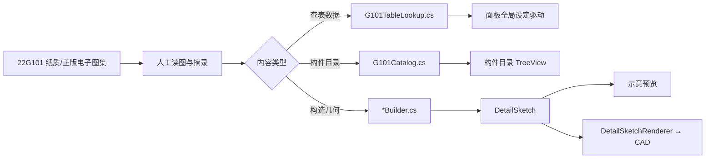

# 001 — 22G101 图集地址与文档转换对照

> 版本：**v1.0**  
> 日期：2026-06-21  
> 关联：[`000-22G101参数化构造大样-功能说明`](000-22G101参数化构造大样-功能说明-2026-06-21-134306.md)  
> 源码：`src/HyCADTool/Features/G101/`

---

## 1. 图集官方信息与获取地址

22G101 系列为**国家建筑标准设计图集**（平法图集），主编单位：**中国建筑标准设计研究院有限公司**，2022 年 6 月修编发布，**替代 16G101 系列**。

| 图集编号 | 名称 | 替代旧版 | 官方信息页 | 标准院商城（纸质） |
|----------|------|----------|------------|-------------------|
| **22G101-1** | 现浇混凝土框架、剪力墙、梁、板 | 16G101-1 | [chinabuilding.com.cn/book-2546](http://chinabuilding.com.cn/book-2546.html) | [goodsID=552478](https://shop.chinabuilding.com.cn/zshop/goodsInfo/goodsDetail?SiteID=26&goodsID=552478) |
| **22G101-2** | 现浇混凝土板式楼梯 | 16G101-2 | 图集信息 → 搜索「22G101-2」 | [goodsID=552480](https://shop.chinabuilding.com.cn/zshop/goodsInfo/goodsDetail?SiteID=26&goodsID=552480) |
| **22G101-3** | 独立基础、条形基础、筏形基础、桩基础 | 16G101-3 | 图集信息 → 搜索「22G101-3」 | [goodsID=552483](https://shop.chinabuilding.com.cn/zshop/goodsInfo/goodsDetail?SiteID=26&goodsID=552483) |
| **全套 3 册** | 22G101-1/2/3 | 16G101 全套 | — | [goodsID=612422](https://shop.chinabuilding.com.cn/zshop/goodsInfo/goodsDetail?SiteID=26&goodsID=612422) |

**说明：**

- 国家建筑标准设计网（`chinabuilding.com.cn`）提供图集简介、样张、更正信息；部分图集支持**在线阅读**（需注册/会员，以网站当前政策为准）。
- 本仓库**不包含**图集 PDF 原件，也不托管任何盗版扫描件；开发时须自备合法纸质版或正版电子书。
- 实施日期：三册均为 **2022-06-09** 起实施（以图集封底/版权页为准）。

---

## 2. 页码标记约定（P2-XX）

代码中 `AtlasRef("22G101-3", "2-20")` 显示为 **`22G101-3 P2-20`**，含义：

| 片段 | 含义 |
|------|------|
| `22G101-3` | 图集册号 |
| `P2` | 图集**第 2 章**「标准构造详图」 |
| `-20` | 该章内**详图编号/页次**（与纸质图集目录一致，非 PDF 物理页码） |

> **注意：** `P2-20` ≠ PDF 第 20 页。查图时按图集**目录 → 第 2 章 → 详图 2-20** 定位。

---

## 3. 文档 → 代码 转换总览

HyCADTool G101 模块采用 **人工读图 + 结构化录入**，不经 OCR 批量转换：



| 图集内容类型 | 代码落点 | 转换方式 |
|--------------|----------|----------|
| 锚固/保护层/搭接等**表格** | `Domain/Tables/G101TableLookup.cs` | 表格行列 → `Dictionary` / 二维数组，注释标明 `P2-X` |
| 枚举（砼强度、钢筋牌号等） | `Domain/Tables/G101Enums.cs` | 与图集表头一致 |
| 构件清单与默认参数 | `Domain/Catalog/G101Catalog.cs` | `G101CatalogItem` + `ParamDescriptor` |
| 构造大样几何与标注 | `Domain/Components/**/*.cs` | 读详图 → `DetailSketch` 折线/文字/尺寸 |
| 图集页码引用 | `Domain/Tables/AtlasRef.cs` | `(AtlasId, Page, Description?)` |
| 落图图层与实体 | `Services/DetailSketchRenderer.cs` | 与图集无关，HyCAD 出图约定 |

---

## 4. 查表数据转换（22G101-1 → G101TableLookup）

全局设定区显示的 `lab / laE / 保护层` 均来自 **22G101-1 第 2 章** 表格，已写入代码：

| 图集页 | 表格内容 | 代码 API | 源码常量/字段 |
|--------|----------|----------|---------------|
| **P2-1** | 混凝土保护层最小厚度 | `GetCoverThickness(env, memberCol)` | `EnvironmentClass` × [板/墙/基础] 三列 |
| **P2-2** | 受拉钢筋基本锚固长度 lab（×d） | `GetLab` / `GetLabMultiplier` | `LabTable` |
| **P2-2** | 抗震基本锚固 labE（×d） | `GetLabE` / `GetLabEMultiplier` | `LabEGrade12` / `LabEGrade3` |
| **P2-2** | 弯弧内直径 D | `GetBendDiameter(grade, d)` | 公式 2.5d / 4d / 6d / 7d |
| **P2-3** | 锚固长度 la / laE | `GetLa` / `GetLaE` | 基本情形 la=lab；四级 laE=la |
| **P2-5** | 搭接长度 ll（ζ_l） | `GetLl(s, splicePct)` | `ZetaL` |
| **P2-6** | 抗震搭接 llE（ζ_lE） | `GetLlE(s, splicePct)` | `ZetaLE` |
| **P2-7** | 135° 箍筋弯钩平直段 | `GetStirrupHookLength(d)` | max(75, 10d/12d) |

**砼强度列顺序**（`Grades` 数组，与 P2-2 表列一致）：

`C25 → C30 → C35 → C40 → C45 → C50 → C55 → C60 及以上`

**示例转换（HRB400 + C30 → lab 倍数 35）：**

```
图集 P2-2 查表：HRB400 行、C30 列 → 35d
代码：LabTable[RebarGrade.HRB400][1] == 35
面板：d=16 → lab = 35×16 = 560mm
```

---

## 5. 构件详图转换（已实现项）

### 5.1 22G101-3 基础

| 目录 ID | 面板名称 | 主依据页 | 辅助页/注释 | Builder | 已转换要点 |
|---------|----------|----------|-------------|---------|------------|
| `dj-foundation` | 独立基础 DJj/DJz 底板配筋 | **P2-11** | P2-14（≥2500 内部筋 0.9L 交错减短） | `DjFoundationBuilder` | 平面底筋网格 + 剖面；laE 标注 |
| `col-dowel` | 柱纵向钢筋在基础中构造 | **P2-10** | — | `ColumnDowelBuilder` | 直锚 / 弯折锚固两种模式 |
| `tjb` | 条形基础底板 TJBj/TJBp | **P2-20 / P2-21** | P2-22（减短 10%）；P2-20 注（梁宽内无分布筋、搭接 150） | `TjbFoundationBuilder` | 矩形/坡形剖面 + 平面段；分布筋与受力筋 |
| `dj-double` | 双柱普通独立基础 | **P2-12** | 注 2（底筋 X/Y 伸出大者在下） | `DoubleColumnDjBuilder` | 双柱位 + 顶部 T 筋 |

### 5.2 22G101-2 楼梯

| 目录 ID | 面板名称 | 主依据页 | Builder | 已转换要点 |
|---------|----------|----------|---------|------------|
| `stair-at` | AT 型楼梯板配筋 | **P2-10** | `AtStairBuilder` | 踏步折线剖面；负筋 ln/4；分布筋 |
| `stair-bt` | BT 型楼梯板配筋 | **P2-10** | `BtStairBuilder` | 含低端平板；其余同 AT 逻辑 |

### 5.3 22G101-1 主体（目录占位，未落 Builder）

以下项已在 `G101Catalog.cs` **登记页码**，`IsImplemented=false`，待读图后补 `Build`：

| 分组 | 名称 | 登记页 |
|------|------|--------|
| 柱 | KZ 纵筋连接 / 箍筋加密 / 柱顶纵筋 | P2-9 / P2-11 / P2-14 |
| 剪力墙 | 水平/竖向分布筋、YBZ、连梁 LL | P2-19 ~ P2-27 |
| 梁 | KL / WKL / XL | P2-33 / P2-34 / P2-43 |
| 板 | 板端锚固 / 开洞 BD / 后浇带 HJD | P2-50 / P2-62 / P2-59 |

---

## 6. 参数默认值转换

每个已实现构件的 `ParamDescriptor` 默认值来自图集**典型工程尺寸**（非规范强制值），用户可在面板修改：

| 构件 | 参数 Key | 默认 | 单位 | 图集/工程来源 |
|------|----------|------|------|---------------|
| TJB 条形基础 | `widthB` | 2000 | mm | P2-20 示意 |
| TJB | `heightH1` / `heightH2` | 300 / 250 | mm | 矩形/坡形截面 |
| TJB | `isSlope` | true | — | TJBp 坡形 |
| TJB | `segmentLen` | 6000 | mm | 平面段长度 L |
| TJB | `mainSpacing` / `distSpacing` | 150 / 250 | mm | B 向受力筋 / 分布筋 |
| DJ 独基 | `lengthA` / `widthB` | 2400 / 2400 | mm | P2-11 示意 |
| AT 楼梯 | `stepCount` / `riseH` / `runB` | 12 / 150 / 280 | — / mm / mm | P2-10 典型踏步 |

完整参数清单见 `G101Catalog.cs` 各 `Create*` 方法。

---

## 7. 新增图集内容的转换流程（SOP）

1. **定位图集**：按 §1 地址查阅正版 22G101 对应册、章、详图号。  
2. **登记目录**：在 `G101Catalog.cs` 增加 `G101CatalogItem`，设置 `AtlasRef`、`Parameters`。  
3. **摘录查表**：若涉及新表格，扩展 `G101TableLookup`（须注释 `P2-X` 来源）。  
4. **实现 Builder**：`Build(global, params) → DetailSketch`，几何用 mm 1:1。  
5. **标注依据**：`sketch.AddText(..., "依据：22G101-X P2-XX")` 与注释 XML。  
6. **设 `IsImplemented = true`**，编译 → C2 → 结构构件 Tab 验证预览与落图。  
7. **更新本文档** §5 对照表。

**禁止：** 无图集页码依据的构造；从 16G101 直接套用未核对 22G101 差异项。

---

## 8. 22G101 与 16G101 修编提示（读图时注意）

22G101 为 16G101 的系统性修编，开发新构件前应核对：

- 是否与 16G101 同名详图**页码发生变化**（目录项已按 22G101 填写）。
- 全文强条规范下保护层、锚固等**表格数值**是否更新（当前查表按 22G101-1 P2-1~P2-7 录入）。
- 个别构造注、减短规则可能在**相邻页**（如 P2-14、P2-22），Builder 注释中已列辅助页。

---

## 9. 仓库内相关文件索引

| 用途 | 路径 |
|------|------|
| 图集页码值对象 | `src/HyCADTool/Features/G101/Domain/Tables/AtlasRef.cs` |
| 查表转换 | `src/HyCADTool/Features/G101/Domain/Tables/G101TableLookup.cs` |
| 目录与参数注册 | `src/HyCADTool/Features/G101/Domain/Catalog/G101Catalog.cs` |
| 基础 Builder | `src/HyCADTool/Features/G101/Domain/Components/Foundation/*.cs` |
| 楼梯 Builder | `src/HyCADTool/Features/G101/Domain/Components/Stair/*.cs` |
| 功能总览 | [`000-22G101参数化构造大样-功能说明`](000-22G101参数化构造大样-功能说明-2026-06-21-134306.md) |

---

**维护记录**

| 日期 | 变更 |
|------|------|
| 2026-06-21 | 初版：官方地址、P2-XX 约定、查表/详图/参数转换对照、扩展 SOP |
