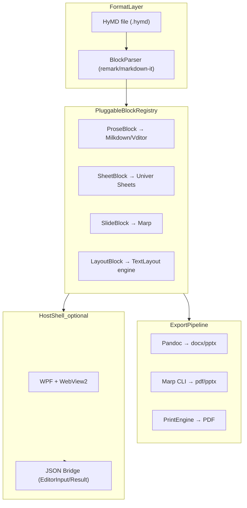

# md 风格增强文档套件 产品调研与实现路径

> 调研日期：2026-07-03
> 目标形态：格式规范 + 可拔插块引擎（前端形态后定）
> 一句话目标：为喜欢 Markdown 简洁但需要 Office 级表格/排版/计算/幻灯能力的作者与 AI Agent，提供纯文本、可降级、可拔插块扩展的文档格式与引擎

---

## 0. 目标与约束

### 核心功能

在保留 Markdown 简洁流程的前提下，补齐表格、样式、排版、计算、幻灯等 Office 套件中用户高频需要的基础能力；各能力以**可拔插块**形式扩展，正文仍保持纯文本可读。

### 目标用户

| 层级 | 画像 | 痛点 | 当前替代 |
|---|---|---|---|
| **主** | 工程/技术写作者、个人知识工作者 | md 表格弱、无公式计算、排版/export 差 | Typora + Excel + Word 三件套 |
| **次** | AI Agent / 自动化流水线 | 需要机器可读、可 diff、可生成的文档格式 | JSON/YAML 配置 + 手工排版 |
| **潜** | 小团队内部文档/报告 | 不想上 Notion 云锁定，又要表格和模板 | Obsidian + 插件栈 |

### 平台形态

**先定格式规范 + 核心引擎，前端形态后定**（用户确认）。已有代码 [`HyCADTool.MarkdownEditor`](../src/HyCADTool.MarkdownEditor)（WPF + WebView2 + Vditor）与 [`HyCADTool.UniverEditor`](../src/HyCADTool.UniverEditor)（WPF + WebView2 + Univer Sheets）可作为宿主壳参考，但核心产品独立。

### 关键约束

| 项 | 约束 |
|---|---|
| 开源/商业 | 未来可能商业化 → 依赖优先 Apache-2.0 / MIT；**排除 AGPL 代码复用**（AppFlowy/SiYuan 仅作竞品参考，不作底座 fork） |
| 技术栈偏好 | 已有 WPF + WebView2 + Vite/TS 经验；格式层语言无关 |
| 与 hy-cad-tool | 核心完全独立；保留 JSON 桥接接口（参考 `EditorInput`/`EditorResult` 契约模式） |
| AI 操控 | 文件即纯文本；扩展块用声明式属性，AI 可直接读写无需 GUI |
| 简洁原则 | 正文零内联样式代码；主题/排版走 frontmatter 声明 |

### 成功标准

1. 单文件 `.hymd`（工作名）在普通 md 渲染器中可**优雅降级**（扩展块显示为 fenced code + 摘要）
2. 表格计算块支持 Excel 级公式（复用 Univer Sheets 引擎）
3. 分页排版预览误差 ≤ 现有 MarkdownEditor 水平（mm 级边距、多栏）
4. 导出 docx/pptx 可用（Pandoc reference-doc 管线）
5. AI 可通过纯文本完成「插入表格块 + 填公式 + 改主题」全流程

### 五维权重

| 维度 | 权重 | 理由 |
|---|---|---|
| 易用 | 30% | 产品锚点是「保持 md 简洁、上手容易」 |
| 功能 | 25% | 需补齐 Office 高频基础能力 |
| 差异化 | 20% | 商业化需有 AI-native + 纯文本护城河 |
| 稳定 | 15% | 依赖多引擎组合，稳定性是集成风险 |
| 可靠安全 | 10% | 本地优先，非金融/医疗场景 |

---

## 1. 竞品清单

### 直接竞品（Markdown 系编辑器 / 知识库）

| 名称 | 形态 | 平台 | 商业模式·价格 | 开源? | 活跃度 | 链接 | 一句话定位 |
|---|---|---|---|---|---|---|---|
| Typora | 桌面 | Win/Mac/Linux | $14.99 一次性 | 否 | 活跃 | [typora.io](https://typora.io) | 最佳 inline WYSIWYG md 写作体验 |
| Obsidian | 桌面+移动 | Win/Mac/Linux/Mobile | 免费个人；Sync $4/月 | 否（闭源） | 活跃 | [obsidian.md](https://obsidian.md) | 本地知识库 + 2000+ 插件生态 |
| MarkText | 桌面 | Win/Mac/Linux | 免费 | MIT | **已停滞**（2022 后） | [GitHub marktext](https://github.com/marktext/marktext) | 免费 Typora 替代，维护风险高 |
| SiYuan | 桌面+移动 | Win/Mac/Linux/Mobile | 免费 | AGPL-3.0 | 活跃 | [b3log.org/siyuan](https://b3log.org/siyuan) | 本地块级知识库，块引用强 |
| AFFiNE | 桌面+Web | Win/Mac/Linux/Web | 免费自托管；Pro 待核实 | MIT（核心） | 活跃（62K+ stars） | [affine.pro](https://affine.pro) | 文档+白板+数据库混合工作区 |
| AppFlowy | 桌面+Web | Win/Mac/Linux/Mobile | 免费自托管 | AGPL-3.0 | 活跃（67K+ stars） | [appflowy.io](https://appflowy.io) | 最接近 Notion 的开源替代品 |

### 间接替代（Office / 排版 / 发布管线）

| 名称 | 形态 | 平台 | 商业模式·价格 | 开源? | 活跃度 | 链接 | 一句话定位 |
|---|---|---|---|---|---|---|---|
| Microsoft Office | 桌面+云 | Win/Mac/Web | 订阅 $69+/年 | 否 | 活跃 | [microsoft.com/office](https://www.microsoft.com/office) | 行业标准，功能最全，非纯文本 |
| Notion | SaaS | Web+App | 免费/Plus $10/月 | 否 | 活跃 | [notion.so](https://notion.so) | 块编辑器 + 数据库，云锁定 |
| Typst | CLI+Web | 跨平台 | 免费 | Apache-2.0 | 活跃 | [typst.app](https://typst.app) | 现代排版引擎，PDF 优先，脚本化 |
| AsciiDoc/Asciidoctor | CLI+插件 | 跨平台 | 免费 | Apache-2.0 | 活跃 | [asciidoctor.org](https://asciidoctor.org) | 技术出版级 md 超集，学习曲线中等 |
| Quarto | CLI | 跨平台 | 免费 | MIT | 活跃 | [quarto.org](https://quarto.org) | 科研报告 md→docx/pptx/pdf 管线 |

### 邻域参考（引擎 / 规范 / 块编辑器框架）

| 名称 | 形态 | 平台 | 商业模式·价格 | 开源? | 活跃度 | 链接 | 一句话定位 |
|---|---|---|---|---|---|---|---|
| Univer | SDK | Browser/Node | OSS Apache-2.0；Pro 商业 | Apache-2.0 | 活跃（13K+ stars，→1.0） | [univer.ai](https://univer.ai) | 表格/文档/幻灯 Office SDK，Sheets 最成熟 |
| Marp | CLI+VS Code 插件 | 跨平台 | 免费 | MIT | 活跃 | [marp.app](https://marp.app) | md→幻灯，导出 HTML/PDF/PPTX |
| Slidev | CLI | 跨平台 | 免费 | MIT | 活跃 | [sli.dev](https://sli.dev) | 开发者向 md 幻灯，Vue 组件 |
| Pandoc | CLI | 跨平台 | 免费 | GPL-2.0（CLI 调用无传染） | 活跃 | [pandoc.org](https://pandoc.org) | 万能文档格式转换器 |
| Markdoc | 规范+库 | JS | 免费 | MIT | 活跃 | [markdoc.dev](https://markdoc.dev) | Stripe 出品，声明式 tag 扩展 md |
| MyST | 规范+CLI | Python/JS | 免费 | MIT | 活跃 | [mystmd.org](https://mystmd.org) | 科研 md 超集，directives/roles 语法 |
| BlockNote | React 库 | Web | 免费；Pro 付费 | MPL-2.0 | 活跃 | [blocknotejs.org](https://www.blocknotejs.org) | Notion 风块编辑器，Tiptap 底座 |
| Tiptap | 框架 | Web | 免费；Pro 付费 | MIT | 活跃 | [tiptap.dev](https://tiptap.dev) | ProseMirror 封装，最大插件生态 |
| Milkdown | 框架 | Web | 免费 | MIT | 活跃 | [milkdown.dev](https://milkdown.dev) | md 优先 ProseMirror 编辑器 |

### Obsidian 插件（表格/计算邻域参考）

| 名称 | 形态 | 引擎 | 链接 | 一句话定位 |
|---|---|---|---|---|
| Sheet Plus | Obsidian 插件 | Univer | [GitHub](https://github.com/lxzagent/obsidian-sheet-plus) | Obsidian 内嵌 Univer 全功能表格 |
| Advanced Tables | Obsidian 插件 | 自研 | [GitHub](https://github.com/tgrosinger/advanced-tables-obsidian) | md 表格导航 + 简易公式 |
| CalcCraft | Obsidian 插件 | Math.js | [obsidianstats](https://www.obsidianstats.com/tags/spreadsheet) | md 表格内 live 公式计算 |

---

## 2. 五维度优缺点分析

### Typora

- **优点**：inline WYSIWYG 体验最佳；零学习成本；导出 PDF/HTML/DOCX/EPUB；表格/公式/Mermaid 内置
- **缺点**：无插件生态；无数据库/计算；排版控制弱（无分页/多栏）；闭源；AI 难扩展自定义块
- **评分**：功能 3 · 易用 5 · 可靠安全 4 · 稳定 4 · 差异化 2

### Obsidian（+ Sheet Plus 等插件）

- **优点**：2000+ 插件补全表格/公式/图表；本地 vault；双向链接；Sheet Plus 已验证 Univer 嵌入 md 路线
- **缺点**：插件语法非 portable（wiki link、插件专有语法）；需组装插件栈；发布/export 需额外规划；闭源
- **评分**：功能 4 · 易用 3 · 可靠安全 4 · 稳定 4 · 差异化 4

### AFFiNE

- **优点**：文档+白板+数据库一体；MIT 许可；CRDT 协作；Notion 导入
- **缺点**：数据模型非纯文本（块 JSON）；自托管中等复杂度；AI 难直接读写底层格式
- **评分**：功能 4 · 易用 3 · 可靠安全 3 · 稳定 3 · 差异化 3

### AppFlowy

- **优点**：功能最接近 Notion；数据库/kanban/calendar；Rust 性能
- **缺点**：AGPL-3.0 不可商用复用；自托管 5+ Docker 服务；数据非纯文本
- **评分**：功能 5 · 易用 3 · 可靠安全 3 · 稳定 3 · 差异化 2

### SiYuan

- **优点**：块引用/双向链接强；本地优先；闪卡/间隔重复
- **缺点**：AGPL-3.0；块存储非标准 md；学习曲线高于 Typora
- **评分**：功能 4 · 易用 3 · 可靠安全 4 · 稳定 4 · 差异化 3

### MarkText

- **优点**：免费 MIT；Typora 风 WYSIWYG
- **缺点**：2022 年后几乎停更；无插件；导出弱于 Typora；大文件性能差
- **评分**：功能 2 · 易用 4 · 可靠安全 3 · 稳定 2 · 差异化 1

### Typst

- **优点**：排版质量接近 LaTeX；脚本化（循环/变量/CSV 加载）；编译极快；Apache-2.0
- **缺点**：非 md 语法（`= heading`、`#func()`）；PDF 优先，docx/pptx 弱；Office 协作者难接受
- **评分**：功能 4 · 易用 2 · 可靠安全 4 · 稳定 4 · 差异化 4

### Quarto

- **优点**：md/qmd→docx/pptx/pdf 一键；reference-doc 模板；科研生态成熟
- **缺点**：作者面向 CLI/YAML，非 WYSIWYG；交互编辑弱；表格/计算在 md 层仍弱
- **评分**：功能 4 · 易用 2 · 可靠安全 4 · 稳定 4 · 差异化 3

### Univer（引擎参考）

- **优点**：Sheets 成熟（公式/合并/验证/条件格式）；Apache-2.0；已有 HyCAD 集成经验；Docs/Slides 在开发
- **缺点**：Docs/Slides 未 1.0；Pro 功能（导入导出/协作）商业；嵌入体积大
- **评分**：功能 4（Sheets 5，Docs 2） · 易用 3 · 可靠安全 4 · 稳定 3 · 差异化 3

### 汇总对比

| 竞品 | 功能 | 易用 | 可靠安全 | 稳定 | 差异化 | 加权总分 | 总评 |
|---|---|---|---|---|---|---|---|
| Typora | 3 | 5 | 4 | 4 | 2 | **3.65** | 写作体验标杆，功能天花板低 |
| Obsidian | 4 | 3 | 4 | 4 | 4 | **3.70** | 插件补全强，portability 差 |
| AFFiNE | 4 | 3 | 3 | 3 | 3 | **3.25** | 混合工作区，非纯文本 |
| AppFlowy | 5 | 3 | 3 | 3 | 2 | **3.30** | 功能最全开源 Notion，AGPL 不可用 |
| SiYuan | 4 | 3 | 4 | 4 | 3 | **3.50** | 研究型 KM，AGPL |
| MarkText | 2 | 4 | 3 | 2 | 1 | **2.50** | 已弃维护，不推荐作参考 |
| Typst | 4 | 2 | 4 | 4 | 4 | **3.40** | 排版强但非 md 路线 |
| Quarto | 4 | 2 | 4 | 4 | 3 | **3.20** | 导出管线强，编辑弱 |
| Univer Sheets | 5 | 3 | 4 | 3 | 3 | **3.70** | 表格引擎首选复用对象 |

> 加权公式：功能×25% + 易用×30% + 可靠安全×10% + 稳定×15% + 差异化×20%

### 行业现状小结

**普遍做得好**：
- md 写作体验（Typora/Obsidian）
- 块编辑器 UI（Notion/AFFiNE/BlockNote）
- 表格计算引擎（Univer/Excel）
- md→Office 导出管线（Quarto/Pandoc/Marp）
- 声明式 md 扩展规范（Markdoc/MyST）

**普遍短板/痛点**：
- **表格+计算**：md 原生表格无公式；Obsidian 靠插件拼凑，语法不统一
- **排版**：md 无分页/多栏/毫米级边距；Typora 导出质量不稳定
- **样式**：内联 HTML/CSS 破坏简洁；主题与正文混杂
- **幻灯**：md 幻灯工具（Marp/Slidev）与正文编辑器割裂
- **AI 操控**：Notion/AFFiNE/AppFlowy 数据模型为 JSON 块，AI 需 API 而非直接读写文件
- **统一格式**：AsciiDoc/Typst 功能强但语法偏离 md 习惯，迁移成本高

**已有代码验证的关键路径**（本仓库）：
- [`HyCADTool.MarkdownEditor`](../src/HyCADTool.MarkdownEditor)：Vditor WYSIWYG + Markdig 分栏图纸预览 + mm 级排版 → 证明 md 排版引擎可行
- [`HyCADTool.UniverEditor`](../src/HyCADTool.UniverEditor)：Univer Sheets 嵌入 WebView2 + C#↔JS 快照桥接 → 证明表格块引擎集成可行
- Obsidian Sheet Plus 独立验证了「Univer 嵌入 md 笔记」的产品方向

---

## 3. 我应当做的产品

### 机会矩阵

| 用户痛点 | Typora | Obsidian | Notion类 | Typst/Quarto | **空白/低满足** |
|---|---|---|---|---|---|
| md 简洁写作 | 高 | 高 | 中 | 低 | — |
| 表格+公式计算 | 低 | 中（插件） | 高 | 低 | **md 原生块级** |
| 分页/多栏排版 | 低 | 低 | 中 | 高 | **md 内嵌排版块** |
| 主题/样式声明 | 低 | 中 | 高 | 高 | **frontmatter 主题** |
| 幻灯 | 低 | 低 | 中 | 中 | **md 内嵌幻灯块** |
| AI 直接读写 | 中 | 低 | 低 | 中 | **纯文本超集** |
| 导出 docx/pptx | 中 | 低 | 高 | 高 | **md 一键导出** |
| 可拔插架构 | 低 | 中 | 低 | 低 | **块引擎可替换** |

**切入空白**：「md 纯文本 + 可拔插 Office 能力块 + AI-native + 优雅降级」

### 一句话定位

为**喜欢 Markdown 简洁但需要 Office 级表格/排版/计算/幻灯能力的作者与 AI Agent**，提供**纯文本、可降级、可拔插块扩展**的文档格式与引擎；区别于 Notion/AFFiNE 在于**文件即可读 md 超集、AI 可直接读写**，区别于 Typst/AsciiDoc 在于**保持 md 习惯语法、零迁移成本**。

### 目标用户画像

- **主**：工程/技术写作者 — 日常 md 写作 + 偶尔需要计算表/正式排版/export → 不想开三个软件
- **次**：AI Agent 编排 — 通过纯文本指令生成/修改含表格和排版的完整文档
- **潜**：小团队 — 自托管、文件 git 管理、模板化报告

### 格式设计草案（HyMD 工作名）

**基线**：CommonMark + GFM（表格/任务列表/删除线）

**扩展块语法**（Markdoc 风格，围栏 + 声明式属性，普通 md 渲染器降级为 code block）：

```markdown
---
title: 结构计算书
theme: engineering-report
page:
  preset: A4
  columns: 2
  margin_mm: [25, 20, 25, 20]
---

# 设计说明

正文保持标准 Markdown，**粗体**、公式 $E=mc^2$ 不变。

```sheet
id: load-table
rows: 20
cols: 8
```

```slide
theme: default
```

# 荷载汇总

- 恒载
- 活载
```

**块类型（可拔插）**：

| 块类型 | 引擎 | 许可 | 降级显示 |
|---|---|---|---|
| `sheet` | Univer Sheets snapshot JSON | Apache-2.0 | `[表格: load-table, 8列×20行]` |
| `slide` | Marp 兼容 md 子文档 | MIT | 幻灯 md 原文 |
| `layout` | 自研分页引擎（移植 MarkdownEditor） | — | frontmatter 摘要 |
| `chart` | 待定（Vega-Lite / Univer Chart） | BSD/MIT | `[图表: ...]` |
| `calc` | 轻量公式行（Advanced Tables 风格） | — | md 表格 + 公式行 |

### MVP 功能集（MoSCoW）

| 优先级 | 功能 |
|---|---|
| **Must** | HyMD 格式规范 v0.1；解析器（识别 frontmatter + 扩展块）；`sheet` 块读写（Univer snapshot）；`prose` 块（标准 md WYSIWYG）；只读渲染（扩展块 + 降级）；单文件保存/加载 |
| **Should** | frontmatter 主题/分页声明；分页预览（移植 MarkdownEditor 排版）；`slide` 块（Marp 子文档）；导出 HTML/PDF |
| **Could** | 导出 docx/pptx（Pandoc）；`calc` 轻量公式表；AI 命令面板（块级操作）；CAD 桥接接口 |
| **Won't(now)** | 实时协作 CRDT；完整 Notion 式数据库；自研公式引擎；移动端；Univer Docs/Slides 集成 |

### 非功能目标（可量化）

| 目标 | 指标 |
|---|---|
| 降级兼容 | 100% HyMD 文件在标准 md 渲染器中可阅读（扩展块显示为 code fence） |
| 打开速度 | 10 页文档（含 2 个 sheet 块）冷启动 < 3s |
| 排版精度 | 分页预览与 PDF 输出偏差 ≤ 2mm（A4 双栏） |
| AI 操控 | 5 条以内纯文本指令完成「插入 sheet 块 + 填 3 个公式 + 改主题」 |
| 文件大小 | 纯 prose 文档与标准 md 体积差异 < 5%；含 sheet 块按 snapshot 体积 |

### 差异化锚点

1. **AI-native 纯文本格式**：文件可读可 diff可生成，AI 无需 API 即可操控（vs Notion/AFFiNE JSON 块）
2. **可拔插块引擎**：每块复用社区最优开源引擎，不重复造轮子（vs 全家桶自研）
3. **优雅降级**：扩展块在任意 md 工具中仍可阅读（vs Obsidian 插件专有语法）
4. **工程排版基因**：继承 MarkdownEditor 的 mm 级分页/多栏能力（vs Typora 无排版）

### 不做清单

- 不做 Notion 式关系型数据库
- 不做实时多人协作（V1）
- 不做自研公式/排版/幻灯引擎
- 不 fork AFFiNE/AppFlowy/SiYuan（AGPL + 非纯文本）
- 不做闭源云同步（V1 本地文件优先）
- 不把 Typst/AsciiDoc 语法引入正文（保持 md 习惯）

---

## 4. 最优实现路径

### 构建方式

| 方式 | 评估 | 结论 |
|---|---|---|
| 从零自研 | 表格/排版/幻灯引擎成本极高 | 否 |
| Fork AFFiNE/AppFlowy | AGPL + 块 JSON 非纯文本 | 否 |
| **套用库/引擎 + 自定义格式规范** | 格式层自控，引擎层复用最优开源 | **推荐** |
| 现成 SaaS 拼装 | 定制与 AI 操控受限 | 否 |

**推荐**：自定义 HyMD 格式规范 + 可拔插块注册表 + 复用 Univer/Marp/Pandoc/Markdig 等引擎。
**备选**：若以排版为绝对核心、可牺牲 md 纯度 → Typst 脚本层 + md 导入适配器（迁移成本高，不推荐为默认）。

### 技术选型

| 层 | 默认 | 备选 | 许可证 |
|---|---|---|---|
| **格式解析** | unified/remark（JS）+ 自定义 block 插件 | markdown-it + Markdoc 语法 | MIT |
| **Prose 编辑** | Milkdown（md 优先）或 Vditor（已有经验） | Tiptap + Markdown ext | MIT |
| **Sheet 块** | Univer Sheets（已有 UniverEditor 桥接） | — | Apache-2.0 |
| **Slide 块** | Marp 兼容语法 + Marp CLI 渲染 | Slidev（开发者向） | MIT |
| **排版引擎** | 移植 MarkdownEditor PreviewHtmlRenderer + TextLayout | Typst（PDF 优先） | — |
| **导出** | Pandoc（docx/pptx）+ reference-doc 模板 | Quarto | GPL CLI / MIT Quarto |
| **宿主壳** | WPF + WebView2（已有） | Tauri + WebView（跨平台后定） | — |
| **AI 接口** | 纯文本文件 + JSON 块 snapshot 附件 | MCP Server（参考 Sheet Plus REST API 思路） | — |

### 架构概要



**模块切分**：

| 模块 | 职责 | 依赖 |
|---|---|---|
| `hymd-spec` | 格式规范文档 + JSON Schema（块属性） | 无 |
| `hymd-parser` | md→AST，识别扩展块，提取 frontmatter | remark/markdown-it |
| `hymd-blocks-prose` | 标准 md WYSIWYG 编辑 | Milkdown/Vditor |
| `hymd-blocks-sheet` | Univer snapshot 读写/渲染 | Univer SDK |
| `hymd-blocks-slide` | Marp 子文档编辑/预览 | Marp |
| `hymd-layout` | 分页/多栏/主题渲染 | 移植 MarkdownEditor |
| `hymd-export` | Pandoc/Marp 导出管线 | Pandoc CLI |
| `hymd-host` | WPF/Web 宿主壳 + 文件 IO | WebView2 |

**数据流**：
1. 加载 `.hymd` → Parser 拆分 prose 段 + 块段
2. 各 BlockEngine 并行渲染/编辑
3. 保存时块引擎 export snapshot → 嵌入 fenced code
4. 导出时 LayoutEngine 排版 → Pandoc/Marp 转目标格式

**关键技术风险点**：
- Univer snapshot 体积（大表格嵌入 md 文件会膨胀）→ 可选外置 `.hymd.assets/` 目录
- Pandoc docx 保真度 → M4 前必须 PoC
- 块边界编辑 UX（光标跨块）→ M2 重点设计

### 路线图

| 阶段 | 交付物 | 验收点 | 周期（假设） |
|---|---|---|---|
| **M0 格式+解析** | HyMD spec v0.1；hymd-parser PoC；3 个样例文件 | Parser 正确识别 frontmatter + sheet/slide 块；降级渲染通过 | 2 周 |
| **M1 Sheet 块** | hymd-blocks-sheet；Univer 只读+编辑；snapshot 往返 | 嵌入/导出 sheet 块公式不丢失；Obsidian Sheet Plus 级体验 | 3 周 |
| **M2 编辑器壳** | hymd-host 最小 WPF/Web 壳；prose + sheet 双块编辑 | 单文件新建/编辑/保存闭环；AI 纯文本插入 sheet 块 | 4 周 |
| **M3 排版** | hymd-layout；frontmatter 主题；分页预览 | A4 双栏预览误差 ≤ 2mm；移植 MarkdownEditor 回归样例通过 | 3 周 |
| **M4 导出** | slide 块 + Pandoc docx/pptx + PDF | 样例文档一键导出；reference-doc 模板匹配 | 3 周 |
| **V1** | 完整 MVP + 文档 + 3 个行业模板 | 真实用户试写 1 份含表格+排版+导出的报告 | — |

### 风险与对策

| 风险 | 类型 | 影响 | 对策 |
|---|---|---|---|
| HyMD 格式碎片化 | 技术 | 生态无法互操作 | 强制 CommonMark 基线 + 扩展块仅 fenced code；semver 规范 |
| Univer snapshot 体积膨胀 | 技术 | 大文件 git diff 困难 | 支持外置 assets 目录；snapshot 压缩 |
| Univer Docs/Slides 未成熟 | 依赖 | 文档/幻灯块质量差 | V1 仅 Sheets；Slide 用 Marp；Prose 用 md 编辑器 |
| Pandoc docx 保真度不足 | 依赖 | 导出质量差 | M4 前 PoC；提供 reference-doc 模板库 |
| 块跨边界编辑 UX 差 | 产品 | 用户觉得不如 Typora 流畅 | prose 块内保持 Typora 级体验；块间用明确分隔 |
| 商业化许可证 | 许可 | Univer Pro 功能受限 | V1 仅用 OSS 能力；Pro 功能（xlsx 导入等）作 V2 增值 |
| WPF 宿主不跨平台 | 市场 | Mac/Linux 用户无法使用 | 格式/引擎与宿主解耦；V2 评估 Tauri |

### 假设验证

| 假设 | 危险度 | 验证手段 |
|---|---|---|
| fenced code 块语法足够表达 sheet/slide 且不破坏 md 生态 | 高 | M0：用 5 个主流 md 渲染器测试降级 |
| Univer snapshot 嵌入 md 文件可行（体积/性能） | 高 | M1：1000 行×20 列 sheet 块往返测试 |
| Pandoc 能导出含表格/排版的 docx | 中 | M4 前：Quarto reference-doc PoC |
| AI 能可靠生成 HyMD 块语法 | 中 | M0：GPT/Claude 生成 10 个样例，人工检查 |
| 用户接受「块编辑器」而非纯 inline 流 | 中 | M2：5 人可用性测试 vs Typora |

---

## 5. 结论

应当做一款 **「HyMD」格式的 md 超集文档引擎**：正文保持标准 Markdown 习惯，表格/幻灯/排版等 Office 能力以**可拔插 fenced 块**嵌入，每块复用社区最优开源引擎（Univer Sheets、Marp、Pandoc、MarkdownEditor 排版），在普通 md 工具中优雅降级。

**核心差异化**：AI-native 纯文本 + 可拔插引擎 + 优雅降级——既不像 Notion 那样锁在 JSON 块里，也不像 Typst/AsciiDoc 那样偏离 md 习惯。

**第一步**：M0 产出 HyMD 格式规范 v0.1 + parser PoC + 3 个样例文件，并用 5 个 md 渲染器验证降级兼容性。已有 [`HyCADTool.MarkdownEditor`](../src/HyCADTool.MarkdownEditor) 与 [`HyCADTool.UniverEditor`](../src/HyCADTool.UniverEditor) 的桥接经验可直接复用到 M1/M2。

---

## 附录：现有代码可复用清单

| 现有模块 | 路径 | 可复用到 |
|---|---|---|
| md WYSIWYG + 预览 | `HyCADTool.MarkdownEditor/` | hymd-blocks-prose、hymd-layout |
| mm 级分页排版 | `PreviewHtmlRenderer.cs` + `TextLayout` | hymd-layout |
| Univer 表格桥接 | `HyCADTool.UniverEditor/` | hymd-blocks-sheet |
| JSON 宿主契约 | `EditorContract.cs` / `EditorLauncher.cs` | hymd-host CAD 桥接 |
| Vite+TS 前端 dev 循环 | `UniverEditor/Web/` | hymd-host Web 层 |

---

## 来源

- [Typora vs Obsidian vs MarkText 对比](https://markdownpic.com/comparisons/obsidian-vs-typora-vs-vs-code-for-markdown-publishing/)
- [AFFiNE vs AppFlowy vs Anytype](https://worktechjournal.com/affine-vs-appflowy-vs-anytype/)
- [Best Open Source Notion Alternatives 2026](https://ossalt.com/guides/best-open-source-alternatives-to-notion-2026)
- [Univer GitHub](https://github.com/dream-num/univer)
- [Obsidian Sheet Plus (Univer)](https://github.com/lxzagent/obsidian-sheet-plus)
- [Markdoc FAQ](https://markdoc.dev/docs/faq)
- [MyST Specification](https://github.com/jupyter-book/mystmd/blob/main/packages/myst-spec/docs/index.md)
- [Quarto Word/PowerPoint](https://quarto.org/docs/output-formats/ms-word)
- [Marp vs Slidev vs Reveal.js 2026](https://www.pkgpulse.com/guides/slidev-vs-marp-vs-revealjs-code-first-presentations-2026)
- [Typst vs Markdown](https://kaijuconverter.com/compare/md-vs-typst)
- [AsciiDoc vs Markdown 2026](https://docsio.co/blog/asciidoc-vs-markdown)
- [BlockNote / Tiptap / Lexical 对比 2026](https://starterpick.com/guides/tiptap-vs-lexical-vs-plate-block-editor-saas-boilerplates-2026)
