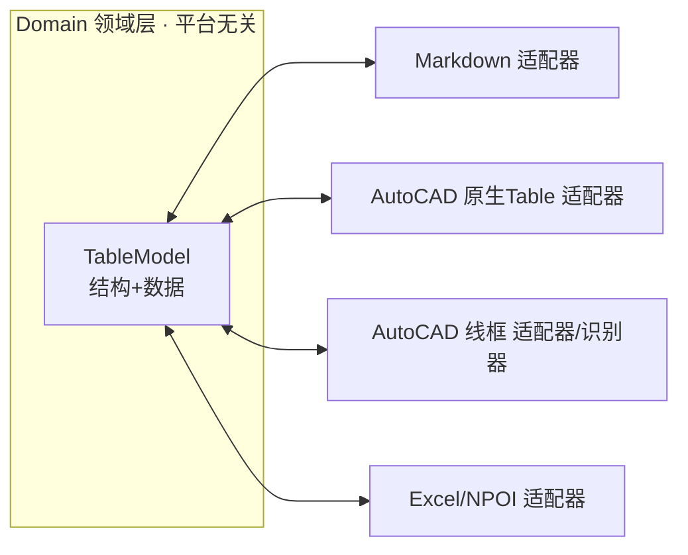

# AutoCAD 表格工具 — Domain 表格模型架构设计

> 设计日期：2026-06-24
> 上游：`001-AutoCAD表格工具-产品调研-2026-06-24-192049.md`（结论：做"CAD 内嵌类 Excel 编辑面板"，Domain 优先、局部自研）
> 黄金用例：`H:\person\环宇\20251010——人员基本情况表(1).doc`（复杂表单，见 §6）
> 定位：本文是 001 阶段 4「架构概要」的展开，**只定义领域模型与适配边界，不写实现逻辑**（类型草图为设计规格，非实现）。

---

## 0. 这份文档解决什么

001 决定了"做什么"。本文回答"**数据模型怎么设计，才能一套 Domain 同时落到 Markdown、AutoCAD、Excel，并撑住 Word 级复杂表 + Excel 级功能**"。你的 5 条思路是需求输入，本文把它们收敛成可落地的领域模型与决策。

### 你的 5 条思路 → 设计映射

| # | 你的思路 | 收敛为设计决策 |
|---|---|---|
| 1 | 像 Word 做复杂表，又像 Excel 有基本功能 | §2.1 基础网格 + §2.2 合并 + §2.3 斜线 撑复杂表；§2.4 数据/公式撑 Excel 功能 |
| 2 | 先做 Domain，复用于 MD / AutoCAD / 与 Excel 互转 | §2.5 端口-适配器；§4 适配器层 + 能力矩阵 |
| 3 | 基础单元为原子；可斜线分两独立格；可像 Excel 合并/拆分 | §2.1 基格为唯一真相；§2.3 斜线子格；§2.2 合并/拆分 |
| 4 | 合并后底层单元仍在，只是显示为一个，值可为多份相同值 | §2.2 合并=区域覆盖，**保留底格**，主值镜像 |
| 5 | 结构 + 值填充两部分；AutoCAD 编辑模式开=原生作图+线框识别生成表，关=类原生表 | §2.4 结构/数据分离；§2.6 + §5 双模与线框识别 |

---

## 1. 设计原则

1. **Domain 平台无关**：领域层不引用 `Autodesk.*`、不引用 NPOI、不引用任何 UI。算法与模型纯 C#。
2. **基础网格是唯一真相（single source of truth）**：所有复杂性（合并、斜线、竖排）都是叠加在规整基础网格上的**覆盖层**，而非破坏网格拓扑。
3. **结构与数据分离**：表"长什么样"（拓扑+样式）与"填什么值"（数据/绑定）是两层，可独立复用——一个"人员表"结构模板可反复填不同人的数据。
4. **可逆与无损**：合并能拆回、Domain↔各端尽量无损往返；不可避免的有损转换在 §4 能力矩阵显式标注。
5. **诚实面对端能力差异**：MD 原生表撑不住合并/斜线/竖排，不假装能——降级策略写清楚（§4.1）。

---

## 2. 核心设计决策

### 2.1 基础网格为唯一真相（对应思路 3）

表 = `Rows × Columns` 的规整基础网格，每个交叉点是一个**基础单元 BaseCell**，由 `(row, col)` 唯一定位。行高、列宽是网格属性。**基础网格的拓扑（多少行列）是底座，永不因合并而删除单元**。

> 类比：基础网格像结构里的**轴网**，合并/斜线像在轴网上画的梁板分区——分区会变，轴网不动。

### 2.2 合并 = 矩形区域覆盖，保留底格（对应思路 4，关键决策）

主流模型（HTML rowspan/colspan、AutoCAD Table）是"主格 + 隐藏被吞格"。**你的要求不同：合并后底格仍在，只是显示为一个**。本设计采纳你的方案：

- 合并用一个独立的 **`MergeRegion`**（矩形：起止行列）表达，**不删除任何 BaseCell**。
- 区域有一个**主单元（anchor，左上格）**承载显示值；区域内其余 BaseCell 标记 `CoveredBy=该区域`，其值**镜像主值**（你说的"值可为多个相同的值"）。
- **拆分**=删掉 `MergeRegion`，底格原样复现（天然可逆，零信息丢失）。
- 校验：`MergeRegion` 必须矩形、不重叠、不越界。

**取舍**：
- 优点：拆分无损；与 AutoCAD"线框识别"天然契合（线框里被合并处只是少了内部线，底格仍可推回）；序列化稳定。
- 代价：主值改了要同步镜像到被覆盖格 → 由 Domain 统一在写入口维护，外部只认主值。

### 2.3 斜线分割 = 单元内子格（对应思路 3）

一个 BaseCell 可被对角线切成多个**子格 SubCell**（最常见表头斜线"项目 \ 日期"）。

- `DiagonalSplit { Direction（↘/↗）, Parts[] }`，`Direction` 决定对角方向，`Parts` 是各三角/梯形区的内容。
- 支持 2 分（单斜线）与 4 分（双斜线，少见但留口）。
- 子格是**独立内容holder**（各自有值/样式），但仍隶属同一个 BaseCell（不破坏网格）。

### 2.4 结构 / 数据分离（对应思路 5 的"结构+值填充"）

- **结构层 `TableStructure`**：网格尺寸、合并、斜线、样式、单元的"角色"（标签格/值格/表头）、可选的字段名（`FieldKey`）。可存为**模板**（如"人员基本情况表.tabletpl"）。
- **数据层 `TableData`**：`FieldKey → Value` 或 `(row,col) → Value`；支持静态值、公式、外部绑定（Excel 单元格 / 图形取数）。
- **填充 = 结构 + 数据 合成**。这直接支撑：模板复用、批量出表、从对象/Excel/图元填值。

### 2.5 多端 = 端口-适配器（对应思路 2）

Domain 在中心，每个端是一个**适配器（Adapter / Port）**，实现"Domain↔该端"双向转换：



适配器统一接口（设计草图）：

```csharp
public interface ITableAdapter<TExternal>
{
    TableModel Import(TExternal source);   // 外部 → Domain
    TExternal Export(TableModel model);    // Domain → 外部
    AdapterCapability Capability { get; }  // 该端支持哪些特性（合并/斜线/竖排/公式…）
}
```

### 2.6 AutoCAD 双模（对应思路 5）

| 模式 | 表在图中的形态 | 用户操作 | 进/出该模式做什么 |
|---|---|---|---|
| **编辑模式 ON** | 散开为可编辑的**线 + 文字（线框态）** | 用 AutoCAD 原生命令画线、拉伸、加文字 | 退出时：**线框识别器**扫描线段→推回 `TableModel` |
| **编辑模式 OFF** | 渲染为**原生 Table（或锁定块）** | 行为类原生表，不可乱改 | 进入时：`TableModel`→线框态 |

核心是 §5 的**线框识别器**：把"一堆线和文字"反推成"行/列/合并/斜线"，使你能用最熟的 AutoCAD 作图方式造表。

---

## 3. Domain 模型（类型草图，设计规格）

> 仅数据形状与接口，无方法体/算法实现。命名空间建议 `HyCADTool.Features.Table.Domain`。

```csharp
// ── 顶层 ──
public sealed class TableModel
{
    public TableStructure Structure { get; }
    public TableData Data { get; }
}

// ── 结构层 ──
public sealed class TableStructure
{
    public int RowCount { get; }
    public int ColCount { get; }
    public IReadOnlyList<double> RowHeights { get; }   // 行高(mm)
    public IReadOnlyList<double> ColWidths { get; }     // 列宽(mm)
    public IReadOnlyList<MergeRegion> Merges { get; }   // §2.2 合并覆盖层
    public IReadOnlyDictionary<CellAddr, DiagonalSplit> Diagonals { get; } // §2.3 斜线
    public IReadOnlyDictionary<CellAddr, CellStyle> Styles { get; }
    public IReadOnlyDictionary<CellAddr, CellRole> Roles { get; } // 标签/值/表头
}

public readonly struct CellAddr            // 基础单元定位
{ public int Row { get; } public int Col { get; } }

public sealed class MergeRegion            // 矩形合并区，不删底格
{ public CellAddr TopLeft { get; } public int RowSpan { get; } public int ColSpan { get; }
  public CellAddr Anchor => TopLeft; }     // 主单元=左上

public sealed class DiagonalSplit
{ public DiagonalDirection Direction { get; } // BackslashTLBR / SlashBLTR
  public IReadOnlyList<SubCellContent> Parts { get; } }

public enum CellRole { Header, Label, Value, Title }

// ── 数据层 ──
public sealed class TableData
{
    public IReadOnlyDictionary<CellAddr, CellValue> Cells { get; }
    public IReadOnlyDictionary<string, CellAddr> FieldIndex { get; } // FieldKey→格，供模板填值
}

public sealed class CellValue              // 单元值（被合并区镜像主值）
{
    public string Text { get; }            // 显示文本
    public ValueKind Kind { get; }         // Static / Formula / Bound
    public string Formula { get; }         // Kind=Formula 时
    public string BindingExpr { get; }     // Kind=Bound：Excel地址 / 图形取数表达式
}

// ── 样式（平台无关，落端时翻译）──
public sealed class CellStyle
{
    public TextOrientation Orientation { get; } // Horizontal / VerticalStacked(竖排堆字)
    public TextAlign HAlign { get; } public TextAlign VAlign { get; }
    public double TextHeight { get; } public string FontKey { get; } // 抽象字体键→各端映射
    public BorderSet Borders { get; }
}
```

要点：
- **竖排堆字**（"学习和工作简历"那种）是 `TextOrientation.VerticalStacked`，而非靠手动换行——各端各自翻译（Excel=文字方向，AutoCAD=逐字堆叠或旋转，MD=降级）。
- **字体抽象**：Domain 存 `FontKey`（如 `"hei_bigfont"`），AutoCAD 适配器映射到大字体 `gbcbig.shx`（解决 001 里的中文问号），Excel 映射到具体字体名。
- 合并区被覆盖格的 `CellValue` 由 Domain 在写入口镜像，外部读写只面对 anchor。

---

## 4. 适配器层与能力矩阵

### 4.1 各端能力矩阵（诚实标注，对应原则 5）

| 特性 | Domain | AutoCAD 原生Table | AutoCAD 线框 | Excel(NPOI) | Markdown |
|---|---|---|---|---|---|
| 规整网格 | ✅ | ✅ | ✅ | ✅ | ✅ |
| 矩形合并 | ✅ | ✅ | ✅(缺内线推回) | ✅ 合并单元格 | ⚠️ 仅 HTML 降级 |
| **斜线分割** | ✅ | ⚠️ 边框斜线无独立内容 | ✅(画两条文字+斜线) | ⚠️ 斜线边框+两段文字 | ❌ |
| 竖排堆字 | ✅ | ✅ 逐字/旋转 | ✅ | ✅ 文字方向 | ❌ 降级为普通文本 |
| 公式 | ✅ | ⚠️ 有限 | ❌ | ✅ | ❌ |
| 富样式/边框 | ✅ | ✅ | ✅ | ✅ | ⚠️ 有限 |

**Markdown 降级策略**：MD 原生表撑不住合并/斜线/竖排。方案：① 简单表→标准 MD 表；② 复杂表→**嵌入 HTML `<table>`**（`rowspan/colspan` 表合并，CSS 表竖排/斜线）写进 `.md`；③ 保留一份 Domain JSON 作真相源，MD 仅为展示。**不假装 MD 原生能表达复杂表**。

> 与既有 `HyCADTool.MarkdownEditor`（WebView2）契合：复杂表用 HTML 渲染天然可行。

### 4.2 Excel 适配器（NPOI）

- 合并区 → `Sheet.AddMergedRegion`；竖排 → `CellStyle.Rotation`；斜线 → 单元对角边框 + 两段文字近似；公式 → NPOI 公式。
- 依赖坑（001 已记）：NPOI 引入须核对是否传递引用 AutoCAD 宿主程序集，必要时 `<ExcludeAssets>runtime</ExcludeAssets>`，防旧版 dll 复制进 bin\Debug。

### 4.3 AutoCAD 适配器（双通道）

- **原生 Table 通道**：`TableModel` ↔ `Autodesk.AutoCAD.DatabaseServices.Table`（编辑模式 OFF 时）。复用项目既有 `*TableBuilder`、`EntityExtensions`。
- **线框通道**：`TableModel` ↔ 线+文字（编辑模式 ON 时），核心是 §5 识别器。

---

## 5. AutoCAD 编辑模式与线框识别（最高技术风险）

### 5.1 工作流

```
[OFF·原生表] --进入编辑--> 散开为 线框态(线+文字, 可选淡色辅助网格)
      用户用 AutoCAD 原生命令自由改：画线/拉伸/加文字/删线(=合并)
[退出编辑] --线框识别器--> 推回 TableModel --> 渲染回 [OFF·原生表]
```

### 5.2 线框→表 识别算法（设计纲要，非实现）

1. **采集**：收集参与表的 `Line/Polyline` 段与 `Text/MText`。
2. **聚线成网格线**：把近似共线、共纵/横的段聚类 → 候选**横线集 Y**、**纵线集 X**（带容差，吸附）。
3. **建基础网格**：`X×Y` 交点形成规整基础网格（这就是 §2.1 的底座）。
4. **识别合并**：若某相邻基础单元之间**缺少分隔线段**，判定它们属于同一 `MergeRegion`（正好利用 §2.2 "底格仍在、只是没内线"的模型——推回零损耗）。
5. **识别斜线**：单元内若存在对角线段 → `DiagonalSplit`，按斜线两侧归类文字到子格。
6. **文字归属**：按几何包含/最近，将文字落到对应基础单元 / 子格，推断对齐与竖排（多行单字→`VerticalStacked`）。
7. **产出**：`TableModel`（结构+数据）；识别不确定处给用户**可视化复核**（高亮存疑单元，人工确认）。

### 5.3 风险与缓解

- **任意线段歧义**（不闭合/超出/重叠）→ 容差吸附 + 退出时校验 + 存疑高亮人工复核，不强行猜。
- **性能**：大表线段多 → 先包围盒裁剪、按行带分块。
- **建议**：MVP 阶段先支持"规整网格+矩形合并"的识别，斜线/竖排识别放 V2（见 §8）。

---

## 6. 黄金用例：人员基本情况表 → 模型映射

用你给的 `.doc` 验证模型够不够用（Word 文本已解析）：

| 表中元素 | 落到模型 |
|---|---|
| 标题"人员基本情况表"跨整行 | `MergeRegion`(0行整跨) + `CellRole.Title` |
| "姓名/性别/出生年月"一行多组标签值 | 同一行多个 `Label`+`Value` 基础单元交替 |
| 右侧"照片"格跨多行 | `MergeRegion`(竖向 RowSpan) |
| "全日制教育/在职教育"竖标签 | 合并区 + `VerticalStacked` 或多行 |
| "学习和工作简历""家庭主要成员…"竖排堆字 | `MergeRegion`(大块) + `TextOrientation.VerticalStacked` |
| 底部"称谓/姓名/年龄/政治面貌/工作单位及职务"子表 | 普通多行多列基础网格区段（含表头行 `Header`） |

结论：**基础网格 + 矩形合并 + 竖排 + 角色** 即可无损表达此复杂表单；斜线本例未用但模型已留口。→ 模型对"Word 级复杂表"是充分的。建议把此表做成**第一个结构模板**做端到端验证。

---

## 7. 开放问题（需你拍板）

1. **合并镜像值**：被覆盖格镜像主值仅内存维护即可，还是序列化时也要写出每份冗余值？（影响 JSON 体积与外部直读）
2. **斜线子格落 AutoCAD**：原生 Table 不支持单元内独立子内容，编辑模式 OFF 时斜线格是否退化为"两段文字+斜线（非真子格）"可接受？
3. **公式引擎**：Excel 功能要到什么程度——仅 `SUM/小计` 等基础，还是要较全的公式求值器（成本陡增）？
4. **Markdown 复杂表**：接受"复杂表用 HTML 嵌入 + JSON 真相源"的降级吗？
5. **真相源载体**：AutoCAD 里 `TableModel` 存哪——XData/扩展字典随表实体走，还是独立 JSON？（建议随实体走，便于复制/迁移）

---

## 8. 与 001 / MVP 的衔接 + 下一步

- 本设计落在 001 的分层里：**Domain**（本文 §3）→ **Infrastructure**（§4 适配器）→ **Presentation**（WPF 编辑面板 + AutoCAD 双模命令）。
- **MVP 收敛**（对齐 001 易用优先）：
  1. Domain 模型（结构+数据+合并+竖排，**斜线/公式留接口**）。
  2. WPF 网格编辑面板（输入/Tab/插删行列/合并拆分）→ AutoCAD 原生 Table 写出。
  3. "人员基本情况表"结构模板端到端跑通（§6）。
  4. Excel 导入导出（NPOI，合并+竖排）。
- **V2**：AutoCAD 线框识别（§5，先规整+矩形合并）、斜线子格、公式、MD/HTML 导出、相对路径联动。
- **先验证最危险假设**：①WPF 网格编辑手感（001 已列）②线框识别可行性——各做一个最小 PoC 再投入。

### 建议下一步（任选其一，确认后执行）

- A. 把 §3 Domain 模型落成真实 `HyCADTool.Features.Table.Domain` 工程骨架（纯类库，可单测）。
- B. 先做"人员基本情况表"结构模板 + WPF 面板原型，验证编辑手感。
- C. 先做线框识别 PoC（规整网格+矩形合并），验证最高风险点。

> 本文为设计文档，未写实现逻辑，未编译。确认方向后按项目规则（AI 编译→C2→C1）推进编码。
