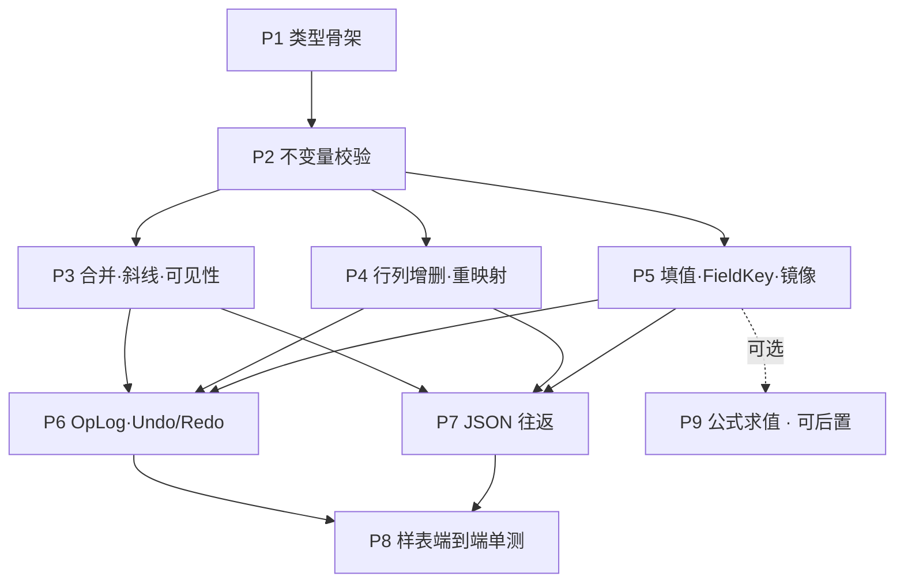

# 复杂表格 Domain 分阶段实施计划（006）

> 文档编号：006
> 生成日期：2026-06-24
> 上游设计：[005 复杂表格Domain统一设计](./005-复杂表格Domain统一设计-2026-06-24-232335.md)
> 范围：**仅 Domain**（= 005 §7.1「阶段 A」的展开）。不含 Adapter / 双模式 / 线框识别 / WPF 面板。
> 性质：**计划文档——只描述步骤、交付、验收、依赖，不写实现逻辑/方法体/算法**（遵循项目规则 3）。类型形状以 005 §3 为准，本文只引用不重抄。
> 用法：每个 `Pn` 步是一个**可独立执行的 Plan**。将来你按依赖顺序逐步开 Plan 落地；每步有自己的验收线，绿了再进下一步。

---

## 0. 本文要解决什么

005 已定稿 Domain 的**模型与决策**；006 把「完成 Domain」拆成**可逐步执行、可逐步验收**的步骤序列，让每一步都能：

1. 独立开一个 Plan / 一次编码会话完成；
2. 有明确「做什么 / 不做什么」边界，避免范围蔓延；
3. 有可单测的验收线，绿灯才推进；
4. 失败/中断时不污染已完成步骤。

> 唯一目标：**纯 C# 单元测试即可构造、编辑、序列化两张样表**，证明模型对「Word 级复杂表」充分——全程不碰 AutoCAD / Excel / Markdown。

---

## 1. 范围与边界（Domain Only）

### 1.1 IN（本计划覆盖）

| 内容 | 对应 005 |
|---|---|
| 程序集 `HyCADTool.Shared.Tables`（零平台依赖） | §7.3 |
| 全部静态类型（文档/表/结构/数据/样式/枚举） | §3 |
| 不变量校验 | §4.1 |
| 操作语义（合并/斜线/行列增删/填值） | §4.2 |
| 顺序操作日志 OpLog + Undo/Redo | §4.4 |
| JSON 序列化往返（稀疏 + 只存 Anchor） | §5、§8 D1 |
| 样表端到端单测 | §7.1 A4、§9.1 |

### 1.2 OUT（本计划不做，留后续阶段 B/C/D）

- Adapter：Markdown / HTML / AutoCAD / Excel(NPOI)
- AutoCAD 双模式、线框识别器
- WPF 表格编辑面板、命令入口
- **完整公式引擎**（仅留 `CellValue.Formula` 文本字段；求值见可选 P9）
- per-cell GUID / 协同编辑（D2 已定：MVP 用 CellAddr+FieldKey+OpLog）

### 1.3 硬约束（每步都成立）

- `HyCADTool.Shared.Tables` **零引用** `Autodesk.*` / NPOI / Markdig / 任何 UI；纯 C# 可单测。
- 一切复杂性是**叠加在规整网格上的覆盖层**，**永不删除 BaseCell**（005 §3.5）。
- 可见性、镜像值等**派生数据不持久化**（005 §3.5 / §8 D1）。

---

## 2. 步骤总览

| 步 | 目标（一句话） | 规模 | 依赖 | 005 章节 | MoSCoW |
|---|---|---|---|---|---|
| **P1** | 静态模型骨架（所有类型 + 构造） | M | — | §3 | Must |
| **P2** | 不变量校验器（5 条） | S | P1 | §4.1 | Must |
| **P3** | 结构操作：合并/拆分、斜线、可见性派生 | M | P2 | §3.6/§3.7/§4.2 | Must |
| **P4** | 行列增删 + 全字典坐标重映射 | L | P2 | §4.2 | Must |
| **P5** | 填值：`SetValue` / `SetValueByField` + 镜像 + FieldIndex | M | P2 | §3.4/§4.2 | Must |
| **P6** | OpLog + Undo/Redo（内存栈） | M | P3,P4,P5 | §4.4 | Must |
| **P7** | JSON 序列化往返（稀疏，只存 Anchor） | M | P3,P4,P5 | §5/§8 D1 | Must |
| **P8** | 两张样表端到端单测 | S–M | P6,P7 | §7.1/§9.1 | Must |
| **P9** | 简易公式求值（SUM/四则/引用） | M | P5 | §8 D4 | Could（可后置/V2） |

### 2.1 依赖关系图

> P3 / P4 / P5 概念上并行（都只依赖 P2），建议按 P3→P4→P5 顺序，降低交叉调试成本。P6、P7 都要等 P3/P4/P5 齐全（否则序列化/回放覆盖不全特性）。

### 2.2 里程碑分组（便于阶段性收口）

| 里程碑 | 含步骤 | 收口标志 |
|---|---|---|
| **M-α 模型可用** | P1 + P2 | 能 new 出合法表，非法结构被拒 |
| **M-β 可编辑可逆** | P3 + P4 + P5 + P6 | 合并/斜线/增删/填值全可做，且可 Undo |
| **M-γ 可持久化 + 验收** | P7 + P8（+P9 可选） | 样表 round-trip 一致，Domain DoD 达成 |

---

## 3. 各步详情

> 每步格式：目标 / 范围（做+不做）/ 交付物 / 关键决策 / 验收线 / 风险。**交付物只列类型与职责，不含实现代码**。

### P1 · 静态模型骨架

- **目标**：把 005 §3 全部类型落成可编译的不可变数据结构 + 最小构造能力。
- **做**：
  - 建程序集 `HyCADTool.Shared.Tables`（net 版本对齐主工程）。
  - 类型：`IDocumentNode` / `NodeKind`；`TableDocument` / `TableGrid`；`GridStructure` / `GridTopology` / `GridTrack` / `CellAddr`；`MergeRegion` / `MergeValuePolicy`；`DiagonalSplit` / `SubCell` / `DiagonalDirection`；`CellStyle` / `CellRole` / `TextOrientation` / `TextAlign` / `BorderSet`；`GridData` / `CellValue` / `CellValueKind` / `TextRun`；`NormalizedPoint`。
  - 最小构造：建空表（给定行列数，默认轨道尺寸）、只读访问器。
- **不做**：任何编辑/校验/序列化逻辑。
- **交付物**：上述类型文件（按 005 §7.3 目录分 `Structure/`、`Data/`）。
- **关键决策**：稀疏存储——默认样式/角色/空值的格**不进字典**（§3.5）。
- **验收线**：① 解决方案编译 0 error；② 单测确认零 `Autodesk.*`/NPOI/UI 引用；③ 能构造一个 `3×3` 空 `TableGrid` 并读回行列数。
- **风险**：枚举/字段命名一旦定稿即被后续步骤依赖 → 本步把 005 §0.3 命名表当唯一真相，避免后期重命名波及全链。

### P2 · 不变量校验器

- **目标**：把 005 §4.1 的 5 条不变量做成可调用的校验。
- **做**：`GridInvariants` 校验：① 底座完整；② 合并矩形/不重叠/不越界；③ 斜线唯一且不落被覆盖非 Anchor 格；④ FieldKey 全表唯一；⑤ 值种类一致（Formula/Bound 必填对应字段）。
- **不做**：自动修复（只报告违例，由调用方决定）。
- **交付物**：`GridInvariants`（校验入口 + 违例描述结构）。
- **验收线**：每条不变量各有 1 正例 + 1 反例单测；反例能精确指出违反哪条。
- **风险**：合并重叠判定边界条件（相邻 vs 相交）易错 → 单测覆盖「相邻不算重叠」「包含算重叠」。

### P3 · 结构操作：合并/拆分、斜线、可见性派生

- **目标**：实现覆盖层的增删与派生查询。
- **做**：
  - `Merge(rect, policy)` / `Unmerge(anchor)`；**MVP 仅 `AnchorOnly` + `SameValue`**。
  - `SplitDiagonal(addr, dir)` / `ClearDiagonal(addr)`。
  - 派生查询 `IsHidden(addr)` / `IsCovered(addr)` / `GetAnchorOf(addr)`（**不持久化**，由 MergeRegion 计算）。
- **不做**：`PreserveEach` / `Composite`（留 V2）；行列增删（P4）；值镜像写入细节（P5 统一）。
- **交付物**：`GridEditor` 中结构相关方法 + 派生查询。
- **关键决策**：合并/拆分**只动覆盖层不动 BaseCell**；操作后调用 P2 校验。
- **验收线**：`merge → unmerge` 后结构与底格逐字段还原（零丢失）；被覆盖非 Anchor 格禁止挂斜线（违例被拒）。
- **风险**：斜线与合并的交互（不变量 3）→ 单测覆盖「先合并再斜线应拒」「先斜线再合并（仅 Anchor 允许）」。

### P4 · 行列增删 + 全字典坐标重映射（最高出错点）

- **目标**：插/删行列后，所有按 `CellAddr` 索引的覆盖层与数据**整体平移/收缩**，且 `FieldIndex` 仍指向正确格。
- **做**：`InsertRow/InsertCol/DeleteRow/DeleteCol`；同步重映射 `Merges` / `Diagonals` / `Styles` / `Roles` / `FieldIndex` / `GridData.Cells`；删除时落在删除带内的覆盖层做**收缩或剔除**（合并区跨删除带 → span 减 1；整区落入 → 移除）。
- **不做**：OpLog 记录（P6）；撤销（P6）。
- **交付物**：`GridEditor` 中行列方法 + 内部重映射工具。
- **关键决策**：重映射是**纯函数式**重建字典（避免就地改键导致中途状态非法）。
- **验收线**：① 在含合并/斜线/FieldKey 的表上插行，`FieldIndex["姓名"]` 解析到新坐标且值不变；② 删列击穿合并区后 span 正确收缩；③ 每次操作后 P2 校验通过。
- **风险**：本步是 Domain 最易出 bug 处 → 单测矩阵覆盖「在合并区上方/内部/下方插删」「删除 Anchor 所在行」等组合。

### P5 · 填值：SetValue / SetValueByField + 镜像 + FieldIndex

- **目标**：统一填值入口，落实 SameValue 镜像与 FieldKey 解析。
- **做**：
  - `SetValue(addr, value)`；`SetValueByField(fieldKey, value)`（先解析 FieldIndex）。
  - 合并区写入：`policy=SameValue` → 镜像到全体 Member；读取合并区一律返回 Anchor 值。
  - `SetFieldKey(addr, key?)` 维护 FieldIndex 唯一性。
- **不做**：公式求值（P9）；持久化镜像（D1：镜像运行时维护）。
- **交付物**：`GridEditor` 填值方法。
- **关键决策**：**Anchor 是唯一权威读写入口**；外部只认 Anchor。
- **验收线**：① 向合并区 Anchor 写值，SameValue 下全 Member 读到同值，AnchorOnly 下仅 Anchor 有值；② `SetValueByField` 在插行后仍写对格；③ 重复 FieldKey 被拒。
- **风险**：镜像与读取口径不一致 → 单测断言「读合并区任意成员 == Anchor 值」。

### P6 · OpLog + Undo/Redo

- **目标**：把 P3/P4/P5 的操作记成顺序日志，支持撤销/重做（005 §4.4）。
- **做**：
  - `TableOperation` 操作类型（结构类 + 填值类，填值类**只记 FieldKey 不记坐标**当有 FieldKey 时）。
  - `TableOpLog` 顺序记录 + 内存 Undo/Redo 栈。
  - 每个操作可逆（逆操作或重放至前一快照）。
- **不做**：OpLog 持久化到磁盘（可选，列入风险/后续）；分布式 op id。
- **交付物**：`TableOperation`、`TableOpLog`，`GridEditor` 接入日志。
- **关键决策**：操作以**语义命令**记录（`SetValueByField("姓名",…)`），而非坐标差量 → 插行后回放仍正确。
- **验收线**：① 任意操作序列执行后逐步 Undo 回到初态、Redo 回到末态；② InsertRow 后 Undo 不残留坐标漂移。
- **风险**：Undo 与派生镜像/FieldIndex 的一致性 → 每次 Undo/Redo 后跑 P2 校验。

### P7 · JSON 序列化往返

- **目标**：`TableDocument` ↔ JSON 无损往返（005 §5）。
- **做**：
  - 稀疏字典序列化；`CellAddr` 用稳定可读键（如 `"r,c"`）。
  - **D1 默认：SameValue 只存 Anchor**，反序列化后由 Domain 重建镜像。
  - 不持久化派生数据（可见性、镜像）。
- **不做**：压缩（可选）；XData 落地（阶段 C）；OpLog 序列化（可选）。
- **交付物**：`TableJson`（读/写）。
- **关键决策**：JSON = **结构 + 权威值**；派生与冗余加载后重算。
- **验收线**：构造含合并/斜线/竖排/FieldKey/公式文本的表 → 序列化 → 反序列化 → **逐字段等价**（含 unmerge 仍可逆）。
- **风险**：浮点行高列宽、文化无关数字格式 → 固定 `InvariantCulture`，单测断言字节级/字段级稳定。

### P8 · 两张样表端到端单测

- **目标**：用真实复杂样表验证模型充分性（005 §9.1）。
- **做**：
  - **家庭成员表（7×6）**：侧栏竖排（`VerticalStacked`）+ 表头行 + 6 行数据。
  - **人员基本情况表主表（7×7）**：多处 rowspan/colspan、照片格 `PhotoSlot`、标题整行 `Title`。
  - 流程：用 `GridEditor` 建模 → 校验 → 序列化 → 反序列化 → 断言一致；并跑 merge→unmerge 可逆、插删行列后 FieldKey 正确。
- **不做**：渲染/导出（阶段 B+）。
- **交付物**：两份端到端测试用例（可作为后续 Adapter 的黄金夹具）。
- **验收线**：两表全流程绿灯；竖排/合并/斜线（如建模）round-trip 不丢。
- **风险**：样表语义理解偏差 → 以 005 §9.1 映射表为准建模。

### P9 · 简易公式求值（可选，可后置 / V2）

- **目标**：最小公式能力（005 §8 D4）。
- **做**：仅 `SUM(range)`、四则运算、单元格/区域引用；`Kind=Formula` 求值后缓存进 `CellValue.Text`。
- **不做**：完整 Excel 函数库、循环引用全检测（仅基础防护）、跨表引用。
- **交付物**：轻量求值器（独立于核心，可后接）。
- **验收线**：`=SUM(...)` 与四则在样表子集求值正确；导入未知公式时**保留文本不报错**。
- **风险**：范围蔓延 → 严格限定函数集；不达标即整体推迟到 V2，不阻塞 P1–P8。

---

## 4. Domain 完成定义（Definition of Done）

P1–P8 全绿即视为「Domain 完成」（P9 可选）：

- [ ] `HyCADTool.Shared.Tables` 编译 0 error，零平台依赖（P1）
- [ ] 5 条不变量有正反例覆盖（P2）
- [ ] 合并/拆分/斜线可逆，可见性派生正确（P3）
- [ ] 行列增删后全覆盖层重映射、FieldKey 解析正确（P4）
- [ ] 填值/镜像/FieldIndex 口径一致（P5）
- [ ] 任意操作序列 Undo/Redo 可逆（P6）
- [ ] JSON 往返逐字段等价、只存 Anchor（P7）
- [ ] 两张样表端到端绿灯（P8）

---

## 5. 风险与对策（Domain 专属）

| 风险 | 步骤 | 对策 |
|---|---|---|
| 命名后期返工波及全链 | P1 | 以 005 §0.3 命名表为唯一真相，P1 一次定稿 |
| 行列重映射 bug（最易错） | P4 | 纯函数式重建 + 组合单测矩阵 + 每步跑 P2 校验 |
| 镜像/派生与持久化漂移 | P5/P7 | 派生不落盘；加载后统一重建；读口径单测 |
| Undo 与派生一致性 | P6 | 每次 Undo/Redo 后强制 P2 校验 |
| 公式范围蔓延 | P9 | 严格函数集；不达标即推迟，不阻塞主线 |
| 样表语义误解 | P8 | 严格对照 005 §9.1 映射表建模 |

---

## 6. 与后续阶段的接缝（仅声明，不在本计划实现）

- **P7 的 JSON** 即阶段 C（AutoCAD）XData 真相源载体、阶段 B（HTML 预览）的输入。
- **P8 的两张样表夹具** 复用为 Adapter 黄金测试用例。
- **`IDocumentNode` 接缝**（P1）为将来并入 UDOM / Hy Document 预留，本计划不扩展其余 NodeKind。

---

## 7. 未决决策对本计划的影响

| 决策 | 状态 | 影响步骤 | 本计划取的默认 |
|---|---|---|---|
| D1 合并镜像值是否入 JSON | 待确认 | **P7** | 只存 Anchor（如改为全写镜像，仅 P7 调整） |
| D2 稳定身份 | ✅ 已确认 | P5/P6 | CellAddr + FieldKey + OpLog |
| D4 公式深度 | 待确认 | **P9** | 仅 SUM/四则/引用；不达标推迟 V2 |

> D3/D5/D6 属 Adapter/定稿层（阶段 C+），不影响本 Domain 计划。

---

> 本文为计划文档，未写实现逻辑、未编译。执行某一步时，按项目规则（AI `dotnet build` → 提示 C2 → C1）推进，并在该步验收线全绿后再进入下一步。
