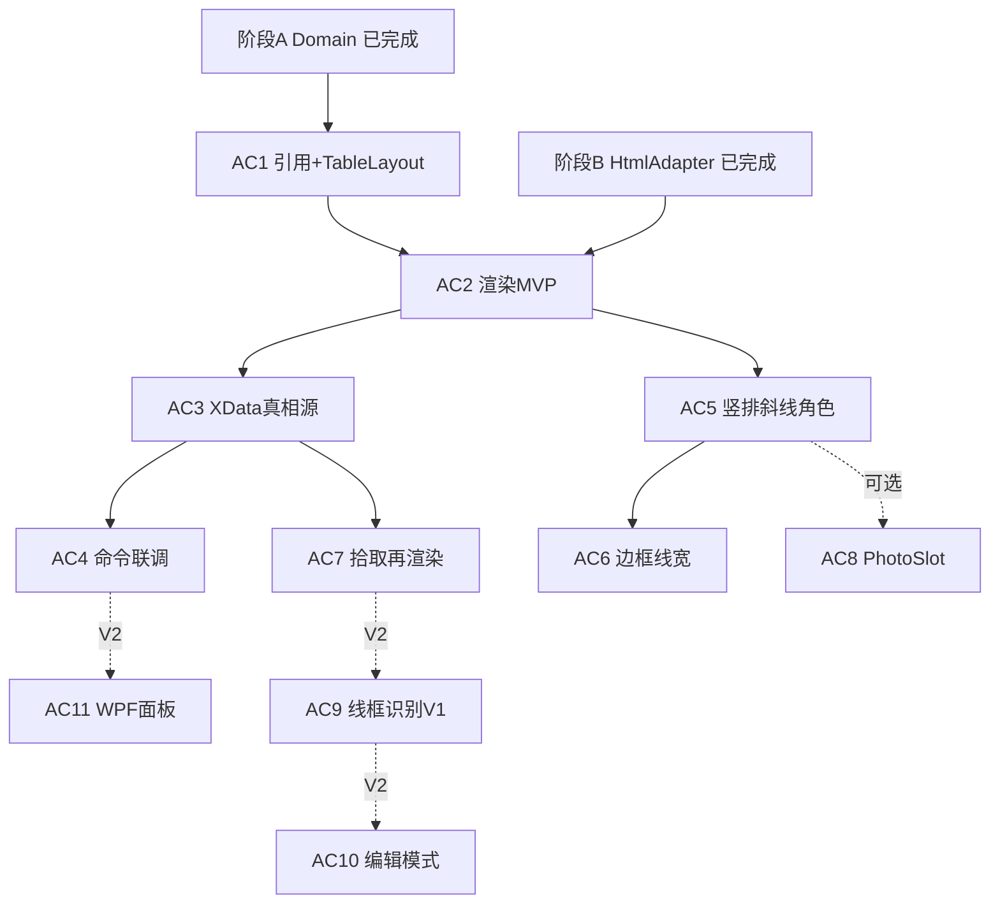

# AutoCAD 表格制作分阶段实施计划（008）

> 文档编号：008  
> 生成日期：2026-06-25  
> 上游设计：[005 复杂表格 Domain 统一设计](./005-复杂表格Domain统一设计-2026-06-24-232335.md)  
> 上游计划：[006 Domain 分阶段实施计划](./006-复杂表格Domain分阶段实施计划-2026-06-24-235651.md)  
> 现状快照：[007 Domain 代码完成情况](./007-HyCAD.Tables-Domain代码完成情况-2026-06-25-120000.md)  
> 范围：**阶段 C——AutoCAD 定稿渲染 + XData 真相源 + 命令联调**；编辑模式散开与线框识别器单列后续步。  
> 性质：**计划文档——只描述步骤、交付、验收、依赖，不写实现逻辑**（遵循项目规则 3）。  
> 用法：每个 `ACn` 步是一个**可独立执行的 Plan**。按依赖顺序逐步落地；每步验收线全绿再进下一步。

---

## 0. 本文要解决什么

005/006/007 已完成 **Domain（阶段 A）** 与 **HTML 预览适配器（阶段 B）**；本计划把 **「在 AutoCAD 里做出复杂表格」** 拆成可逐步执行、可逐步验收的步骤序列。

**本期硬目标（M-C1 + M-C2）**：`TableGrid` → 模型空间「线 + 文字」几何 + JSON 真相源挂载体实体 + 命令行读回 round-trip + 两张黄金样表目视验收。

**明确后置（M-C3）**：编辑模式散开、线框识别反推 Domain、WPF 填值面板——技术风险高，不阻塞 M-C1/M-C2。

---

## 1. 起点与边界

### 1.1 已完成（不重复做）

| 阶段 | 状态 | 交付 |
|---|---|---|
| **A Domain** | ✅ | `src/HyCAD.Tables`：P1–P9 全绿，124 项单测 |
| **B HTML 预览** | ✅ | `HtmlTableAdapter`、`ITableAdapter<T>`、`AdapterCapability`；10 项 Html 单测 + 样表 .html 目视 |

### 1.2 IN（本计划覆盖）

| 内容 | 对应 005 |
|---|---|
| 主工程引用 Domain | §7.3、`HyCADTool.csproj` → `HyCAD.Tables` |
| 纯几何布局（mm） | §3 拓扑 + 合并矩形计算（平台无关，可单测） |
| AutoCAD 定稿渲染 | §6.3「线 + 文字组合」 |
| XData / 扩展字典真相源 | §5「随实体走」 |
| 命令入口（ReCall N 占位符） | §7.3 `Features/Tables/` |
| 竖排 / 斜线 / 角色 / 边框退化渲染 | §6.2 能力矩阵「线框」列 |

### 1.3 OUT（本计划不做，留 AC9+）

- 线框识别器（退出编辑反推 `TableGrid`）→ **AC9**
- 编辑模式散开 + 原生命令自由画 → **AC10**
- WPF 表格结构/填值面板 → **AC11**
- 原生 `AcDbTable` 定稿输出（D5 简单表路径）→ **AC12 可选**
- Excel 互导（阶段 D）
- Markdown → Domain 替换 `List<List<string>>` 中间态
- `PhotoSlot` 插入图片 Block（D6）→ **AC8 可选**

### 1.4 硬约束（每步都成立）

- **`HyCAD.Tables` 零引用 `Autodesk.*`**；AutoCAD API 只在 `HyCADTool/Features/Tables/`。
- **模型空间坐标 = 实际 mm（1:1）**；`GridTrack.Size` 直接用于几何，**不乘 Scale**。
- **主工程禁用 `[CommandMethod]`**；命令走 ReCall `commands.json` + `Execute()`。
- **复杂表定稿 = 线 + 文字**（005 §6.3 / D5 默认）；不依赖原生 Table 的合并/斜线能力。
- 写锁定图层用 `LayerManager` / `LayerLockScope`（项目 pitfalls 约定）。

---

## 2. 步骤总览

| 步 | 目标（一句话） | 规模 | 依赖 | MoSCoW |
|---|---|---|---|---|
| **AC1** | 主工程引用 + 纯 mm 几何布局 `TableLayout` | S | Domain ✅ | Must |
| **AC2** | 定稿渲染 MVP：网格线 + 合并 + 文字对齐 | M | AC1 | Must |
| **AC3** | XData 真相源：写 JSON + 读回 round-trip | M | AC2 | Must |
| **AC4** | 命令联调：插入样表 + 读回验证 + C2→C1 | S | AC3 | Must |
| **AC5** | 复杂版式：竖排 + 斜线 + 角色样式 | M | AC2 | Must |
| **AC6** | 边框线宽/外框加粗（对齐样表 2） | S | AC5 | Should |
| **AC7** | 拾取已有表格：摘要 + 就地再渲染 | S | AC3 | Should |
| **AC8** | PhotoSlot 占位框（可选） | S | AC5 | Could |
| **AC9** | 线框识别 V1：规整网格 + 矩形合并 | L | AC7 | Could（V2） |
| **AC10** | 编辑模式：散开 + 退出识别 | L | AC9 | Could（V2） |
| **AC11** | WPF 填值面板 | L | AC4 | Could（V2） |

### 2.1 依赖关系图



### 2.2 里程碑分组

| 里程碑 | 含步骤 | 收口标志 |
|---|---|---|
| **M-C1 能落图** | AC1 + AC2 + AC3 + AC4 | C2→C1 插入人员表/家庭表；N34 读回 JSON 校验通过 |
| **M-C2 版式完整** | AC5 + AC6（+AC8 可选） | 两张黄金样表与 HTML 导出视觉对齐 |
| **M-C3 双向编辑** | AC7 + AC9 + AC10 + AC11 | 拾取→识别→编辑→定稿闭环（V2） |

> **建议执行顺序**：AC1 → AC2 → AC3 → AC4（先打通最小闭环）→ AC5 → AC6 → AC7；AC8–AC11 按需后置。

---

## 3. 各步详情

> 格式：目标 / 做+不做 / 交付物 / 关键决策 / 验收线 / 风险。

### AC1 · 主工程引用 + 纯几何布局

- **目标**：Domain 可被主工程引用；行列 mm 偏移与合并格外接矩形可单测。
- **做**：
  - `HyCADTool.csproj` 增加 `<ProjectReference Include="..\HyCAD.Tables\HyCAD.Tables.csproj" />`。
  - 新增 `HyCAD.Tables/Layout/TableLayout.cs`：由 `GridTopology.Rows/Cols` 累加 X/Y 偏移；解析 `MergeRegion` 得 `(x,y,w,h)`；`IsHidden` 跳过；`EnumerateVisibleCells()`。
  - `GrowDirection.Down`：行号增大时 Y 递减。
- **不做**：AutoCAD API；文字/线实体创建。
- **交付物**：`TableLayout.cs`；`TableLayoutTests.cs`。
- **关键决策**：布局计算放 Domain，渲染器只做「矩形 → Entity」映射。
- **验收线**：① 主工程编译 0 error；② `TableLayoutTests` 覆盖偏移/合并 span/hidden/基点；③ `PlatformIndependenceTests` 仍通过。
- **风险**：合并 hidden 与 HTML 适配器口径不一致 → 对照 `HtmlTableAdapter` 跳过 hidden 逻辑写对照单测。

### AC2 · 定稿渲染 MVP（网格 + 合并 + 文字）

- **目标**：`TableGrid` + 基点 → 模型空间线框 + 单元格文字。
- **做**：
  - 新建 `src/HyCADTool/Features/Tables/Infrastructure/AutoCad/`。
  - `AcadTableRenderer`：`LockDocument` + 事务 + `ModelSpace`；`LayerManager.EnsureLayer`。
  - 每个可见单元格画闭合 `Polyline` 外框（合并格画大框、跳过 hidden）。
  - 文字：`DBText` + `HorizontalMode/VerticalMode/AlignmentPoint` + `AdjustAlignment`；显示值为公式结果或 `CellValue.Text`。
  - `AcadTableRenderOptions`：基点、默认字高、图层名。
- **不做**：XData；竖排/斜线；边框粗细差异；PhotoSlot。
- **交付物**：`AcadTableRenderer.cs`、`AcadTableRenderOptions.cs`。
- **关键决策**：参照 `DrawSurfaceLayerLinesCommand` / `Page53AnchorTableBuilder` → `DetailSketchRenderer` 的线+文字模式，不用 `AcDbTable`。
- **验收线**：① 3×3 均匀空表落图；② 含 rowspan/colspan 的子集合并正确；③ C2→C1 目视网格与文字位置合理。
- **风险**：DBText 对齐模式遗漏 `AdjustAlignment` → 文字偏移；合并格重复画内线 → 必须 skip hidden。

### AC3 · XData 真相源 + 读回 round-trip

- **目标**：渲染产物携带 JSON 真相源，选中实体可还原 `TableGrid`。
- **做**：
  - `HyTableXdata.cs`：`RegAppName = "HY_TABLE"`；存表 `Guid` / `kind` / `schemaVersion`（仿 `HyRoadXdata`）。
  - `AcadTableStore.cs`：`TableJson.Serialize` → `ExtensionDictionaryService.WriteLongString(..., "HyTable_JSON")`（仿 `DesignSpecService`）。
  - **载体实体** = 表格外框 `Polyline`（单一真相载体，便于拾取）。
  - `TryReadTableGrid(entity, out grid)`：读扩展字典 → `TableJson.Deserialize`（自动重建镜像 + 重算公式）。
- **不做**：OpLog 磁盘持久化；跨实体引用。
- **交付物**：`HyTableXdata.cs`、`AcadTableStore.cs`。
- **关键决策**：大 JSON 走扩展字典，小标识走 XData（16KB 限制内）。
- **验收线**：① 插入后选中载体，`TryReadTableGrid` 与源表 `GridInvariants.Validate` 通过；② FieldKey / 合并 / 公式值一致；③ 复制实体后 XData 仍可读（DWG 内迁移）。
- **风险**：JSON 过大 → 监控样表体积；必要时 snapshot 压缩留 V2。

### AC4 · 命令联调（插入 + 读回）

- **目标**：AutoCAD 内一键插入黄金样表并验证读回。
- **做**：
  - `InsertSampleTableCommand.Execute()`：复用 `SampleTablesEndToEndTests.BuildPersonnelTable` / `BuildFamilyTable` → 渲染 + 写真相源。
  - `ReadTableBackCommand.Execute()`：提示选实体 → 读回 → 命令行输出行列数 + 不变量结果。
  - `commands.json`：N33=插入、N34=读回；同步 `bin\Debug`。
  - `TestCommand.Run()` 指向插入命令（C1 联调入口）。
- **不做**：正式命令名 `hyTable*`（稳定后走 ReCall 冷启动转正）。
- **交付物**：`Commands/InsertSampleTableCommand.cs`、`ReadTableBackCommand.cs`。
- **关键决策**：样表构造逻辑与 P8 测试共用，避免两套数据。
- **验收线**：① AI `dotnet build src\HyCADTool\HyCADTool.csproj -c Debug` 0 error；② 用户 C2→C1 插入人员表；③ N34 读回绿灯。
- **风险**：未编译就 C2 → 按 skill 提醒 AI 先 build。

### AC5 · 复杂版式（竖排 + 斜线 + 角色）

- **目标**：对齐 HTML 适配器能力矩阵的「Full」项。
- **做**：
  - **竖排** `TextOrientation.VerticalStacked`：逐字换行 `MText`（中文竖排）。
  - **斜线** `DiagonalSplit`：对角 `Line` + 两段 `SubCell` 文字定位（D3 退化方案）。
  - **角色** `CellRole`：Title/Header/Label 不同字高或加粗样式。
  - 渲染选项与 `HtmlTableAdapter` 能力对照表保持一致。
- **不做**：识别器反推竖排/斜线（AC9+）。
- **交付物**：扩展 `AcadTableRenderer`；可选 `AcadTableCapability` 声明降级项。
- **验收线**：① 家庭成员表侧栏竖排目视可读；② 含斜线的子集（若样表建模）正确；③ 与 `html-samples/*.html` 布局一致度人工确认。
- **风险**：竖排字间距/heights 需调参 → 选项暴露 `DefaultTextHeightMm`。

### AC6 · 边框线宽 / 外框加粗

- **目标**：支持样表 2「外框 1.5pt、内框 1pt」类差异（005 §9.1 家庭成员表）。
- **做**：
  - 读取 `CellStyle.Border` / `GridTopology.DefaultBorder`；映射到 `Polyline`/`Line` 线宽或图层。
  - 合并格外边框 vs 内边框：按单元格四边分别判断是否与邻居共享。
- **不做**：AutoCAD 表格样式 `TableStyle`（走几何线宽）。
- **交付物**：渲染器边框分支；单测可测「边是否外框」逻辑（放 Domain 或 Renderer 纯函数）。
- **验收线**：家庭成员表外框明显粗于内框；目视与 HTML 样表一致。
- **风险**：Polyline 恒定线宽 vs 单段 Line 混用 → 统一策略写进 AC6 决策记录。

### AC7 · 拾取已有表格（摘要 + 再渲染）

- **目标**：点选带 `HY_TABLE` 的实体，显示摘要并可选在旁重绘。
- **做**：
  - `PickTableCommand` 或在读回命令上扩展：选实体 → 打印表名/行列/FieldKey 数/公式格数。
  - 「再渲染」：读回 `TableGrid` → 新基点 `AcadTableRenderer.Render`（不删旧实体）。
- **不做**：几何 diff / 原地更新。
- **验收线**：选中 AC4 插入的表，摘要正确；再渲染不报错。
- **风险**：多实体共享同一 JSON → MVP 一载体一表。

### AC8 · PhotoSlot 占位（可选）

- **目标**：`CellRole.PhotoSlot` 合并格内画矩形占位 + 「照片」文字（D6）。
- **做**：占位框 `Polyline` + 居中文字；不写图片 Block。
- **验收线**：人员表右侧照片格目视正确。
- **风险**：低；可并入 AC5 若时间紧。

### AC9 · 线框识别 V1（V2，Could）

- **目标**：从散开的 Line/Polyline + DBText **反推**规整网格 + 矩形合并（005 §6.3 最高风险项）。
- **做**：`TableInferService`；仅支持等间距或已知轨道尺寸的网格；合并由共线矩形推断。
- **不做**：斜线/竖排识别（V2.1）；手写不等宽列（V2.2）。
- **验收线**：对 AC2 输出的表「散开 → 识别」结构与原版 Field 数一致率 ≥ 95%。
- **风险**：误识别 → 必须可视化 diff + 人工确认门。

### AC10 · 编辑模式（V2，Could）

- **目标**：`TableEditModeService`：定稿 Block/Group → Explode 为线+文字 → 用户原生编辑 → 退出调用 AC9。
- **验收线**：简单 3×3 表编辑后读回结构不丢。
- **风险**：Explode 丢 XData → 编辑前备份 JSON 到 Sidecar 或锁定载体 Handle。

### AC11 · WPF 填值面板（V2，Could）

- **目标**：PaletteSet 面板绑定 `TableGrid`；`SetValueByField` + OpLog Undo。
- **验收线**：改「姓名」FieldKey 后再渲染文字更新。
- **风险**：PaletteSet 资源字典 → 遵守 wpf-paletteset skill。
- **UX 规格**：[014 面板设计调研](./014-表格与CAD工具面板设计-产品调研-2026-06-25-193648.md)（HyBlender「表格」Tab · DataGrid · 012/013 折叠属性 · `ExecuteInCommandContextAsync` 写 CAD）；**设置控件**：[015 面板设置](./015-表格面板设置-产品调研-2026-06-25-194246.md)（Quick 条 · 表/行/列/格 Tab · Domain 映射）。

---

## 4. 建议目录（005 §7.3 落地版）

```text
src/HyCAD.Tables/
  Layout/TableLayout.cs              ← AC1（平台无关）
  Adapters/                          ← 阶段 B 已有

src/HyCADTool/Features/Tables/
  Infrastructure/AutoCad/
    AcadTableRenderer.cs             ← AC2, AC5, AC6
    AcadTableRenderOptions.cs
    HyTableXdata.cs                  ← AC3
    AcadTableStore.cs                ← AC3
  Application/
    TableInferService.cs             ← AC9（V2）
    TableEditModeService.cs          ← AC10（V2）
  Commands/
    InsertSampleTableCommand.cs      ← AC4
    ReadTableBackCommand.cs          ← AC4
    PickTableCommand.cs              ← AC7
  Presentation/
    TablePanel.xaml                  ← AC11（V2）
```

---

## 5. 与现有代码衔接

| 现有模块 | 本计划用法 |
|---|---|
| `HtmlTableAdapter` | AC5 视觉对标；能力矩阵一致 |
| `SampleTablesEndToEndTests` | AC4 黄金夹具唯一来源 |
| `HyRoadXdata` / `ExtensionDictionaryService` | AC3 XData 读写模板 |
| `LayerManager` / `EntityExtensions.ToSpace` | AC2 图层与落图 |
| `Page53AnchorTableBuilder` + `DetailSketchRenderer` | AC2 线+文字先例 |
| `SettlementTableService` / `DesignSpecService` | **不迁移**；AC2 不走 AcDbTable；V2 可抽 `UnmergeAllAfterSetSize` 公共方法 |

---

## 6. AutoCAD 完成定义（M-C1 DoD）

AC1–AC4 全绿即 **M-C1 达成**；AC5–AC6 全绿即 **M-C2 达成**：

- [ ] `HyCADTool` 引用 `HyCAD.Tables`，编译 0 error（AC1）
- [ ] `TableLayoutTests` 绿灯（AC1）
- [ ] 3×3 与合并子集落图正确（AC2）
- [ ] XData/扩展字典读写 round-trip，`GridInvariants` 通过（AC3）
- [ ] C2→C1 插入人员基本情况表；N34 读回绿灯（AC4）
- [ ] 家庭成员表竖排 + 人员表多合并目视验收（AC5）
- [ ] 外框/内框线宽差异可见（AC6）

---

## 7. 风险与对策

| 风险 | 步骤 | 对策 |
|---|---|---|
| Domain 被 AutoCAD API 污染 | AC1+ | `PlatformIndependenceTests` 每步必跑 |
| 合并格重复画线/文字 | AC2 | skip hidden；对照 HTML 适配器 |
| XData 16KB 限制 | AC3 | 大 JSON 只走扩展字典 |
| 竖排/斜线目视不达标 | AC5 | 与 html-samples 并排对比调参 |
| 识别器范围蔓延 | AC9+ | V1 只做等距网格+矩形合并；不达标不阻塞 M-C1 |
| C2 热重载命令未更新 | AC4 | 改代码后 AI build + 用户 C2 |

---

## 8. 联调约定

| 动作 | 命令/入口 |
|---|---|
| AI 编译 | `dotnet build src\HyCADTool\HyCADTool.csproj -c Debug` |
| 热重载 | AutoCAD `C2` |
| 一键插入样表 | `C1`（`TestCommand` → `InsertSampleTableCommand`） |
| 读回验证 | `N34` |
| Domain 单测 | `dotnet test src\HyCAD.Tables.Tests` |

---

## 9. 变更记录

| 日期 | 说明 |
|---|---|
| 2026-06-25 | 008 初版：阶段 C 拆 AC1–AC11；M-C1/M-C2/M-C3 里程碑；对齐 005/007 与已完成的 HTML 适配器 |

---

> 本文为计划文档，未写实现逻辑、未编译。执行某一步时，按项目规则（AI `dotnet build` → 提示 C2 → C1）推进，并在该步验收线全绿后再进入下一步。  
> **建议下一步**：开 Plan 执行 **AC1**（引用 + `TableLayout` + 单测）。
