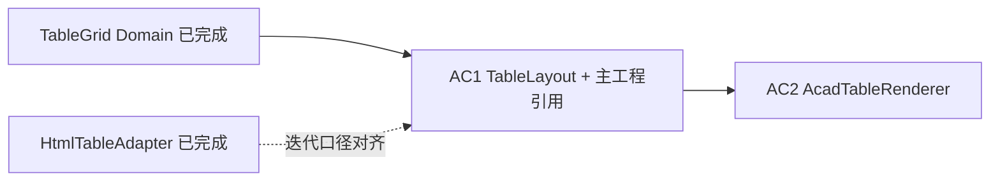

# AC1 · 主工程引用与 TableLayout 详解（008a）

> 文档编号：008a（008 的子文档，专述 **AC1**）  
> 生成日期：2026-06-25  
> 上游总计划：[008 AutoCAD 表格制作分阶段实施计划](./008-AutoCAD表格制作分阶段实施计划-2026-06-25-143000.md)  
> 设计规格：[005 §3 拓扑 / §3.6 合并](./005-复杂表格Domain统一设计-2026-06-24-232335.md)  
> 性质：**AC1 执行规格**——足够细到可单独开 Plan 编码；仍不写方法体/算法实现，但给出坐标系、API 形状、单测矩阵与验收清单。  
> 用法：实现 AC1 时以本文 + 008 §AC1 为唯一真相；AC1 全绿后再开 AC2。

---

## 0. AC1 在一整条链里的位置



**AC1 只做两件事**，且都不碰 AutoCAD API：

1. **工程接缝**：`HyCADTool` 能引用 `HyCAD.Tables` 并编译通过。  
2. **纯几何布局**：给定 `TableGrid` + 基点 (mm)，算出每个**可见单元格**的外接矩形，以及整张表的外包络。

AC2 及之后所有 AutoCAD 渲染代码**只消费** `TableLayout` 的输出，不再重复算行列偏移或合并 span——避免 HTML / CAD 两套几何口径漂移。

---

## 1. 目标与完成定义（DoD）

### 1.1 一句话目标

**Domain 可被主工程引用；`TableLayout` 把 `GridTopology` + `MergeRegion` 映射为 mm 矩形，行为与 `HtmlTableAdapter` 的「逐行逐列、skip hidden、anchor 输出 span 矩形」完全一致。**

### 1.2 AC1 Definition of Done（全部勾选才算完成）

- [ ] `src/HyCADTool/HyCADTool.csproj` 含 `HyCAD.Tables` 的 `ProjectReference`，`dotnet build src\HyCADTool\HyCADTool.csproj -c Debug` **0 error**
- [ ] 新增 `src/HyCAD.Tables/Layout/TableLayout.cs`（及必要伴生类型），**零** `Autodesk.*` 引用
- [ ] 新增 `src/HyCAD.Tables.Tests/TableLayoutTests.cs`，**≥ 12** 个用例全绿
- [ ] `dotnet test src/HyCAD.Tables.Tests` 全绿（含原有 124+ 项 + `PlatformIndependenceTests`）
- [ ] **不**新增 `Features/Tables/` 下任何 AutoCAD 文件（属 AC2）
- [ ] **不**改 `HtmlTableAdapter` 行为（仅允许后续 refactor 复用 `TableLayout`，非 AC1 必须）

---

## 2. 范围边界

### 2.1 IN（AC1 必须做）

| # | 工作包 | 交付 |
|---|---|---|
| W1 | 主工程项目引用 | `HyCADTool.csproj` 一行 `ProjectReference` |
| W2 | 坐标系与偏移累加 | `GrowDirection.Down` 下 X/Y 边线数组 |
| W3 | 单格 / 合并格外接矩形 | `(left, top, right, bottom)` 或等价 `(x, y, w, h)` |
| W4 | 可见性 | `IsHidden` 与 `GridStructure` 同口径；枚举只含可见格 |
| W5 | 表级外包络 | 供 AC3 载体 `Polyline` 与 AC2 外框使用 |
| W6 | 单测矩阵 | 见 §6 |

### 2.2 OUT（AC1 明确不做）

| 内容 | 留给 |
|---|---|
| `Line` / `DBText` / `Polyline` 创建 | AC2 |
| 文字对齐点、竖排逐字坐标 | AC5（AC2 仅用矩形中心/内边距） |
| 斜线端点、`SubCell` 归一化坐标 → mm | AC5（AC1 可预留 API 签名，**不实现**） |
| 边框哪条边是外框/内框 | AC6 |
| XData / 命令 / TestCommand | AC3–AC4 |
| `GrowDirection.Up` 完整支持 | AC1 仅实现 `Down`；`Up` 抛 `NotSupportedException` 或文档标注 V2 |

---

## 3. 工作包 W1：主工程引用

### 3.1 改动点

**文件**：[`src/HyCADTool/HyCADTool.csproj`](../../../src/HyCADTool/HyCADTool.csproj)

在现有 `<ItemGroup>` 的 `ProjectReference` 区块增加：

```xml
<ProjectReference Include="..\HyCAD.Tables\HyCAD.Tables.csproj" />
```

建议放在 `HyCAD.Geometry` 或 `HyCADTool.TextLayout` 附近，保持同类 Domain/工具库聚合。

### 3.2 兼容性（已验证可预期）

| 项 | 值 |
|---|---|
| `HyCAD.Tables` TFM | `netstandard2.0` |
| `HyCADTool` TFM | `net48` |
| 额外依赖 | 仅 `System.Text.Json`（主工程通常已间接引用） |
| 解决方案 | 已在 `HyCADtoolGpt.sln` 中，**无需**改 sln |

### 3.3 W1 验收

- 主工程编译 0 error  
- **AC1 阶段不要求**主工程代码 `using HyCAD.Tables`（引用存在即可）；AC2 再写第一个 consumer

### 3.4 风险

| 风险 | 对策 |
|---|---|
| 循环引用 | `HyCAD.Tables` 不得引用 `HyCADTool`（`PlatformIndependenceTests` 已约束 Tests 侧） |
| CS2012 锁文件 | 按项目规则 `dotnet build-server shutdown` + `-nodeReuse:false` |

---

## 4. 工作包 W2–W5：`TableLayout` 设计规格

### 4.1 文件与命名空间

```text
src/HyCAD.Tables/Layout/
  TableLayout.cs          ← 主入口
  LayoutPoint.cs          ← 可选：2D mm 点 (double X, double Y)
  LayoutRect.cs           ← 外接矩形
  VisibleCellLayout.cs    ← 枚举项：地址 + 矩形 + 合并信息
```

- **命名空间**：`HyCAD.Tables.Layout`  
- **依赖**：仅 `HyCAD.Tables.Structure`、`HyCAD.Tables`（`TableGrid`）

### 4.2 坐标系约定（与 AutoCAD 模型空间对齐）

**硬规则**（008 §1.4）：

- 单位：**mm，1:1**，不乘 `SettingsPanelViewModel.Scale`  
- **原点 `Origin`**：整张表 **左上角**（第 0 行第 0 列格的 **左上外角**）在模型空间的位置  
- **X**：向右为正  
- **Y**：`GrowDirection.Down` 时，**向下为 Y 减小**（与 AutoCAD 常用「表从上往下长」一致）

记：

- `ColWidth(c) = Topology.Cols[c].Size`  
- `RowHeight(r) = Topology.Rows[r].Size`  
- `ColLeft(c) = Origin.X + Σ_{i=0}^{c-1} ColWidth(i)`（`ColLeft(0) = Origin.X`）  
- `RowTop(r) = Origin.Y - Σ_{i=0}^{r-1} RowHeight(i)`（`RowTop(0) = Origin.Y`）  
- `RowBottom(r) = RowTop(r) - RowHeight(r)`

**表级外包络**（`GrowDirection.Down`）：

- `Left = Origin.X`  
- `Top = Origin.Y`  
- `Right = Origin.X + Σ ColWidth`  
- `Bottom = Origin.Y - Σ RowHeight`

```text
  Origin (TopLeft)
    +--------→ X
    |  (0,0) (1,0) ...
    ↓ Y 减小
    (1,0) ...
```

### 4.3 与 `HtmlTableAdapter` 的迭代对齐

HTML 适配器核心循环（[`HtmlTableAdapter.cs`](../../../src/HyCAD.Tables/Adapters/HtmlTableAdapter.cs) L79–96）：

1. 外层 `for row`，内层 `for col`  
2. `if (structure.IsHidden(addr)) continue;`  
3. 对 anchor 格：`rowspan` / `colspan` 来自 `MergeRegion`  
4. `<colgroup>` 列宽 = 各 `GridTrack.Size`

**TableLayout 必须遵循同一顺序与同一 skip 规则**，以便 AC2 画 `<td>` 边框与 CAD 单元格一一对应。

### 4.4 合并矩形计算

对地址 `addr`（必为 **可见** 格，即非 hidden）：

1. `structure.TryGetMergeAt(addr, out merge)`  
2. 若 `merge == null`：`rowSpan = colSpan = 1`，anchor = addr  
3. 若 `merge != null` 且 `addr == merge.Anchor`：用 `merge.RowSpan` / `merge.ColSpan`  
4. 若 `merge != null` 且 `addr != merge.Anchor`：**不应出现在可见枚举中**（hidden）

**外接矩形**（anchor 在 `(r0, c0)`，span `(RS, CS)`）：

- `Left = ColLeft(c0)`  
- `Top = RowTop(r0)`  
- `Right = ColLeft(c0 + CS)`（= `ColLeft(c0) + Σ ColWidth(c0 .. c0+CS-1)`）  
- `Bottom = RowTop(r0 + RS)`（= `RowTop(r0) - Σ RowHeight(r0 .. r0+RS-1)`）

**注意**：`MergeRegion.Covers` 使用半开区间 `[TopLeft, TopLeft+Span)`，与 Domain 一致，**不要**改成闭区间。

### 4.5 建议公开 API（形状，非实现）

```csharp
namespace HyCAD.Tables.Layout;

/// <summary>由 TableGrid + 基点构建的 mm 布局视图。</summary>
public sealed class TableLayout
{
    public TableGrid Grid { get; }
    public LayoutPoint Origin { get; }
    public GrowDirection Direction { get; }

    public static TableLayout Create(TableGrid grid, double originX, double originY,
        GrowDirection direction = GrowDirection.Down);

    /// <summary>表总宽/高（mm）。</summary>
    public double TotalWidth { get; }
    public double TotalHeight { get; }

    /// <summary>整张表外包络（Down 方向：Top > Bottom）。</summary>
    public LayoutRect TableBounds { get; }

    /// <summary>第 c 列左边缘 X（含 Origin）。</summary>
    public double GetColumnLeft(int col);

    /// <summary>第 r 行顶边 Y（Down：首行顶 = Origin.Y）。</summary>
    public double GetRowTop(int row);

    /// <summary>可见格枚举：行优先，与 HtmlTableAdapter 相同。</summary>
    public IEnumerable<VisibleCellLayout> EnumerateVisibleCells();

    /// <summary>单址查询；hidden 返回 false。</summary>
    public bool TryGetCellRect(CellAddr addr, out LayoutRect rect, out MergeRegion? merge);
}

public readonly record struct LayoutPoint(double X, double Y);

public readonly record struct LayoutRect(double Left, double Top, double Right, double Bottom)
{
    public double Width => Right - Left;
    public double Height => Top - Bottom; // Down 方向 Top > Bottom，Height 为正
    public LayoutPoint Center => new((Left + Right) / 2, (Top + Bottom) / 2);
}

public readonly record struct VisibleCellLayout(
    CellAddr Addr,
    LayoutRect Bounds,
    bool IsMergeAnchor,
    int RowSpan,
    int ColSpan,
    MergeRegion? Merge);
```

**构造校验**：

- `grid == null` → `ArgumentNullException`  
- `GridInvariants.Validate(grid).IsValid == false` → 建议 **仍允许布局**（渲染调试需要），但单测用合法表；或在 `Create` 内可选 `throw`——**推荐不抛**，与 `HtmlTableAdapter` 一致（非法表也能预览便于排错）

### 4.6 网格线辅助（AC2 会用到，AC1 建议一并提供）

AC2 画单元格边框时，除「每格一个矩形」外，也可能画 **整表网格线**。以下方法放 `TableLayout` 可减少 AC2 重复：

| 方法 | 用途 |
|---|---|
| `IReadOnlyList<double> ColumnBoundariesX` | `[Origin.X, col1左, col2左, …, 右外缘]`，长度 `ColCount+1` |
| `IReadOnlyList<double> RowBoundariesY` | `[Origin.Y, row1顶, …, 底外缘]`，Down 时单调递减，长度 `RowCount+1` |

**验收**：3×3 均匀表，`ColumnBoundariesX` 等间距；7 列非均匀 `GridTrack` 与手工累加一致。

### 4.7 `GrowDirection.Up`（AC1 不实现）

- `Create(..., GrowDirection.Up)` → `NotSupportedException`，消息注明「AC1 仅 Down；Up 见 008 V2」  
- 单测 1 条断言抛异常即可，避免 AC2 误用未实现方向

---

## 5. AC2 消费契约（AC1 验收时心里要有数）

AC2 `AcadTableRenderer` 将这样使用 AC1 产出（**本文不实现，仅定接口契约**）：

| AC2 需求 | AC1 提供 |
|---|---|
| 插入点（用户点选或默认 0,0） | `TableLayout.Create(grid, x, y)` |
| 每个 `<td>` 边框 | `EnumerateVisibleCells()` → `Bounds` → `Polyline` 四角 |
| 合并格一大框 | 同上（hidden 已跳过，仅 anchor 一条） |
| 文字对齐参考 | `Bounds.Center` 或 `Left/Top` + padding（AC2 内算） |
| 载体外框（AC3） | `TableBounds` → 闭合 `Polyline` |
| 全表宽高校验 | `TotalWidth` / `TotalHeight` |

**AC1 不提供**：图层、实体、XData、文字内容——都在 AC2+。

---

## 6. 单测矩阵（`TableLayoutTests`）

建议 **≥ 12** 条，覆盖下列场景。夹具优先 `TableGrid.CreateEmpty` + `GridEditor.Merge`，与 P8 一致。

| # | 用例名（建议） | 断言要点 |
|---|---|---|
| T1 | `Create_uniform_3x3_origin_at_zero` | `(0,0)` 格 `Bounds` = `(0,0)` 为左上，`Width=DefaultColWidth`，`Height=DefaultRowHeight` |
| T2 | `RowTop_decreases_with_row_index_Down` | `GetRowTop(1) < GetRowTop(0)`，差 = `Rows[0].Size` |
| T3 | `ColumnLeft_increases_with_col_index` | `GetColumnLeft(1) - GetColumnLeft(0)` = `Cols[0].Size` |
| T4 | `TableBounds_matches_sum_of_tracks` | `TotalWidth/Height` = 各 track 之和；`TableBounds.Width/Height` 一致 |
| T5 | `Hidden_member_not_in_enumerate` | 2×2 合并后 `EnumerateVisibleCells()` 数量 = 3（4-1 hidden） |
| T6 | `TryGetCellRect_hidden_returns_false` | hidden 址 `TryGetCellRect` false |
| T7 | `Merge_2x2_anchor_bounds_span_four_cells` | anchor 矩形宽 = col0+col1，高 = row0+row1 |
| T8 | `Merge_colspan_only_width_spans` | 1×2 横向合并宽度正确、高度单行 |
| T9 | `Merge_rowspan_only_height_spans` | 2×1 纵向合并 |
| T10 | `Non_uniform_col_widths_accumulate` | 手动设 `Cols` 不同 `Size`，`GetColumnLeft(2)` 手工验算 |
| T11 | `Enumerate_order_row_major_matches_html` | 合并表枚举顺序：先 (0,0) 再 (0,1)… 与 HTML 行优先一致 |
| T12 | `GrowDirection_Up_not_supported` | `Create(..., Up)` 抛 `NotSupportedException` |
| T13 | `BuildFamilyTable_visible_count` | P8 家庭表 7×6 + 1 个 colspan → 可见格数 = 7×6 - 0 hidden（仅 0,5 hidden? 需按实际 merge 算） |
| T14 | `BuildPersonnelTable_title_merge_bounds` | 标题行 colspan=7 时首格宽度 = 7 列宽之和 |

T13/T14 直接调用 `SampleTablesEndToEndTests.BuildFamilyTable()` / `BuildPersonnelTable()`，作为与 P8 的 **接缝测试**。

### 6.1 手工验算示例（T1/T7 参考）

3×3 均匀，`rowHeight=10`, `colWidth=25`, `Origin=(100, 200)`：

- 格 `(0,0)`：`Left=100, Top=200, Right=125, Bottom=190`  
- 格 `(1,0)`：`Top=190, Bottom=180`  
- 合并 `(0,0)` 2×2：`Right=150, Bottom=180`

---

## 7. 与现有 Domain API 的对照表

| 布局问题 | 已有 Domain API | TableLayout 职责 |
|---|---|---|
| 是否 hidden | `GridStructure.IsHidden(addr)` | 枚举时 skip；`TryGetCellRect` 拒绝 |
| 合并区 | `TryGetMergeAt` / `MergeRegion.Covers` | 算 span 与外接矩形 |
| 轨道尺寸 | `GridTopology.Rows/Cols` | 累加偏移 |
| 生长方向 | `GridTopology.Direction` | AC1 只读 `Down` |
| 单元格值 | `GridEditor.GetValue` | **不读**（AC2 读） |
| 斜线 | `Diagonals` | AC1 **不映射**（AC5） |

**禁止**在 `TableLayout` 内复制 `IsHidden` 逻辑——必须调用 `grid.Structure.IsHidden`，保证与 Domain 单一定义。

---

## 8. 实施顺序（单次 Plan 建议步骤）

```text
1. 新建 Layout/*.cs 类型骨架（空实现或 NotImplemented）
2. 实现 ColumnLeft / RowTop / TableBounds（无合并）
3. 实现 TryGetCellRect + EnumerateVisibleCells（含合并）
4. 实现 ColumnBoundariesX / RowBoundariesY
5. 编写 TableLayoutTests T1–T12
6. 补 T13–T14 黄金样表
7. dotnet test HyCAD.Tables.Tests 全绿
8. HyCADTool.csproj 加 ProjectReference
9. dotnet build HyCADTool 全绿
10. 勾选 §1.2 DoD
```

预计 **1 次编码会话**（S 规模）；合并与边界单测是主要耗时点。

---

## 9. 风险与对策

| 风险 | 对策 |
|---|---|
| CAD/HTML 合并口径不一致 | 枚举顺序与 hidden 规则对照 `HtmlTableAdapter`；T11 锁顺序 |
| Y 轴方向搞反 | T2 明确 Down；文档 §4.2 与 T1 坐标数字写死 |
| Height 符号 | `LayoutRect.Height = Top - Bottom`（Down 下恒正），单测断言 `Height > 0` |
| 主工程引用后 Tables 被误加 AutoCAD 依赖 | AC1 只改 Layout + csproj；`PlatformIndependenceTests` 必跑 |
| 非均匀 track 累加浮点误差 | 用 `double` 与 `TableConstants` 相同；断言 `BeApproximately` 可选 |

---

## 10. 验收命令

```powershell
dotnet test src\HyCAD.Tables.Tests\HyCAD.Tables.Tests.csproj
dotnet build src\HyCADTool\HyCADTool.csproj -c Debug
```

**通过标准**：0 failed；0 error；DoD §1.2 全部勾选。

---

## 11. AC1 完成后交付清单

| 路径 | 说明 |
|---|---|
| `src/HyCAD.Tables/Layout/TableLayout.cs` | 主布局 |
| `src/HyCAD.Tables/Layout/LayoutRect.cs` | 矩形（可与 Point 同文件） |
| `src/HyCAD.Tables/Layout/VisibleCellLayout.cs` | 枚举项（可与上合并） |
| `src/HyCAD.Tables.Tests/TableLayoutTests.cs` | ≥12 用例 |
| `src/HyCADTool/HyCADTool.csproj` | +1 ProjectReference |

**不交付**：`Features/Tables/**`、命令、XData、任何 `.cs` 含 `Autodesk.AutoCAD`。

---

## 12. 变更记录

| 日期 | 说明 |
|---|---|
| 2026-06-25 | 008a 初版：AC1 拆 W1–W6；坐标系；API 形状；14 条单测矩阵；AC2 消费契约 |

---

> **下一步**：按 §8 实施顺序开 Plan 编码 AC1；DoD 全绿后进入 [008 AC2](./008-AutoCAD表格制作分阶段实施计划-2026-06-25-143000.md#ac2--定稿渲染-mvp网格--合并--文字)。
