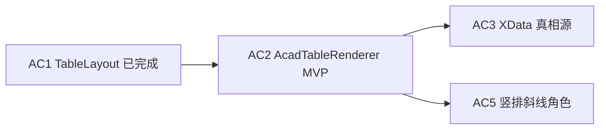
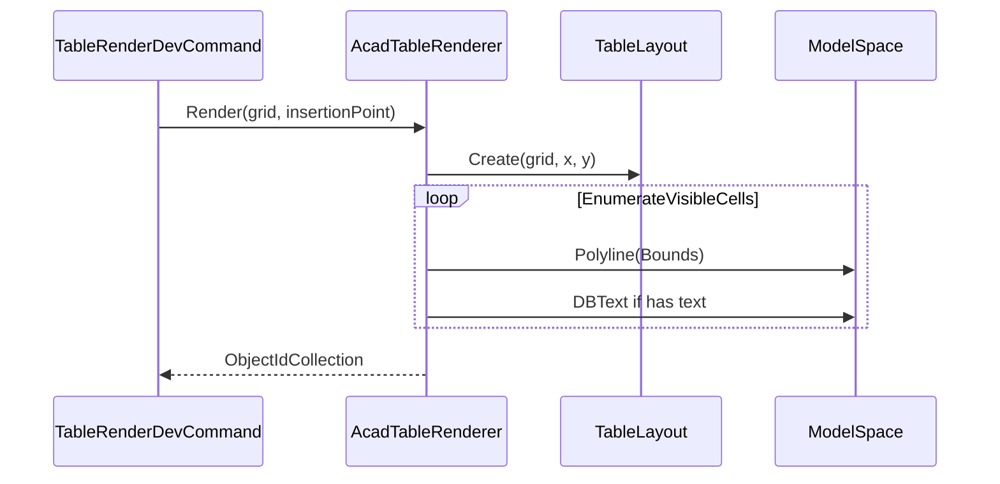

# AC2 · 定稿渲染 MVP（网格 + 合并 + 文字）详解（008b）

> 文档编号：008b（008 的子文档，专述 **AC2**）  
> 生成日期：2026-06-25  
> 上游总计划：[008 AutoCAD 表格制作分阶段实施计划](./008-AutoCAD表格制作分阶段实施计划-2026-06-25-143000.md)  
> 前置步骤：[008a AC1 TableLayout](./008a-AC1-主工程引用与TableLayout详解-2026-06-25-150000.md)（**已完成**）  
> 设计规格：[005 §6.3 线+文字定稿](./005-复杂表格Domain统一设计-2026-06-24-232335.md)  
> 性质：**AC2 执行规格**——足够细到可单独开 Plan 编码；不写方法体，但给出渲染管线、API 形状、Domain↔CAD 映射表、联调与验收清单。  
> 用法：实现 AC2 时以本文 + 008 §AC2 为唯一真相；**几何只读 `TableLayout`**，AC2 全绿后再开 AC3。

---

## 0. AC2 在一整条链里的位置



**AC1 已交付**：[`TableLayout`](../../../src/HyCAD.Tables/Layout/TableLayout.cs) + 主工程引用 + 139 项 Domain 单测全绿。

**AC2 核心原则（架构收口）**：

```text
TableGrid + 基点
    → TableLayout.Create（唯一几何真相，AC1）
    → AcadTableRenderer（只把 LayoutRect → Polyline/DBText）
    → 模型空间实体
```

- **禁止**在 Renderer 内重算 `GetColumnLeft` / `RowSpan` / `IsHidden`——一律来自 `TableLayout` / `VisibleCellLayout`。  
- **禁止**使用 `Autodesk.AutoCAD.DatabaseServices.Table`（原生 AcDbTable）；复杂表走线+文字（005 §6.3 / D5）。  
- HtmlTableAdapter 仍独立迭代 HTML；长期应收口到 `TableLayout.EnumerateVisibleCells()`（**AC1.5 可选**，非 AC2 阻塞）。

---

## 1. 目标与完成定义（DoD）

### 1.1 一句话目标

**给定 `TableGrid` + 插入基点 (mm)，在模型空间画出可见单元格闭合线框 + 单元格文字（水平、对齐），合并格为一大框；不挂 XData。**

### 1.2 AC2 Definition of Done（全部勾选才算完成）

- [ ] 新增 `src/HyCADTool/Features/Tables/Infrastructure/AutoCad/AcadTableRenderer.cs`
- [ ] 新增 `AcadTableRenderOptions.cs`
- [ ] Renderer **仅**通过 `TableLayout.Create` + `EnumerateVisibleCells()` 获取几何
- [ ] `dotnet build src\HyCADTool\HyCADTool.csproj -c Debug` **0 error**
- [ ] 最简联调：`TestCommand.Run()` 调用渲染（插入 `BuildPersonnelTable()` 或 3×3 空表），用户 **C2→C1** 目视网格与文字合理
- [ ] 3×3 均匀表 + 含 2×2 / colspan 子表落图正确（合并无重复 hidden 框）
- [ ] **不**写 XData / 扩展字典（AC3）
- [ ] **不**实现竖排 / 斜线 / 角色加粗 / 边框线宽差 / PhotoSlot（AC5–AC8）
- [ ] `HyCAD.Tables` 仍零 `Autodesk.*`（`PlatformIndependenceTests` 通过）

---

## 2. 范围边界

### 2.1 IN（AC2 必须做）

| # | 工作包 | 交付 |
|---|---|---|
| W1 | 目录与选项类 | `Features/Tables/Infrastructure/AutoCad/` |
| W2 | 表级事务落图 | `LockDocument` + `Transaction` + `ModelSpace` |
| W3 | 图层 | `LayerManager.EnsureLayer` 网格层 + 文字层 |
| W4 | 单元格边框 | 每可见格 `LayoutRect` → 闭合 `Polyline`（4 顶点，Z=0） |
| W5 | 单元格文字 | `DBText` + Domain 对齐 → `HorizontalMode/VerticalMode` + `AdjustAlignment` |
| W6 | 显示文本 | `GridEditor.GetValue` → `CellValue.Text` / `Runs` 拼接（同 Html `GetDisplayText`） |
| W7 | 样式解析 | `CellStyle`：字高、HAlign/VAlign；缺省用 Options |
| W8 | 最简 C1 联调桩 | `TestCommand` 或临时 Command 类调用 Renderer（无 `[CommandMethod]`） |

### 2.2 OUT（AC2 明确不做）

| 内容 | 留给 |
|---|---|
| XData / `HyTableXdata` / JSON 真相源 | AC3 |
| `commands.json` N33/N34 正式注册 | AC4 |
| `VerticalStacked` 竖排 | AC5（AC2 遇则**水平显示全文**或居中单行，不报错） |
| `DiagonalSplit` 斜线 + 子格文字 | AC5（AC2 **不画斜线**） |
| `CellRole` 字高/加粗差异 | AC5 |
| `BorderSet` 外粗内细 | AC6 |
| `PhotoSlot` 占位框 | AC8 |
| 用户点选插入点 Jig | AC4 可选；AC2 默认 `(0,0)` 或 Options 传入 |
| 原地更新 / Explode / 识别 | AC9–AC10 |

---

## 3. 建议目录与命名空间

```text
src/HyCADTool/Features/Tables/
  Infrastructure/AutoCad/
    AcadTableRenderOptions.cs
    AcadTableRenderer.cs
    AcadTableTextMapper.cs          ← 可选：TextAlign → DBText 模式（纯映射，便于单测）
  Commands/                         ← AC4 再填；AC2 仅 TestCommand 联调
    TableRenderDevCommand.cs        ← 可选：sealed + Execute()，供 C1 调用
```

- **命名空间**：`HyCADTool.Features.Tables.Infrastructure.AutoCad`  
- **异常类型**：业务层用 `System.Exception`（项目 06 规则）

---

## 4. 工作包 W1–W2：`AcadTableRenderOptions`

### 4.1 建议属性

| 属性 | 类型 | 默认 | 说明 |
|---|---|---|---|
| `GridLayerName` | `string` | `"HyTable-Grid"` | 单元格边框 `Polyline` |
| `TextLayerName` | `string` | `"HyTable-Text"` | `DBText` |
| `GridLayerColor` | `short` | `7`（白/黑随背景） | ACI |
| `TextLayerColor` | `short` | `7` | ACI |
| `DefaultTextHeightMm` | `double` | `3.5` | 与 [`CellStyle.TextHeight`](../../../src/HyCAD.Tables/Structure/CellStyle.cs) 默认一致 |
| `TextPaddingMm` | `double` | `1.0` | 文字距单元格内缘 |
| `DrawEmptyCellText` | `bool` | `false` | 空值是否仍建 `DBText` |
| `ZElevation` | `double` | `0` | 模型空间 Z |

静态：`AcadTableRenderOptions.Default { get; }`

### 4.2 渲染入口签名

```csharp
public sealed class AcadTableRenderer
{
    public AcadTableRenderer(Database db, AcadTableRenderOptions? options = null);

    /// <summary>
    /// 渲染表格到模型空间；返回本次创建的实体 ObjectId 集合（不含编组）。
    /// </summary>
    public ObjectIdCollection Render(TableGrid grid, Point3d insertionPoint);
}
```

**内部第一步（强制）**：

```csharp
var layout = TableLayout.Create(grid, insertionPoint.X, insertionPoint.Y);
```

不得跳过 `TableLayout` 直接读 `grid.Structure.Topology` 算偏移（读 track **仅**允许用于字高等非几何用途，且优先走 `CellStyle`）。

---

## 5. 工作包 W3–W4：事务、图层、边框

### 5.1 落图标准模式（参照现有命令）

参照 [`DrawSurfaceLayerLinesCommand`](../../../src/HyCADTool/Features/SpongeCity/Commands/DrawSurfaceLayerLinesCommand.cs)：

```text
doc.LockDocument()
  → tr = db.TransactionManager.StartTransaction()
  → bt / ModelSpace (OpenMode.ForWrite)
  → LayerManager.EnsureLayer(tr, layerName, colorIndex) × 2
  → foreach (visible in layout.EnumerateVisibleCells()) { ... }
  → tr.Commit()
```

[`LayerManager`](../../../src/HyCADTool/Shared/AutoCAD/Services/LayerManager.cs)：`EnsureLayer(Transaction tr, string name, short colorIndex)`。

### 5.2 单元格边框：`LayoutRect` → `Polyline`

对每个 `VisibleCellLayout visible`：

| LayoutRect（Down） | Polyline 顶点（逆时针，Z=0） |
|---|---|
| `(Left, Top)` | 顶点 0 |
| `(Right, Top)` | 顶点 1 |
| `(Right, Bottom)` | 顶点 2 |
| `(Left, Bottom)` | 顶点 3 |
| `Closed = true` | |

- **合并格**：仅 anchor 出现在枚举中，**一个大矩形**（AC1 已保证 hidden 跳过）。  
- **内线重复**：相邻格各自画框会导致共享边画两次——**MVP 可接受**（008 §AC2）；AC6 可改为 `ColumnBoundariesX` / `RowBoundariesY` 单次画网格线。

**可选（AC3 预留）**：最外层 `layout.TableBounds` 同法画一条闭合 `Polyline` 作「表Carrier」——AC2 **可不单独画**（与单元格外缘重合）；AC3 再指定哪条为 XData 载体。

---

## 6. 工作包 W5–W7：文字与样式

### 6.1 显示文本（与 Html 一致）

逻辑对齐 [`HtmlTableAdapter.GetDisplayText`](../../../src/HyCAD.Tables/Adapters/HtmlTableAdapter.cs)：

1. `var value = GridEditor.GetValue(grid, visible.Addr);`  
2. 若 `value.Runs` 非空 → 拼接 `run.Text`  
3. 否则 `value.Text ?? ""`  
4. 空串且 `!DrawEmptyCellText` → 跳过 `DBText`

公式格：`FormulaService.Recalculate` 后结果已在 `Text`（Domain P9）；Renderer **不**求值。

### 6.2 样式解析

```text
ResolveStyle(structure, addr, options):
  if structure.Styles.TryGetValue(addr, out style) → 用 style
  else → new CellStyle(TextHeight: options.DefaultTextHeightMm)
```

**AC2 使用的 CellStyle 字段**：

| Domain | AC2 用途 |
|---|---|
| `TextHeight` | `DBText.Height` |
| `HAlign` / `VAlign` | 对齐模式（见 §6.3） |
| `Orientation` | 仅 `Horizontal` 正常画；`VerticalStacked` → AC2 **单行水平**占位（AC5 再竖排） |
| `Borders` / `BackColor` / `FontKey` | AC2 **忽略** |

**AC2 不读 `CellRole`**（Title/Header 字高加大留 AC5）。

### 6.3 Domain 对齐 → DBText（关键）

在 `LayoutRect` 内算 **对齐点** `Point3d`（含 `TextPaddingMm`）：

| HAlign | X 坐标 |
|---|---|
| Start | `Left + padding` |
| Center | `(Left + Right) / 2` |
| End | `Right - padding` |

| VAlign | Y 坐标（Down：Top > Bottom） |
|---|---|
| Start | `Top - padding`（视觉偏上） |
| Center | `(Top + Bottom) / 2` |
| End | `Bottom + padding`（视觉偏下） |

**DBText 模式映射**（须设 `AlignmentPoint` 并调用 `AdjustAlignment(db)`）：

| HAlign | VAlign | HorizontalMode | VerticalMode |
|---|---|---|---|
| Start | Start | TextLeft | TextTop |
| Center | Center | TextCenter | TextVerticalMid |
| End | End | TextRight | TextBottom |
| … | … | 其余 9 组合按名对应 | |

参照 [`RoadStandardSectionDrawService`](../../../src/HyCADTool/Features/Road/CrossSection/Services/RoadStandardSectionDrawService.cs) L1006–1026 与 [`DrawSurfaceLayerLinesCommand`](../../../src/HyCADTool/Features/SpongeCity/Commands/DrawSurfaceLayerLinesCommand.cs) L77–87。

**WidthFactor**：AC2 默认 1.0；若需与面板一致可后续读 `SettingsPanelViewModel.Current.TextXScale`（**非 AC2 必须**）。

---

## 7. 工作包 W8：C1 联调桩

AC2 验收需要 AutoCAD 目视，但 **正式命令注册在 AC4**。AC2 建议：

| 方式 | 说明 |
|---|---|
| **推荐** | 新增 `TableRenderDevCommand.Execute()`：调用 `BuildPersonnelTable()` + `Renderer.Render(new Point3d(0,0,0))` |
| 修改 | [`TestCommand.Run()`](../../../src/HyCADTool/App/Test/TestCommand.cs) 一行指向上述 Execute |
| 不做 | `commands.json` / `[CommandMethod]` / XData |

用户流程：`dotnet build` → **C2** → **C1** → 模型空间出现人员表线框+文字。

---

## 8. 渲染管线（逐步）



| 步骤 | 动作 |
|---|---|
| 1 | 构造 `TableLayout` |
| 2 | `EnsureLayer` 网格 + 文字 |
| 3 | `foreach (var cell in layout.EnumerateVisibleCells())` |
| 4 | `AppendPolyline(cell.Bounds)` |
| 5 | 解析样式 + 取显示文本 |
| 6 | 若需文字 → 算对齐点 → `DBText` + `AdjustAlignment` |
| 7 | `Commit` |

---

## 9. 与 AC1 / Html / 后续步骤的接口

| 消费方 | 使用的 TableLayout API |
|---|---|
| AC2 边框 | `EnumerateVisibleCells()` → `Bounds` |
| AC2 文字位置 | 同上 `Bounds` + `CellStyle` |
| AC3 载体 | `TableBounds`（闭合 Polyline + XData） |
| AC5 竖排 | `Bounds` 内逐字 Y 递减 或 `MText` |
| AC5 斜线 | `Bounds` 对角 `Line` + `SubCell` 归一化坐标 × 宽高 |
| AC6 网格线 | `ColumnBoundariesX` / `RowBoundariesY` 替代逐格 Polyline |

---

## 10. 测试与验收策略

### 10.1 自动化（有限）

AutoCAD 实体难在 `HyCAD.Tables.Tests` 测；AC2 **不以** Domain 单测为主。

| 可测 | 不可测（CAD 目视） |
|---|---|
| 可选 `AcadTableTextMapper` 纯函数：给定 `LayoutRect`+`TextAlign` → 对齐点坐标 | Polyline 是否闭合 |
| 主工程编译 0 error | 合并表是否一大框 |
| | 文字是否在格内 |

### 10.2 手动验收清单（C2→C1）

| # | 场景 | 预期 |
|---|---|---|
| V1 | `TableGrid.CreateEmpty(3,3)` @ 原点 | 9 个等距方格，无文字 |
| V2 | 2×2 合并 @ (0,0) | 仅 1 个大框 + 3 个小框，共 4 个 Polyline 边框 |
| V3 | `BuildPersonnelTable()` | 标题横跨 7 列一大格；姓名/性别等 label-value 可读 |
| V4 | 含 FieldKey「name」格 | 显示「张三」 |
| V5 | 照片格 `PhotoSlot` | AC2 仅空框或格线，**无**图片（符合 OUT） |
| V6 | 侧栏竖排格 | AC2 水平显示整句或单行（退化），不崩溃 |

### 10.3 对照 Html（可选）

同一 `TableGrid` 导出 [`HtmlTableAdapter`](../../../src/HyCAD.Tables/Adapters/HtmlTableAdapter.cs) .html 与 CAD 并排：合并区域数量、可见格数应一致（几何视觉近似，不要求像素级）。

---

## 11. 风险与对策

| 风险 | 对策 |
|---|---|
| Renderer 内重复算几何 | Code review 禁止直接累加 `GridTrack`；只读 `TableLayout` |
| 文字偏移 / 倒置 | 必须 `AlignmentPoint` + `AdjustAlignment(db)` |
| hidden 格多画框 | 只遍历 `EnumerateVisibleCells()` |
| 竖排/斜线范围蔓延 | AC2 显式退化；AC5 再实现 |
| VerticalStacked 用户误解 | 目视 V6 已知限制；文档写清 |
| 图层不存在/0 层 | `LayerManager.EnsureLayer` 在写实体前 |
| 编译未跑就 C2 | AI build 后提示用户 C2→C1 |

---

## 12. 实施顺序（单次 Plan 建议）

```text
1. 建 Features/Tables/Infrastructure/AutoCad/ 目录
2. AcadTableRenderOptions.cs
3. AcadTableRenderer：TableLayout + Polyline 边框
4. 补 DBText + 样式/对齐 + GetDisplayText
5. TableRenderDevCommand + TestCommand 一行
6. dotnet build HyCADTool 0 error
7. 用户 C2→C1 跑 V1–V6
8. 勾选 §1.2 DoD
```

预计 **1–2 次编码会话**（M 规模）；对齐与合并目视占主要调试时间。

---

## 13. AC2 完成后交付清单

| 路径 | 说明 |
|---|---|
| `Features/Tables/Infrastructure/AutoCad/AcadTableRenderOptions.cs` | 选项 |
| `Features/Tables/Infrastructure/AutoCad/AcadTableRenderer.cs` | 渲染器 |
| `Features/Tables/Commands/TableRenderDevCommand.cs` | 可选，C1 联调 |
| `App/Test/TestCommand.cs` | 改一行指向 Dev 命令 |

**不交付**：`HyTableXdata`、`AcadTableStore`、`commands.json` 条目（AC3–AC4）。

---

## 14. 变更记录

| 日期 | 说明 |
|---|---|
| 2026-06-25 | 008b 初版：AC2 渲染管线、Options/Renderer API、Domain↔DBText 映射、DoD、V1–V6 目视清单；强调只消费 TableLayout |

---

> **下一步**：开 Plan 编码 AC2；DoD 全绿后进入 [008 AC3](./008-AutoCAD表格制作分阶段实施计划-2026-06-25-143000.md#ac3--xdata-真相源--读回-round-trip)（XData + 读回 round-trip）。
