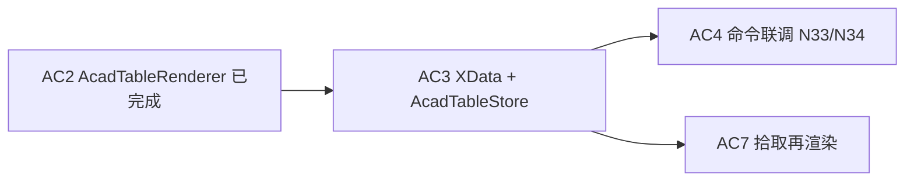

# AC3 · XData 真相源 + 读回 round-trip 详解（008c）

> 文档编号：008c（008 的子文档，专述 **AC3**）  
> 生成日期：2026-06-25  
> 上游总计划：[008 AutoCAD 表格制作分阶段实施计划](./008-AutoCAD表格制作分阶段实施计划-2026-06-25-143000.md)  
> 前置步骤：[008b AC2 定稿渲染 MVP](./008b-AC2-定稿渲染MVP详解-2026-06-25-160000.md)（**已完成**：`AcadTableRenderer` + C1 联调桩）  
> 设计规格：[005 §5 序列化与真相源](./005-复杂表格Domain统一设计-2026-06-24-232335.md)  
> 性质：**AC3 执行规格**——足够细到可单独开 Plan 编码；不写方法体，但给出存储分层、API 形状、Renderer 集成点、round-trip 断言矩阵与验收清单。  
> 用法：实现 AC3 时以本文 + 008 §AC3 为唯一真相；**JSON 序列化复用 P7 `TableJson`**，AC3 全绿后再开 AC4。

---

## 0. AC3 在一整条链里的位置



**AC2 已交付**：[`AcadTableRenderer`](../../../src/HyCADTool/Features/Tables/Infrastructure/AutoCad/AcadTableRenderer.cs) 消费 `TableLayout`，输出单元格 `Polyline` + `DBText`；[`TableRenderDevCommand`](../../../src/HyCADTool/Features/Tables/Commands/TableRenderDevCommand.cs) 供 C2→C1 目视。

**AC3 核心原则（存储收口）**：

```text
TableGrid（内存真相）
    → TableJson.SerializeGrid（P7，HyCAD.Tables）
    → ExtensionDictionary HyTable_JSON（大 payload，分片）
    → 载体 Polyline XData HY_TABLE（小标识：Id / Kind / Schema）
    → TryReadTableGrid → TableJson.DeserializeGrid（自动镜像 + 公式重算）
    → GridInvariants.Validate
```

- **禁止**在 XData 里塞完整 JSON（16KB 硬限制；样表 JSON 通常数 KB，但仍走扩展字典，与 `DesignSpecService` 一致）。  
- **禁止**在 `HyCAD.Tables` 内引用 `Autodesk.*`——XData/扩展字典读写只在 `HyCADTool/Features/Tables/Infrastructure/AutoCad/`。  
- **禁止** AC3 实现 OpLog 磁盘持久化、跨实体引用、线框识别（AC9+）。

---

## 1. 目标与完成定义（DoD）

### 1.1 一句话目标

**渲染时在表格外框载体 `Polyline` 上写入 HY_TABLE 元数据 + 扩展字典 JSON；选中该载体可 `TryReadTableGrid` 还原 `TableGrid`，且 `GridInvariants` 通过与源表 FieldKey/合并/公式值一致。**

### 1.2 AC3 Definition of Done（全部勾选才算完成）

- [ ] 新增 `HyTableXdata.cs`：`RegAppName = "HY_TABLE"`；读写 `ID` / `KIND` / `SCHEMA`（仿 [`HyRoadXdata`](../../../src/HyCADTool/Shared/AutoCAD/Xdata/HyRoadXdata.cs)）
- [ ] 新增 `AcadTableStore.cs`：`Write` / `TryReadTableGrid` / `IsTableCarrier`
- [ ] 扩展 `AcadTableRenderer`：渲染末追加 **载体** `Polyline`（`layout.TableBounds`）并调用 `AcadTableStore.Write`
- [ ] `AcadTableRenderOptions` 增加载体图层名（或复用网格层并文档说明拾取策略）
- [ ] `dotnet build src\HyCADTool\HyCADTool.csproj -c Debug` **0 error**
- [ ] C2→C1 渲染后，**点选载体**（非单元格内线框），`TryReadTableGrid` 成功；`GridInvariants.Validate(restored).IsValid == true`
- [ ] 读回表与 [`TableSamples.BuildPersonnelTable()`](../../../src/HyCAD.Tables/Samples/TableSamples.cs)：`FieldIndex["name"]` 对应格文本仍为「张三」；合并区数量一致
- [ ] **COPY** 载体后，副本上 `TryReadTableGrid` 仍成功（DWG 内迁移）
- [ ] **不**注册 `commands.json` N33/N34（AC4）；**不**实现竖排/斜线/边框线宽（AC5–AC6）
- [ ] `HyCAD.Tables` 仍零 `Autodesk.*`（`PlatformIndependenceTests` 通过）

---

## 2. 范围边界

### 2.1 IN（AC3 必须做）

| # | 工作包 | 交付 |
|---|---|---|
| W1 | XData 薄标识 | `HyTableXdata`：RegApp + Id/Kind/Schema |
| W2 | JSON 扩展字典 | `AcadTableStore` + `ExtensionDictionaryService.WriteLongString` |
| W3 | 载体 Polyline | `TableLayout.TableBounds` → 闭合 `Polyline` + 写存储 |
| W4 | 读回 API | `TryReadTableGrid(Transaction, Entity, out TableGrid)` |
| W5 | Renderer 集成 | 渲染管线末段写载体；返回 `CarrierObjectId` |
| W6 | 开发读回桩 | 扩展 Dev 命令或新增 `TableReadBackDevCommand`（无 `[CommandMethod]`） |
| W7 | 插入点元数据（推荐） | 写入 `TableGrid.Metadata` 的 `cad.originX` / `cad.originY`（供 AC7 再渲染） |

### 2.2 OUT（AC3 明确不做）

| 内容 | 留给 |
|---|---|
| `InsertSampleTableCommand` / `ReadTableBackCommand` 正式命令 | AC4 |
| `commands.json` N33/N34 | AC4 |
| 所有单元格 Polyline 都挂 XData | 否——**仅载体** |
| JSON 压缩 / hash + 外置 templateId | V2（样表体积监控即可） |
| OpLog `.ops.json` 持久化 | V2 |
| 编辑模式 Explode 后 XData 保留 | AC10 |
| 从任意 Line/DBText 反推 Domain | AC9 |
| `TableDocument` 多表打包（MVP 只存单张 `TableGrid`） | AC4 可选；AC3 默认 `SerializeGrid` |

---

## 3. 建议目录与命名空间

```text
src/HyCADTool/Features/Tables/
  Infrastructure/AutoCad/
    HyTableXdata.cs              ← W1
    AcadTableStore.cs            ← W2/W4
    AcadTableRenderer.cs         ← W5 修改
    AcadTableRenderOptions.cs    ← 载体图层
    AcadTableRenderResult.cs     ← 可选：CarrierId + EntityIds
  Commands/
    TableRenderDevCommand.cs     ← W6 写+读联调
    TableReadBackDevCommand.cs   ← W6 可选拆分
```

- **命名空间**：`HyCADTool.Features.Tables.Infrastructure.AutoCad`  
- **JSON 序列化**：`HyCAD.Tables.Serialization.TableJson`（**不**引入 Newtonsoft；扩展字典存 `System.Text.Json` 产出字符串）  
- **参照模板**：XData → [`HyRoadXdata`](../../../src/HyCADTool/Shared/AutoCAD/Xdata/HyRoadXdata.cs)；长字符串 → [`ExtensionDictionaryService.WriteLongString`](../../../src/HyCADTool/Shared/AutoCAD/Xdata/ExtensionDictionaryService.cs) + [`DesignSpecService`](../../../src/HyCADTool/Features/DesignSpec/Services/DesignSpecService.cs) 模式

---

## 4. 存储分层设计（关键决策）

### 4.1 两层存储

| 层 | 机制 | 键 / RegApp | 内容 | 大小 |
|---|---|---|---|---|
| **标识层** | `Entity.XData` | RegApp `HY_TABLE` | `ID`（表 Guid）、`KIND`（`TableGrid`）、`SCHEMA`（`"1"`） | ~80 字节 |
| **payload 层** | `ExtensionDictionary` → `Xrecord` | `HyTable_JSON` | `TableJson.SerializeGrid(grid)` 全文 | 分片 2000 字符/段 |

**为何不用 XData 存 JSON**：AutoCAD XData 单应用段 **16KB** 上限；P7 稀疏 JSON 虽通常 &lt; 10KB，但复杂表 + Indented 调试会膨胀；扩展字典 `WriteLongString` 已在 Markdown/DesignSpec 验证可分片。

**为何需要 XData 标识层**：快速过滤「是不是 HyTable 载体」、DXF 导出保留 RegApp、与道路模块 `HY_ROAD` 扫描模式一致；**不必**打开扩展字典即可读 Id/Kind。

### 4.2 常量表（`HyTableXdata`）

| 常量 | 值 | 说明 |
|---|---|---|
| `RegAppName` | `"HY_TABLE"` | 与 `HY_ROAD` / `HY_COMPONENT` 并列 |
| `KeyId` | `"ID"` | `TableGrid.Id`（`Guid` `"D"` 格式） |
| `KeyKind` | `"KIND"` | 固定 `"TableGrid"`（MVP 仅一种） |
| `KeySchema` | `"SCHEMA"` | 固定 `"1"`（首版；DTO 变更时递增） |
| `KindTableGrid` | `"TableGrid"` | KIND 写入值 |

扩展字典（`AcadTableStore`）：

| 常量 | 值 |
|---|---|
| `ExtDictKeyJson` | `"HyTable_JSON"` |

Metadata（可选，写入 `TableGrid` 再序列化）：

| Key | 示例 | 用途 |
|---|---|---|
| `cad.originX` | `"0"` | AC7 再渲染插入点 X（mm） |
| `cad.originY` | `"0"` | AC7 再渲染插入点 Y（mm） |
| `cad.schemaWrittenAt` | `"2026-06-25"` | 调试；非必须 |

### 4.3 载体实体选择

**载体 = 一张表唯一的外框 `Polyline`**，几何来自 `TableLayout.TableBounds`（AC1 已提供）。

| 规则 | 说明 |
|---|---|
| 几何 | 与 008b §5.2 相同四角顶点，`Closed = true` |
| 图层 | 建议 **`HyTable-Carrier`**（`AcadTableRenderOptions.CarrierLayerName`），与单元格 `HyTable-Grid` 区分，**便于拾取** |
| XData | **仅载体**写入；单元格边框/文字 **无** HY_TABLE |
| 视觉 | 外缘与最外圈单元格边框重合 → **双线叠加可接受**（MVP）；AC6 改网格线策略后可消重 |
| Id 一致性 | XData `ID` == JSON 内 `TableGrid.Id`；写入时若 `grid.Id == Empty` 则 `Guid.NewGuid()` 并回写 grid |

```text
  ┌─ Carrier Polyline (HY_TABLE + HyTable_JSON) ─┐
  │  ┌────┬────┬────┐                              │
  │  │cell│cell│cell│  ← 单元格 Polyline 无 XData   │
  │  └────┴────┴────┘                              │
  └────────────────────────────────────────────────┘
```

---

## 5. 工作包 W1：`HyTableXdata`

### 5.1 建议 API（形状，非实现）

```csharp
namespace HyCADTool.Features.Tables.Infrastructure.AutoCad;

public static class HyTableXdata
{
    public const string RegAppName = "HY_TABLE";
    public const string KeyId = "ID";
    public const string KeyKind = "KIND";
    public const string KeySchema = "SCHEMA";
    public const string KindTableGrid = "TableGrid";
    public const string SchemaVersion = "1";

    public static void EnsureRegApp(Transaction tr, Database db);

    public static void Write(Transaction tr, Database db, DBObject obj,
        Guid tableId, string kind = KindTableGrid, string schemaVersion = SchemaVersion);

    public static Guid ReadId(DBObject obj);
    public static string ReadKind(DBObject obj);
    public static string ReadSchema(DBObject obj);

    /// <summary>RegApp 为 HY_TABLE 且 KIND 为 TableGrid。</summary>
    public static bool IsTableCarrier(DBObject obj);
}
```

### 5.2 行为约定

- 仿 `HyRoadXdata.Write`：**重写**整段 HY_TABLE XData，不保留未知 Key。  
- `EnsureRegApp` 在首次 `Write` 前调用（幂等）。  
- `ReadId`：无 XData 或解析失败 → `Guid.Empty`。  
- `IsTableCarrier`：`ReadKind()` 等于 `KindTableGrid`（大小写 Ordinal）。  
- 所有方法在**调用方 Transaction 内**执行，不自主开事务。

---

## 6. 工作包 W2/W4：`AcadTableStore`

### 6.1 建议 API

```csharp
public static class AcadTableStore
{
    public const string ExtDictKeyJson = "HyTable_JSON";

    /// <summary>写入 XData + 扩展字典 JSON；可选写入 cad.origin* 到 Metadata。</summary>
    public static void Write(
        Transaction tr,
        Database db,
        Entity carrier,
        TableGrid grid,
        Point3d? insertionOrigin = null);

    /// <summary>从载体读回 TableGrid；失败返回 false。</summary>
    public static bool TryReadTableGrid(
        Transaction tr,
        Entity entity,
        out TableGrid grid);

    /// <summary>是否 HyTable 载体（XData 快速判定）。</summary>
    public static bool IsTableCarrier(Entity entity);
}
```

### 6.2 Write 流程（逐步）

| 步 | 动作 |
|---|---|
| 1 | 校验 `carrier` 非 null；`UpgradeOpen` |
| 2 | 若 `grid.Id == Guid.Empty` → 赋新 Guid（`grid with { Id = ... }`） |
| 3 | 若 `insertionOrigin` 有值 → 合并 Metadata `cad.originX/Y`（mm，不变换 Scale） |
| 4 | `json = TableJson.SerializeGrid(grid)`（**紧凑**，`indented: false`） |
| 5 | `ExtensionDictionaryService.WriteLongString(tr, carrier, json, ExtDictKeyJson)` |
| 6 | `HyTableXdata.Write(tr, db, carrier, grid.Id, KindTableGrid, SchemaVersion)` |

### 6.3 TryReadTableGrid 流程

| 步 | 动作 |
|---|---|
| 1 | `IsTableCarrier(entity)` → false 则 `grid = null` |
| 2 | `json = ExtensionDictionaryService.ReadLongString(tr, entity, ExtDictKeyJson)` |
| 3 | `json` 空 → false |
| 4 | `grid = TableJson.DeserializeGrid(json)`（内部已 `RebuildMirrors` + `FormulaService.Recalculate`） |
| 5 | 可选：比对 `HyTableXdata.ReadId(entity)` 与 `grid.Id`——不一致时 **仍返回 grid** 但 Dev 命令可 Warn（XData 可能被手工改坏） |
| 6 | true |

**异常策略**：`DeserializeGrid` 抛 `JsonException` → catch 后 false，**不**向命令行抛栈（AC4 再格式化用户消息）。

### 6.4 与 P7 单测的关系

[`TableJsonTests`](../../../src/HyCAD.Tables.Tests/TableJsonTests.cs) 已覆盖 JSON round-trip + `GridInvariants`。AC3 **不重复**测 JSON，只测 **CAD 存储胶水**（若测，见 §10.1）。

---

## 7. 工作包 W5：扩展 `AcadTableRenderer`

### 7.1 `AcadTableRenderOptions` 增补

| 属性 | 默认 | 说明 |
|---|---|---|
| `CarrierLayerName` | `"HyTable-Carrier"` | 载体 Polyline |
| `CarrierLayerColor` | `3`（绿） | 与网格层区分，便于目视拾取 |
| `WriteTruthSource` | `true` | AC3 默认开；AC2 回归测试可关 |

### 7.2 渲染管线变更

在现有 `foreach (EnumerateVisibleCells)` **之后**、`Commit` **之前**：

```text
1. bounds = layout.TableBounds
2. carrier = CreateCellBorder(bounds)   // 复用四角 Polyline 工厂
3. carrier.Layer = options.CarrierLayerName
4. ms.AppendEntity(carrier); ids.Add(carrier.ObjectId)
5. if (options.WriteTruthSource)
       AcadTableStore.Write(tr, db, carrier, grid, insertionPoint)
6. tr.Commit()
```

### 7.3 返回值（推荐）

AC2 返回 `ObjectIdCollection`；AC3 建议改为 **`AcadTableRenderResult`**（或保留集合并增属性）：

```csharp
public sealed class AcadTableRenderResult
{
    public ObjectId CarrierId { get; init; }
    public ObjectIdCollection EntityIds { get; init; }
}
```

Dev 命令打印 `CarrierId` 便于 LIST 验证。

### 7.4 AC2 行为兼容

| 项 | AC2 | AC3 |
|---|---|---|
| 单元格线框 | ✅ | ✅ 不变 |
| 文字 | ✅ | ✅ 不变 |
| 载体框 | ❌ | ✅ 追加 |
| XData | ❌ | ✅ 仅载体 |

---

## 8. 工作包 W6：开发读回桩（非 AC4 正式命令）

AC3 验收需 AutoCAD 内读回，但 **N34 注册在 AC4**。

| 方式 | 说明 |
|---|---|
| **推荐 A** | `TableReadBackDevCommand.Execute()`：`GetEntity` 提示选实体 → `TryReadTableGrid` → 命令行输出行列数、`GridInvariants`、FieldKey `name` 值 |
| **推荐 B** | `TableRenderDevCommand` 渲染后立即对 `CarrierId` 读回自检（同事务外再开读事务） |
| TestCommand | 改 [`TestCommand.Run()`](../../../src/HyCADTool/App/Test/TestCommand.cs) 指向读回或「渲染+读回」 |
| 不做 | `commands.json` / `[CommandMethod]` |

**读回输出示例（命令行）**：

```text
[HyTable] 读回成功：7×7，Merges=4，FieldKeys=12，Invariant=OK，name=张三
```

---

## 9. Round-trip 等价断言矩阵

读回 `restored` 与源 `original`（`TableSamples.BuildPersonnelTable()`）应满足：

| # | 断言 | 说明 |
|---|---|---|
| R1 | `GridInvariants.Validate(restored).IsValid` | 必须 |
| R2 | `restored.Structure.Topology.RowCount/ColCount` | 与源相同 |
| R3 | `restored.Structure.Merges` 数量与 anchor 集合 | `BeEquivalentTo` 或逐条比对 TopLeft+Span |
| R4 | `restored.Structure.FieldIndex` | 含 `name` 等同键 |
| R5 | `GridEditor.GetValueByField(restored, "name").Text` | 「张三」 |
| R6 | 公式格（若有）| `Recalculate` 后文本一致 |
| R7 | `restored.Id` | 与写入前 `original.Id` 一致（或写入时分配的新 Id 一致） |
| R8 | COPY 载体后 R1–R7 | DWG 内迁移 |

**深度等价**（可选 Dev 断言）：`restored.Should().BeEquivalentTo(original, ...)` 同 [`TableJsonTests`](../../../src/HyCAD.Tables.Tests/TableJsonTests.cs)——注意 Deserialize 会重算公式，源表也需先 `FormulaService.Recalculate`。

---

## 10. 测试与验收策略

### 10.1 自动化（有限）

| 可测 | 位置 | 说明 |
|---|---|---|
| JSON 层 | 已有 `TableJsonTests` | AC3 不重复 |
| `IsTableCarrier` | 可选 `HyCADTool.Tests` | 需 Mock `DBObject.XData`——**非必须** |
| 主工程编译 | `dotnet build` | 必须 0 error |

AutoCAD 实体 + 扩展字典 **无** 轻量单测 harness；AC3 以 **C2→C1 手动** 为主。

### 10.2 手动验收清单（C2→C1）

| # | 场景 | 操作 | 预期 |
|---|---|---|---|
| V1 | 渲染+写 | C1 `TableRenderDevCommand` | 出现绿色（或 Carrier 层）外框；单元格线框仍在 |
| V2 | LIST 载体 | 点选外框 → LIST | XData `HY_TABLE`；扩展字典含 `HyTable_JSON` |
| V3 | 读回 | Dev 读回命令选载体 | R1–R5 绿灯 |
| V4 | 误选单元格内线 | 选内部小框 | `TryReadTableGrid` false 或提示非载体 |
| V5 | COPY | COPY 载体 → 选副本读回 | R8 绿灯 |
| V6 | 家庭表 | `BuildFamilyTable` 渲染+读回 | 7×6、colspan 合并保留 |

### 10.3 JSON 体积监控（风险预检）

实现时在 Dev 命令临时输出 `json.Length`（或 Debug 日志）：

| 样表 | 预期量级 | 动作 |
|---|---|---|
| `BuildPersonnelTable` | 约 3–15 KB | 正常 |
| `BuildFamilyTable` | 约 2–10 KB | 正常 |
| &gt; 100 KB | 罕见 | 记录；V2 考虑压缩 |

---

## 11. 与现有模块对照

| 模块 | AC3 用法 |
|---|---|
| [`TableJson`](../../../src/HyCAD.Tables/Serialization/TableJson.cs) | 唯一 Serialize/Deserialize 入口 |
| [`GridInvariants`](../../../src/HyCAD.Tables/Operations/GridInvariants.cs) | 读回后校验 |
| [`TableLayout.TableBounds`](../../../src/HyCAD.Tables/Layout/TableLayout.cs) | 载体几何 |
| [`HyRoadXdata`](../../../src/HyCADTool/Shared/AutoCAD/Xdata/HyRoadXdata.cs) | XData 读写模板 |
| [`ExtensionDictionaryService`](../../../src/HyCADTool/Shared/AutoCAD/Xdata/ExtensionDictionaryService.cs) | 分片长字符串 |
| [`TableSamples`](../../../src/HyCAD.Tables/Samples/TableSamples.cs) | 黄金夹具（AC4 同源） |
| `DesignSpecService` | 仅借鉴 WriteLongString 模式，**不**耦合 |

---

## 12. 风险与对策

| 风险 | 对策 |
|---|---|
| JSON 超 XData 16KB 误写入 | **禁止** JSON 进 XData；Code review 只调用 `WriteLongString` |
| 用户选错实体 | 仅载体有 HY_TABLE；读回命令明确提示「请选择表格外框（Carrier 层）」 |
| 外框双线混淆 | Carrier 层用区分色；文档 §4.3 |
| Deserialize 失败 | try/catch → false；Dev 输出 JSON 前 80 字符 |
| `grid.Id` 为空 | Write 时强制分配 |
| XData ID 与 JSON Id 不一致 | Dev Warn；以 JSON 为准 |
| 复制/块参照 | MVP 验证 COPY 即可；BLOCK 嵌套 V2 |
| Renderer 忘记 Write | `WriteTruthSource` 默认 true；V1 必须 LIST 见 HY_TABLE |

---

## 13. 实施顺序（单次 Plan 建议）

```text
1. HyTableXdata.cs（EnsureRegApp / Write / Read / IsTableCarrier）
2. AcadTableStore.cs（Write / TryReadTableGrid）
3. AcadTableRenderOptions 增加 Carrier 层 + WriteTruthSource
4. AcadTableRenderer：TableBounds 载体 + Store.Write + RenderResult
5. TableReadBackDevCommand（或扩展 TableRenderDevCommand）
6. TestCommand 指向「渲染+读回」或读回
7. dotnet build HyCADTool 0 error
8. 用户 C2→C1 跑 V1–V6
9. 勾选 §1.2 DoD
```

预计 **1–2 次编码会话**（M 规模）；LIST/XData 调试与 COPY 验证占主要时间。

---

## 14. AC3 完成后交付清单

| 路径 | 说明 |
|---|---|
| `Features/Tables/Infrastructure/AutoCad/HyTableXdata.cs` | XData 标识 |
| `Features/Tables/Infrastructure/AutoCad/AcadTableStore.cs` | JSON 读写 |
| `Features/Tables/Infrastructure/AutoCad/AcadTableRenderer.cs` | 修改：载体 + Write |
| `Features/Tables/Infrastructure/AutoCad/AcadTableRenderOptions.cs` | Carrier 层 |
| `Features/Tables/Infrastructure/AutoCad/AcadTableRenderResult.cs` | 可选 |
| `Features/Tables/Commands/TableReadBackDevCommand.cs` | 读回 Dev 桩 |
| `App/Test/TestCommand.cs` | 联调入口 |

**不交付**：`InsertSampleTableCommand`、`ReadTableBackCommand`、`commands.json` N33/N34（AC4）。

---

## 15. AC4 消费契约（AC3 验收时心里要有数）

AC4 将直接使用 AC3 产出：

| AC4 需求 | AC3 提供 |
|---|---|
| 插入样表 | `Renderer.Render` + 自动 `Store.Write` |
| N34 读回 | `AcadTableStore.TryReadTableGrid` |
| 命令行摘要 | 行列 / Merges / FieldKeys / Invariant |
| 黄金夹具 | 同 `TableSamples` |

AC3 **不必**实现用户点选插入点 Jig（AC4 可用固定原点或简单 `GetPoint`）。

---

## 16. 变更记录

| 日期 | 说明 |
|---|---|
| 2026-06-25 | 008c 初版：AC3 存储分层、HyTableXdata/AcadTableStore API、载体 Polyline、Renderer 集成点、R1–R8 断言、V1–V6 目视清单；对齐已完成的 AC2 代码 |

---

> **下一步**：按 §13 开 Plan 编码 AC3；DoD 全绿后进入 [008 AC4](./008-AutoCAD表格制作分阶段实施计划-2026-06-25-143000.md#ac4--命令联调插入--读回)（`commands.json` N33/N34 + 正式命令）。
