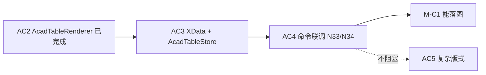
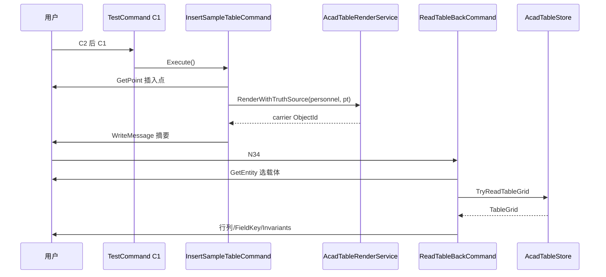

# AC4 · 命令联调（插入 + 读回）详解（008d）

> 文档编号：008d（008 的子文档，专述 **AC4**）  
> 生成日期：2026-06-25  
> 上游总计划：[008 AutoCAD 表格制作分阶段实施计划](./008-AutoCAD表格制作分阶段实施计划-2026-06-25-143000.md)  
> 前置步骤：[008a AC1 TableLayout](./008a-AC1-主工程引用与TableLayout详解-2026-06-25-150000.md)（**已完成**）、[008b AC2 定稿渲染 MVP](./008b-AC2-定稿渲染MVP详解-2026-06-25-160000.md)（**已完成**）、**008 AC3 XData 真相源**（**必须先全绿**）  
> 性质：**AC4 执行规格**——足够细到可单独开 Plan 编码；不写方法体，但给出命令形状、ReCall 注册、AC3 接缝契约、联调流程与 M-C1 验收清单。  
> 用法：实现 AC4 时以本文 + 008 §AC4 为唯一真相；**AC4 全绿 = M-C1 达成**。

---

## 0. AC4 在一整条链里的位置



**当前仓库状态（2026-06-25）**：

| 步骤 | 状态 | 已有交付 |
|---|---|---|
| AC1 | ✅ | `TableLayout` + 主工程引用 |
| AC2 | ✅ | `AcadTableRenderer`、`TableRenderDevCommand`（**无 XData**） |
| AC3 | ⬜ | `HyTableXdata`、`AcadTableStore`、Renderer 挂载体 |
| AC4 | ⬜ | 本文 |

**AC4 核心原则**：

```text
TableSamples（黄金夹具唯一来源）
    → InsertSampleTableCommand：渲染 + 写真相源
    → ReadTableBackCommand：选载体 → TryReadTableGrid → 命令行验收
    → C2→C1 / N34 闭环
```

- **禁止**在命令类内重复构造样表数据——一律 `HyCAD.Tables.Samples.TableSamples`。  
- **禁止** `[CommandMethod]`——走 ReCall `N33`/`N34` + `TestCommand` C1。  
- **禁止**在 AC4 实现竖排/斜线/线宽差（AC5–AC6）；读回应能 round-trip **结构+值**，版式退化不影响 AC4 验收。

---

## 1. 目标与完成定义（DoD）

### 1.1 一句话目标

**AutoCAD 内一键插入黄金样表（带 JSON 真相源），N34 选载体读回并通过 `GridInvariants`；C1 默认走插入命令，完成 M-C1 最小闭环。**

### 1.2 AC4 Definition of Done（全部勾选才算完成）

- [ ] AC3 已交付且验收线全绿（§3 接缝契约）
- [ ] 新增 `InsertSampleTableCommand.cs`、`ReadTableBackCommand.cs`
- [ ] `commands.json`：`N33`=插入、`N34`=读回；已 `Copy-Item` 到 `src/ReCall/bin/Debug/commands.json`
- [ ] `TestCommand.Run()` 指向 `InsertSampleTableCommand.Execute()`
- [ ] `dotnet build src\HyCADTool\HyCADTool.csproj -c Debug` **0 error**
- [ ] 用户 **C2→C1**：模型空间出现人员基本情况表，载体带 `HY_TABLE` XData
- [ ] 用户输 **N34**，选表格外框载体：命令行输出行列数 + `GridInvariants` 通过 + FieldKey `name` = 「张三」
- [ ] **不**注册正式命令名 `hyTable*`（稳定后 AC4+ 冷启动转正）
- [ ] **不**实现 WPF 面板 / 拾取再渲染 / 识别器（AC7–AC11）
- [ ] `TableRenderDevCommand` 删除或改为调用 `InsertSampleTableCommand`（避免双入口）

### 1.3 M-C1 里程碑（AC1–AC4 收口）

008 §6 中下列项在 AC4 完成后应全部可勾选：

- [x] 主工程引用 + `TableLayoutTests`（AC1）
- [x] 3×3 / 合并子集 / 人员表落图（AC2）
- [ ] XData round-trip + `GridInvariants`（AC3）
- [ ] C2→C1 插入 + N34 读回绿灯（**AC4**）

---

## 2. 范围边界

### 2.1 IN（AC4 必须做）

| # | 工作包 | 交付 |
|---|---|---|
| W1 | 插入命令 | `InsertSampleTableCommand` |
| W2 | 读回命令 | `ReadTableBackCommand` |
| W3 | ReCall 注册 | `N33` / `N34` + bin 同步 |
| W4 | C1 入口 | `TestCommand` 一行 |
| W5 | 黄金夹具接缝 | 仅用 `TableSamples`，不复制 P8 构造逻辑 |
| W6 | 命令行反馈 | 插入：实体数/载体 Handle；读回：摘要 + 校验结果 |
| W7 | 插入点交互 | `GetPoint` 指定表左上角；取消则 abort |

### 2.2 OUT（AC4 明确不做）

| 内容 | 留给 |
|---|---|
| `HyTableXdata` / `AcadTableStore` 实现 | AC3（AC4 只调用） |
| 竖排 / 斜线 / 角色样式 / 边框线宽 | AC5–AC6 |
| 正式 `[CommandMethod("hyTableInsert")]` | 冷启动转正 |
| 样表切换 UI / WPF 面板 | AC11 |
| 拾取摘要 + 再渲染 | AC7 |
| 家庭表为默认 C1 目标 | 可选 N33 关键字；**C1 默认人员表**（008 验收线） |
| OpLog 磁盘持久化 | V2 |

---

## 3. AC3 → AC4 接缝契约（前置硬依赖）

AC4 **不得**在 AC3 未完成时开工。AC3 必须向 AC4 暴露以下 API（形状，实现见 008 §AC3 / 待写 008c）：

### 3.1 基础设施（AC3 交付）

| 类型 | 职责 |
|---|---|
| `HyTableXdata` | `RegAppName = "HY_TABLE"`；`Write(tr, db, carrier, tableId, kind, schemaVersion)`；`ReadKind` / `ReadId` |
| `AcadTableStore` | `Attach(tr, db, Entity carrier, TableGrid grid)`；`TryReadTableGrid(tr, Entity entity, out TableGrid grid)` |
| `AcadTableRenderer` 扩展 | 渲染后创建 **`TableBounds` 闭合 Polyline 载体**并返回 `ObjectId`；`AcadTableStore.Attach` 写扩展字典 `HyTable_JSON` |

**Kind 常量建议**：`HyTableXdata.KindTableFinal = "TableFinal"`（定稿表；编辑模式 V2 另 kind）。

**Schema 版本**：与 Domain `TableJson` 版本对齐，如 `"1"`。

### 3.2 推荐组合入口（AC3 或 AC4 二选一，本文推荐 AC3 提供）

```csharp
// Infrastructure/AutoCad/AcadTableRenderService.cs（AC3 可选，AC4 直接调用）
public sealed class AcadTableRenderService
{
    public ObjectId RenderWithTruthSource(Database db, TableGrid grid, Point3d insertionPoint);

    // 内部：Renderer.Render → 创建/指定 carrier Polyline → AcadTableStore.Attach
}
```

若 AC3 未提供 `RenderWithTruthSource`，AC4 在 `InsertSampleTableCommand` 内**显式编排** Renderer + Store，但 carrier 创建规则必须与 AC3 文档一致（`layout.TableBounds` 一条闭合 Polyline）。

### 3.3 读回校验（AC4 使用）

```csharp
AcadTableStore.TryReadTableGrid(tr, entity, out var grid)
GridInvariants.Validate(grid).IsValid
GridEditor.GetValueByField(grid, "name").Text == "张三"   // 人员表
```

---

## 4. 建议目录与命名空间

```text
src/HyCADTool/Features/Tables/
  Commands/
    InsertSampleTableCommand.cs      ← AC4 新增
    ReadTableBackCommand.cs          ← AC4 新增
    TableRenderDevCommand.cs         ← 删除或 thin wrapper → Insert
  Infrastructure/AutoCad/
    AcadTableRenderer.cs             ← AC3 扩展 carrier
    HyTableXdata.cs                  ← AC3
    AcadTableStore.cs                ← AC3
    AcadTableRenderService.cs        ← AC3 可选
```

- **命名空间**：`HyCADTool.Features.Tables.Commands`  
- **异常**：业务层用 `System.Exception`（项目 06 规则）

---

## 5. 工作包 W1：`InsertSampleTableCommand`

### 5.1 行为规格

| 步骤 | 动作 |
|---|---|
| 1 | 取 `MdiActiveDocument`；无则 return |
| 2 | （可选）关键字选样表：`人员` / `家庭`，默认 **人员** |
| 3 | `ed.GetPoint("\n指定表格左上角插入点: ")`；非 OK 则 return |
| 4 | `grid = TableSamples.BuildPersonnelTable()` 或 `BuildFamilyTable()` |
| 5 | 调用 `AcadTableRenderService.RenderWithTruthSource(db, grid, pt)` 或等价编排 |
| 6 | 命令行输出：`[HyTable] 已插入 {样表名}；实体 N 个；载体 Handle=…` |

### 5.2 样表来源（唯一真相）

```csharp
using HyCAD.Tables.Samples;

// 禁止复制 SampleTablesEndToEndTests 内联构造
var grid = TableSamples.BuildPersonnelTable();
```

[`TableSamples`](../../../src/HyCAD.Tables/Samples/TableSamples.cs) 已从 P8 测试抽出；若 `SampleTablesEndToEndTests` 仍保留重复代码，AC4 阶段**不要求**合并，但命令与 C1 **不得**引用 Tests 程序集。

### 5.3 建议类签名

```csharp
public sealed class InsertSampleTableCommand
{
    public void Execute();
    // 可选：ExecutePersonnelOnly() 供 TestCommand 无交互路径
}
```

### 5.4 与 AC2 Dev 命令关系

[`TableRenderDevCommand`](../../../src/HyCADTool/Features/Tables/Commands/TableRenderDevCommand.cs) 当前固定 `(0,0)` 且无 XData。**AC4 完成后**：

- **推荐**：删除 Dev 命令，`TestCommand` 直调 `InsertSampleTableCommand`  
- **或**：Dev 命令改为一行 `new InsertSampleTableCommand().Execute()`

---

## 6. 工作包 W2：`ReadTableBackCommand`

### 6.1 行为规格

| 步骤 | 动作 |
|---|---|
| 1 | `PromptEntityOptions("\n选择 HyTable 表格外框载体: ")` |
| 2 | 可选：`AllowedClass = RXClass.GetClass(typeof(Polyline))` 提示用户选 Polyline |
| 3 | 事务内：`HyTableXdata.ReadKind(tr, ent)` 非空且为 `TableFinal`（或 TryRead 容错） |
| 4 | `AcadTableStore.TryReadTableGrid(tr, ent, out grid)` |
| 5 | 失败 → `[HyTable] 读回失败：非表格载体或无 JSON` |
| 6 | 成功 → 输出摘要（见 §6.2）+ `GridInvariants.Validate(grid)` |
| 7 | 人员表专项：`FieldKey name` 显示值 |

### 6.2 命令行输出模板（建议）

```text
[HyTable] 读回成功
  行×列: 7×7
  合并区域: 4
  FieldKey 数: 1
  GridInvariants: 通过
  name = 张三
  TableId: {guid from XData}
```

家庭表读回时 FieldKey 示例：`member0_name` … `member5_name`（6 个）。

### 6.3 建议类签名

```csharp
public sealed class ReadTableBackCommand
{
    public void Execute();
}
```

### 6.4 读回失败分支

| 情况 | 输出 |
|---|---|
| 用户取消选择 | 静默 return |
| 无 `HY_TABLE` XData | 提示选带标识的载体 |
| 扩展字典无 `HyTable_JSON` | 提示 AC3 未写入或实体已 Explode |
| JSON 反序列化失败 | 输出异常消息（不抛到 CAD 外层） |
| `GridInvariants` 失败 | 列出前 3 条 violation 消息 |

---

## 7. 工作包 W3–W4：ReCall 注册与 C1

### 7.1 `commands.json` 条目

**文件**：[`src/ReCall/commands.json`](../../../src/ReCall/commands.json)  
当前 `N33`、`N34` 为 `null`，直接占用。

```jsonc
"N33": {
  "type": "HyCADTool.Features.Tables.Commands.InsertSampleTableCommand",
  "method": "Execute",
  "category": "表格",
  "displayName": "插入黄金样表(N33)",
  "tooltip": "插入人员/家庭样表并写入 HyTable 真相源",
  "order": 160
},
"N34": {
  "type": "HyCADTool.Features.Tables.Commands.ReadTableBackCommand",
  "method": "Execute",
  "category": "表格",
  "displayName": "读回 HyTable(N34)",
  "tooltip": "选择表格外框载体，读回 TableGrid 并校验",
  "order": 161
}
```

### 7.2 同步到 bin（必做）

```powershell
Copy-Item src\ReCall\commands.json src\ReCall\bin\Debug\commands.json -Force
```

运行时 ReCall 只读 **bin\Debug** 副本；漏同步 → 「占位符尚未分配」或旧映射。

### 7.3 `TestCommand` 修改

[`TestCommand.Run()`](../../../src/HyCADTool/App/Test/TestCommand.cs)：

```csharp
SimpleLogger.LogElapsedTime("HyTable 插入样表 AC4", () =>
{
    new InsertSampleTableCommand().Execute();
});
```

用户流程：**AI build → C2 → C1**（带插入点提示）→ **N34** 验证。

---

## 8. 联调时序



---

## 9. 测试与验收策略

### 9.1 自动化

AC4 **不以**新 Domain 单测为主（逻辑在 AC3 Store 单测或集成测试可选）。

| 可自动化（可选） | 必须 CAD 目视/命令行 |
|---|---|
| 对 `AcadTableStore` 的 mock 事务测试（若有） | 插入后表线框完整 |
| 主工程 `dotnet build` 0 error | 载体可选中、XData 存在 |
| | N34 输出与 §6.2 一致 |

### 9.2 手动验收清单

| # | 动作 | 预期 |
|---|---|---|
| V1 | AI `dotnet build` → 用户 C2 | 无异常 |
| V2 | C1 → 点选插入点 | 人员表落图；命令行有载体 Handle |
| V3 | 列表选载体 → 特性 → XData | 见 `HY_TABLE`；Kind=TableFinal |
| V4 | N34 → 点表格外框 Polyline | §6.2 摘要；Invariants 通过 |
| V5 | V4 后查 `name` | 「张三」 |
| V6 | N33 关键字选家庭表（若实现） | 7×6 表；N34 读回 6 个 member FieldKey |
| V7 | 复制载体 → N34 读新实体 | 仍可读（DWG 内迁移，AC3 验收延续） |
| V8 | 选普通 Line → N34 | 友好失败提示 |

### 9.3 与 P8 / Html 的对照

读回后的 `TableGrid` 应与 `TableSamples.BuildPersonnelTable()` 在 **`GridInvariants` + 关键 FieldKey 值** 上一致；不要求与 AC2 目视版式完全一致（竖排仍可能水平退化，属 AC5）。

---

## 10. 风险与对策

| 风险 | 对策 |
|---|---|
| AC3 未完成就写 AC4 | 严格按 §3 接缝；先 008c/AC3 DoD |
| 未 Copy-Item commands.json | W3 清单写入 skill 四步流程 |
| 未 build 就 C2 | AI build 后提示用户 |
| 用户选错实体（文字/内格线） | 提示选**外框载体**；AC7 可做摘要；AC4 文档写清 |
| 双入口 Dev + Insert 行为不一致 | 删除或 wrapper 统一 |
| Tests 程序集引用 | 命令只引用 `HyCAD.Tables.Samples` |
| `[CommandMethod]` 误加 | Code review；C2 eDuplicateKey |

---

## 11. 实施顺序（单次 Plan 建议）

```text
0. 确认 AC3 DoD 全绿（HyTableXdata / Store / carrier）
1. InsertSampleTableCommand（GetPoint + TableSamples + RenderWithTruthSource）
2. ReadTableBackCommand（GetEntity + TryReadTableGrid + 命令行摘要）
3. commands.json N33/N34 + Copy-Item bin\Debug
4. TestCommand 改指向 Insert；处理 TableRenderDevCommand
5. dotnet build HyCADTool 0 error
6. 用户 C2 → C1 → N34 跑 V1–V8
7. 勾选 §1.2 DoD → M-C1
```

预计 **1 次编码会话**（S 规模）；主要时间在 AC3 依赖与 CAD 联调。

---

## 12. AC4 完成后交付清单

| 路径 | 说明 |
|---|---|
| `Features/Tables/Commands/InsertSampleTableCommand.cs` | N33 / C1 |
| `Features/Tables/Commands/ReadTableBackCommand.cs` | N34 |
| `src/ReCall/commands.json` | N33、N34 映射 |
| `src/ReCall/bin/Debug/commands.json` | 同步副本 |
| `App/Test/TestCommand.cs` | 指向 Insert |

**不交付**：`hyTable*` 正式命令、`TablePanel.xaml`、识别器。

---

## 13. 变更记录

| 日期 | 说明 |
|---|---|
| 2026-06-25 | 008d 初版：AC4 命令联调、N33/N34 注册、TableSamples 接缝、AC3 契约、V1–V8 验收、M-C1 收口 |

---

> **下一步**：确认 AC3 全绿后开 Plan 编码 AC4；DoD 全绿即 **M-C1 达成**，可并行或继续 [008 AC5](./008-AutoCAD表格制作分阶段实施计划-2026-06-25-143000.md#ac5--复杂版式竖排--斜线--角色)（竖排/斜线/角色，不阻塞读回闭环）。
