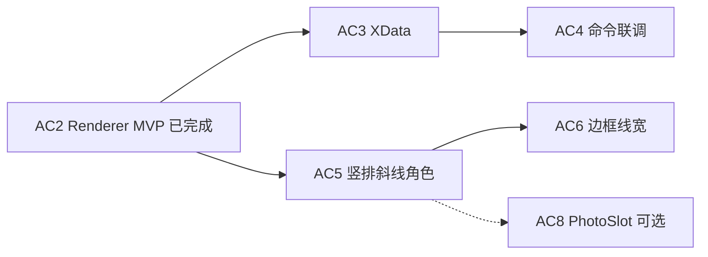
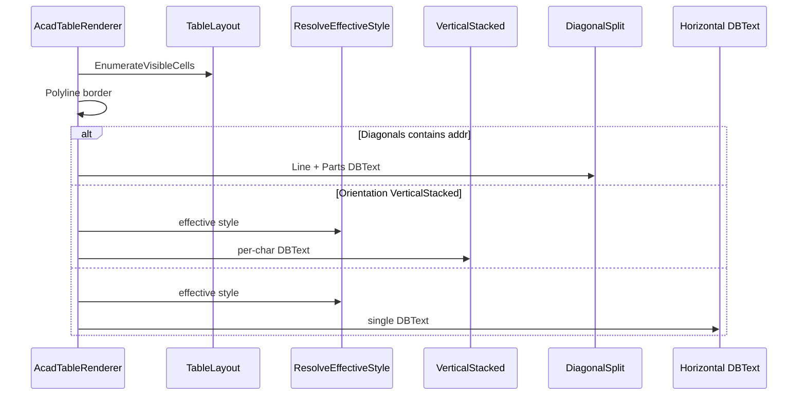

# AC5 · 复杂版式（竖排 + 斜线 + 角色）详解（008e）

> 文档编号：008e（008 的子文档，专述 **AC5**）  
> 生成日期：2026-06-25  
> 上游总计划：[008 AutoCAD 表格制作分阶段实施计划](./008-AutoCAD表格制作分阶段实施计划-2026-06-25-143000.md)  
> 前置步骤：[008b AC2 定稿渲染 MVP](./008b-AC2-定稿渲染MVP详解-2026-06-25-160000.md)（**已完成**）；AC3/AC4 可与 AC5 **并行**，不阻塞本步编码  
> 设计规格：[005 §3.7 斜线 / §3.8 样式与角色 / §6.2 能力矩阵](./005-复杂表格Domain统一设计-2026-06-24-232335.md)  
> 视觉对标：[HtmlTableAdapter](../../../src/HyCAD.Tables/Adapters/HtmlTableAdapter.cs) + `html-samples/*.html`  
> 性质：**AC5 执行规格**——足够细到可单独开 Plan 编码；不写方法体，但给出分支决策、坐标公式、能力矩阵对齐表与验收清单。  
> 用法：实现 AC5 时以本文 + 008 §AC5 为唯一真相；**仍只消费 `TableLayout` 几何**；DoD 全绿后进入 AC6。

---

## 0. AC5 在一整条链里的位置



**AC2 已交付**：[`AcadTableRenderer`](../../../src/HyCADTool/Features/Tables/Infrastructure/AutoCad/AcadTableRenderer.cs) 水平 `DBText` + 单元格 `Polyline`；遇 `VerticalStacked` **退化为单行水平**；不读 `Diagonals` / `CellRole`。

**AC5 核心原则**：

```text
TableLayout.Bounds（不变）
    → 分支：Diagonal? → Line + N×SubCell 文字
    → 分支：VerticalStacked? → 逐字 MText/DBText 柱
    → 否则：水平 DBText（AC2 路径）
    → ResolveEffectiveStyle：CellStyle + CellRole 叠加
```

- **禁止**在 Renderer 内重算行列偏移——几何仍只来自 `TableLayout`。  
- **禁止**实现线框识别反推竖排/斜线（AC9+）。  
- **对齐 HtmlTableAdapter**：同一 `TableGrid` 导出 HTML 与 CAD 并排，版式语义一致（不要求像素级）。

---

## 1. 目标与完成定义（DoD）

### 1.1 一句话目标

**扩展 `AcadTableRenderer`，使 `TextOrientation.VerticalStacked`、`DiagonalSplit`（D3 退化方案）、`CellRole`（Title/Header/Label）在 AutoCAD 线+文字定稿中与 HTML 适配器能力矩阵同级——竖排 Full、斜线 Degraded、角色 Degraded（字高/对齐/伪加粗）。**

### 1.2 AC5 Definition of Done（全部勾选才算完成）

- [ ] `AcadTableRenderer` 识别 `structure.Diagonals.TryGetValue(addr)` → 画对角 `Line` + 各 `SubCell` 文字
- [ ] `CellStyle.Orientation == VerticalStacked` → 逐字竖排（非 AC2 水平退化）
- [ ] `structure.Roles` → `Title` / `Header` / `Label` 有效样式叠加（见 §5）
- [ ] 扩展 `AcadTableRenderOptions`：竖排字距、角色字高系数等可调（见 §4）
- [ ] 可选新增 `AcadTableCapability.cs`，与 `AdapterCapability.HtmlDefaults` 口径对照（§7）
- [ ] `dotnet build src\HyCADTool\HyCADTool.csproj -c Debug` **0 error**
- [ ] **C2→C1** 插入 `TableSamples.BuildPersonnelTable()`：侧栏「家庭主要成员…」竖排目视可读
- [ ] 斜线子集（§10.2 V4）目视正确；与 `html-samples/personnel.html` 或手工导出 HTML **并排**人工确认
- [ ] **不**实现 `PhotoSlot` 占位（AC8）、**不**实现边框粗细差（AC6）、**不**改 Domain / `HyCAD.Tables` 类型
- [ ] `HyCAD.Tables` 仍零 `Autodesk.*`

---

## 2. 范围边界

### 2.1 IN（AC5 必须做）

| # | 工作包 | 交付 |
|---|---|---|
| W1 | 渲染主循环分支 | `RenderCellContent(...)` 三分支：斜线 / 竖排 / 水平 |
| W2 | 竖排堆字 | `VerticalStacked` → 逐字实体 + 柱内居中 |
| W3 | 斜线分割 | `Line` + `SubCell.TextAnchor` → mm 对齐点 |
| W4 | 角色样式 | `CellRole` → 有效 `CellStyle` 叠加 |
| W5 | 选项扩展 | `AcadTableRenderOptions` 竖排/角色/斜线参数 |
| W6 | 文字映射扩展 | `AcadTableTextMapper` 或新 `AcadTableVerticalText.cs` |
| W7 | 能力声明 | 可选 `AcadTableCapability` |
| W8 | 联调验收 | C1 人员表 + 斜线微夹具 |

### 2.2 OUT（AC5 明确不做）

| 内容 | 留给 |
|---|---|
| `CellRole.PhotoSlot` 占位框 + 「照片」 | AC8 |
| `BorderSet` 外粗内细 / 按边线宽 | AC6 |
| `FontKey` → 大字体 `gbcbig.shx` 映射 | V2（MVP 用当前 `DBText`/`MText` 默认样式） |
| `BackColor` 单元格填色 | V2 |
| 斜线/竖排 **识别**反推 Domain | AC9+ |
| 双斜线 4 分 `SubCell` | V2（MVP 仅 2 分，与 Domain 一致） |
| `MText` 富文本 Runs 逐 run 样式 | V2（AC5 竖排/斜线仍拼接 `GetDisplayText`） |
| 修改 `TableSamples` 黄金样表结构 | 可选；斜线验收可用 **临时微夹具**（§10.2 V4） |

---

## 3. Html 对标：能力矩阵（AC5 必须对齐）

| 特性 | HtmlTableAdapter | AC5 AutoCAD 目标 | 级别 |
|---|---|---|---|
| 竖排堆字 | `class="vstack"` + `writing-mode: vertical-rl` | 逐字向下堆叠，列内水平居中 | **Full** |
| 斜线 | CSS `linear-gradient` 对角线 + `diag-part` 绝对定位 | 实体 `Line` + `SubCell` 文字 | **Degraded**（线宽与 HTML 渐变近似） |
| Title | `role-title`：bold + center | 字高 × 系数 + 强制 HAlign Center | **Degraded**（SHX 无真 bold） |
| Header | `role-header`：bold | 字高或 WidthFactor 略增 | **Degraded** |
| Label / Value | `role-label` / `role-value` | MVP 与默认相同或 Label 略小 | **Degraded** |
| PhotoSlot | 灰底 `role-photoslot` | **不做**（AC8） | — |
| 公式 | 显示 `CellValue.Text` | 同 AC2 | Degraded |
| 富边框 | inline border CSS | **不做**（AC6） | — |

**验收口径**：同一 `TableGrid`，Html 导出与 CAD 落图在「有无竖排 class / 斜线两段字 / 标题居中加粗」上**语义一致**；字距/线宽允许 mm 级偏差。

---

## 4. 工作包 W5：`AcadTableRenderOptions` 扩展

在 [`AcadTableRenderOptions.cs`](../../../src/HyCADTool/Features/Tables/Infrastructure/AutoCad/AcadTableRenderOptions.cs) 增加（默认值可在 C2→C1 目视后微调）：

| 属性 | 类型 | 默认 | 说明 |
|---|---|---|---|
| `VerticalCharGapMm` | `double` | `0.5` | 竖排相邻字中心间距增量（= 字高 + gap 或固定步进） |
| `VerticalStackAlign` | `TextAlign` | `Center` | 竖排柱在格内水平方向位置（侧栏窄列通常 Center） |
| `VerticalBlockVAlign` | `TextAlign` | `Center` | 整串竖排块在格内垂直居中（相对 `Bounds`） |
| `TitleTextHeightScale` | `double` | `1.15` | `CellRole.Title` 字高乘数 |
| `HeaderTextHeightScale` | `double` | `1.0` | `CellRole.Header`；伪加粗主要靠 `HeaderWidthFactor` |
| `HeaderWidthFactor` | `double` | `1.05` | Header 文字 `WidthFactor`（SHX 伪加粗） |
| `TitleForceCenter` | `bool` | `true` | Title 忽略 CellStyle.HAlign，强制居中 |
| `DiagonalLayerName` | `string` | 同 `GridLayerName` | 斜线 `Line` 图层；可与网格合并 |
| `DefaultDiagonalSubCellAnchors` | 内置 | 见 §6.3 | `TextAnchor == default(0,0)` 时的回退锚点 |

**不新增 Scale 类参数**：字高仍来自 `CellStyle.TextHeight`（mm，1:1），与 008 §1.4 一致。

---

## 5. 工作包 W4：角色 → 有效样式

### 5.1 解析顺序

```text
ResolveEffectiveStyle(structure, addr, options):
  base = structure.Styles.TryGetValue(addr) ?? DefaultCellStyle(options)
  role = structure.Roles.TryGetValue(addr, out r) ? r : (CellRole?)null
  return ApplyRole(base, role, options)   // 只改字高/对齐/WidthFactor，不写回 Domain
```

### 5.2 角色映射表（对齐 Html CSS）

| CellRole | 字高 | HAlign | VAlign | 其它 |
|---|---|---|---|---|
| `Title` | `base.TextHeight × TitleTextHeightScale` | **Center**（若 `TitleForceCenter`） | 保持 base | `HeaderWidthFactor` 可选 1.0 |
| `Header` | `base.TextHeight × HeaderTextHeightScale` | 保持 base | 保持 base | `DBText.WidthFactor = HeaderWidthFactor` |
| `Label` | `base.TextHeight` | 保持 base | 保持 base | — |
| `Value` | `base.TextHeight` | 保持 base | 保持 base | — |
| `PhotoSlot` | — | — | — | **AC5 跳过文字**（AC8 画占位） |
| `Spacer` | — | — | — | 同空格，不画字 |

**与 AC2 差异**：AC2 `ResolveStyle` 不读 `Roles`；AC5 改为 `ResolveEffectiveStyle` 统一出口。水平/竖排/斜线**共用**此解析。

### 5.3 Title 格合并

人员表 `(0,0)`：`Merge colspan=7` + `CellRole.Title` + 值「人员基本情况表」。竖排**不适用**；应走水平分支 + Title 居中加粗。

---

## 6. 工作包 W2–W3：竖排与斜线

### 6.1 渲染主循环（W1）

替换 AC2 内「每格一个 `GetDisplayText` + `CreateCellText`」为：

```text
foreach (var cell in layout.EnumerateVisibleCells())
{
    AppendCellBorder(cell.Bounds);                    // 不变

    if (structure.Roles.TryGetValue(cell.Addr, out var role) && role == CellRole.PhotoSlot)
        continue;                                       // AC8

    if (structure.Diagonals.TryGetValue(cell.Addr, out var split))
        AppendDiagonalCell(cell.Bounds, split, ...);
    else if (ResolveEffectiveStyle(...).Orientation == VerticalStacked)
        AppendVerticalStackedText(cell.Bounds, text, style, ...);
    else
        AppendHorizontalText(cell.Bounds, text, style, ...);  // AC2 路径
}
```

**优先级**：`DiagonalSplit` **高于** `VerticalStacked`（同一格理论上不应并存；若并存，以 Domain 不变量为准——MVP 按斜线分支处理，竖排忽略）。

**PhotoSlot**：AC5 仅 skip 文字；边框仍画（AC2 行为）。

### 6.2 竖排堆字（W2）

**输入**：显示串 `text`（来自 `GetDisplayText(GridEditor.GetValue(...))`）、`LayoutRect bounds`、有效 `CellStyle`。

**坐标系**（Down，`Top > Bottom`）：

- 竖排柱 **X**：由 `VerticalStackAlign` 定  
  - `Center` → `x = (Left + Right) / 2`  
  - `Start` → `x = Left + padding`  
  - `End` → `x = Right - padding`
- 竖排块总高：`blockHeight = n * textHeight + (n-1) * VerticalCharGapMm`（`n = text.Length`）  
- 首字 Y（块顶）：由 `VerticalBlockVAlign` 在 `[Top, Bottom]` 内居中或贴边  
  - `Center` → `y0 = (Top + Bottom) / 2 + blockHeight/2 - textHeight/2`（首字中心）  
  - `Start` → `y0 = Top - padding - textHeight/2`  
  - `End` → 从 Bottom 向上排（少用）
- 第 `i` 字（0-based）：`yi = y0 - i * (textHeight + VerticalCharGapMm)`

**实体策略（二选一，推荐 A）**：

| 方案 | 做法 | 优缺点 |
|---|---|---|
| **A 推荐** | 每字一个 `DBText`，`HorizontalMode = TextCenter`，`VerticalMode = TextVerticalMid`，对齐点 `(x, yi)` | 与 AC2 一致；字距可控；实体数 = 字数 |
| B | 单 `MText`，`Contents = "字1\\P字2\\P..."`，固定宽度 ≈ 字高 | 实体少；`\P` 行距与 HTML `vertical-rl` 不完全一致 |

008 总计划写「MText」；**008e 推荐 A**（DBText 逐字），与现有 `AcadTableTextMapper` 一致；若实现选 B，须在 `AcadTableCapability` 注明。

**空串**：与 AC2 相同，尊重 `DrawEmptyCellText`。

**黄金验收格**：`BuildPersonnelTable()` 地址 `(4,0)`，文本「家庭主要成员及重要社会关系」，合并 `rowspan=3`，窄列 — 目视应 **一字一行、整列居中、不溢出合并格**。

### 6.3 斜线分割（W3，D3 退化）

**线段**（在 `Bounds` 内，Z = `ZElevation`）：

| DiagonalDirection | 起点 | 终点 |
|---|---|---|
| `BackSlashTLBR`（↘） | `(Left, Top)` | `(Right, Bottom)` |
| `SlashBLTR`（↗） | `(Left, Bottom)` | `(Right, Top)` |

实体：`Line`，图层 `DiagonalLayerName` 或 `GridLayerName`。

**子格文字**：对每个 `SubCell part`：

1. `display = GetDisplayText(part.Value)`  
2. 锚点 `NormalizedPoint anchor = part.TextAnchor`  
3. 若 `anchor == default` → 用 **默认三角区中心**（与 Html 测试夹具可不同，但需稳定）：

| Direction | Part 索引 0 | Part 索引 1 |
|---|---|---|
| `BackSlashTLBR` | `(0.25, 0.25)` 左上三角 | `(0.75, 0.75)` 右下三角 |
| `SlashBLTR` | `(0.25, 0.75)` 左下 | `(0.75, 0.25)` 右上 |

4. mm 坐标（Html 同款：`left = X%`, `top = Y%`，Down 系 Y 向下减小）：

```text
px = Left + anchor.X * Width
py = Top - anchor.Y * Height    // anchor.Y=0 → Top；Y=1 → Bottom
```

5. `DBText` 对齐：用 `part.Align` 映射 `HorizontalMode/VerticalMode`（可复用 `AcadTableTextMapper.ToHorizontalMode/ToVerticalMode`）；对齐点 `(px, py)` + `AdjustAlignment`。

**与 Html 差异**：Html 用 `transform: translate(-50%,-50%)` 使锚点为视觉中心；CAD 应用 `TextCenter` + `TextVerticalMid` 当 `part.Align == Center` 时等效。

**不画**斜线时仍读 `GridEditor.GetValue` 整格值——AC5 有 `Diagonals` 条目时**忽略** anchor 格 `GridData` 整格值，只显示 `Parts`（与 Html `BuildDiagonalContent` 一致）。

### 6.4 斜线验收夹具（样表未建模时）

当前 [`TableSamples.BuildPersonnelTable()`](../../../src/HyCAD.Tables/Samples/TableSamples.cs) **无**斜线格。AC5 验收 **不强制**改黄金样表；在 `TableRenderDevCommand` 或 C1 联调中可选：

```text
// 微夹具：2×2 格 (0,0) SplitDiagonal BackSlash + 「学历」「学位」
// 与 HtmlTableAdapterTests.Export_diagonal_includes_both_subcell_texts 同构
```

或在 `TableSamples` 增 **可选** 工厂方法 `BuildDiagonalDemoTable()`（仅 Dev 命令用，非 P8 必须）——团队择一。

---

## 7. 工作包 W7：可选 `AcadTableCapability`

```csharp
namespace HyCADTool.Features.Tables.Infrastructure.AutoCad;

/// <summary>AutoCAD 线+文字渲染能力（对齐 005 §6.2 / HtmlTableAdapter）。</summary>
public sealed class AcadTableCapability
{
    public static AcadTableCapability LineFrameDefaults { get; } = new()
    {
        VerticalStacked = AdapterFeatureLevel.Full,
        DiagonalSplit = AdapterFeatureLevel.Degraded,
        RichStyles = AdapterFeatureLevel.Degraded,  // 角色字高/伪加粗
        PhotoSlot = AdapterFeatureLevel.NotSupported  // AC8
    };

    public AdapterFeatureLevel VerticalStacked { get; init; }
    public AdapterFeatureLevel DiagonalSplit { get; init; }
    public AdapterFeatureLevel RichStyles { get; init; }
    public AdapterFeatureLevel PhotoSlot { get; init; }
}
```

`AcadTableRenderer` 可暴露静态 `Capability` 属性，供文档与后续 Excel 适配器对照。**非 AC5 阻塞**。

---

## 8. 文件与命名空间

```text
src/HyCADTool/Features/Tables/Infrastructure/AutoCad/
  AcadTableRenderer.cs              ← 扩展 W1–W4
  AcadTableRenderOptions.cs         ← 扩展 W5
  AcadTableTextMapper.cs            ← 扩展：SubCell 对齐、竖排 X
  AcadTableVerticalText.cs          ← 可选：竖排逐字坐标纯函数
  AcadTableDiagonalRenderer.cs      ← 可选：Line + Parts
  AcadTableRoleStyle.cs             ← 可选：ApplyRole 纯函数
  AcadTableCapability.cs            ← 可选 W7
```

- **命名空间**：`HyCADTool.Features.Tables.Infrastructure.AutoCad`  
- **纯函数优先**：竖排 Y 序列、斜线 mm 锚点、默认 SubCell 锚点 → 可单元测试（主工程 `HyCADTool.Tests` 或新建 `Features/Tables/Tests`），**不强制**。

---

## 9. 渲染管线（AC5 增量）



| 步骤 | AC2 | AC5 增量 |
|---|---|---|
| 边框 | 每格 Polyline | 不变 |
| 整格值 | 水平 DBText | 分支 |
| 样式 | `CellStyle` | + `CellRole` 叠加 |
| 图层 | Grid + Text | 斜线可复用 Grid |

---

## 10. 测试与验收策略

### 10.1 可自动化（建议）

| 用例 | 断言 |
|---|---|
| `VerticalStack_positions_n_chars` |给定 bounds + "ABC" → 3 个 Y 递减、X 居中 |
| `Diagonal_anchor_to_mm_BackSlash` | anchor (0.25,0.25) → 在 Left+0.25·W, Top-0.25·H |
| `ApplyRole_Title_scales_height_and_centers` | Title → HAlign Center, Height × scale |
| `DefaultSubCellAnchors_part0_BackSlash` | default anchor → (0.25,0.25) |

### 10.2 手动验收清单（C2→C1）

| # | 场景 | 预期 |
|---|---|---|
| V1 | `BuildPersonnelTable()` @ 原点 | 标题行居中、字略大；侧栏竖排可读 |
| V2 | 竖排格 `(4,0)` 目视 | 一字一行，不水平挤成一行 |
| V3 | 表头 `Header` 行（家庭表或人员表 label 行） | 较 Value 略「粗」或同高可接受 |
| V4 | 斜线微夹具 2×2「学历/学位」 | 对角线可见；两字分居两三角 |
| V5 | `PhotoSlot` 格 | 仅有框，无文字（与 AC2 相同） |
| V6 | Html 并排 | 导出 `personnel.html` 与 CAD 同屏：竖排/标题语义一致 |

### 10.3 M-C2 收口

008 里程碑 **M-C2**：AC5 + AC6 全绿 → 两张黄金样表与 HTML **视觉对齐**。AC5 单独完成时，至少 **人员表竖排 + 标题角色** 达标；家庭表主要验 `Header` 角色（无竖排）。

---

## 11. 与 AC2 / Html / 后续步骤

| 步骤 | 依赖 AC5 产出 |
|---|---|
| AC6 边框 | 仍用 `Bounds`；竖排/斜线不改变边框策略 |
| AC8 PhotoSlot | 在 `PhotoSlot` 分支画占位，复用 `ResolveEffectiveStyle` |
| AC9 识别 | **不读** AC5 竖排/斜线实体语义；V2 反推 |

| HtmlTableAdapter 方法 | AC5 对等 |
|---|---|
| `BuildCell` → `vstack` class | `AppendVerticalStackedText` |
| `BuildDiagonalContent` | `AppendDiagonalCell` |
| `RoleClass` + CSS bold | `ApplyRole` |

---

## 12. 风险与对策

| 风险 | 对策 |
|---|---|
| 竖排字距过密/溢出合并格 | 暴露 `VerticalCharGapMm`；V1/V2 对照 html 调参 |
| SHX 无真 bold | `WidthFactor` + 字高系数；目标 Degraded 非 Full |
| 斜线 default 锚点与 Html 不一致 | 文档 §6.3 固定默认；子格显式设 `TextAnchor` 时以 Domain 为准 |
| 逐字 DBText 实体过多 | 人员表侧栏 ~15 字可接受；超大格 V2 改 MText |
| AC2 退化路径残留 | 删除「VerticalStacked → 水平单行」分支 |
| 与 AC3 载体 Polyline 混淆 | 斜线用 `Line`，不替换表级载体 |
| 编译未跑就 C2 | AI build 后提示 C2→C1 |

---

## 13. 实施顺序（单次 Plan 建议）

```text
1. AcadTableRenderOptions 扩展（§4）
2. AcadTableRoleStyle / ResolveEffectiveStyle（§5）
3. Refactor：AppendHorizontalText 抽出 AC2 逻辑
4. AppendVerticalStackedText + 纯函数（§6.2）
5. AppendDiagonalCell + Line（§6.3）
6. 主循环三分支（§6.1）
7. 可选 AcadTableCapability
8. Dev 命令：PersonnelTable + 可选斜线夹具
9. dotnet build 0 error
10. 用户 C2→C1 跑 V1–V6
11. 勾选 §1.2 DoD
```

预计 **1–2 次编码会话**（M 规模）；竖排字距与 Title 居中占主要调试时间。

---

## 14. AC5 完成后交付清单

| 路径 | 说明 |
|---|---|
| `AcadTableRenderer.cs` | 三分支渲染 |
| `AcadTableRenderOptions.cs` | 竖排/角色参数 |
| `AcadTableTextMapper.cs` 或新文件 | 竖排/斜线坐标 |
| `AcadTableCapability.cs` | 可选 |
| `TableRenderDevCommand.cs` / `TestCommand.cs` | 联调（若 AC4 未完成则仍走 Dev 命令） |

**不交付**：AC6 线宽、AC8 PhotoSlot、AC9 识别、Domain 变更。

---

## 15. 变更记录

| 日期 | 说明 |
|---|---|
| 2026-06-25 | 008e 初版：AC5 竖排/斜线/角色执行规格；Html 能力矩阵对齐；坐标公式；DoD V1–V6；推荐 DBText 逐字竖排 |

---

> **下一步**：开 Plan 编码 AC5；DoD 全绿后进入 [008 AC6](./008-AutoCAD表格制作分阶段实施计划-2026-06-25-143000.md#ac6--边框线宽--外框加粗)（边框线宽 / 外框加粗）。
