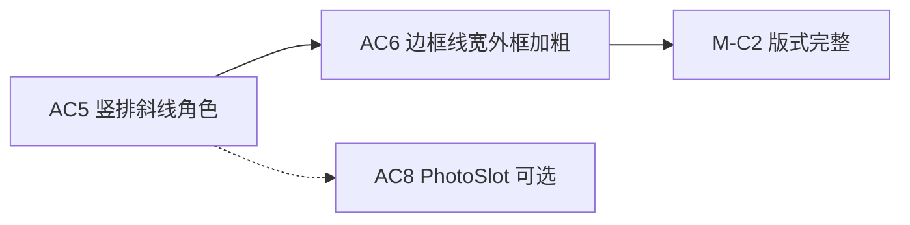

# AC6 · 边框线宽 / 外框加粗详解（008f）

> 文档编号：008f（008 的子文档，专述 **AC6**）  
> 生成日期：2026-06-25  
> 上游总计划：[008 AutoCAD 表格制作分阶段实施计划](./008-AutoCAD表格制作分阶段实施计划-2026-06-25-143000.md)  
> 前置步骤：[008a AC1 TableLayout](./008a-AC1-主工程引用与TableLayout详解-2026-06-25-150000.md)、[008b AC2 渲染 MVP](./008b-AC2-定稿渲染MVP详解-2026-06-25-160000.md)、**AC5 竖排/斜线/角色**（008 §AC5，须先于 AC6 全绿）  
> 样表依据：[002 §表 2 家庭成员](./002-统一表格Domain与双模式编辑-产品调研-2026-06-24-225625.md)（外框 1.5pt、内框 1pt）  
> 性质：**AC6 执行规格**——足够细到可单独开 Plan 编码；不写方法体，但给出边框解析算法、网格线段策略、Domain↔CAD 映射、单测矩阵与验收清单。  
> 用法：实现 AC6 时以本文 + 008 §AC6 为唯一真相；**M-C2 版式完整** 依赖 AC5 + AC6 全绿。

---

## 0. AC6 在一整条链里的位置



**AC2/AC5 现状**：[`AcadTableRenderer`](../../../src/HyCADTool/Features/Tables/Infrastructure/AutoCad/AcadTableRenderer.cs) 对每个可见格画 **等宽闭合 `Polyline`**，**不读** `CellStyle.Borders` / `GridTopology.DefaultBorder`（008b §2.2 OUT）。

**AC6 核心原则（架构收口）**：

```text
TableGrid + TableLayout（ColumnBoundariesX / RowBoundariesY）
    → BorderGridResolver（平台无关，解析每段网格线 mm 线宽 + 是否绘制）
    → AcadTableRenderer 画 Line 线段（ConstantWidth = mm）
    → 外框明显粗于内框；与 HtmlTableAdapter 边框 CSS 一致
```

- **禁止**继续用「每格一个等宽 Polyline」表达不同线宽——Polyline 四边无法分别设宽。  
- **禁止**引入 `Autodesk.AutoCAD.DatabaseServices.Table` / `TableStyle` 边框（008 §1.4）。  
- Domain 层 **`HyCAD.Tables` 仍零 `Autodesk.*`**；边框解析放 `HyCAD.Tables.Layout` 或 `HyCAD.Tables.Rendering` 纯函数。

---

## 1. 目标与完成定义（DoD）

### 1.1 一句话目标

**读取 `CellStyle.Borders` 与 `GridTopology.DefaultBorder`，按 HTML `border-collapse: collapse` 语义在网格线上绘制不同 mm 线宽；家庭成员表外框（左右及四边外缘）明显粗于内部分隔线，目视与 `html-samples/family.html` 一致。**

### 1.2 AC6 Definition of Done（全部勾选才算完成）

- [ ] 新增平台无关 `BorderGridResolver`（或等价命名），输入 `TableGrid` + `TableLayout` + 回退线宽 → 输出可枚举网格线段描述（见 §5）
- [ ] 新增 `BorderGridResolverTests`（≥ 8 用例）在 `HyCAD.Tables.Tests` 全绿
- [ ] `AcadTableRenderer` **边框分支**改为网格 `Line` + `ConstantWidth`（mm），**不再**逐格等宽 `Polyline`（文字/竖排/斜线分支保持 AC5）
- [ ] `AcadTableRenderOptions` 增加 `DefaultInnerBorderWidthMm` / `DefaultOuterBorderWidthMm`（或与 Domain 回退统一）
- [ ] `TableSamples.BuildFamilyTable()` 写入 `DefaultBorder` + 必要格级 override，使 Domain 携带样表 2 线宽语义
- [ ] 同一 `BuildFamilyTable()` 经 `HtmlTableAdapter` 导出时外粗内细可见（与 CAD 并排对照）
- [ ] `dotnet build src\HyCADTool\HyCADTool.csproj -c Debug` **0 error**
- [ ] `dotnet test src\HyCAD.Tables.Tests` 全绿（含 `PlatformIndependenceTests`）
- [ ] 用户 **C2→C1** 插入家庭成员表：外框线宽 **肉眼可辨** 粗于内框
- [ ] **不**实现线型（虚线/点线）——`BorderSet` 当前仅宽度；线型留 V2
- [ ] **不**阻塞 AC3 载体 `Polyline`（若 AC3 已用 `TableBounds` 作载体，AC6 须避免与边框 **重复叠画** 同宽外框——见 §7.3）

---

## 2. 范围边界

### 2.1 IN（AC6 必须做）

| # | 工作包 | 交付 |
|---|---|---|
| W1 | pt/mm 口径与样表数据 | `BuildFamilyTable` 补 `DefaultBorder`；文档 §3 换算表 |
| W2 | 边框解析纯函数 | `BorderGridResolver` + 线段 DTO |
| W3 | 合并格内线跳过 | 与 `IsHidden` 一致的「物理网格线是否可见」 |
| W4 | 邻格共享边合并 | 同 HTML collapse：`max(边A, 边B)` |
| W5 | 渲染器改网格线 | `AcadTableRenderer` 画 `Line` + `ConstantWidth` |
| W6 | Options 回退 | 与 [`HtmlTableExportOptions.DefaultBorderWidthMm`](../../../src/HyCAD.Tables/Adapters/HtmlTableExportOptions.cs) 语义对齐 |
| W7 | 单测 + 目视 | §8 矩阵 + §9 清单 |

### 2.2 OUT（AC6 明确不做）

| 内容 | 留给 |
|---|---|
| `LineWeight` / 图层线宽 / 打印样式表 | 可选优化；AC6 默认 `ConstantWidth` |
| 虚线、双线、圆角 | V2 |
| 斜线格边框特殊处理 | AC5 斜线为对角 `Line`，宽度跟 `DefaultInnerBorderWidthMm` |
| 线框识别反推线宽 | AC9 |
| PhotoSlot 占位框线宽 | AC8（可复用 W5 同一套线段 API） |
| `GrowDirection.Up` | V2 |

---

## 3. 样表 2 线宽口径（W1）

### 3.1 pt → mm（模型空间 1:1）

| 样表描述 | pt | mm（25.4/72 × pt） | 建议 Domain 存值 |
|---|---|---|---|
| 内框 | 1 pt | ≈ **0.353** | `0.35` |
| 外框（左右等） | 1.5 pt | ≈ **0.529** | `0.53` |

**硬规则**：`BorderSet` 四边字段单位 **mm**，不乘 Scale（008 §1.4）。

### 3.2 `BuildFamilyTable` 建议补数据

在 [`TableSamples.BuildFamilyTable`](../../../src/HyCAD.Tables/Samples/TableSamples.cs) 返回前：

1. **拓扑默认内框**：`GridTopology` 的 `DefaultBorder = BorderSet.Uniform(0.35)`  
2. **外缘四边加粗**（7×6 表）——任选 **A 或 B** 策略（实现时择一写进决策记录）：

| 策略 | 做法 | 优点 |
|---|---|---|
| **A 格级 override** | 首列格 `Left=0.53`；末列格 `Right=0.53`；首行 `Top=0.53`；末行 `Bottom=0.53`；其余边 0 → 回落 DefaultBorder | 与 Domain `BorderSet` 语义一致；Html 同步 |
| **B 解析器外框** | `DefaultBorder` 仅内框；`BorderGridResolver` 对 `ColumnBoundariesX[0/ColCount]`、`RowBoundariesY[0/RowCount]` 强制 `OuterWidthMm` | 样表构造更简单 |

**推荐策略 A**（与 005 `CellStyle.Borders` 一致，Html/CAD 共用同一 JSON）。

3. **Html 对照**：`HtmlTableAdapter` 已读 `style.Borders ?? topology.DefaultBorder`（[`HtmlTableAdapter.cs`](../../../src/HyCAD.Tables/Adapters/HtmlTableAdapter.cs) L220）；补 Domain 数据后 **无需改适配器** 即可导出差异线宽。

### 3.3 人员表（样表 1）

AC6 **不强制**改 `BuildPersonnelTable` 线宽（MVP 可全表 uniform 0.35mm）；M-C2 验收以 **家庭成员表** 为主。

---

## 4. 关键决策（008 风险收口）

### D-AC6-1：几何 primitive 选型

| 方案 | 结论 |
|---|---|
| 闭合 `Polyline` + 单一 `ConstantWidth` | ❌ 无法四边不同宽 |
| 每格 4 条 `Line` | ✅ 可行但合并格内线需 skip |
| **`TableLayout` 网格线 + 按段 `Line`** | ✅ **采用**；复用 `ColumnBoundariesX` / `RowBoundariesY` |

### D-AC6-2：CAD 线宽表达

| 方案 | 结论 |
|---|---|
| `Entity.LineWeight` + `MmToLineWeight` | 离散档（0.05mm 步进），0.35/0.53 可映射但不直观 |
| **`Line` + `ConstantWidth = widthMm`** | ✅ **采用**；与模型空间 mm 1:1 一致；参照 [`DetailSketchRenderer`](../../../src/HyCADTool/Features/G101/Services/DetailSketchRenderer.cs) 线宽思路 |

最小线宽：`ConstantWidth = Math.Max(widthMm, 0.05)` 防止 0 宽不可见。

### D-AC6-3：共享边宽度（collapse 语义）

两格共享一条内部网格线时，线段线宽 = **`max(格A该边, 格B对边)`**；与 HTML `border-collapse: collapse` 宽者胜出一致。

### D-AC6-4：与 AC2 逐格 Polyline 的关系

**删除** AC2 的 `CreateCellBorder(Polyline)` 主路径，**统一**为网格线段；避免内线双倍绘制。AC3 若需「载体 Polyline」，使用 **表级外框一条**（线宽 = 外框宽），不与 W5 重复画四边——或载体用 **无宽 Polyline / 点** 仅挂 XData（AC3 决策，AC6 文档标注协调点）。

---

## 5. 工作包 W2–W3：`BorderGridResolver` 设计规格

### 5.1 文件与命名空间

```text
src/HyCAD.Tables/Layout/
  BorderGridSegment.cs       ← 线段 DTO
  BorderGridResolver.cs      ← 纯解析
```

- **命名空间**：`HyCAD.Tables.Layout`  
- **依赖**：`TableGrid`、`TableLayout`、`BorderSet`、`GridStructure`；**零** AutoCAD

### 5.2 线段 DTO（形状，非实现）

```csharp
namespace HyCAD.Tables.Layout;

public enum GridLineOrientation { Horizontal, Vertical }

/// <summary>表格网格上的一段直线边框（模型空间 mm）。</summary>
public readonly record struct BorderGridSegment(
    GridLineOrientation Orientation,
    double FixedCoord,      // 水平线：Y；竖直线：X
    double Start,           // 水平线：X 起；竖直线：Y 起（Down：Start > End 时仍存 min/max 由 Width 为正保证）
    double End,
    double WidthMm);

public static class BorderGridResolver
{
    public static IEnumerable<BorderGridSegment> Resolve(
        TableLayout layout,
        double fallbackWidthMm = 0.35);
}
```

### 5.3 单格四边宽度解析

对地址 `addr`、边 `edge ∈ {Top, Right, Bottom, Left}`：

```text
style = structure.Styles.TryGetValue(addr)
borders = style?.Borders ?? structure.Topology.DefaultBorder ?? BorderSet.None
width = borders.{Top|Right|Bottom|Left}
if width <= 0 → fallbackWidthMm
```

**合并格**：边框归属 **anchor 格**（与 `TryGetCellRect` 相同 anchor）；hidden 格不参与。

### 5.4 物理网格线与合并 skip（W3）

记 `colBoundaries[c] = ColumnBoundariesX[c]`，`rowBoundaries[r] = RowBoundariesY[r]`。

**竖直线** `x = colBoundaries[c]`，`c ∈ [1 .. ColCount-1]`（内部列界）：

- 对每个行带 `[rowBoundaries[r+1], rowBoundaries[r]]`（`r ∈ [0 .. RowCount-1]`）：
  - 若 `(r, c-1)` 与 `(r, c)` 属于 **同一 `MergeRegion` 的水平相邻 hidden 关系**（即合并块内部竖直边）→ **不输出线段**
  - 否则：左格 = anchor 化后的 `(r, c-1)` 的 **Right**；右格 = `(r, c)` 的 **Left** → `width = max(left, right)`

**水平线** `y = rowBoundaries[r]`，`r ∈ [1 .. RowCount-1]`：对称处理 **Top/Bottom** + rowspan 内部 skip。

**表外缘**（`c=0`、`c=ColCount`、`r=0`、`r=RowCount`）：

- 仅一侧有格：取该侧格对应 **Left/Right/Top/Bottom** 宽度（不再 max 邻居）

### 5.5 枚举顺序

先 **竖线**（col 0..ColCount，每列界按 row 分段），再 **横线**（row 0..RowCount）。顺序不影响目视，但利于单测确定性。

---

## 6. 工作包 W5：`AcadTableRenderer` 边框分支

### 6.1 Options 扩展

| 属性 | 类型 | 默认 | 说明 |
|---|---|---|---|
| `DefaultInnerBorderWidthMm` | `double` | `0.35` | `BorderSet` 为 0 时的回退 |
| `MinBorderWidthMm` | `double` | `0.05` | `ConstantWidth` 下限 |

（外框 0.53 应来自 Domain `BorderSet`，**不硬编码**在 Options。）

### 6.2 渲染步骤（替换 AC2 §5.2 逐格 Polyline）

```text
layout = TableLayout.Create(...)
segments = BorderGridResolver.Resolve(layout, options.DefaultInnerBorderWidthMm)
foreach (seg in segments)
    line = new Line(
        new Point3d(seg.Start, seg.FixedCoord, z),  // 方向按 Orientation 调整
        new Point3d(seg.End,   seg.FixedCoord, z))
    line.ConstantWidth = Max(seg.WidthMm, options.MinBorderWidthMm)
    line.Layer = options.GridLayerName
    ms.AppendEntity(line)
// 然后继续 AC5 文字 / 竖排 / 斜线 / PhotoSlot 分支
```

**Down 方向**：水平线 Y 固定；竖直线 X 固定；`Start/End` 为沿该方向的 min/max 坐标。

### 6.3 与 AC3 载体协调

| AC3 状态 | AC6 行为 |
|---|---|
| 尚无载体 | 仅网格线段 |
| 已有 `TableBounds` 闭合 Polyline 作 XData 载体 | **二选一**：① 载体 `ConstantWidth=0` 或不可见；② 不画与载体重合的外缘四段网格线，仅画内部线 |

推荐 **②**，避免外框画两次导致线宽叠加。

---

## 7. 与 Html / AC1 / AC5 的接口

| 模块 | AC6 使用方式 |
|---|---|
| `TableLayout.ColumnBoundariesX` / `RowBoundariesY` | 网格线几何 |
| `TableLayout.EnumerateVisibleCells` | 文字/竖排/斜线（**不变**） |
| `HtmlTableAdapter` | 同一 `BorderSet` → CSS `border-*-width`；目视对照 |
| AC5 竖排/斜线 | 在边框线段 **之后** 绘制，避免被覆盖 |

---

## 8. 单测矩阵（`BorderGridResolverTests`）

建议 **≥ 8** 条；夹具用 `TableGrid.CreateEmpty` + `GridEditor` / `TableSamples`。

| # | 用例名（建议） | 断言要点 |
|---|---|---|
| B1 | `Uniform_default_all_segments_same_width` | 3×3 无 override → 所有段 `WidthMm ≈ 0.35` |
| B2 | `Outer_left_column_thicker` | 首列 `Left=0.53` → `c=0` 竖线段 0.53 |
| B3 | `Outer_right_column_thicker` | 末列 `Right=0.53` → `c=ColCount` 竖线段 0.53 |
| B4 | `Inner_vertical_max_of_neighbors` | 左格 Right=0.53、右格 Left=0.35 → 内部界 0.53 |
| B5 | `Merge_colspan_skips_internal_vertical` | (0,0) colspan=2 → `c=1` 无竖线段 |
| B6 | `Merge_rowspan_skips_internal_horizontal` | rowspan=2 → 中间行界无横线段 |
| B7 | `BuildFamilyTable_outer_thicker_than_inner` | 外缘段 min 宽 > 内部段 max 宽 |
| B8 | `Zero_border_falls_back` | `BorderSet.None` + fallback 0.35 → 全 0.35 |
| B9 | `TableBounds_segment_count` | 3×3 无合并：竖线 4×3 段 + 横线 4×3 段（无 skip 时） |

B7 为 **P8 接缝测试**，与 M-C2 验收直接相关。

---

## 9. 手动验收清单（C2→C1）

| # | 场景 | 预期 |
|---|---|---|
| V1 | `BuildFamilyTable()` @ 原点 | 表矩形外缘线 **明显粗** 于内部网格 |
| V2 | 放大看左右外框 | 左右外框同粗；与 HTML 导出 `.family.html` 并排近似 |
| V3 | `BuildPersonnelTable()` | 仍正常落图；线宽可全 uniform，无回归 |
| V4 | 含 colspan 表头 | 表头下方横线连续、merge 内部无竖线 |
| V5 | 与 AC5 竖排并存 | 侧栏竖排文字不被边框覆盖；线宽不影响文字位置 |
| V6 | N34 读回（若 AC3 已完成） | JSON 中 `DefaultBorder` / 格级 `Borders` round-trip 一致 |

### 9.1 Html 并排流程（推荐）

```powershell
dotnet test src\HyCAD.Tables.Tests --filter "FullyQualifiedName~HtmlTableAdapter"
# 打开 bin\Debug\net48\html-samples\family.html 与 CAD 同屏对比
```

---

## 10. 风险与对策

| 风险 | 对策 |
|---|---|
| 逐格 Polyline 与网格线双倍 | AC6 **移除** 旧 Polyline 边框路径 |
| 合并内部误画线 | B5/B6 + 对照 `IsHidden` |
| 0 宽线不可见 | `MinBorderWidthMm` |
| 外框线段与 AC3 载体叠加 | §6.3 二选一写死 |
| Html/CAD 线宽不一致 | 同一 `BuildFamilyTable` Domain 数据；禁止 Renderer 硬编码 0.53 |
| `ConstantWidth` 打印过细 | 目视验收；V2 可换 `LineWeight` |
| AC5 未全绿就改边框 | **依赖 AC5**；仅改边框分支，不碰竖排/斜线 |

---

## 11. 实施顺序（单次 Plan 建议）

```text
1. TableSamples.BuildFamilyTable 补 DefaultBorder + 外缘 override（W1）
2. BorderGridSegment + BorderGridResolver 骨架
3. 实现外缘 / 内部 / merge skip / max 邻居（W2–W3）
4. BorderGridResolverTests B1–B9
5. AcadTableRenderOptions 扩展
6. AcadTableRenderer：删 CreateCellBorder Polyline，改网格 Line（W5）
7. 协调 AC3 载体重复外框（若已存在）
8. dotnet test HyCAD.Tables.Tests 全绿
9. dotnet build HyCADTool 0 error
10. 导出 family.html + 用户 C2→C1 V1–V6
11. 勾选 §1.2 DoD
```

预计 **1 次编码会话**（S 规模）；合并 skip 与 AC3 协调是主要调试点。

---

## 12. AC6 完成后交付清单

| 路径 | 说明 |
|---|---|
| `src/HyCAD.Tables/Layout/BorderGridResolver.cs` | 边框网格解析 |
| `src/HyCAD.Tables/Layout/BorderGridSegment.cs` | DTO（可合并单文件） |
| `src/HyCAD.Tables.Tests/BorderGridResolverTests.cs` | ≥8 用例 |
| `src/HyCAD.Tables/Samples/TableSamples.cs` | 家庭表线宽数据 |
| `src/HyCADTool/.../AcadTableRenderer.cs` | 网格 Line 边框 |
| `src/HyCADTool/.../AcadTableRenderOptions.cs` | 回退线宽选项 |

**不交付**：线型、TableStyle、识别器、WPF 面板。

---

## 13. 变更记录

| 日期 | 说明 |
|---|---|
| 2026-06-25 | 008f 初版：AC6 网格线段策略、BorderGridResolver API、pt/mm 口径、样表 2 数据、DoD、B1–B9 单测与 V1–V6 目视；D-AC6-1~4 决策 |

---

> **下一步**：确认 AC5 全绿后，按 §11 开 Plan 编码 AC6；DoD 全绿即 **M-C2 线宽项收口**，可与 AC8 PhotoSlot 并行或后置。
