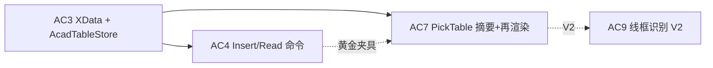
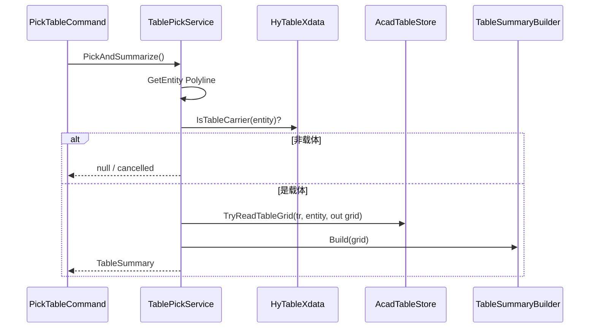

# AC7 · 拾取已有表格（摘要 + 再渲染）详解（008g）

> 文档编号：008g（008 的子文档，专述 **AC7**）  
> 生成日期：2026-06-25  
> 上游总计划：[008 AutoCAD 表格制作分阶段实施计划](./008-AutoCAD表格制作分阶段实施计划-2026-06-25-143000.md)  
> 前置步骤：[008 AC3 XData 真相源](./008-AutoCAD表格制作分阶段实施计划-2026-06-25-143000.md#ac3--xdata-真相源--读回-round-trip)（**Must**）、[008 AC4 命令联调](./008-AutoCAD表格制作分阶段实施计划-2026-06-25-143000.md#ac4--命令联调插入--读回)（**Must，联调夹具**）  
> 设计规格：[005 §5 真相源随实体走](./005-复杂表格Domain统一设计-2026-06-24-232335.md)  
> 性质：**AC7 执行规格**——足够细到可单独开 Plan 编码；不写方法体，但给出拾取流程、摘要字段、再渲染分支、命令注册与验收清单。  
> 用法：实现 AC7 时以本文 + 008 §AC7 为唯一真相；**读回只走 `AcadTableStore`**，AC7 全绿后再评估 AC9（线框识别）。

---

## 0. AC7 在一整条链里的位置



**AC7 核心原则**：

```text
用户点选实体（须为 HY_TABLE 载体）
    → AcadTableStore.TryReadTableGrid（AC3 唯一读口）
    → TableSummary 统计 + 命令行输出
    → 可选：用户指定新基点 → AcadTableRenderer.Render（不删旧实体）
```

- **禁止**从散落 Line/DBText 反推结构（那是 AC9）。  
- **禁止**原地 diff / 覆盖旧几何（MVP 只「旁侧新画一份」）。  
- **禁止**新建第二套 JSON 读路径——摘要与再渲染共用 `TryReadTableGrid`。

**与 AC4 的分工**：

| 命令 | 职责 |
|---|---|
| `ReadTableBackCommand`（N34） | 开发验收入口：读回 + `GridInvariants` 绿灯/红灯 |
| `PickTableCommand`（N35，AC7） | 用户向：人类可读摘要 + 可选再渲染 |

二者可共享 `TablePickService` / `TableSummaryBuilder`；**不合并为一个命令**，避免 N34 输出淹没摘要 UX。

---

## 1. 目标与完成定义（DoD）

### 1.1 一句话目标

**点选带 `HY_TABLE` 标记的载体实体，在命令行打印表格摘要（标题/行列/FieldKey/公式/合并/不变量），用户确认后可在新插入点再渲染一份完整定稿表，旧表保留。**

### 1.2 AC7 Definition of Done（全部勾选才算完成）

- [ ] 新增 `TableSummary.cs`（或等价 DTO）+ `TableSummaryBuilder`（纯 Domain 统计，零 `Autodesk.*`）
- [ ] 新增 `TablePickService.cs`（Infrastructure：拾取 + 读回 + 校验载体）
- [ ] 新增 `PickTableCommand.cs`：`Execute()` 无 `[CommandMethod]`
- [ ] `commands.json`：`N35` → `PickTableCommand.Execute`；同步 `bin\Debug`
- [ ] `TestCommand.Run()` 一行指向 `PickTableCommand`（C1 联调）
- [ ] `dotnet build src\HyCADTool\HyCADTool.csproj -c Debug` **0 error**
- [ ] 对 AC4 插入的人员表：摘要行列 = 7×7、FieldKey ≥ 1（`name`）、不变量通过
- [ ] 选「再渲染」后新表落图无报错，旧表实体仍在
- [ ] 选非载体 / 无 XData 实体：友好拒绝，不抛未处理异常
- [ ] **不**实现几何 diff、原地更新、Explode、识别（AC9–AC10）
- [ ] **不**写 WPF 面板（AC11）

---

## 2. 范围边界

### 2.1 IN（AC7 必须做）

| # | 工作包 | 交付 |
|---|---|---|
| W1 | 摘要 DTO + 构建器 | `Application/TableSummary.cs`、`TableSummaryBuilder.cs` |
| W2 | 载体识别 | 读 `HyTableXdata` RegApp + Kind；拒绝非 HY_TABLE |
| W3 | 读回 | `AcadTableStore.TryReadTableGrid` → `TableGrid` |
| W4 | 命令行摘要 | 格式化输出 §4.3 字段 |
| W5 | 再渲染分支 | 关键字「再渲染/R」→ `GetPoint` 新基点 → `Renderer.Render` |
| W6 | 命令注册 | N35 + TestCommand |
| W7 | 手动验收清单 | §10 V1–V8 |

### 2.2 OUT（AC7 明确不做）

| 内容 | 留给 |
|---|---|
| 线框识别 / 从 Line+Text 反推 | AC9 |
| 编辑模式 Explode | AC10 |
| WPF 摘要面板 | AC11 |
| 删除旧表 / 替换旧表 | V2（需 OpLog + 用户确认策略） |
| 多实体批量拾取 | V2 |
| 摘要写回 Metadata / 改 FieldKey | AC11 或独立编辑命令 |
| PhotoSlot 图片插入 | AC8 |
| `GridInvariants` 详细 violation 列表（N34 已有） | N34 保持；AC7 仅 Pass/Fail + 首条 |

---

## 3. 建议目录与命名空间

```text
src/HyCADTool/Features/Tables/
  Application/
    TableSummary.cs              ← W1 DTO
    TableSummaryBuilder.cs       ← W1 纯函数
    TablePickService.cs          ← W2–W5 编排（可注入 Editor/Database）
  Commands/
    PickTableCommand.cs          ← W6
    ReadTableBackCommand.cs      ← AC4 已有；AC7 与之共享 Builder
  Infrastructure/AutoCad/
    AcadTableStore.cs            ← AC3 已有
    HyTableXdata.cs              ← AC3 已有
    AcadTableRenderer.cs         ← AC2/AC5 再渲染消费
```

- **命名空间**：`HyCADTool.Features.Tables.Application` / `.Commands`  
- **异常**：业务层 `System.Exception`；用户取消拾取用 `PromptStatus` 判断，**不**当错误抛

---

## 4. 工作包 W1：`TableSummary` 规格

### 4.1 DTO 形状（建议）

```csharp
namespace HyCADTool.Features.Tables.Application;

public sealed class TableSummary
{
    public Guid TableId { get; init; }
    public string DisplayTitle { get; init; }      // 见 §4.2
    public int RowCount { get; init; }
    public int ColCount { get; init; }
    public int VisibleCellCount { get; init; }     // 非 hidden
    public int MergeRegionCount { get; init; }
    public int FieldKeyCount { get; init; }
    public IReadOnlyList<string> FieldKeys { get; init; }  // 可选，≤20 全打，否则截断
    public int FormulaCellCount { get; init; }
    public int BoundCellCount { get; init; }
    public bool InvariantsValid { get; init; }
    public string? FirstInvariantMessage { get; init; }
    public string SchemaVersion { get; init; }     // 来自 HyTableXdata
    public ObjectId CarrierId { get; init; }       // 拾取到的载体（AutoCAD 侧）
}
```

### 4.2 `DisplayTitle` 推导规则（固定优先级）

| 优先级 | 来源 | 示例 |
|---|---|---|
| 1 | `Metadata["title"]` 非空 | 自定义元数据 |
| 2 | 首个 `CellRole.Title` 格的显示文本 | 「人员基本情况表」 |
| 3 | 首个 `CellRole.Header` 格文本（仅当无 Title） | 「称谓」——**不推荐**作表名，仅兜底 |
| 4 | `$"表格 {TableId:N8}"` | 无标题样表 |

显示文本拼接规则与 AC2 `GetDisplayText` 一致（`Runs` 优先，否则 `Text`）。

**禁止**在 AC7 新增 Domain 字段；标题推导放 `TableSummaryBuilder`（Application 层）。

### 4.3 统计规则

| 指标 | 算法 |
|---|---|
| `RowCount` / `ColCount` | `grid.Structure.Topology.Rows.Count` / `Cols.Count` |
| `VisibleCellCount` | 遍历全部 `CellAddr`，`!structure.IsHidden(addr)` 计数 |
| `MergeRegionCount` | `grid.Structure.Merges.Count` |
| `FieldKeyCount` | `grid.Structure.FieldIndex.Count` |
| `FieldKeys` | `FieldIndex.Keys` 排序 |
| `FormulaCellCount` | `Data.Cells` 中 `Kind == CellValueKind.Formula` |
| `BoundCellCount` | `Kind == CellValueKind.Bound` |
| `InvariantsValid` | `GridInvariants.Validate(grid).IsValid` |
| `FirstInvariantMessage` | 首条 `TableViolation.Message` |

`TableSummaryBuilder` 放 `HyCADTool.Features.Tables.Application`，**可单测**（传入 `TableGrid`，不碰 CAD）。

---

## 5. 工作包 W2–W3：拾取与读回

### 5.1 载体实体约定（继承 AC3）

| 项 | 值 |
|---|---|
| RegApp | `"HY_TABLE"`（`HyTableXdata.RegAppName`） |
| XData Kind | `"TableCarrier"` 或 AC3 定稿常量 |
| 几何 | 表级外框闭合 `Polyline`（`TableLayout.TableBounds`） |
| JSON | 扩展字典键 `"HyTable_JSON"`（`AcadTableStore`） |

**拾取过滤（推荐）**：

```csharp
var peo = new PromptEntityOptions("\n[HyTable] 选择表格载体:");
peo.SetRejectMessage("\n请选择带 HY_TABLE 标记的表格外框 Polyline。");
peo.AddAllowedClass(typeof(Polyline), exactMatch: false);
// 选后 Transaction 内：HyTableXdata.TryReadKind == TableCarrier
```

非载体：`WriteMessage("\n所选实体不是 HyTable 表格载体。")` → 结束，不读 JSON。

### 5.2 读回流程



`TryReadTableGrid` 失败（JSON 损坏）：输出错误 + `FirstInvariantMessage` 占位，**不**再渲染。

### 5.3 `TablePickService` 建议 API

```csharp
public sealed class TablePickService
{
    public TablePickService(Database db);

    /// <summary>拾取一次；取消或非载体返回 null。</summary>
    public TableSummary? TryPickSummary(Editor ed);

    /// <summary>已持有 grid 时再渲染；返回新实体 Id 数量。</summary>
    public int RerenderAt(TableGrid grid, Point3d insertionPoint);
}
```

---

## 6. 工作包 W4–W5：命令行输出与再渲染

### 6.1 摘要输出格式（固定模板）

```
[HyTable] ── 表格摘要 ──
  标题: 人员基本情况表
  ID:   a1b2c3d4-...
  规模: 7 行 × 7 列 | 可见格 48 | 合并区 6
  字段: 1 个 (name)
  公式: 0 | 绑定: 0
  不变量: 通过
  载体: Polyline Handle=XXX
[HyTable] 再渲染? [是(R)/否(N)] <N>:
```

- 不变量失败时：`不变量: 失败 — {FirstInvariantMessage}`  
- FieldKey > 20：`字段: 25 个 (name, member0_name, … +22)`  
- 使用 `Editor.WriteMessage`；中文标签与上表一致（便于用户截图反馈）

### 6.2 再渲染分支

| 步骤 | 动作 |
|---|---|
| 1 | `PromptKeywordOptions`：`"再渲染"`, `"R"`, `"否"`, `"N"`；默认 `"否"` |
| 2 | 用户选 R → `PromptPointOptions("\n指定新表左上角:")` |
| 3 | `AcadTableRenderer.Render(grid, point)` — **与 AC4 插入相同 Renderer/Options** |
| 4 | AC3 若已实现「渲染时写 XData」：再渲染也应写真相源（新载体 + 新 Guid 或复用 TableId——**推荐新 Guid 新载体**，避免两几何共用一个 Id 混淆） |
| 5 | 输出 `已再渲染 N 个实体 @ (x,y)` |

**关键决策（AC7 定稿）**：

- **不删除**旧实体；旧载体 JSON 不变。  
- 再渲染产生**新** `TableGrid.Id`（`TableJson.Deserialize` 后 clone 并 `with { Id = Guid.NewGuid() }`）或 Store 层显式 NewId——避免 DWG 内双载体同 Id。  
- 再渲染**不**复制旧表样式图层选择；用 `AcadTableRenderOptions.Default`。

### 6.3 与 `ReadTableBackCommand` 复用

提取 package-private 或 internal：

```csharp
internal static void WriteInvariantReport(Editor ed, TableGrid grid);
internal static void WriteSummary(Editor ed, TableSummary summary);
```

N34 继续输出完整 violation 列表；N35 调用 `WriteSummary` + 再渲染关键字。

---

## 7. 工作包 W6：命令注册与 C1

### 7.1 `PickTableCommand`

```csharp
public sealed class PickTableCommand
{
    public void Execute()
    {
        // doc null check
        // var summary = pickService.TryPickSummary(ed);
        // if summary == null) return;
        // WriteSummary(...);
        // keyword → optional RerenderAt
    }
}
```

### 7.2 `commands.json`

```json
"N35": {
  "type": "HyCADTool.Features.Tables.Commands.PickTableCommand",
  "method": "Execute",
  "category": "表格",
  "displayName": "拾取表格(N35)",
  "tooltip": "点选 HY_TABLE 载体，摘要 + 可选再渲染",
  "order": 155
}
```

（N33=插入、N34=读回 由 AC4 占用；AC7 用 **N35**。）

### 7.3 `TestCommand.cs`

```csharp
new PickTableCommand().Execute();
```

用户流程：AC4 先 C1 插入样表 → C2 → 改 TestCommand 指向 N35 → C1 拾取 → 目视摘要 → 再渲染。

---

## 8. 与 AC3 / AC5 / AC9 的接口

| 步骤 | 依赖 AC3 | 依赖 AC5+ |
|---|---|---|
| 读回 JSON | `AcadTableStore.TryReadTableGrid` | — |
| 载体判定 | `HyTableXdata.ReadKind` | — |
| 再渲染竖排/斜线 | — | 若 AC5 已合入 Renderer，再渲染自动带竖排/斜线 |
| AC9 入口 | AC7 验证「有 JSON 的表」可拾取 | 识别器输出 grid 后仍走同一 Summary API |

AC9 完成后：`PickTableCommand` 可增加第三分支「从线框识别」（**非 AC7**）。

---

## 9. 单测与自动化

### 9.1 Domain 侧（推荐）

新增 `HyCAD.Tables.Tests` **不必**；摘要构建放主工程 Application，可选：

`src/HyCADTool.Tests/TableSummaryBuilderTests.cs`（若主工程测试项目已引用 `HyCAD.Tables`）

| # | 用例 | 断言 |
|---|---|---|
| T1 | `BuildPersonnelTable` | Title=「人员基本情况表」；7×7；FieldKeyCount=1 |
| T2 | `BuildFamilyTable` | FieldKeyCount=6（member0..5）；MergeRegionCount≥1 |
| T3 | 含 Formula 格 | FormulaCellCount=1 |
| T4 | 故意非法 merge | InvariantsValid=false；FirstInvariantMessage 非空 |

### 9.2 不可测（CAD 手动）

| 项 | 原因 |
|---|---|
| PromptEntity / GetPoint | 需 AutoCAD 交互 |
| 再渲染几何 | 目视 |

---

## 10. 手动验收清单（C2→C1 / N35）

| # | 场景 | 预期 |
|---|---|---|
| V1 | N35 点选 AC4 人员表载体 | 摘要 7×7；标题「人员基本情况表」；字段含 `name`；不变量通过 |
| V2 | 点选 AC4 家庭表载体 | 7×6；FieldKey ≥ 6 |
| V3 | 点选普通 Polyline（无 HY_TABLE） | 拒绝提示，不崩溃 |
| V4 | 点选 DBText | Reject 或提示非载体 |
| V5 | 摘要后选 N | 命令结束，无新实体 |
| V6 | 摘要后选 R，点 (500,0) | 新表出现在旁侧；旧表仍在原点 |
| V7 | 再渲染后 N34 读新载体 | round-trip 通过；**新** TableId |
| V8 | Esc 取消拾取 | 静默退出 |

---

## 11. 风险与对策

| 风险 | 对策 |
|---|---|
| 多实体共用一个 JSON（复制载体） | MVP：每载体独立读；摘要显示相同 TableId 时 WriteMessage 警告 |
| 再渲染双 Id 混淆 | 再渲染强制 `Guid.NewGuid()`；文档 §6.2 |
| 用户点选子格 Polyline 非外框 | AC3 仅外框写 XData；子格无 JSON → 提示选外框 |
| N34/N35 逻辑重复 | 共享 `TableSummaryBuilder` + `WriteInvariantReport` |
| AC3 未合入就写 AC7 | DoD 硬依赖 AC3；先 AC4 再 AC7 |
| 竖排再渲染退化 | 若 AC5 未完成，与 AC2 相同限制；摘要仍正确 |

---

## 12. 实施顺序（单次 Plan 建议）

```text
1. TableSummary + TableSummaryBuilder（+ 可选单测 T1–T4）
2. TablePickService.TryPickSummary（依赖 AC3 Store/Xdata）
3. PickTableCommand + WriteSummary 模板
4. 再渲染分支 + RerenderAt（新 Guid 策略）
5. commands.json N35 + TestCommand
6. dotnet build 0 error
7. 用户 AC4 插入 → N35 跑 V1–V8
8. 勾选 §1.2 DoD
```

预计 **1 次编码会话**（S 规模）；主要时间在 AC3 依赖就绪与 Pick 交互联调。

---

## 13. AC7 完成后交付清单

| 路径 | 说明 |
|---|---|
| `Features/Tables/Application/TableSummary.cs` | 摘要 DTO |
| `Features/Tables/Application/TableSummaryBuilder.cs` | 统计 |
| `Features/Tables/Application/TablePickService.cs` | 拾取编排 |
| `Features/Tables/Commands/PickTableCommand.cs` | N35 |
| `src/ReCall/commands.json` | N35 映射 |
| `App/Test/TestCommand.cs` | C1 指向 Pick |

**不交付**：`TableInferService`、WPF、`TableEditModeService`（AC9–AC11）。

---

## 14. 变更记录

| 日期 | 说明 |
|---|---|
| 2026-06-25 | 008g 初版：AC7 摘要字段、Pick 流程、再渲染新 Guid 策略、N35 注册、V1–V8 验收；与 N34 分工 |

---

> **下一步**：确认 AC3–AC4 DoD 全绿后，按 §12 开 Plan 编码 AC7；DoD 全绿后 M-C3 首步完成，再评估 [008 AC9](./008-AutoCAD表格制作分阶段实施计划-2026-06-25-143000.md#ac9--线框识别-v1v2could) 线框识别。
