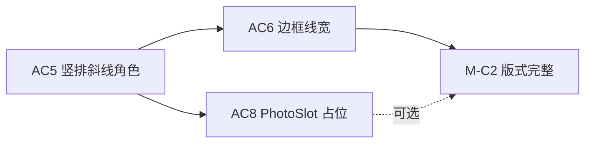
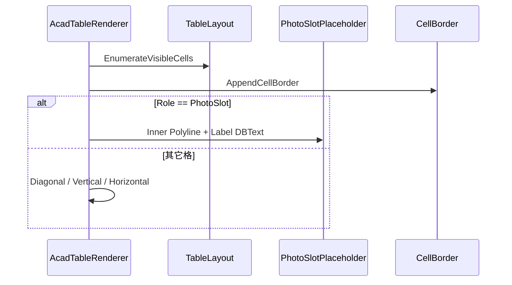

# AC8 · PhotoSlot 占位框详解（008h）

> 文档编号：008h（008 的子文档，专述 **AC8**）  
> 生成日期：2026-06-25  
> 上游总计划：[008 AutoCAD 表格制作分阶段实施计划](./008-AutoCAD表格制作分阶段实施计划-2026-06-25-143000.md)  
> 前置步骤：[008e AC5 竖排/斜线/角色](./008e-AC5-复杂版式竖排斜线角色详解-2026-06-25-170000.md)（**Must**）；[008f AC6 边框线宽](./008f-AC6-边框线宽与外框加粗详解-2026-06-25-170000.md)（**可选并行**，占位内线宽可复用 AC6 线段 API）  
> 设计规格：[005 §8 D6 样表「照片」格 / §9.1 黄金用例](./005-复杂表格Domain统一设计-2026-06-24-232335.md)  
> 视觉对标：[HtmlTableAdapter `role-photoslot`](../../../src/HyCAD.Tables/Adapters/HtmlTableAdapter.cs) + `TableSamples.BuildPersonnelTable()`  
> 性质：**AC8 执行规格**——足够细到可单独开 Plan 编码；不写方法体，但给出占位几何、文字策略、主循环分支、Html 对齐表与验收清单。  
> 用法：实现 AC8 时以本文 + 008 §AC8 为唯一真相；**MoSCoW = Could**，不阻塞 M-C1；与 AC6 并行可收口 **M-C2 人员表完整版式**。

---

## 0. AC8 在一整条链里的位置



**AC5 已定稿行为**（[`008e` §6.1](./008e-AC5-复杂版式竖排斜线角色详解-2026-06-25-170000.md)）：遇 `CellRole.PhotoSlot` → **跳过文字**，仍画单元格外框；不读 `GridEditor.GetValue`。

**AC8 核心原则**：

```text
TableLayout.Bounds（PhotoSlot 合并格）
    → 外框：沿用 AC2/AC6 网格边框（不变）
    → 内框：Inset 闭合 Polyline（占位矩形）
    → 标签：居中 DBText「照片」（来自 Options，非 Domain 值）
    → 不插入 Block / OLE / 图片文件
```

- **禁止**在 AC8 实现图片 Block、OLE、RasterImage（D6 完整版留 V2）。  
- **禁止**修改 `HyCAD.Tables` Domain 类型或 `TableSamples` 结构（除非验收需显式 `CellValue`，见 §6.4）。  
- **禁止**把 PhotoSlot 内框当作 AC3 表级 JSON 载体（载体仍为表外框 `Polyline`）。

**与 008 总计划对齐**：008 §AC8 一句话——「合并格内画矩形占位 + 『照片』文字」；008 §1.3 OUT 明确「插入图片 Block → AC8 **可选**」，本步只做占位。

---

## 1. 目标与完成定义（DoD）

### 1.1 一句话目标

**扩展 `AcadTableRenderer`：当 `structure.Roles[addr] == CellRole.PhotoSlot` 时，在合并格内绘制内缩占位矩形 + 居中「照片」标签，与 Html `role-photoslot` 语义对齐（Degraded：CAD 无灰底填色，用内线框表达占位）。**

### 1.2 AC8 Definition of Done（全部勾选才算完成）

- [ ] 主循环 `PhotoSlot` 分支：调用 `AppendPhotoSlotPlaceholder(...)`，**不再** `continue` 跳过
- [ ] 内缩占位框：闭合 `Polyline`（或 AC6 四段 `Line`），图层/线宽可配置
- [ ] 占位标签：`DBText` 默认「照片」，在占位区内水平+垂直居中
- [ ] `AcadTableRenderOptions` 增加 PhotoSlot 专用参数（§4）
- [ ] `AcadTableCapability.PhotoSlot` 从 `NotSupported` 升为 `Degraded`（若 AC5 已引入该类型）
- [ ] **不**读取/绘制 PhotoSlot 格的 `GridEditor.GetValue` 整格文字（与 AC5 一致）
- [ ] `dotnet build src\HyCADTool\HyCADTool.csproj -c Debug` **0 error**
- [ ] **C2→C1** 插入 `TableSamples.BuildPersonnelTable()`：地址 `(1,6)` rowspan=3 照片列目视有内线框 + 「照片」居中
- [ ] 与 `html-samples/personnel.html` 并排：Html 灰底空 td ↔ CAD 内线框+标签，**语义一致**
- [ ] **不**实现 Hatch 填色、图片路径、Block 定义（V2）
- [ ] `HyCAD.Tables` 仍零 `Autodesk.*`

---

## 2. 范围边界

### 2.1 IN（AC8 必须做）

| # | 工作包 | 交付 |
|---|---|---|
| W1 | 主循环分支 | `PhotoSlot` → `AppendPhotoSlotPlaceholder` |
| W2 | 内缩矩形几何 | `LayoutRect` → inset `Polyline` 四点 |
| W3 | 占位标签文字 | 居中 `DBText`，文案来自 Options |
| W4 | 选项扩展 | `AcadTableRenderOptions` PhotoSlot 段 |
| W5 | 能力矩阵 | `AcadTableCapability.PhotoSlot = Degraded` |
| W6 | 联调验收 | 人员表 `(1,6)` + 可选单测 |

### 2.2 OUT（AC8 明确不做）

| 内容 | 留给 |
|---|---|
| 插入用户图片 Block / OLE / `RasterImage` | V2（005 D6 完整版） |
| 单元格灰底 `Hatch` / 实心填充 | V2（Html `#f5f5f5` 近似） |
| PhotoSlot 识别（从矩形+字反推 Role） | AC9+ |
| WPF 选图 / 绑定图片路径 FieldKey | AC11 或独立命令 |
| 修改 `HtmlTableAdapter` 输出「照片」字 | Html 保持空 td + CSS；CAD 侧由 Renderer 补标签 |
| 双 PhotoSlot / 非合并单格 | MVP 支持任意 `PhotoSlot` 格；黄金验收仅人员表合并格 |
| Domain 新增 `PhotoSlotMetadata` | 禁止；占位文案走 Options |

---

## 3. Html 对标：能力矩阵（AC8 必须对齐）

| 特性 | HtmlTableAdapter | AC8 AutoCAD 目标 | 级别 |
|---|---|---|---|
| PhotoSlot 格识别 | `class="role-photoslot"` | `Roles[addr] == PhotoSlot` | **Full** |
| 视觉占位 | `background-color: #f5f5f5` | 内缩闭合线框（无填充） | **Degraded** |
| 格内文字 | 空（无 `CellValue`） | 固定「照片」居中标签 | **Degraded**（CAD 补语义，Html 靠样式） |
| 合并 rowspan | `rowspan="3"` 等同 | `TableLayout` 大 `Bounds` | **Full** |
| 边框 | 与普通 td 相同 collapse | 外框走 AC2/AC6 | **Full** |

**验收口径**：人员表右侧 3 行合并照片列——Html 为浅灰空块，CAD 为「外框 + 内矩形 + 照片二字」；不要求 CAD 有灰底，但占位区域**一眼可辨**。

---

## 4. 工作包 W4：`AcadTableRenderOptions` 扩展

在 [`AcadTableRenderOptions.cs`](../../../src/HyCADTool/Features/Tables/Infrastructure/AutoCad/AcadTableRenderOptions.cs) 增加：

| 属性 | 类型 | 默认 | 说明 |
|---|---|---|---|
| `PhotoSlotLabelText` | `string` | `"照片"` | 占位居中标签；可改为「相片」等 |
| `PhotoSlotInsetMm` | `double` | `2.0` | 内框相对 `Bounds` 四边内缩（mm） |
| `PhotoSlotInnerLayerName` | `string` | 同 `GridLayerName` | 内线框图层 |
| `PhotoSlotTextLayerName` | `string` | 同 `TextLayerName` | 标签文字图层 |
| `PhotoSlotLabelTextHeightMm` | `double` | `0` | `0` = 使用 `DefaultTextHeightMm` |
| `PhotoSlotUseDashedInnerBorder` | `bool` | `false` | MVP 默认实线；`true` 时内线 `Linetype = DASHED`（需图层/线型已加载） |
| `PhotoSlotInnerBorderWidthMm` | `double` | `0` | `0` = 与网格内框同宽（AC6 未合入时用 Polyline 默认） |

**不新增 Scale**：与 008 §1.4 一致，全部 mm 1:1。

---

## 5. 工作包 W1–W3：渲染逻辑

### 5.1 主循环插入点（替换 AC5 `continue`）

```text
foreach (var cell in layout.EnumerateVisibleCells())
{
    AppendCellBorder(cell.Bounds);                    // AC2/AC6 不变

    if (structure.Roles.TryGetValue(cell.Addr, out var role) && role == CellRole.PhotoSlot)
    {
        AppendPhotoSlotPlaceholder(cell.Bounds, ...);
        continue;                                     // 不走水平/竖排/斜线/整格值
    }

    if (structure.Diagonals.TryGetValue(cell.Addr, out var split))
        AppendDiagonalCell(...);
    else if (ResolveEffectiveStyle(...).Orientation == VerticalStacked)
        AppendVerticalStackedText(...);
    else
        AppendHorizontalText(...);
}
```

**优先级**：`PhotoSlot` **高于** `DiagonalSplit` / `VerticalStacked`（Domain 不应在同一 anchor 并存；若冲突以 `PhotoSlot` 为准并忽略其它）。

**Hidden 格**：PhotoSlot 仅出现在 **可见 anchor**（人员表 `(1,6)`）；`(2,6)`/`(3,6)` 为 hidden，不进入循环——与 AC2 一致。

### 5.2 内缩矩形几何（W2）

**输入**：`LayoutRect bounds`（Down 系：`Top > Bottom`）。

**内框**（inset = `PhotoSlotInsetMm`）：

```text
innerLeft   = bounds.Left   + inset
innerRight  = bounds.Right  - inset
innerTop    = bounds.Top    - inset
innerBottom = bounds.Bottom + inset
```

**合法性**：若 `innerRight <= innerLeft` 或 `innerTop <= innerBottom`（极窄格），**只画标签、不画内框**，并 `Debug`/`WriteMessage` 可选警告——人员表不会出现。

**实体**：

| 方案 | 做法 | 推荐 |
|---|---|---|
| A | 闭合 `Polyline` 4 点，与 AC2 `CreateCellBorder` 同构 | **MVP 默认** |
| B | AC6 已合入时，四条 `Line` + `ConstantWidth` | AC6 后可选统一 |

顶点顺序（闭合）：`(innerLeft, innerTop) → (innerRight, innerTop) → (innerRight, innerBottom) → (innerLeft, innerBottom)`。

Z = `ZElevation`；图层 = `PhotoSlotInnerLayerName`。

**线型**：`PhotoSlotUseDashedInnerBorder == true` 时设 `LinetypeId`（从 `Database` 加载 `DASHED` 或 `HIDDEN`）；失败则回退实线，不抛。

### 5.3 占位标签（W3）

**文案**：`PhotoSlotLabelText`（默认「照片」）。

**字高**：

```text
height = PhotoSlotLabelTextHeightMm > 0
       ? PhotoSlotLabelTextHeightMm
       : DefaultTextHeightMm
```

**对齐**：在 **内框矩形**（若已画）或 **全格 bounds**（内框跳过时的回退）内居中：

- 水平：`x = (innerLeft + innerRight) / 2` 或 `(Left + Right) / 2`
- 垂直：`y = (innerTop + innerBottom) / 2` 或 `(Top + Bottom) / 2`
- `DBText`：`HorizontalMode = TextCenter`，`VerticalMode = TextVerticalMid`，对齐点 `(x, y)` + `AdjustAlignment`

**复用**：`AcadTableTextMapper.ApplyAlignment` 可扩展 overload「已知中心点」；或新建 `AcadTablePhotoSlotRenderer.cs` 纯函数。

**与 Domain 值关系**：**忽略** `GridEditor.GetValue(grid, addr)`。若将来 Domain 写入路径/文件名，AC8 仍不渲染——V2 Block 命令再读。

### 5.4 黄金验收格（人员表）

| 项 | 值 |
|---|---|
| 地址 | `(1, 6)` anchor |
| 合并 | `rowSpan: 3`, `colSpan: 1` |
| Role | `CellRole.PhotoSlot` |
| CellValue | **无**（与 [`TableSamples.cs`](../../../src/HyCAD.Tables/Samples/TableSamples.cs) 一致） |
| 预期 CAD | 3 行高窄列：外框 + 内矩形 + 「照片」垂直水平居中 |

---

## 6. Domain / 样表（W6）

### 6.1 是否改 `TableSamples`

**默认不改**。`BuildPersonnelTable()` 已设 Role + Merge，无 CellValue——足够驱动 AC8。

### 6.2 可选增强（非 DoD）

若希望 N34 读回时 PhotoSlot 格带占位文本，可在样表加：

```csharp
grid = GridEditor.SetValue(grid, new CellAddr(1, 6), new CellValue("照片"));
```

**AC8 Renderer 仍忽略该值**，避免与 Options 文案冲突；仅便于 JSON 目视。团队可不做。

### 6.3 Html 侧现状

[`HtmlTableAdapter`](../../../src/HyCAD.Tables/Adapters/HtmlTableAdapter.cs) 对 PhotoSlot 仅加 `role-photoslot` CSS 灰底，**不**输出「照片」字。AC8 CAD 补字是 **有意 Degraded 差异**，在 `AcadTableCapability` 注明。

---

## 7. 工作包 W5：`AcadTableCapability` 更新

若 AC5 已引入 [`AcadTableCapability`](../../../src/HyCADTool/Features/Tables/Infrastructure/AutoCad/AcadTableCapability.cs)（见 008e §7）：

```csharp
PhotoSlot = AdapterFeatureLevel.Degraded,  // AC8：内线框 + 标签，无图片/填色
```

并在类注释中列出 Degraded 项：无 Hatch、无 Block、标签文案固定 Options。

若 AC5 未引入该文件，AC8 **可顺带新增** 最小 `AcadTableCapability`（非阻塞）。

---

## 8. 与 AC5 / AC6 / AC3 的接口

| 步骤 | 关系 |
|---|---|
| AC5 | AC8 **替换** PhotoSlot 的 `continue`；竖排/斜线/角色逻辑不变 |
| AC6 | 外框线宽走 `BorderGridResolver`；PhotoSlot **内框**可用 `PhotoSlotInnerBorderWidthMm` 或略细于外框；避免与表级载体 Polyline **重复**（内框 ≠ 表 `TableBounds`） |
| AC3 | 新实体（内线、标签）**不写** XData；JSON 仍在表外框载体 |
| AC4 | C1 插入人员表即验收夹具 |
| AC7 | 再渲染自动带 PhotoSlot（读回 grid 后 `Render`） |

### 8.1 AC3 载体边界

表级载体 = `TableLayout.TableBounds` 外框 **一条** Polyline（AC3）。PhotoSlot 内框是 **子几何**，Handle 不在 XData 中。拾取时仍选表外框。

---

## 9. 文件与命名空间

```text
src/HyCADTool/Features/Tables/Infrastructure/AutoCad/
  AcadTableRenderer.cs              ← W1：主循环 + AppendPhotoSlotPlaceholder
  AcadTableRenderOptions.cs         ← W4
  AcadTablePhotoSlotRenderer.cs     ← 可选 W2–W3 纯函数（inset rect + label point）
  AcadTableCapability.cs            ← W5 更新
```

- **命名空间**：`HyCADTool.Features.Tables.Infrastructure.AutoCad`  
- **纯函数**：`PhotoSlotGeometry.TryGetInnerRect(bounds, inset, out inner)` → 可放主工程单测

---

## 10. 渲染管线（AC8 增量）



| 步骤 | AC5 | AC8 增量 |
|---|---|---|
| PhotoSlot | skip 文字 | 内框 + 「照片」 |
| 外框 | Polyline / AC6 Line | 不变 |
| 实体数/格 | 1 边框 | 1 边框 + 1 内框 + 1 DBText |

---

## 11. 测试与验收策略

### 11.1 可自动化（建议）

| 用例 | 断言 |
|---|---|
| `PhotoSlot_inner_rect_inset_2mm` | bounds 100×80, inset 2 → inner 96×76 |
| `PhotoSlot_inner_rect_too_small_skips_border` | inset 大于半宽 → 无内框、仍算 label 中心 |
| `PhotoSlot_label_center` | inner 矩形中心 = DBText 对齐点 |
| `BuildPersonnelTable_has_photo_role_at_1_6` | 已有 P8 单测覆盖 Role |

主工程 `HyCADTool.Tests` 或 `Features/Tables/Tests`——**非 AC8 阻塞**。

### 11.2 手动验收清单（C2→C1）

| # | 场景 | 预期 |
|---|---|---|
| P1 | `BuildPersonnelTable()` @ 原点 | `(1,6)` 合并列有内矩形 + 「照片」居中 |
| P2 | 照片列高度 | 内框随 3 行合并拉高，标签仍在视觉中心 |
| P3 | 无 PhotoSlot 格 | 其它格不受 AC8 影响（姓名/竖排等正常） |
| P4 | Html 并排 | `personnel.html` 右侧灰块 ↔ CAD 内线框+字，位置对齐 |
| P5 | N34 读回 | round-trip 仍通过；Role PhotoSlot 保留 |
| P6 | AC7 再渲染 | 新表照片格同样正确 |
| P7 | 改 `PhotoSlotLabelText="PHOTO"` | C2 后标签变更（验证 Options 生效） |

### 11.3 M-C2 收口

008 **M-C2**：AC5 + AC6（+AC8 可选）→ 两张黄金样表与 HTML 视觉对齐。AC8 单独完成时，**人员表照片列**达标即可；家庭表无 PhotoSlot，无需测。

---

## 12. 风险与对策

| 风险 | 对策 |
|---|---|
| 内框与 AC6 外框线重叠过密 | `PhotoSlotInsetMm` 默认 2mm；可调 |
| 无 Hatch 与 Html 灰底差异大 | 接受 Degraded；V2 可选 `Solid Hatch` 254 色 |
| 虚线线型未加载 | try/catch 回退实线 |
| PhotoSlot 格误设 `CellValue` 长文本 | Renderer 忽略整格值，仅画 Options 标签 |
| 实体数 +2/PhotoSlot 格 | 人员表仅 1 格，可接受 |
| AC5 未合入就写 AC8 | 硬依赖 AC5 主循环三分支+PhotoSlot 检测；无 AC5 则在 AC2 循环内加 Role 判断 |
| 与 AC3 载体混淆 | 文档 §8.1；内框不写 XData |

---

## 13. 实施顺序（单次 Plan 建议）

```text
1. AcadTableRenderOptions PhotoSlot 段（§4）
2. PhotoSlotGeometry 纯函数 + 可选单测（§5.2–5.3）
3. AppendPhotoSlotPlaceholder（Polyline + DBText）
4. 主循环替换 AC5 continue（§5.1）
5. AcadTableCapability.PhotoSlot = Degraded（§7）
6. dotnet build 0 error
7. 用户 C2→C1 人员表 P1–P7
8. 勾选 §1.2 DoD
```

预计 **0.5–1 次编码会话**（S 规模）；主要为 inset 与居中微调。

---

## 14. AC8 完成后交付清单

| 路径 | 说明 |
|---|---|
| `AcadTableRenderer.cs` | PhotoSlot 分支 |
| `AcadTableRenderOptions.cs` | PhotoSlot 参数 |
| `AcadTablePhotoSlotRenderer.cs` | 可选纯函数 |
| `AcadTableCapability.cs` | PhotoSlot = Degraded |

**不交付**：图片 Block、Hatch、Domain 变更、Html 适配器变更、AC9 识别。

---

## 15. 变更记录

| 日期 | 说明 |
|---|---|
| 2026-06-25 | 008h 初版：AC8 PhotoSlot 占位执行规格；内缩矩形 + 居中标签；Html Degraded 对齐；人员表 (1,6) 验收 P1–P7 |

---

> **下一步**：确认 AC5 DoD 全绿后，按 §13 开 Plan 编码 AC8（可与 AC6 并行）；DoD 全绿后 M-C2 人员表版式项收口。图片 Block 插入留 V2，不在 AC8 范围。
