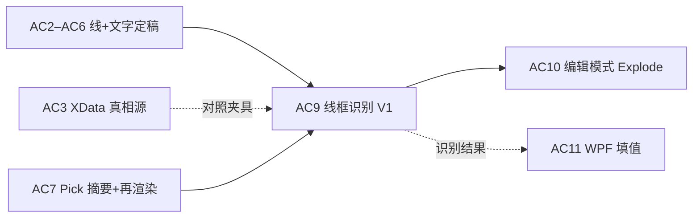
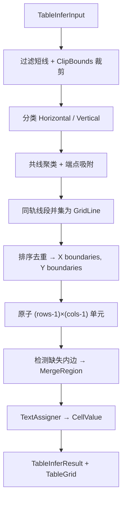

# AC9 · 线框识别 V1（规整网格 + 矩形合并）详解（008i）

> 文档编号：008i（008 的子文档，专述 **AC9**）  
> 生成日期：2026-06-25  
> 上游总计划：[008 AutoCAD 表格制作分阶段实施计划](./008-AutoCAD表格制作分阶段实施计划-2026-06-25-143000.md)  
> 前置步骤：[008g AC7 拾取已有表格](./008g-AC7-拾取已有表格摘要与再渲染详解-2026-06-25-170000.md)（**Should，联调入口**）；AC2–AC6 渲染产物为 **黄金夹具**  
> 设计规格：[005 §6.3 双模式 / 003 §5.2 识别算法纲要](./005-复杂表格Domain统一设计-2026-06-24-232335.md)、[004 §7.3–7.4 识别流程与规则](./004-AutoCAD复杂表格Domain设计-2026-06-24-230100.md)  
> 性质：**AC9 执行规格**——足够细到可单独开 Plan 编码；不写方法体，但给出管线阶段、容差常量、DTO 形状、单测矩阵、Diff 门与验收清单。  
> 用法：实现 AC9 时以本文 + 008 §AC9 为唯一真相；**纯算法放 `HyCAD.Tables`，AutoCAD 采集放 `HyCADTool`**；DoD 全绿后再开 AC10（编辑模式）。

---

## 0. AC9 在一整条链里的位置



**AC9 核心原则**：

```text
用户框选 / 点选范围内 Line+Polyline+DBText/MText
    → AcadTableEntityCollector 归一化为 mm 线段 + 文字框
    → TableInferEngine（纯 Domain）聚线 → 网格 → 合并 → 文字归属
    → TableInferResult（draft TableGrid + 置信度 + 存疑列表）
    → 可选：与 XData 真相源 Diff → 人工确认门
    → 确认后：TableSummaryBuilder / Renderer / Store 消费同一 TableGrid
```

- **禁止**在识别器内读 `HY_TABLE` JSON 作为结构输入（那是 AC3/AC7 路径；AC9 只从几何反推）。  
- **禁止** V1 推断斜线 `DiagonalSplit`、竖排 `VerticalStacked`、`CellRole`、`FieldKey`（留给 AC9.1 / AC11）。  
- **禁止**把 `Autodesk.*` 引用放进 `HyCAD.Tables`——采集与 Diff 预览实体创建只在 `HyCADTool`。

**与 AC7 的分工**：

| 路径 | 输入 | 输出 |
|---|---|---|
| AC7 `PickTableCommand`（N35） | 带 `HY_TABLE` 的载体 Polyline | JSON 读回 → 摘要 / 再渲染 |
| AC9 `InferTableCommand`（N36） | 散落线框 + 文字（无 XData 或 Explode 后） | 几何反推 `TableGrid` draft |

AC10 完成后，退出编辑模式 **自动调用** AC9；AC9 独立命令用于 PoC 与无编辑模式的「手工框选识别」。

---

## 1. 目标与完成定义（DoD）

### 1.1 一句话目标

**从模型空间中选定的水平/竖直线段与文字实体，反推 `GrowDirection.Down` 的规整网格拓扑、矩形 `MergeRegion` 集合、以及各 Anchor 格的纯文本值，产出可通过 `GridInvariants.Validate` 的 draft `TableGrid`。**

### 1.2 AC9 Definition of Done（全部勾选才算完成）

- [ ] 新增 `HyCAD.Tables/Inference/`：`TableInferEngine`、`TableInferOptions`、`TableInferResult`、线段/文字 DTO（**零** `Autodesk.*`）
- [ ] 新增 `HyCADTool/.../AcadTableEntityCollector.cs`：SelectionSet → 归一化 DTO
- [ ] 新增 `TableInferService.cs`：编排 Collect → Infer → 可选 Diff
- [ ] 新增 `InferTableCommand.cs`：`Execute()` 无 `[CommandMethod]`
- [ ] `commands.json`：`N36` → `InferTableCommand.Execute`；同步 `bin\Debug`
- [ ] `TestCommand.Run()` 一行指向 `InferTableCommand`（C1 联调）
- [ ] `HyCAD.Tables.Tests/TableInferEngineTests.cs`：**≥ 15** 用例全绿（纯几何，无 CAD）
- [ ] `dotnet build src\HyCADTool\HyCADTool.csproj -c Debug` **0 error**
- [ ] `dotnet test src/HyCAD.Tables.Tests` 全绿（含 `PlatformIndependenceTests`）
- [ ] **Explode 回归**：AC2 渲染的 3×3 均匀表 + 人员表子集，识别后行列/合并/文字归属与源表一致率 **≥ 95%**（§10 指标）
- [ ] 识别失败 / 低置信：命令行输出原因 + **不**静默写入 XData（写真相源留给用户确认后的 AC3 路径或 AC10）
- [ ] **不**实现 Explode 编辑模式（AC10）、WPF 面板（AC11）、斜线/竖排/FieldKey 反推（AC9.1+）

---

## 2. 范围边界

### 2.1 IN（AC9 V1 必须做）

| # | 工作包 | 交付 |
|---|---|---|
| W1 | 归一化 DTO + 选项 | `Inference/TableInferInput.cs`、`TableInferOptions.cs` |
| W2 | 线段聚类 | 水平/竖直分类、共线合并、坐标吸附 |
| W3 | 网格线提取 | 候选 `X[]`、`Y[]` 边界数组 |
| W4 | 拓扑构建 | `GridTopology` + 非均匀 `GridTrack.Size`（由线间距推导） |
| W5 | 合并推断 | 缺失内部分隔线 → `MergeRegion` |
| W6 | 文字归属 | DBText/MText → Anchor 格 `CellValue.Text` |
| W7 | 纯引擎 | `TableInferEngine.Infer(input) → TableInferResult` |
| W8 | CAD 采集 | `AcadTableEntityCollector` |
| W9 | 编排 + Diff | `TableInferService`；可选与 AC3 读回对比 |
| W10 | 存疑高亮 | 低置信格命令行列表 + 可选 `Transient` 矩形（Infrastructure） |
| W11 | 命令注册 | N36 + TestCommand |
| W12 | 单测 + 手动验收 | §9 + §10 |

### 2.2 OUT（AC9 V1 明确不做）

| 内容 | 留给 |
|---|---|
| 斜线 `DiagonalSplit` 识别 | AC9.1（V2.1） |
| 竖排 `VerticalStacked`（逐字 MText）识别 | AC9.1 |
| 不等宽/不等高 **且无完整网格线** 的手绘表 | AC9.2（V2.2） |
| `FieldKey` / `CellRole` / 公式 / 绑定值推断 | AC11 或 AC9.3 |
| 边框线宽 / 线型 / 图层语义 | AC6 渲染侧；识别器忽略 |
| PhotoSlot 图片 Block | AC8 |
| Explode + 编辑前 JSON 备份 | AC10 |
| 识别后自动写 `HyTable_JSON` | 用户确认后由现有 Store 写入（可复用 AC3 API） |
| 原生 `AcDbTable` 实体识别 | AC12 |
| `GrowDirection.Up` | V2 |

### 2.3 V1 支持的输入形态（硬边界）

| 形态 | 支持 | 说明 |
|---|---|---|
| AC2 `AcadTableRenderer` 输出的单元格 `Polyline` 边框 | ✅ | 主回归夹具 |
| 用户手画 `LINE` / 闭合 `Polyline` 网格 | ✅ | 须形成完整 H/V 网格线 |
| 合并格「少画内线」 | ✅ | 核心能力：缺线 = 合并 |
| 表格外框单独加粗（AC6） | ✅ | 线宽忽略，只取几何 |
| 单元格内对角 `Line`（AC5 斜线） | ⚠️ 忽略 | 不报错；文字仍落 Anchor 全格 |
| 竖排逐字 MText | ⚠️ 降级 | 多实体按 Y 排序拼接为一行文本写入 Anchor |
| 仅外框无线、或 T 型缺线 | ❌ | 返回 `InferStatus.IncompleteGrid` |
| 倾斜网格（非 0°/90°） | ❌ | θ 容差外拒绝 |

---

## 3. 建议目录与命名空间

```text
src/HyCAD.Tables/
  Inference/
    TableInferInput.cs           ← W1 输入 DTO
    TableInferOptions.cs         ← W1 容差
    TableInferResult.cs          ← W7 输出 + 状态枚举
    TableInferEngine.cs          ← W2–W7 纯算法
    LineSegment2d.cs             ← W1 水平/竖直线段
    TextBox2d.cs                 ← W1 文字包围盒 + 内容
    GridLineSet.cs               ← W3 候选网格线
    MergeInferencer.cs           ← W5 可拆分 partial
    TextAssigner.cs              ← W6

src/HyCAD.Tables.Tests/
  TableInferEngineTests.cs       ← W12

src/HyCADTool/Features/Tables/
  Application/
    TableInferService.cs         ← W9 编排
    TableInferDiff.cs            ← W9 与 golden TableGrid 对比
  Infrastructure/AutoCad/
    AcadTableEntityCollector.cs  ← W8
    TableInferPreview.cs         ← W10 可选 Transient 高亮
  Commands/
    InferTableCommand.cs         ← W11 N36
```

- **命名空间**：`HyCAD.Tables.Inference` / `HyCADTool.Features.Tables.Application`  
- **异常**：引擎内用 `InferStatus` + `Messages`；仅编程错误抛 `ArgumentException`

---

## 4. 工作包 W1：`TableInferInput` 与容差

### 4.1 输入 DTO（平台无关）

```csharp
namespace HyCAD.Tables.Inference;

public sealed class TableInferInput
{
    public IReadOnlyList<LineSegment2d> Segments { get; init; }
    public IReadOnlyList<TextBox2d> Texts { get; init; }
    public LayoutRect? ClipBounds { get; init; }  // 可选：框选外包络
}

public readonly record struct LineSegment2d(
    double X1, double Y1, double X2, double Y2,
    LineOrientation Orientation);  // Horizontal | Vertical

public readonly record struct TextBox2d(
    LayoutRect Bounds,
    string Content,
    double HeightMm);
```

采集层职责：把 `Polyline` 拆为 H/V 边、`DBText`/`MText` 转为 `TextBox2d`（内容取 `TextString` / 纯文本，**不**解析 `\P` 竖排语义）。

### 4.2 `TableInferOptions` 默认容差（mm / 度）

| 常量 | 默认 | 用途 |
|---|---|---|
| `AngleToleranceDeg` | 2.0 | 线段归类 H/V |
| `EndpointSnapMm` | 1.0 | 端点吸附为同交点 |
| `LineMergeGapMm` | 1.0 | 共线共轨线段合并间隙 |
| `GridLineMinLengthMm` | 5.0 | 过滤噪声短线 |
| `TextInCellMarginMm` | 2.0 | 文字中心落格扩展边距 |
| `TrackSizeRelativeTolerance` | 0.02 | 相邻轨道尺寸相对差 ≤2% 视为等距（可选校验） |
| `MinRows` / `MinCols` | 1 / 1 | 退化拒绝 |

**坐标系**：与 AC1 `TableLayout` 一致——模型空间 mm，`GrowDirection.Down`，Y 向下减小。

### 4.3 输出 `TableInferResult`

```csharp
public enum InferStatus
{
    Success,
    IncompleteGrid,      // 网格线不足以闭合
    AmbiguousMerge,      // 合并推断多解
    TooManySegments,     // 超出 V1 规模保护
    NoTextNoStructure,   // 仅有线无格
}

public sealed class TableInferResult
{
    public InferStatus Status { get; init; }
    public TableGrid? Grid { get; init; }
    public IReadOnlyList<string> Messages { get; init; }
    public IReadOnlyList<CellAddr> UncertainCells { get; init; }
    public double OverallConfidence { get; init; }  // 0..1
    public GridLineSet? DebugGridLines { get; init; } // 单测 / 日志
}
```

---

## 5. 工作包 W2–W3：线段聚类与网格线提取

### 5.1 管线总览



### 5.2 W2 聚类规则（固定顺序）

1. **方向**：`|ΔX| ≥ |ΔY|` → Horizontal，否则 Vertical；近 45° 的线段 **丢弃** 并记入 `Messages`（斜线 AC5 不影响网格）。  
2. **坐标归一**：Horizontal 取 `Y = round(Y1, snap)`；Vertical 取 `X = round(X1, snap)`。  
3. **共线合并**：同 Orientation + 同坐标值，投影区间 `[min(x1,x2), max(x1,x2)]` 若间隙 ≤ `LineMergeGapMm` 则并集。  
4. **Clip**：线段中点不在 `ClipBounds` 内则丢弃（可选）。

### 5.3 W3 网格边界数组

- **列边界 `X[0..cols]`**：所有 Vertical 网格线的 X，排序去重（snap 后）。  
- **行边界 `Y[0..rows]`**：所有 Horizontal 网格线的 Y，排序去重。  
- **表外框**：`X[0], X[cols], Y[0], Y[rows]` 必须存在线段覆盖（覆盖度 ≥ 80% 边长，容差内）。  
- **行列数**：`rows = Y.Count - 1`，`cols = X.Count - 1`；任一为 0 → `IncompleteGrid`。

**轨道尺寸**：

```text
Col[i].Size = X[i+1] - X[i]
Row[j].Size = Y[j] - Y[j+1]   // Down：Y 递减
```

V1 **允许非均匀**列宽/行高（由实际线间距决定）；「等间距」只是 AC2 均匀表夹具的特例，不是硬要求。

---

## 6. 工作包 W4–W5：拓扑与合并推断

### 6.1 原子网格与 hidden

Domain 模型：**底格全保留**（005 §3.6）。推断步骤：

1. 由 `rows × cols` 生成完整 `GridTopology`。  
2. 对每个原子格 `(r,c)`，其四边应对应四条网格线段；若某 **内边**（非表外框）在 `Segments` 中 **缺失**（无覆盖线段），则该边视为「合并边界」。  
3. 将共享缺失边的相邻原子格 **并查集** 合并 → 每个连通块一个 `MergeRegion`（取最小 `(r,c)` 为 `TopLeft`，span 为块尺寸）。  
4. 非 Anchor 格在 `GridStructure` 中标记 hidden（与 `GridEditor` / `TableLayout` 同口径）。

### 6.2 合并推断约束

| 规则 | 说明 |
|---|---|
| 仅矩形合并 | V1 不支持 L 型 / 十字合并；并查集结果必须是轴对齐矩形，否则 `AmbiguousMerge` |
| 单 Anchor 文本 | 合并块内多个文字 → 全部归属 `TopLeft` Anchor，其余记 `UncertainCells` |
| 空合并块 | 允许；`CellValue` 为空 |
| 与渲染器互逆 | AC2 合并格不画内线 → AC9 缺线 → 同一 `MergeRegion`（**核心验收**） |

### 6.3 产出 `GridStructure` 最小集

```text
Topology: Rows/Cols 来自 W3
Merges:   W5 并查集矩形列表
Styles:   空（V1 不推断）
Diagonals: 空
FieldIndex: 空（V1 不推断 FieldKey）
```

`TableGrid.Data`：每个 **可见 Anchor 格** 写入 `CellValue.Text`（W6）；公式/绑定格降级为纯文本。

---

## 7. 工作包 W6：文字归属

### 7.1 归属算法（Anchor 格）

| 步骤 | 规则 |
|---|---|
| 1 | 对每个 `TextBox2d`，取中心点 `(cx, cy)` |
| 2 | 找包含该点的最小原子格（合并块内多点 → 归属 Merge Anchor） |
| 3 | 若中心点落在线条上（距 H/V 线 < `EndpointSnapMm`）→ 向格内偏移 `TextInCellMarginMm` 再试 |
| 4 | 无包含格 → 记入 `Messages`，不参与 Grid |
| 5 | 同一 Anchor 多文字：按 `(Y desc, X asc)` 排序，**空格**拼接（竖排 MText 降级为一行） |

### 7.2 不做的语义

- 不还原 `TextOrientation.VerticalStacked`  
- 不拆分斜线 `SubCell`  
- 不推断 `CellRole.Title` 等——标题只是普通文本写入对应 Anchor

---

## 8. 工作包 W7：`TableInferEngine` API

```csharp
namespace HyCAD.Tables.Inference;

public sealed class TableInferEngine
{
    public TableInferEngine(TableInferOptions? options = null);

    /// <summary>纯几何推断；不访问 AutoCAD。</summary>
    public TableInferResult Infer(TableInferInput input);
}
```

**后处理**（引擎内）：

1. `GridInvariants.Validate(grid)` — 失败则 `Status != Success`，`Messages` 含 violation。  
2. 计算 `OverallConfidence`：`1 - (UncertainCells.Count / visibleCellCount)`，下限 0。  
3. `OverallConfidence < 0.95` 时 **仍返回 Grid**，但 `Messages` 含「建议人工确认」。

---

## 9. 工作包 W8–W10：CAD 采集、编排、Diff

### 9.1 `AcadTableEntityCollector`

```csharp
public sealed class AcadTableEntityCollector
{
    public TableInferInput Collect(ObjectId[] ids, Transaction tr);
    public TableInferInput CollectFromSelection(Editor ed);  // 框选或点选
}
```

| 实体类型 | 处理 |
|---|---|
| `Line` | 转 `LineSegment2d` |
| `Polyline`（不闭合 / 闭合） | 逐边拆 H/V；忽略弧段 |
| `DBText` | `TextBox2d` + 包围盒（`GeometricExtents`） |
| `MText` | 同上；`Contents` 去格式符 |
| 其他 | 忽略 |

**图层过滤（可选）**：默认不过滤；若 AC2 使用 `HyTable_Grid` / `HyTable_Text`，可在 `TableInferOptions` 限定——**非必须**。

### 9.2 `TableInferService`

```csharp
public sealed class TableInferService
{
    public TableInferResult InferFromSelection(Editor ed);

    /// <summary>与 golden 对比；用于 Explode 回归与 AC7 对照。</summary>
    public TableInferDiff Compare(TableGrid inferred, TableGrid golden);

    /// <summary>用户确认后：Render + 可选 AcadTableStore.Write。</summary>
    public ObjectIdCollection ConfirmAndRender(TableGrid grid, Point3d insertionPoint, bool writeXData);
}
```

### 9.3 `TableInferDiff` 指标（≥95% 验收依据）

| 指标 | 计算 |
|---|---|
| `TopologyMatch` | `rows, cols` 相等且各 `Track.Size` 绝对误差 ≤ `EndpointSnapMm` |
| `MergeMatch` | 合并区数量相等且各 `TopLeft+Span` 集合一致 |
| `TextMatchRate` | golden 非空 Anchor 格中，inferred 同址文本 **归一化后**（trim、合并空白）相等比例 |
| **综合一致率** | `0.4×Topology + 0.3×Merge + 0.3×TextMatchRate`（单测与手动验收共用） |

**Field 数**：V1 不推断 `FieldKey`；008 原文「Field 数一致」在 V1 **代理为** `MergeMatch + TextMatchRate`（结构+文字）。AC9.3 再补 FieldKey 推断。

### 9.4 人工确认门（必须）

识别成功后命令行：

```
[HyTable] 识别完成: 7×7 | 合并 6 | 置信度 0.97
[HyTable] 存疑格: (2,3), (5,1)
[HyTable] 与选中载体 JSON 对比: 综合一致率 96%
[HyTable] 接受并渲染? [是(Y)/否(N)] <N>:
```

- 选 **Y**：`GetPoint` → `AcadTableRenderer.Render` + 可选 `AcadTableStore` 写新载体  
- 选 **N**：仅保留命令行日志，不写库  
- **禁止**跳过高置信度也自动写 DWG（005 风险：误识别必须可拒）

### 9.5 存疑高亮（W10，可选 MVP）

对 `UncertainCells` 在模型空间画临时矩形（`Transient` 或 `_HyTable_InferPreview` 层），命令结束删除。

---

## 10. 工作包 W11：命令注册

### 10.1 `InferTableCommand`

```csharp
public sealed class InferTableCommand
{
    public void Execute()
    {
        // PromptSelectionOptions：Line, Polyline, DBText, MText
        // inferService.InferFromSelection
        // WriteResult + optional Diff if user also picked HY_TABLE carrier
        // keyword Y/N → ConfirmAndRender
    }
}
```

### 10.2 `commands.json`

```json
"N36": {
  "type": "HyCADTool.Features.Tables.Commands.InferTableCommand",
  "method": "Execute",
  "category": "表格",
  "displayName": "线框识别(N36)",
  "tooltip": "框选线+文字，反推表格结构（AC9 V1）",
  "order": 156
}
```

（N33 插入、N34 读回、N35 拾取——AC4/AC7 已占用。）

### 10.3 `TestCommand.cs`

```csharp
new InferTableCommand().Execute();
```

**推荐联调流程**：

```text
1. AC4 C1 插入人员表
2. EXPLODE 全选表几何（或 COPY 到旁侧再 EXPLODE，保留 JSON 载体对照）
3. C2 → TestCommand 指向 N36 → C1 框选散开线+字
4. 目视 + Diff 一致率 ≥ 95% → Y 渲染
```

---

## 11. 单测矩阵（`TableInferEngineTests`）

| # | 场景 | 断言 |
|---|---|---|
| T1 | 3×3 均匀网格线，9 格各一字 | `Success`；9 Anchor 文本 |
| T2 | 2×2 缺中间竖线 | 1 个 `MergeRegion` ColSpan=2 |
| T3 | 2×2 缺中间横线 | 1 个 RowSpan=2 |
| T4 | 标题行 colspan=3 缺两条内线 | `MergeRegion`(0,0) ColSpan=3 |
| T5 | 照片格 rowspan=3 | RowSpan=3 |
| T6 | 文字中心在合并块右下角 | 归属 Anchor |
| T7 | 表内斜线线段 | `Success`；斜线忽略；文字仍落格 |
| T8 | 近 45° 噪声线 | 丢弃；`Messages` 含警告 |
| T9 | 缺外框一边 | `IncompleteGrid` |
| T10 | 仅一条线 | `IncompleteGrid` |
| T11 | 非均匀列宽 50+100 | `Col[0].Size≈50`, `Col[1].Size≈100` |
| T12 | 空表有线无字 | `Success`；全空 `CellValue` |
| T13 | 同格双 DBText | 拼接；`UncertainCells` 含该址或 `Messages` |
| T14 | `GridInvariants` | 所有 Success 用例 Validate 通过 |
| T15 | 与 `TableLayout` 互逆 | golden `TableGrid` → 合成线段 input → Infer → Diff ≥0.95 |

**T15 实现提示**：单测内用 `TableLayout` 生成 synthetic 线段（不引用 AutoCAD），作为 **渲染↔识别互逆** 黄金测。

---

## 12. 手动验收清单（C2→C1 / N36）

| # | 场景 | 预期 |
|---|---|---|
| V1 | Explode AC2 的 3×3 空表 | 3×3；0 合并；`Success` |
| V2 | Explode AC4 人员表 | 7×7；合并数与源一致；TextMatchRate ≥ 95% |
| V3 | Explode AC4 家庭表（含竖排） | 结构+合并正确；竖排降级为一行文本，不崩溃 |
| V4 | 手画 4×4 完整网格 + 手动输入文字 | 识别成功；Y 渲染可再 N34 读回（写 XData 时） |
| V5 | 框选含表外杂线 | 杂线忽略或 `Messages` 警告；不误并 |
| V6 | 识别后选 N | 无新实体 |
| V7 | 识别后 Y + 新基点 | 新表落图；旧 Explode 碎线保留 |
| V8 | 与 AC7 对照：先 N35 读 JSON Diff | 命令行打印一致率 |
| V9 | Esc 取消框选 | 静默退出 |
| V10 | 含 AC5 斜线格 Explode | 结构仍正确；斜线不进入 Diagonals |

---

## 13. 与 AC3 / AC7 / AC10 的接口

| 步骤 | 关系 |
|---|---|
| AC3 `AcadTableStore` | 用户确认 Y 后 **可选** 写 JSON；Infer 本身不读 JSON |
| AC7 `TableSummaryBuilder` | Infer 成功后 **复用** 同一 Builder 输出摘要 |
| AC7 `PickTableCommand` | V2 可加关键字「识别模式」→ 调 `TableInferService`（**非 AC9 必须**） |
| AC10 `TableEditModeService` | 退出编辑 → 调 `TableInferEngine`；编辑前 JSON 备份在 AC10 |
| AC11 WPF | 识别结果 `TableGrid` 可绑定面板——后续 |

---

## 14. 风险与对策

| 风险 | 对策 |
|---|---|
| Explode 后线段碎片化 | 聚类 W2 并集；T15 互逆单测 |
| 合并多解（缺线过多） | 矩形并查集校验；`AmbiguousMerge` + 拒识 |
| 竖排/斜线用户期望过高 | 命令行明确「V1 不还原竖排/斜线语义」 |
| 误识别静默落盘 | **人工确认门** §9.4；低置信列存疑格 |
| 性能（大表千条线） | `ClipBounds` + 表级包围盒预过滤；V1 上限可设 500 段 |
| Domain 污染 AutoCAD API | `PlatformIndependenceTests` + Inference 程序集零 Autodesk 引用 |
| 与 AC2 图层/线宽不一致 | 识别只看几何，不看线宽 |
| 范围蔓延到 FieldKey | 硬写 §2.2 OUT；一致率用 Diff §9.3 |

---

## 15. 实施顺序（单次 Plan 建议）

```text
1. HyCAD.Tables/Inference DTO + TableInferOptions
2. TableInferEngine W2–W6 + GridInvariants 后处理
3. TableInferEngineTests T1–T15（无 CAD）
4. AcadTableEntityCollector
5. TableInferDiff + TableInferService
6. InferTableCommand + N36 + TestCommand
7. dotnet build + dotnet test 全绿
8. 用户 V1–V10（Explode 回归）
9. 勾选 §1.2 DoD
```

预计 **2–3 次编码会话**（L 规模）；最大风险在 T15/V2 Explode 回归与合并缺线边界。

---

## 16. AC9 完成后交付清单

| 路径 | 说明 |
|---|---|
| `HyCAD.Tables/Inference/*.cs` | 纯推断引擎 |
| `HyCAD.Tables.Tests/TableInferEngineTests.cs` | ≥15 项 |
| `Features/Tables/Application/TableInferService.cs` | 编排 |
| `Features/Tables/Application/TableInferDiff.cs` | 对比 |
| `Features/Tables/Infrastructure/AutoCad/AcadTableEntityCollector.cs` | 采集 |
| `Features/Tables/Commands/InferTableCommand.cs` | N36 |
| `src/ReCall/commands.json` | N36 映射 |
| `App/Test/TestCommand.cs` | C1 指向 Infer |

**不交付**：`TableEditModeService`（AC10）、`TablePanel.xaml`（AC11）、斜线/竖排/FieldKey 识别（AC9.1+）。

---

## 17. 后续 AC9.x 路线图（本文不实施）

| 版本 | 内容 | 依赖 |
|---|---|---|
| **AC9.1** | 斜线 + 竖排识别 | AC5 渲染互逆样夹 |
| **AC9.2** | 不完整网格 / 手绘不等宽 | 辅助轨道推断 |
| **AC9.3** | FieldKey 启发式（标签格「姓名」→ `name`） | AC11 面板 |

---

## 18. 变更记录

| 日期 | 说明 |
|---|---|
| 2026-06-25 | 008i 初版：AC9 V1 管线、容差、DTO、合并缺线算法、Diff≥95% 验收、N36 注册、T1–T15/V1–V10；与 AC7/AC10 分工 |

---

> **下一步**：确认 AC2–AC4 与 AC7 DoD 全绿后，按 §15 开 Plan 编码 AC9；DoD 全绿后进入 [008 AC10](./008-AutoCAD表格制作分阶段实施计划-2026-06-25-143000.md#ac10--编辑模式v2could) 编辑模式（Explode + 退出识别闭环）。
