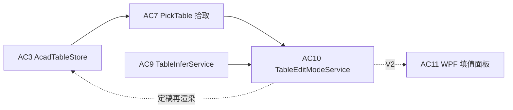
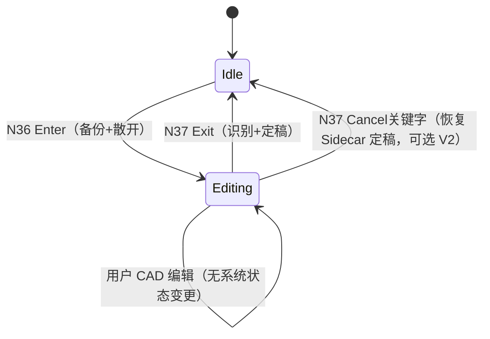
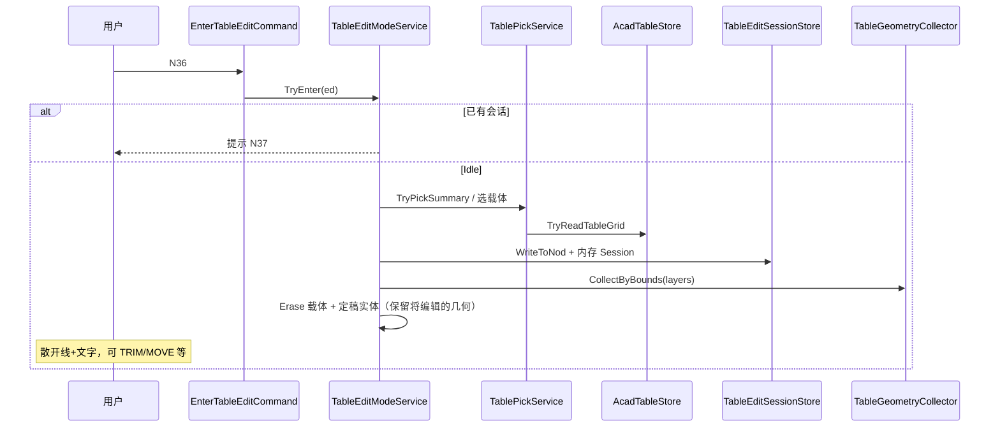
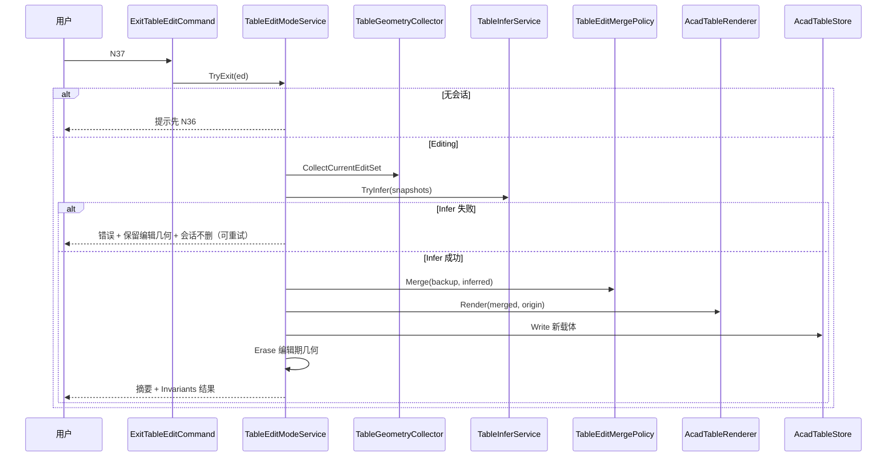

# AC10 · 编辑模式（散开 + 退出识别）详解（008j）

> 文档编号：008j（008 的子文档，专述 **AC10**）  
> 生成日期：2026-06-25  
> 上游总计划：[008 AutoCAD 表格制作分阶段实施计划](./008-AutoCAD表格制作分阶段实施计划-2026-06-25-143000.md)  
> 前置步骤：[008 AC3 XData 真相源](./008c-AC3-XData真相源读回round-trip详解-2026-06-25-170000.md)（**Must**）、[008 AC7 拾取已有表格](./008g-AC7-拾取已有表格摘要与再渲染详解-2026-06-25-170000.md)（**Must，拾取入口**）、[008 AC9 线框识别 V1](./008-AutoCAD表格制作分阶段实施计划-2026-06-25-143000.md#ac9--线框识别-v1v2could)（**Must，退出识别**；详规见 **008i**，未写前以 008 §AC9 + 本文 §8 为临时真相）  
> 设计规格：[005 §6.3 AutoCAD 双模式](./005-复杂表格Domain统一设计-2026-06-24-232335.md)、[004 §7 编辑模式设计](./004-AutoCAD复杂表格Domain设计-2026-06-24-230100.md)  
> 性质：**AC10 执行规格**——足够细到可单独开 Plan 编码；不写方法体，但给出状态机、Sidecar 备份、Enter/Exit 流程、命令注册与验收清单。  
> 用法：实现 AC10 时以本文 + 008 §AC10 为唯一真相；**退出识别只走 `TableInferService`（AC9）**；**编辑前 JSON 备份不依赖 Explode 后仍存在的 XData**。

---

## 0. AC10 在一整条链里的位置



**M-C3 闭环中的 AC10 职责**：

```text
定稿表（线+文字 + 载体 HY_TABLE）
    → Enter：备份 JSON Sidecar + 收集/散开几何 → 用户原生命令编辑
    → Exit：TableInferService 反推 TableGrid → 合并 FieldKey/Metadata → 再渲染定稿 + 写新载体
```

**AC10 核心原则**：

- **禁止**在 Explode 后仍从散落实体读 XData 当作真相——Explode 会丢 RegApp / 扩展字典。  
- **禁止**退出时跳过 AC9 直接从几何 diff 旧 `TableGrid`（MVP 无几何 diff 引擎）。  
- **禁止**Enter 后允许第二个并发编辑会话（单文档 **至多 1 个** `TableEditSession`）。  
- **禁止**在 `HyCAD.Tables` 引用 `Autodesk.*`——会话 DTO、合并策略放 Application；CAD 操作放 Infrastructure。

**与相邻步骤的分工**：

| 步骤 | 职责 |
|---|---|
| AC3 | 定稿载体读写；AC10 Enter 读一次、Exit 写新载体 |
| AC7 | 拾取 + 摘要；AC10 Enter 可复用 `TablePickService.TryPickSummary` 选表 |
| AC9 | 线+文字 → `TableGrid`；AC10 Exit **唯一**识别入口 |
| AC11 | WPF 填值；与 AC10 **并行可选**，不替代结构编辑 |

---

## 1. 目标与完成定义（DoD）

### 1.1 一句话目标

**对已定稿的 HyTable 表：进入编辑模式时备份 Domain JSON、散开为可编辑线+文字；用户用 AutoCAD 原生命令改线/改字后，退出时调用 AC9 识别结构、合并备份中的 FieldKey/Metadata，再渲染定稿表并写入新真相源。**

### 1.2 AC10 Definition of Done（全部勾选才算完成）

- [ ] 新增 `TableEditSession.cs`（会话 DTO，零 `Autodesk.*`）
- [ ] 新增 `TableEditSessionStore.cs`（内存 + NOD 双写备份 JSON）
- [ ] 新增 `TableEditModeService.cs`：`TryEnter` / `TryExit` / `GetActiveSession`
- [ ] 新增 `TableGeometryCollector.cs`：按 `EditBounds` + 图层收集线/文字实体 Id
- [ ] 扩展 `HyTableXdata`：`KindTableEditing = "TableEditing"`（会话锚点，可选）
- [ ] 新增 `EnterTableEditCommand.cs`、`ExitTableEditCommand.cs`：`Execute()` 无 `[CommandMethod]`
- [ ] `commands.json`：`N36`=进入编辑、`N37`=退出编辑；同步 `bin\Debug`
- [ ] `TestCommand.Run()` 可一行切换 Enter / Exit（开发期默认 Enter）
- [ ] `dotnet build src\HyCADTool\HyCADTool.csproj -c Debug` **0 error**
- [ ] **V1**：AC4 插入的 3×3 或人员表 → Enter → 移动一条内线 → Exit → 新表 `GridInvariants` 通过；行列数不丢
- [ ] **V2**：Enter 后 `AcadTableStore.TryReadTableGrid(原载体)` 不可用（已擦除/降级）但 Sidecar 可还原 `TableId` + FieldIndex
- [ ] Exit 后旧散开几何已擦除（或移入 `_HyTable-EditTrash` 层并 Erase）；仅留新定稿实体
- [ ] Esc / 取消 Enter 拾取：无会话泄漏
- [ ] 文档内单会话约束：第二次 Enter 提示「请先 N37 退出」
- [ ] **不**实现 WPF 面板（AC11）、斜线/竖排识别增强（AC9 V2.1）、OpLog Undo 栈持久化

---

## 2. 范围边界

### 2.1 IN（AC10 必须做）

| # | 工作包 | 交付 |
|---|---|---|
| W1 | 会话 DTO + 状态机 | `TableEditSession.cs`、`TableEditMode.cs`（enum） |
| W2 | JSON Sidecar | `TableEditSessionStore.cs`（内存 + NOD） |
| W3 | Enter 编排 | 拾取载体 → 读 grid → 备份 → 收集几何 → 擦载体 → 可选 Explode Group |
| W4 | Exit 编排 | 收集编辑区几何 → `TableInferService.Infer` → 合并备份 → 再渲染 → 擦旧几何 |
| W5 | 几何收集 | `TableGeometryCollector.cs` |
| W6 | FieldKey 合并 | `TableEditMergePolicy.cs`（纯函数，可单测） |
| W7 | 命令 | `EnterTableEditCommand`、`ExitTableEditCommand` |
| W8 | 命令注册 | N36/N37 + TestCommand |
| W9 | 手动验收 | §12 V1–V12 |

### 2.2 OUT（AC10 明确不做）

| 内容 | 留给 |
|---|---|
| 线框识别算法本体 | AC9 / 008i |
| WPF 填值 / Tab 跳格 | AC11 |
| 编辑中实时预览识别格 | V2 |
| Block 定稿输出（005 D5） | AC12 可选 |
| 多表批量 Enter | V2 |
| 编辑会话跨 DWG 恢复（仅 NOD 同 DWG 可读） | V2 |
| 斜线/竖排/PhotoSlot **识别** | AC9 V2.1+ |
| 原地 diff 更新（不擦旧几何） | V2 |
| `GridEditor` 结构操作（插删行列）面板 | AC11 或独立命令 |

### 2.3 前置硬依赖

| 依赖 | 最低要求 |
|---|---|
| AC3 | 载体 + `AcadTableStore.Write/TryReadTableGrid` |
| AC2/AC5 | `AcadTableRenderer.Render` 可再渲染 |
| AC7 | `TablePickService` 或等价拾取（可内联，但推荐复用） |
| AC9 | `TableInferService.TryInfer(IReadOnlyList<EntitySnapshot>, InferOptions, out TableGrid)` **V1 已实现且 3×3 绿灯** |

> AC9 未全绿前 **不得**开 AC10 编码；可先写 W1/W2/W6 单测与接口桩。

---

## 3. 建议目录与命名空间

```text
src/HyCADTool/Features/Tables/
  Application/
    TableEditSession.cs           ← W1
    TableEditMode.cs              ← W1 enum: Idle / Editing
    TableEditMergePolicy.cs       ← W6
    TableEditModeService.cs       ← W3/W4 编排
    TableInferService.cs          ← AC9 已有/同步
  Infrastructure/AutoCad/
    TableEditSessionStore.cs      ← W2 NOD + 内存
    TableGeometryCollector.cs     ← W5
    HyTableXdata.cs               ← 扩展 KindTableEditing
    AcadTableStore.cs             ← AC3
    AcadTableRenderer.cs          ← Exit 再渲染
  Commands/
    EnterTableEditCommand.cs      ← W7
    ExitTableEditCommand.cs       ← W7
    PickTableCommand.cs           ← AC7 可选跳转 Enter
```

- **命名空间**：`HyCADTool.Features.Tables.Application` / `.Infrastructure.AutoCad` / `.Commands`  
- **锁定图层**：收集/擦除/再渲染凡触 `HyTable-*` 层，`LayerLockScope.Unlock` 包裹（项目 pitfalls）

---

## 4. 状态机（W1）

### 4.1 模式定义

| 状态 | 含义 | DWG 中几何 |
|---|---|---|
| `Idle` | 无定稿表处于编辑会话 | 常规定稿表（载体 + 线 + 字） |
| `Editing` | 至少一张表处于编辑会话 | 散开线+文字；**无** HY_TABLE 载体（或仅临时锚点） |

### 4.2 转移



### 4.3 `TableEditSession` DTO（建议）

```csharp
namespace HyCADTool.Features.Tables.Application;

public sealed class TableEditSession
{
    public Guid SessionId { get; init; }
    public Guid TableId { get; init; }              // 原 TableGrid.Id，Exit 后保留
    public TableGrid BackupGrid { get; init; }      // Enter 时完整快照（含 FieldIndex）
    public double OriginX { get; init; }
    public double OriginY { get; init; }
    public ExtentsSnapshot EditBounds { get; init; } // 平台无关 mm AABB
    public string GridLayerName { get; init; }
    public string TextLayerName { get; init; }
    public string CarrierLayerName { get; init; }
    public IReadOnlyList<string> TrackedEntityHandles { get; init; } // Enter 时收集；可空
    public DateTime StartedAtUtc { get; init; }
}
```

`ExtentsSnapshot`：纯 `(MinX, MinY, MaxX, MaxY)` 值对象，定义在 Application 或 `HyCAD.Tables.Layout` 旁挂文件，**不**引用 `Extents3d`。

### 4.4 单会话约束

- `TableEditModeService` 静态或 `Document` 级字典：`Database.Fingerprint` → 当前 `TableEditSession?`  
- 已有 `Editing` 时再 N36：  
  `WriteMessage("\n[HyTable] 已有编辑会话，请先 N37 退出。")` → return  
- **不**支持同 DWG 多表并行编辑（V2 再评估）

---

## 5. JSON Sidecar 备份（W2）—— 解决 Explode 丢 XData

### 5.1 双写策略（定稿）

| 层 | 位置 | 键 | 内容 | 用途 |
|---|---|---|---|---|
| 内存 | `TableEditModeService._activeSessions` | `Database` fingerprint | `TableEditSession` + `BackupGrid` | 热路径；Exit 合并 FieldKey |
| NOD | `DBDictionary` Named Objects | `HyTable_Edit_{TableId:N}` | `TableJson.SerializeGrid` 全文 | 崩溃恢复；同 DWG 可手动诊断 |

**Enter 顺序（关键）**：

```text
1. TryReadTableGrid(载体) → backupGrid
2. TableEditSessionStore.WriteToNod(tr, db, backupGrid)   // 先持久化
3. 创建 TableEditSession 入内存
4. 收集/擦除载体与定稿几何
5. （此后散落实体无 HY_TABLE）
```

**Exit 顺序**：

```text
1. TableInferService.Infer → inferredGrid
2. TableEditMergePolicy.Merge(backupGrid, inferredGrid) → mergedGrid
3. AcadTableRenderer.Render(mergedGrid, origin) + AcadTableStore.Write
4. Erase 编辑期几何 + TableEditSessionStore.RemoveFromNod
5. 清内存会话 → Idle
```

### 5.2 NOD 键约定

| 常量 | 值 |
|---|---|
| `NodKeyPrefix` | `"HyTable_Edit_"` |
| 完整键 | `$"HyTable_Edit_{tableId:N}"` |

存储机制：复用 `ExtensionDictionaryService.WriteLongString` 写到 **Named Object Dictionary 下虚拟 Xrecord** 或项目已有的 NOD 长字符串模式（与 DesignSpec 一致，**不** invent 新分片协议）。

### 5.3 可选：编辑锚点实体

Enter 末在 `EditBounds` 中心插 **不可见** `Point` 或闭合 `Polyline`（零面积退化禁止）：

- XData：`KIND = TableEditing`，`ID = TableId`  
- 用途：Exit 时快速定位编辑范围；**不**存 JSON（仍走 NOD）  
- 图层：`_HyTable-EditAnchor`，默认关闭打印

MVP 可仅用 `EditBounds` + 图层过滤，锚点为 **Should**。

---

## 6. 工作包 W3：Enter 编辑模式

### 6.1 用户流程



### 6.2 拾取

- 复用 AC7：`PromptEntity` → `HyTableXdata.IsTableCarrier`  
- 读回失败：不创建会话，**不**擦实体

### 6.3 几何收集规则（`TableGeometryCollector`）

在 `EditBounds` 外扩 **ε = 2mm** 的 AABB 内，且满足：

| 条件 | 实体类型 |
|---|---|
| `Entity.Layer == GridLayerName` | `Line`、`Polyline`（含单元格边框） |
| `Entity.Layer == TextLayerName` | `DBText`、`MText` |
| `Entity.Layer == CarrierLayerName` | 仅 **载体** `Polyline`（Enter 后 Erase，不参与 Infer） |

**排除**：`BlockReference`、`Dimension`、`Hatch`（V1 不收集）。

可选增强：Enter 前若 Renderer 返回了 `ObjectIdCollection`，写入 Session.`TrackedEntityHandles` → Collect **优先**按 Handle 精确集合，bounds 作兜底。

### 6.4 散开策略

| 定稿形态 | Enter 动作 |
|---|---|
| 松散线+文字（当前 AC2 默认） | **不 Explode**；仅 Erase 载体；线+字已可编辑 |
| 未来 Group 包装 | `Group.Explode()` → 散落 |
| 未来 Block 定稿（AC12） | `BlockReference.Explode()` → 散落 |

008 AC10 原文「Block/Group → Explode」：对 **当前** 松散渲染，Enter = **擦载体 + 标记会话**；对 Group/Block 路径预留分支，**不**阻塞 MVP。

### 6.5 Enter 命令行输出（固定模板）

```
[HyTable] ── 进入编辑模式 ──
  表 ID: a1b2c3d4-...
  标题: 人员基本情况表
  范围: (0,0)-(420,-297) mm
  已备份 JSON → NOD HyTable_Edit_...
  已擦除载体；线+文字可自由编辑
[HyTable] 完成后请 N37 退出编辑并识别定稿。
```

---

## 7. 工作包 W4：Exit 编辑模式

### 7.1 用户流程



### 7.2 Infer 输入

- 将收集到的 `Line`/`Polyline`/`DBText`/`MText` 转为 **平台无关** `EntitySnapshot`（AC9 定义）：端点、图层、文本内容、包围盒。  
- `InferOptions`：容差 `SnapEpsilonMm = 1.0`；仅水平/竖直线（AC9 V1）。

### 7.3 `TableEditMergePolicy`（W6，定稿规则）

识别器负责 **拓扑 + 单元格文本**；Sidecar 负责 **语义身份**。合并优先级：

| 字段 | 策略 |
|---|---|
| `TableGrid.Id` | **始终**用 `BackupGrid.Id` |
| `Metadata` | Backup 为主；Inferred 仅补 `cad.*` 几何键 |
| `Structure.FieldIndex` | **Backup 全保留**；Inferred 新增无 FieldKey 格不写入 Index |
| `Data.Cells` | 按 **CellAddr** 合并：Inferred 文本覆盖 Backup 同址 `CellValue.Text`；Backup 有 Formula/Bound 且 Inferred 为 PlainText → **保留 Backup Kind**，仅更新显示文本若用户改字 |
| `Structure.Merges` | **以 Inferred 为准**（用户可能改线导致合并变化） |
| `Structure.Topology` 轨道尺寸 | **以 Inferred 为准** |
| `GridInvariants` | Merge 后必须 `Validate`；失败则 **不** Erase 编辑几何、**不**提交 Render |

```csharp
public static class TableEditMergePolicy
{
    public static TableGrid Merge(TableGrid backup, TableGrid inferred);
}
```

单测夹具：Backup = `TableSamples.BuildPersonnelTable()`；Inferred = 改列宽后的 synthetic grid；断言 `FieldIndex["name"]` 仍在且文本随 Inferred。

### 7.4 Exit 成功输出模板

```
[HyTable] ── 退出编辑模式 ──
  识别: 7 行 × 7 列 | 合并区 6
  合并: 保留 FieldKey 1 个
  不变量: 通过
  新载体: Polyline Handle=YYY
[HyTable] 编辑前几何已擦除。
```

失败时：

```
[HyTable] 识别失败: {reason}
[HyTable] 编辑会话保留，请修正线框后重试 N37。
```

### 7.5 Cancel 分支（可选 Should）

`N37` 关键字增加 `"取消"` / `"C"`：

- 从 Sidecar **恢复** BackupGrid → 在原 `Origin` 再渲染定稿  
- Erase 当前编辑几何  
- **不**调用 Infer  
- V1 可不做；验收不阻塞

---

## 8. 与 AC9 的接口契约

| 项 | AC9 提供 | AC10 消费 |
|---|---|---|
| 入口 | `TableInferService.TryInfer(...)` | Exit 唯一调用 |
| 输出 | `TableGrid`（可能无 FieldIndex） | 传入 `Merge` |
| 范围 | 等距网格 + 矩形合并 V1 | 3×3、人员表主表 |
| 不做 | 竖排/斜线/PhotoSlot | Exit 后版式可能退化；FieldKey 仍在 |

**AC9 最低验收（AC10 前置）**：

- 对 AC2 输出表「Enter 后立即 Exit（用户未改）」→ Infer 行列与 Backup 一致率 **≥ 95%**  
- 改一条内线（3×3）→ 列宽变化反映到 `Topology.ColTracks`

---

## 9. 工作包 W7–W8：命令注册

### 9.1 `EnterTableEditCommand`

```csharp
public sealed class EnterTableEditCommand
{
    public void Execute()
    {
        // doc null → return
        // TableEditModeService.TryEnter(ed) 
    }
}
```

### 9.2 `ExitTableEditCommand`

```csharp
public sealed class ExitTableEditCommand
{
    public void Execute()
    {
        // TableEditModeService.TryExit(ed)
    }
}
```

### 9.3 `commands.json`

```json
"N36": {
  "type": "HyCADTool.Features.Tables.Commands.EnterTableEditCommand",
  "method": "Execute",
  "category": "表格",
  "displayName": "进入表格编辑(N36)",
  "tooltip": "点选 HY_TABLE 定稿表，备份 JSON 并散开为线+文字",
  "order": 156
},
"N37": {
  "type": "HyCADTool.Features.Tables.Commands.ExitTableEditCommand",
  "method": "Execute",
  "category": "表格",
  "displayName": "退出表格编辑(N37)",
  "tooltip": "识别编辑后的线框，合并 FieldKey，再渲染定稿",
  "order": 157
}
```

（N33–N35：AC4/AC7 已占用。）

### 9.4 `TestCommand.cs`

开发期二选一：

```csharp
new EnterTableEditCommand().Execute();
// new ExitTableEditCommand().Execute();
```

联调脚本：**C1 插入 → C2 → N36 Enter → 改线 → N37 Exit → N34 读回**。

### 9.5 AC7 扩展（可选，非 AC10 DoD）

`PickTableCommand` 摘要后增加关键字「编辑/E」→ 转 `EnterTableEditCommand` 逻辑（已持有 `TableGrid` 可跳过二次拾取）。

---

## 10. 单测与自动化

### 10.1 推荐单测（不依赖 CAD）

| # | 类 | 用例 |
|---|---|---|
| T1 | `TableEditMergePolicyTests` | Personnel backup + inferred 同拓扑 → FieldIndex 保留 |
| T2 | 同上 | Inferred 改 `name` 格文本 → Data 更新 |
| T3 | 同上 | Inferred 改 merge → Merges 来自 inferred |
| T4 | 同上 | Backup 含 Formula → Merge 后 Kind 仍为 Formula |
| T5 | `TableEditSessionStoreTests` | 若可 mock NOD；否则手动 |

### 10.2 不可测（CAD 手动）

| 项 | 原因 |
|---|---|
| Explode / Erase / Collect | 需 AutoCAD |
| Infer 目视 | 依赖 AC9 质量 |
| N36/N37 完整闭环 | §12 |

---

## 11. 手动验收清单（C2→C1 / N36–N37）

| # | 场景 | 预期 |
|---|---|---|
| V1 | 无会话时 N37 | 提示「无编辑会话」 |
| V2 | 有会话时 N36 | 提示先 N37 |
| V3 | N36 点选 AC4 人员表 | 备份成功；载体 Erase；线+字可 TRIM |
| V4 | Enter 后选原载体位置 N34 | 读回失败或「非载体」（预期） |
| V5 | Enter → 不改动 → N37 | 新定稿表；7×7；N34 绿灯；TableId 不变 |
| V6 | Enter → 移动一条竖线改列宽 → N37 | 列宽变；FieldKey `name` 仍在；Invariants 通过 |
| V7 | Enter → 删一行内线（3×3 表）→ N37 | Infer 失败或行列减少；会话可重试（不崩） |
| V8 | V5 完成后 DWG 内无 `_HyTable-Edit*` 垃圾 | 目视 + `LIST` |
| V9 | Enter 后 Esc 未点表 | 无会话 |
| V10 | Enter → 改字 → N37 | 「张三」→ 用户新字；FieldKey 绑定仍 `name` |
| V11 | 崩溃恢复（杀 CAD 重开，可选） | NOD 有备份键；V2 可诊断恢复 |
| V12 | 家庭成员表 Enter/Exit（AC5 后） | 竖排可能识别退化；**结构+FieldKey** 不丢 |

---

## 12. 风险与对策

| 风险 | 对策 |
|---|---|
| Explode 丢 XData | §5 Sidecar **先**写 NOD；不依赖散落实体读 JSON |
| Infer 误识别 | Exit 失败保留会话；命令行原因；AC9 diff 可视化（008i） |
| Merge 覆盖公式 | §7.3 Formula/Bound 保留 Kind |
| 收集漏实体 | Handle 跟踪 + bounds 双策略；Enter 输出收集数量 |
| 收集多选周围杂线 | Bounds 来自 `TableLayout.TableBounds`；图层白名单 |
| 单会话误删他表 | Erase 仅 Session 内 Handle 集合 |
| 再渲染双层线 | 先 Erase 编辑集再 Render |
| AC9 未就绪 | 硬门禁；W6 单测可先写 |
| Group/Block 定稿路径 | §6.4 分支预留；当前松散渲染不 Explode |

---

## 13. 实施顺序（单次 Plan 建议）

```text
1. 确认 AC9 DoD（3×3 + 人员表 Infer ≥95%）
2. TableEditSession + TableEditModeService 骨架 + 单会话字典
3. TableEditSessionStore（NOD 读写）
4. TableGeometryCollector + Enter 擦载体/Erase 集
5. EnterTableEditCommand + N36
6. TableEditMergePolicy + 单测 T1–T4
7. Exit 接 TableInferService + Render + Store.Write
8. ExitTableEditCommand + N37
9. commands.json + TestCommand
10. dotnet build 0 error
11. 用户 V1–V12
12. 勾选 §1.2 DoD
```

预计 **2–3 次编码会话**（L 规模）；瓶颈在 AC9 质量与 Enter/Exit 擦除边界联调。

---

## 14. AC10 完成后交付清单

| 路径 | 说明 |
|---|---|
| `Application/TableEditSession.cs` | 会话 DTO |
| `Application/TableEditMode.cs` | Idle/Editing |
| `Application/TableEditModeService.cs` | Enter/Exit 编排 |
| `Application/TableEditMergePolicy.cs` | Backup⊕Inferred |
| `Infrastructure/AutoCad/TableEditSessionStore.cs` | NOD Sidecar |
| `Infrastructure/AutoCad/TableGeometryCollector.cs` |  bounds 收集 |
| `Commands/EnterTableEditCommand.cs` | N36 |
| `Commands/ExitTableEditCommand.cs` | N37 |
| `src/ReCall/commands.json` | N36/N37 |
| `App/Test/TestCommand.cs` | C1 联调 |

**不交付**：`TablePanel.xaml`（AC11）、AC9 识别器本体（008i）、Block 定稿（AC12）。

---

## 15. 变更记录

| 日期 | 说明 |
|---|---|
| 2026-06-25 | 008j 初版：AC10 状态机、NOD Sidecar、Enter/Exit 流程、MergePolicy、N36/N37、V1–V12 验收；明确 Explode 丢 XData 与 AC9 硬依赖 |

---

> **下一步**：确认 [008 AC9](./008-AutoCAD表格制作分阶段实施计划-2026-06-25-143000.md#ac9--线框识别-v1v2could)（建议先完成 **008i** 详规与实现）DoD 全绿后，按 §13 开 Plan 编码 AC10；DoD 全绿后 M-C3 结构编辑闭环完成，再评估 [008 AC11](./008-AutoCAD表格制作分阶段实施计划-2026-06-25-143000.md#ac11--wpf-填值面板v2could) WPF 填值面板。
