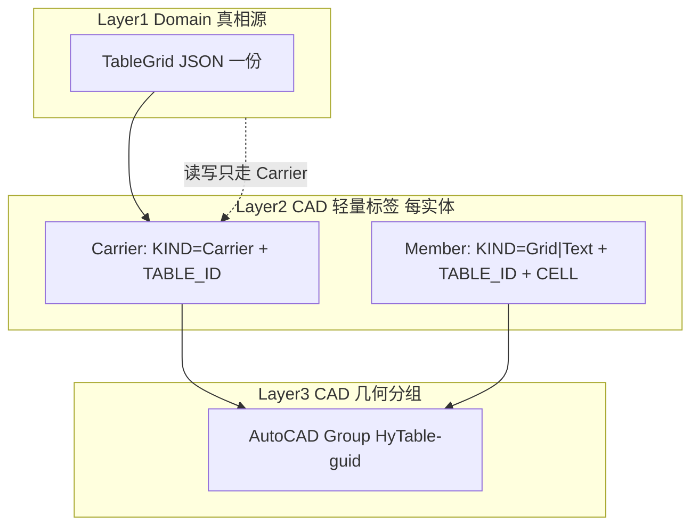
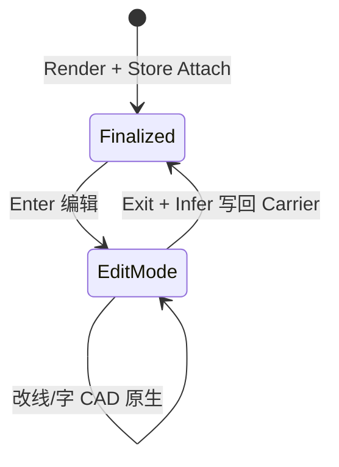

# 009 · 定稿表对象 CAD 分组方案对比（Group vs Block vs 其它）

> 文档编号：009  
> 生成日期：2026-06-25  
> 上游：[005 §5 序列化与真相源](./005-复杂表格Domain统一设计-2026-06-24-232335.md)、[008 §AC3](./008-AutoCAD表格制作分阶段实施计划-2026-06-25-143000.md)、[008c AC3 执行规格](./008c-AC3-XData真相源读回round-trip详解-2026-06-25-170000.md)  
> 性质：**架构决策对比**——解释「为什么 AC3 用 Group 包整表」；定稿常量供 `AcadTableStore` 引用。  
> 用法：实现 AC3 分组逻辑前读本文 §5–§8；008c 中「仅 Carrier、无 Group」为 **008c 初稿**，以 **009 定稿 + 用户 AC3 三层模型** 为准。

---

## 0. 一句话结论

**Domain 真相源（Carrier 上一份 JSON）与 CAD 分组（Group / Block / 无）是两个正交决策。**  
AC3 MVP：**真相源 = Carrier 扩展字典 + 轻量 XData**；**分组 = AutoCAD Group `HyTable-{guid}`**。  
Block 留给 AC12「发布定稿块」；原生 Table 不承载复杂版式；仅 Carrier 无分组体验差。

---

## 1. 先分清两个维度（常见混淆点）

很多人把「表是不是一个对象」和「JSON 放哪」混为一谈。本项目拆成 **Layer 1–3**（与用户 AC3 规格一致）：



| 维度 | 回答的问题 | AC3 定稿 |
|---|---|---|
| **真相源** | 结构/值/公式存哪？ | **仅 Carrier** 扩展字典 `HyTable_JSON`（`TableJson.SerializeGrid`） |
| **成员标签** | 点某根线/某字怎么知道是哪格？ | 每成员 XData：`TABLE_ID` + `KIND` + `CELL`（合并格写 Anchor） |
| **CAD 分组** | 用户怎么「一次选中整表」？ | **Group** 包含 Carrier + 全部 Polyline/DBText |

**Group 不存 JSON**——它只做「选集与生命周期包装」。删掉 Group 不影响读回，只要 Carrier 还在。  
**Block 也不该存第二份 JSON**——块定义里仍是同一套 Carrier + 成员几何。

---

## 2. 候选方案一览

| 代号 | 方案 | CAD 表现 | 典型用途 |
|---|---|---|---|
| **G** | **Group** | 模型空间里 N 个独立实体 + 1 个 Group 引用 | AC3 MVP 定稿态 |
| **B** | **Block** | 1 个 `BlockReference` + 块定义内 Polyline/DBText | AC12 发布/分发/图框插入 |
| **C** | **Carrier-only** | 散落实体，仅外框 Carrier 带 JSON | AC2 现状；AC3 不推荐终态 |
| **T** | **原生 Table** | 单个 `Table` 实体 | 简单表、无斜线/竖排 |
| **H** | **Hybrid Table+Line** | Table 作主体 + 额外 Line 补斜线 | 002 备选；与 Domain 双写风险高 |
| **X** | **纯 XData 扫描** | 无分组，按 `TABLE_ID` 全图扫描 | 仅作 Group 丢失后的兜底 |

**009 对比重点：G vs B vs C**（T/H 见 §7 简述）。

---

## 3. 多维度对比矩阵

评分：**5** 最好 · **1** 最差 · **—** 不适用或强烈不推荐。

| 维度 | G Group | B Block | C Carrier-only | 权重说明 |
|---|---:|---:|---:|---|
| **一次点选整表** | 5 点 Group≈全选 | 5 点 BlockRef | 1 需框选或扫 ID | 定稿态日常最高频 |
| **整表移动/复制** | 5 随 Group 或框选成员 | 5 单 Ref 即可 | 3 易漏成员 | 与 XData「随实体走」一致 |
| **编辑模式 Explode** | 4 `Group.Explode()` 散落，成员保留 XData | 3 `Explode` 丢块结构，需重建 Block | 5 已是散落 | AC10 见 [008j](./008j-AC10-编辑模式散开与退出识别详解-2026-06-25-180000.md) |
| **整表重渲染（AC5/AC7）** | 4 删 Group+成员 → Render → 新 Group | 3 `RedefineBlock` 或删插 | 4 删实体即可 | Group 重建成本低 |
| **成员仍在模型空间** | 5 是 | 1 在块定义内 | 5 是 | 编辑态要直接改线/字 |
| **实现复杂度（AC3）** | 4 API 简单 | 2 块表/层/属性 | 5 几乎无额外代码 | MVP 优先 |
| **与 Carrier JSON 读回** | 5 经 TABLE_ID 找 Carrier | 4 块内 Carrier 仍在 | 5 直接点 Carrier | 读回路径见 §4 |
| **复制后 round-trip** | 5 XData+扩展字典随复制 | 5 块定义随 DWG | 5 同左 | AC3 验收项 |
| **复杂版式（斜线/竖排）** | 5 任意 Polyline/DBText | 5 同左 | 5 同左 | 与分组无关 |
| **发布/插入其它图** | 2 需 WBLOCK 或改 Block | 5 天然 | 1 需打包 | Block 的主场 |
| **图层/颜色 per 成员** | 5 独立 Layer | 3 ByBlock 或块内层 | 5 独立 | 工程图常要分层 |
| **DXF 互操作** | 4 Group 常见 | 5 块更标准 | 3 散落难识别 | 非 MVP 主路径 |
| **误删/部分删除** | 3 可能只删 Group 名 | 4 Ref 在则表在 | 2 最易散 | 均需 TryResolve 兜底 |

**加权倾向（定稿态 + 双模式编辑路线）**：**G > B > C**。

---

## 4. 按生命周期：谁更合适

### 4.1 定稿态（默认 OFF）— 填值、拾取、整表移动

| 需求 | G | B | C |
|---|---|---|---|
| 用户点一下 ≈ 选中整表 | ✅ | ✅ | ❌ |
| WPF 读 `TableGrid` | Carrier JSON | 块内 Carrier JSON | Carrier JSON |
| 改 FieldKey 后整表重绘 | 删组+成员+Attach | RedefineBlock 或删插 | 删散落+Attach |
| 打印/视口内表现 | 原生 Polyline/DBText | 块内实体 | 同 G |

**结论**：G 与 B 体验接近；**G 实现更短、成员仍在 MS**（模型空间），利于后续 AC10。

### 4.2 编辑态（AC10 ON）— 结构编辑



| 步骤 | G | B | C |
|---|---|---|---|
| Enter：散开几何 | `Group.Explode()` | `BlockReference.Explode()` | 擦 Carrier，成员已在 |
| 成员 XData `CELL` | 保留在 Polyline/DBText | Explode 后保留 | 保留 |
| Exit：Infer → JSON | 写 Carrier，**无 Group** 直到再 Attach | 需决定是否重建 Block | 再画 Carrier+Attach |
| 再定稿 | 新 Render + **新 Group** | 新 Block 或 Redefine | Attach |

**关键差异**：

- **Group Explode** 后：实体回模型空间，**XData 仍在**，与 AC10「擦 Carrier、留线字」一致；008j 已预留分支。
- **Block Explode** 后：块引用消失，实体变独立，但 **块定义可能残留**；若表内图层/线型用 ByBlock，Explode 后样式可能变；重定稿需 `RedefineBlock` 或删块定义，**比 Group 多一步块表管理**。
- **Carrier-only** Enter 最简单，但定稿态 **没有「表对象」手感**，AC4 拾取、AC7 摘要都更绕。

**结论**：**G 最贴合「定稿=对象、编辑=散开」状态机**；B 可行但块生命周期更重。

### 4.3 重渲染（AC5/AC7）— 同一 `TableGrid.Id` 或新 Id

推荐流程（G）：

```text
TryResolveTableGrid(picked) → TableGrid
  → Domain 变更 / 改 origin
  → 收集旧 Group 全部成员 ObjectId
  → Erase 旧成员 + 旧 Group
  → AcadTableRenderer.Render
  → AcadTableStore.Attach（新 Carrier JSON + 全员 XData + 新 Group）
```

| 方案 | 重渲染成本 | Id 策略 |
|---|---|---|
| G | 线性删实体 + 建 Group | 建议 **保留** `TableGrid.Id`（AC7 再渲染） |
| B | 还要动 BlockTableRecord | 同左，但需 `RedefineBlock` |
| C | 只删实体 | 同左 |

**结论**：G 与 C 重渲染相当；**G 多一行建组**，换来定稿态体验。

### 4.4 复制 / 插入其它 DWG

| 方案 | 行为 |
|---|---|
| G | COPYCLIP 成员或 Group → XData + 扩展字典随实体 → 副本可读 JSON；**Group 名可能需重建** |
| B | INSERT 块 → 一份 BlockRef；**最适合**标准图块库 |
| C | 复制漏选 → 表散 |

**结论**：日常图内 COPY **G 足够**；跨项目标准件 **B 更好** → 留给 AC12，不推翻 AC3 用 G。

---

## 5. 为什么 AC3 MVP 选 Group（归纳）

1. **与三层模型正交**：JSON 只在 Carrier；Group 只解决「整表是一个 CAD 对象」的 UX，不碰 Domain。
2. **双模式状态机天然匹配**：定稿 = 有 Group；编辑 = Explode 或 Remove 成员；再定稿 = 重 Attach。Block 的 Explode/Redefine 更重。
3. **成员留在模型空间**：Polyline/DBText 可直接改线型、图层、线宽（AC6 外框加粗）；Block 内往往 ByBlock，Explode 后易变。
4. **实现成本**：`Group.Create` + `Append` ObjectId 集合 ≈ 数十行；Block 需 `BlockTableRecord`、插入点、比例、层策略、Redefine 分支。
5. **与 HyRoad 模式一致**：道路实体也是 **轻 XData + 扩展字典大 payload**；Group 类似「逻辑编组」，不引入第二真相源。
6. **005 D5 尚未关闭**：D5 倾向「复杂表 → Block **输出**」指 **发布形态**，不是 AC3 存储的唯一形态；**G 定稿 + B 可选发布** 可并存。

---

## 6. Block 何时上（AC12 及以后）

| 场景 | 用 Block |
|---|---|
| 插入标准图框/图例库 | ✅ |
| 发给不含 HyCAD 插件的外部 DWG | ✅（几何在块内仍可打印） |
| 需要单一插入点 + 统一缩放 | ✅ |
| AC3 开发读回 round-trip | ❌ 先用 G |
| AC10 频繁 Enter/Exit 结构编辑 | ❌ 先用 G |

**推荐路线**：

```text
AC3–AC11：Group 定稿（开发主路径）
AC12 可选：PublishTableAsBlockCommand — 从当前 Group 或 TableGrid 生成 Block，**Carrier JSON 仍在块内 Carrier 上**，不复制第二份 JSON
```

---

## 7. 为何不选其它方案

### 7.1 Carrier-only（C）

| 问题 | 说明 |
|---|---|
| 无「表对象」 | 点选靠猜外框层；AC4 N34 读回要先教用户点 Carrier |
| 漏选移动 | 移了线没移字 → JSON 还在但几何散 |
| 与成员 XData 浪费 | 已有 `CELL` 标签，却缺少 Group 把同 `TABLE_ID` 绑在一起 |

AC3 可以 **先实现 C（008c 初稿）再补 G**；009 定稿建议 **AC3 DoD 含 Group**。

### 7.2 原生 Table（T）

| 问题 | 说明 |
|---|---|
| 斜线/竖排/PhotoSlot | 原生 Table API 弱；005/002 已定 MVP 用线+字 |
| Domain 双写 | Table 单元格与 `TableGrid` 两套真相，drift 风险 |
| 编辑模式 | Explode Table 行为与 Polyline 不同 |

**定位**：简单表 **导出选项**，不是 HyTable 主存储。

### 7.3 Hybrid Table+Line（H）

维护 Table 与补充 Line 的同步成本高于 **纯 Polyline 渲染**；AC2 已走 Renderer 路线，不回头。

### 7.4 纯 XData 全图扫描（X）

`TABLE_ID` 扫描可在 **Group 丢失** 时兜底 `TryResolveTableGrid`；**不能**作主 UX（大图性能、误匹配）。

---

## 8. 定稿常量与 API 形状（供 AC3 编码）

### 8.1 Group 命名

| 常量 | 值 | 说明 |
|---|---|---|
| `GroupNamePrefix` | `"HyTable-"` | 全名 `HyTable-{TableGrid.Id:N}` |
| `GroupDescription` | `"HyCAD Table Group"` | 可选，便于 LIST |

### 8.2 XData KIND（Layer2，与用户规格对齐）

| KIND | 实体 | 必填 Key |
|---|---|---|
| `Carrier` | 外框 Polyline | `TABLE_ID`, `KIND`, `SCHEMA` |
| `Grid` | 网格 Polyline | + `CELL` = `"r,c"`（合并格写 Anchor） |
| `Text` | DBText | + `CELL` |

> 注：008c 初稿 KIND 仅为 `TableGrid` 且只写 Carrier；**009 定稿扩展为三种 KIND**，便于 AC10 点选成员。

### 8.3 `AcadTableStore.Attach` 顺序

```text
1. 指定/创建 Carrier（TableBounds Polyline）
2. ExtensionDictionaryService.WriteLongString(carrier, TableJson.SerializeGrid(grid))
3. HyTableXdata.WriteCarrier(carrier, grid.Id)
4. foreach member: HyTableXdata.WriteMember(id, grid.Id, kind, cellAddr?)
5. DBDictionary Group → Append(Carrier + all members)
6. return TableCadHandle { GroupId, CarrierId, TableId }
```

### 8.4 `TryResolveTableGrid` 路径

```text
pickedEntity
  → TryReadTableId
  → if KIND == Carrier → ReadLongString → DeserializeGrid
  → else → find Group by TABLE_ID (or scan GroupName HyTable-{id})
         → find Carrier in group → ReadLongString
  → GridInvariants.Validate
```

---

## 9. 与后续 AC 的接缝

| 阶段 | 依赖 009 决策 |
|---|---|
| **AC3** | 实现 G + 三层存储；DoD 含 Group 点选读回 |
| **AC4** | Insert/Read 命令假设「有 Group 或 Carrier」 |
| **AC5/AC7** | 重渲染 = Erase Group 成员 + Attach |
| **AC10** | Enter：`Group.Explode()` 或 RemoveAll；Exit：Infer → 写 Carrier → 可选暂不建 Group 直到用户「定稿」 |
| **AC11** | ViewModel 只绑 `TableGrid`；不暴露 GroupId 给 UI |
| **AC12** | Block 发布 **额外** 命令，不替换 G |

---

## 10. 008c 与 009 的差异（迁移说明）

| 项 | 008c 初稿 | 009 / 用户 AC3 定稿 |
|---|---|---|
| Group | 未写进 DoD | **MVP 必选** |
| 成员 XData | 仅 Carrier | **Grid/Text 带 CELL** |
| KIND | 仅 `TableGrid` | `Carrier` / `Grid` / `Text` |
| Store API | `Write` | `Attach` + `TableCadHandle` |

实现 AC3 时以 **009 + 用户消息 §1–§4** 为准；008c §4–§6 的扩展字典与 Carrier 策略仍然有效。

---

## 11. 验收补充（Group 相关）

在 [008c §1.2](./008c-AC3-XData真相源读回round-trip详解-2026-06-25-170000.md) 基础上增加：

- [ ] 渲染后存在 Group `HyTable-{Id:N}`，成员数 = 1 Carrier + 网格线 + 文字
- [ ] **点选 Group**（或组内任意成员）→ `TryResolveTableGrid` 与源表一致
- [ ] COPY Group 内全部实体到新位置 → 副本 `TryResolveTableGrid` 成功
- [ ] 成员 Polyline/DBText 上 `CELL` 与 Domain `CellAddr` 一致（合并格 = Anchor）
- [ ] Erase Group 对象本身（不删成员）后，仍可通过 `TABLE_ID` + Carrier 读回（兜底）

---

> **下一步**：按 009 §8 更新/扩展 008c 常量表 → AC3 编码（`HyTableXdata` + `AcadTableStore.Attach` + Renderer 返回 ids）→ AC4 命令联调。
