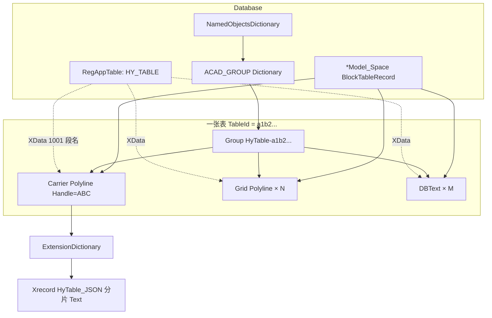
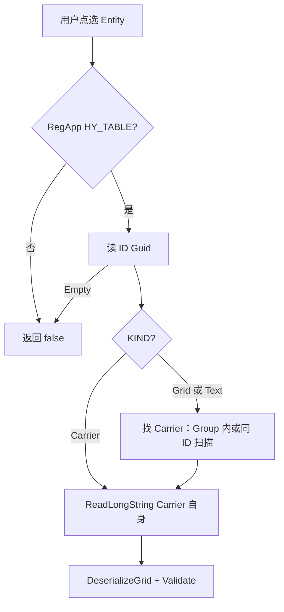

# 009a · DWG 中 HyTable 三层存储物理结构详解

> 文档编号：009a（009 的子文档）  
> 生成日期：2026-06-25  
> 上游：[009 Group vs Block 对比](./009-定稿表对象CAD分组方案对比-Group-vs-Block-2026-06-25-190000.md)、[008c AC3 执行规格](./008c-AC3-XData真相源读回round-trip详解-2026-06-25-170000.md)  
> 代码参照：[`HyRoadXdata`](../../../src/HyCADTool/Shared/AutoCAD/Xdata/HyRoadXdata.cs)、[`ExtensionDictionaryService`](../../../src/HyCADTool/Shared/AutoCAD/Xdata/ExtensionDictionaryService.cs)、[`TableJson`](../../../src/HyCAD.Tables/Serialization/TableJson.cs)  
> 性质：**DWG 落盘规格**——回答「Carrier / JSON / 成员 XData / Group 在 .dwg 里具体长什么样」；供 `HyTableXdata` / `AcadTableStore` 编码与验收对照。  
> 用法：实现 AC3 存储层时以本文 §2–§6 为字段真相；DXF 调试对照 §7。

---

## 0. 一句话

**一张 HyTable 在 DWG 里 = 模型空间若干 `Polyline`/`DBText` 实体 + 每个实体上的 XData（小标签）+ 仅 Carrier 外框上的扩展字典（整表 JSON 分片）+ 一个 `Group` 引用这些 ObjectId。**  
JSON **只存一份**；成员 **不重复 JSON**。

---

## 1. DWG 内总体拓扑



| AutoCAD 对象 | DWG 中的角色 | 是否存 JSON |
|---|---|---|
| `RegAppTableRecord` `HY_TABLE` | 全局注册名，XData 段前缀 | 否 |
| `Polyline`（Carrier） | 表外框 + **唯一 payload 宿主** | **是**（扩展字典） |
| `Polyline`（Grid 成员） | 单元格边框几何 | 否（仅 XData 标签） |
| `DBText`（Text 成员） | 单元格文字几何 | 否（仅 XData 标签） |
| `Group` | 成员 ObjectId 列表，方便整表点选 | 否 |
| `DBDictionary` + `Xrecord` | 挂在 Carrier 上，存 `HyTable_JSON` | **是**（JSON 正文） |

**几何仍在模型空间**（不在 Block 定义内）；Group 不复制几何，只持有 Handle 引用。

---

## 2. Layer 1 — TableGrid JSON（仅 Carrier 扩展字典）

### 2.1 写入 API 链

```text
TableGrid（内存）
  → TableJson.SerializeGrid(grid)     // System.Text.Json，HyCAD.Tables
  → ExtensionDictionaryService.WriteLongString(tr, carrier, json, "HyTable_JSON")
  → carrier.ExtensionDictionary["HyTable_JSON"] → Xrecord.Data = TypedValue[](Text × 分片)
```

与 [`DesignSpecService`](../../../src/HyCADTool/Features/DesignSpec/Services/DesignSpecService.cs) 存 Markdown 相同套路：**大文本不进 XData，进扩展字典分片 Xrecord**。

### 2.2 扩展字典结构

```text
Carrier Polyline (Entity)
└── ExtensionDictionary (DBDictionary, hard pointer 360)
    └── "HyTable_JSON" → Xrecord (soft pointer 350)
            └── Data (ResultBuffer):
                  TypedValue(DxfCode.Text, chunk[0..1999])
                  TypedValue(DxfCode.Text, chunk[2000..3999])
                  ...
```

| 常量 | 值 | 说明 |
|---|---|---|
| `ExtDictKeyJson` | `"HyTable_JSON"` | 扩展字典键名 |
| `CHUNK_SIZE` | `2000` | 与 `ExtensionDictionaryService` 一致，突破 Xrecord 单条长度限制 |

### 2.3 JSON 内容形状（逻辑，非 DWG 原生类型）

`TableJson.SerializeGrid` 产出 **单个 UTF-8 字符串**，反序列化为 `TableGridDto`：

```json
{
  "Id": "a1b2c3d4-e5f6-7890-abcd-ef1234567890",
  "Structure": {
    "Topology": { "Rows": [...], "Cols": [...], "Direction": "Down" },
    "Merges": [ { "TopLeft": "1,6", "RowSpan": 3, "ColSpan": 1 } ],
    "FieldIndex": { "name": "1,1" },
    "Roles": { "0,0": "Title", "1,6": "PhotoSlot" }
  },
  "Data": {
    "Cells": { "1,1": { "Text": "张三", "Kind": "Static" } }
  },
  "Metadata": { "cad.originX": "0", "cad.originY": "0" }
}
```

约定（P7 / 005）：

- 格地址键 `"r,c"`（0-based）
- 合并区 **D1 只存 Anchor** 的值；Mirror 由 `DeserializeGrid` → `RebuildMirrors` 还原
- `Id` 与 Carrier XData 的 `ID` **必须相同**

### 2.4 读回

```text
ExtensionDictionaryService.ReadLongString(tr, carrier, "HyTable_JSON")
  → string json
  → TableJson.DeserializeGrid(json)
  → FormulaService.Recalculate + GridInvariants.Validate
```

---

## 3. Layer 2 — XData 轻标签（每个几何实体）

### 3.1 RegApp 注册

首次写入前在 **Database.RegAppTable** 增加一条：

```text
RegAppTableRecord.Name = "HY_TABLE"
```

全局一次；与 `HY_ROAD` / `HY_COMPONENT` 并列。DXF 中可见 `(1001)` 段名。

### 3.2 XData 物理格式（DXF group code）

XData 是挂在实体上的 **TypedValue 数组**，DXF 导出为：

```text
(-3                          ← 开始扩展数据
  (1001 . "HY_TABLE")        ← RegApp 名 (ExtendedDataRegAppName)
  (1000 . "ID")              ← Key (ExtendedDataAsciiString)
  (1000 . "a1b2c3d4-...")    ← Value：Guid "D" 格式
  (1000 . "KIND")
  (1000 . "Carrier")         ← 或 Grid / Text
  (1000 . "SCHEMA")
  (1000 . "1")
  (1000 . "CELL")            ← 仅 Grid/Text 成员
  (1000 . "1,1")             ← Anchor 坐标 "r,c"
)
```

**编码约定**（仿 [`HyRoadXdata.Write`](../../../src/HyCADTool/Shared/AutoCAD/Xdata/HyRoadXdata.cs)）：

- Key / Value **交替**出现，均为 `ExtendedDataAsciiString` (1000)
- 重写 XData 时 **整段覆盖**，不保留未知 Key
- 语义上的 `TABLE_ID` → 实现常量 **`KeyId = "ID"`**（与 HyRoad 一致）

### 3.3 三类实体标签对照

| 实体 | AutoCAD 类型 | 图层（建议） | XData Key | 示例 Value |
|---|---|---|---|---|
| **Carrier** | 闭合 `Polyline` | `HyTable-Carrier` | `ID` | `{TableGrid.Id:D}` |
| | | | `KIND` | `Carrier` |
| | | | `SCHEMA` | `1` |
| | | | `CELL` | **不写** |
| **Grid 成员** | `Polyline`（单元格框） | `HyTable-Grid` | `ID` | 同表 Guid |
| | | | `KIND` | `Grid` |
| | | | `SCHEMA` | `1` |
| | | | `CELL` | `"1,1"`（合并格写 **Anchor** `"1,6"`） |
| **Text 成员** | `DBText` | `HyTable-Text` | 同上 | `KIND`=`Text` |

### 3.4 体量估算

| 类型 | TypedValue 个数 | 约字节 |
|---|---|---|
| Carrier | 1 RegApp + 3 对 KV | ~70–90 |
| Grid / Text | 1 RegApp + 4 对 KV | ~80–110 |

远低于 XData **单 RegApp 段 16KB** 上限；**禁止**把 JSON 塞进 XData。

### 3.5 Carrier 几何

```text
Polyline
  Closed = true
  Vertices = TableLayout.TableBounds 四角（模型空间 mm，Z = 0 或 Options.ZElevation）
  Layer = HyTable-Carrier
  Color/LineWeight = 可与 AC6 外框加粗策略一致
```

外缘常与最外圈 Grid Polyline 重合（MVP 可接受双线）。

---

## 4. Layer 3 — Group（不存数据，只存引用）

### 4.1 创建位置

```text
Database.NamedObjectDictionary
  └── "ACAD_GROUP" (DBDictionary)
        └── "HyTable-a1b2c3d4e5f67890abcdef1234567890" (Group)
              Description = "HyCAD Table Group"   // 可选
              ObjectId[] = [ Carrier, Grid₁…Gridₙ, Text₁…Textₘ ]
```

| 常量 | 值 |
|---|---|
| `GroupNamePrefix` | `"HyTable-"` |
| 全名 | `HyTable-{TableGrid.Id:N}`（32 位无连字符 Guid） |

### 4.2 Group 不携带的内容

- **无** XData / 扩展字典要求（Group 对象本身可不写 HY_TABLE）
- **无** JSON 副本
- 删除 Group **不删除**成员实体；仅失去「一次点选整表」

### 4.3 与 Block 的区别（落盘视角）

| | Group | Block |
|---|---|---|
| 成员位置 | `*Model_Space` 内独立实体 | `BlockTableRecord` 内定义 |
| 选中对象 | `Group` 或组内实体 | 单个 `BlockReference` |
| JSON 宿主 | 仍是 Carrier Polyline | 仍是块内 Carrier Polyline |
| DXF 组码 | `GROUP` 字典 | `BLOCK` / `INSERT` |

详见 [009 §2–§6](./009-定稿表对象CAD分组方案对比-Group-vs-Block-2026-06-25-190000.md)。

---

## 5. 完整示例：人员表在 DWG 中的对象清单

假设 `TableGrid.Id = a1b2c3d4-e5f6-7890-abcd-ef1234567890`，7×7 可见格渲染后（AC2 口径）：

| # | 对象 | Handle 示例 | HY_TABLE XData | 扩展字典 |
|---|---|---|---|---|
| 1 | Carrier Polyline | `ABC` | `ID`+`KIND=Carrier`+`SCHEMA` | **`HyTable_JSON`** 全文 |
| 2…34 | Grid Polyline ×33 | `DEF…` | `ID`+`KIND=Grid`+`CELL=r,c` | 无 |
| 35…60 | DBText ×~26 | `GHI…` | `ID`+`KIND=Text`+`CELL=r,c` | 无 |
| — | Group `HyTable-a1b2c3d4e5f67890abcdef1234567890` | `JKL` | 无 | 无 |

**读回路径**：

```text
用户点选 Grid Polyline (DEF)
  → XData ID = a1b2…
  → XData KIND = Grid  （非 Carrier）
  → 找 Group HyTable-a1b2… 或扫描同 ID 实体
  → 组内（或同 ID 扫描）找 KIND=Carrier 的 Polyline (ABC)
  → ReadLongString(ABC, HyTable_JSON)
  → DeserializeGrid
```

用户点选 Carrier 或 Group → 直达 JSON，跳过成员。

---

## 6. Attach 写入顺序（`AcadTableStore`）

```text
1. Render 完成 → ObjectIdCollection（Grid + Text）
2. 创建/指定 Carrier Polyline（TableBounds）→ carrierId
3. WriteLongString(tr, carrier, TableJson.SerializeGrid(grid), "HyTable_JSON")
4. HyTableXdata.WriteCarrier(tr, db, carrier, grid.Id)
5. foreach gridPolylineId:
     HyTableXdata.WriteMember(tr, db, id, grid.Id, KindGrid, cellAddr)
6. foreach textId:
     HyTableXdata.WriteMember(tr, db, id, grid.Id, KindText, cellAddr)
7. Group.Create(db, "HyTable-{grid.Id:N}")
     Append(carrierId + all member ids)
8. return TableCadHandle { GroupId, CarrierId, TableId = grid.Id }
```

**CELL 来源**：渲染时 `layout.EnumerateVisibleCells()` 的 `CellAddr`；合并格 Polyline/Text 均写 **MergeRegion.TopLeft（Anchor）**。

---

## 7. DXF 片段（人工可读对照）

### 7.1 Carrier Polyline + XData + 扩展字典（示意）

```text
0
POLYLINE
5
ABC
8
HyTable-Carrier
70
1
(-3
  (1001 . "HY_TABLE")
  (1000 . "ID")
  (1000 . "a1b2c3d4-e5f6-7890-abcd-ef1234567890")
  (1000 . "KIND")
  (1000 . "Carrier")
  (1000 . "SCHEMA")
  (1000 . "1")
)
102
{ACAD_XDICTIONARY
360
EXT001
}
...
0
DICTIONARY
5
EXT001
...
0
XRECORD
5
XREC001
102
{ACAD_REACTORS
330
EXT001
}
280
1
  1
HyTable_JSON
  1
{"Id":"a1b2c3d4-e5f6-7890-abcd-ef1234567890","Structure":{
  1
,"Data":{
...
```

> 实际 DXF 中 `HyTable_JSON` 的字符串被拆成 **多行 group code 1**（每段 ≤2000 字符）；`ReadLongString` 按序拼接。

### 7.2 Grid 成员 Polyline（示意）

```text
0
POLYLINE
5
DEF
8
HyTable-Grid
(-3
  (1001 . "HY_TABLE")
  (1000 . "ID")
  (1000 . "a1b2c3d4-e5f6-7890-abcd-ef1234567890")
  (1000 . "KIND")
  (1000 . "Grid")
  (1000 . "SCHEMA")
  (1000 . "1")
  (1000 . "CELL")
  (1000 . "1,1")
)
```

### 7.3 RegApp 表（文件级）

```text
0
TABLE
2
APPID
...
0
APPID
2
HY_TABLE
70
0
```

---

## 8. COPY / SAVE / WBLOCK 行为

| 操作 | XData | 扩展字典 JSON | Group |
|---|---|---|---|
| **COPY 实体** | 随实体复制 | 随 Carrier 复制 | 不自动复制 Group；副本实体可能无组 |
| **COPY 整组选集** | 全部复制 | 新 Carrier 带完整 JSON | 需插件或用户重建 Group |
| **SAVE** | 写入 .dwg | 写入 .dwg | 写入 .dwg |
| **DXFOUT** | 保留 `(1001)` 段 | 保留 Xrecord 分片 | 保留 GROUP |
| **无插件打开** | 数据在，无命令读 | JSON 仍在，可第三方解析 | 可手动选组 |

**AC3 验收**：COPY Carrier（或全表成员）到新位置 → 新 Carrier 上 `TryReadTableGrid` 成功；`FieldIndex["name"]` 仍为「张三」。

**Id 冲突**：若 COPY 不生成新 `TableGrid.Id`，两份表 XData `ID` 相同——读回仍正确，但 Group 名冲突；**V2 可选** COPY 时克隆 JSON 并 `Guid.NewGuid()`。

---

## 9. 限制与禁止项

| 限制 | 值 | 对策 |
|---|---|---|
| XData 单 RegApp 段 | 16KB | JSON 只放扩展字典 |
| Xrecord 单 Text | ~2048 字符 | `WriteLongString` 2000 字符分片 |
| 每实体 XData RegApp 数 | 实用 ≤1 个 HY_TABLE | 不混存其它 RegApp 到同段 |
| 成员上重复 JSON | 禁止 | 只 Carrier 写 `HyTable_JSON` |
| Group 当真相源 | 禁止 | Group 仅 UX |

---

## 10. 编码常量表（`HyTableXdata` / `AcadTableStore`）

### 10.1 RegApp 与 XData Key

| C# 常量 | 字符串值 |
|---|---|
| `RegAppName` | `"HY_TABLE"` |
| `KeyId` | `"ID"` |
| `KeyKind` | `"KIND"` |
| `KeySchema` | `"SCHEMA"` |
| `KeyCell` | `"CELL"` |
| `SchemaVersion` | `"1"` |

### 10.2 KIND 值

| C# 常量 | 字符串值 | 写入实体 |
|---|---|---|
| `KindCarrier` | `"Carrier"` | 外框 Polyline |
| `KindGrid` | `"Grid"` | 网格 Polyline |
| `KindText` | `"Text"` | DBText |

### 10.3 扩展字典与 Group

| C# 常量 | 字符串值 |
|---|---|
| `ExtDictKeyJson` | `"HyTable_JSON"` |
| `GroupNamePrefix` | `"HyTable-"` |
| `CarrierLayerName` | `"HyTable-Carrier"`（`AcadTableRenderOptions`） |
| `GridLayerName` | `"HyTable-Grid"` |
| `TextLayerName` | `"HyTable-Text"` |

### 10.4 Metadata 键（写入 JSON 内，非 XData）

| Key | 示例 | 用途 |
|---|---|---|
| `cad.originX` | `"1000.0"` | AC7 再渲染插入点 |
| `cad.originY` | `"2000.0"` | 同上 |

---

## 11. 与项目内既有模式对照

| 模块 | 小标签 | 大 payload | 分组 |
|---|---|---|---|
| **HyRoad** | XData `HY_ROAD`：`ID`/`KIND`/`SCHEMA` | 外置 `.roaddesign.json`（非 DWG） | 无统一 Group |
| **DesignSpec** | 部分实体 XData | 扩展字典 `MD_SOURCE` / `CFG` 长字符串 | 逻辑 `groupId` 在 Xrec |
| **HyTable（AC3）** | XData `HY_TABLE`：`ID`/`KIND`/`SCHEMA`/`CELL` | 扩展字典 `HyTable_JSON` | **Group `HyTable-{Id:N}`** |

HyTable **把 DesignSpec 的「扩展字典存大文本」与 HyRoad 的「XData 身份标签」合并**，并加 Group 满足整表对象 UX。

---

## 12. TryResolveTableGrid 决策树



---

## 13. 008c 初稿 vs 009a 定稿

| 项 | 008c 初稿 | 009a 定稿 |
|---|---|---|
| JSON 位置 | 仅 Carrier 扩展字典 | **同左** ✓ |
| 成员 XData | 无 | **Grid/Text 带 CELL** |
| KIND | 仅 `TableGrid` | **`Carrier` / `Grid` / `Text`** |
| Group | 未要求 | **Attach 时创建** |
| XData Key 名 | `ID` | **`ID`（语义即 TABLE_ID）** ✓ |

---

## 14. AC3 存储相关验收

- [ ] `LIST` Carrier 可见 `HY_TABLE` XData；`KIND=Carrier`
- [ ] 任选一 Grid Polyline：`KIND=Grid`，`CELL` 与 Domain 地址一致
- [ ] PhotoSlot 合并格：`CELL=1,6`（Anchor），非成员格坐标
- [ ] `ExtensionDictionaryService.HasKey(carrier, "HyTable_JSON")`
- [ ] JSON 长度 >2000 时 Xrecord 多段分片；读回字符串完整
- [ ] Group 存在且成员数 = 1 + Grid数 + Text数
- [ ] COPY Carrier 后副本扩展字典可 ReadLongString

---

> **下一步**：按 §10 实现 `HyTableXdata.cs` + `AcadTableStore.Attach`；Dev 命令渲染后 `LIST` / 断点读 XData 对照 §7。
