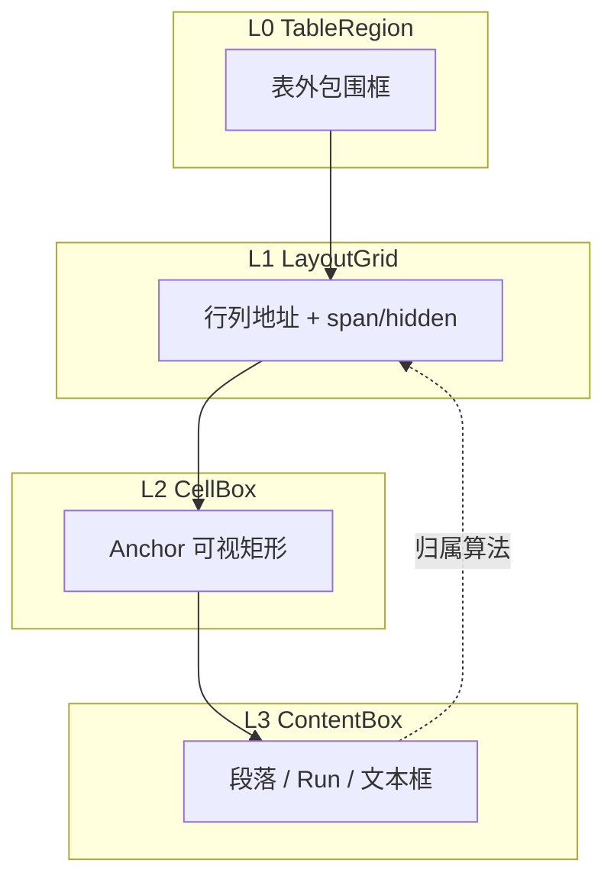
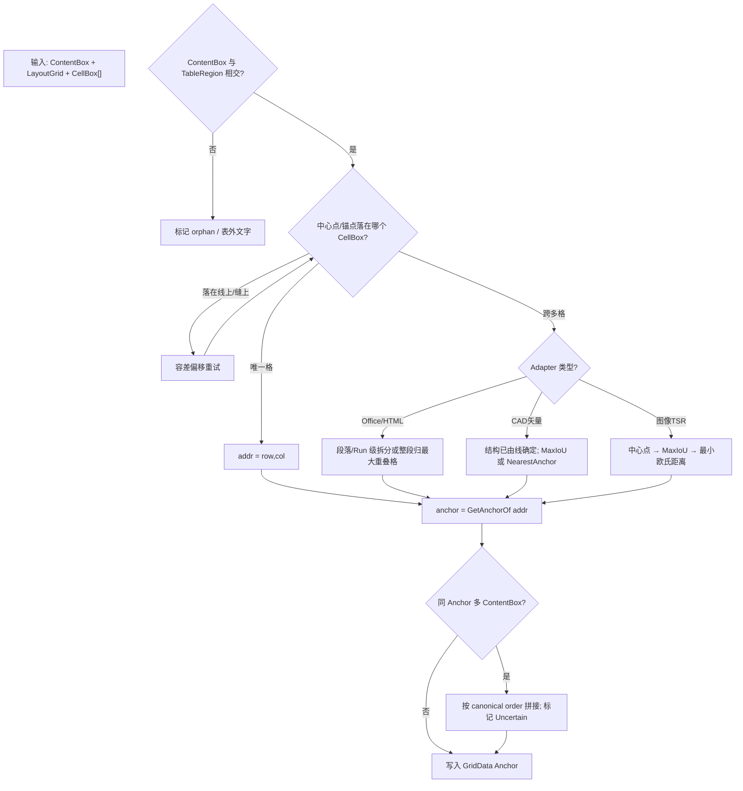

# 表格包围框与内容归属关系 — 产品调研与方法论

> 文档编号：011  
> 调研日期：2026-06-25  
> 目标形态：跨平台 Domain 引擎（Word / Excel / HTML 通用模型；CAD / 图像 TSR 为邻域参考）  
> 一句话目标：为 HyCAD Tables Domain 设计者厘清「表包围框 → 单元格包围框 → 内容包围框」三层关系，以及内容如何归属到格、合并后如何归并  
> 上游文档：[002 双模式编辑](./002-统一表格Domain与双模式编辑-产品调研-2026-06-24-225625.md)、[004 复杂表设计](./004-AutoCAD复杂表格Domain设计-2026-06-24-230100.md)、[005 Domain统一设计](./005-复杂表格Domain统一设计-2026-06-24-232335.md)、[008i AC9 执行规格](./008i-AC9-线框识别V1规整网格与矩形合并详解-2026-06-25-180000.md)  
> 性质：调研 + 跨平台方法论 + HyCAD 映射；**不写实现代码**

---

## 0. 目标与约束

### 0.1 核心问题

通用表格系统中存在三层包围框：

1. **表级（L0）**：整张表在文档/工作表/画布中的外包围区域  
2. **格级（L1/L2）**：逻辑网格地址 + 可视单元格矩形  
3. **内容级（L3）**：段落、Run、文本框、图形在格内的几何或逻辑范围  

三者之间的核心矛盾：

- **谁决定谁的大小？** 格框固定 vs 内容撑开  
- **内容如何找到所属格？** 寻址规则 vs 几何归属  
- **合并后内容存哪、怎么读？** Anchor 单点 vs 多格镜像  

### 0.2 目标用户

| 用户 | 用途 |
|---|---|
| HyCAD Tables Domain 设计者 | 统一 `GridStructure` / `GridData` 跨 Adapter 语义 |
| Office 导入导出 Adapter 作者 | openpyxl / python-docx ↔ `TableGrid` round-trip |
| CAD 识别（AC9/AC10）作者 | 理解中心点法在通用模型中的位置（详见后续 011a） |

### 0.3 范围边界

| 范围 | 011 篇幅权重 |
|---|---|
| Word / Excel / HTML / Web 表格组件 | **≥ 60%**（主战场） |
| 开源库（python-docx、openpyxl、ClosedXML、Docling） | 含于上 |
| CAD 矢量（HyCAD AC9、TEXT2CSV） | **≤ 10%**（邻域对照） |
| 文档图像 TSR（TATR、ICDAR box assignment） | **≤ 10%**（邻域对照） |

**011 不做**：CAD 容差常量、TSR 模型选型、C# 接口实现（留给 011a/b/c）。

### 0.4 成功标准

读完本文应能回答：

1. Word / Excel / HTML 各自用哪套框模型？  
2. 内容归属的通用决策树是什么？  
3. HyCAD `GridStructure` + `GridData` 与哪套最对齐？  
4. 哪些规则必须在 Domain 层统一、哪些留给 Adapter？

### 0.5 五维权重

| 维度 | 权重 | 说明 |
|---|---|---|
| 功能（模型完整度） | 35% | 合并、溢出、多内容同格 |
| 易用（API/寻址直觉） | 15% | Anchor 寻址是否自然 |
| 可靠安全 | 10% | 数据不丢、可审计 |
| 稳定（round-trip 一致） | 25% | 导入导出/识别↔渲染互逆 |
| 差异化（对 HyCAD 启发） | 15% | 工程表 + CAD 线框反推 |

---

## 1. 概念框架：三层包围框模型

### 1.1 统一术语（全系列复用）

```text
L0  TableRegion     — 表在文档/工作表/画布中的外包围框
                      （裁剪、表检测、「这是不是一张表」）
L1  LayoutGrid      — 逻辑行列网格；(row,col) 地址；span / hidden 格表达合并
L2  CellBox         — L1 某地址（归一化到 Anchor 后）的可视矩形区域
L3  ContentBox      — 段落/Run/文本框/图形在 L2 内的几何或逻辑范围
```



**读写方向**：

| 方向 | 典型场景 | 输入 → 输出 |
|---|---|---|
| **正向（结构→内容）** | 渲染、排版、导出 | LayoutGrid + CellStyle → ContentBox 位置 |
| **反向（内容→结构）** | 识别、导入、OCR 回填 | ContentBox 几何 → 归属 CellAddr → Anchor |

HyCAD 正向路径：`TableLayout.TryGetCellRect` → `AcadTableTextMapper.GetAlignmentPoint`  
HyCAD 反向路径：`TextAssigner` 中心点 → `GetAnchorOf`

### 1.2 五种关键关系类型

| 关系类型 | 含义 | Word / OOXML | Excel | HTML / CSS |
|---|---|---|---|---|
| **结构优先** | 格框由网格/边框决定，内容在框内排版 | `w:tblGrid` + `w:gridCol`；`gridSpan`/`vMerge` | 列宽行高 + `merged_cells` | `table-layout: fixed` + 显式列宽 |
| **内容驱动** | 内容撑开格/列/行 | AutoFit、Wrap Text | 列宽 `auto`、`ShrinkToFit` | `table-layout: auto` |
| **地址 vs 视觉** | 逻辑地址可落在 span 任意格，读写归 Anchor | 任意 grid 地址返回 top-left cell（[python-docx merge 分析](https://python-docx.readthedocs.io/en/latest/dev/analysis/features/table/cell-merge.html)） | shadow cell 跳过读写（[Docling msexcel_backend](https://github.com/docling-project/docling/blob/main/docling/backend/msexcel_backend.py)） | `rowspan`/`colspan`；非 Anchor td 可空 |
| **框-内容协商** | 固定格 + 溢出裁剪 vs 格随内容长高 | [MS-DOC 单元格边界算法](https://learn.microsoft.com/en-us/openspecs/office_file_formats/ms-doc/e32f7b2f-4759-4e8f-9ef9-e0cdfd11a335) 按字符位置寻址 | Wrap Text 近似 overflow | `overflow`/`text-overflow`（**须已知 table width**，见 [MDN table-layout](https://developer.mozilla.org/en-US/docs/Web/CSS/Reference/Properties/table-layout)） |
| **多内容同格** | 同格多段内容的排序与分隔 | 合并时段落 mark 拼接 | 单值（仅 Anchor） | DOM 块级顺序堆叠 |

### 1.3 合并语义：行业共识与 HyCAD 对齐

Word、Excel、Handsontable、SpreadJS 在合并语义上高度一致：

| 概念 | Word OOXML | Excel | Web 组件 | HyCAD 005 |
|---|---|---|---|---|
| **Anchor（主格）** | `gridSpan`/`vMerge restart` 的 top-left | merged range 左上角 | `addSpan(row,col,...)` 起点 | `MergeRegion.TopLeft` |
| **Mirror/Hidden** | `vMerge continue` 空 `w:p` | shadow cell（值清空） | span 内非 anchor 格 | `IsHidden(addr)` |
| **内容存储** | 仅 Anchor 段落实质内容 | 仅 top-left 有 value | 合并时**只保留左上角值**（[Handsontable 文档](https://handsontable.com/docs/javascript-data-grid/merge-cells/)） | `GridData` 稀疏 Anchor 键 |
| **合并时内容归并** | 各原格 `\n` 拼接 | 非左上值被清除 | 清除非 anchor 值 | `MergeValuePolicy`（005 §3.4，4 态） |

**ECMA-376 要点**（[w:gridSpan](https://ooxml.org/wordml/w-gridspan/) · [w:vMerge](https://ooxml.org/wordml/w-vmerge/)）：

- 横向合并：`w:gridSpan w:val="N"`，同行其余 grid 列**不含** `w:tc` 元素  
- 纵向合并：首格 `w:vMerge w:val="restart"`，续格 `w:vMerge`（continue），续格须有空 `w:p`  
- 寻址：任意 layout grid 地址均可访问，实际返回 **span 的 top-left cell**

**Excel 要点**（[ClosedXML Merge 文档](https://github.com/ClosedXML/ClosedXML/blob/develop/ClosedXML/Excel/Ranges/IXLRangeBase.cs)）：

> Merges this range. **Only the top-left cell will have a value**, other values will be blank.

读非 Anchor 格应通过 `cell.MergedRange().FirstCell()`，而非直接读 shadow cell（[Issue #1106](https://github.com/ClosedXML/ClosedXML/issues/1106) 讨论）。

### 1.4 框-内容协商：fixed vs auto

HTML/CSS 是理解「结构优先 vs 内容驱动」最清晰的标准：

| 模式 | 算法 | 格框谁定 | 溢出行为 |
|---|---|---|---|
| `table-layout: auto` | 列宽由最宽单元格内容决定 | **内容驱动** | 通常**不** respect `overflow: hidden`（[Magic of CSS](https://adamschwartz.co/magic-of-css/chapters/3-tables/)） |
| `table-layout: fixed` + 已知 `width` | 列宽由首行/`<col>` 决定 | **结构优先** | 可 `overflow: hidden` + `text-overflow: ellipsis` |

Word 类似：表格网格列宽（`w:tblGrid`）定结构，单元格内段落可 Wrap；Excel 列宽可固定或 AutoFit。

**对 HyCAD 启示**：Domain 层 `GridTrack.Size` 是**结构真相**；渲染 Adapter 负责在 CellBox 内做 padding/对齐/换行，不应让内容几何反写拓扑（识别路径除外，且须显式标注 draft）。

---

## 2. 竞品 / 参照系统清单

### 2.1 直接参照（通用表格模型）

| 名称 | 形态 | 平台 | 商业模式 | 开源? | 活跃度 | 框-内容要点 | 链接 |
|---|---|---|---|---|---|---|---|
| Microsoft Word / OOXML | 商业桌面 | Win/Mac | Office 订阅 | 规范公开 | 持续更新 | layout grid + span；字符位置寻址 cell 边界 | [ECMA-376](https://ooxml.org/wordml/w-gridspan/) · [MS-DOC](https://learn.microsoft.com/en-us/openspecs/office_file_formats/ms-doc/e32f7b2f-4759-4e8f-9ef9-e0cdfd11a335) |
| Microsoft Excel | 商业桌面 | Win/Mac | Office 订阅 | 否 | 持续更新 | merged range；仅 top-left 存值 | [MS Learn merged cells](https://learn.microsoft.com/en-us/answers/questions/5130200/referencing-merged-cells-in-formulae) |
| HTML + CSS Table Module | 开放标准 | Web | 免费 | 是 | 2025 草案活跃 | `border-collapse`；fixed/auto 双算法 | [CSS Tables L3](https://drafts.csswg.org/css-tables/) |
| python-docx | 开源库 | 跨平台 | 免费 | MIT | 2024+ | merge API；Anchor 寻址；合并 `\n` 拼接 | [GitHub](https://github.com/python-openxml/python-docx) |
| openpyxl | 开源库 | 跨平台 | 免费 | MIT | 2024+ | `merged_cells.ranges`；读写 top-left | [GitHub](https://github.com/openpyxl/openpyxl) |
| ClosedXML | 开源库 | .NET | 免费 | MIT | 2024+ | `Merge()` 仅保留 top-left；`MergedRange()` 读值 | [GitHub](https://github.com/ClosedXML/ClosedXML) |
| Docling MsExcelBackend | 开源库 | Python | 免费 | MIT | 2025 PR 活跃 | flood-fill 表区域；hidden merge；矩形 bbox | [PR #2778](https://github.com/docling-project/docling/pull/2778) |
| SpreadJS | Web 组件 | 浏览器 | 商业（GrapeCity） | 否 | 文档持续更新 | `addSpan(row,col,rowCount,colCount)`；anchor 激活 | [Cell Spans](https://help.grapecity.com/spread/SpreadJSWeb/cellspan.html) |
| Handsontable | Web 组件 | 浏览器 | 商业+评估许可 | 部分开源 | v17 (2025) | `{row,col,rowspan,colspan}`；合并只留左上值 | [Merge cells](https://handsontable.com/docs/javascript-data-grid/merge-cells/) |

### 2.2 邻域参考（011 仅索引，详见 011a/b）

| 名称 | 形态 | 与通用模型映射 | 链接 |
|---|---|---|---|
| ICDAR 2021 PingAn box assignment | 学术/竞赛 | 结构 cell box + OCR text box → **中心点 → IoU → 距离** 三级 | [arXiv:2105.01848](https://arxiv.org/abs/2105.01848) |
| Microsoft Table Transformer | 开源模型 | 图像 cell bbox + 外部 OCR → HTML | [GitHub](https://github.com/microsoft/table-transformer/) |
| CAD KITS TEXT2CSV | CAD 插件 | **线优先**：有线用线定格，文字只排序；无线才用文字坐标 | [TEXT2CSV](https://sites.google.com/site/cadkits/home/text2csv) |
| HyCAD AC9 TextAssigner | 自研引擎 | 中心点 + 2mm 边距重试；Y↓X↑ 空格拼接 | [008i](./008i-AC9-线框识别V1规整网格与矩形合并详解-2026-06-25-180000.md) |

### 2.3 Docling Excel 争议：视觉网格 flatten vs 语义 span

[Docling PR #2778](https://github.com/docling-project/docling/pull/2778) 曾提出「Visual Grid flatten」——强制 `row_span=1, col_span=1`，shadow 格填空串，以避免 Markdown 导出重复。维护者**最终 revert**，理由：

- 下游 RAG 需要保留语义 span  
- 1×2 标题 singleton 被误判为非表  

→ **教训**：L1 LayoutGrid 的 span 语义与 L2 CellBox 的「视觉展开」是不同层；Domain 应**保留 span**，导出 Adapter 再决定是否 flatten。

---

## 3. 五维度对比分析

### 3.1 各系统评分（1–5）

| 系统 | 功能 | 易用 | 可靠安全 | 稳定 | 差异化 | 加权总分 | 一句话总评 |
|---|---|---|---|---|---|---|---|
| Word OOXML | 5 | 4 | 4 | 4 | 4 | **4.35** | 复杂版式标杆；寻址模型最完整 |
| Excel | 4 | 5 | 4 | 5 | 3 | **4.30** | 数据层最强；版式弱于 Word |
| HTML fixed layout | 3 | 3 | 5 | 4 | 2 | **3.25** | 标准清晰但复杂 merge/斜线弱 |
| Handsontable | 4 | 5 | 3 | 4 | 3 | **3.90** | 工程可用的 Web 网格；合并语义对齐 Excel |
| HyCAD 目标 Domain | 4 | 4 | 4 | 4 | 5 | **4.15** | Word 式结构 + CAD 线框反推（差异化） |

权重：功能 35% · 易用 15% · 可靠 10% · 稳定 25% · 差异化 15%

### 3.2 行业现状小结

**普遍做得好**：

- 矩形 LayoutGrid + span 合并  
- Anchor 单点存储内容/值  
- 合并/unmerge 时非 Anchor 值清除（Excel/Handsontable 显式；Word 用段落拼接）

**普遍痛点**：

| 痛点 | 表现 | 案例 |
|---|---|---|
| 框-内容 chicken-and-egg | auto 布局下 overflow 失效 | CSS `table-layout: auto` |
| 合并 unmerge 丢内容 | 非 Anchor 值已清除 | Excel unmerge 不可恢复 |
| flatten vs span 分歧 | 导出重复或丢语义 | Docling PR #2778 |
| 跨格内容 | 一段文字横跨多格 | Word 需段落级拆分；CAD 需 IoU |
| 同格多内容 | 排序/分隔不一致 | CAD 空格 vs Word 段落 mark |

---

## 4. 内容归属：通用决策树

### 4.1 决策树



### 4.2 各级归属规则对照

| 层级 | Word | Excel | HTML | ICDAR/TSR | CAD TEXT2CSV | HyCAD AC9 |
|---|---|---|---|---|---|---|
| **结构来源** | OOXML grid | 网格线+merged | `<table>` DOM | 模型预测 cell bbox | **Line 优先** | Line 优先 |
| **内容→格** | 字符位置 cp → cell 边界算法 | 单元格地址直接读写 | td 元素归属 | 中心点→IoU→距离 | 插入点 in cell | 中心点+2mm |
| **合并格** | 任意地址→top-left | 仅 top-left 有值 | colspan/rowspan td | cell bbox 已含 span | 线定合并 | 缺内线→MergeRegion |
| **同格多内容** | 多段落顺序 | N/A（单值） | DOM 顺序 | 多 OCR box 拼接 | Y 内 X 排序+空格 | Y↓ X↑+空格 |

### 4.3 多内容同格：canonical order 建议

Domain 层应规定**唯一 canonical order**，Adapter 不得各自为政：

| 策略 | 排序键 | 分隔符 | 适用 |
|---|---|---|---|
| `ReadingOrder` | 行优先：Y↓ 再 X↑（CAD 坐标系） | 空格 | CAD 识别、无段落结构 |
| `ParagraphOrder` | 原格/段落 DOM 顺序 | `\n` 或段落 mark | Word 合并、HTML |
| `LexicographicAddr` | (row,col) 升序 | 配置 | 批量导入兜底 |

HyCAD AC9 V1 采用 `ReadingOrder`；Office Adapter 应采用 `ParagraphOrder`；Domain `GridEditor.MergeCells` 应接受 `contentMergePolicy` 参数（005 已有 `MergeValuePolicy`，011 建议扩展为 order+separator）。

### 4.4 ICDAR 三级归属（图像邻域标准）

[PingAn ICDAR 2021 方案](https://arxiv.org/abs/2105.01848) 对 **结构 cell box** 与 **OCR text line box** 的匹配：

1. **Center Point Rule**：text box 中心落在 structure cell 内 → 归属  
2. **IoU Rule**：否则取 IoU 最大的 cell  
3. **Distance Rule**：仍失败则取欧氏距离最小的 cell  

→ 与 HyCAD AC9 中心点法 + 2mm margin 重试同族；011a 可补 IoU 分支。

---

## 5. HyCAD Domain 映射、差距与推荐

### 5.1 概念映射表

| 通用概念 | HyCAD 对应 | 状态 |
|---|---|---|
| L0 TableRegion | `TableLayout.TableBounds` / `EditBounds` / `ClipBounds` | 部分（Collector 未设 Clip） |
| L1 LayoutGrid | `GridTopology` + `GridTrack` | ✅ 已实现 |
| L2 CellBox | `TableLayout.TryGetCellRect` → `LayoutRect` | ✅ 渲染路径 |
| L2 CellBox（识别） | `GridLineSet.XBoundaries/YBoundaries` | ✅ AC9；非 LayoutRect |
| Merge Anchor | `MergeRegion` + `GetAnchorOf` + `IsHidden` | ✅ 已实现 |
| L3 Content 存储 | `GridData` 稀疏 Anchor | ✅ 已实现 |
| 反向 Content→Cell | `TextAssigner` 中心点法 | ✅ AC9 V1 |
| 框-内容协商 | `CellStyle` + `AcadTableTextMapper` padding | 渲染侧部分 |
| 斜线 SubCell | `DiagonalSplit` / `SubCell` | 结构有；识别 V2 |
| 可插拔归属器 | 无独立接口 | ❌ 待 011c/实现 |

### 5.2 代码锚点（只读引用）

**反向归属（AC9）**——中心点 + 四向 2mm 重试：

```43:57:src/HyCAD.Tables/Inference/TextAssigner.cs
        foreach (var text in texts ?? Array.Empty<TextBox2d>())
        {
            var center = text.Bounds.Center;
            if (!TryResolveAnchor(
                    structure,
                    xs,
                    ys,
                    center.X,
                    center.Y,
                    options,
                    out var anchor))
            {
                messages.Add($"文字未归属任何格：\"{text.Content}\"。");
                continue;
            }
```

**正向排版（AC2）**——CellBox + 对齐样式 → 插入点：

```25:52:src/HyCADTool/Features/Tables/Infrastructure/AutoCad/AcadTableTextMapper.cs
        public static Point3d GetAlignmentPoint(LayoutRect bounds, CellStyle style, double paddingMm, double z)
        {
            double x;
            switch (style.HAlign)
            {
                case TextAlign.Center:
                    x = (bounds.Left + bounds.Right) / 2;
                    break;
                // ...
            }
```

→ 正向用 **CellBox 全矩形**；反向用 **ContentBox 中心点**——这是行业常见的不对称（Word 亦用 cp 寻址 cell，而非 bbox IoU）。

### 5.3 推荐 Domain 层统一规则

1. **结构层永远 LayoutGrid 寻址**；任意 span 地址查询归一化到 Anchor（对齐 Word python-docx 行为）  
2. **数据层只写 Anchor**；Mirror/Hidden 格参与布局/边框，不参与 `GridData` 键  
3. **Adapter 内容归属**采用可插拔 `IContentAssigner` 级联：`CenterPoint` → `MaxIoU` → `NearestAnchor`（CAD/TSR/Office 共用接口，011 仅规格）  
4. **同格多内容**：Domain 规定 canonical order（默认 `ReadingOrder` Y↓X↑；Office 导入用 `ParagraphOrder`）  
5. **合并内容归并**：`GridEditor.MergeCells(contentMergePolicy)` 显式调用，禁止静默丢字（对齐 Word `\n` 拼接语义）  
6. **span 不 flatten**：Domain 持久化 `MergeRegion`；导出 Markdown 等 Adapter 自行决定是否展开 visual grid  

### 5.4 不做清单（011 级）

- 不定 CAD 容差常量（见 008i / 011a）  
- 不选 TSR 模型（见 011b）  
- 不写 C# 接口实现  
- 不替代 005 的类型定稿——011 只补充跨平台理论依据  

---

## 6. 最优实现路径（HyCAD Tables）

### 6.1 构建方式

| 方式 | 推荐 | 理由 |
|---|---|---|
| Domain 框-内容模型 | **自研**（已基本完成） | Word/Excel 无直接可 fork 的矢量引擎 |
| Office 导入 | **套用 openpyxl + python-docx 语义** | 成熟 Anchor 规则；C# 侧 ClosedXML/openxml |
| 图像识别 | **套用 TATR/Docling API**（可选） | 011b 再定 |
| CAD 识别 | **自研 TableInferEngine** | 差异化；AC9 已落地 |

### 6.2 架构概要

```text
TableDocument
  └── TableGrid
        ├── GridStructure (L1 LayoutGrid + L2 CellBox 拓扑)
        │     ├── GridTopology / MergeRegion / DiagonalSplit
        │     └── TableLayout → LayoutRect (L2 几何)
        └── GridData (L3 内容，仅 Anchor)
              └── CellValue

Adapter 层:
  Forward:  GridStructure + GridData + CellStyle → ContentBox 位置 (Render)
  Reverse:  ContentBox[] + 可选 Line[] → IContentAssigner → GridData draft (Infer/Import)
```

**关键风险点**：

- 识别 draft 与渲染 golden 的 CellBox 来源不同（GridLineSet vs TableLayout）→ T15 互逆测试已覆盖  
- Office 导入 merge 内容拼接策略与 CAD 空格拼接不一致 → 必须走 `contentMergePolicy`  

### 6.3 路线图

| 阶段 | 交付 | 验收 |
|---|---|---|
| **MVP（当前）** | Anchor+Mirror Domain；AC9 中心点归属；AC2 正向排版 | T15 Diff ≥95% |
| **V1 · 011c** | Excel/Word Adapter + `IContentAssigner` | 人员表三向导入同一 TableGrid |
| **V1 · 011a** | CAD IoU 分支；InsertionPoint 选项 | Explode 回归 ≥95% |
| **V2 · 011b** | TSR 导入（可选） | 扫描 PDF 表格进 Domain |

### 6.4 风险与对策

| 风险 | 类型 | 影响 | 对策 |
|---|---|---|---|
| 同格多内容策略分裂 | 设计 | round-trip 文字不一致 | Domain canonical order |
| Excel unmerge 丢 shadow 值 | 行业 | 导入后无法恢复 | 导入时全并到 Anchor |
| CSS auto 式「内容反写列宽」 | 算法 | 识别污染拓扑 | 识别与渲染路径分离；draft 标注 |
| Docling 式 flatten | 导出 | 丢 merge 语义 | Domain 禁止 flatten span |

### 6.5 假设验证

**最危险假设**：「Word 式 Anchor+Mirror 可覆盖 CAD 识别与 Excel 导入」

**验证手段**：人员表 HTML（黄金夹具）+ xlsx + Explode CAD 三向导入同一 `TableGrid`，Diff 拓扑 40% + 合并 30% + 文字 30% ≥ 95%（与 008i §9.3 一致）。

---

## 7. 后续文档索引

| 编号 | 标题 | 依赖 011 |
|---|---|---|
| **011a** | CAD 矢量框-内容（AC9/AC10 深潜） | §4 决策树 CAD 分支 |
| **011b** | 图像/TSR 框-内容 | §4 ICDAR 三级归属 |
| **011c** | Office 导入导出 round-trip | §2 Word/Excel 映射 |
| **012** | [表级结构优先与内容驱动排版](./012-表级结构优先与内容驱动排版-2026-06-25-185703.md) | §1 结构优先 vs 内容驱动 → 分层优先策略 |
| **013** | [表格竖排文字](./013-表格竖排文字-产品调研-2026-06-25-192651.md) | L3 文本方向 · AC5 VerticalStacked |
| **014** | [表格与 CAD 工具面板设计](./014-表格与CAD工具面板设计-产品调研-2026-06-25-193648.md) | AC11 TablePanel · HyBlender/Settings 边界 |
| **015** | [表格面板设置](./015-表格面板设置-产品调研-2026-06-25-194246.md) | Quick/Tab/Expander 控件 · Domain 映射 |

---

## 8. 结论

通用表格的框-内容关系本质是 **LayoutGrid 寻址 + CellBox 几何 + Content 归属级联**。Word OOXML 与 Excel 在合并语义上高度一致：**Anchor 单点存储、Mirror 格隐藏或清空**。HTML/CSS 提供了结构优先（fixed）与内容驱动（auto）的两套布局算法，是理解「框-内容协商」的最佳参照。

HyCAD 002/005 的 `GridStructure` + `GridData` + `MergeRegion` + `GetAnchorOf` 与 Word/Excel 主流模型**对齐**；AC9 的 `TextAssigner` 中心点法只是 `IContentAssigner` 的一种 Adapter 策略，并非 Domain 真理。011 的价值在于：把分散在 004/008i 的设计决策上升到跨平台方法论，并明确 **span 语义必须在 Domain 保留、归属顺序必须在 Domain 统一、合并归并必须显式策略化**。

**第一步建议**：在 011c 实现 Excel 导入 PoC，验证 Anchor+Mirror 对人员表的 round-trip；并行在 011a 为 AC9 增加 IoU 兜底分支（不改动 Domain 存储规则）。

---

## 附录 A · 自检清单

```
- [x] 阶段 0 目标与五维权重已确认
- [x] 竞品 ≥ 8 个，覆盖商业/标准/开源库/Web 组件
- [x] Word/Excel/HTML 主战场 ≥ 60%；CAD/TSR ≤ 20%
- [x] 三层框模型 + 归属决策树 + 多内容排序对照表
- [x] 五维打分 + 加权表 + 行业小结
- [x] HyCAD 映射表 + 推荐规则 + 不做清单 + 011a/b/c 索引
- [x] 竞品事实附来源链接；价格未编造（SpreadJS/Handsontable 标商业）
- [x] 不写实现代码
```

---

**版本**：1.0 | **更新**：2026-06-25
