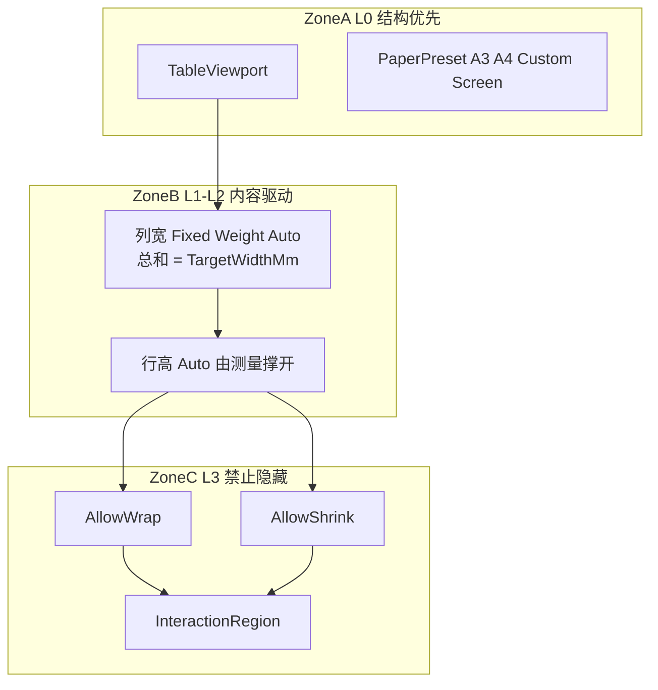
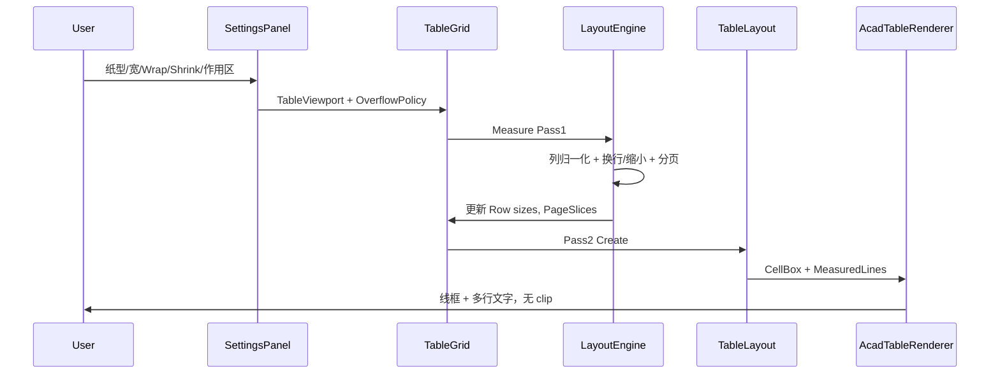

# 表级结构优先与内容驱动排版 — 设计规格（012）

> 文档编号：012  
> 生成日期：2026-06-25  
> 一句话目标：在 [011](./011-表格包围框与内容归属关系-产品调研-2026-06-25-180058.md) 三层框模型之上，规定 **L0 结构优先外壳 → L1/L2 内容驱动 → L3 禁止隐藏（换行/缩小）** 的双区排版策略与算法  
> 上游：[011 框-内容关系](./011-表格包围框与内容归属关系-产品调研-2026-06-25-180058.md)、[005 Domain 统一设计](./005-复杂表格Domain统一设计-2026-06-24-232335.md)、[002 双模式编辑](./002-统一表格Domain与双模式编辑-产品调研-2026-06-24-225625.md)  
> 性质：**设计规格**——类型与算法描述，不写方法体；实现见 P1–P3 路线  
> 用法：Domain / LayoutEngine / 面板参数 / AC2 渲染扩展的唯一真相

---

## 0. 设计原则（用户三条要求）

| # | 原则 | 设计落点 | 底层原理 |
|---|---|---|---|
| **1** | 整表 **结构优先** | `TableViewport`（L0） | 表格用于 A3/A4/自定义纸面或固定显示器区域；**宽度通常必填**；高度可无限（单页）或由 `MaxPageHeightMm` 触发 **行边界分页** |
| **2** | 外轮廓固定后 **内容驱动** | `GridTrack` 列/行 + `LayoutEngine` Pass1 | L0 宽度锁定后，列宽归一化分配；行高默认 **Auto**，由文本测量撑开 |
| **3** | **禁止隐藏**内容 | `OverflowPolicy`（L3） | 禁用 clip/ellipsis；溢出只走 **自动换行** 和/或 **等比缩小字高**；**至少开一项**；两者同开时 **联合迭代仅作用于用户指定 `InteractionRegion`** |

### 0.1 与 011 的分工

[011](./011-表格包围框与内容归属关系-产品调研-2026-06-25-180058.md) 回答「框与内容是什么关系、如何归属」；**012 回答「谁决定尺寸、溢出怎么办」**。

011 §1.4 指出 CSS `table-layout: fixed + width` 是 L0 结构优先的行业对照；012 在 CAD 1:1 mm 坐标下用 **`TableViewport.TargetWidthMm`** 实现同等语义。

### 0.2 双区排版模型（Two-Zone Layout）



---

## 1. Zone A — L0 结构优先（整表外壳）

### 1.1 `TableViewport`（Domain 新增）

挂载于 `TableGrid` 或 `TableDocument` 级（推荐 **每表一份**，005 §3 的 `TableGrid` 扩展字段）。

```text
TableViewport
  TargetWidthMm       double      必填；表内容区总宽（mm，1:1 模型空间）
  MaxPageHeightMm     double?     可空；null = 单页不限制高度（仅宽约束）
  PaperPreset         enum        A3 | A4 | A2 | Custom | Screen
  MarginMm            Insets      页边距 Top/Bottom/Left/Right（mm）
  ContentWidthMode    enum        ExcludingMargins | IncludingMargins
                                （TargetWidth 是否已扣边距，二选一定义后不变）
  AllowPageBreak      bool        默认 true；仅 MaxPageHeightMm 有值时生效
  RepeatHeaderRows    int         续页重复表头行数（0 = 不重复）
  OriginX             double      插入点 X（mm，Adapter 渲染用）
  OriginY             double      插入点 Y（mm）
```

**不变量**：

- `TargetWidthMm > 0`  
- `MaxPageHeightMm == null` 时 `AllowPageBreak` 视为 false  
- L0 **不允许**被 L3 内容反写宽度（列宽总和必须归一化到 `TargetWidthMm`）

### 1.2 纸张预设 → 默认宽度

精确值由 `PaperPreset + MarginMm + 横/竖向` 推导；用户可随时覆盖 `TargetWidthMm`。

| Preset | ISO 尺寸 (mm) | 默认可用宽（示例：横向，边距 10×2） | 典型场景 |
|---|---|---|---|
| A3 | 420 × 297 | 400 | 工程图附表 |
| A4 | 297 × 210 | 277 | 竖向报表 |
| A2 | 594 × 420 | 574 | 大表 |
| Custom | — | 用户输入 | 非标准图框 |
| Screen | — | 面板视口宽或用户输入 | PaletteSet 预览 |

```text
// 伪代码：推导 TargetWidthMm（ContentWidthMode = ExcludingMargins）
availableWidth = paperShortSideOrLongSide(orientation) - MarginMm.Left - MarginMm.Right
TargetWidthMm = userOverride ?? availableWidth
```

### 1.3 分页：仅行边界（Hard Rule）

用户已确认：**不拆分行、不拆分合并格**。

```mermaid
flowchart TD
    measure["Pass1 测量每行高度 rowHeights r"]
    acc["累计高度 acc = 0"]
    slice["当前 PageSlice 行列表"]
    check{"acc + rowHeights r > MaxPageHeight?"}
    newPage["闭合 PageSlice；新建续页"]
    header["续页插入 RepeatHeaderRows 行副本"]
    acc += rowHeights r
    measure --> acc
    acc --> check
    check -->|否| slice
    check -->|是| newPage --> header --> slice
```

**规则明细**：

| 场景 | 行为 |
|---|---|
| 累计行高 ≤ 页高 | 同一 `PageSlice` |
| 下一行加入后超页高 | **整行**移到下一页（含 rowspan 占用的完整行组） |
| 单行经换行+缩小仍超页高 | **警告** + 整行移下一页（扩页），**绝不 clip** |
| 续页 | 表宽不变；`RepeatHeaderRows` 复制；`OriginY` 按页偏移或独立 `PageSlice.Origin` |

**输出**：`LayoutResult.PageSlices[]`，每片含 `StartRow`、`EndRowExclusive`、`Origin`、可选 `PageIndex`。

---

## 2. Zone B — L1/L2 内容驱动

### 2.1 列宽归一化算法

**输入**：`TableViewport.TargetWidthMm`、`GridTopology.Cols[]`（`GridTrack` + `TrackSizeMode`）  
**输出**：`resolvedColWidths[]`，满足 `sum == TargetWidthMm`（浮点误差 ≤ 0.01mm）

现有类型可复用：[ `GridTrack` ](../../../src/HyCAD.Tables/Structure/GridTrack.cs)、[ `TrackSizeMode` ](../../../src/HyCAD.Tables/Structure/TrackSizeMode.cs)（Fixed / Auto / Weight）。

**解析顺序**（类似 CSS Grid `fixed + fr`）：

```text
1. fixedSum = Σ col.Size where col.Mode == Fixed
2. remaining = TargetWidthMm - fixedSum
   if remaining < 0 → ERROR（Fixed 总和超宽，提示用户改 Fixed 或 TargetWidth）

3. autoCols = 索引 where Mode == Auto
   for each auto col:
     minW = MeasureMinContentWidth(col)   // 最长词/字单行宽
   autoSum = Σ minW
   if autoSum > remaining → 触发 L3（换行/缩小），不得 clip；仍分配 minW 并压缩 Weight

4. weightCols = 索引 where Mode == Weight
   weightTotal = Σ col.Size   // Size 作权重，非 mm
   for each weight col:
     resolved[w] = remaining_after_auto * (col.Size / weightTotal)

5. 写回 GridTopology.Cols[c].Size = resolved[c]（Mode 改为 Fixed 或保留 Weight 仅 Layout 内部用）
```

**005 对齐**：列轨道即 [005 §3 `GridTopology`](./005-复杂表格Domain统一设计-2026-06-24-232335.md) 的 `Cols`；012 只增加 **归一化 Pass**，不改变 Anchor/Merge 语义。

### 2.2 行高：默认 Auto

| 行 Mode | 行为 |
|---|---|
| **Auto**（默认） | Pass1 测量后写 `Size = maxCellContentHeight(row)` |
| **Fixed** | 用户锁定（如表头）；`Size` 不变；内容仍走 L3，必要时扩行或告警，不 clip |
| **Weight** | 行方向少用；若用则按剩余页高比例分配（V2） |

**合并格行高**：

- 对物理行 `r`：取所有 **Anchor 可见**且 `Anchor.Row == r` 或 rowspan 覆盖 `r` 的格的内容高度  
- `rowHeight[r] = max(contentHeight(cell))`  
- rowspan > 1：内容高度均计入 Anchor 行；续行仅参与分页累计，不单独加高

### 2.3 两阶段布局与 `TableLayout`

现有 [ `TableLayout` ](../../../src/HyCAD.Tables/Layout/TableLayout.cs) 从 `GridTopology` 读 track Size 生成 `TableBounds` / `CellBox`。**012 插入 Pass1**：

```text
Pass1  LayoutEngine.Measure(grid, viewport, overflowPolicy, textMeasurer)
         → 更新 Row Auto sizes；产出 PageSlices；产出 MeasuredCell（lines, scale）

Pass2  TableLayout.Create(grid, origin)   // 现有逻辑，读更新后的 topology
         → LayoutRect / VisibleCellLayout
```

**新增**（规格名，P1 实现）：

```text
interface ITextMeasurer
  MeasureSingleLineWidth(text, fontKey, textHeightMm) → double
  WrapLines(text, innerWidth, fontKey, textHeightMm) → string[]

class LayoutEngine
  static LayoutResult Measure(TableGrid, TableViewport, OverflowPolicy, ITextMeasurer)
```

---

## 3. Zone C — 禁止隐藏（换行 / 缩小）

### 3.1 `OverflowPolicy`

```text
OverflowPolicy
  AllowWrap             bool       允许自动换行
  AllowShrink           bool       允许等比缩小字高
  ShrinkMinRatio        double     最小缩放比，默认 0.75（相对 CellStyle.TextHeight）
  ShrinkStep            double     每次缩小步长，默认 0.05
  LineHeightFactor      double     行距系数，默认 1.2
  CellPaddingMm         double     水平/垂直内边距，默认 1.0
  InteractionRegion     RegionSpec?  当 AllowWrap && AllowShrink 时 **必填**
  InteractionOrder      enum       WrapThenShrink | IterativeUntilFit（仅共同区内）

// 硬不变量
Invariant A: AllowWrap || AllowShrink
Invariant B: (AllowWrap && AllowShrink) => InteractionRegion != null
Invariant C: 禁止 UseClip / AllowEllipsis（不得出现在 Policy 中）
```

### 3.2 区域外 vs 共同作用区（用户确认）

| 全局开关 | InteractionRegion **外** | InteractionRegion **内** |
|---|---|---|
| 仅 `AllowWrap` | 自动换行 | N/A（无共同区） |
| 仅 `AllowShrink` | 等比缩小（单行）；仍禁止 clip | N/A |
| **两者都开** | **独立应用**已开项：换行处换行、缩小处缩小；**不做联合迭代** | **Wrap + Shrink 联合**（`InteractionOrder`） |

### 3.3 `RegionSpec`

```text
RegionSpec
  Kind      enum     WholeTable | RowRange | ColRange | RectCells | MergeAnchors
  RowStart  int?     Kind 含 RowRange / RectCells 时用
  RowEnd    int?     含意 [RowStart, RowEnd] 闭区间
  ColStart  int?
  ColEnd    int?
  Addrs     CellAddr[]   Kind = RectCells | MergeAnchors
```

**命中测试**：对格 `(r,c)` → Anchor `a`；若 `Kind=MergeAnchors` 且 `a` 在列表中 → 区内；RowRange/ColRange 按 Anchor 坐标判断。

### 3.4 换行算法（MVP）

**输入**：`text`、`textHeightMm`、`fontKey`、`innerWidth = cellWidth - 2×CellPaddingMm`  
**输出**：`lines[]`、`contentHeight`

```text
if MeasureSingleLineWidth(text) <= innerWidth:
  lines = [text]
else if not AllowWrap（且不在仅-Shrink 路径）:
  lines = [text]   // 单行，交给 Shrink
else:
  lines = WrapGreedy(text, innerWidth, textMeasurer)
  // 拉丁：空白/连字符断词；无空格超长串字内断
  // CJK：逐字贪心（V1）；V2 接 HyCADTool.TextLayout

lineHeight = textHeightMm * LineHeightFactor
contentHeight = lines.Count * lineHeight + 2 * CellPaddingMm
```

**哪些行需要换行**：凡该格 `MeasureSingleLineWidth > innerWidth` 且策略允许 Wrap → 参与换行；物理行高 = 该行所有 Anchor 格 `contentHeight` 的 **max**。

### 3.5 缩小算法

```text
scale = 1.0
loop:
  effectiveHeight = MeasureWithWrap(text, textHeightMm * scale, innerWidth)
  if effectiveHeight <= availableHeight: break
  if inInteractionRegion && AllowShrink && scale > ShrinkMinRatio:
    scale -= ShrinkStep
    continue
  if !inInteractionRegion && AllowShrink && scale > ShrinkMinRatio:
    scale -= ShrinkStep    // 区外仅 Shrink 开关时
    continue
  // 仍超：扩行高 或 分页 或 LayoutWarning，禁止 clip
  emit Warning(OverflowUnresolved)
  break
```

**`availableHeight`**：Fixed 行 = 行高 − 2×Padding；Auto 行 = +∞ 直至页高约束；分页切片内 = 页剩余高。

### 3.6 共同区内 `IterativeUntilFit`（推荐默认）

```text
scale = 1.0
repeat:
  lines = Wrap(text, innerWidth, textHeightMm * scale)
  h = lines.Count * textHeightMm * scale * LineHeightFactor + 2*Padding
  if h <= cellAvailableHeight: return MeasuredCell(lines, scale)
  if scale > ShrinkMinRatio: scale -= ShrinkStep
until scale <= ShrinkMinRatio
return MeasuredCell(lines, ShrinkMinRatio) + Warning
```

---

## 4. 与 011 L0–L3 对照

| 011 层 | 011 含义 | 012 谁优先 | 012 新增 |
|---|---|---|---|
| L0 TableRegion | 表外包围框 | **结构优先**（宽必填） | `TableViewport` |
| L1 LayoutGrid | 逻辑网格 | 列宽归 L0；行 Mode Auto | 列归一化算法 |
| L2 CellBox | 可视矩形 | 内容测量后确定行高 | Pass1 → Pass2 |
| L3 ContentBox | 段落/文字 | **内容驱动**测量 | `OverflowPolicy`、换行/缩小 |

011 §1.4「结构优先 vs 内容驱动」在 012 中 **按层拆分**：L0 结构优先，L1/L2 内容驱动，L3 禁止隐藏式协商。

---

## 5. HyCAD Domain 映射与缺口

| 概念 | 005 / 现有代码 | 012 状态 |
|---|---|---|
| L0 视口 | `TableLayout.TableBounds` 派生 | **缺** `TableViewport` 输入 |
| 列 Fixed/Auto/Weight | `GridTrack` + `TrackSizeMode` | ✅ 已有；缺归一化 Pass |
| 行 Auto | `TrackSizeMode.Auto` 枚举已有 | ❌ Pass1 未实现 |
| 单元格样式 | `CellStyle.TextHeight` 等 | ✅；缺运行时 `scale` 输出 |
| 布局视图 | `TableLayout.Create` | ✅ Pass2 |
| 溢出 | 无 | ❌ `OverflowPolicy` |
| 分页 | 无 | ❌ `PageSlice` |
| 渲染 | `AcadTableTextMapper` 单行 | ❌ 多行 MText（AC2.1） |

### 5.1 明确禁止（不做清单）

- 默认 `overflow: hidden` / `text-overflow: ellipsis`  
- 静默丢弃超界字符  
- 合并格 **mid-row** 分页  
- 内容测量结果反写 `TargetWidthMm`  
- 在未开 Wrap 且未开 Shrink 时渲染（违反 Invariant A）

### 5.2 实施路线

| 阶段 | 交付 | 验收 |
|---|---|---|
| **P0** | 本文 012 | 与 011/005 交叉引用 |
| **P1 Domain** | `TableViewport`、`OverflowPolicy`、`LayoutEngine`、`ITextMeasurer` + 单测 | 人员表「学习和工作简历」长格换行后行高正确 |
| **P2 渲染** | `AcadTableRenderer` 多行；`SettingsPanelViewModel` 绑定 | C2→C1 目视无裁切 |
| **P3 分页** | `PageSlice` + 行边界分页 + `RepeatHeaderRows` | A3 双页人员表 |

---

## 6. 用户参数面板建议（SettingsPanel / 表格子面板）

> **UI 落点（2026-06-25 更新）**：§6 字段应挂在 **AC11 TablePanel** 折叠块「表视口」，而非 `SettingsPanelViewModel` 聚合。控件组织见 [015 表格面板设置](./015-表格面板设置-产品调研-2026-06-25-194246.md) §5；壳布局见 [014](./014-表格与CAD工具面板设计-产品调研-2026-06-25-193648.md) §4.2。

与 [002 §填值模式](./002-统一表格Domain与双模式编辑-产品调研-2026-06-24-225625.md) 并列，新增 **「排版 / 视口」** 分组：

| UI 字段 | 绑定 | 类型 | 默认 | 说明 |
|---|---|---|---|---|
| 纸张预设 | `TableViewport.PaperPreset` | Combo | A3 | 改预设可联动宽 |
| 表格总宽 (mm) | `TargetWidthMm` | double | 推导值 | 红色=实际 mm，不乘 Scale |
| 页高限制 (mm) | `MaxPageHeightMm` | double? | 空 | 空=不限高 |
| 允许分页 | `AllowPageBreak` | bool | true | 页高空时禁用 |
| 续页重复表头行数 | `RepeatHeaderRows` | int | 1 | |
| 页边距 | `MarginMm` | 四边 mm | 10 | |
| **允许自动换行** | `OverflowPolicy.AllowWrap` | bool | **true** | 至少一项与缩小互斥校验 |
| **允许缩小字高** | `OverflowPolicy.AllowShrink` | bool | false | |
| 最小字高比例 | `ShrinkMinRatio` | double | 0.75 | 0.5–1.0 |
| 共同作用区 | `InteractionRegion` | 按钮「框选行/列/格」 | 空 | **两开关同开时必填** |
| 共同区策略 | `InteractionOrder` | Combo | IterativeUntilFit | |
| 单元格内边距 | `CellPaddingMm` | double | 1.0 | |

**校验逻辑（ViewModel）**：

```text
if !AllowWrap && !AllowShrink → 阻止应用，提示「至少开启换行或缩小一项」
if AllowWrap && AllowShrink && InteractionRegion == null → 阻止应用，提示「请指定共同作用区域」
```

**框选 UI（Should）**：在表格预览或 CAD 中高亮行/列/格，写入 `RegionSpec`；MVP 可用行号起止 NumericUpDown。

---

## 7. 端到端数据流



---

## 8. 结论

HyCAD 表格排版采用 **分层优先** 而非单一「全局 fixed 或 global auto」：

1. **L0** 由纸面/显示器决定 **总宽**（结构优先），**页高**可选并驱动行边界分页。  
2. **L1/L2** 在 L0 内 **内容撑开行高**，列宽在 Fixed/Weight/Auto 规则下 **总和锁定为 L0 宽**。  
3. **L3** **永不隐藏**；换行与缩小至少启用一项；两者同开时 **联合迭代仅限 `InteractionRegion`**，区外各开关独立生效。

本规格把 011 的框-内容关系推进为可实现的 **LayoutEngine** 契约，并与 005 的 `GridTopology`/`GridTrack` 对齐，无需重命名 Domain。

**下一步（P1）**：在 `HyCAD.Tables/Layout/` 增加 `LayoutEngine` 与 `TableViewport` 类型草图 + 「人员表简历格」单测。

---

## 附录 A · 自检清单

```
- [x] 原则 1：L0 宽必填、高可分页、行边界分页
- [x] 原则 2：L0 固定后列归一化 + 行 Auto 内容驱动
- [x] 原则 3：禁止 clip；Wrap/Shrink 至少一项；双开必填 InteractionRegion
- [x] 区外：各开关独立生效；区内联合迭代
- [x] 与 011 L0–L3 对照表
- [x] 与 005 GridTopology/GridTrack 交叉引用
- [x] 用户参数面板字段建议
- [x] 明确禁止清单
- [x] P1–P3 路线
- [x] 不写实现代码
```

---

**版本**：1.0 | **更新**：2026-06-25
