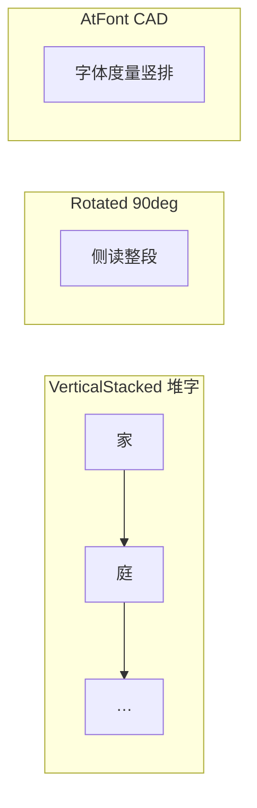

# 表格竖排文字 — 产品调研与实现路径

> 文档编号：013  
> 调研日期：2026-06-25  
> 目标形态：HyCAD Tables Domain + AutoCAD 线+文字定稿（CAD 插件）  
> 一句话目标：为工程制图人员在 **表格单元格内竖排中文侧栏/标题** 提供可编辑、可识别、可 round-trip 的方案，并厘清 AutoCAD 为何「很不方便」及行业如何绕过  
> 上游：[002 双模式编辑](./002-统一表格Domain与双模式编辑-产品调研-2026-06-24-225625.md)、[005 Domain 统一设计](./005-复杂表格Domain统一设计-2026-06-24-232335.md)、[008e AC5 竖排规格](./008e-AC5-复杂版式竖排斜线角色详解-2026-06-25-170000.md)、[011 框-内容关系](./011-表格包围框与内容归属关系-产品调研-2026-06-25-180058.md)、[012 排版策略](./012-表级结构优先与内容驱动排版-2026-06-25-185703.md)  
> 性质：产品调研 + HyCAD 实现路径；**不写实现代码**

---

## 0. 目标与约束

### 0.1 核心问题

工程/administrative 复杂表（如人员表、家庭表）常见 **侧栏竖排**：「家庭主要成员及重要社会关系」等 **一字一行、字正立**，占窄列、跨多行 merge。Word/Excel 一键可得；**AutoCAD 原生表格与散落 TEXT 均极难**，用户被迫：

- 手动画 N 个单行字  
- 用 `@字体` 或旋转 90° 凑合  
- 绕道 Excel（AutoTable）再导入  
- 放弃竖排，改横排缩写  

HyCAD Tables 已在 Domain 定义 `TextOrientation.VerticalStacked`（[005](./005-复杂表格Domain统一设计-2026-06-24-232335.md)），Html 适配器 Full、CAD 侧 AC5 待实现（AC2 退化为水平单行）。

### 0.2 目标用户

| 用户 | 场景 | 痛点 |
|---|---|---|
| 工程制图员 | 人事/设备/材料表侧栏 label | CAD 内竖排费时、改字要动很多实体 |
| HyCAD 开发者 | AC5 渲染 / AC9.1 识别 | 须统一「竖排语义」而非复制 AutoCAD 旋转角 |
| 模板作者 | 从 Word/Excel 导入 | 竖排是否在 Domain 保留 |

### 0.3 平台形态与约束

| 项 | 值 |
|---|---|
| 平台 | AutoCAD 插件（HyCADTool）+ 平台无关 Domain（HyCAD.Tables） |
| 技术栈 | C# / DBText 逐字或 MText；禁止依赖 `@` 字体副作用 |
| 约束 | 模型空间 1:1 mm；竖排为 **Domain 一级语义**，非渲染 hack |
| 黄金样例 | 家庭成员表 `(4,0)` 侧栏竖排（[TableSamples.cs](../../../src/HyCAD.Tables/Samples/TableSamples.cs)） |

### 0.4 成功标准

1. 同一 `TableGrid`，Html 与 CAD **语义一致**（008e V6：并排目视）  
2. 侧栏 15–20 字竖排 **≤3 步**完成（填值模式输入整句 → 自动堆字）  
3. Explode 后 AC9.1 可 **降级识别**整句（V1 不要求逐字还原）  
4. 与 [012](./012-表级结构优先与内容驱动排版-2026-06-25-185703.md) 兼容：竖排格参与行高 Auto 测量  

### 0.5 五维权重

| 维度 | 权重 |
|---|---|
| 功能（竖排类型覆盖、CJK） | 30% |
| 易用（相对 CAD 原生） | 30% |
| 可靠安全 | 5% |
| 稳定（打印/重生成一致） | 20% |
| 差异化（工程表 + Domain） | 15% |

---

## 1. 竖排文字概念 taxonomy（调研基础）

竖排并非单一功能，行业至少存在 **四类**，混谈会导致方案跑偏：

| 类型 | 代号 | 字形 | 阅读方向 | 典型用途 | HyCAD Domain |
|---|---|---|---|---|---|
| **堆字竖排** | `VerticalStacked` | 字正立，逐字向下 | 上→下 | 中文侧栏 label、窄列标题 | **`TextOrientation.VerticalStacked`** |
| **整段旋转 90°/270°** | `RotatedSideways` | 字躺倒 | 侧读 | 英文列头、ISO 图框 | 可用 `CellStyle` 扩展或 ACAD rotation |
| **亚洲 @ 字体竖排** | `@FontVertical` | 字体度量竖排 | 依赖字体 | 日文 CAD 传统 | **不推荐**为 Domain 真相 |
| **纵书排版（tategaki）** | `TrueVerticalFlow` | 字正立，列从右到左 | 右→左 | 书籍、竖排公文 | V2+（标点/拉丁混排复杂） |

**本调研主战场**：`VerticalStacked`（与样表侧栏一致）。  
**邻域参考**：旋转 90°、`@Font`、真纵书。



---

## 2. 竞品清单

### 2.1 直接相关（表格单元格竖排）

| 名称 | 形态 | 平台 | 商业模式 | 开源? | 活跃度 | 竖排要点 | 链接 |
|---|---|---|---|---|---|---|---|
| Microsoft Word | 商业桌面 | Win/Mac | Office 订阅 | 否 | 持续 | 文本框堆字 / 旋转 90°；非 Table 原生一键 | [MS Support](https://support.microsoft.com/en-us/office/format-existing-text-as-vertical-text-c3427c31-23f1-4795-a0e9-e19a0beda26c) |
| Microsoft Excel | 商业桌面 | Win/Mac | Office 订阅 | 否 | 持续 | **Vertical Text**=堆字；Rotate 90°=侧读；合并格+Wrap 行高不 AutoFit | [Automate Excel](https://www.automateexcel.com/how-to/write-vertically/) |
| LibreOffice Writer | 开源桌面 | 跨平台 | 免费 | MPL | 2025 活跃 | Table → Text Flow → **Vertically stacked** + Asian layout | [Help](https://help.libreoffice.org/latest/en-US/text/shared/01/05340300.html) |
| HTML/CSS | 开放标准 | Web | 免费 | 是 | W3C 2025 | `writing-mode: vertical-rl` + `text-orientation: upright`；**须包一层 div** | [MDN](https://developer.mozilla.org/en-US/docs/Web/CSS/Reference/Properties/writing-mode) |
| AutoCAD 原生 Table | CAD 内置 | Win/Mac | 订阅 | 否 | 2027 文档 | 单元格 **Text Rotation** 90°；非堆字；MText 编辑体验差 | [Table Cell Ribbon](https://help.autodesk.com/cloudhelp/2027/ENU/AutoCAD-Core/files/GUID-918CE7B7-9D4E-4F22-9A2B-CD89D49B4BAE.htm) |
| AutoCAD @ 字体 | CAD 内置 | 同上 | 订阅 | 否 | 长期 | `@Arial Unicode MS` 等致 MText **意外竖排** | [Autodesk KB](https://www.autodesk.com/support/technical/article/caas/sfdcarticles/sfdcarticles/Multiline-Text-is-shown-in-vertical-rather-than-horizontal-in-AutoCAD.html) |
| AutoTable | CAD 插件 | AutoCAD | 商业（价格待核实） | 否 | App Store 在架 | Excel **Vertical/Wrap** 导入为原生实体；WYSIWYG 依赖 Excel | [App Store](https://marketplace.autodesk.com/apps/9286bc2c-ffd1-48e8-911d-ab31bca401ba) |
| TextGrid | CAD+Excel | AutoCAD/Brics/ZWCAD 等 | 免费工具（作者分发） | 否 | 2024 更新 | 表↔Excel 同步编辑；**不建模竖排语义**，靠 Excel 方向 | [izawa-web](http://izawa-web.com/TextGrid/TextGrid2023.html) |
| mojisoro | CAD LISP | 建筑 CAD | 免费 | 否 | 待核实 | 表内横/竖 **对齐**；竖排仅垂直角度；多行均等割付 | [farchi](https://www.farchi.jp/downloads/index.php/1732) |
| Jo_txt_stant | CAD LISP | AutoCAD/BS2 | 免费 | 否 | 2007+ | TEXT 合并为 `@Extfont2` 竖排；室名专用 | [studio-jo](https://studio-jo.net/cad/tools/Jo_txt_stant.htm) |
| 中望 CAD | CAD 商业 | Win | 商业 | 否 | 持续 | 与 AutoCAD 类似：`@字体` / 270° 单行 | [中望 FAQ](https://www.zwsoft.cn/support/298-10275.html) |

### 2.2 间接替代 / 邻域参考

| 名称 | 形态 | 与竖排关系 | 链接 |
|---|---|---|---|
| Handsontable / SpreadJS | Web 网格 | 无原生竖排；靠 CSS 或逐行 HTML | [Handsontable](https://handsontable.com/docs/javascript-data-grid/merge-cells/) |
| InDesign | 排版软件 | 专业纵排强；非 CAD 表 | 待核实 |
| Unicode UAX#50 | 标准 | 竖排标点/拉丁混排规则 | [Unicode](http://www.unicode.org/reports/tr50/) |
| HyCAD HtmlTableAdapter | 自研 | `class="vstack"` + `writing-mode` | 已实现 |
| HyCAD AC5（规划） | 自研 | 逐字 DBText 柱 | [008e](./008e-AC5-复杂版式竖排斜线角色详解-2026-06-25-170000.md) |

---

## 3. 五维度优缺点分析

### 3.1 Microsoft Excel — Vertical Text（堆字）

- **优点**：侧栏堆字一键；与表格 merge/列宽工作流熟；公式可 `TEXTJOIN+CHAR(10)` 自动化  
- **缺点**：合并格 **无法 AutoFit 行高**（[MS Support](https://support.microsoft.com/en-us/topic/you-cannot-use-the-autofit-feature-for-rows-or-columns-that-contain-merged-cells-in-excel-34b54dd7-9bfc-6c8f-5ee3-2715d7db4353)）；Rotate 90° 与 Vertical Text 易混淆  
- **评分**：功能 4 · 易用 5 · 可靠 4 · 稳定 4 · 差异化 2 → **加权 4.05**

### 3.2 LibreOffice Writer — Vertically stacked

- **优点**：Table 属性内 **Vertically stacked** + Asian mode；开源可审计  
- **缺点**：需开亚洲语言；与 RTL/vertical 术语历史混乱；CAD 无直接导出  
- **评分**：功能 4 · 易用 3 · 可靠 4 · 稳定 3 · 差异化 2 → **加权 3.35**

### 3.3 HTML/CSS — writing-mode + upright

- **优点**：`VerticalStacked` 的 **Web 标准表达**；HyCAD Html 已对齐；自动参与块级布局  
- **缺点**：`writing-mode` **不能直接用于 td**（须内层 div）；浏览器/table 高度联动仍坑  
- **评分**：功能 4 · 易用 3 · 可靠 4 · 稳定 4 · 差异化 3 → **加权 3.70**

### 3.4 AutoCAD 原生 Table / TEXT

- **优点**：随 CAD 安装；单元格 rotation；打印即所见  
- **缺点**：**无堆字**；长侧栏 = N 次输入或脚本；`@font` 误竖排；MText 编辑器随文字旋转（[KB](https://www.autodesk.com/support/technical/article/caas/sfdcarticles/sfdcarticles/Text-Editor-rotates-when-editing-rotated-text.html)）；AcDbTable 复杂 merge/斜线弱（005 已定放弃）  
- **评分**：功能 2 · 易用 1 · 可靠 3 · 稳定 3 · 差异化 1 → **加权 1.95**

### 3.5 AutoTable（Excel→CAD）

- **优点**：**Vertical/Wrap/merge** 全导入；工程界成熟；可 LAN 更新  
- **缺点**：**强依赖 Excel**；竖排真相在 xlsx 不在 CAD；价格/锁定；非 HyCAD Domain 路线  
- **评分**：功能 4 · 易用 4 · 可靠 4 · 稳定 4 · 差异化 2 → **加权 3.85**

### 3.6 TextGrid / mojisoro / Jo_txt_stant（CAD 生态）

- **优点**：解决 **现成 LINE+TEXT 表** 的批量编辑/对齐；日本建筑界久用  
- **缺点**：无统一 Domain；竖排 = 字体 hack 或事后对齐；识别/round-trip 弱  
- **评分**：功能 3 · 易用 3 · 可靠 3 · 稳定 3 · 差异化 3 → **加权 3.05**

### 3.7 HyCAD 目标方案（Domain + AC5）

- **优点**：`VerticalStacked` 语义；填一句出整柱；Html/CAD 同源；可接 012 行高 Auto  
- **缺点**：AC5 未实现；AC9.1 识别未做；真纵书标点 V2  
- **评分（目标）**：功能 4 · 易用 5 · 可靠 4 · 稳定 4 · 差异化 5 → **加权 4.40**

### 3.8 汇总对比

| 方案 | 功能 | 易用 | 可靠 | 稳定 | 差异化 | 加权总分 | 总评 |
|---|---|---|---|---|---|---|---|
| HyCAD 目标 | 4 | 5 | 4 | 4 | 5 | **4.40** | Domain 竖排 + CAD 定稿 |
| Excel Vertical Text | 4 | 5 | 4 | 4 | 2 | 4.05 | 堆字标杆，合并格行高坑 |
| AutoTable | 4 | 4 | 4 | 4 | 2 | 3.85 | Excel 外挂 CAD |
| HTML/CSS vstack | 4 | 3 | 4 | 4 | 3 | 3.70 | 标准表达，HyCAD 已用 |
| LibreOffice | 4 | 3 | 4 | 3 | 2 | 3.35 | 开源 Word 系 |
| CAD 小工具 | 3 | 3 | 3 | 3 | 3 | 3.05 | 对齐/合并，非语义 |
| **AutoCAD 原生** | 2 | 1 | 3 | 3 | 1 | **1.95** | **竖排最痛** |

### 3.9 行业现状小结

**普遍做得好**：

- Office **堆字竖排**（Excel Vertical Text / LO Vertically stacked）  
- Web **`writing-mode` + upright** 表达窄列标题  
- Excel 绕道 **AutoTable** 在 CAD 复现竖排+wrap  

**普遍短板 / AutoCAD 特别痛**：

| 痛点 | 原因 |
|---|---|
| 无「一句变竖排柱」 | 缺排版引擎；只有 rotation 或 N 个 TEXT |
| `@字体` 黑魔法 | 亚洲字体竖排度量；与「想要堆字」不一致时难调试 |
| 编辑体验 | 旋转后编辑器跟着转；改长侧栏要逐字动 |
| 行高/列宽 | 竖排柱高 = f(字数)；原生 Table 不自动撑 merge 行 |
| 语义丢失 | Explode 后只剩散字，无 VerticalStacked 元数据（HyCAD XData 可解） |

---

## 4. AutoCAD 为何「很不方便」——机理对照

| 用户期望（Word/Excel） | AutoCAD 实际 | 差距 |
|---|---|---|
| 单元格设「竖排」→ 输入整句 | 需 rotation 或 @font 或每字一个 TEXT | **缺抽象层** |
| 改一个字 | 改 Cell 文本 | 找对应 DBText 或重排整柱 |
| 合并格侧栏自动居中 | 手动算 Y 序列 | **008e §6.2 公式** 由 LayoutEngine 代劳 |
| 打印与屏幕一致 | 常因字高/宽度/SHX 不一致 | 统一 `CellStyle.TextHeight` mm |
| 与表格结构绑定 | Explode 即散 | **HyTable JSON** 真相源 |

**HyCAD 策略**：不把 AutoCAD 原生 Table 当竖排载体；用 **线+文字 + Domain `VerticalStacked` + XData**（与 [009 定稿分组](./009-定稿表对象CAD分组方案对比-Group-vs-Block-2026-06-25-190000.md) 一致）。

---

## 5. 我应当做的产品（HyCAD Tables 竖排）

### 5.1 机会矩阵

| 痛点 | Excel | AutoCAD 原生 | AutoTable | HyCAD 机会 |
|---|---|---|---|---|
| 侧栏堆字输入 | 高 | **空白** | 中（靠 Excel） | **高** — 面板输入整句 |
| CAD 内编辑不改 Excel | 低 | 低 | 低 | **高** |
| Explode 后再识别 | 低 | 低 | 低 | **中** — AC9.1 |
| 与 012 行高联动 | 中 | 低 | 中 | **高** — LayoutEngine |
| 真纵书标点 | 低 | 低 | 低 | V2 |

### 5.2 一句话定位

为 **工程制图人员** 提供 **「Word 式侧栏竖排 + CAD 线+字定稿」**，区别于 **AutoCAD 原生 rotation** 在于 **Domain 级 `VerticalStacked` 一句堆字**，区别于 **AutoTable** 在于 **不依赖 Excel、JSON 真相源可 Explode 再识别**。

### 5.3 目标用户画像

- **主**：人事/设备表制图员 — 现用 Excel 或手排 TEXT，想要 CAD 内一次定稿  
- **次**：模板维护者 — 从 Html/Word 导入后竖排不丢  

### 5.4 MVP 功能集（MoSCoW）

| 优先级 | 功能 |
|---|---|
| **Must** | Domain `TextOrientation.VerticalStacked` round-trip（已有）；AC5 逐字 DBText 渲染（[008e](./008e-AC5-复杂版式竖排斜线角色详解-2026-06-25-170000.md)）；Html `vstack` 已对齐 |
| **Must** | 填值 UI：侧栏格输入 **整句**，存 `CellValue.Text`，渲染时拆字 |
| **Must** | 竖排柱在 merge 格内 **水平/垂直居中**（`VerticalStackAlign` / `VerticalBlockVAlign`） |
| **Should** | [012](./012-表级结构优先与内容驱动排版-2026-06-25-185703.md) Pass1：竖排参与 **行高 Auto**（`blockHeight = n×字高 + gap`） |
| **Should** | AC9.1：多 DBText 同格 Y 序 → 拼接 + 可选推 `VerticalStacked` |
| **Could** | WPF 预览竖排；Latin 混合竖排（数字正立） |
| **Could** | `@Font` 导入检测并警告 |
| **Won't(now)** | 真纵书 rt-l 列序；Unicode 标点全规则；AcDbTable 竖排 |

### 5.5 非功能目标

- 20 字侧栏竖排渲染 **< 50ms**（纯几何，不含 REGEN）  
- 字距可调 `VerticalCharGapMm`（008e 默认 0.5mm）目视与 html-samples 偏差 **≤ 1mm**  
- C2→C1 人员表侧栏 **无需手调** 即可读  

### 5.6 差异化锚点

1. **语义竖排**：`VerticalStacked` 非 rotation hack  
2. **CAD 原生编辑模式**：Explode 改字 → AC9 收回 Domain（长期）  
3. **与 012 排版一体**：竖排柱撑开行高，禁止 clip  

### 5.7 不做清单

- 不用 `@SimSun` 等字体当竖排唯一手段  
- 不把竖排存为多行 `\n` 冒充（与 Excel CHAR(10) 导入可转，但 Domain 存整句）  
- 不做 90° 侧读当 VerticalStacked 默认（可另 enum 值 `RotatedSideways` V2）  
- 不在 AC9 V1 承诺竖排识别  

---

## 6. 最优实现路径

### 6.1 构建方式

| 方式 | 推荐 | 理由 |
|---|---|---|
| Domain 语义 | **已有** `TextOrientation.VerticalStacked` | 005/003 已定 |
| CAD 渲染 | **自研** 逐字 DBText（008e 方案 A） | AutoCAD 无堆字 API；MText 竖排控制弱 |
| Web/预览 | **复用** CSS `writing-mode`（HtmlTableAdapter 已有） | 标准、已验证 |
| 测量/行高 | **自研** LayoutEngine 竖排分支（012 Pass1） | Excel 合并格 AutoFit 不可用，须自算 |
| Excel 导入 | **适配** openpyxl Vertical → `VerticalStacked`（011c） | 可选，非 MVP |

**备选**：极窄场景用 **MText 单列 + 窄宽强制换行** — 字仍正立但间距难控，仅作 fallback。

### 6.2 技术选型

| 项 | 默认 | 备选 | 许可 |
|---|---|---|---|
| 竖排坐标 | 纯函数 `VerticalStackLayout`（008e §6.2） | — | — |
| CAD 实体 | 每字 `DBText` | 整柱 `MText` | — |
| 字宽测量 | `ITextMeasurer`（012） | AutoCAD `TextExtents` 封装 | — |
| CJK 断字 | 逐字堆叠（V1） | HyCADTool.TextLayout（V2） | 项目内 |
| 预览 | Html `vstack` class | WPF WebView2 | — |

### 6.3 架构概要

```text
CellValue.Text "家庭主要成员…"
    ↓ GridStructure.Styles[addr].Orientation == VerticalStacked
LayoutEngine.Measure → blockHeight → Row.Auto Size
    ↓
TableLayout → CellBox
    ↓
AcadTableRenderer.AppendVerticalStackedText
    → foreach char: DBText at (x, yi)
    ↓
AcadTableStore JSON 仍存整句 + Orientation（非 N 个 CellValue）
```

**识别反向（AC9.1）**：

```text
同 Anchor 多 DBText，X 相近、Y 递减 → 拼接 → VerticalStacked?
```

### 6.4 路线图

| 阶段 | 交付 | 验收 |
|---|---|---|
| **MVP · AC5** | 008e 全 DoD；删 AC2 水平退化 | V1–V2 家庭表侧栏目视 |
| **V1 · 012 联动** | 竖排 blockHeight 写 Row Auto | 长侧栏撑开 merge 行高 |
| **V1 · 填值 UI** | 结构模式设 Orientation；填值模式整句输入 | ≤3 步出竖排 |
| **V2 · AC9.1** | 散字 → VerticalStacked 推断 | 家庭表 Explode 往返 |
| **V2 · Office** | xlsx/docx 导入保留竖排 | 011c PoC |

### 6.5 风险与对策

| 风险 | 类型 | 影响 | 对策 |
|---|---|---|---|
| 字距/SHX 与 TTF 不一致 | 技术 | 目视不齐 | 统一 TTF；`VerticalCharGapMm` 暴露 |
| 实体数 = 字数 | 性能 | 大侧栏 REGEN 慢 | 合并为 Block（009）；或 MText fallback |
| AC9 误判横排为多字 | 技术 | 错误竖排 | 置信度门 + X 方差阈值 |
| 用户混淆 rotation vs stacked | UX | 设错 Orientation | 面板图示；默认侧栏 merge 模板带 VerticalStacked |
| 拉丁数字在竖排中方向 | 产品 | 与 Word 不一致 | V2 `text-orientation: mixed` 规则子集 |

### 6.6 假设验证

**最危险假设**：「逐字 DBText 在 A3 打印尺度下与 Html `vstack` 目视等价」

**验证**：008e V6 — 同 `TableGrid` 导出 personnel.html 与 CAD 并排截图；调 `VerticalCharGapMm` 至偏差 ≤1mm。

---

## 7. 与现有文档/代码索引

| 资产 | 竖排相关内容 |
|---|---|
| [008e AC5](./008e-AC5-复杂版式竖排斜线角色详解-2026-06-25-170000.md) | 逐字坐标公式、DoD V1–V6 |
| [008i AC9](./008i-AC9-线框识别V1规整网格与矩形合并详解-2026-06-25-180000.md) | V1 竖排降级为一行 |
| [011 §4.3](./011-表格包围框与内容归属关系-产品调研-2026-06-25-180058.md) | 多文字 Y↓ 排序 |
| [012 §3](./012-表级结构优先与内容驱动排版-2026-06-25-185703.md) | 行高 Auto、禁止 clip |
| `TextOrientation.cs` | `VerticalStacked` enum |
| `HtmlTableAdapter.cs` | `class="vstack"` |
| `TableSamples.BuildFamilyTable` | 侧栏 `(4,0)` VerticalStacked |
| [014 面板设计](./014-表格与CAD工具面板设计-产品调研-2026-06-25-193648.md) | 单元格属性条 · Orientation 下拉 |
| [015 面板设置](./015-表格面板设置-产品调研-2026-06-25-194246.md) | Quick 竖排 · 单元格 Tab |

---

## 8. 结论

竖排在 **Word/Excel/Web** 是成熟能力（堆字 / writing-mode），在 **AutoCAD 原生** 几乎空白，工程界长期用 **Excel 导入（AutoTable）** 或 **散字 + LISP 对齐** 绕行。HyCAD 的正确切口不是复制 rotation 或 `@字体`，而是：

1. Domain 已有 **`VerticalStacked` 语义** — 与 Html Full 对齐；  
2. CAD 侧按 **008e 逐字 DBText** 落地，并接入 **012 行高测量**；  
3. 用户 **输入整句、渲染堆字**，XData 存整句，避免 CAD 侧「一字一实体 = 一个真相源字符」的编辑地狱；  
4. AC9.1 再谈识别，V1 允许降级。

**第一步**：完成 **AC5 竖排渲染** + 家庭表 C2→C1 目视验收（008e DoD V1–V2）；并行在 LayoutEngine 规格中增加竖排 `blockHeight` 公式（012 补充引用 013）。**AC11 面板**中 Orientation 控件落点见 [014 §4.2](./014-表格与CAD工具面板设计-产品调研-2026-06-25-193648.md)。

---

## 附录 A · 自检清单

```
- [x] 阶段 0 目标与五维权重
- [x] 竞品 ≥ 10，覆盖 Office/Web/CAD 插件/LISP/自研
- [x] 竖排 taxonomy 四类区分
- [x] 直接竞品优缺点 + 五维打分 + 汇总表
- [x] 行业小结 + AutoCAD 机理对照
- [x] 产品定义 MoSCoW + 差异化 + 不做清单
- [x] 构建方式取舍 + 路线图 + 风险 + 假设验证
- [x] 与 008e/011/012/005 交叉引用
- [x] 竞品链接可追溯；价格未编造
- [x] 不写实现代码
```

---

**版本**：1.0 | **更新**：2026-06-25
