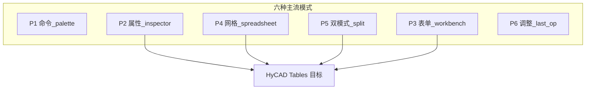
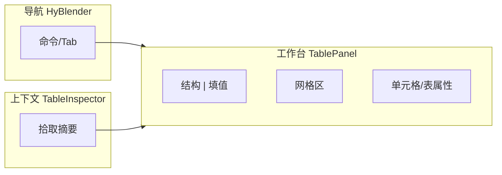

# 表格与 CAD 工具面板设计 — 产品调研与最优方法

> 文档编号：014  
> 调研日期：2026-06-25  
> 目标形态：AutoCAD PaletteSet + WPF（HyCAD.BlenderUI 主题）  
> 一句话目标：对比各类软件的 **面板/侧栏/属性栏** 设计，为 HyCAD Tables（AC11 填值面板）及统一侧栏 **提炼最优面板架构**  
> 上游：[001 表格工具调研](./001-AutoCAD表格工具-产品调研-2026-06-24-192049.md)、[002 双模式编辑](./002-统一表格Domain与双模式编辑-产品调研-2026-06-24-225625.md)、[012 排版策略](./012-表级结构优先与内容驱动排版-2026-06-25-185703.md)、[013 竖排文字](./013-表格竖排文字-产品调研-2026-06-25-192651.md)、[015 面板设置](./015-表格面板设置-产品调研-2026-06-25-194246.md)、[016 操作面板](./016-表格操作面板-分步规划-2026-06-25-200620.md)、[017 工作方式对比](./017-表格制作工作方式对比-产品调研-2026-06-25-220420.md)、[018 独立表格窗口](./018-独立表格编辑器窗口-纸张尺寸优先-产品调研-2026-06-25-223217.md)、[019 功能区设计](./019-独立表格编辑器功能区设计-产品调研-2026-06-25-223957.md)  
> 项目现状：[HyBlenderPanel](../../../src/HyCADTool/Shell/BlenderPanel/HyBlenderPanel.xaml)、[SettingsPanelViewModel](../../../src/HyCADTool/Shell/Preferences/SettingsPanelViewModel.cs)、[BeamMvpPanel 表单范式](../../../src/HyCADTool/Features/Fem/Views/BeamMvpPanel.xaml)  
> 性质：产品调研 + UX 架构建议；**不写 XAML 实现**

---

## 0. 目标与约束

### 0.1 核心问题

「面板」在 HyCAD 语境下至少指四类 UI，用户说的「面板研究」需先 **分型**，再谈最优：

| 类型 | 作用 | HyCAD 现例 |
|---|---|---|
| **A 命令启动器** | 搜命令、切 Tab、打开功能 | `HyBlenderPanel` |
| **B 全局设置** | 样式/图层/模块参数持久化 | `HySettings` / `SettingsPanelViewModel` |
| **C 上下文属性** | 随选区变化的可编辑字段 | AutoCAD Quick Properties；Revit Properties |
| **D 任务工作台** | 完成一条工作流（填表、求解、排版） | `BeamMvpPanel`；规划中的 **AC11 TablePanel** |

本调研 **重点 D + C**（表格工作台 + 拾取后属性），并给出与 A/B 的 **边界与组合** 建议。

### 0.2 目标用户

- 工程制图员：在 CAD 与面板间高频切换，双手不愿离开键盘  
- HyCAD 开发者：避免再增大 `HySettingsViewModel` 聚合；新 Tab 需可插件化  

### 0.3 约束（CAD 宿主硬约束）

| 约束 | 来源 | 对面板设计的影响 |
|---|---|---|
| **Modeless + 非命令上下文** | [AutoCAD .NET 论坛](https://forums.autodesk.com/t5/net-forum/best-practices-for-custom-properties-palettes/td-p/12353102) | 改图须 `ExecuteInCommandContextAsync` 或 `SendStringToExecute`，**禁止**按钮里直接 `Transaction` |
| **PaletteSet 可 dock** | [gileCAD](https://gilecad.azurewebsites.net/UserInterfaces_en.aspx) | 宽度窄（~320px 常见）；纵向滚动；可折叠 |
| **WPF 主题局部 merge** | 项目规则 B10/B11 | 仅 `UserControl.Resources.MergedDictionaries`；禁挂 `Application.Current.Resources` |
| **Undo 一致** | 同上 | 面板一次操作 = 一次命令边界；批量编辑用 OpLog（002/AC11） |

### 0.4 成功标准

1. 能画出 HyCAD Tables **AC11 面板线框**（信息架构 + 模式切换）  
2. 明确 **不与** SettingsPanel / HyBlender 命令列表混为一谈的分界  
3. 填值 10×6 表 **≤3 步** 打开并编辑（对齐 001）  
4. 012/013 参数（视口、Wrap/Shrink、竖排）有 **固定落点**（哪一区、哪一折叠块）

### 0.5 五维权重

| 维度 | 权重 |
|---|---|
| 功能（覆盖结构/填值/属性/预览） | 30% |
| 易用（步骤、键盘、窄宽） | 30% |
| 可靠安全（命令上下文、Undo） | 15% |
| 稳定（PaletteSet、主题） | 15% |
| 差异化（双模式 + CAD 原位） | 10% |

---

## 1. 面板设计模式 taxonomy



| 模式 | 代表产品 | 结构要点 | 适用 |
|---|---|---|---|
| **P1 命令 Palette** | HyBlenderPanel、Blender 无（用搜索+Outliner） | 左 Tab / 搜索 / 列表 | 启动命令，**非**编辑重数据 |
| **P2 上下文属性 Inspector** | Revit Properties、AutoCAD Quick Properties | 选什么显示什么；Type/Instance 分轨 | 单对象/单表摘要 + 少量字段 |
| **P3 表单 Workbench** | BeamMvpPanel、多数 FEM 面板 | ScrollViewer + 分组字段 + 主 CTA 按钮 | 参数少、一步提交 |
| **P4 网格 Spreadsheet** | Excel、SpreadJS Designer、Handsontable | 中央网格 + 顶 Ribbon/Formula + **右侧属性** | 填值模式核心 |
| **P5 双模式 Split** | 002 结构/填值；Figma Edit/Design（邻域） | 模式切换器；结构锁/填值锁 | **HyCAD Tables 必选** |
| **P6 Adjust Last Operation** | Blender Sidebar 底部、临时浮层 | 刚执行命令后的微调 | 插入表后调 Origin/纸型 |

---

## 2. 竞品清单

### 2.1 直接参照（面板 / 侧栏 / 表格 UI）

| 名称 | 形态 | 平台 | 商业模式 | 开源? | 面板要点 | 链接 |
|---|---|---|---|---|---|---|
| **HyCAD HyBlenderPanel** | CAD 插件侧栏 | AutoCAD | 自用 | 否 | IconTab + Search + 命令列表 + 内嵌 Feature 面板 | 项目内 |
| **HyCAD SettingsPanel** | 设置侧栏 | AutoCAD | 自用 | 否 | 分类 Tab；多 Feature VM 聚合 | 项目内 |
| **Blender N-Panel / Properties** | 3D 侧栏 | Desktop | 免费 GPL | 是 | 右 Sidebar 可折叠；Properties 按对象类型分 Tab；[HIG：少建新 Tab](https://developer.blender.org/docs/features/interface/human_interface_guidelines/editors/) | [Manual Regions](https://docs.blender.org/manual/en/dev/interface/window_system/regions.html) |
| **Autodesk Revit Properties** | 属性 Palette | Win | 订阅 | 否 | **上下文敏感**；Type Selector；多选交集属性 | [Help](https://help.autodesk.com/cloudhelp/2023/ENU/Revit-GetStarted/files/GUID-A764EA7A-FE26-469B-857C-F3A70812FC34.htm) |
| **AutoCAD Quick Properties** | 浮动属性 | Win | 订阅 | 否 | 光标旁小面板；可静态定位；可折叠行数 | [Autodesk Blog](https://www.autodesk.com/blogs/autocad/quick-properties-in-autocad-tuesday-tips-with-frank/) |
| **AutoCAD Table Cell Ribbon** | 上下文 Ribbon | Win | 订阅 | 否 | 选单元格才出现；对齐/样式 | [2027 Help](https://help.autodesk.com/cloudhelp/2027/ENU/AutoCAD-Core/files/GUID-918CE7B7-9D4E-4F22-9A2B-CD89D49B4BAE.htm) |
| **SpreadJS Designer** | Web 表格 IDE | 浏览器 | 商业 | 否 | Ribbon + Formula + **可 dock 右 Side Panel**（属性/形状） | [Designer](https://developer.mescius.com/spreadjs/docs/v19/spreadjs-designer-component) |
| **Microsoft Excel** | 桌面网格 | Win/Mac | 订阅 | 否 | 网格为主；Ribbon；右侧无默认属性栏（格式侧栏按需） | — |
| **Handsontable** | Web 网格 | 浏览器 | 商业+评估 | 部分 | 网格 + 右键；无 heavy 侧栏 | [Docs](https://handsontable.com/docs/javascript-data-grid/merge-cells/) |
| **LibreOffice Calc 侧边栏** | 桌面 | 跨平台 | 免费 | 是 | 选单元格 → 右侧属性 deck | 待核实 |
| **TextGrid** | CAD+独立窗 | AutoCAD 等 | 免费工具 | 否 | **独立窗口** Excel 式网格编辑 CAD 表 | [izawa-web](http://izawa-web.com/TextGrid/TextGrid2023.html) |
| **AutoTable** | Excel 驱动 | AutoCAD | 商业 | 否 | **无专用面板**；编辑在 Excel | [App Store](https://marketplace.autodesk.com/apps/9286bc2c-ffd1-48e8-911d-ab31bca401ba) |

### 2.2 邻域参考

| 名称 | 借鉴点 |
|---|---|
| VS Code Side Bar | 窄图标轨 + 宽内容区；可隐藏 |
| Figma Inspector | 右栏仅选区属性；与画布分离 |
| Notion Database | 表视图 + 行展开侧栏 |

---

## 3. 五维度分析（面板专项）

### 3.1 Blender — Sidebar + Properties

- **优点**：区域可 hide/show（N 键）；Adjust Last Operation 减少 permanent 面板；HIG 强调 **复用 Tab、子 Panel 防 scroll 过长**  
- **缺点**：插件过多 Tab 拥挤（社区公认）  
- **评分**：功能 4 · 易用 4 · 可靠 5 · 稳定 5 · 差异化 4 → **4.35**

### 3.2 Revit Properties Palette

- **优点**：**上下文敏感**标杆；Type/Instance 分离；多选交集；filter 按类别  
- **缺点**：字段过多时 scroll 长；BIM 参数模型对「表格填值」过重  
- **评分**：功能 5 · 易用 4 · 可靠 5 · 稳定 5 · 差异化 3 → **4.45**

### 3.3 SpreadJS Designer

- **优点**：**网格 + 可定制 Side Panel** 分离；dock 左/右；与 spreadsheet 焦点不抢  
- **缺点**：Web 布局；Ribbon 过重；商业授权  
- **评分**：功能 5 · 易用 4 · 可靠 4 · 稳定 4 · 差异化 3 → **4.15**

### 3.4 AutoCAD Quick Properties + Table Cell UI

- **优点**：不挡图；可固定位置；Table 单元格有对齐入口  
- **缺点**：**无表级工作台**；无 merge/竖排语义；native Table 编辑性能差（001）  
- **评分**：功能 2 · 易用 3 · 可靠 4 · 稳定 4 · 差异化 1 → **2.75**

### 3.5 TextGrid（CAD 表编辑窗）

- **优点**：**Excel 手感**；Enter 跳格；UNDO 本地；多 CAD 支持  
- **缺点**：独立窗口与 CAD **双宿主**；无 Domain；无结构/竖排语义  
- **评分**：功能 3 · 易用 4 · 可靠 3 · 稳定 3 · 差异化 2 → **3.20**

### 3.6 HyCAD 现状（HyBlender + Settings + BeamMvp）

- **优点**：Blender 风统一；`BlenderDark` 主题；Feature 面板可嵌入 Tab；BeamMvp 证明 **ScrollViewer 表单** 模式可行  
- **缺点**：`HySettingsViewModel` **过度聚合**；HyBlender 偏命令启动非数据编辑；**尚无 TablePanel**  
- **评分**：功能 3 · 易用 4 · 可靠 4 · 稳定 4 · 差异化 4 → **3.75**

### 3.7 汇总

| 方案 | 功能 | 易用 | 可靠 | 稳定 | 差异化 | 加权 | 总评 |
|---|---|---|---|---|---|---|---|
| Revit Properties | 5 | 4 | 5 | 5 | 3 | **4.45** | 上下文属性标杆 |
| Blender Sidebar | 4 | 4 | 5 | 5 | 4 | 4.35 | 区域折叠 + Adjust |
| SpreadJS Designer | 5 | 4 | 4 | 4 | 3 | 4.15 | 网格+Side Panel |
| HyCAD 现状 | 3 | 4 | 4 | 4 | 4 | 3.75 | 有壳缺 Table 工作台 |
| TextGrid | 3 | 4 | 3 | 3 | 2 | 3.20 | Excel 外挂 CAD |
| AutoCAD 原生 | 2 | 3 | 4 | 4 | 1 | 2.75 | 无表级面板 |

### 3.8 行业现状小结

**普遍做得好**：

- **上下文敏感**：选区驱动 Inspector（Revit、Figma）  
- **网格与属性分离**：SpreadJS 右栏改 cell 格式，网格保焦点  
- **可折叠 / 可 dock**：Blender、SpreadJS side panel  
- **窄侧栏 + 滚动表单**：CAD 插件通用（BeamMvp 范式）

**普遍短板**：

- AutoCAD **缺**「表级 Domain 工作台」  
- 把 **设置 / 命令 / 编辑** 塞进同一 Panel → 信息过载（HyCAD Settings 聚合风险）  
- Modeless 下 **Undo/线程** 易错（须命令包装）  
- Excel 系 **独立窗口** vs CAD **PaletteSet** 割裂（TextGrid）

---

## 4. 最优面板设计方法（HyCAD 推荐架构）

### 4.1 总原则：**三栏心智模型，两物理 Palette**

不在一个 ScrollViewer 里堆所有东西；用户心智分三层：

```text
[ 导航层 ]  HyBlenderPanel — 打开「表格」工具、搜 hyTable 命令
[ 工作台层 ] TablePanel（AC11 新 Palette 或 Blender Tab 内全高）— 填值/结构/预览
[ 上下文层 ] TableInspector — 拾取 CAD 表后浮动或 dock 窄条（可选 V2）
[ 全局层 ] SettingsPanel — 仅 DefaultTextHeight、Scale 等跨模块；不放表数据
```



### 4.2 AC11 TablePanel 推荐布局（P4 + P5 + P2）

**适用**：002 双模式；012 排版参数；013 竖排 Orientation。

```
┌─────────────────────────────────────┐  ~320px 宽
│ [结构] [填值]          [拾取表] [定稿] │  ← 模式 Toggle + 主 CTA
├─────────────────────────────────────┤
│ 表: 人员基本情况 | 7×7 | 已绑定 DWG   │  ← 上下文摘要条（P2）
├─ 操作区（016）──────────────────────│
│ 行/列 Numeric  [新建][模板▼][+/-行列] │  ← O1–O4 结构操作；详见 016 §2
│ [合并…][拆分]  [拾取表][写入图面]    │  ← O5 生命周期（AC11 M0 已有）
├─────────────────────────────────────┤
│ ▼ 表视口 (012)                       │  ← 折叠 Panel（Blender 子 Panel）
│   纸型 A3  宽 400  页高 —  Wrap ✓    │
├─────────────────────────────────────┤
│                                     │
│   【填值模式】DataGrid 7×7           │  ← P4 中央网格（虚拟化）
│   Anchor 合并格显示整句              │
│   Tab / Shift+Tab / 粘贴矩形         │
│                                     │
│   【结构模式】只读拓扑树或跳转 CAD    │  ← 结构锁；编辑在 AC10
├─────────────────────────────────────┤
│ ▼ 当前格属性                         │  ← SpreadJS 式 Side 区（底或右）
│   地址 (4,0)  竖排 ▼  字高 3.5      │  ← 013 CellStyle
│   角色 Label ▼                       │
├─────────────────────────────────────┤
│ [应用预览]  [写入图面]               │  ← ExecuteInCommandContext
└─────────────────────────────────────┘
```

**模式规则（002）**：

| 模式 | 网格可编辑 | Merge/行列 | 数据来源 |
|---|---|---|---|
| **填值** | Value 格 | 锁定 | `GridData` |
| **结构** | 否（或只读） | 提示「进入 CAD 编辑模式」 | `GridStructure` |

### 4.3 组件选型

| 区域 | 推荐 | 备选 | 理由 |
|---|---|---|---|
| 填值网格 | WPF `DataGrid` 虚拟化 | SpreadJS（WebView2） | 001/008 路线；PaletteSet 内 WPF 成熟；WebView2 主题/焦点坑 |
| 折叠块 | `Expander` + Blender 样式 | BlenderUI 若已有 Section | 对齐 P6/Blender 子 Panel |
| 单元格属性 | 底部固定条或右列 120px | 独立 Inspector 窗 | 320px 宽下 **底栏优于右栏** |
| 预览 | 可选 Html WebView2 只读 | 无 | 与 html-samples 对照（008e V6） |

### 4.4 与 HyBlenderPanel 的关系

| 方案 | 说明 | 推荐 |
|---|---|---|
| **A Tab 内嵌** | `HyBlenderPanel` 增「表格」Tab，内容为 `TablePanel` | **MVP 推荐** — 用户已习惯 HyB |
| **B 独立 PaletteSet** | `TablePaletteSet` 与 HyB 并列 | V2 — 填值需要更宽时可 dock 拉宽 |
| **D 独立 Window** | 命令区按钮 → `TableEditorWindow`（hyjc 式 ~1060px） | **完整编辑器** — 见 [018 §4](./018-独立表格编辑器窗口-纸张尺寸优先-产品调研-2026-06-25-223217.md)；Tab 保留快捷拾取 |
| **C 仅命令** | N36/N34 命令行无面板 | 否 — 001 差异化在编辑体验 |

### 4.5 交互与命令边界

```text
面板按钮「写入图面」
  → ViewModel 准备 TableGrid snapshot
  → ExecuteInCommandContextAsync(() => TablePublishCommand.Run(grid))
  → Undo 一次一步

面板改 CellValue
  → 仅内存 Domain；OpLog 栈（AC11）
  → 「写入图面」才触 CAD

拾取 DWG 表
  → PickTableCommand / AC7
  → 摘要条更新；网格绑定同一 TableGrid
```

### 4.6 键盘与步骤（非功能目标）

| 操作 | 快捷键 | 步数目标 |
|---|---|---|
| HyB → 表格 Tab | `Hy` 已开则 1 次点击 | 1 |
| 拾取已有表 | `Pick` 按钮 + 图面选 | 2 |
| 编辑 + 写回 | Tab 填格 + 「写入图面」 | 3 |

### 4.7 反模式（禁止）

| 反模式 | 原因 |
|---|---|
| 把 Table 字段塞进 `SettingsPanelViewModel` | 聚合失控；与 hy-settings.json 污染 |
| 在 HyBlender **命令列表** 里模拟 7×7 网格 | 命令列表为 P1，非 P4 |
| 面板内直接 `doc.LockDocument()` 写图 | Undo/线程坑 |
| 结构/填值同一网格无模式锁 | 误 merge（002 原则） |
| Application 级 ResourceDictionary 合并主题 | B10/B11 崩溃 |

---

## 5. 我应当做的产品（面板定义）

### 5.1 一句话定位

为 **HyCAD 制图员** 提供 **「Blender 风窄侧栏 + SpreadJS 式网格与属性分栏 + Revit 式拾取摘要」** 的 **TablePanel**，区别于 **TextGrid/AutoTable** 在于 **Domain 绑定、双模式、与 HyB 一体**。

### 5.2 MVP 功能集（MoSCoW）— AC11 面板

| 优先级 | 功能 |
|---|---|
| **Must** | HyBlender「表格」Tab；填值 DataGrid；绑定 `TableGrid`；Tab 跳格；写入图面命令包装 |
| **Must** | 拾取表 → 摘要条；结构/填值 Toggle（填值默认可用） |
| **Should** | 当前格属性条（Orientation/Role/TextHeight）；012 视口折叠块 |
| **Should** | OpLog Undo 栈（面板内） |
| **Could** | Html 预览；独立 PaletteSet；QuickProperties 式浮动 Inspector |
| **Won't(now)** | 结构模式内 merge 拖拽；Ribbon 化；SpreadJS 全功能 Designer |

### 5.3 差异化锚点

1. **双模式分离**（002）— 竞品多为单网格  
2. **PaletteSet 内 Domain 编辑** — 非 Excel 外挂  
3. **Blender 视觉一致** — HyCAD.BlenderUI 已有投资  

### 5.4 不做清单

- 不做第二套全局 Settings  
- 不做 AutoCAD 原生 Table 单元格内联编辑  
- 不在面板内实现 AC9 识别算法（仅触发命令）  

---

## 6. 最优实现路径

### 6.1 构建方式

| 层 | 推荐 | 理由 |
|---|---|---|
| UI 壳 | **复用** HyBlenderPanel Tab + `BlenderDark` | 014 §4.4 方案 A |
| 网格 | **自研** WPF DataGrid + `TableGrid` 投影 | 001；避免 SpreadJS 许可与 WebView2 |
| 属性条 | **自研** 轻量 VM `SelectedCellStyle` | 仿 SpreadJS side panel 子集 |
| 写 CAD | **复用** `AcadTableRenderer` + `ExecuteInCommandContextAsync` | AC2–AC7 已有 |

### 6.2 文件结构（005 对齐）

```text
Features/Tables/Presentation/
  TablePanel.xaml
  TablePanelViewModel.cs      // 绑定 TableGrid，模式切换
  TableFillGridAdapter.cs     // VisibleCell → 行列表（merge 显示）
  TableCellPropertyBar.xaml   // 可选子控件
Shell/BlenderPanel/
  HyBlenderPanel.xaml         // 增 Table Tab（或 PanelManager 注册）
```

### 6.3 路线图

| 阶段 | 交付 | 验收 |
|---|---|---|
| **MVP** | Tab + DataGrid + Pick + Publish | 人员表 7×7 填值写回 |
| **V1** | 单元格属性条 + 012 视口块 + 竖排 Orientation | 013/012 参数可视 |
| **V2** | OpLog；独立 PaletteSet；Inspector 浮动 | 多表切换 |

### 6.4 风险与对策

| 风险 | 对策 |
|---|---|
| DataGrid merge 显示 | 仅 Anchor 行；合并格 span 用 rowspan 样式或单格大项 |
| 300 格卡顿 | 虚拟化；编辑在内存，批量 Publish |
| 主题崩溃 | 局部 merge；见 wpf-paletteset skill |
| Settings 聚合复发 | **禁止** Table VM 并入 SettingsPanel |

### 6.5 假设验证

**最危险假设**：320px 宽 DataGrid 能否编辑 7×7 复杂 merge 表？

**验证**：WPF 原型仅 UI，用 `TableSamples.BuildPersonnelTable()` 绑定，团队试用 Tab/merge 格辨认率。

---

## 7. 面板模式速查表（给设计/实现）

| 需求 | 用哪种模式 | 不要用什么 |
|---|---|---|
| 启动 hyTable 命令 | P1 HyBlender | Settings |
| 改 Scale/文字样式 | B SettingsPanel | TablePanel |
| 填 50 个 Value 格 | P4 网格 | 命令列表 |
| 拾取后改纸型/Wrap | P2 摘要 + 折叠块 | 重新 Pick |
| 插入表后微调原点 | P6 Adjust（一次性 Expander） | 永久占屏 |
| CAD 画线改结构 | AC10 编辑模式 | 面板 merge 拖拽 |

---

## 8. 结论

各类软件的「最优面板」并非同一形态：**Revit 胜在上下文属性，SpreadJS 胜在网格与 Side Panel 分离，Blender 胜在区域折叠与 Adjust，AutoCAD 原生仅有碎片属性而缺表级工作台**。TextGrid/AutoTable 用 **外挂 Excel** 绕过面板设计，但不适合 HyCAD Domain 路线。

**HyCAD 最优解 = 四段式**：

1. **HyBlender** 只负责 **导航**（P1）  
2. **TablePanel** 负责 **填值网格 + 双模式 + 视口/单元格属性**（P4+P5+P2）  
3. **SettingsPanel** 只保留 **全局样式**（B），不碰表数据  
4. 所有写 CAD 经 **命令上下文**（CAD 硬约束）

**第一步**：在 `HyBlenderPanel` 增加「表格」Tab，落地 `TablePanel` MVP（DataGrid + Pick + Publish），再叠 012/013 折叠属性；**设置控件明细**见 [015 §5](./015-表格面板设置-产品调研-2026-06-25-194246.md)；**结构操作（新建/行列/合并）**见 [016 Step1–3](./016-表格操作面板-分步规划-2026-06-25-200620.md)。

---

## 附录 A · 自检清单

```
- [x] 面板分型 A/B/C/D
- [x] 竞品 ≥ 10，含 Blender/Revit/SpreadJS/AutoCAD/TextGrid/HyCAD
- [x] 五维打分 + 汇总 + 行业小结
- [x] 最优架构线框 + 与 HyBlender/Settings 边界
- [x] AC11 MoSCoW + 文件结构 + 路线图
- [x] CAD modeless/Undo 约束
- [x] 反模式清单
- [x] 与 002/012/013/008 AC11 交叉引用
- [x] 不写 XAML 实现
```

---

**版本**：1.0 | **更新**：2026-06-25
