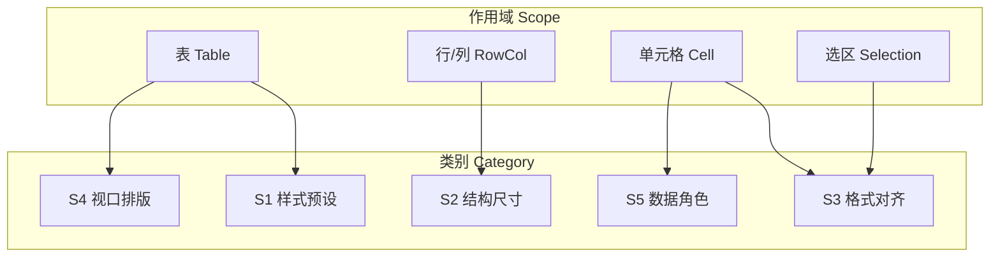

# 表格面板设置 — 产品调研与最优控件设计

> 文档编号：015  
> 调研日期：2026-06-25  
> 目标形态：HyCAD Tables AC11 · PaletteSet 内 WPF 设置区（~320px 宽）  
> 一句话目标：对标 **AutoCAD 自带表格 / Excel / Word / 常用表格工具** 的 **设置项与控件组织**，为 HyCAD 设计 **最优表格面板设置**（填什么、放哪、按什么作用域分组）  
> 与 [014](./014-表格与CAD工具面板设计-产品调研-2026-06-25-193648.md) 分工：**014 = 面板壳与信息架构**；**015 = 面板内「设置控件」全集与 Domain 映射**；**016 = S2 结构操作的按钮入口（新建/插删行列/合并），015 S2 仅只读显示 + 轨道模式**；**019 = 018 宽窗内各设置项的 Ribbon/Inspector 落点**  
> 上游：[001](./001-AutoCAD表格工具-产品调研-2026-06-24-192049.md)、[002](./002-统一表格Domain与双模式编辑-产品调研-2026-06-24-225625.md)、[005](./005-复杂表格Domain统一设计-2026-06-24-232335.md)、[012](./012-表级结构优先与内容驱动排版-2026-06-25-185703.md)、[013](./013-表格竖排文字-产品调研-2026-06-25-192651.md)、[014](./014-表格与CAD工具面板设计-产品调研-2026-06-25-193648.md)、[016 操作面板](./016-表格操作面板-分步规划-2026-06-25-200620.md)、[019 功能区设计](./019-独立表格编辑器功能区设计-产品调研-2026-06-25-223957.md)  
> Domain 现状：`CellStyle`、`GridTrack`、`BorderSet`、`CellRole`、`TextOrientation`（见 `src/HyCAD.Tables/Structure/`）  
> 性质：产品调研 + 设置面板 IA 规格；**不写 XAML 实现**

---

## 0. 目标与约束

### 0.1 核心问题

用户说的「表格面板设置」在竞品里通常拆成 **三层**：

| 层 | 含义 | 典型入口 |
|---|---|---|
| **S1 样式预设** | 整表默认外观（字体、边距、默认边框） | AutoCAD `TABLESTYLE`；Excel「表格样式」 |
| **S2 结构尺寸** | 行/列数、轨道宽高、merge、插删 | AutoCAD Insert Table；Word 表/行/列 Tab；**操作按钮见 [016](./016-表格操作面板-分步规划-2026-06-25-200620.md)，015 仅显示轨道** |
| **S3 选区格式** | 对齐、边框、方向、字高、换行 | Excel Format Cells；AutoCAD Cell Ribbon |

HyCAD 还需第四层 **S4 排版视口**（012 独有：`TableViewport` + `OverflowPolicy`），Office 无直接等价，由 Word 页宽 + Excel 列宽/shrink 组合近似。

### 0.2 目标用户

- 工程制图员：改表头对齐、外框加粗、侧栏竖排、A3 纸宽 —— **高频 S3 + S4**  
- 模板维护者：定义 Label/Value 角色、默认边框 —— **S1 + S2**

### 0.3 平台约束

| 约束 | 对面板设置的影响 |
|---|---|
| PaletteSet ~320px | **禁** Excel 式 6 Tab 大对话框为主路径；常用项 **底栏/顶栏**；高级项 **Expander** |
| 双模式（002） | **填值模式** 锁 merge/行列结构；**结构模式** 锁 Value 编辑 |
| CAD 1:1 mm | 尺寸字段标 **实际 mm**（红），不乘 Scale（项目规则） |
| Modeless | 「应用/写入图面」= 命令边界；设置预览可先内存 LayoutEngine |

### 0.4 成功标准

1. 产出 **设置项 master 清单**（≥40 项）及竞品覆盖矩阵  
2. 每项映射到 **Domain 字段** 或标「UI-only / V2」  
3. 给出 **HyCAD 最优设置分区线框**（Quick / 作用域 Tab / Expander）  
4. 人员表典型操作（外框加粗、侧栏竖排、A3 宽、换行）**≤2 次点击** 到达控件

### 0.5 五维权重（设置面板专项）

| 维度 | 权重 | 说明 |
|---|---|---|
| 功能（设置覆盖度） | 30% | 能否配齐工程表所需 |
| 易用（发现性、步骤） | 30% | 窄面板下能否快速找到 |
| 可靠（与 Domain 一致） | 15% | 改设置不丢 merge/Undo |
| 稳定 | 10% | 预览/写 CAD 一致 |
| 差异化（012/013/CAD） | 15% | 视口、竖排、线宽 mm |

---

## 1. 设置项 taxonomy（作用域 × 类别）



| 作用域 | S1 样式 | S2 结构 | S3 格式 | S4 视口 | S5 数据 |
|---|---|---|---|---|---|
| **表** | 默认边框、默认字高 | 行列总数 | — | 纸型、总宽、分页 | 表名/模板 ID |
| **行/列** | — | 轨道 Fixed/Auto/Weight、插删 | — | 重复表头行 | — |
| **单元格** | — | merge（结构模式） | 对齐、边框、竖排、字高 | Wrap/Shrink 作用区 | Role、FieldKey |
| **选区** | 格式刷 | 批量行高/列宽 | 九点对齐、边框预设 | InteractionRegion | 批量 Role |

---

## 2. 竞品清单（设置能力向）

### 2.1 直接参照

| 名称 | 设置入口 | 核心设置组 | 链接 |
|---|---|---|---|
| **AutoCAD TABLE + Table Style** | Insert Table 对话框；`TABLESTYLE`；选格 → Table Cell Ribbon | 行列数、列宽、行高(行数×字高)、样式预设、单元格对齐、边框线宽/线型/颜色、双线、合并、插删行列 | [Insert Table](https://help.autodesk.com/cloudhelp/2027/ENU/AutoCAD-Core/files/GUID-135907BC-6148-4DC7-93A9-65233D882919.htm)、[Cell Ribbon](https://help.autodesk.com/cloudhelp/2025/ENU/AutoCAD-LT/files/GUID-918CE7B7-9D4E-4F22-9A2B-CD89D49B4BAE.htm)、[Cell Border](https://help.autodesk.com/cloudhelp/2025/ENU/AutoCAD-LT/files/GUID-FFA80DE7-A343-43D3-9084-3EE5EF7F2C50.htm) |
| **Microsoft Excel** | Home 工具栏；`Ctrl+1` Format Cells | Number / Alignment / Font / Border / Fill / Protection 六 Tab；Wrap、Shrink to Fit、Merge、方向角 | [Format Cells (MS)](https://learn.microsoft.com/en-us/office/troubleshoot/excel/format-cells-settings) |
| **Microsoft Word** | 右键 Table Properties；Layout / Design Tab | **Table / Row / Column / Cell** 四 Tab；对齐、Preferred width、垂直对齐、边距、环绕、重复表头 | [Table Properties](https://support.microsoft.com/en-us/office/set-or-change-table-properties-3237de89-b287-4379-8e0c-86d94873b2e0) |
| **Google Sheets** | 工具栏 + Format 菜单 | 对齐、换行三态(Overflow/Clip/Wrap)、边框、合并、条件格式 | [OpenStax Sheets](https://openstax.org/books/workplace-software-skills/pages/9-8-formatting-and-templates-in-google-sheets) |
| **LibreOffice Calc** | `Ctrl+1` Format Cells；Cell Style | 与 Excel 同族六 Tab + **Padding**、文字旋转、Shrink to fit | [Calc Formatting](https://books.libreoffice.org/en/CG248/CG24803-FormattingData.html) |
| **SpreadJS Designer** | Ribbon Home + Format Cells 对话框 + 右侧 Report Cell Panel | Font/Alignment/Number/Styles/Cells 分组；Report 专用右栏 DataBinding | [Home Tab](https://developer.mescius.com/spreadjs/docs/spreadjs-designer-component/designerinterface/spdesigntab/spdesignhometab) |
| **TextGrid** | 独立 Excel 式窗口 | 网格内直接改；CAD 侧仅同步 | [izawa-web](http://izawa-web.com/TextGrid/TextGrid2023.html)（邻域） |
| **AutoTable** | 无 CAD 内设置；在 Excel 改 | Excel 全功能 | Autodesk App Store（间接） |

### 2.2 邻域参考

| 名称 | 借鉴设置项 |
|---|---|
| Figma Inspector | 选区驱动；数值 stepper；九格对齐 |
| Revit Properties | Type/Instance 分轨；多选交集 |

---

## 3. 竞品设置项对照矩阵（Master Settings Matrix）

> ✓=有 · ◐=弱/间接 · ✗=无 · **Hy**=HyCAD Domain 已有或 012/013 规划

| 设置项 | AutoCAD | Excel | Word | Sheets | Calc | **Hy Domain** |
|---|---|---|---|---|---|---|
| **表级** |
| 纸张/页宽预设 | ◐窗口插入 | ✗ | ✓表对齐页 | ✗ | ✗ | **TableViewport.PaperPreset** |
| 表总宽度 | ✓列宽和 | ◐列宽 | ✓Preferred width | ✓列宽 | ✓ | **TargetWidthMm** |
| 页高/分页 | ✗ | ✗ | ✓分页重复表头 | ✗ | ✗ | **MaxPageHeightMm, RepeatHeaderRows** |
| 插入点/原点 | ✓ | ✗ | ✓环绕定位 | ✗ | ✗ | **OriginX/Y** |
| 表样式预设 | ✓TABLESTYLE | ✓Table Style | ✓Table Style | ✓ | ✓Cell Style | 模板 JSON V2 |
| 默认边框 | ✓样式 | ◐网格线 | ✓ | ✓ | ✓ | **DefaultBorder** |
| **行列** |
| 行数/列数 | ✓Insert | ✓ | ✓ | ✓ | ✓ | **GridTopology** |
| 列宽 Fixed | ✓mm/字符 | ✓ | ✓ | ✓ | ✓ | **GridTrack Fixed** |
| 行高 Auto | ◐行=行数×字高 | ✓Wrap 撑高 | ✓ | ✓Wrap | ✓ | **GridTrack Auto** |
| 列 Weight 分配 | ✗ | ◐ | ✗ | ✗ | ✗ | **GridTrack Weight** |
| 插删行列 | ✓Ribbon | ✓ | ✓Layout | ✓ | ✓ | 结构模式 AC10 |
| **单元格格式** |
| 水平对齐 L/C/R | ✓ | ✓ | ✓九格 | ✓ | ✓ | **HAlign** |
| 垂直对齐 T/M/B | ✓ | ✓ | ✓ | ✓ | ✓ | **VAlign** |
| 自动换行 | ✗ | ✓Wrap | ✓ | ✓ | ✓ | **OverflowPolicy.AllowWrap** |
| 缩小字高 | ✗ | ✓Shrink | ◐Fit | ✗ | ✓Shrink | **AllowShrink** |
| 竖排堆字 | ✗Manage Cell 弱 | ◐@字体 | ◐ | ✗ | ◐旋转 | **VerticalStacked** |
| 字高/字体 | ✓TextStyle | ✓Font | ✓ | ✓ | ✓ | **TextHeight, FontKey** |
| 四边边框独立 | ✓8向+预览 | ✓ | ✓ | ✓ | ✓+Padding | **BorderSet** |
| 外框加粗 | ✓ | ✓预设 | ✓ | ✓ | ✓ | **BorderSet + AC6** |
| 双线边框 | ✓ | ✓ | ✓ | ◐ | ✓ | V2 |
| 背景色/填充 | ◐ | ✓Fill | ✓Shading | ✓ | ✓ | **BackColor** |
| 单元格边距 | ✓TableStyle | ✗ | ✓Options | ✗ | ✓Padding | **CellPaddingMm** V1 |
| **结构与数据** |
| 合并/拆分 | ✓ | ✓ | ✓ | ✓ | ✓ | **MergeRegion** 结构模式 |
| 单元格角色 | ✗ | ✗ | ✗ | ✗ | ✗ | **CellRole** |
| FieldKey 填值 | ✗Field | ✗ | ✗ | ✗ | ✗ | **GridData** |
| 公式/字段 | ✓Field | ✓ | ✓ | ✓ | ✓ | Won't MVP |
| 块/图片格 | ✓Block | ✓ | ✓ | ✓ | ✓ | **PhotoSlot** |

**矩阵结论**：

- **Office 三件套**强在 S3（Format Cells 六 Tab）与 **Word 四 Tab 作用域**  
- **AutoCAD** 强在 **CAD 边框线宽/线型/双线** 与 **Table Style 预设**，弱在换行/竖排/视口  
- **HyCAD Domain 已覆盖** 工程表 80% 设置语义；缺口主要在 **UI 组织** 与 **InteractionRegion 框选**

---

## 4. 五维度分析（设置 UX）

### 4.1 Microsoft Excel — Format Cells 范式

- **优点**：六 Tab 分类清晰；`Ctrl+1` 一次到位；Alignment 集 Wrap/Shrink/Merge/角度；Border 预设+单线预览图  
- **缺点**：**模态对话框**打断填值流；无表级视口；CAD 线宽语义缺失  
- **评分**：功能 5 · 易用 4 · 可靠 5 · 稳定 5 · 差异化 2 → **4.35**

### 4.2 Microsoft Word — Table Properties 四 Tab

- **优点**：**作用域 Tab（表/行/列/格）** 与用户心智一致；Cell 垂直对齐 + 边距；重复表头行  
- **缺点**：排版对话框深；无 spreadsheet 式批量填值  
- **评分**：功能 4 · 易用 4 · 可靠 5 · 稳定 5 · 差异化 2 → **4.15**

### 4.3 AutoCAD — Table Style + Cell Ribbon

- **优点**：**边框 8 向 + 预览** 贴合 CAD；Table Style 管默认；Properties _palette 可改单格  
- **缺点**：**无 Wrap/Shrink**；竖排仅 Manage Cell Content 弱支持；Ribbon 不适合 320px PaletteSet；设置分散在 Style / Ribbon / 右键三处  
- **评分**：功能 3 · 易用 3 · 可靠 4 · 稳定 3 · 差异化 3 → **3.35**

### 4.4 Google Sheets — 工具栏快设

- **优点**：对齐/换行/边框 **一键可见**；Wrap 三态明确  
- **缺点**：高级项仍进菜单；无 mm 线宽  
- **评分**：功能 4 · 易用 5 · 可靠 4 · 稳定 4 · 差异化 2 → **4.15**

### 4.5 LibreOffice Calc

- **优点**：Excel 同族 + **Border Padding**；Shrink/Wrap/旋转齐全  
- **缺点**：信息密度高；与 CAD 无关  
- **评分**：功能 5 · 易用 3 · 可靠 4 · 稳定 4 · 差异化 1 → **3.85**

### 4.6 SpreadJS Designer

- **优点**：Ribbon 分组（Font/Alignment/Cells）+ **Format Cells 箭头** 双层；Report 右栏 **上下文专用项**  
- **缺点**：Web 宽屏假设；商业授权  
- **评分**：功能 5 · 易用 4 · 可靠 4 · 稳定 4 · 差异化 2 → **4.05**

### 4.7 汇总

| 竞品 | 功能 | 易用 | 可靠 | 稳定 | 差异化 | 加权 | 设置 UX 总评 |
|---|---|---|---|---|---|---|---|
| Excel Format Cells | 5 | 4 | 5 | 5 | 2 | **4.35** | 格式控件最全 |
| Word Table Properties | 4 | 4 | 5 | 5 | 2 | 4.15 | **作用域 Tab 最佳** |
| Google Sheets 工具栏 | 4 | 5 | 4 | 4 | 2 | 4.15 | 快设标杆 |
| SpreadJS Designer | 5 | 4 | 4 | 4 | 2 | 4.05 | Ribbon+右栏 |
| LibreOffice Calc | 5 | 3 | 4 | 4 | 1 | 3.85 | Padding 参考 |
| AutoCAD 原生 | 3 | 3 | 4 | 3 | 3 | 3.35 | CAD 边框强、排版弱 |

### 4.8 行业现状小结

**普遍做得好**：

- **选区驱动**：改谁显示谁的属性（Word Cell Tab、SpreadJS Report Panel）  
- **九格对齐** + **Wrap/Shring 二选一或并存**（Excel/Calc）  
- **边框预设 + 单线点选预览**（Excel Border Tab、AutoCAD Cell Border）  
- **表/行/列/格作用域分离**（Word）

**普遍短板**：

- 设置入口 **分散**（AutoCAD Style vs Ribbon vs 右键）  
- **窄侧栏** 产品少，多数假设 Ribbon 或全屏  
- **工程竖排 + 视口分页** 无一家在「表格设置面板」里完整覆盖  
- Excel/Word **无 CAD 线宽 mm** 语义

---

## 5. HyCAD 最优表格面板设置设计

### 5.1 设计公式（融合竞品长处）

```text
最优 HyCAD 表格设置 =
  Word 的「作用域 Tab」
+ Excel 的「Alignment/Border 控件语义」
+ Google Sheets 的「顶栏/底栏快设」
+ AutoCAD 的「边框 8 向 + 线宽 mm」
+ 012/013 独有的「视口 + 竖排 + InteractionRegion」
+ 014 的「320px 底栏属性条 + Expander 折叠」
```

**禁止**：整页 Excel 六 Tab 对话框；把表数据塞进 SettingsPanel（014 §4.7）。

### 5.2 推荐布局（TablePanel 设置区）

```
┌─────────────────────────────────────┐
│ [结构|填值]  表:人员表 7×7  [写入]   │  ← 014 模式条
├─────────────────────────────────────┤
│ QUICK 快设条（选区≥1 格时启用）       │
│ [≡≡≡] 九格对齐  [↕竖排▼] [↩Wrap]   │  ← Sheets + Excel Alignment 子集
│ [B] 边框预设: 全|外|无  线宽[0.35▼]  │  ← AutoCAD Border 子集
├─────────────────────────────────────┤
│ SCOPE 作用域 Tab（Word 四 Tab 简化为三）│
│ [表] [行/列] [单元格]                 │
├─ 表 Tab ───────────────────────────  │
│ ▼ 视口与分页 (012)                   │
│   纸型 A3  总宽 400  页高 —  分页✓   │
│   重复表头 1  边距 10                │
│ ▼ 溢出策略 (012)                     │
│   Wrap✓ Shrink☐  MinRatio 0.75      │
│   共同作用区 [框选…]  (两开必填)      │
│ ▼ 默认样式                           │
│   默认字高 3.5  默认边框 0.18        │
├─ 行/列 Tab（结构模式）──────────────  │
│   选中: 第 3 行  模式 Auto  高 —     │
│   选中: 第 2 列  模式 Weight 1.2    │
│   [+行][-行][+列][-列]               │
├─ 单元格 Tab ───────────────────────  │
│   地址 (4,0)  合并 4×1               │
│   角色 Header▼  FieldKey —          │
│   方向 VerticalStacked▼             │  ← 013
│   字高 3.5  H:Center V:Middle       │
│   边框 [预览8向图] Top Right…       │
│   背景 #FFFFFF  内边距 1.0          │
└─────────────────────────────────────┘
```

### 5.3 控件类型选型

| 设置项 | 控件 | 竞品参照 | 备注 |
|---|---|---|---|
| 九格对齐 | 3×3 `ToggleButton` 矩阵 | Word Layout | 单选；多选格批量应用 |
| 竖排方向 | Combo：`Horizontal` / `VerticalStacked` | 013 | 禁 90° 旋转项 |
| Wrap / Shrink | CheckBox ×2 + 联动校验 | Excel Alignment | 012 校验规则 |
| InteractionRegion | 按钮→CAD 框选 / MVP 行号 | Excel 无 | HyCAD 独有 |
| 纸型/总宽 | Combo + NumericUpDown(mm) | Word 表宽 | 红色 mm 标签 |
| 行列模式 | Combo：Fixed/Auto/Weight + 数值 | CSS Grid 概念 | 012 Pass1 |
| 边框 8 向 | 小预览图 + 线宽 Spinner | AutoCAD Border Dialog | mm 非 BYLAYER |
| 默认样式 | Expander 折叠 | TABLESTYLE | 稀疏 Style 字典 |
| 角色 Role | Combo | HyCAD 独有 | Label/Value/Header… |

### 5.4 双模式下的设置可见性

| 设置组 | 填值模式 | 结构模式 |
|---|---|---|
| Quick 对齐/竖排/Wrap | ✓ | ✓ |
| Quick 边框 | ✓ | ✓ |
| 表·视口/溢出 | ✓ | ✓ |
| 行/列 插删/Track | ✗只读 | ✓ |
| Merge/拆分 | ✗ | ✓ |
| FieldKey/Value 编辑 | ✓网格 | ✗ |
| Role | ✓ | ✓ |

### 5.5 设置项 → Domain 映射表（实现用）

| UI 标签 | Domain 路径 | MVP |
|---|---|---|
| 纸型 | `TableViewport.PaperPreset` | ✓ |
| 总宽 mm | `TableViewport.TargetWidthMm` | ✓ |
| 页高 | `TableViewport.MaxPageHeightMm` | Should |
| Wrap | `OverflowPolicy.AllowWrap` | ✓ |
| Shrink | `OverflowPolicy.AllowShrink` | Should |
| 共同作用区 | `OverflowPolicy.InteractionRegion` | Should |
| 默认边框 | `GridTopology.DefaultBorder` | ✓ |
| 列宽模式 | `GridTopology.Cols[i].Mode/Size` | 结构 |
| 行高模式 | `GridTopology.Rows[i].Mode/Size` | 结构 |
| 水平对齐 | `CellStyle.HAlign` | ✓ |
| 垂直对齐 | `CellStyle.VAlign` | ✓ |
| 竖排 | `CellStyle.Orientation` | ✓ |
| 字高 | `CellStyle.TextHeight` | ✓ |
| 四边边框 | `CellStyle.Borders` | ✓ |
| 背景 | `CellStyle.BackColor` | Could |
| 角色 | `GridStructure.Roles[addr]` | Should |
| 内边距 | `CellPaddingMm`（012 全局） | V1 |

### 5.6 与 AutoCAD 原生设置的差异（刻意为之）

| AutoCAD | HyCAD 015 决策 | 理由 |
|---|---|---|
| Table Style 独立管理器 | 表级「默认样式」Expander + JSON 模板 V2 | PaletteSet 内完成 |
| 行高 = 行数×字高 | `GridTrack Auto` + LayoutEngine 测量 | 012 内容驱动 |
| Manage Cell Content 改方向 | `Orientation=VerticalStacked` 单字段 | 013 |
| BYBLOCK/BYLAYER 边框色 | 固定 mm 线宽 + HyCAD 图层 | 001 样式统一 |
| Properties _palette 改表 | TablePanel 自包含 | 014 工作台 |

---

## 6. 我应当做的产品（设置面板定义）

### 6.1 一句话定位

为 **HyCAD 工程制图员** 提供 **「Word 作用域 + Excel 对齐语义 + AutoCAD 边框 + 012 视口」** 的 **窄侧栏表格设置区**，使 **复杂表排版参数可发现、可预览、可写回 Domain**，区别于 **AutoCAD 原生** 的分散 Ribbon/Style。

### 6.2 MVP 设置集（MoSCoW）

| 优先级 | 设置控件 |
|---|---|
| **Must** | Quick 九格对齐；Orientation；表 Tab·纸型+总宽；默认字高；单元格字高/对齐；边框预设(全/外/无)+线宽；写入图面 |
| **Should** | Wrap/Shrink + 校验；Role Combo；行/列 Tab 只读显示 Track；InteractionRegion 行号 MVP |
| **Could** | 8 向边框预览图；BackColor；RepeatHeaderRows；格式刷 |
| **Won't(now)** | 双线边框；Number 格式；公式/Field；条件格式；TABLESTYLE 级联全图 |

### 6.3 非功能目标

| 指标 | 目标 |
|---|---|
| 外框加粗 | 选表 → Quick 边框「外框」→ 线宽 0.7：**2 点击** |
| 侧栏竖排 | 选格 → Orientation VerticalStacked：**2 点击** |
| A3 宽 | 表 Tab → 纸型 A3：**1 点击**（联动总宽） |
| 改设置后预览 | 内存 LayoutEngine **&lt;200ms**（7×7） |
| Undo | 每次「应用预览/写入」一步 |

### 6.4 差异化锚点

1. **012 视口+溢出** 进表 Tab — Office 无同等项  
2. **VerticalStacked** 进 Quick — AutoCAD 无  
3. **CellRole** — 工程 Label/Value 语义  
4. **mm 1:1** 全线宽/字高 — CAD 原生  

### 6.5 不做清单

- 不做 Excel 六 Tab 克隆  
- 不做 SettingsPanel 全局聚合  
- 不做 CAD 内 TABLESTYLE 兼容导入（V2 再议）  
- 填值模式不提供 merge 拖拽  

---

## 7. 最优实现路径

### 7.1 构建方式

| 层 | 推荐 |
|---|---|
| Quick 条 | 自研 WPF `UserControl` + Blender 样式 Toggle |
| 作用域 Tab | 自研 TabControl；VM `TableSettingsScope` enum |
| 边框预览 | 自研 8 向小控件（可参考 AutoCAD 预览逻辑，不抄 UI） |
| 预览刷新 | 调 `LayoutEngine` + 可选 Html 只读预览（008e V6） |
| 写 CAD | `ExecuteInCommandContextAsync` + `AcadTableRenderer` |

**不推荐**：SpreadJS Designer 嵌入（许可+窄宽+主题）；AutoCAD TableStyle API 双向同步。

### 7.2 文件结构

```text
Features/Tables/Presentation/
  TablePanel.xaml
  TablePanelViewModel.cs
  Settings/
    TableQuickSettingsBar.xaml      ← Quick 对齐/竖排/Wrap/边框
    TableScopeTabHost.xaml          ← 表|行/列|单元格
    TableViewportExpander.xaml      ← 012
    TableCellFormatExpander.xaml    ← 013 + BorderSet
    BorderPreviewControl.xaml       ← 8 向可选 V1
```

### 7.3 路线图

| 阶段 | 设置交付 | 验收 |
|---|---|---|
| **MVP** | Quick 对齐+竖排；表 Tab 纸型/总宽；单元格字高 | 人员表侧栏竖排+居中 |
| **V1** | Wrap/Shrink+校验；Role；边框线宽；行/列只读 | 家庭表换行不 clip |
| **V2** | InteractionRegion 框选；8 向预览；模板预设 | 012 DoD 全过 |

### 7.4 风险与对策

| 风险 | 对策 |
|---|---|
| 320px 放不下 8 向预览 | MVP 仅预设；V1 用 Popover |
| Wrap+Shrink 误开 | 012 ViewModel 校验 + 禁用写入 |
| 多选格属性不一致 | 显示「混合」+ 改即批量应用 |
| 设置与网格焦点争抢 | Quick 条固定；Tab 区 ScrollViewer |

### 7.5 假设验证

**最危险假设**：Quick 底栏能否替代 Excel 对话框完成 **80%** 格式操作？

**验证**：7×7 人员表任务脚本（对齐/竖排/外框/换行），计时对比「全用 Expander」vs「Quick+Tab」，目标 Quick 路径 **≤50% 点击数**。

---

## 8. 设置入口速查（给用户/实现）

| 我想… | 去哪 | 竞品等价 |
|---|---|---|
| 整表改 A3 宽 | 表 Tab → 视口 | Word 表宽 |
| 让长句换行 | Quick Wrap 或 表 Tab 溢出 | Excel Wrap |
| 侧栏一字一行 | Quick 竖排 | Word 无；013 |
| 外框加粗 | Quick 边框「外框」+ 线宽 | AutoCAD Border |
| 改某列变宽 | 结构模式 → 行/列 Tab | Excel 拖列宽 |
| 设 Label 格 | 单元格 Tab → Role | HyCAD 独有 |
| 指定哪几行可缩小 | 表 Tab → 共同作用区 | Excel 无 |

---

## 9. 结论

**AutoCAD 自带表格**的设置分散在 Table Style、Insert 对话框与 Cell Ribbon，**边框强、排版弱、竖排/Wrap 几乎缺失**。**Excel** 以 Format Cells 六 Tab 成为 **S3 格式** 事实标准；**Word** 以 **表/行/列/格四 Tab** 成为 **作用域** 事实标准；**Google Sheets** 证明 **工具栏快设** 对高频项最有效。

**HyCAD 最优表格面板设置** 不应选边站，而应：

1. **Quick 条**承担 80% 高频（对齐、竖排、Wrap、边框预设）  
2. **Word 式三 Tab** 承担作用域（表 / 行/列 / 单元格）  
3. **Expander** 承担 012 视口与溢出（差异化）  
4. 每项 **直绑 Domain**，经 LayoutEngine 预览后再写 CAD  

**第一步（AC11 V1）**：在 [014](./014-表格与CAD工具面板设计-产品调研-2026-06-25-193648.md) 的 `TablePanel` 上落地 **Quick 条 + 表 Tab 视口 + 单元格 Tab**，用 `TableSamples.BuildPersonnelTable()` 验收竖排与外框。

---

## 附录 A · 自检清单

```
- [x] 与 014 范围分界明确（壳 vs 设置项）
- [x] 竞品 ≥ 8（AutoCAD/Excel/Word/Sheets/Calc/SpreadJS/TextGrid/AutoTable）
- [x] Master Settings Matrix ≥ 30 项
- [x] 五维打分 + 汇总 + 行业小结
- [x] 最优布局线框 + 双模式可见性 + Domain 映射表
- [x] MoSCoW + 路线图 + 风险 + 假设验证
- [x] 竞品事实附来源链接
- [x] 不写 XAML 实现
```

---

**版本**：1.0 | **更新**：2026-06-25
