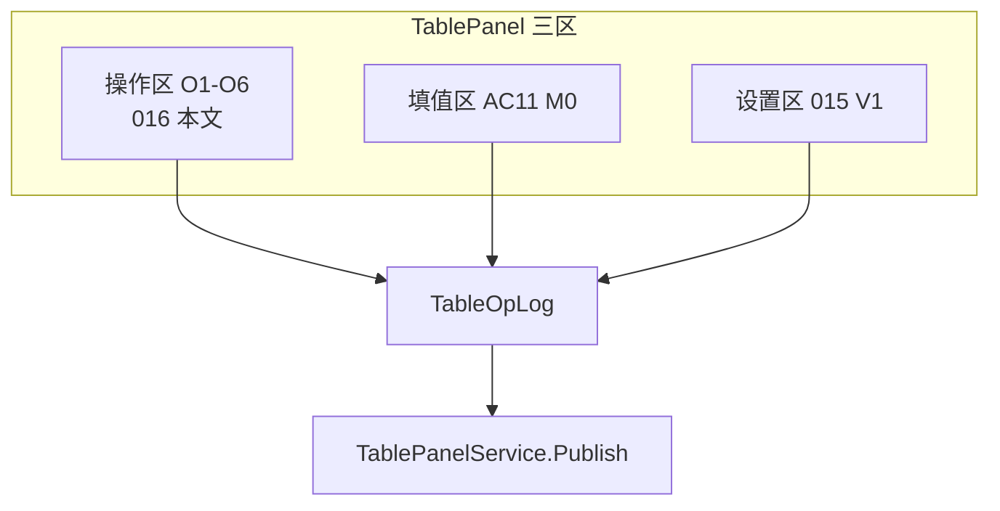

# 表格操作面板 — 分步规划（016）

> 文档编号：016  
> 生成日期：2026-06-25  
> 一句话目标：在 HyBlender「表格」Tab 内，除 **填值（AC11 M0 已落地）** 与 **格式设置（015 V1 后置）** 之外，定义 **插入表格 / 设定行列 / 结构操作** 的操作区落点、Domain 映射与分步交付路线。  
> 上游：[002 双模式编辑](./002-统一表格Domain与双模式编辑-产品调研-2026-06-24-225625.md)、[008 AC 分阶段计划](./008-AutoCAD表格制作分阶段实施计划-2026-06-25-143000.md)、[012 排版策略](./012-表级结构优先与内容驱动排版-2026-06-25-185703.md)、[014 面板壳](./014-表格与CAD工具面板设计-产品调研-2026-06-25-193648.md)、[015 面板设置](./015-表格面板设置-产品调研-2026-06-25-194246.md)、[017 工作方式对比](./017-表格制作工作方式对比-产品调研-2026-06-25-220420.md)（方式 A 主范式，016 为 A 的结构操作分步）、[018 独立窗口](./018-独立表格编辑器窗口-纸张尺寸优先-产品调研-2026-06-25-223217.md)（016 操作迁入宽窗 + 纸张区）、[019 功能区设计](./019-独立表格编辑器功能区设计-产品调研-2026-06-25-223957.md)（O1–O4 → 布局 Tab）  
> 代码现状：[TablePanel.xaml](../../../src/HyCADTool/Features/Tables/Views/TablePanel.xaml)、[TablePanelViewModel.cs](../../../src/HyCADTool/Features/Tables/ViewModels/TablePanelViewModel.cs)、[TablePanelService.cs](../../../src/HyCADTool/Features/Tables/Application/TablePanelService.cs)、[GridEditor.cs](../../../src/HyCAD.Tables/Operations/GridEditor.cs)、[TableSamples.cs](../../../src/HyCAD.Tables/Samples/TableSamples.cs)  
> 性质：**可执行分步规划**——只描述步骤、交付、验收、依赖；**不写 XAML/C# 实现**（016 本身）

---

## 0. 目标与边界

### 0.1 核心问题

014 定义了 TablePanel **壳与三区信息架构**；015 定义 **S1–S4 设置控件**；AC11 M0 已落地 **填值 DataGrid + Pick + Publish**。尚缺一块明确规格：

> **「像 AutoCAD Insert Table 一样」新建表、改行列、插删行列、合并拆分——这些结构操作放哪、怎么绑 Domain、分几步交付？**

016 回答上述问题，并给出与 015 **S2 结构尺寸** 的分界。

### 0.2 一句话定位

为工程制图员提供 **AutoCAD Insert Table 式** 的结构操作区，绑定 `TableGrid` + `TableOpLog`，与填值/设置分离。

### 0.3 成功标准

| 指标 | 目标 |
|---|---|
| 新建空表 | 设 5×4 → 新建 → DataGrid 显示 20 个 Anchor 行（Label 为空） |
| 结构编辑闭环 | 插入 1 行 → 合并 2×2 → 写入图面 **≤6 步**（含打开 Tab） |
| Domain 一致 | 所有结构改动经 `TableOpLog.Apply`；Publish 仍走 `TablePanelService.TryPublish` |
| 双模式 | 填值模式锁 O3/O4；结构模式锁 Value 编辑（002） |

### 0.4 明确不做

| 项 | 归属 |
|---|---|
| Excel 公式 / 计算字段 | 002 V2+ |
| CAD 内画线成表（Explode 编辑） | AC10 / Step6 仅规划 |
| 独立 PaletteSet | 014 §4.4 方案 B，V2 |
| 015 Quick/Tab 格式设置 | 015 V1，Step4 并行 |
| Specify Window 反推行数 | 012 `TargetWidthMm`，V2 |

### 0.5 与 sibling 文档分工

| 文档 | 职责 |
|---|---|
| [014](./014-表格与CAD工具面板设计-产品调研-2026-06-25-193648.md) | 面板壳、双模式、HyBlender Tab |
| [015](./015-表格面板设置-产品调研-2026-06-25-194246.md) | S1–S4 **设置控件**（对齐/边框/视口） |
| [012](./012-表级结构优先与内容驱动排版-2026-06-25-185703.md) | 排版算法与 `TableViewport` |
| [013](./013-表格竖排文字-产品调研-2026-06-25-192651.md) | 竖排语义 |
| **016（本文）** | **O1–O6 操作面板** 分步规划 |
| AC11 M0（已实现） | 填值 DataGrid + Pick + Publish |



---

## 1. 操作 taxonomy（O1–O6）

| 编号 | 操作类 | 竞品参照 | Domain / Op |
|---|---|---|---|
| **O1 新建** | 插入空表 / 从模板 | AutoCAD Insert Table 对话框 | `TableGrid.CreateEmpty` |
| **O2 表级结构** | 行数、列数、默认行高/列宽 | Insert Table Column & Row Settings | `GridTopology` + `GridTrack` |
| **O3 行列编辑** | 插删行/列、选中行/列索引 | AutoCAD Cell Ribbon Rows/Columns | `InsertRowOp` / `DeleteRowOp` / `InsertColumnOp` / `DeleteColumnOp` |
| **O4 合并** | Merge / Unmerge | Excel / AutoCAD Merge | `MergeOp` / `UnmergeOp` |
| **O5 生命周期** | 拾取、写入、原位替换 | AC7 + AC11 | 已有 `TablePanelService` |
| **O6 模板** | 人员表/家庭表/空白 | N33 样表 | `TableSamples` |

### 1.1 与 002 双模式

| 模式 | 可见操作 | 网格行为 |
|---|---|---|
| **结构模式** | O1–O4 全开；O5 可用 | DataGrid 只读；显示 Anchor 拓扑 |
| **填值模式** | O5 + O6；O3/O4 禁用 | Value/FieldKey 可编辑（AC11 M0 现状） |

### 1.2 与 015 S2 分界

| 层 | 015 职责 | 016 职责 |
|---|---|---|
| **S2 结构尺寸** | 只读显示轨道 `GridTrack.Mode`；Fixed/Auto/Weight 数值编辑（结构模式下） | **操作按钮**：新建、插删行列、合并拆分 |
| **入口原则** | 015 行/列 Tab = **显示 + 轨道模式** | 016 操作条 = **改拓扑的主动作** |

015 §0.1 三层中的 **S2** 不再提供「+行/-行」按钮；编辑走 016 操作区。

---

## 2. UI 线框（在现有 TablePanel 上扩展）

在 [`TablePanel.xaml`](../../../src/HyCADTool/Features/Tables/Views/TablePanel.xaml) 顶部增加 **操作条 + 结构折叠块**（015 §5.2 设置 Expander **之下**、DataGrid **之上**；模式 Toggle 与摘要条见 014 §4.2）：

```text
┌─────────────────────────────────────┐
│ [结构|填值]  摘要条                  │  ← 014 模式 Toggle（016 Step3）
├─ 操作区（016）──────────────────────│
│ 行 [7▼]  列 [7▼]  行高 8  列宽 25   │  ← O2 AutoCAD Insert 对话框子集
│ [新建空表] [从模板▼] [+行][-行][+列][-列] │  ← O1 O3
│ [合并…] [拆分]                       │  ← O4（结构模式）
│ [拾取表] [写入图面]                  │  ← O5（已有）
├─────────────────────────────────────┤
│ DataGrid 填值（AC11 M0）             │
├─────────────────────────────────────┤
│ 设置 Expander（015 V1 后置）         │
└─────────────────────────────────────┘
```

**控件落点原则**（引用 015 §0.1）：

- O1–O4 = **S2 结构尺寸** 的 **操作入口**
- 015 的「行/列 Tab」改为 **只读显示 + 轨道模式**；拓扑变更走 016 按钮
- O5 按钮 AC11 M0 已有，Step1 仅 **视觉归位** 到操作区，不改行为

---

## 3. AutoCAD Insert Table 对照 → HyCAD 016 映射

| AutoCAD Insert Table | HyCAD 016 控件 | 阶段 |
|---|---|---|
| Table Style 下拉 | 模板 Combo（空白/人员/家庭） | Step1 |
| 行数 / 列数 | NumericUpDown | Step1 |
| 列宽 / 行高 | mm 输入（`GridTrack.Fixed`） | Step1 |
| Specify Window | **不做**（V2：按 012 `TargetWidthMm` 反推行数） | — |
| 插入点 | Publish 时 `GetPoint`（已有） | O5 |
| Rows/Columns Ribbon 插删 | +行/-行/+列/-列 | Step2 |
| Merge Cells | 合并对话框（Anchor + span） | Step3 |

---

## 4. 分步实施路线

### Step 1 · O1 新建空表 + O2 初始行列（P0）

**交付**：

- `TablePanelOperationsBar.xaml`（或扩展现有 Panel）
- VM 属性：`RowCount`、`ColCount`、`DefaultRowHeightMm`、`DefaultColWidthMm`
- 命令：`NewEmptyTableCommand` → `TableOpLog(new TableGrid.CreateEmpty(...))` 替换当前表
- 模板 Combo：空白 / 人员 / 家庭（复用 `TableSamples`，等同 O6 子集）

**验收**：

- 设 5×4 → 新建 → DataGrid 显示 20 Anchor 行（只读 Label 为空）
- OpLog 可 `Apply` 后 Publish 落图

**文件**：

- 新增 `Features/Tables/Presentation/TablePanelOperationsBar.xaml`
- 扩展 [`TablePanelViewModel`](../../../src/HyCADTool/Features/Tables/ViewModels/TablePanelViewModel.cs)
- 可选 `TableStructureService.cs`（封装 CreateEmpty + 改拓扑）

**依赖**：无新 Domain 类型；复用 [`GridEditor`](../../../src/HyCAD.Tables/Operations/GridEditor.cs)。

---

### Step 2 · O3 插删行列（P1）

**交付**：

- 按钮 `+行/-行/+列/-列`；基于 **当前选中 DataGrid 行** 的 `CellAddr.Row/Col` 为插入索引
- 每次点击 → `TableOpLog.Apply(InsertRowOp)` 等 → 刷新 Rows
- **填值模式禁用**（002）

**验收**：

- 5×4 表在第 2 行上插入 → 变 6×4；merge 区不破坏（单测 + 人员表手工）
- `GridInvariants.Validate` 仍通过

**测试**：`HyCAD.Tables.Tests` 增 `InsertRowOp` 面板场景单测（可选）。

---

### Step 3 · 双模式 Toggle + O4 合并/拆分（P1）

**交付**：

- `[结构|填值]` Toggle（014 §4.2）；填值模式恢复 AC11 M0 行为
- 结构模式：DataGrid 只读；启用 O3/O4
- 合并 MVP：输入 Anchor `(r,c)` + RowSpan + ColSpan（窄面板不用拖拽）→ `MergeOp`
- 拆分：`UnmergeOp` 对当前选中 Anchor

**验收**：

- 人员表侧栏 `(4,0)` 已 merge — 面板只读显示，结构模式可 Unmerge（高级）
- 新建 3×3 → merge (0,0) 2×2 → Publish 目视正确

**风险**：merge 后 FieldKey 归属 — 遵循 002 AnchorOnly。

---

### Step 4 · O2 高级轨道 + 012 视口联动（P2，与 015 V1 并行）

**交付**：

- 行/列 Tab（015）：显示 `GridTrack.Mode`（Fixed/Auto/Weight）只读或结构模式下可改
- 表级 `TargetWidthMm` / 纸型（012 Domain 类型 **需先实现**）→ 改列 Weight 归一化
- 「应用预览」：内存 `LayoutEngine`（012 未入代码前可跳过，仅写 016→012 依赖边）

**验收**：A3 纸型切换联动总宽（015 §5.2 表 Tab）。

**依赖**：012 `TableViewport` Domain 类型 + LayoutEngine P1。

---

### Step 5 · O6 模板库 + 命令收口（P2）

**交付**：

- 模板 JSON / `TableSamples` 扩展注册表
- `ShowHyTablePanel` + 默认结构模式（新建表场景）
- N33 保留为命令行快捷；面板「从模板新建」为主路径

---

### Step 6 · AC10 衔接预留（P3，仅规划不写码）

- 结构模式增加「进入 CAD 编辑」→ `TableEditModeService`（008 AC10）
- Explode → 用户改线 → 退出 → AC9 Infer → 回写 OpLog

016 只写 **接口边界** 与 **不在 Step1–3 做** 的清单：

| 接口 | 职责 |
|---|---|
| `TableEditModeService.Enter(TableGrid)` | 定稿 Block → Explode 为线+文字 |
| `TableEditModeService.Exit()` | 触发 AC9 Infer → OpLog 替换 Structure |
| UI | 结构模式底栏「进入 CAD 编辑」单按钮 |

---

## 5. Domain / OpLog 映射表

| UI 操作 | TableOperation | GridEditor |
|---|---|---|
| 新建 5×4 | （重置 OpLog） | `CreateEmpty(5,4,...)` |
| +行 @i | `InsertRowOp(i)` | `InsertRow` |
| -行 @i | `DeleteRowOp(i)` | `DeleteRow` |
| +列 @j | `InsertColumnOp(j)` | `InsertColumn` |
| -列 @j | `DeleteColumnOp(j)` | `DeleteColumn` |
| 合并 | `MergeOp(anchor, rs, cs)` | `Merge` |
| 拆分 | `UnmergeOp(anchor)` | `Unmerge` |
| 改单元格值 | `SetValueOp` | 已有 AC11 |

所有操作 **先 OpLog 后 Publish**；Publish 仍走 [`TablePanelService.TryPublish`](../../../src/HyCADTool/Features/Tables/Application/TablePanelService.cs) + `_HyExec`。

---

## 6. 与 AC11 M0 现状差距（避免重复造轮子）

| 能力 | AC11 M0 现状 | 016 Step | 备注 |
|---|---|---|---|
| 填值 DataGrid | ✅ 已有 | — | `TableFillGridAdapter` + `SetValueOp` |
| 加载样表 | ✅ `LoadSampleCommand` | O6 归入模板 Combo | 人员表 |
| 拾取表 | ✅ `PickCommand` | O5 视觉归位 | `TablePanelService.TryPick` |
| 写入图面 | ✅ `PublishCommand` | O5 视觉归位 | 原位 Erase + 重渲染 |
| OpLog Undo 栈 | ✅ VM 内 `_opLog` | Step2–3 扩展 Op 类型 | Domain 已有 Op 类型 |
| 新建空表 UI | ❌ 无 | Step1 | `TableGrid.CreateEmpty` 已有 |
| 行列 Numeric | ❌ 无 | Step1 | 默认 7×7 / 8mm / 25mm |
| 插删行列 UI | ❌ 无；Domain 有 | Step2 | `InsertRowOp` 等已定义 |
| 结构/填值 Toggle | ❌ 无 | Step3 | 014 §4.2 规格已有 |
| Merge UI | ❌ 无；Domain 有 | Step3 | `MergeOp` / `UnmergeOp` 已有 |
| 015 设置条 | ❌ 无 | Step4 并行 | 与 016 无冲突 |
| 012 视口 | ❌ 无 | Step4 | 不阻塞 Step1–3 |

**结论**：Step1–3 **不新增 Domain 类型**；主要工作是 WPF 操作条 + VM 命令 + 双模式 Toggle。勿在 Step1 重复实现 `SetValueOp` 或 Publish 逻辑。

---

## 7. 风险与对策

| 风险 | 对策 |
|---|---|
| 操作/填值/设置三区拥挤 | 操作条固定顶部；设置用 Expander 折叠 |
| 改行列破坏 merge | `GridEditor` 已有 MapMerge*；Step2 加回归单测 |
| 结构/填值 Toggle 状态丢失 | VM 单例 + Pick 时恢复模式 |
| 012 未实现阻塞 Step4 | Step1–3 **不依赖** TableViewport |
| merge 后 FieldKey 错位 | 002 AnchorOnly；Unmerge 后手工核对 FieldKey |
| PaletteSet 窄宽 merge 输入 | MVP 用 Anchor+span 对话框，不做拖拽选区 |

---

## 8. 交叉引用索引

| 文档 | 016 相关章节 |
|---|---|
| [014 §4.2](./014-表格与CAD工具面板设计-产品调研-2026-06-25-193648.md) | 三区线框 + 操作区落点 |
| [015 §0.1](./015-表格面板设置-产品调研-2026-06-25-194246.md) | S2 操作 vs 设置分界 |
| [002 §3](./002-统一表格Domain与双模式编辑-产品调研-2026-06-24-225625.md) | 双模式 UI 落点 |
| [008 AC11/AC11b](./008-AutoCAD表格制作分阶段实施计划-2026-06-25-143000.md) | M0 填值 + 016 操作面板里程碑 |
| [012](./012-表级结构优先与内容驱动排版-2026-06-25-185703.md) | Step4 视口依赖 |

---

## 附录 A · 016 自检清单

```
- [x] O1–O6 taxonomy + 与 015 S2 分界
- [x] AutoCAD Insert Table 映射表
- [x] TablePanel 三区线框
- [x] Step1–6 交付物 + 验收 + 依赖
- [x] Domain/OpLog 映射表
- [x] 与 AC11 M0 现状差异说明（§6）
- [x] 交叉引用 012–015 / 008 / 002
- [x] 不写实现代码（规划文档）
```

---

**版本**：1.0 | **落盘**：2026-06-25-200620
