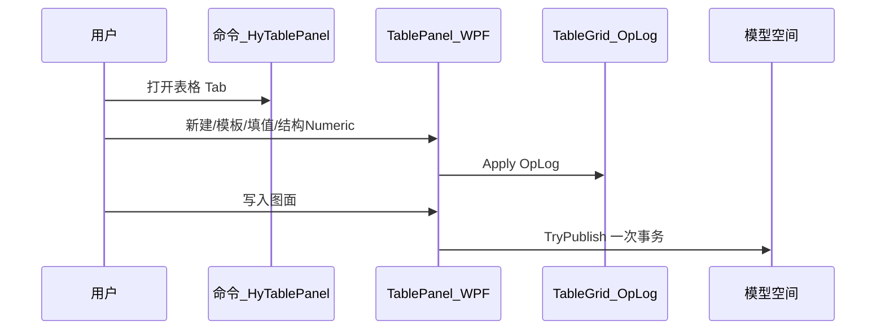
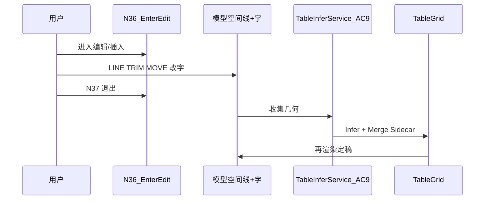

# 表格制作工作方式对比 — 面板式 vs 画布命令式（017）

> 文档编号：017  
> 调研日期：2026-06-25  
> 一句话目标：在 **「点命令 → Excel 式面板编辑 → 写图」** 与 **「点插入表格 → 画布命令系统像原生 TABLE 编辑」** 两种工作方式中，**选一个主范式**作为 HyCAD Tables 主力方向，另一范式降级/暂缓。  
> 上游：[001 表格工具调研](./001-AutoCAD表格工具-产品调研-2026-06-24-192049.md)、[002 双模式编辑](./002-统一表格Domain与双模式编辑-产品调研-2026-06-24-225625.md)、[008 AC 分阶段计划](./008-AutoCAD表格制作分阶段实施计划-2026-06-25-143000.md)、[014 面板壳](./014-表格与CAD工具面板设计-产品调研-2026-06-25-193648.md)、[016 操作面板](./016-表格操作面板-分步规划-2026-06-25-200620.md)、[018 独立表格窗口](./018-独立表格编辑器窗口-纸张尺寸优先-产品调研-2026-06-25-223217.md)（方式 A 的完整编辑器形态）、[019 功能区设计](./019-独立表格编辑器功能区设计-产品调研-2026-06-25-223957.md)（018 宽窗 Ribbon/Inspector IA）  
> 代码现状：[TablePanel](../../../src/HyCADTool/Features/Tables/Views/TablePanel.xaml)、[TablePanelOperationsBar](../../../src/HyCADTool/Features/Tables/Views/TablePanelOperationsBar.xaml)、[TablePanelService](../../../src/HyCADTool/Features/Tables/Application/TablePanelService.cs)、[HyCAD.Tables Domain](../../../src/HyCAD.Tables/)  
> 性质：**产品决策调研**——只描述对比、打分与路线；**不写实现代码**

---

## 0. 目标与边界

### 0.1 核心问题

用户提出两种表格制作工作方式，需判断 **哪种作为主力产品方向最有利**：

| 编号 | 用户描述 | 本文代号 |
|---|---|---|
| **方式 A** | 在 AutoCAD 中点击命令，出现 **和 Excel 类似的界面**，完成表格制作后插入 AutoCAD | **面板 Excel 式** |
| **方式 B** | 在命令面板点击插入表格，然后制作一套 **命令系统**，在 AutoCAD **绘图界面** 像 AutoCAD 表格一样完成制作编辑 | **画布命令式** |

**决策取向（用户确认）**：**选一个主范式**，另一个降级/暂缓；用 001 既有五维加权打分支撑结论。

### 0.2 五维权重（沿用 001）

| 维度 | 权重 | 对本决策的含义 |
|---|---|---|
| **易用** | 40% | 工程制图员日常建表/改表步骤与手感 |
| **功能** | 30% | 复杂版式（merge/竖排/斜线）、FieldKey、与业务联动 |
| **稳定** | 15% | 大表不卡、不崩、可热重载 |
| **可靠安全** | 8% | Undo、命令上下文、数据不丢 |
| **差异化** | 7% | 相对原生 TABLE / 商业插件的护城河 |

### 0.3 成功标准

1. 两范式有 **精确定义** + 操作时序 + 「建 10×6 表」步骤对比  
2. 与 **已落地 / 仅规划** 资产一一映射  
3. 五维逐项对比 + **加权总分** + **主范式推荐**  
4. 降级范式有 **明确场景边界** 与 **触发条件**（何时再投入）

### 0.4 不做

- 不重复 001 竞品联网清单（仅引用结论）  
- 不在本文选定 WPF DataGrid vs WebView2 等控件细节（见 014）  
- 不写 AC9/AC10 实现规格（见 [008j](./008j-AC10-编辑模式散开与退出识别详解-2026-06-25-180000.md)）

---

## 1. 两范式精确定义

### 1.1 方式 A · 面板 Excel 式

**定义**：用户在 **PaletteSet / HyBlender 侧栏** 打开类 Excel 工作台；结构操作与填值均在 **内存 Domain（`TableGrid` + `TableOpLog`）** 完成；确认后 **一次性** 经命令上下文写入模型空间（线 + 文字 + XData 载体）。



**典型路径（建 10×6 空表并写图）**：

| 步 | 动作 |
|---|---|
| 1 | HyB → 表格 Tab |
| 2 | 行=10、列=6 → **新建空表** |
| 3 | DataGrid Tab 填值（可选） |
| 4 | **写入图面** + 指定插入点 |

**计步**：约 **4 步**（含打开 Tab）。

**心智模型**：Excel / 001 MVP——**编辑在面板，CAD 只负责落图**。

---

### 1.2 方式 B · 画布命令式

**定义**：用户触发「插入表格」类命令后，在 **模型空间** 用 AutoCAD **原生命令**（画线、TRIM、MOVE、改文字等）编辑表格几何；退出编辑时 **线框识别（AC9）** 反推 `TableGrid`，合并 Sidecar 中的 FieldKey，再定稿渲染。



**典型路径（手画 10×6 框并填首行）**：

| 步 | 动作 |
|---|---|
| 1 | 插入表格 / N36 进入编辑 |
| 2 | 画外框 + 9 条竖线 + 5 条横线（或命令辅助） |
| 3 | 各格输入文字 |
| 4 | N37 退出 → 识别 → 定稿 |

**计步**：**≥10 步**（强依赖 CAD 操作熟练度）；无辅助命令时接近手工描表。

**心智模型**：原生 TABLE / AutoCAD 结构模式——**编辑在画布，系统负责识别回写**。

---

### 1.3 与 002 双模式的关系

| 002 模式 | 对应范式 | 说明 |
|---|---|---|
| **填值编辑模式** | **方式 A 为主** | WPF 网格改 Value/FieldKey |
| **结构编辑模式** | A 的 016 操作区 **或** B 的画布编辑 | 016：面板 Numeric/插删/merge；B：CAD 画线 + Infer |

017 **不否定** 002 双模式架构；只决定 **默认入口与资源投入优先级**。

---

## 2. 与现有资产映射

### 2.1 方式 A · 已落地（2026-06-25）

| 能力 | 状态 | 位置 |
|---|---|---|
| HyBlender「表格」Tab | ✅ | [`HyBlenderPanel.xaml`](../../../src/HyCADTool/Shell/BlenderPanel/HyBlenderPanel.xaml) |
| 填值 DataGrid + OpLog | ✅ AC11 M0 | [`TablePanelViewModel`](../../../src/HyCADTool/Features/Tables/ViewModels/TablePanelViewModel.cs) |
| Pick / Publish 原位替换 | ✅ | [`TablePanelService`](../../../src/HyCADTool/Features/Tables/Application/TablePanelService.cs) |
| 新建空表 + 模板 + O2 Numeric | ✅ 016 Step1 | [`TablePanelOperationsBar`](../../../src/HyCADTool/Features/Tables/Views/TablePanelOperationsBar.xaml) |
| 插删行列 / merge UI / 双模式 Toggle | ⏳ 016 Step2–3 | 规划已写，未编码 |
| 015 设置条 | ⏳ V1 | 015 规格 |

**动量优势**：Domain + 渲染 + XData + 面板 **已打通最小闭环**；继续投入边际成本低。

---

### 2.2 方式 B · 仅规划

| 能力 | 状态 | 位置 |
|---|---|---|
| 线框识别 V1 | ⏳ AC9 | [008 §AC9](./008-AutoCAD表格制作分阶段实施计划-2026-06-25-143000.md)、[008i](./008-AutoCAD表格制作分阶段实施计划-2026-06-25-143000.md) |
| 编辑模式 Enter/Exit | ⏳ AC10 | [008j](./008j-AC10-编辑模式散开与退出识别详解-2026-06-25-180000.md) |
| N36/N37 命令 | ⏳ | commands.json 占位 |
| Sidecar JSON 备份 | ⏳ | 008j §5（防 Explode 丢 XData） |
| WPF 面板 | ❌ 不替代 B | AC11 与 B **并行可选** |

**硬依赖**：AC10 **不得**在 AC9「3×3 + 人员表 Infer ≥95%」未达标前开编码（008j §2.3）。

---

### 2.3 共同底座

两范式共享 **`HyCAD.Tables`**（`TableGrid`、`GridEditor`、`TableOpLog`、`TableSamples`），Publish 均走 **线 + 文字定稿**（非原生 `AcDbTable` 编辑），从而 **共同避开** 001 所述原生 TABLE 性能/字体坑。

---

## 3. 五维逐项对比

### 3.1 易用（权重 40%）

| | 方式 A 面板式 | 方式 B 画布式 |
|---|---|---|
| **优点** | Tab 跳格、模板一键、窄面板内完成建表；步骤可 ≤4；不依赖 CAD 画线技能 | CAD 老手「看着图改」直观；与现有 TRIM/OFFSET 肌肉记忆一致 |
| **缺点** | 320px 窄宽；复杂 merge 需对话框非拖拽；视线在面板与图面间切换 | 10×6 手画线框步数多；Infer 失败需重画；merge/竖排识别易退化 |
| **001 对齐** | 001 结论：**「在 CAD 里原地顺手编辑」是主切入点**——A 用 **面板原地** 替代「在原生 Table 里编辑」 | B 是 **真·画布原地**，但复制了原生 TABLE **结构编辑** 的复杂度而非填值痛点 |

**维度小结**：A 显著优于 B。001 权重最高维是易用，且 A 已验证 M0 路径。

---

### 3.2 功能（权重 30%）

| | 方式 A | 方式 B |
|---|---|---|
| **优点** | Domain 全能力：FieldKey、merge、竖排、模板、OpLog；016/015 可扩展 | 可改任意线/字，理论上支持「非网格」微调；适合已有线框图 |
| **缺点** | 结构操作在窄面板，高级轨道/视口待 012 | AC9 V1 仅正交网格 + 矩形 merge；竖排/斜线/PhotoSlot 识别后置 |
| **复杂样表** | 人员表已通过 `TableSamples` + Publish 验收 | 人员表 Enter/Exit 竖排可能退化（008j V12） |

**维度小结**：A 略优或持平；B 在「非标准线框」场景有上限，但 V1 识别能力不足。

---

### 3.3 稳定（权重 15%）

| | 方式 A | 方式 B |
|---|---|---|
| **优点** | 内存编辑，无大表逐格刷 CAD；PaletteSet 主题坑已有 skill | 编辑期是分散线+字，无单块 Table 实体卡顿 |
| **缺点** | WPF 资源字典需遵守 B10/B11 | Infer 失败会话残留；擦除/收集边界误删；单会话约束 |
| **成熟度** | **已编译运行** | **零代码**（AC10） |

**维度小结**：A 明显优于 B。

---

### 3.4 可靠安全（权重 8%）

| | 方式 A | 方式 B |
|---|---|---|
| **优点** | OpLog 栈；Publish 单次 `_HyExec`；Sidecar 不需要 | Sidecar + MergePolicy 保留 FieldKey（008j §7.3） |
| **缺点** | 面板 modeless 须命令上下文写 CAD | Explode 丢 XData；Infer 误识别；编辑几何误擦 |

**维度小结**：A 优于 B；B 的 Sidecar 设计成熟但 **实现前均为风险项**。

---

### 3.5 差异化（权重 7%）

| | 方式 A | 方式 B |
|---|---|---|
| **优点** | HyCAD 一体化面板 + Domain + 业务 FieldKey；避开 Excel 导入器红海（001） | **真·CAD 内结构编辑**；竞品多把战场放 Excel（001 §2.3） |
| **缺点** | 与 AutoTable/TRTT 的「面板+Excel」部分重叠 | 与 modplus mpTableFromEntities 等线框转表同类；维护 Infer 成本高 |

**维度小结**：B 在「差异化」单项略胜，但 **权重仅 7%**，不足以逆转总分。

---

## 4. 加权打分汇总

> 评分 1–5（5=优）。加权 = Σ(维度分 × 001 权重)。

| 维度 | 权重 | 方式 A 面板式 | 方式 B 画布式 |
|---|---|---|---|
| 易用 | 0.40 | **4.0** | 2.5 |
| 功能 | 0.30 | **4.0** | 3.5 |
| 稳定 | 0.15 | **4.5** | 3.0 |
| 可靠安全 | 0.08 | **4.0** | 3.0 |
| 差异化 | 0.07 | 4.0 | **4.5** |
| **加权总分** | 1.00 | **4.08** | **3.06** |

**计分说明**：

- A：在 **易用 + 稳定** 上拿满权重红利；功能覆盖 Domain 已验证样表；差异化略低于 B 但仍 ≥4。  
- B：**仅差异化领先**；易用因步骤多、Infer 不确定性被大幅拉低；稳定/可靠因未落地按保守分。

**结论（量化）**：方式 A **领先约 1.0 分（加权）**，在 001 易用优先权重下 **应为主范式**。

---

## 5. 推荐：主范式 = 方式 A（面板 Excel 式）

### 5.1 推荐理由

1. **与 001 战略一致**：001 结论为「CAD 内嵌类 Excel 面板」，非「再造画布命令系统」。  
2. **与已投入一致**：AC11 M0 + 016 Step1 已落地，继续 016 Step2–5 边际收益最高。  
3. **避开双份坑**：不在原生 `AcDbTable` 里编辑；也不把 **填值** 主战场放到画布（001：竞品靠 Excel 回避的正是原生编辑体验）。  
4. **风险可控**：无 AC9 识别质量门禁；PaletteSet / 命令上下文坑已有项目 skill。  
5. **五维总分显著领先**，且领先维度 **易用（40%）+ 稳定（15%）** 与日常高频使用最相关。

### 5.2 方式 B 降级定位 · V2 结构模式补充

**不删除**，降为 **可选 / 后置**：

| 场景 | 是否启用 B |
|---|---|
| 新建表、填值、模板、Publish | **否** — 走 A |
| 已有 DWG **线框+文字** 假表需转 HyTable | **是** — AC9 Infer |
| CAD 老手微调列宽线（定稿后） | **是** — AC10 Enter/Exit |
| 016 面板 merge/插删行列 | **优先 A** — 除非用户显式「进入 CAD 编辑」 |

对应 002：**默认填值模式 + 面板结构操作**；**结构模式 ON + CAD 画线** 为高级入口（016 Step6 / AC10 衔接）。

### 5.3 对两种用户描述的映射

| 用户原话 | 017 决策 |
|---|---|
| 「点击命令 → Excel 类似界面 → 插入 CAD」 | **主路径（A）** — 已实现 TablePanel |
| 「命令面板插入 → 命令系统 → 画布像 TABLE 编辑」 | **补充路径（B）** — AC10，AC9 达标后再做 |

---

## 6. 路线建议

### 6.1 方式 A · 继续投入（P0–P1）

| 阶段 | 内容 | 文档 |
|---|---|---|
| 已完成 | AC11 M0 填值 + 016 Step1 新建/模板 | 016 §4 Step1 |
| 下一步 | 016 Step2–3：插删行列、双模式 Toggle、merge | 016 §4 |
| 并行 | 015 V1 设置条；012 视口 | 015 / 012 |
| 验收 | 5×4 新建 → 填值 → Publish ≤6 步 | 016 §0.3 |

### 6.2 方式 B · 暂缓（P2+）

| 门禁 | 动作 |
|---|---|
| AC9 Infer 3×3 + 人员表 **≥95%** 一致 | 开 AC10 编码（008j §13） |
| AC10 V1 绿灯 | HyBlender 表格 Tab 增加「进入 CAD 编辑」（016 Step6） |
| 在此之前 | **不** 为主路径设计「插入表格命令系统」；不分散 016 资源 |

### 6.3 双模式产品形态（定稿）

```text
默认：HyB → 表格 Tab → 面板 A（填值 + 016 结构操作）→ Publish
完整编辑：HyBlender 命令区 → N37/HYTB → [018 独立窗口](./018-独立表格编辑器窗口-纸张尺寸优先-产品调研-2026-06-25-223217.md)（纸张优先 + 宽网格）
高级：拾取表 → [进入 CAD 编辑] → B（N36/N37 AC10）→ 回写同一 Domain
```

---

## 7. 风险与对策

| 风险 | 范式 | 对策 |
|---|---|---|
| 窄面板 320px 操作拥挤 | A | 操作条 + Expander（014/016）；merge 用 Anchor+span 对话框 |
| 复杂版式面板表达力不足 | A | Domain 承载；Publish 渲染竖排/斜线（AC5/AC6 已有） |
| 用户习惯画布改线 | A | V2 提供 AC10 出口，非默认 |
| AC9 误识别 | B | Exit 失败保留会话；008i diff 可视化 |
| Explode 丢 XData | B | 008j Sidecar **先**写 NOD |
| 两范式 FieldKey 不一致 | A+B | 共用 `TableGrid` + MergePolicy；Pick 统一入口 |

---

## 8. 交叉引用索引

| 文档 | 017 相关 |
|---|---|
| [001 §5](./001-AutoCAD表格工具-产品调研-2026-06-24-192049.md) | 001 战略 ↔ 017 主范式 A |
| [002 §3](./002-统一表格Domain与双模式编辑-产品调研-2026-06-24-225625.md) | 双模式 ↔ A 默认 / B 可选 |
| [008 AC10/AC11](./008-AutoCAD表格制作分阶段实施计划-2026-06-25-143000.md) | 优先级：AC11/016 先于 AC10 |
| [014](./014-表格与CAD工具面板设计-产品调研-2026-06-25-193648.md) | 方式 A 面板壳 |
| [016](./016-表格操作面板-分步规划-2026-06-25-200620.md) | 方式 A 结构操作分步 |
| [008j](./008j-AC10-编辑模式散开与退出识别详解-2026-06-25-180000.md) | 方式 B 执行规格 |

---

## 附录 A · 017 自检清单

```
- [x] 两范式精确定义 + 10×6 步骤对比
- [x] 与 AC11/016/AC9/AC10 资产映射
- [x] 五维逐项对比（沿用 001 权重）
- [x] 加权打分表 + 总分
- [x] 主范式推荐 A + B 降级场景
- [x] 路线与 AC9 门禁
- [x] 风险与对策
- [x] 交叉引用 001/002/008/014/016
- [x] 不写实现代码
```

---

**版本**：1.0 | **落盘**：2026-06-25-220420
