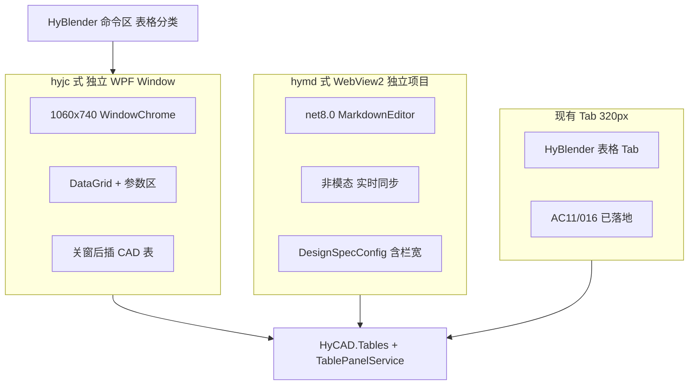
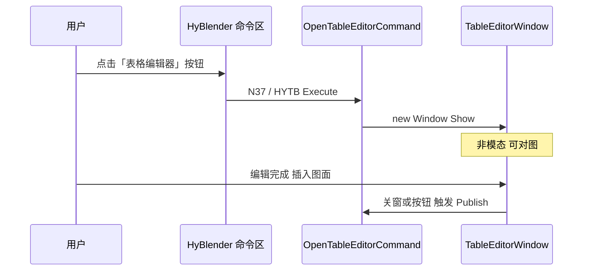

# 独立表格编辑器窗口 — 纸张尺寸优先（018）

> 文档编号：018  
> 调研日期：2026-06-25  
> 一句话目标：为 [017 方式 A（面板 Excel 式）](./017-表格制作工作方式对比-产品调研-2026-06-25-220420.md) 增加 **宽敞独立窗口** 形态——由 HyBlender **命令区按钮** 启动（对标 hyjc / hymd），**开局定纸张尺寸**（A4/A3/B4/自定义），Excel 式编辑后插入 AutoCAD。  
> 上游：[001 表格工具调研](./001-AutoCAD表格工具-产品调研-2026-06-24-192049.md)、[012 排版策略](./012-表级结构优先与内容驱动排版-2026-06-25-185703.md)、[014 面板壳](./014-表格与CAD工具面板设计-产品调研-2026-06-25-193648.md)、[016 操作面板](./016-表格操作面板-分步规划-2026-06-25-200620.md)、[017 工作方式对比](./017-表格制作工作方式对比-产品调研-2026-06-25-220420.md)  
> 下游：[019 功能区设计](./019-独立表格编辑器功能区设计-产品调研-2026-06-25-223957.md)（§4 线框的功能区分组细化）  
> 形态参照：[HYJC 基础沉降窗口](../../../docs/hycad-internals/HYJC-README.md)、[hymd 设计说明](../../../src/HyCADTool/Features/Export/DesignSpecCommand.cs)、[SettlementWindow.xaml](../../../src/HyCADTool/Features/Settlement/Views/SettlementWindow.xaml)  
> 代码复用：[TablePanelService](../../../src/HyCADTool/Features/Tables/Application/TablePanelService.cs)、[HyCAD.Tables Domain](../../../src/HyCAD.Tables/)  
> 性质：**产品调研 + UX/架构规格**；**不写实现代码**

---

## 0. 目标与边界

### 0.1 核心问题

017 选定 **方式 A（面板 Excel 式）** 为主范式，但现有落地形态是 HyBlender 内 **320px 窄 Tab**（AC11/016），存在：

- 操作区 / 填值网格 / 未来设置条 **三区拥挤**（017 §7）  
- **无纸张尺寸** 入口——用户建表前无法像 hymd 一样先定「版面」  
- Excel 式编辑需要 **更宽视口**（行列号、属性侧栏、merge 可视化）

用户提出：**新建一个独立窗口**，类似 hyjc / hymd，**参考 hymd 开局设置尺寸**，可快速选 A4/A3/B4 等标准纸型或自定义，再完成表格制作并插入 CAD。

### 0.2 一句话定位

> HyBlender **命令区「表格」分类按钮** → 打开 **独立 WPF 窗口**（~1060×740，对标 hyjc）→ 顶部 **纸张区** 定 `TableViewport` → 中部 **Excel 式宽网格** → 底栏 **插入图面**。

**与现有 Tab 关系**：**不替代**；Tab = 快捷拾取/轻量填值；**Window = 完整编辑器**（017 方式 A 的「宽屏形态」）。

### 0.3 五维权重（沿用 001）

| 维度 | 权重 |
|---|---|
| 易用 | 40% |
| 功能 | 30% |
| 稳定 | 15% |
| 可靠安全 | 8% |
| 差异化 | 7% |

### 0.4 成功标准

1. 形态对标 hyjc / hymd / Tab 三方，给出 **选型结论**  
2. 纸张预设表（含 **B4/B5**）+ 映射 012 `TableViewport`  
3. 窗口线框 + 命令入口（N37 或 HYTB）  
4. 与 AC11/016/017/012 关系清晰 + 分步实施路线

### 0.5 不做

- 不替代 017 方式 B（画布 AC10）  
- 不在本文实现 WebView2 SpreadJS 完整方案（仅备选对比）  
- 不写 `.cs` / `.xaml`

---

## 1. 形态对标与选型

### 1.1 三种 UI 形态



| 形态 | 代表 | 窗口 | 编辑区 | 落图时机 | 纸张/尺寸 |
|---|---|---|---|---|---|
| **hyjc 式** | HYJC 沉降 | 独立 WPF `Window` | WPF DataGrid | 关窗后选点插表 | 无（结果表尺寸由算法定） |
| **hymd 式** | hymd 设计说明 | WebView2 独立程序集 | 浏览器 Markdown/表格 | 实时或手动同步 | `DesignSpecConfig` 栏宽/分栏 |
| **Tab 式** | AC11/016 | PaletteSet ~320px | WPF DataGrid | 按钮 Publish | 无（待 015/012） |
| **018 目标** | 新独立窗口 | **hyjc 式 Window** | **宽 DataGrid** | hyjc 式关窗/按钮插表 | **012 TableViewport 纸张区** |

### 1.2 五维对比（1–5 分）

| 维度 | hyjc 式 WPF Window | hymd 式 WebView2 | 现有 Tab |
|---|---|---|---|
| **易用** | 5 — 大窗、熟悉 WPF 控件 | 4 — 编辑体验好但双进程/焦点 | 3 — 窄、拥挤 |
| **功能** | 4 — DataGrid 够用；merge 需自研 | 5 — 富文本/表格库成熟 | 3 — 空间限制功能 |
| **稳定** | 4 — 主进程内；主题已验证（hyjc） | 3 — net8 外挂、WebView2 Runtime | 4 — PaletteSet 已跑通 |
| **可靠安全** | 4 — 关窗后单次写 CAD | 4 — 实时同步复杂 | 4 — `_HyExec` 已验证 |
| **差异化** | 4 — HyCAD 一体化 + 纸张优先 | 3 — 偏文档排版 | 3 — 与竞品面板类似 |

**加权（001 权重）**：

| 形态 | 易用 | 功能 | 稳定 | 可靠 | 差异 | **加权** |
|---|---|---|---|---|---|---|
| **WPF 独立 Window（推荐）** | 5 | 4 | 4 | 4 | 4 | **4.36** |
| WebView2 独立项目 | 4 | 5 | 3 | 4 | 3 | **3.99** |
| 仅 Tab | 3 | 3 | 4 | 4 | 3 | **3.29** |

### 1.3 选型结论

**推荐：纯 WPF 独立 `Window`（hyjc 范式）**

| 理由 | 说明 |
|---|---|
| 与 hyjc 一致 | [`SettlementWindow`](../../../src/HyCADTool/Features/Settlement/Views/SettlementWindow.xaml) 已验证 WindowChrome + BlenderTheme + DataGrid |
| 复用 AC11 | `TableFillGridAdapter`、`TablePanelViewModel` 逻辑可抽共享 |
| 避开 hymd 坑 | net8.0 进程外、WebView2 Runtime、焦点与 CAD 切换（见 wpf-webview2 skill） |
| 纸张优先 | hymd 的「栏宽/分栏」语义由 012 `TableViewport` 在 WPF 顶栏实现，无需 WebView |

**WebView2 备选**：若后续需 SpreadJS 级公式/条件格式，可开 **018b** 评估；M0–M2 不采用。

---

## 2. 纸张尺寸优先流程

### 2.1 设计原则

- **非常驻向导**：纸张区在窗口 **顶栏常驻**（类似 hymd 编辑器顶栏参数），随时可改预设；改纸型 → 联动 `TargetWidthMm` → 可选提示「是否按新宽归一化列宽」。  
- **结构优先（012 L0）**：纸张宽 **先于** 填值内容决定列宽总和；不允许内容反推表宽。  
- **实际 mm（1:1）**：所有尺寸字段为模型空间 mm，**不乘 Scale**（项目规则）。

### 2.2 纸张预设表（018 扩展 012）

012 现有：`A2 | A3 | A4 | Custom | Screen`。018 建议扩展 **B 系列** 与 **A0/A1**：

| Preset | 标准 | 物理尺寸 (mm) | 默认可用宽¹ | 典型场景 |
|---|---|---|---|---|
| **A4** | ISO 216 | 297 × 210 | 277 | 竖向报表、说明附表 |
| **A3** | ISO 216 | 420 × 297 | 400 | 工程图附表（012 默认示例） |
| **A2** | ISO 216 | 594 × 420 | 574 | 大表 |
| **A1** | ISO 216 | 841 × 594 | 821 | 少见全页表 |
| **A0** | ISO 216 | 1189 × 841 | 1169 | 海报级 |
| **B4** | ISO 216 | **250 × 353** | 230 | 欧标 B 系列 |
| **B4JIS** | JIS B 系列 | **257 × 364** | 237 | 日标 / 国内 B4 常用 |
| **B5** | ISO 216 | 176 × 250 | 156 | 小册子附表 |
| **Custom** | — | 用户输入宽×高 | 用户输入宽 | 非标准图框 |
| **Screen** | — | — | 面板视口或 800 | 屏幕预览 |

¹ 默认可用宽 = **横向**、边距 Left+Right 各 10mm、`ContentWidthMode = ExcludingMargins` 下的 `TargetWidthMm` 示例值；用户可覆盖。

### 2.3 顶栏纸张区控件

```text
┌──────────────────────────────────────────────────────────────────┐
│ [纸型 ▼ A3]  [方向 ○横 ●竖]  宽 [400] mm  高 [—] mm  边距 [10] │
│ [应用到列宽]  [新建空表 10×6]                                     │
└──────────────────────────────────────────────────────────────────┘
```

| 控件 | 绑定 Domain | 行为 |
|---|---|---|
| 纸型 Combo | `TableViewport.PaperPreset` | 改选 → 推导宽/高默认值 |
| 方向 Toggle | 推导逻辑输入 | 横/竖互换可用宽所依据的边 |
| 宽 (mm) | `TargetWidthMm` | 红色=实际 mm；可手动覆盖 |
| 高 (mm) | `MaxPageHeightMm` | 可空=单页不限高；有值→启用分页（012 §1.3） |
| 边距 | `MarginMm` | Top/Bottom/Left/Right 或统一值 |
| 应用到列宽 | UI 动作 | 触发 012 列宽归一化 Pass |

### 2.4 与 hymd 的差异

| hymd | 018 表格窗口 |
|---|---|
| Markdown 分栏 / 栏宽 | **表格总宽** `TargetWidthMm` + 列轨道 Weight |
| WebView 实时同步 | M0 **手动**「插入图面」；M2+ 可选实时预览（不做 hymd 级 live sync） |
| `DesignSpecConfig` | **`TableViewport` + `GridTopology`** |

---

## 3. Excel 式编辑技术选型

### 3.1 候选方案

| 方案 | 说明 | License |
|---|---|---|
| **A WPF DataGrid** | AC11/hyjc 已用；虚拟化、Tab 跳格可扩展 | 内置 |
| B WebView2 + 表格 JS 库 | SpreadJS / Handsontable 等 | 商业/需核对 |
| C 三方 WPF 网格 | ReoGrid 等 | 需核对 + PaletteSet/Window 兼容 |

### 3.2 五维对比

| 维度 | A DataGrid | B WebView2 | C 三方网格 |
|---|---|---|---|
| 易用 | 4 | 5 | 4 |
| 功能 | 3（merge/公式弱） | 5 | 4 |
| 稳定 | 5 | 3 | 3 |
| 可靠安全 | 5 | 3 | 4 |
| 差异化 | 4 | 3 | 3 |
| **加权** | **4.08** | 3.99 | 3.62 |

### 3.3 结论

**M0–M2 采用 WPF `DataGrid`**（与 AC11、hyjc 一致）：

- merge：016 Step3 对话框；宽窗可升级为 **可视化选区**（018 M2+）  
- 公式：Won't（002 Won't now）  
- 若团队试用后 DataGrid 手感不足，再开 **018b WebView2 PoC**

---

## 4. 窗口信息架构线框

> **功能区细化**见 [019 §4.2–§4.5](./019-独立表格编辑器功能区设计-产品调研-2026-06-25-223957.md)（Z0–Z8、三 Tab Ribbon、Excel Home 映射）。

**参考尺寸**：`Width=1060` `Height=740` `MinWidth=860`（对齐 hyjc）；`WindowStyle=None` + `WindowChrome`（对齐 hyjc）。

```text
┌─ 标题栏 HyTable 表格编辑器 ──────────────────────── □ × ─┐
├─ §2.3 纸张区（PaperPreset / 宽 / 边距 / 新建）──────────┤
├─ 工具条：[结构|填值] [+行][-行][+列][-列] [合并][拆分] [模板▼] ─┤  ← 016 操作复用
├──────────────────────────────┬──────────────────────────┤
│                              │ 单元格属性（013/015 子集） │
│   Excel 式 DataGrid           │ 地址 (r,c)               │
│   行号 列号  可见 Anchor 格    │ 对齐 / 竖排 / 角色       │
│   Tab / Shift+Tab             │ FieldKey                 │
│                              │                          │
├──────────────────────────────┴──────────────────────────┤
│ 摘要：人员基本情况 · 7×7 · A3 宽 400mm                    │
├─────────────────────────────────────────────────────────┤
│ [拾取图面表]  [插入图面]  [取消]              状态：就绪   │
└─────────────────────────────────────────────────────────┘
```

**相对 014 §4.2 Tab 线框的变化**：

| 014 Tab（320px） | 018 Window |
|---|---|
| 底栏单元格属性 | **右侧 200px 属性列**（宽窗放得下） |
| 折叠 Expander 视口 | **顶栏纸张区常驻** |
| 操作条堆叠 | 工具条单行 + 网格区最大化 |

---

## 5. 入口与命令

### 5.1 启动路径



### 5.2 命令注册建议

| 项 | 建议 |
|---|---|
| **命令码** | **N37**（`commands.json` 当前 N33–N36 已占用表格类；N37 空闲） |
| **显示名** | `表格编辑器(N37)` 或别名 **`HYTB`** |
| **分类** | `category: "表格"`（与 N33–N36 同区） |
| **HyBlender** | 命令列表「表格」分类增加按钮 → 与 HYJC 同级体验 |
| **热重载** | 对标 hyjc：开发期可走 `RouteThroughC1` 或 TestCommand 一行 |

### 5.3 与 HYJC / hymd 入口对比

| 命令 | 入口 | 窗口 | 落图 |
|---|---|---|---|
| HYJC / hySC | 命令行直输 | SettlementWindow | 关窗后选点 |
| hymd / hymdE | 命令行 + 命令区 | WebView2 EditorLoader | 实时/选手动同步 |
| **N37 / HYTB（018）** | **命令区 + 命令行** | **TableEditorWindow** | **按钮/关窗后 Publish** |

---

## 6. 与既有资产关系

### 6.1 分层复用

| 层 | 复用 | 018 新增 |
|---|---|---|
| **Domain** | `TableGrid`、`GridEditor`、`TableOpLog` | `TableViewport`（012 P1） |
| **Application** | [`TablePanelService`](../../../src/HyCADTool/Features/Tables/Application/TablePanelService.cs) Pick/Publish | `TableEditorSession`（可选，窗口生命周期） |
| **Presentation Tab** | [`TablePanelViewModel`](../../../src/HyCADTool/Features/Tables/ViewModels/TablePanelViewModel.cs)、[`TableFillGridAdapter`](../../../src/HyCADTool/Features/Tables/Presentation/TableFillGridAdapter.cs) | 抽 **共享 VM 基类** 或组合 |
| **Presentation Window** | hyjc Window 壳 | `TableEditorWindow.xaml` |
| **016 操作** | O1–O6 taxonomy | 宽窗工具条布局 |

### 6.2 Tab vs Window 分工

| 场景 | 推荐入口 |
|---|---|
| 快速拾取、改一两格、Publish | **Tab**（已开 HyB 时） |
| 新建大表、设纸型、长时间编辑 | **Window（018）** |
| 命令行老手 | **N37 / HYTB** |

### 6.3 与 017 / 016 对齐

- **017**：018 是方式 A 的 **完整编辑器**，不引入方式 B  
- **016**：O2 纸张 Numeric 在 Window **升级为完整 TableViewport**；O3/O4 工具条迁入宽窗工具条

---

## 7. 分步实施路线（供后续 Plan）

### M0 · 窗口骨架 + 纸张区 + 新建空表（P0）

**交付**：

- `Features/Tables/Views/TableEditorWindow.xaml`（hyjc 式 WindowChrome）
- 顶栏纸型 Combo + 宽/边距 + `PaperPresetResolver`（纯函数，可放 `HyCAD.Tables.Layout`）
- `OpenTableEditorCommand` + `commands.json` N37
- 新建空表 → `TableGrid.CreateEmpty` + 默认 `TableViewport`

**验收**：选 A3 → 宽=400 → 新建 10×6 → 网格显示 60 格。

---

### M1 · Excel 宽网格 + 016 操作（P0）

**交付**：

- 复用/抽取 `TablePanelViewModel` 填值与 016 操作命令
- 宽 DataGrid + 右侧属性列（015/013 最小子集：对齐、Role）
- Tab / Shift+Tab 跳格

**验收**：人员模板加载 → 改 name → 属性列显示 FieldKey。

---

### M2 · 插入 CAD + 拾取（P1）

**交付**：

- 底栏「插入图面」→ `TablePanelService.TryPublish`（hyjc 关窗后选点范式可选）
- 「拾取图面表」→ TryPick 回填窗口
- HyBlender 命令区按钮可见

**验收**：A3 10×6 空表 → 插入 → 图面目视宽度合理。

---

### M3 · 012 视口联动 + 列宽归一化（P2）

**交付**：

- Domain `TableViewport` 类型入代码（012 P1）
- 改纸型 → `LayoutEngine` 列宽归一化 Pass
- 可选：纸型变更确认对话框

**验收**：A3→A4 改宽 → Weight 列按比例缩放；Fixed 列报错提示。

---

## 8. 风险与对策

| 风险 | 对策 |
|---|---|
| WPF 主题 / Window 资源 | 对齐 hyjc：`LibraryResources.xaml` + `BlenderTheme.xaml` 局部 merge；**不**挂 `Application.Current.Resources`（B10/B11） |
| Modeless 窗口写 CAD | Publish 走 `_HyExec` / `SettingsPanelViewModel.PendingCommand`（014 §4.5） |
| Window 与 Tab 双份 VM 逻辑分裂 | M1 抽 `TableEditorCore` 或共享 VM；Domain/Service 单点 |
| B4 ISO vs JIS 混淆 | UI 显式 **B4 (ISO)** / **B4 (JIS)** 两项 |
| 012 未实现阻塞 M3 | M0–M2 **不依赖** LayoutEngine；纸张区可先 UI-only 存 VM |
| N37 与 AC10 命名冲突 | 008j 规划 N37=退出编辑；**018 改用 N38 或 HYTB** 若 AC10 先占 N37——实现 Plan 时以 `commands.json` 空闲槽为准 |

---

## 9. 交叉引用索引

| 文档 | 018 相关 |
|---|---|
| [012 §1.1](./012-表级结构优先与内容驱动排版-2026-06-25-185703.md) | `TableViewport` / PaperPreset 扩展 B 系列 |
| [014 §4.4](./014-表格与CAD工具面板设计-产品调研-2026-06-25-193648.md) | 方案 B 独立窗口 → 018 具体化 |
| [016](./016-表格操作面板-分步规划-2026-06-25-200620.md) | 操作 taxonomy 迁入宽窗 |
| [017 §5](./017-表格制作工作方式对比-产品调研-2026-06-25-220420.md) | 方式 A 完整编辑器形态 |
| [019](./019-独立表格编辑器功能区设计-产品调研-2026-06-25-223957.md) | §4 线框 → Z0–Z8 功能区 + Ribbon 三 Tab |

---

## 附录 A · 018 自检清单

```
- [x] 形态对标 hyjc / hymd / Tab + 五维选型
- [x] 纸张优先流程 + 预设表（含 B4/B5）
- [x] Excel 编辑技术选型（DataGrid 默认）
- [x] 窗口线框（宽窗 + 右侧属性）
- [x] 命令入口 N37/HYTB + HyBlender 按钮
- [x] 与 Tab/Service/VM/016/017/012 关系
- [x] M0–M3 分步路线
- [x] 风险与对策
- [x] 不写实现代码
```

---

**版本**：1.0 | **落盘**：2026-06-25-223217
