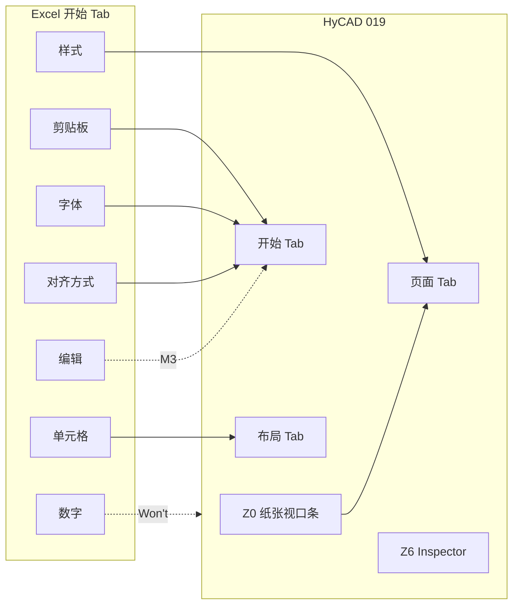

# 独立表格编辑器功能区设计 — 产品调研与最优方案（019）

> 文档编号：019  
> 调研日期：2026-06-25  
> 一句话目标：为 [018 独立表格编辑器窗口](./018-独立表格编辑器窗口-纸张尺寸优先-产品调研-2026-06-25-223217.md) 定义 **WPF 窗口内应有哪些功能区域、各放什么控件**，对标 Excel / Word / AutoCAD / Google Sheets 等，给出 **HyCAD 最优功能区 IA（信息架构）** 与 MoSCoW。  
> 上游：[015 面板设置项](./015-表格面板设置-产品调研-2026-06-25-194246.md)、[016 操作面板](./016-表格操作面板-分步规划-2026-06-25-200620.md)、[018 窗口壳](./018-独立表格编辑器窗口-纸张尺寸优先-产品调研-2026-06-25-223217.md)  
> 用户输入：Excel「开始」Ribbon 分组（剪贴板 / 字体 / 对齐 / 数字 / 样式 / 单元格 / 编辑）作为对标基准  
> 性质：**产品调研 + UX 规格**；**不写实现代码**

---

## 0. 目标与约束

### 0.1 核心问题

018 已确定 **独立 Window + 纸张区 + 宽 DataGrid + 右侧属性**，但未回答：

> **窗口里要分几块功能区？每块对标竞品哪一组？M0 先上哪些、哪些进 V2？**

本调研专门回答 **功能区（Functional Zones）** 划分，015 已覆盖 **设置项清单与 Domain 映射**，016 已覆盖 **结构操作按钮**；019 负责 **在宽窗里怎么摆**。

### 0.2 目标用户

- 工程制图员：建材料表/人员表，熟悉 Excel 开始选项卡  
- 模板维护者：设 Label/Value、外框、A3 纸宽

### 0.3 平台与约束

| 约束 | 对功能区的影响 |
|---|---|
| 独立 Window ~1060×740（hyjc） | **可** 做 Excel 式多组 Ribbon，不必像 320px Tab 那样全折叠 |
| CAD 1:1 mm | 尺寸类控件标 **实际 mm**（红） |
| 002 双模式 | 结构/填值 Toggle 决定 **单元格组 / 合并组** 可用性 |
| 012 结构优先 | **纸张/视口区** 必须独立于「字体/对齐」 |
| Won't | 公式、条件格式、数据透视、CAD 内实时同步（hymd 级） |

### 0.4 成功标准

1. 竞品 ≥8 个，覆盖 **Ribbon / 工具栏 / 上下文 Tab / 侧栏** 四种组织方式  
2. 产出 **HyCAD 最优功能区线框** + 与 015 设置项的 **落点映射表**  
3. 高频工程表操作（A3 宽、外框加粗、竖排、merge）**≤2 次点击** 到达控件  
4. MoSCoW 分 M0–M3 与 018 里程碑对齐

### 0.5 五维权重（功能区专项）

| 维度 | 权重 | 说明 |
|---|---|---|
| 易用（发现性、步骤） | **40%** | 像 Excel 一样「开始就能找到」 |
| 功能（覆盖工程表所需） | 30% | 015 矩阵 Must 项可达 |
| 稳定 | 10% | 区域少切换、少弹窗 |
| 可靠安全 | 10% | 写 CAD 边界清晰 |
| 差异化（012/013/CAD） | 10% | 纸张区、Role、FieldKey |

---

## 1. 竞品清单（功能区组织向）

| 名称 | 形态 | 功能区组织 | 链接 | 一句话 |
|---|---|---|---|---|
| **Microsoft Excel** | 桌面 | **固定 Ribbon Tab**（Home/Insert/Page Layout…）+ **上下文 Tab**（Table Design）+ QAT + 公式栏 | [Excellopedia Ribbon](https://excellopedia.com/excel-ribbon)、[GoSkills](https://www.goskills.com/excel/resources/excel-ribbon) | 分组 Ribbon 是表格编辑事实标准 |
| **Google Sheets** | Web | **菜单栏** + **单行工具栏**（无 Ribbon Tab）+ 公式栏 | [OpenStax Sheets](https://workforce.libretexts.org/Bookshelves/Information_Technology/Computer_Applications/Workplace_Software_and_Skills_(OpenStax)/09%3A_Working_with_Spreadsheets/9.05%3A_Google_Sheets_Basics) | 扁平工具栏，密度低于 Excel |
| **LibreOffice Calc** | 桌面开源 | **Standard Bar** + **Formatting Bar** + **Formula Bar** 多工具栏叠放 | [LibreOffice Formatting Bar](https://help.libreoffice.org/latest/en-US/text/scalc/main0202.html) | 与 Excel 同族但分散在多条 Bar |
| **Microsoft Word 表格** | 桌面 | **双上下文 Tab**：Table Design（外观）+ Layout（结构） | [MS Support Table Layout](https://support.microsoft.com/en-us/office/add-a-cell-row-or-column-to-a-table-in-word-b030ef77-f219-4998-868b-ba85534867f1) | **结构/外观二分** 最清晰 |
| **AutoCAD Table Cell** | CAD 插件 | **上下文 Ribbon**：Rows / Columns / Merge / Cell Styles / Borders | [Autodesk Table Cell Tab](https://help.autodesk.com/cloudhelp/2027/ENU/AutoCAD-Core/files/GUID-918CE7B7-9D4E-4F22-9A2B-CD89D49B4BAE.htm) | CAD 内表格 = 上下文条 + Properties |
| **SpreadJS Designer** | Web 控件 | Ribbon Home（Font/Alignment/Number/Styles/Cells）+ **右侧 Report Panel** | [SpreadJS Home Tab](https://developer.mescius.com/spreadjs/docs/spreadjs-designer-component/designerinterface/spdesigntab/spdesignhometab) | 宽应用 = Ribbon + 右栏属性 |
| **TextGrid** | CAD+Excel | 外挂 Excel 窗口，功能区 = Excel 全集 | 邻域（001） | 证明用户要 Excel 全集，但非 CAD 一体化 |
| **HyCAD hyjc** | 独立 Window | 左参数 + 中 DataGrid + 底按钮（**无 Ribbon**） | [HYJC-README](../../../docs/hycad-internals/HYJC-README.md) | 计算型表格，非通用编辑器 |
| **HyCAD hymd** | WebView2 | 顶栏排版参数 + 编辑器（**无 Excel 分组**） | DesignSpecCommand | 纸张/栏宽优先，非单元格格式 |

**归类**：直接参照 Excel / Word / AutoCAD / Sheets / Calc / SpreadJS；邻域 hyjc、hymd、TextGrid。

---

## 2. 竞品功能区 taxonomy 对照

### 2.1 Excel「开始」选项卡 → 通用分组（用户截图基准）

| Excel 组 | 典型命令 | 工程表需要度 | HyCAD 映射区 |
|---|---|---|---|
| **剪贴板** | 粘贴/复制/格式刷 | 中 | **Z1 编辑**（M1） |
| **字体** | 字体/字号/粗体/颜色 | 高 | **Z4 格式**（M1） |
| **对齐方式** | 九格对齐/换行/合并居中/方向 | **极高** | **Z4 格式** + **Z3 结构**（merge） |
| **数字** | 货币/百分比/小数位 | 低（非财务表） | Won't MVP |
| **样式** | 条件格式/表样式/单元格样式 | 中 | **Z5 表样式**（M2） |
| **单元格** | 插入/删除/格式 | 高 | **Z3 结构**（016 O3） |
| **编辑** | 求和/填充/排序/查找 | 低 | Won't MVP |

另：**Page Layout Tab** = 页边距/纸张/打印区 → 映射 **Z0 纸张视口**（018 已有，019 升格为独立 Ribbon Tab 级区域）。

### 2.2 Word 双 Tab（结构 vs 外观）

| Word Tab | 内容 | HyCAD 映射 |
|---|---|---|
| **Table Design** | 表样式、底纹、边框、Header Row | **Z5 表样式** + **Z4 边框** |
| **Table Layout** | 插删行列、单元格大小、合并、文字方向 | **Z3 结构** + **Z4 对齐/竖排** |

**借鉴**：宽窗可用 **「开始 | 布局 | 页面」三 Tab**，等价 Word Design/Layout + Excel Page Layout。

### 2.3 AutoCAD Table Cell Ribbon

| Panel | 内容 | HyCAD 映射 |
|---|---|---|
| Rows / Columns | 上/下/左/右插入、删除 | **Z3 结构**（= 016 O3） |
| Merge | Merge All / By Row / By Column / Unmerge | **Z3 结构**（= 016 O4） |
| Cell Styles | 对齐、边框对话框、Match Cell | **Z4 格式** + **Z6 属性侧栏** |
| — | Insert Table 对话框先行行列 | **Z0** 新建 + **Z3** 后续微调 |

### 2.4 Google Sheets vs LibreOffice

| 组织 | Sheets | Calc | 结论 |
|---|---|---|---|
| 结构 | 菜单 Insert/Format | Standard Bar | 插删在菜单深处 |
| 格式 | **单行工具栏** 全暴露 | **Formatting Bar** 第二行 | 扁平但 **缺 Page Layout** |
| 对话框 | Format 菜单 | Ctrl+1 六 Tab | 与 Excel 同族 |

**结论**：Sheets 证明「一条工具栏」可行，但 **工程 CAD 表** 仍需独立 **纸张区**（012 无 Office 等价）。

---

## 3. 五维对比（功能区组织方案）

对 **四种 IA 候选** 打分（1–5）：

| 方案 | 描述 | 易用 | 功能 | 稳定 | 可靠 | 差异 | **加权** |
|---|---|---|---|---|---|---|---|
| **A Excel 式 Ribbon 多 Tab** | 开始/布局/页面 + 上下文 | 5 | 5 | 4 | 4 | 4 | **4.60** |
| B 单条工具栏（Sheets 式） | 一行图标，无 Tab | 4 | 3 | 5 | 4 | 3 | **3.75** |
| C 仅右侧属性栏（Revit 式） | 无顶栏，全在 Inspector | 3 | 4 | 4 | 4 | 4 | **3.65** |
| D hyjc 式无 Ribbon | 左表单 + Grid | 3 | 2 | 5 | 4 | 3 | **3.20** |

**行业小结**：

- **普遍做得好**：Excel 式 **分组 + 高频外露**；Word **结构/外观 Tab 分离**；AutoCAD **选格上下文**。  
- **普遍短板**：AutoCAD **无纸张预设**；Excel **无 CAD 落图**；Sheets **无视口/L0**；窄面板 **装不下开始选项卡全集**（017/018 痛点）。

---

## 4. HyCAD 最优功能区方案

### 4.1 一句话定位

> 为 **018 独立表格窗口** 采用 **「三 Tab Ribbon + 纸张顶栏 + 右栏 Inspector + 底栏 CAD」** 混合 IA：Tab 对齐 Excel/Word 肌肉记忆；**Z0 纸张区** 对齐 hymd/012 差异化；右栏对齐 SpreadJS/Revit。

### 4.2 功能区总览（Z0–Z7）

```text
┌─ 标题栏 ─────────────────────────────────────────────────────────┐
├─ Z0 纸张视口条（常驻，018 §2.3）───────────────────────────────────┤  ← 012 L0，类 hymd 顶栏 + Excel Page Layout
├─ Z1 Ribbon Tab 行：[开始] [布局] [页面] ────────────────────────────┤
│    └─ Tab 内分组（见 §4.3）                                         │
├─ Z2 公式/地址栏：名称框 (r,c) | 单元格内容预览 ────────────────────────┤  ← 类 Excel Name Box + Formula Bar（M1 简版）
├──────────────────────────────┬───────────────────────────────────┤
│ Z3 网格工作区                 │ Z6 属性 Inspector（015 S3/S5）      │
│  · 行号列号                   │  · 对齐/边框/竖排/Role/FieldKey    │
│  · DataGrid                   │  · 015 Quick 子集                  │
│  · 选区高亮 merge             │                                   │
├──────────────────────────────┴───────────────────────────────────┤
├─ Z7 状态/摘要条：表名 · 7×7 · A3 400mm · Invariants ✓ ────────────┤
├─ Z8 底栏 CAD：[拾取表] [插入图面] [取消] ────────────────────────────┤  ← 018 §4，类 hyjc 关窗插表
└──────────────────────────────────────────────────────────────────┘
```

> **Z0 独立于 Ribbon Tab**：用户要求「像 hymd 开局设尺寸」——纸张区 **不藏进「页面」Tab 里**，始终可见（改纸型 = 0 次 Tab 切换）。

### 4.3 Ribbon 三 Tab 分组（最优明细）

#### Tab「开始」— 对标 Excel Home（用户截图）

| 组名 | 控件（MoSCoW） | 015 映射 | 016 |
|---|---|---|---|
| **剪贴板** | 粘贴矩形(M2)、复制(M2) | — | — |
| **字体** | 字高 mm、粗体(M2) | TextHeight | — |
| **对齐** | 九格对齐、Wrap、Shrink | HAlign/VAlign, OverflowPolicy | — |
| **单元格格式** | 边框预设（外框/全框/无） | BorderSet | — |
| **编辑** | Tab 跳格提示(M0)；查找(M3) | — | — |

**不放**：数字格式组（Won't）、自动求和（Won't）。

#### Tab「布局」— 对标 Word Layout + AutoCAD Rows/Columns + 016

| 组名 | 控件 | 015 | 016 |
|---|---|---|---|
| **结构模式** | [结构\|填值] Toggle | 002 | Step3 |
| **表格** | 新建空表、模板▼、从模板加载 | — | O1/O6 |
| **行列** | 行/列 Numeric、应用到新表 | S2 显示 | O2 |
| **单元格** | +行/-行/+列/-列 | — | O3 |
| **合并** | 合并…、拆分 | — | O4 |
| **单元格大小** | 行高/列宽 mm（选区） | GridTrack | O2 高级 |

#### Tab「页面」— 对标 Excel Page Layout + 012 S4

| 组名 | 控件 | 015 |
|---|---|---|
| **纸张** | 纸型、方向、宽、高、边距 | TableViewport |
| **缩放** | 应用到列宽、Weight 归一化(M3) | LayoutEngine |
| **分页** | 页高、重复表头行(M3) | MaxPageHeightMm |
| **表样式** | 模板预设下拉(M2) | S1 模板 JSON |

### 4.4 右栏 Inspector（Z6）— 对标 SpreadJS Report Panel + Revit

| 区块 | 内容 | 为何不全放 Ribbon |
|---|---|---|
| **选区** | 地址、RowSpan/ColSpan 只读 | 窄窗放 Tab；宽窗 **右栏常驻** 减少弹窗 |
| **对齐/边框** | 015 单元格 Tab 精简版 | 九点对齐 + 四边线宽需空间 |
| **013 竖排** | Orientation 下拉 | 人员表高频 |
| **015 S5** | Role、FieldKey | HyCAD 独有 |
| **012 S4** | InteractionRegion、AllowWrap/Shrink | 溢出策略 |

**原则**：Ribbon 放 **高频一键**；Inspector 放 **细调数值**（与 015 §5 Quick vs Tab 分工一致）。

### 4.5 与 Excel 截图的分组映射图



---

## 5. 功能区域 MoSCoW（按 018 里程碑）

| 区域 | Must M0 | Should M1 | Could M2 | Won't |
|---|---|---|---|---|
| **Z0 纸张视口条** | 纸型 Combo、宽 mm、新建 | 边距、方向 | 页高、分页 | Specify Window 反推 |
| **Z1 Ribbon** | Tab 壳 +「布局」行列/新建 | 「开始」对齐+Wrap | 「页面」表样式 | 完整剪贴板 |
| **Z2 地址栏** | 当前 (r,c) | 内容预览 | 名称框命名 | 公式 |
| **Z3 网格** | DataGrid + Tab 跳格 | merge 可视化 | 拖拽选区 merge | 内联公式 |
| **Z6 Inspector** | Role/FieldKey 只读 | 对齐+竖排 | 边框细调 | 条件格式 |
| **Z7 摘要** | 行列+纸型 | Invariants | name 预览 | — |
| **Z8 底栏 CAD** | 插入图面 | 拾取表 | 实时预览 | hymd live sync |

---

## 6. 与 015 / 016 / 018 分工

| 文档 | 职责 | 019 关系 |
|---|---|---|
| **015** | 设置项 **是什么**、Domain 字段 | 019 决定 **放哪个 Zone** |
| **016** | 结构 **操作** O1–O6 | 019 将 O1–O4 放入 **布局 Tab** |
| **018** | 窗口 **壳**、命令入口、M0–M3 | 019 **填充壳内 IA** |
| **012** | TableViewport 算法 | Z0 + 页面 Tab |

**320px Tab（AC11）**：仅保留 **Z3 填值 + Z8 拾取/写入** 子集；完整 Ribbon **只在 018 Window**。

---

## 7. 最优实现路径（功能区层）

### 7.1 构建方式

**推荐（2026-06-26 修订，见 [020](./020-表格编辑器开源框架选型-产品调研-2026-06-26-021244.md)）**：M0 曾用 Blender TabControl；网格 + Ribbon 体验不达标后，**PoC 通过则改用 Fluent.Ribbon（MIT）+ ReoGrid V3（MIT）**，Domain 仍为 HyCAD.Tables。PaletteSet 规则下 Fluent/ReoGrid 资源仅 **局部 merge**。

| 组件 | 做法 |
|---|---|
| Z0 纸张条 | 独立 `UserControl`（可复用 Tab 与 Window） |
| Ribbon Tab | `TabControl` + 每组 `StackPanel` + `Separator` |
| Z6 Inspector | 右列 `Expander` 折叠块（015 规格） |
| 共享 VM | `TableEditorViewModel` 继承/组合 `TablePanelViewModel` |

### 7.2 分步交付（对齐 018 §7）

| 阶段 | 功能区交付 |
|---|---|
| **M0** | Z0 + 布局 Tab（新建/行列 Numeric）+ Z3 + Z8 |
| **M1** | 开始 Tab（对齐/Wrap）+ Z2 + Z6（Role/FieldKey） |
| **M2** | 布局 Tab 插删/merge + 页面 Tab 表样式 |
| **M3** | 页面 Tab 列宽归一化 + Inspector 边框/竖排全量 |

### 7.3 风险与对策

| 风险 | 对策 |
|---|---|
| Ribbon 过高占网格 | Z0+Ribbon ≤120px；可折叠 Ribbon（Excel 双击 Tab） |
| 与 Tab 双份 UI | 纸张条 + Service 单点；Ribbon 仅 Window |
| 功能膨胀成 Excel 克隆 | MoSCoW + 015 Won't 清单 |
| Inspector 与 Ribbon 重复 | Ribbon=一键；Inspector=数值（§4.4） |

---

## 8. 结论

- **最优 IA**：**Z0 纸张顶栏（常驻）+ 三 Tab Ribbon（开始/布局/页面）+ 右栏 Inspector + 底栏 CAD**；加权 **4.60**，优于 Sheets 单条工具栏与 hyjc 无 Ribbon。  
- **相对 Excel 截图**：Home 组 **剪贴板/字体/对齐/单元格** →「开始」+ Inspector；**Page Layout** → Z0 +「页面」Tab；**数字/编辑高级** → Won't 或 M3。  
- **相对 Word/AutoCAD**：**布局 Tab** = Word Layout + ACAD Rows/Merge；**开始 Tab** = Cell Styles 高频子集。  
- **第一步（M0）**：Z0 纸张条 + 布局 Tab（新建/行列）+ 网格 + 底栏插入；**不**做完整开始 Tab。

---

## 9. 交叉引用

| 文档 | 019 相关 |
|---|---|
| [018](./018-独立表格编辑器窗口-纸张尺寸优先-产品调研-2026-06-25-223217.md) | 壳线框 → 019 填充 Z0–Z8 |
| [015](./015-表格面板设置-产品调研-2026-06-25-194246.md) | 设置项 → Z6 / Ribbon 落点 |
| [016](./016-表格操作面板-分步规划-2026-06-25-200620.md) | O1–O6 → 布局 Tab |
| [012](./012-表级结构优先与内容驱动排版-2026-06-25-185703.md) | Z0 / 页面 Tab |

---

## 附录 A · 019 自检清单

```
- [x] 阶段 0 目标与五维权重
- [x] 竞品 ≥8（Excel/Sheets/Calc/Word/ACAD/SpreadJS/hyjc/hymd）
- [x] Excel 开始选项卡分组 → HyCAD 映射
- [x] 四种 IA 方案五维打分
- [x] Z0–Z8 功能区线框 + 三 Tab 明细
- [x] MoSCoW 按 M0–M3
- [x] 与 015/016/018 分工
- [x] 实现路径与风险
- [x] 不写实现代码
```

---

**版本**：1.0 | **落盘**：2026-06-25-223957
