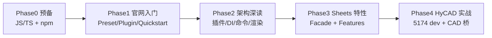

# Univer OSS 深入学习 — 目录索引

> **元信息**
> - 层级：Application / Domain（CS · 嵌入式 Office SDK）
> - 方法论：第一性原理学习（Cursor skill `first-principles-learning`：8 层路径 + 15 问）
> - 官方文档入口：https://docs.univer.ai/
> - 本仓库代码：`src/HyCADTool.UniverEditor/`
> - 编制日期：2026-07-01

---

## 一、本目录是什么

`docs/product-discovery/table/learn/` 是 **Univer OSS 系统学习区**：以官网文档为主线，用第一性原理拆骨架，再对照 HyCAD 仓库实战。

与 sibling 文档的分工：

| 文档 | 角色 |
|------|------|
| [../022-Univer-OSS-第一性原则学习](../022-Univer-OSS-第一性原则学习-2026-06-26-035256.md) | **15 问主文档**（概念、公理、OSS/Pro 边界） |
| [../new/13-UniverEditor源码跟读学习路径](../new/13-UniverEditor源码跟读学习路径-2026-06-29-143000.md) | **HyCAD 仓库 boot 跟读**（`main.ts` 六段） |
| **本目录 `learn/`** | **官网文档逐章学习路线 + 进度 + 笔记落点** |

---

## 二、推荐学习顺序（四阶段）

> **正在改布局 UI？** 直接走 **[04-布局UI深入学习路线](./04-布局UI深入学习路线-2026-07-01-120000.md)**。  
> **学 Facade API 与项目用法？** 直接走 **[05-Facade-API深入学习](./05-Facade-API深入学习-2026-07-01-120000.md)**。

| 阶段 | 文档 | 官网章节 | 产出 |
|------|------|----------|------|
| **Phase 0** | [02-预备知识清单](./02-预备知识清单-2026-07-01-120000.md) | — | 能读 TS、跑 `npm run dev` |
| **Phase 1** | [01-官网文档学习路线图 §1](./01-官网文档学习路线图-2026-07-01-120000.md#phase-1-接入与运行) | Sheets Quickstart · Preset/Plugin | 最小 Univer 实例 |
| **Phase 2** | [01-官网文档学习路线图 §2](./01-官网文档学习路线图-2026-07-01-120000.md#phase-2-架构第一性) | Architecture · Command · Rendering | 能解释 HyCAD `registerPlugin` 顺序 |
| **Phase 3** | [01-官网文档学习路线图 §3](./01-官网文档学习路线图-2026-07-01-120000.md#phase-3-sheets-特性与-facade) | Facade · Features · API Reference | 能用 `univerAPI` 改行列/缩放 |
| **Phase 4** | [../new/13](../new/13-UniverEditor源码跟读学习路径-2026-06-29-143000.md) | — | 改布局 Tab / mm / 标尺 |

进度勾选见 [03-学习进度表](./03-学习进度表-2026-07-01-120000.md)。

---

## 三、8 层路径 ↔ 官网映射（速查）

| 8 层 | Univer OSS 对应 | 官网必读 |
|------|-----------------|----------|
| 1 研究对象 | 可嵌入 Office SDK（Sheet/Doc/Slide） | [What is Univer Sheets](https://docs.univer.ai/guides/sheets) |
| 2 核心问题 | 不自研 Excel 级编辑器 | [020 选型](../020-表格编辑器开源框架选型-产品调研-2026-06-26-021244.md) |
| 3 基本变量 | Workbook / Sheet / Cell / Snapshot / Zoom | [Snapshot 概念](https://docs.univer.ai/guides/docs/getting-started/quickstart) |
| 4 公理/假设 | 插件优先 · 命令改状态 · 分层单向依赖 | [Architecture](https://docs.univer.ai/guides/recipes/architecture/univer) |
| 5 基础模型 | Plugin + DI(redi) + COMMAND/MUTATION/OPERATION | 同上 + Command System 章节 |
| 6 推导 | Facade 封装底层 → `FUniver.newAPI` | [Facade API](https://docs.univer.ai/guides/sheets/getting-started/facade) |
| 7 适用边界 | OSS vs Pro · 浏览器 vs Node Headless | [Pro 对照](https://docs.univer.ai/guides/sheets/getting-started/pro) · GitHub README |
| 8 工程实现 | HyCAD WebView2 + `HyCADTool.UniverEditor` | [new/09 代码地图](../new/09-Univer-TS与C-WPF代码第一性白话地图-2026-06-28-180000.md) |

15 问完整展开见 [022](../022-Univer-OSS-第一性原则学习-2026-06-26-035256.md)。

---

## 四、笔记落点规则

| 类型 | 路径 | 命名 |
|------|------|------|
| 官网章节摘要 | `learn/notes/` | `NN-章节简称-YYYY-MM-DD-HHMMSS.md` |
| 第一性深钻 | `learn/` 或 `research/Domain/计算机科学/Web前端与TypeScript/` | `NN-主题-第一性原理学习.md` |
| HyCAD 实战复盘 | `../new/` | 沿用现有 `new/NN-` 编号 |

读官网每章后至少写：**3 条 takeaway + 1 条 HyCAD 对照 + 1 条陷阱**。

---

## 五、常用链接

- 官网首页：https://docs.univer.ai/
- Sheets 指南：https://docs.univer.ai/guides/sheets
- 架构：https://docs.univer.ai/guides/recipes/architecture/univer
- Facade：https://docs.univer.ai/guides/sheets/getting-started/facade
- API Reference：https://docs.univer.ai/reference/classes/univer
- GitHub：https://github.com/dream-num/univer
- HyCAD dev：`src/HyCADTool.UniverEditor/Web` → `npm run dev`（5174）

---

## 六、文档元数据

- 创建日期：2026-07-01
- 维护者：HyCAD 表格/UniverEditor 线
- 后续扩展建议：
  - `04-Phase2-架构笔记-第一性原理学习.md`（Architecture 15 问展开）
  - `05-命令系统与布局Tab对照.md`（COMMAND/MUTATION ↔ `SetZoomRatioCommand` 等）
  - 同步更新 `03-学习进度表` 勾选状态
