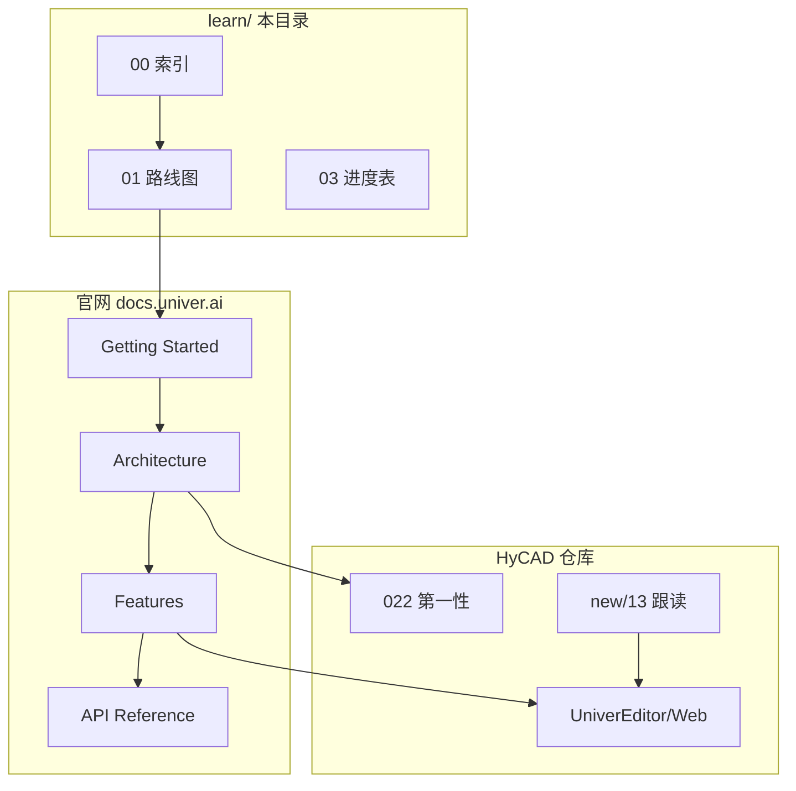

# Univer OSS 官网文档学习路线图

> **元信息**
> - 层级：Application（官网文档 → HyCAD 落地）
> - 上游：[00-学习目录索引](./00-Univer-OSS-学习目录索引-2026-07-01-120000.md) · [022-第一性原则](../022-Univer-OSS-第一性原则学习-2026-06-26-035256.md)
> - 官方入口：https://docs.univer.ai/
> - 编制日期：2026-07-01

---

## 一、问题重述

**对象**：Univer 官网文档（Sheets 为主，Architecture/Facade 为辅）。

**痛点**：文档按功能平铺，缺少与 HyCAD 嵌入场景、第一性公理的对照；直接读 Features 容易「只会调 API、不懂命令/渲染/容器尺寸」。

**一句话答案**：按 **接入 → 架构 → 特性 → 实战** 四段读；每段对照 022 的 15 问与 `HyCADTool.UniverEditor/Web/src/main.ts`。

---

## Phase 1 · 接入与运行

**目标**：能在浏览器跑起最小 Sheets，理解 Preset vs Plugin 两种集成模式。

| 顺序 | 官网 URL | 读什么 | HyCAD 对照 |
|------|----------|--------|------------|
| 1.1 | https://docs.univer.ai/guides/sheets | What is Sheets · 兼容性 · 如何读文档 | 为何选 WebView2 + Chromium ≥70 |
| 1.2 | https://docs.univer.ai/guides/sheets/getting-started/quickstart | Preset 模式 · `createUniver` · 容器 `#app` | HyCAD 用 **Plugin 模式**（更细控制） |
| 1.3 | https://docs.univer.ai/guides/sheets/getting-started/integrations/node | Node Headless · 无 UI 插件 | 未来服务端快照/批处理 |
| 1.4 | https://docs.univer.ai/guides/sheets/getting-started/pro | OSS vs Pro 能力表 | 协作/xlsx 导入等 **不在 OSS** |

**动手**：在 `examples/` 或官方 CodeSandbox 跑 Quickstart；对比 `Web/src/main.ts` 的 `registerPlugin` 列表。

**结构工程类比**：Quickstart = **标准图集样板房**；HyCAD Plugin 模式 = **按项目改结构图逐根加梁**。

---

## Phase 2 · 架构第一性

**目标**：掌握插件、DI、生命周期、命令三层，能解释「改布局为何要走 page-viewport 编排而不是直接改 DOM」。

| 顺序 | 官网 URL | 读什么 | HyCAD 对照 |
|------|----------|--------|------------|
| 2.1 | https://docs.univer.ai/guides/recipes/architecture/univer | 插件划分 · 类型 · 生命周期 Starting→Steady | `main.ts` 插件注册顺序 |
| 2.2 | 同上 · Modules 章节 | View/Controller/Command/Service/Model 分层 | `sheets-ui` vs `sheets` 分包 |
| 2.3 | 同上 · Command System | COMMAND / MUTATION / OPERATION | `SetZoomRatioCommand` · `SetRowHeaderWidthCommand` |
| 2.4 | https://docs.univer.ai/guides/recipes/architecture/csv-import-plugin | 写插件范例（可选深读） | HyCAD `install*` 注入模式 |
| 2.5 | Rendering 子文档（架构 Further Reading） | Canvas2D · viewport · skeleton | 布局 Tab 模糊/点击/边界问题根因 |

**第一性锚点（Q4 公理）**：

1. 未注册插件 = 能力不存在  
2. 持久化数据变更必须经 **MUTATION**（经 COMMAND 编排）  
3. 分层单向依赖：Model → Service → Command → Controller → View  

**陷阱（Q9）**：在 `[data-range-selector]` 上 CSS `transform` 做布局 — Univer 命中检测与 canvas 尺寸不同步（见布局 Tab 踩坑）。

---

## Phase 3 · Sheets 特性与 Facade

**目标**：用 Facade API 完成日常表格操作；知道何时必须下沉到 Command ID。

| 顺序 | 官网 URL | 读什么 | HyCAD 对照 |
|------|----------|--------|------------|
| 3.1 | https://docs.univer.ai/guides/sheets/getting-started/facade | `FUniver.newAPI` · 生命周期 Render/Steady | 全局 `window.univerAPI` |
| 3.2 | https://docs.univer.ai/guides/sheets/features/core | 行列 · 选区 · 缩放 · 滚动 | `layout-grid-fit` · `page-viewport` |
| 3.3 | Features 子页（按需） | 合并 · 边框 · 数字格式 · 冻结 | Domain `TableGrid` 字段 |
| 3.4 | https://docs.univer.ai/reference/classes/univer | API Reference 查阅法 | `onCommandExecuted` 监听 |
| 3.5 | https://docs.univer.ai/blog/facade | Facade 设计动机 · 分包 facade 入口 | `@univerjs/sheets/facade` 按需 import |

**Snapshot 注意（官网 Quickstart）**：Snapshot 只存数据，**不反映运行时 UI 状态**；保存文档要用 Facade 的 save 方法。

**HyCAD 必对照文件**：

- `univer-bridge.ts` — 快照 JSON 进出  
- `sheet-headers.ts` — header API 恒定 + CSS 可见性  
- `layout-sheet-geometry.ts` — CellRegion / HeaderBleed 几何分层  

---

## Phase 4 · HyCAD 实战（仓库内文档）

官网读完后回到仓库，按 boot 顺序跟读：

| 顺序 | 文档 | 内容 |
|------|------|------|
| 4.1 | [new/13](../new/13-UniverEditor源码跟读学习路径-2026-06-29-143000.md) | `bootstrap()` 六段 · 5174 五关练习 |
| 4.2 | [new/12](../new/12-UniverEditor内部mm统一计算原则-第一性原理学习-2026-06-29-120000.md) | mm 公理 · DPM · zoom |
| 4.3 | [new/09](../new/09-Univer-TS与C-WPF代码第一性白话地图-2026-06-28-180000.md) | 39 文件字典 |
| 4.4 | [new/04](../new/04-Univer布局Tab落地进度与后续工作-2026-06-27-020000.md) | 布局 Tab 进度 |

**验收闭环**：5174 dev 改 inject/CSS → `npm run build` → CAD C2→N38。

---

## 官网 Sidebar 建议跟读顺序（Sheets）

与官网左侧导航一致，避免跳读：

1. Getting Started → Quickstart → Facade → Node → Pro  
2. Recipes → Architecture →（CSV Plugin）  
3. Features → Core →（按需各子特性）  
4. Reference → 按需查类/命令  

搜索：官网 `Ctrl+K` / `Cmd+K`。

---

## 知识图谱位置

---

## 文档元数据

- 创建日期：2026-07-01
- 后续扩展：`learn/notes/` 下按 Phase 拆章节摘要
