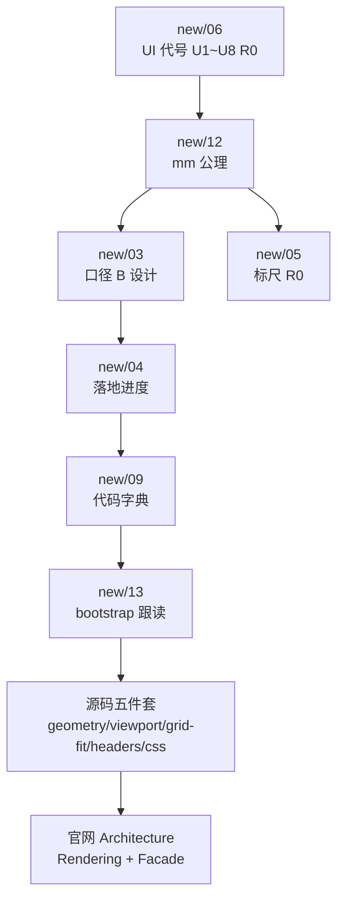

# 布局 UI 调整 — 深入学习路线（当前主题）

> **适用**：你在改布局 Tab、纸张边界、行列头/网格几何、标尺、mm 缩放、5174 页面视觉。  
> **跳过**：Univer 通用 Quickstart / 公式 / Pro 协作（见 [01-官网路线图](./01-官网文档学习路线图-2026-07-01-120000.md)）。  
> 编制日期：2026-07-01

---

## 0. 三句话先答

| 问题 | 读哪里 |
|------|--------|
| **页面上每一块叫什么、改哪个文件？** | [new/06 UI 沟通地图](../new/06-Univer编辑器UI区域沟通地图-2026-06-28-143000.md) |
| **mm / zoom / 纸格为什么要一起算？** | [new/12 mm 公理](../new/12-UniverEditor内部mm统一计算原则-第一性原理学习-2026-06-29-120000.md) + [LAYOUT_FIX_PLAN](../../../src/HyCADTool.UniverEditor/Web/LAYOUT_FIX_PLAN.md) |
| **行列头 vs 网格区怎么分层、别混算？** | 本文 §3 + `layout-sheet-geometry.ts` + `page-viewport.ts` |

**5174 自测**：`cd src/HyCADTool.UniverEditor/Web && npm run dev` → 布局 Tab → 开「纸张边界」→ 开关「行列头」→ Ctrl+滚轮。

---

## 1. 推荐阅读顺序（按改 UI 的依赖链）



| 顺序 | 文档 | 时间 | 你会得到什么 |
|------|------|------|--------------|
| **①** | [new/06 UI 沟通地图](../new/06-Univer编辑器UI区域沟通地图-2026-06-28-143000.md) | 15 min | U1–U8、R0、D1 代号；Word 式三层（标尺 / 行列头 / 白纸）；DOM 选择器 |
| **②** | [new/12 mm 统一计算](../new/12-UniverEditor内部mm统一计算原则-第一性原理学习-2026-06-29-120000.md) | 25 min | 纸面 mm 为真相；px 仅显示；`DISPLAY_PX_PER_MM` · zoom · Scale 分工 |
| **③** | [new/03 布局 Tab 设计](../new/03-Univer布局Tab与mm尺寸对齐-02修订版-2026-06-27-011500.md) | 20 min | 口径 B、纸张边界、行列数、边距的设计意图 |
| **④** | [new/04 落地进度](../new/04-Univer布局Tab落地进度与后续工作-2026-06-27-020000.md) | 10 min | 哪些 ✅ / 🟡 / ❌；别重复造已完成功能 |
| **⑤** | [new/05 mm 标尺](../new/05-Univer内mm标尺与Facade白话-2026-06-28-120000.md) | 15 min | R0 与 U7 对齐；`ruler-overlay.ts` |
| **⑥** | [new/09 代码地图](../new/09-Univer-TS与C-WPF代码第一性白话地图-2026-06-28-180000.md) | 查阅用 | 39 个 TS 文件索引 |
| **⑦** | [new/13 bootstrap 跟读](../new/13-UniverEditor源码跟读学习路径-2026-06-29-143000.md) §2.5–2.6 | 30 min | `installPageViewport` 在 boot 链中的位置 |
| **⑧** | 本文 §2–§4 源码 + [LAYOUT_FIX_PLAN](../../../src/HyCADTool.UniverEditor/Web/LAYOUT_FIX_PLAN.md) | 20 min | 编排顺序、几何分层、近期踩坑 |
| **⑨** | 官网 [Architecture · Rendering](https://docs.univer.ai/guides/recipes/architecture/univer) | 按需 | Univer viewport/canvas 为何忌 CSS transform |

进度勾选：[03-学习进度表](./03-学习进度表-2026-07-01-120000.md) 中「布局 UI 专轨」小节。

---

## 2. 当前 UI 主题 ↔ 源码对照（改哪里）

### 2.1 纸张 + 网格 + 缩放（你最近在改的核心）

| 现象 / 需求 | 第一读 | 第二读 |
|-------------|--------|--------|
| 纸格不同步、溢出、右下留白 | `page-viewport.ts` | `layout-grid-fit.ts` |
| 行列头开关影响 A1 / 尺寸 | `layout-sheet-geometry.ts` | `sheet-headers.ts` |
| 模糊、点头失效、边界不贴 | `layout-sheet-geometry.ts` · `HeaderBleed` | `global.css` · `.hycad-cell-viewport` |
| Ctrl+滚轮缩放 | `page-preview-scale.ts` | `page-viewport.ts` · `snapZoomToGridEdge` |

**编排不变式**（[`LAYOUT_FIX_PLAN`](../../../src/HyCADTool.UniverEditor/Web/LAYOUT_FIX_PLAN.md)）：

```
一个 tick：geometry → sheetBox DOM → grid-fit → 读 colSum → zoom → refreshCanvas
```

### 2.2 几何四层（勿混算）

| 层 | 职责 | 文件 |
|----|------|------|
| **PaperBox** | 纸型 × ppm + 边距 padding | `layout-sheet-geometry.ts` |
| **CellRegion** | grid-fit / 贴边目标（与 showHeaders 无关） | 同上 |
| **HeaderBand** | 行头 46 / 列头 20，visible 仅 CSS | `sheet-headers.ts` + `global.css` |
| **HeaderBleedViewport** | Univer 宿主尺寸 + 负边距（无 transform） | `page-viewport.ts` · `applySheetBoxSizing` |

### 2.3 布局 Tab 与视图开关

| UI | 源码 |
|----|------|
| U3 布局 Ribbon | `layout-tab-inject.ts` · `layout-ribbon-panel.tsx` |
| 视图状态（纸边界/行列头/标尺） | `layout-view-state.ts` · `layout-ribbon-model.ts` |
| 行列头 mm 标签 | `grid-ruler-overlay.ts` |
| 外挂 mm 标尺 R0 | `ruler-overlay.ts` · `univer-viewport.ts` |
| 样式 / flex 覆盖 | `global.css` |

### 2.4 boot 安装顺序（改 UI 前先定位）

`main.ts` 中与布局 UI 相关的 `install*`（详见 new/13 §2.5）：

- `installPageViewport` — 纸张盒子唯一编排者  
- `installHeadersToggle` — 行列头 CSS/API  
- `installGridRulerOverlay` — 网格尺寸标注  
- `installRulerOverlay` — R0 标尺  
- `subscribeLayoutViewState` — 各模块联动  

---

## 3. 近期踩坑速查（读文档 + 代码时对照）

| 症状 | 根因 | 正确做法 |
|------|------|----------|
| 关行列头后网格变大 | `SetRowHeaderWidth(0)` 改变 Univer 内部分配 | API 恒 46/20，仅 CSS 隐藏 |
| 整体模糊 | cellViewport 过小 + canvas 被挤压 | HeaderBleed 负边距，宿主 = CellRegion + header 带 |
| 点行头/列头无效 | 整棵 `data-range-selector` 上 CSS transform | **禁止 transform**；用 bleed 定位 |
| 右下封口线丢 | zoom 量化不足 | `snapZoomToGridEdge` ceil 贴边 |
| grid-fit 与 zoom 各算各的 | 双编排 | 仅 `page-viewport` 编排 |

---

## 4. 官网文档（UI 相关最小集）

不必读完全部 Features；改布局 UI 时只看：

1. [Architecture · Plugins & Lifecycle](https://docs.univer.ai/guides/recipes/architecture/univer) — 为何用 Command 设 zoom/header  
2. [Architecture · Command System](https://docs.univer.ai/guides/recipes/architecture/univer) — `SetZoomRatioCommand` / `SetRowHeaderWidthCommand`  
3. [Facade · Lifecycle Render/Steady](https://docs.univer.ai/guides/sheets/getting-started/facade) — 何时可调 `univerAPI`  
4. Rendering（Architecture 文末 Further Reading）— viewport 与容器尺寸  

---

## 5. 动手验证清单（每改一版 UI 跑一遍）

1. 布局 Tab + **纸张边界** 开  
2. 开关 **行列头** → A1 位置不变、网格右/下边界不变  
3. **Ctrl+滚轮** → 纸与格同步缩放，封口线贴边  
4. 点 **行头/列头** → 可选中整行/列  
5. 文字/网格线 **清晰**（无整体糊）  
6. A3 + 边距 30 + 放大超出画布 → 裁切、无滚动条  

---

## 6. 笔记落点

读完后在 `learn/notes/` 写：

- `01-UI沟通地图-摘要.md`  
- `02-mm公理与布局Tab-摘要.md`  
- `03-geometry分层-摘要.md`（CellRegion / HeaderBleed 用自己的话复述）

模板：3 条 takeaway + 1 条「我改 XX 文件因为…」+ 1 条陷阱。

---

## 7. 文档元数据

- 创建日期：2026-07-01  
- 上游：[00-学习目录索引](./00-Univer-OSS-学习目录索引-2026-07-01-120000.md)  
- 代码快照：`layout-sheet-geometry.ts` · `page-viewport.ts` · `sheet-headers.ts`
